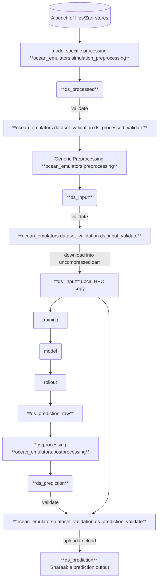

# ocean_emulators
[](https://results.pre-commit.ci/latest/github/m2lines/ocean_emulators/main)

## Data flow diagram



## Producing Input and Prediction Datasets

### Preprocessed Datasets (`ds_processed`)
This is the only model specific step produced by modules in `ocean_emulators.simulation_preprocessing.<model_module>`. The output `ds_processed` can then be fed into the generic preprocessing steps to produce the input dataset. These functions should not modify the data in any other way than interpolating velocity data onto the tracer points (the setup/execution of which might depend on the source).

Example:
```python
from ocean_emulators.simulation_preprocessing.gfdl_om4 import om4_preprocessing

zarr_data_path = 'gs://leap-persistent/jbusecke/ocean_emulators/OM4/OM4_raw_test.zarr'
nc_grid_path = 'gs://leap-persistent/sd5313/OM4-5daily/ocean_static_no_mask_table.nc'
nc_mosaic_path = "gs://leap-persistent/sd5313/OM4-5daily/ocean_hgrid.nc"
ds_processed = om4_preprocessing(zarr_data_path, nc_grid_path, nc_mosaic_path)
```

#### QC
To ensure that the output of model specific preprocessing is correct, run the validation function before applying further steps:
```python
from ocean_emulators.dataset_validation import ds_processed_validate

ds_processed_validate(ds_processed, deep=True) # deep enables long-running tests that check for nan consistency on the entire dataset
```

### Input Datasets (`ds_input`)

#### QC
To ensure that an input dataset adheres to the most recent checks please always run the following before publishing/uploading:
```python
from ocean_emulators.dataset_validation import ds_input_validate
ds = ...
ds_input_validate(ds, deep=True) # deep enables long-running tests that check for nan consistency on the entire dataset
```

### Prediction Datasets

#### Postprocessing Raw prediction output
We aim to not upload the raw prediction output. Instead use the postprocessor to create an xarray dataset that is formattes as much as possible as the input data:

```python
from ocean_emulators.postprocessing import post_processor
ds_input = ... # load datasets that was used for the training of this model
ds_truth = ds_input.isel(time=...) # select the timesteps that are considered the ground-truth to compare predictions against
ds_raw_prediction = ... # output from the inference/prediction
ds_prediction = post_processor(ds_raw_prediction, ds_truth)
```

#### QC
Before uploading please always run the most recent checks
```python
from ocean_emulators.postprocessing import prediction_data_test
ds_prediction = ... # see above
ds_truth = ...# see above
prediction_data_test(ds_prediction, ds_truth)
```

## Where is the data?


### Raw data
| input_id | Cloud | Greene |
| --- | --- | --- |
| `'OM4_5daily'` | `'gs://leap-persistent/jbusecke/ocean_emulators/OM4/OM4_raw_test.zarr'` |`'/scratch/aa9537/OM4-5daily/'` |
| `"10_year_CM4_ocean_5daily"` | `"gs://leap-persistent/m2lines/ai2_colab/2024-08-10-CM4-trial-run-output/ocean_5daily.zarr"`| |
| `"10_year_CM4_ice_5daily"` | `"gs://leap-persistent/m2lines/ai2_colab/2024-08-10-CM4-trial-run-output/ice_5daily.zarr"` | |
| `"10_year_CM4_ocean_6hourly"` | `"gs://leap-persistent/m2lines/ai2_colab/2024-08-10-CM4-trial-run-output/ocean_6hourly.zarr"` | |
| `"10_year_CM4_ice_6hourly"` | `"gs://leap-persistent/m2lines/ai2_colab/2024-08-10-CM4-trial-run-output/full_state_ice.zarr"` | |

### Input data

| input_id | Cloud |
| --- | --- |
| `'OM4_5daily_v0.0'` | `"gs://leap-persistent/sd5313/input_OM4v0.0"` |
| `'OM4_5daily_v0.2.1'` | `"gs://leap-persistent/jbusecke/ocean-emulators/OM4_5daily_v0.2.1.zarr"`|
| `"CMIP_CM4_v0.1"` | `"gs://leap-persistent/jbusecke/ocean-emulators/CMIP6_GFDL-CM4.piControl.r1i1p1f1_v0.1.zarr"` |


## Developing this package

Set up a fresh mamba environment (optional but recommended)

```bash
mamba create -n=ocean_emulators_dev python=3.10
mamba activate ocean_emulators_dev
pip install -e ".[dev]"
```

>[!NOTE]
> If you are using conda instead of mamba, you can replace `mamba` with `conda` above

Now install this package with all the developer extra dependencies

```
pip install -e ".[dev]"
```

Before you edit the code make sure all tests pass by running pytest from the root level of this repository
```
pytest
```

### Code Linting

We use [pre-commit.ci](https://results.pre-commit.ci/) to run the CI linting checks.

You can configure pre-commit to run locally on every commit like this:

```
pre-commit install
```

and if you want to run the linting manually do:

```
pre-commit run --all-files
```

>[!TIP]
> You can also commit and bypass these checks (not generally recommended)
> ```
> git commit -m "some message" --no-verify
> ```

## Developing the documentation page

Clone this repository and navigate into the `docs/` folder

Set up a new environment for the docs
```
mamba env create -f environment.yaml
mamba activate ocean_emulators_docs
```

Build the html docs with
```
jupyter-book build .
```

You can then look at them
```
open _build/html/index.html
```
