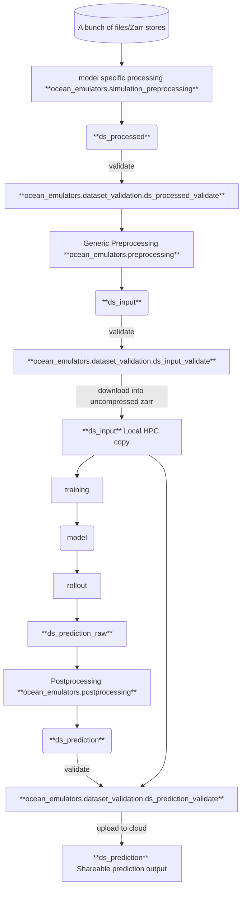

# ocean_emulators
[](https://results.pre-commit.ci/latest/github/m2lines/ocean_emulators/main)
[](https://github.com/m2lines/ocean_emulators/actions/workflows/tests.yaml)
[](https://github.com/m2lines/ocean_emulators/actions/workflows/tests_xesmf.yaml)

Data engineering routines to prepare ocean simulations for neural emulation.

## Usage via command line interface

First, please clone this repository:
```bash
git clone https://github.com/m2lines/ocean_emulators.git
# recommended: via ssh -- requires additional setup
git clone git@github.com:m2lines/ocean_emulators.git
```

Next, create a local environment from the `mamba_env.yaml` file with conda, mamba or pixi. Here is an example using
mamba:

```bash
mamba create -f mamba_env.yaml
```

Now, you should be able to use this package as a CLI! You can call it like so:

```bash
python -m ocean_emulators -h
```

This opens up the help pages and documents the CLI's subcommands and common arguments.
Currently, only the following subcommand is supported:

```bash
python -m ocean_emulators om4 -h
```

### Example usage

Example: Test out this CLI on a small, dry run (this will process a small portion of the data and not write any output):

```bash
# Check if you have the right envvars set:
# set | grep AWS
# set | grep FSSPEC
# If not, set vars needed to authenticate data access
export FSSPEC_S3_ENDPOINT_URL=https://nyu1.osn.mghpcc.org/
# Check with M2LInES project management for how to get the OSN Access keys.
export AWS_ACCESS_KEY_ID=...
export AWS_SECRET_ACCESS_KEY=...
# Then, run the standard OM4 processing pipeline:
python -m ocean_emulators om4 \
   "s3://emulators/jbusecke/ocean_emulators/OM4/OM4_raw_test.zarr" \
   "s3://emulators/am16581/ocean_static_no_mask_table.zarr" \
   "s3://emulators/am16581/grids/ocean_hgrid.zarr" \
   "s3://emulators/am16581/grids/gaussian_grid_360_by_720.zarr" \
    --output_path="./local_om4_test.zarr" \
    --dry_run \
    --small_run
# ... [prints status messages]
# <xarray.Dataset> Size: 829MB
# Dimensions:    (time: 10, y: 360, x: 720)
# Coordinates:
#   * time       (time) object 80B 1958-01-03 12:00:00 ... 1958-02-17 12:00:00
#   * y          (y) float64 3kB -89.62 -89.12 -88.62 -88.13 ... 88.62 89.12 89.62
#   * x          (x) float64 6kB 0.25 0.75 1.25 1.75 ... 358.2 358.8 359.2 359.8
# Data variables: (12/80)
#     hfds       (time, y, x) float32 10MB nan nan nan ... 0.3576 0.3585 0.3594
#     tauuo      (time, y, x) float32 10MB nan nan nan ... -0.02243 -0.02271
# ...
```

Example: Run a real data processing pipeline on a coiled cluster:

```bash
# These exports are needed in order to write to the OSN pod in practice.
export AWS_REQUEST_CHECKSUM_CALCULATION=when_required
export AWS_RESPONSE_CHECKSUM_VALIDATION=when_required
# Check if you have the right envvars set:
# set | grep AWS
# set | grep FSSPEC
# If not, set vars needed to authenticate data access
export FSSPEC_S3_ENDPOINT_URL=https://nyu1.osn.mghpcc.org/
# Check with M2LInES project management for how to get the OSN Access keys.
export AWS_ACCESS_KEY_ID=...
export AWS_SECRET_ACCESS_KEY=...
# Then, run the standard OM4 processing pipeline:
python -m ocean_emulators om4 \
   "s3://emulators/jbusecke/ocean_emulators/OM4/OM4_raw_test.zarr" \
   "s3://emulators/am16581/ocean_static_no_mask_table.zarr" \
   "s3://emulators/am16581/grids/ocean_hgrid.zarr" \
   "s3://emulators/am16581/grids/gaussian_grid_360_by_720.zarr" \
    --output_path="s3://emulators/am16581/om4_halfdeg_testrun.zarr" \
    --cluster="coiled" \
    --wait_for_workers=True
```

That's how you can run this package as a command-line utility! Beyond this, `ocean_emulators` can be used a library
in a script or notebook. Continue reading to get a better understanding of this package's capabilities.

## Preprocessing

This repository is currently being used to preprocess ocean datasets.

### Preprocessing steps

1. Interpolation of variables at the cell boundaries to the cell centers
2. Coarsening time-resolution of input data to 5-day simple average
3. Rotation of velocities and wind stresses so that the variables indicate purely zonal (east-west) and meridional (north-south) flow, respectively.
4. Spatial filtering with 18 x 18 gaussian kernel
5. Horizontal regridding of native 0.25 degree data to 1 degree data

### Preprocessing files
These files live on the OSN pod:
- Data: https://nyu1.osn.mghpcc.org/emulators/ai2_colab/2024-11-01-CM4-pre-industrial-control-simulation/ocean_5daily.zarr
- Gaussian Grid: https://nyu1.osn.mghpcc.org/emulators/ai2_colab/2024-08-01-sample-raw-CM4-data/gaussian_grid_180_by_360.nc
- Mosaic File: https://nyu1.osn.mghpcc.org/emulators/ai2_colab/2024-11-11-static-data/ocean_hgrid.nc
- Static Data File: https://nyu1.osn.mghpcc.org/emulators/ai2_colab/2024-11-11-static-data/ocean_static_no_mask_table.nc

### Possible issues

1. Rotation of wind stresses (not done in this repo)
2. Filtering across the Tripolar fold - https://github.com/m2lines/ocean_emulators/issues/69
3. Setting threshold for land/ocean/sea-ice?
4. Double check that interpolation of velocities are done correctly - Specifically, lon and lat are being used and not xh and yh.
5. Vertical regridding - Handling partial grid cells
6. Discontinuity with rotation before filtering  - https://github.com/m2lines/ocean_emulators/issues/69


## Data flow diagram



## Producing Input and Prediction Datasets

### Preprocessed Datasets (`ds_processed`)
This is the only model specific step produced by modules in `ocean_emulators.simulation_preprocessing.<model_module>`. The output `ds_processed` can then be fed into the generic preprocessing steps to produce the input dataset. These functions should not modify the data in any other way than interpolating velocity data onto the tracer points (the setup/execution of which might depend on the source).

Example:
```python
from ocean_emulators.simulation_preprocessing.gfdl_om4 import om4_preprocessing

zarr_data_path = 'gs://leap-persistent/jbusecke/ocean_emulators/OM4/OM4_raw_test.zarr'
nc_grid_path = 'gs://leap-persistent/sd5313/OM4-5daily/ocean_static_no_mask_table.nc'
nc_mosaic_path = "gs://leap-persistent/sd5313/OM4-5daily/ocean_hgrid.nc"
ds_processed = om4_preprocessing(zarr_data_path, nc_grid_path, nc_mosaic_path)
```

#### QC
To ensure that the output of model specific preprocessing is correct, run the validation function before applying further steps:
```python
from ocean_emulators.dataset_validation import ds_processed_validate

ds_processed_validate(ds_processed, deep=True) # deep enables long-running tests that check for nan consistency on the entire dataset
```

### Input Datasets (`ds_input`)

#### QC
To ensure that an input dataset adheres to the most recent checks please always run the following before publishing/uploading:
```python
from ocean_emulators.dataset_validation import ds_input_validate
ds = ...
ds_input_validate(ds, deep=True) # deep enables long-running tests that check for nan consistency on the entire dataset
```

### Prediction Datasets

#### Postprocessing Raw prediction output
We aim to not upload the raw prediction output. Instead use the postprocessor to create an xarray dataset that is formattes as much as possible as the input data:

```python
from ocean_emulators.postprocessing import post_processor
ds_input = ... # load datasets that was used for the training of this model
ds_truth = ds_input.isel(time=...) # select the timesteps that are considered the ground-truth to compare predictions against
ds_raw_prediction = ... # output from the inference/prediction
ds_prediction = post_processor(ds_raw_prediction, ds_truth)
```

#### QC
Before uploading please always run the most recent checks
```python
from ocean_emulators.postprocessing import prediction_data_test
ds_prediction = ... # see above
ds_truth = ...# see above
prediction_data_test(ds_prediction, ds_truth)
```

## Where is the data?


### Raw data
| input_id | Cloud | Greene |
| --- | --- | --- |
| `'OM4_5daily'` | `'https://nyu1.osn.mghpcc.org/emulators/jbusecke/ocean_emulators/OM4/OM4_raw_test.zarr'` |`'/scratch/aa9537/OM4-5daily/'` |
| `"CM4_5daily"`| `"https://nyu1.osn.mghpcc.org/emulators/ai2_colab/2024-11-01-CM4-pre-industrial-control-simulation/ocean_5daily.zarr/"`| |
| `"10_year_CM4_ocean_5daily"` | `"https://nyu1.osn.mghpcc.org/emulators/ai2_colab/2024-08-10-CM4-trial-run-output/ocean_5daily.zarr"`| |
| `"10_year_CM4_ice_5daily"` | `"https://nyu1.osn.mghpcc.org/emulators/ai2_colab/2024-08-10-CM4-trial-run-output/ice_5daily.zarr"` | |
| `"10_year_CM4_ocean_6hourly"` | `"https://nyu1.osn.mghpcc.org/emulators/ai2_colab/2024-08-10-CM4-trial-run-output/ocean_6hourly.zarr"` | |
| `"10_year_CM4_ice_6hourly"` | `"https://nyu1.osn.mghpcc.org/emulators/ai2_colab/2024-08-10-CM4-trial-run-output/full_state_ice.zarr"` | |

### Input data

| input_id | Cloud |
| --- | --- |
| `'OM4_5daily_v0.0'` | `"https://nyu1.osn.mghpcc.org/emulators/sd5313/input_OM4v0.0"` |
| `'OM4_5daily_v0.2.1'` | `"https://nyu1.osn.mghpcc.org/emulators/jbusecke/ocean-emulators/OM4_5daily_v0.2.1.zarr"`|
| `"CMIP_CM4_v0.1"` | `"https://nyu1.osn.mghpcc.org/emulators/jbusecke/ocean-emulators/CMIP6_GFDL-CM4.piControl.r1i1p1f1_v0.1.zarr"` |
| `"CM4_5daily_v0.4.0"`| `"https://nyu1.osn.mghpcc.org/emulators/jbusecke/ocean-emulators/CM4_5daily_v0.4.0.zarr"`|


## Developing this package

Follow the CLI usage instructions to clone the repository and create a local mamba environment. Then, please install
these three dev dependencies manually:

```bash
mamba install pytest dask pre-commit
```

Before you edit the code make sure all tests pass by running pytest from the root level of this repository
```
pytest
```

### Code Linting

We use [pre-commit.ci](https://results.pre-commit.ci/) to run the CI linting checks.

You can configure pre-commit to run locally on every commit like this:

```
pre-commit install
```

and if you want to run the linting manually do:

```
pre-commit run --all-files
```

>[!TIP]
> You can also commit and bypass these checks (not generally recommended)
> ```
> git commit -m "some message" --no-verify
> ```

## Developing the documentation page

Clone this repository and navigate into the `docs/` folder

Set up a new environment for the docs
```
mamba env create -f environment.yaml
mamba activate ocean_emulators_docs
```

Build the html docs with
```
jupyter-book build .
```

You can then look at them
```
open _build/html/index.html
```
