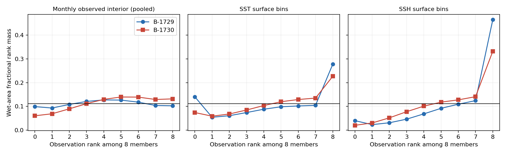
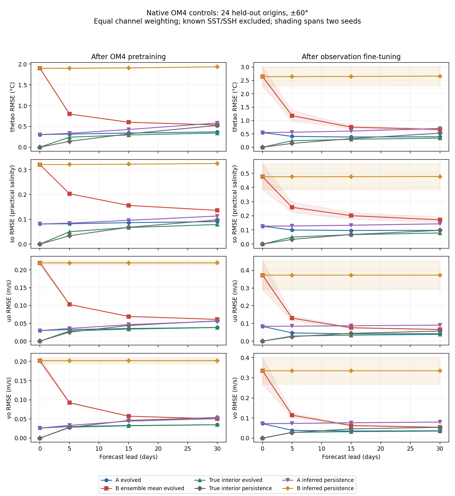
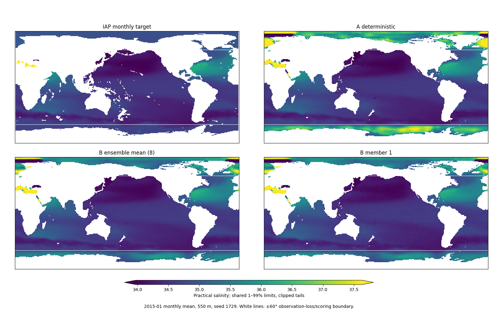

<!-- SPDX-FileCopyrightText: 2026 Samudra Authors -->
<!-- SPDX-License-Identifier: CC-BY-4.0 -->

# A/B results: a useful negative result, with a decoder limitation

The first wave is complete on Engaging: two seeds each for deterministic (A)
and diffusion (B) initialization, followed by observation fine-tuning with the
same frozen physical dynamics. **B improves monthly interior CRPS but worsens
ensemble-mean accuracy. Neither arm improves the selected upstream reference's
composite score.** Native OM4 controls reveal particularly poor B initialization,
and a synthetic diagnostic confirms a structural noise bottleneck in this decoder.
This is not yet a fair test of what a well-designed full-state diffusion initializer
can achieve. Repair that bottleneck before spending the next wave on latent evolution.

Completed allocations, including failures, probes, reports and controls, total
**21.4211 of 576 GPU-hours**. No training job remains active. C/D, H and E have not
run; the next submission requires the agreed wave approval.

## Contents

- [Protocol and scope](#protocol-and-scope)
- [Held-out point and probabilistic scores](#held-out-point-and-probabilistic-scores)
- [Calibration](#calibration)
- [Native initialization, true-interior and persistence controls](#native-initialization-true-interior-and-persistence-controls)
- [A decoder limitation](#a-decoder-limitation)
- [Fixed-date maps](#fixed-date-maps)
- [Recommended next wave](#recommended-next-wave)
- [Artifacts and reproduction](#artifacts-and-reproduction)

## Protocol and scope

Both arms share the surface-history initializer, width-64 joint decoder and frozen
pre-observation OM4 dynamics. A decodes once with unknown fields initialized to
zero; B uses an EDM denoiser and 16-step Heun sampling. The initializer supplies
conditioning features throughout the decoder. Both reconstruct two historical
77-channel ocean states, with known SST/SSH anchored. No future ocean observation
is supplied as forcing. Observation forcing comes through the ERA5 adapter.

Each of seeds 1729/1730 completed 12,000 OM4 updates and 6,000 observation updates,
batch one. A uses squared error; B uses denoising pretraining and fair-CRPS
observation training with two members. Both replay OM4 every fourth observation
update at weight 0.1. Thus A/B changes the training objective as well as stochastic
decoding; it is not an isolated sampling ablation. Eight independently evolved
members form B's reporting ensemble. Model selection uses fixed validation only.

Evaluation covers all 96 monthly origins in 2015–2022 and three annual origins
(2015/2018/2021 January 1). These are reused development cohorts, not a new blind
test. The current observation contract is **five-day surface bins and monthly IAP
interiors**, not daily surface or individual Argo-profile skill. Observation losses
and reported metrics are restricted to ±60° latitude. Native controls below also
retain separate global and outside-domain scores in their CSV.

The upstream selected reference has trainable dynamics, effective batch eight,
1,000 reconstruction and 8,000 joint updates. It is an anchor, not a matched A/B
control. Its checkpoint and observation manifests match the upstream published
report. The approved local Engaging OM4 releases were used; normalization remains
fixed across these comparisons. Half-degree targets have not been used yet.

## Held-out point and probabilistic scores

Lower is better. SST is the existing day-5/15/30 aggregate; OHC is in GJ/m².
The composite is the frozen upstream selection criterion evaluated on the test
cohort. B's point scores use the ensemble mean after evolving each member.

| Model | Composite | SST RMSE, °C | OHC 0–700 m | OHC 700–2000 m |
| --- | ---: | ---: | ---: | ---: |
| Upstream reference | 0.5914 | 0.5092 | 0.7090 | 0.4008 |
| A, 1729 | 0.7878 | 0.8731 | 0.6272 | 0.3950 |
| A, 1730 | 0.7788 | 0.8566 | 0.6622 | 0.4022 |
| B, 1729 | 1.0039 | 1.0891 | 0.7398 | 0.4613 |
| B, 1730 | 1.0572 | 1.0230 | 0.8059 | 0.4630 |

On the identically supported monthly interior channels, scores in fixed
observation-standardized units are:

| Model | Mean-field MSE | Mean-field MAE | Fair CRPS (A: point-mass CRPS) |
| --- | ---: | ---: | ---: |
| A, 1729 | 0.007794 | 0.059178 | 0.059178 |
| A, 1730 | 0.007552 | 0.058426 | 0.058426 |
| B, 1729 | 0.009016 | 0.062916 | 0.043710 |
| B, 1730 | 0.010108 | 0.066311 | 0.045520 |

B's fair CRPS improves by **26.1% and 22.1%** against the corresponding deterministic
seed (24.1% comparing seed averages). A 2,000-draw paired calendar-year bootstrap
gives 23.6–24.7%; that narrow interval is conditional on these two fitted seeds and
fixed evaluation noise, and excludes training and Monte Carlo uncertainty. Cells
are not treated as independent replicates. Scores pool wet-area numerators over
origins, divide by each channel's supported area, then average supported channels.

This CRPS advantage is a measured result, but does **not** establish realistic
instantaneous interior samples, useful velocity uncertainty, or a forecast advantage.
The native controls and decoder counterexample below make that distinction essential.

At day 365, averaging the three annual-origin RMSEs:

| Model | SST RMSE, °C | SSH/ADT RMSE, m |
| --- | ---: | ---: |
| Upstream reference | 1.2906 | 0.1536 |
| A, 1729 / 1730 | 1.9769 / 2.1362 | 0.5256 / 0.5220 |
| B, 1729 / 1730 | 1.7535 / 1.8464 | 0.5249 / 0.5218 |

B has lower year-end SST error than A, but both are worse than the reference and
both have large SSH drift. These are three one-year rollouts, not the eventual
8-year or 100-year evaluation. Surface-derived geostrophic velocity metrics in the
machine-readable results are not observations of interior velocity.

## Calibration



The reference is uniform mass 1/9 across the nine ranks for eight exchangeable
members. Interior ranks are reasonably central for seed 1729 and asymmetric for
1730; pooling depths and regions can conceal local miscalibration. Surface ranks
show substantial upper-tail mass, consistent with underprediction and inadequate
spread relative to error. Combined extreme-rank mass is 41.7%/30.1% for SST and
50.5%/35.2% for SSH, versus the exchangeable reference 22.2%.

Do not interpret an eight-member empirical “90% interval” against nominal 90%
coverage without a finite-ensemble correction: even the entire sample min/max
interval has expected coverage only 7/9 for exchangeable continuous draws.
Per-channel ranks, spreads and raw interval diagnostics are preserved in the
summary artifact. No post-hoc spread calibration has been fitted.

Final-weight validation checks at 8/16/32 Heun steps show roughly 1% changes in
interior MSE and less than 1% in CRPS from 16 to 32, but 6–9% changes in variance
and 2–3% surface-score changes. Sixteen is the frozen reporting protocol, not a
claim of exact sampler convergence.

## Native initialization, true-interior and persistence controls



These controls use 24 uniformly spaced native OM4 origins from 2015–2022, original
OM4 fluxes, the original native season/context convention and the identical frozen
physical dynamics. They bypass the ERA5 adapter. All labels remain within 2022.
The true-interior and true-persistence scores agree across all eight evaluated
checkpoints, and dynamics fingerprints match. These are model-world diagnostics,
not observed velocity skill.

The plot excludes anchored SST/SSH, weights supported depth channels equally, and
shows the two-seed mean with the seed range shaded. Lead-zero inferred-state RMSE:

| Stage/model | Temperature, °C | Salinity | u, m/s | v, m/s |
| --- | ---: | ---: | ---: | ---: |
| OM4 A | 0.3031 | 0.0814 | 0.0296 | 0.0263 |
| OM4 B ensemble mean | 1.8984 | 0.3205 | 0.2197 | 0.2019 |
| Observation A | 0.5502 | 0.1274 | 0.0837 | 0.0723 |
| Observation B ensemble mean | 2.6432 | 0.4758 | 0.3725 | 0.3348 |

B starts substantially worse even before observation fitting. Evolution rapidly
reduces much of B's initial error, while inferred persistence retains it. The
monthly observation operator therefore sees a much less damaged state than exists
at initialization. Observation fine-tuning worsens native reconstruction in both
arms, including velocities, despite replay. Domain adaptation can contribute to
that deterioration; it is not by itself proof of forgetting or of bad observation
skill. A small native velocity RMSE is also not proof of skill without a zero/
climatology velocity reference, which has not been evaluated here.

The true-interior curve provides an evolution-error reference. Its difference
from inferred initialization is a controlled comparison, not an additive
attribution of error variance in this nonlinear system. The CSV also includes
member-one errors and latitudes outside the observation domain.

## A decoder limitation

The decoder consumes 154 noisy channels and first projects them to 64 channels
with a convolution. Four known surface channels are anchored, leaving 150 unknown
channels. On a spatially constant all-wet patch, the trained stem has rank 64,
so **86 independent constant channel combinations are invisible to it**. All
subsequent conditioning and nonlinear processing sees the same features when such
a perturbation is added.

Yet the EDM output includes a fixed skip:

```text
denoised(x, sigma) = x / (1 + sigma²) + learned_residual(x, condition, sigma)
```

For an invisible perturbation `v`, the residual cannot react, so the denoised
output changes by exactly `v / (1 + sigma²)`. In the continuous sampling limit,
a unit perturbation to the initial Gaussian draw at sigma 80 survives with
amplitude `80 / sqrt(1 + 80²)`, approximately one. More training cannot learn to
cancel that perturbation through this stem.

A numerical counterexample uses the actual B-1729 OM4-pretrained decoder on an
8×12 all-wet patch, holds known surfaces fixed, and changes only one invisible
initial noise direction. The measured final amplitude is **1.300 / 1.058 / 1.013**
for 8/16/32 steps; deviations from that direction are below 0.000011 relative norm.
This is not rounding-scale noise. The example is deliberately synthetic: coastlines,
depth masks and realistic conditioning change the geometry, so it does **not**
quantify a global ocean error floor or establish how much of B's observed error it
caused. It does establish an architectural limitation that should be removed.

A does not inject full-state Gaussian noise, so equal decoder width does not make
this bottleneck equally harmful to A and B. The existing one-field diffusion pilot
also did not have this 150-to-64 compression. This finding is a limitation of the
present multichannel design, not evidence against diffusion initialization itself.

## Fixed-date maps

The dates and member number were fixed before examining results. Each saved map
panel uses exactly 2×2 image pixels per 1° grid cell, nearest-neighbor rendering,
and shared color limits across its four panels. Tails outside the shared 1–99%
limits clip; different dates have different limits. White lines mark the ±60°
observation-loss/scoring boundary. Sharp polar features remain visible rather
than being cropped away. These are **monthly means against IAP**, not instantaneous
OM4 truth. They do not by themselves establish realistic mesoscale structure.




## Recommended next wave

**Superseded after discussion:** the user authorized [direct from-scratch diffusion
pretraining](scratch-wave.md) against the unchanged deterministic baseline. The
width-ablation proposal below is retained as historical context and will not run.

**Request approval for a bounded decoder-repair wave before C/D.** Proposed cap:
32 additional allocated GPU-hours, included in the existing 576-hour ceiling.

1. Compare A/B at widths 64 and 192, seed 1729, with matched 3,000-update OM4-only
   pretraining, the same source initializer, batch, channels, normalization and
   validation origins. Width 192 removes the forced 150-to-64 channel compression;
   it does not guarantee better learned reconstruction. Re-running width 64 at the
   same budget avoids comparing a short repair run against the completed long run.
2. First qualify real-grid memory and throughput on L40S; use an available larger
   GPU if needed, staying within the cap. Stop and report if the four matched runs
   cannot fit the cap. Retain the existing finished models unchanged.
3. Compare native lead-zero mean/member error, velocity and depth structure, CRPS,
   rank diagnostics, and the same true-interior/persistence controls. Add zero/
   climatology velocity references. Use fixed paired sampling noise and a 16/32-step
   sensitivity check. Inspect the noise bottleneck before and after training.
4. Report before further fitting. If the repair helps, repeat the repaired A/B
   comparison at the second seed and full observation budget; separately test replay
   strength/native-state retention. If it does not, test conditioning sensitivity
   and a full-rank sigma-dependent noisy bypass rather than assuming scale alone
   will fix it.

Then resume C/D with a qualified decoder. H remains before E and changes **only
half-degree diffusion targets**, not forcing, inputs, latent grid, observation
labels or their normalization. None of these later runs is launched by this report.

## Artifacts and reproduction

- [Aggregated scores and per-channel calibration (gzip JSON)](ab-assets/summary.json.gz)
- [Probabilistic-score CSV](ab-assets/probabilistic-scores.csv)
- [Native-control CSV, including outside-domain and member-one scores](ab-assets/native-controls.csv)
- [Synthetic trained-decoder diagnostic](ab-assets/decoder-null-diagnostic.json)
- [Final-weight validation sampling sensitivity](ab-assets/final-sampling-summary.json)

Training producer: `bdc1e62b2`; held-out evaluator: `618408f21512`; native controls:
`037e9d4b9`. Selected observation checkpoint prefixes, respectively A1729/A1730/
B1729/B1730: `3457af848e6824d5`, `797de8cc4d1d78b8`, `feba8ac49ab46c43`,
`b23501356c9f74d4`. Upstream reference: `775641ad9ba7acfd`. All four monthly reports
contain 96 origins, all annual reports contain the three frozen origins, and every
exported report file was checked against its source hash (828 files, 6.185 GB).
The eight native-control CSVs were verified against completion-marker hashes.

The checked-in modules `diffusion_summary`, `diffusion_ab_figures`,
`diffusion_null_diagnostic`, `diffusion_report` and `diffusion_native_controls`
implement aggregation, figures and diagnostics under `samudra.experiments`.
For a local copy of the verified report tree:

```bash
uv run python -m samudra.experiments.diffusion_summary \
  --reports "$REPORT_ROOT/ab-reports" \
  --upstream-evidence "$REPORT_ROOT/upstream-report/evidence.json.gz" \
  --output "$REPORT_ROOT/ab-summary"
uv run python -m samudra.experiments.diffusion_ab_figures \
  --root "$REPORT_ROOT" --output "$REPORT_ROOT/ab-figures"
uv run python -m samudra.experiments.diffusion_null_diagnostic \
  --decoder "$REPORT_ROOT/B-1729-pretrain-decoder.pt" \
  --known-channels 38 76 115 153 --output "$REPORT_ROOT/decoder-null-diagnostic.json"
```

The decoder file is the selected checkpoint's `model` entries beginning with
`decoder.`, with that prefix removed; it is not a newly trained checkpoint. Full
model/member arrays remain in the staged campaign rather than Git. W&B stayed
offline. No held-out score was used to select any of the four completed checkpoints.
