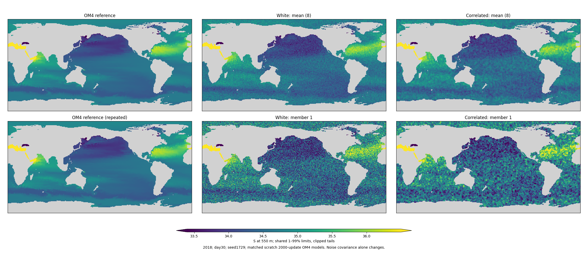
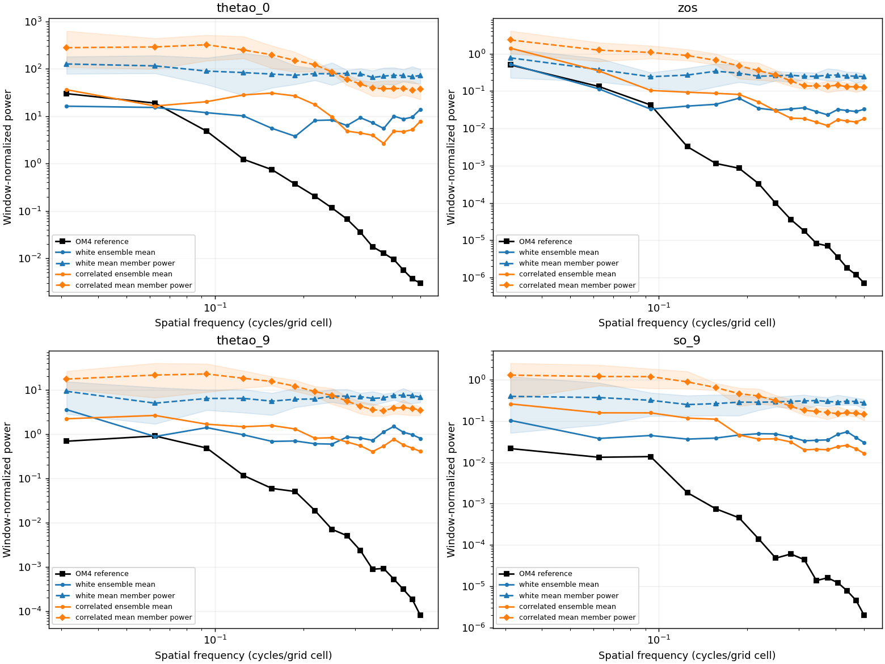

<!-- SPDX-FileCopyrightText: 2026 Samudra Authors -->
<!-- SPDX-License-Identifier: CC-BY-4.0 -->

# Small matched spatial-noise experiment

**Completed October 1: spatially correlated noise helps modestly after 2,000
OM4-only updates, but does not resolve the grain.** Both arms started from identical
untrained weights, used seed 1729, and completed exactly 2,000 updates. This is a
small-total-budget comparison, not a continuation of the 23,500-update model.

Across the three held-out day-30 dates, member neighboring-cell roughness fell
22–23%, ensemble-mean RMSE improved 4.5–5.4%, and fair CRPS improved 3.9–6.3%.
However, members remain very noisy: neighboring-cell differences are still 6–15
times the reference RMS in the correlated arm. Ensemble spread is 2.3–2.6 times
mean RMSE, with 98–99% coverage by the eight-member min–max interval (the ideal
exchangeable expectation is 7/9, about 77.8%). Both short-trained models are
substantially overdispersed, not plausible calibrated ensembles.

| Field | Mean RMSE: white → correlated | Fair CRPS: white → correlated | Member/reference roughness: white → correlated |
|---|---:|---:|---:|
| SST (°C) | 3.366 → 3.214 | 2.098 → 2.016 | 19.02 → 14.87 |
| SSH (m) | 0.2017 → 0.1909 | 0.1255 → 0.1192 | 12.08 → 9.38 |
| T at 550 m (°C) | 1.114 → 1.061 | 0.6718 → 0.6318 | 7.82 → 6.05 |
| S at 550 m | 0.2140 → 0.2026 | 0.1324 → 0.1241 | 11.91 → 9.21 |

Entries are arithmetic averages of the three per-date metrics, cosine-latitude
weighted on wet cells within ±60°. The raw per-date results are in
[metrics.csv](correlated-noise-assets/metrics.csv).

All paired maps use shared color limits and exactly 2×2 image pixels per native
grid cell. The first row compares reference and ensemble means; the second compares
reference and member 1. Maps show the full grid, including unscored extreme latitudes.

| Date | SST | SSH | T at 550 m | S at 550 m |
|---|---|---|---|---|
| 2015 | [SST](correlated-noise-assets/paired-2015-thetao_0.png) | [SSH](correlated-noise-assets/paired-2015-zos.png) | [T](correlated-noise-assets/paired-2015-thetao_9.png) | [S](correlated-noise-assets/paired-2015-so_9.png) |
| 2018 | [SST](correlated-noise-assets/paired-2018-thetao_0.png) | [SSH](correlated-noise-assets/paired-2018-zos.png) | [T](correlated-noise-assets/paired-2018-thetao_9.png) | [S](correlated-noise-assets/paired-2018-so_9.png) |
| 2021 | [SST](correlated-noise-assets/paired-2021-thetao_0.png) | [SSH](correlated-noise-assets/paired-2021-zos.png) | [T](correlated-noise-assets/paired-2021-thetao_9.png) | [S](correlated-noise-assets/paired-2021-so_9.png) |

Additional six-panel maps (reference, mean and members 1–4) are retained for each
arm/date/field in [the assets directory](correlated-noise-assets/).

These are power spectra on a common fully wet 32×32 Pacific patch, averaged over
dates. Dashed member curves use triangle/diamond markers; mean curves use circles.
Bands show the range across eight members after averaging each member's power
across dates. Correlated-noise member power in the highest four radial bins is
about 48% lower than white noise, but both are orders of magnitude above the smooth
reference there. Frequencies are cycles/grid cell, not physical kilometers; the
small patch and Hann window limit interpretation.

**Interpretation:** the noise covariance changes the grain and slightly improves
point and distributional scores at this early budget. It does not establish that
the model learned better fine structure: the prior itself contains less high-frequency
power. It also does not isolate the explicit EDM bypass from internal U-Net skips,
or establish that the benefit persists with longer training. No further training
has been submitted. A next test would be a separately approved matched continuation
of these two checkpoints, to see whether the gap persists as both models converge.

## Matched experiment

Both arms start from the identical saved scratch step-0 weights in
`latent-d192-v2/D-1729/om4/best.pt`. The checkpoint's actual state is verified to
be step 0 before any fitting. The retained large-run checkpoints were at
23,500/24,000 updates; no usable small-budget trained snapshot was found.

| Choice | White control | Correlated Gaussian |
|---|---|---|
| Marginal noise variance at each wet cell | 1 | 1 |
| White variance fraction | 1 | 0.5 |
| Independent Gaussian-filtered variance fraction | 0 | 0.5 |
| Gaussian filter | None | 5×5, standard deviation 1 grid cell |
| Training | 2,000 OM4-only updates | 2,000 OM4-only updates |

The filtered component uses periodic longitude and zero-padded latitude;
normalization uses the squared kernel and wet mask so coastal and polar wet
cells also have unit variance. Channels and the two decoded temporal slots have
independent noise. The retained white component gives a full-rank covariance
on the wet cells. This is a grid-scale diagnostic, not a fixed-distance or
basin-connected physical covariance model. Model targets and outputs are not
spatially smoothed.

Both training corruption and initial sampling noise use the specified covariance.
For additive Gaussian corruption with constant covariance C, the exact denoiser
D gives the score C^-1(D-x)/sigma^2; multiplication by C in the probability-flow
ODE cancels it, leaving the existing derivative (x-D)/sigma. Thus the same Heun
update is appropriate. The scalar EDM preconditioning remains a valid network
parameterization, and noise retains unit marginal variance. This experiment
keeps the explicit input/output bypass, internal skips, noise-level schedule,
loss weighting, and 16-step sampler fixed.

Both arms consume two Gaussian arrays per noise draw, discarding the second in
the white arm. This aligns all subsequent random noise levels and base draws
across arms. The default white path outside this pilot preserves its original
single-draw behavior. Data order, initial parameters, AdamW settings, precision,
mask, forcing and architecture match. Initializer, processor and decoder train
jointly; the unused ERA5 adapter stays frozen. Existing observation normalization
is reused, as in the original OM4 training; no observation targets enter the loss.

## Evaluation

We used the fixed final 2,000-update weights in both arms, not a checkpoint selected
on the test maps. We retained eight day-30 members on three held-out native January
origins (2015, 2018, 2021), showing SSH, SST and T/S at 550 m. We compared individual
members and means, neighboring-cell roughness, member spectra, physical error,
CRPS and calibration. This pilot addresses grain at a trained rollout horizon,
not annual stability or observation-transfer skill.

The native validation denoising losses are logged for optimization diagnostics;
the two corruption distributions make their raw values unsuitable as a direct
cross-arm skill ranking. We saved intermediate weights at 1,000 and 2,000 updates.
The fixed three-date cohort is a diagnostic sample, not a broad significance test.

Two single-L40S jobs have a two-hour allocation cap each, including preparation
and evaluation (at most four newly allocated GPU-hours before any recovery).
Training checkpoints permit resume after preemption without resetting updates.
The existing campaign total before this pilot is 223.5028 / 576 GPU-hours.

The first array, 24559159 (`ed27d5a97`), was stopped before training: both jobs
waited on the shared-filesystem read of an old physical checkpoint loaded by the
legacy data-loader wrapper. That physical model is unused in this experiment.
The replacement removes only that unnecessary load and uses a separate output
directory, `correlated-noise-scratch-v2`. The first attempt consumed 0.445 GPU-hours
(two allocations of 801 seconds); its outputs are not scientific results.

Implementation: [noise generator](../../../src/samudra/experiments/diffusion_noise.py),
[training and member export](../../../src/samudra/experiments/diffusion_correlated_pilot.py),
[Slurm launcher](../../../scripts/slurm_diffusion_correlated.sbatch).

## Execution and provenance

Training array **24560409**, producer `ac336c62b`, completed both 2,000-update
fits. The correlated arm was preempted once and automatically restarted; the
training state and paired sampling schedule were retained. Fitting took 26.8
minutes (white) and 26.7 minutes (correlated), excluding cache preparation.

Both jobs then failed in export: selecting the final reference time without
retaining its axis caused channel indexing against a singleton axis after
normalization broadcasting. The fix preserves the time axis. Evaluation-only
array **24567755**, producer `17b5cf39c`, loaded the checksum-verified final
checkpoints and completed both arms without any additional optimizer updates.
It finished October 1 at 2:58 p.m. America/New_York.

The monitor's first check found the export failure, recovered it, and confirmed
completion. The requested hourly sleep loop was stopped when no jobs remained.

Including the initial stalled startup, preemption, training, failed exports and
successful recovery, this pilot allocated **1.9569 GPU-hours**; the campaign total
is **225.4597 / 576 GPU-hours**. Accounting includes duplicate Slurm records for
requeues but excludes job-step rows to avoid double counting.

All **32 transferred files (32,468,538 bytes)** matched remote SHA-256 and byte
counts. The renderer also verified both training contracts, all six export hashes,
paired target arrays, masks, grids and timestamps before computing metrics.
Focused scientific tests: **23 passed**. The export fix additionally passed a CPU
check of target axes and physical channel scaling; both live GPU exports succeeded.

- [Training protocols, completion records and validation curves](correlated-noise-assets/training-records.json.gz)
- [Remote/local transfer receipt](correlated-noise-assets/remote-files.json.gz)
- [Slurm accounting, including preemption](correlated-noise-assets/accounting.txt.gz)
- [Metric and spectral provenance](correlated-noise-assets/provenance.json.gz)
- [Spectral values](correlated-noise-assets/spectra.json.gz)
- [Published asset checksums](correlated-noise-assets/asset-manifest.json.gz)

Remote outputs: `/orcd/pool/008/jrusak/diffusion-interior-engaging/runs/correlated-noise-scratch-v2/{white,correlated}`.
Final weights are `last.pt`; the completion records contain their full hashes.
Report reproduction: `uv run python scripts/report_correlated_noise_pilot.py --root outputs/correlated-noise/runs --output outputs/correlated-noise/assets`.
