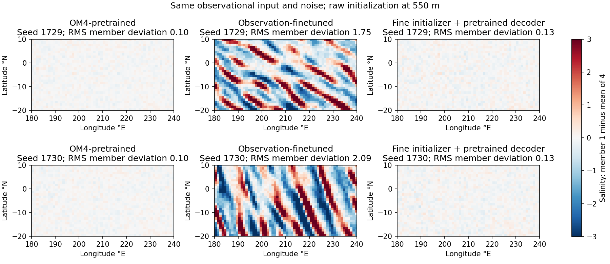
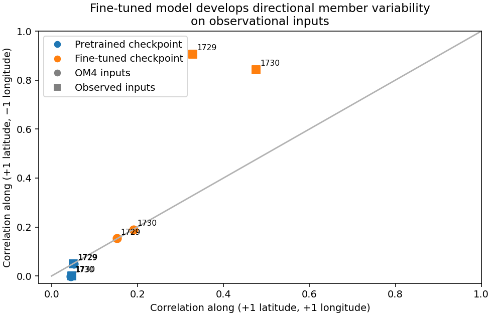

<!-- SPDX-FileCopyrightText: 2026 Samudra Authors -->
<!-- SPDX-License-Identifier: CC-BY-4.0 -->

# Diagonal salinity artifact investigation

The strong diagonal member texture develops during observation fine-tuning and is conditional on observational inputs. It is not a plotting artifact, is not present at comparable strength in the tested OM4-pretrained samples, and survives float32 inference and a fourfold increase in sampling steps. The evidence points to the initializer and decoder jointly learning unrealistic instantaneous variability under indirect observational supervision. The precise reason for the preferred orientation remains unresolved.

These are **raw initialization** fields at 550 m, before dynamics or monthly averaging. Each panel shows member 1 minus the mean of four members, using identical inputs and initial random draws across checkpoint variants. The patch is approximately 20°S–10°N, 180°E–240°E and entirely ocean at this depth. Shared colors span ±3 practical-salinity units; tails clip. The figure uses nearest-neighbor rendering.

## Paired checkpoint and input comparison

Both training seeds (1729, 1730) were evaluated at their selected OM4 and observation checkpoints. Native inputs use the first held-out control origin, 2015-01-03 12:00; observational inputs use the published 2015-01 sample. Comparisons across checkpoints within each input domain use exactly the same inputs and draws. The two input domains are not asserted to be identical ocean states or dates. Re-running the original fine-tuned observational configuration reproduced the published first four initialization salinity arrays exactly (maximum absolute difference zero for both seeds).

| Inputs | Checkpoint | Seed 1729 diagonal correlations | Seed 1730 diagonal correlations | RMS member deviation, seeds 1729 / 1730 |
|---|---|---|---|---|
| OM4 | OM4-pretrained | 0.052 / 0.050 | 0.044 / −0.001 | 0.095 / 0.098 |
| OM4 | Observation-finetuned | 0.152 / 0.153 | 0.191 / 0.188 | 0.136 / 0.129 |
| Observational | OM4-pretrained | 0.051 / 0.049 | 0.046 / 0.001 | 0.096 / 0.099 |
| Observational | Observation-finetuned | **0.329 / 0.906** | **0.476 / 0.842** | **1.749 / 2.092** |

Correlations compare member deviations along (+1 latitude, +1 longitude) and (+1 latitude, −1 longitude). RMS deviations are in practical salinity, pooled across four members and the patch, using their own ensemble mean. They are not forecast error against truth and are not unbiased estimates of population spread. This diagnostic measures short-range directional structure, not overall physical realism. Nearly white pretrained member residuals are not themselves evidence of a good posterior.

Earlier saved final-checkpoint outputs show the same directional preference at three dates in both training seeds. The new paired checkpoint experiments use one origin per domain, so they do not establish prevalence over the full evaluation period. Reusing the same draw across dates also means those dates are not independent noise realizations.

## Interventions

- **Restore only the pretrained decoder, retaining the fine-tuned initializer and atmosphere adapter:** on observational inputs, RMS member deviation drops from 1.75/2.09 to 0.132/0.132; diagonal correlations become 0.057/0.028 and 0.066/0.041. This removes the large directional artifact in the sampled patch. This diagnostic swap is not a validated replacement forecasting model.
- **Restore only the pretrained initializer subnet, retaining the fine-tuned decoder and atmosphere adapter:** deviations drop to 0.161/0.223; directional asymmetry is much smaller (0.288/0.352 and 0.430/0.546). The strong effect depends on the learned combination, not solely one unchanged component. Cross-checkpoint latent representations need not be interchangeable, so these swaps localize dependencies rather than establish standalone module quality.
- **Float32 instead of mixed bfloat16:** using the same first two members, spread changes by less than 0.5%; diagonal correlations remain strongly unequal. This is not a bfloat16 visualization or rounding effect.
- **64 versus 16 Heun sampling steps:** paired two-member spread falls only 3.3%/5.1%, with correlations still 0.321/0.896 and 0.435/0.833. Individual fields change (paired RMS change about 0.5), but the diagonal defect remains. This does not establish numerical convergence; it rejects “just use more steps” as a sufficient repair in this test.
- **Zero conditioning features:** the fine-tuned decoder still produces substantial directional structure, whereas the pretrained decoder does not show comparable asymmetry. Zero features are out of distribution, so this is supporting evidence about the decoder's learned response, not a skill score. Known surface channels remain anchored.
- **Trace the denoising trajectory:** the starting white noise has diagonal correlations about 0.016/0.004 in this patch. The directional preference develops through the fine-tuned denoising trajectory; it is not present in the initial random draw.

The OM4-pretrained and fine-tuned models use the same diffusion decoder architecture. Pretraining directly supervises both historical full interior states, including salinity and velocities. Observation fine-tuning propagates gradients through sampling and frozen physical evolution to surface/monthly-interior objectives, with direct OM4 replay every fourth update at weight 0.1. Replay protects behavior on its own input distribution; the paired-domain results show it has not prevented this observational-input failure.

## Toy training and dynamics response

Two toy models use the production `JointInteriorDecoder` blocks, reduced to width 32 and two fields on a 44×88 grid. They are trained for 2,000 AdamW updates each on unlimited synthetic isotropic Gaussian fields (Gaussian spectral smoothing, two-grid-cell scale, unit population variance), with zero conditioning. Targets therefore have no preferred diagonal. The training denoising objective and Heun sampler are the production implementations. All training/inference in this toy test is float32.

At 2,000 updates, both seeds learn smooth samples with approximately equal diagonal correlations (around 0.87). An analytic Gaussian denoiser using the same sampler also preserves diagonal symmetry. Thus the decoder blocks and sampler can learn this basic task without producing the ocean model's severe directional artifact. This does not rule out interactions involving the full width, 154 fields, coastline masks, nonzero conditioning, data complexity, or fine-tuning objective.

A separate centered finite-difference probe perturbs salinity at 550 m in both historical states, around a real OM4 state, with diagonal sine waves of wavelengths 4, 8, 16 and 32 grid cells. The frozen dynamics uses the observational sample's forcing/context, so this is an operator-sensitivity diagnostic, not a physical forecast validation. Its first-step salinity amplitude gain in the patch is only 0.10–0.17 for either orientation: approximately 83–90% attenuation. There is **no large preferential suppression of the observed diagonal** in this test. It supports weak constraints on small-scale initialization patterns, but does not explain the specific orientation. Full coupled multichannel modes and monthly losses were not characterized by this probe.

## Likely cause and implications

The strongest explanation is **loss of a realistic conditional interior distribution during observation fine-tuning**. The model can develop large, structured instantaneous variability that is strongly damped by the fixed dynamics before the observed outputs are scored. Its initializer and decoder have co-adapted on observational conditioning, while OM4-conditioned behavior remains much closer to its pretrained behavior. This is a mechanism supported by the experiments, not a proof that every part of the texture is an optimizer-selected weakly observed mode.

The specific diagonal direction likely reflects a learned directional response of the convolutional network. No explicit diagonal transport, directional diffusion operator, or spatial flattening in the active sampling path was identified. The small toy models do not reproduce the defect, and the simple dynamics probe does not identify a uniquely weak diagonal. Naming a particular convolution/upsampling layer as the cause would go beyond the evidence.

I would first test observation adaptation with a frozen pretrained diffusion decoder, and measure **instantaneous** state plausibility as well as downstream skill. A successful swap at inference does not guarantee successful adaptation with that constraint. If decoder adaptation is needed, preserving its conditional denoising behavior on observation-like inputs is more directly motivated than merely increasing native OM4 replay. Evaluation should retain per-member maps, spatial spectra/directional correlations and velocity diagnostics at initialization; monthly CRPS improvements alone cannot establish a physically credible generated state.

## Execution and reproducibility

All diagnostic jobs completed on single L40S GPUs on Engaging. No model-training campaign was resumed or production checkpoint changed.

| Job | Work | Allocated GPU seconds |
|---|---|---:|
| 24138805, four tasks | Native OM4 checkpoint/sampler/module comparisons | 471 |
| 24139022, four tasks | Observational-input comparisons | 537 |
| 24138859 | Two toy training seeds and analytic controls | 49 |
| 24139155, one task | Frozen dynamics sine-wave response | 23 |

Total: **0.300 GPU-hours**, counting Slurm allocations, not just kernel time.

Model/loader source: the completed native-evaluator snapshot `f1f2be70` from this branch. Checkpoint hashes and input contracts were checked by the reused native-controls setup. Exact executed scripts and submission scripts are saved under `outputs/diffusion-artifact/`; raw arrays are under `results/`, `obs-results/`, `toy-results/`, and `modes-results/`. `verified-checksums.json` records full remote/local read-back hashes. Public compact results and reproducibility scripts accompany this report in `artifact-assets/`.

- [Native input measurements](artifact-assets/native-summary.json.gz)
- [Observational input measurements and sampling traces](artifact-assets/observation-summary.json.gz)
- [Toy measurements](artifact-assets/toy-metrics.json)
- [Dynamics mode gains](artifact-assets/mode-gains.json)
- [Native probe](artifact-assets/code/probe.py), [observational probe](artifact-assets/code/obs-probe.py), [toy training](artifact-assets/code/toy.py), [dynamics probe](artifact-assets/code/modes-probe.py)

These are diagnostics, not a new held-out skill benchmark or a forecast model selected on the test origin.
