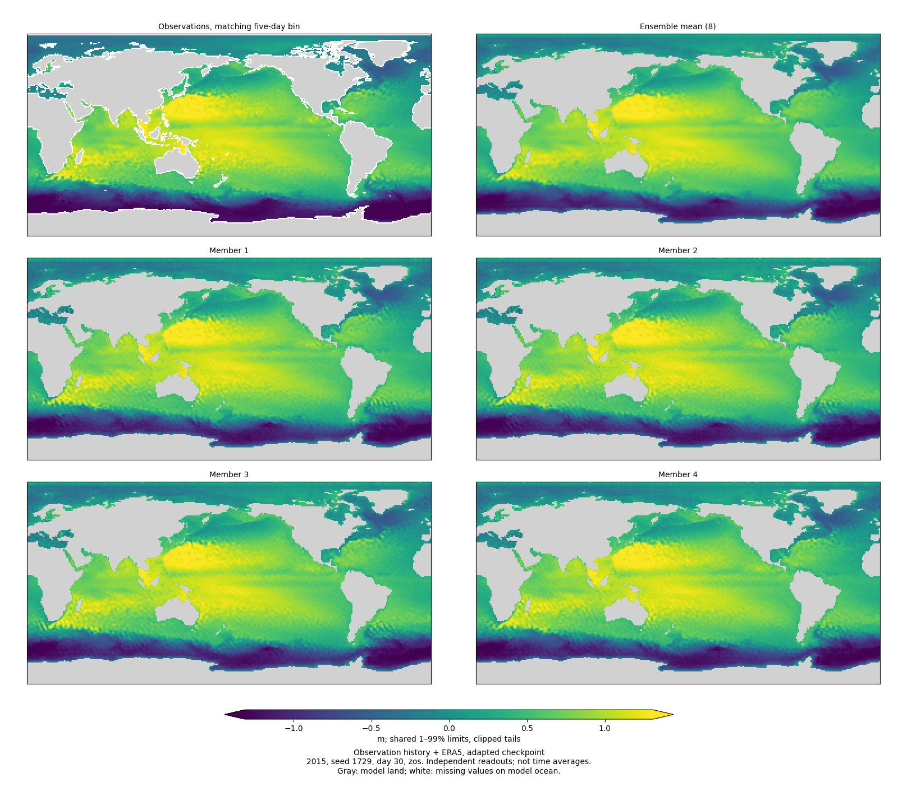
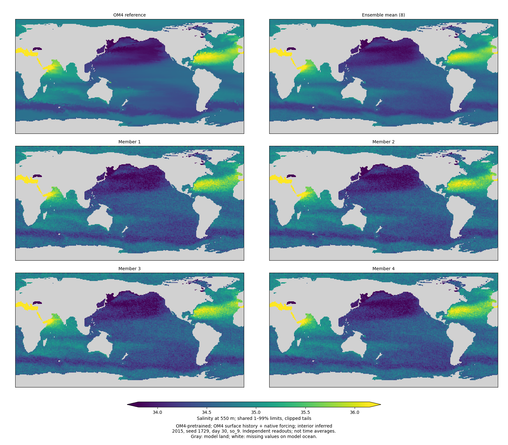
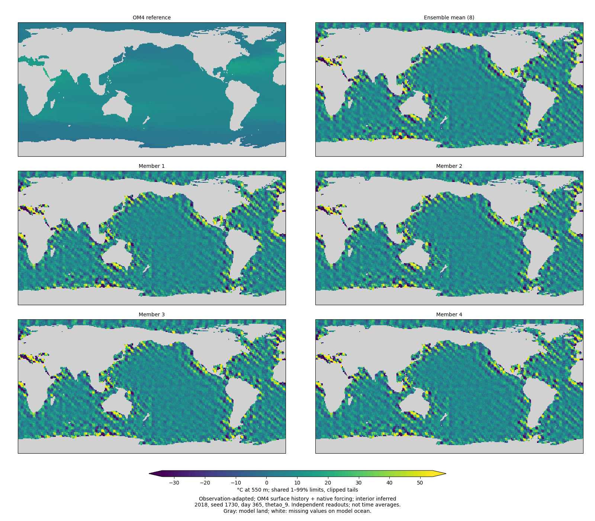

<!-- SPDX-FileCopyrightText: 2026 Samudra Authors -->
<!-- SPDX-License-Identifier: CC-BY-4.0 -->

# Day-30 and day-365 physical fields and individual members

**Fine-grained member noise is not confined to monthly-supervised interiors.**
SSH/SST show it too, and OM4-pretrained salinity already has comparable grain
before any observation adaptation. At one year, shared spatial errors dominate:
the native pretrained model is already poor, and adaptation makes it dramatically
worse. Ensemble averaging cannot fix that shared failure.

[Jump to all 120 maps](#map-gallery) or [download the numerical diagnostics](endpoint-assets/endpoint-diagnostics.csv).

These maps inspect spatial noise in **endpoint fields**, rather than the monthly
interior or annual time averages in the main report. They retain eight members
for both seeds and January starts in 2015, 2018 and 2021.

- Observation history + ERA5: the stopped observation-adapted checkpoint; SSH/SST
  reference, eight-member mean, and four individual members.
- OM4 history + native forcing: both the original OM4-pretrained checkpoint and
  its stopped observation-adapted descendant; separate figures show the OM4
  reference, eight-member mean and members 1–4 for each checkpoint. The interior T/S panels use
  550 m, matching the salinity artifact examined previously.

“OM4-initialized” supplies the model's OM4 surface history and forcing. It does
not supply gold interior state: the surface-history encoder still infers the
latent state. Native forcing bypasses the ERA5 adapter, as in OM4 pretraining.
Native pre/post comparisons have identical inputs and targets.
Observation and native starts are near January but are not identical timestamp
or forcing sequences, so their comparison is descriptive, not an input-only
controlled experiment. Exact midpoints are retained in the export metadata. For example, the 2015
observation day-30 bin is centered January 28 at 12:00, whereas the native
day-30 target is centered February 2 at 12:00.

## What receives direct supervision

Observation adaptation first takes each member's **monthly temporal average**
for interior T/S, then applies pixelwise fair CRPS against monthly IAP. It does
not first average ensemble members. SSH/SST instead receive pixelwise CRPS at
every supplied five-day bin, with group weights 0.1 each versus 0.8 interior.
All these observation losses use ±60° support.

OM4 pretraining/replay applies denoising supervision to full physical fields at
each native five-day step, globally on wet cells. Thus interior averaging can
hide temporal readout noise during observation fitting, but is not the only
possible source of spatial noise. In particular, pixelwise CRPS constrains
marginal distributions rather than spatial or temporal correlations. The
spectral validation score selects checkpoints; it is not a differentiable
spectral term in this training objective.

Source: [observation operators](../../../src/samudra/experiments/diffusion_observations.py)
and [native denoising and latent recurrence](../../../src/samudra/experiments/diffusion_latent_forecast.py).

## Reading the pictures and diagnostics

Each map uses exactly two image pixels per native grid cell and nearest-neighbor
rendering. Panels within a figure share physical color limits using pooled
1–99% quantiles; tails are labeled as clipped. Limits can differ between leads
and channels/checkpoints, so the unstable adapted run cannot flatten away
the texture of a better-behaved pretrained run. Very broad day-365 color ranges represent actual divergent model
values, not a normalization or bf16 visualization artifact. Gray is model land;
white is missing reference data. Global maps include regions outside observation
loss support; numerical diagnostics use common finite wet support within ±60°.

“Mean” always means the eight-member ensemble mean **at that lead**, not a time
average. Day labels retain the existing five-day forecast convention. The
observation target is the corresponding five-day bin, not a daily snapshot.
Member indices are arbitrary independent readouts along a shared deterministic
latent trajectory; they do not identify coherent uncertain trajectories.

The numerical export distinguishes ensemble-mean error, member 1 error,
member deviations about the mean, and neighboring-grid-cell increment RMS in
the mean, members and reference. Increment RMS is a descriptive roughness measure,
not a decomposition of model error into noise and signal, and not a physical
spectral density. Longitude wraps periodically; latitude does not wrap.

## Evaluation provenance

This is an evaluation-only follow-up. No weights, objective, training mask,
precision mode or decoder compilation settings changed. The evaluator advances
all 73 latent steps but only decodes steps 6 and 73. It consumes the Gaussian
draw for every skipped readout, preserving the original full-forecast random
stream. A focused stochastic-model test verifies exact selected outputs and
final RNG state against a full forecast. Each observation export also checks
its recovered ensemble mean against the already-published annual output, with
absolute/relative tolerances 2e-5; actual discrepancies are recorded separately.

Observation evaluator: `fa289dcb1`, array `24546935`. Its native read exhausted
L40S memory because the generic loader materialized overlapping 19-frame histories
for all 73 steps. Native-only retry `24548176` uses `5ab1f653c`, reading six-step
windows and concatenating forcing/targets in order; only the original history
initializes the model. A focused test verifies the 73-step ordering and preserved
history. Both arrays use single-L40S jobs; unsuccessful allocation is included
in accounting. Selected checkpoint identities and input signatures are embedded in the
numerical provenance. The stopped checkpoints remain the selections from
[the main report](latent-extension.md); pretrained weights are their verified
OM4 parents.

## Observation-input findings

Both SSH and SST have visible member-scale grain at day 30. Across the six
seed/date examples, SST member deviations about the mean have area-weighted RMS
0.499–0.519°C, and SSH deviations 0.0496–0.0509 m. Much of that texture disappears
in the eight-member mean. The corresponding mean errors are 0.567–0.719°C and
0.0648–0.0707 m. Thus the observation that interior losses average over time
cannot be the whole explanation: surface fields show this effect despite
five-day-bin supervision.

At day 365, large patterned errors are shared by the members and remain in the
mean. SST ensemble-mean RMSE is 42.7–67.9°C, while deviations of members about
that mean are 7.29–7.47°C RMS. For SSH, mean RMSE is 2.94–5.64 m versus
0.439–0.451 m member deviations. These values are enormous in physical units;
the main annual failure is not noise that ensemble averaging can remove.

Because physical readouts never feed back into the latent processor, this is
not accumulation of sampled physical-field errors in an autoregressive loop.
The common deterministic latent trajectory and its conditional decoder are
already producing a bad conditional mean. These maps alone do not separate
processor instability from decoder behavior on unfamiliar latent conditions.

## Paired OM4-input findings

Member-scale grain is already present under direct OM4 denoising supervision.
At day 30, median member/reference neighboring-cell roughness ratios across six
seed/date examples are **2.12 for SST, 1.62 for SSH, 2.28 for T at 550 m, and
2.22 for S at 550 m**. For salinity, member deviations about the mean are about
0.097 in the pretrained checkpoint and 0.101 after adaptation. This is comparable
texture before and after adaptation, rather than noise that first appears when
interior targets are monthly averages.

Native inputs do not rescue long-rollout stability. Pretrained day-365 SST
ensemble-mean RMSE is **5.68–6.62°C**, already a poor forecast; after adaptation
it is **48.3–83.9°C** on the identical native cases. SSH rises from **0.232–0.318 m**
to **3.17–7.13 m**. At 550 m, T rises from **1.44–1.98°C** to **16.4–25.7°C**, and
S from **0.236–0.356** to **3.45–4.58**. The adapted endpoint maps have strong
shared, sometimes diagonal/wave-like patterns, visible in the mean as well as
individual members. These differ from the fine grain that varies among members.

The table gives medians over both seeds and all three starts. Errors and member
deviations are area-weighted on common finite wet cells within ±60°. Member
deviation is RMS about the finite eight-member mean, without an unbiased-variance
correction; it is not the amount of erroneous noise. Full per-case values are in
the CSV.

| Field | Lead | Pretrained mean RMSE | Adapted mean RMSE | Pretrained member deviation | Adapted member deviation |
|---|---|---:|---:|---:|---:|
| SSH (m) | 30 days | 0.069 | 0.083 | 0.073 | 0.082 |
| SST (°C) | 30 days | 1.104 | 1.349 | 0.952 | 1.152 |
| T at 550 m (°C) | 30 days | 0.488 | 0.604 | 0.749 | 0.657 |
| S at 550 m | 30 days | 0.077 | 0.085 | 0.097 | 0.101 |
| SSH (m) | 365 days | 0.274 | 5.070 | 0.084 | 0.442 |
| SST (°C) | 365 days | 6.188 | 65.397 | 1.142 | 7.341 |
| T at 550 m (°C) | 365 days | 1.709 | 20.808 | 0.779 | 2.346 |
| S at 550 m | 365 days | 0.297 | 3.963 | 0.106 | 0.461 |

For context, observation-input day-30 SST members have median roughness 1.47×
the observation reference, versus 1.05× for SSH. Similar scalar roughness does
not establish correct eddy structure or spatial correlations. The observation
and native reference fields also have different spatial processing; their ratios
should not be treated as a matched cross-dataset skill ranking.

### Representative pictures

Observation-input SSH at day 30:



OM4-pretrained salinity at 550 m, day 30, before observation adaptation:



OM4-input temperature at 550 m after adaptation, day 365; note the enormous
color range and the pattern shared by the mean and members:



## What this comparison can establish

The relevant distinction is between **member-specific grain**, which averaging
can reduce, and **shared spatial errors**, which remain in the ensemble mean.
The former is visible in directly supervised OM4 outputs too. Thus monthly
interior averaging can weaken constraints on temporal fluctuations during
adaptation, but cannot explain the existence of all this texture. This does not
establish that every member deviation is erroneous: conditional uncertainty is
expected, and physical coherence needs more than a scalar roughness score.

The paired native comparison holds input history, forcing, targets and sampling
seed fixed while changing the checkpoint. It measures the net effect of
observation adaptation plus its OM4 replay, not the isolated effect of CRPS,
monthly averaging, or any one trainable component. Because native forcing
bypasses the ERA5 adapter, a failure there does not require that adapter. Because
physical samples do not feed recurrence, sampled field noise does not accumulate
through physical-state autoregression. Latent rollout drift and decoder behavior
on the resulting latent states remain confounded.

For a subsequent authorized investigation, the most informative separations
would be a fixed-latent sampler/denoiser check on OM4 (for member texture), and a
matched long-horizon latent-stability comparison before/after adaptation. These
maps do not justify launching either experiment automatically. Training remains
stopped pending review.

## Assets, accounting and reproduction

All **48 source files / 189,426,297 bytes** were
read back and verified against remote SHA256 and byte counts. All six mode/seed
completion contracts, checkpoint ancestry, three-origin cohorts, and paired
native references passed validation. Both native retry jobs completed successfully.
This evaluation used **1.0597 allocated GPU-hours**, including
the failed first attempt; campaign total is **223.5028 / 576 GPU-hours**.

- [Per-case physical diagnostics](endpoint-assets/endpoint-diagnostics.csv)
- [Checkpoint/input protocols, exact timestamps and source checksums](endpoint-assets/endpoint-provenance.json.gz)
- [Remote/local transfer verification](endpoint-assets/transfer-verification.json.gz)
- [Allocation ledger including failures](endpoint-assets/accounting.json.gz)
- [Figure and numerical asset checksums](endpoint-assets/assets.json.gz)
- [Endpoint evaluator](../../../src/samudra/experiments/diffusion_endpoint_maps.py)
- [Slurm invocation](../../../scripts/slurm_diffusion_endpoint_maps.sbatch)
- [Map/diagnostic renderer](../../../scripts/plot_diffusion_endpoints.py)
- [Readout RNG and native chunk-order tests](../../../tests/test_diffusion_latent_forecast.py)

Raw member NPZ files remain on Engaging under
`/orcd/pool/008/jrusak/diffusion-interior-engaging/reports/endpoint-members-v1/`,
organized as `D-{seed}/{obs-adapted,om4-pretrained,om4-adapted}/`.
The report publishes physical map assets and compact numerical/provenance exports.

Re-render a local copy of that directory:

```bash
uv run python scripts/plot_diffusion_endpoints.py \
  --root outputs/diffusion-endpoints/runs \
  --output outputs/diffusion-endpoints/assets
```

## Map gallery

Each link opens six panels: reference, eight-member mean, and members 1–4.
All maps retain native grid cells without smoothing.

### Observation surface history + ERA5

| Seed / start | Lead | SSH | SST |
|---|---|---|---|
| 1729 / 2015 | 30 days | [SSH](endpoint-assets/obs-adapted-1729-2015-day30-zos.png) | [SST](endpoint-assets/obs-adapted-1729-2015-day30-thetao_0.png) |
| 1729 / 2015 | 365 days | [SSH](endpoint-assets/obs-adapted-1729-2015-day365-zos.png) | [SST](endpoint-assets/obs-adapted-1729-2015-day365-thetao_0.png) |
| 1729 / 2018 | 30 days | [SSH](endpoint-assets/obs-adapted-1729-2018-day30-zos.png) | [SST](endpoint-assets/obs-adapted-1729-2018-day30-thetao_0.png) |
| 1729 / 2018 | 365 days | [SSH](endpoint-assets/obs-adapted-1729-2018-day365-zos.png) | [SST](endpoint-assets/obs-adapted-1729-2018-day365-thetao_0.png) |
| 1729 / 2021 | 30 days | [SSH](endpoint-assets/obs-adapted-1729-2021-day30-zos.png) | [SST](endpoint-assets/obs-adapted-1729-2021-day30-thetao_0.png) |
| 1729 / 2021 | 365 days | [SSH](endpoint-assets/obs-adapted-1729-2021-day365-zos.png) | [SST](endpoint-assets/obs-adapted-1729-2021-day365-thetao_0.png) |
| 1730 / 2015 | 30 days | [SSH](endpoint-assets/obs-adapted-1730-2015-day30-zos.png) | [SST](endpoint-assets/obs-adapted-1730-2015-day30-thetao_0.png) |
| 1730 / 2015 | 365 days | [SSH](endpoint-assets/obs-adapted-1730-2015-day365-zos.png) | [SST](endpoint-assets/obs-adapted-1730-2015-day365-thetao_0.png) |
| 1730 / 2018 | 30 days | [SSH](endpoint-assets/obs-adapted-1730-2018-day30-zos.png) | [SST](endpoint-assets/obs-adapted-1730-2018-day30-thetao_0.png) |
| 1730 / 2018 | 365 days | [SSH](endpoint-assets/obs-adapted-1730-2018-day365-zos.png) | [SST](endpoint-assets/obs-adapted-1730-2018-day365-thetao_0.png) |
| 1730 / 2021 | 30 days | [SSH](endpoint-assets/obs-adapted-1730-2021-day30-zos.png) | [SST](endpoint-assets/obs-adapted-1730-2021-day30-thetao_0.png) |
| 1730 / 2021 | 365 days | [SSH](endpoint-assets/obs-adapted-1730-2021-day365-zos.png) | [SST](endpoint-assets/obs-adapted-1730-2021-day365-thetao_0.png) |

### OM4 surface history: pretrained checkpoint

| Seed / start | Lead | SSH | SST | T at 550 m | S at 550 m |
|---|---|---|---|---|---|
| 1729 / 2015 | 30 days | [SSH](endpoint-assets/om4-pretrained-1729-2015-day30-zos.png) | [SST](endpoint-assets/om4-pretrained-1729-2015-day30-thetao_0.png) | [T at 550 m](endpoint-assets/om4-pretrained-1729-2015-day30-thetao_9.png) | [S at 550 m](endpoint-assets/om4-pretrained-1729-2015-day30-so_9.png) |
| 1729 / 2015 | 365 days | [SSH](endpoint-assets/om4-pretrained-1729-2015-day365-zos.png) | [SST](endpoint-assets/om4-pretrained-1729-2015-day365-thetao_0.png) | [T at 550 m](endpoint-assets/om4-pretrained-1729-2015-day365-thetao_9.png) | [S at 550 m](endpoint-assets/om4-pretrained-1729-2015-day365-so_9.png) |
| 1729 / 2018 | 30 days | [SSH](endpoint-assets/om4-pretrained-1729-2018-day30-zos.png) | [SST](endpoint-assets/om4-pretrained-1729-2018-day30-thetao_0.png) | [T at 550 m](endpoint-assets/om4-pretrained-1729-2018-day30-thetao_9.png) | [S at 550 m](endpoint-assets/om4-pretrained-1729-2018-day30-so_9.png) |
| 1729 / 2018 | 365 days | [SSH](endpoint-assets/om4-pretrained-1729-2018-day365-zos.png) | [SST](endpoint-assets/om4-pretrained-1729-2018-day365-thetao_0.png) | [T at 550 m](endpoint-assets/om4-pretrained-1729-2018-day365-thetao_9.png) | [S at 550 m](endpoint-assets/om4-pretrained-1729-2018-day365-so_9.png) |
| 1729 / 2021 | 30 days | [SSH](endpoint-assets/om4-pretrained-1729-2021-day30-zos.png) | [SST](endpoint-assets/om4-pretrained-1729-2021-day30-thetao_0.png) | [T at 550 m](endpoint-assets/om4-pretrained-1729-2021-day30-thetao_9.png) | [S at 550 m](endpoint-assets/om4-pretrained-1729-2021-day30-so_9.png) |
| 1729 / 2021 | 365 days | [SSH](endpoint-assets/om4-pretrained-1729-2021-day365-zos.png) | [SST](endpoint-assets/om4-pretrained-1729-2021-day365-thetao_0.png) | [T at 550 m](endpoint-assets/om4-pretrained-1729-2021-day365-thetao_9.png) | [S at 550 m](endpoint-assets/om4-pretrained-1729-2021-day365-so_9.png) |
| 1730 / 2015 | 30 days | [SSH](endpoint-assets/om4-pretrained-1730-2015-day30-zos.png) | [SST](endpoint-assets/om4-pretrained-1730-2015-day30-thetao_0.png) | [T at 550 m](endpoint-assets/om4-pretrained-1730-2015-day30-thetao_9.png) | [S at 550 m](endpoint-assets/om4-pretrained-1730-2015-day30-so_9.png) |
| 1730 / 2015 | 365 days | [SSH](endpoint-assets/om4-pretrained-1730-2015-day365-zos.png) | [SST](endpoint-assets/om4-pretrained-1730-2015-day365-thetao_0.png) | [T at 550 m](endpoint-assets/om4-pretrained-1730-2015-day365-thetao_9.png) | [S at 550 m](endpoint-assets/om4-pretrained-1730-2015-day365-so_9.png) |
| 1730 / 2018 | 30 days | [SSH](endpoint-assets/om4-pretrained-1730-2018-day30-zos.png) | [SST](endpoint-assets/om4-pretrained-1730-2018-day30-thetao_0.png) | [T at 550 m](endpoint-assets/om4-pretrained-1730-2018-day30-thetao_9.png) | [S at 550 m](endpoint-assets/om4-pretrained-1730-2018-day30-so_9.png) |
| 1730 / 2018 | 365 days | [SSH](endpoint-assets/om4-pretrained-1730-2018-day365-zos.png) | [SST](endpoint-assets/om4-pretrained-1730-2018-day365-thetao_0.png) | [T at 550 m](endpoint-assets/om4-pretrained-1730-2018-day365-thetao_9.png) | [S at 550 m](endpoint-assets/om4-pretrained-1730-2018-day365-so_9.png) |
| 1730 / 2021 | 30 days | [SSH](endpoint-assets/om4-pretrained-1730-2021-day30-zos.png) | [SST](endpoint-assets/om4-pretrained-1730-2021-day30-thetao_0.png) | [T at 550 m](endpoint-assets/om4-pretrained-1730-2021-day30-thetao_9.png) | [S at 550 m](endpoint-assets/om4-pretrained-1730-2021-day30-so_9.png) |
| 1730 / 2021 | 365 days | [SSH](endpoint-assets/om4-pretrained-1730-2021-day365-zos.png) | [SST](endpoint-assets/om4-pretrained-1730-2021-day365-thetao_0.png) | [T at 550 m](endpoint-assets/om4-pretrained-1730-2021-day365-thetao_9.png) | [S at 550 m](endpoint-assets/om4-pretrained-1730-2021-day365-so_9.png) |

### OM4 surface history: observation-adapted checkpoint

| Seed / start | Lead | SSH | SST | T at 550 m | S at 550 m |
|---|---|---|---|---|---|
| 1729 / 2015 | 30 days | [SSH](endpoint-assets/om4-adapted-1729-2015-day30-zos.png) | [SST](endpoint-assets/om4-adapted-1729-2015-day30-thetao_0.png) | [T at 550 m](endpoint-assets/om4-adapted-1729-2015-day30-thetao_9.png) | [S at 550 m](endpoint-assets/om4-adapted-1729-2015-day30-so_9.png) |
| 1729 / 2015 | 365 days | [SSH](endpoint-assets/om4-adapted-1729-2015-day365-zos.png) | [SST](endpoint-assets/om4-adapted-1729-2015-day365-thetao_0.png) | [T at 550 m](endpoint-assets/om4-adapted-1729-2015-day365-thetao_9.png) | [S at 550 m](endpoint-assets/om4-adapted-1729-2015-day365-so_9.png) |
| 1729 / 2018 | 30 days | [SSH](endpoint-assets/om4-adapted-1729-2018-day30-zos.png) | [SST](endpoint-assets/om4-adapted-1729-2018-day30-thetao_0.png) | [T at 550 m](endpoint-assets/om4-adapted-1729-2018-day30-thetao_9.png) | [S at 550 m](endpoint-assets/om4-adapted-1729-2018-day30-so_9.png) |
| 1729 / 2018 | 365 days | [SSH](endpoint-assets/om4-adapted-1729-2018-day365-zos.png) | [SST](endpoint-assets/om4-adapted-1729-2018-day365-thetao_0.png) | [T at 550 m](endpoint-assets/om4-adapted-1729-2018-day365-thetao_9.png) | [S at 550 m](endpoint-assets/om4-adapted-1729-2018-day365-so_9.png) |
| 1729 / 2021 | 30 days | [SSH](endpoint-assets/om4-adapted-1729-2021-day30-zos.png) | [SST](endpoint-assets/om4-adapted-1729-2021-day30-thetao_0.png) | [T at 550 m](endpoint-assets/om4-adapted-1729-2021-day30-thetao_9.png) | [S at 550 m](endpoint-assets/om4-adapted-1729-2021-day30-so_9.png) |
| 1729 / 2021 | 365 days | [SSH](endpoint-assets/om4-adapted-1729-2021-day365-zos.png) | [SST](endpoint-assets/om4-adapted-1729-2021-day365-thetao_0.png) | [T at 550 m](endpoint-assets/om4-adapted-1729-2021-day365-thetao_9.png) | [S at 550 m](endpoint-assets/om4-adapted-1729-2021-day365-so_9.png) |
| 1730 / 2015 | 30 days | [SSH](endpoint-assets/om4-adapted-1730-2015-day30-zos.png) | [SST](endpoint-assets/om4-adapted-1730-2015-day30-thetao_0.png) | [T at 550 m](endpoint-assets/om4-adapted-1730-2015-day30-thetao_9.png) | [S at 550 m](endpoint-assets/om4-adapted-1730-2015-day30-so_9.png) |
| 1730 / 2015 | 365 days | [SSH](endpoint-assets/om4-adapted-1730-2015-day365-zos.png) | [SST](endpoint-assets/om4-adapted-1730-2015-day365-thetao_0.png) | [T at 550 m](endpoint-assets/om4-adapted-1730-2015-day365-thetao_9.png) | [S at 550 m](endpoint-assets/om4-adapted-1730-2015-day365-so_9.png) |
| 1730 / 2018 | 30 days | [SSH](endpoint-assets/om4-adapted-1730-2018-day30-zos.png) | [SST](endpoint-assets/om4-adapted-1730-2018-day30-thetao_0.png) | [T at 550 m](endpoint-assets/om4-adapted-1730-2018-day30-thetao_9.png) | [S at 550 m](endpoint-assets/om4-adapted-1730-2018-day30-so_9.png) |
| 1730 / 2018 | 365 days | [SSH](endpoint-assets/om4-adapted-1730-2018-day365-zos.png) | [SST](endpoint-assets/om4-adapted-1730-2018-day365-thetao_0.png) | [T at 550 m](endpoint-assets/om4-adapted-1730-2018-day365-thetao_9.png) | [S at 550 m](endpoint-assets/om4-adapted-1730-2018-day365-so_9.png) |
| 1730 / 2021 | 30 days | [SSH](endpoint-assets/om4-adapted-1730-2021-day30-zos.png) | [SST](endpoint-assets/om4-adapted-1730-2021-day30-thetao_0.png) | [T at 550 m](endpoint-assets/om4-adapted-1730-2021-day30-thetao_9.png) | [S at 550 m](endpoint-assets/om4-adapted-1730-2021-day30-so_9.png) |
| 1730 / 2021 | 365 days | [SSH](endpoint-assets/om4-adapted-1730-2021-day365-zos.png) | [SST](endpoint-assets/om4-adapted-1730-2021-day365-thetao_0.png) | [T at 550 m](endpoint-assets/om4-adapted-1730-2021-day365-thetao_9.png) | [S at 550 m](endpoint-assets/om4-adapted-1730-2021-day365-so_9.png) |

