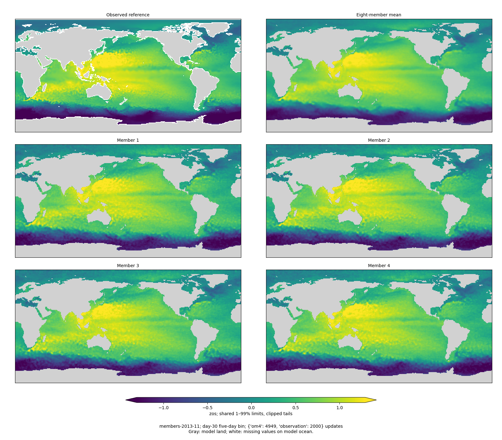
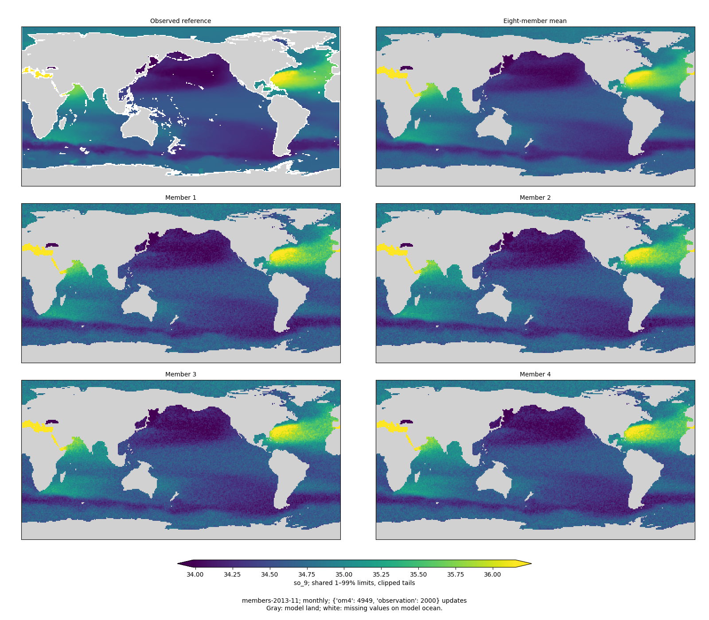
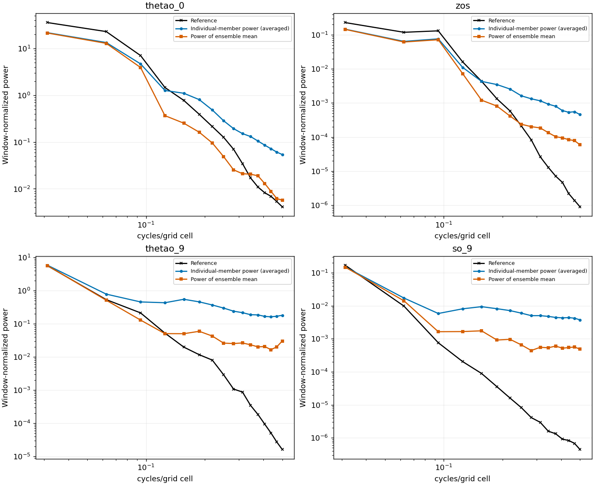
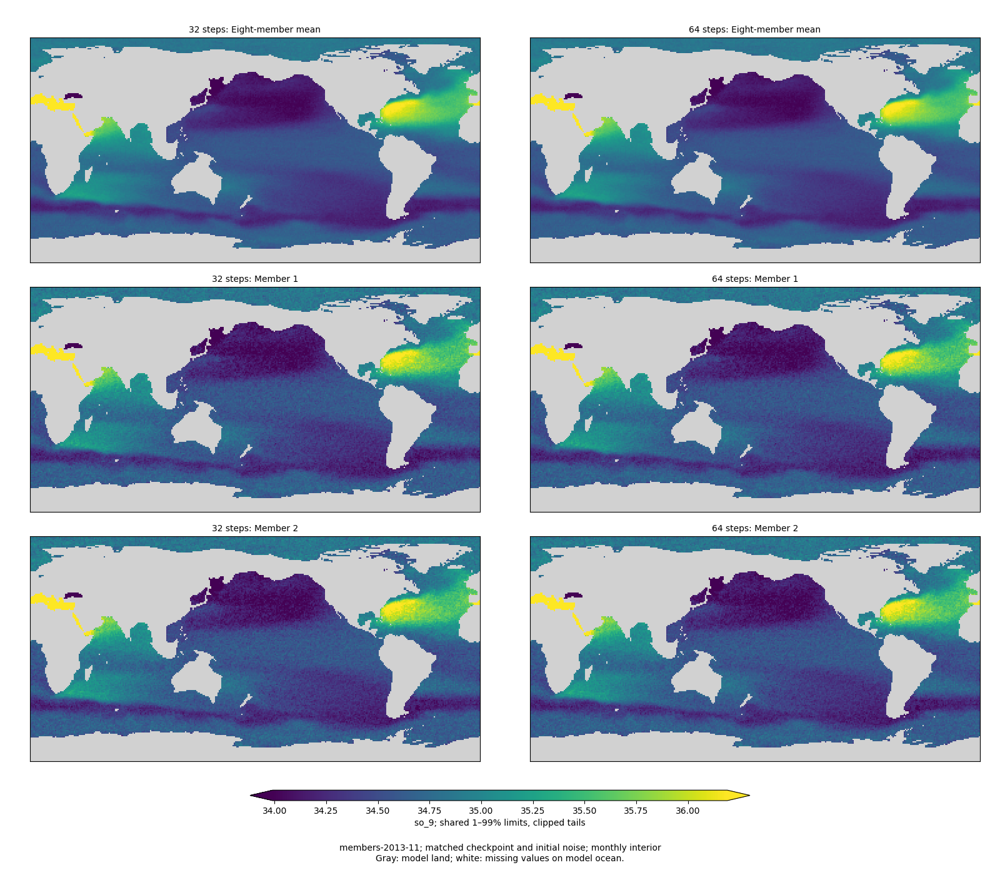
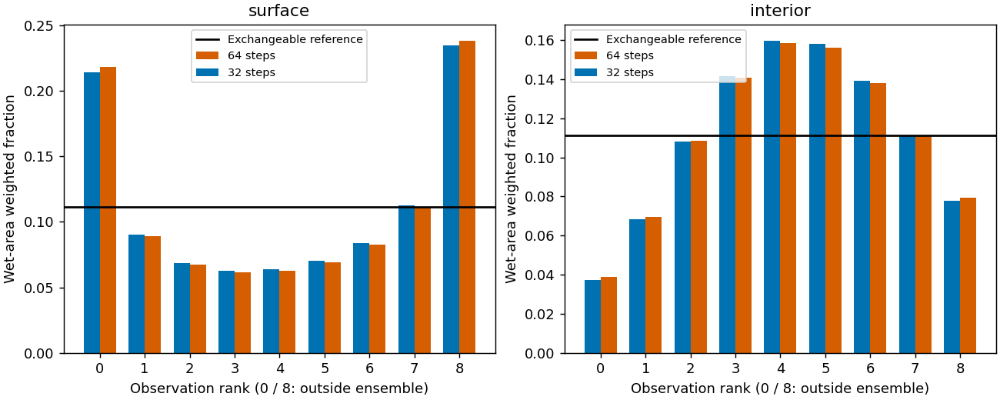

<!-- SPDX-FileCopyrightText: 2026 Samudra Authors -->
<!-- SPDX-License-Identifier: CC-BY-4.0 -->

# Global diffusion: 2,000 observation updates

Newer results: [4,000 observation updates](global-4000-results.md).

The model has substantially reduced the early grain, but **has not improved on the
deterministic control**. At 2,000 observation + 4,949 OM4 updates, its validation
composite is **1.2458**, versus **0.6268** for the control at exactly the same task
exposure. Surface ensembles have become too narrow, while monthly interior
ensembles remain broad. Doubling inference sampling from 32 to 64 steps changes
the score by only 0.19%, with slightly worse surface calibration.

This is one seed at 25% of the authorized observation exposure, not a converged
comparison. Training remains authorized through 8,000 updates of each task.
The [execution plan](global-matched-run.md) specifies architecture, losses and
frozen data protocol. These evaluations use nine validation origins, eight
members, global finite wet support and the same frozen scoring reference as the
control. No held-out test cases were used. Native OM4 uses the approved existing
versions on each cluster; full native-payload identity across clusters is not
claimed. Observation payloads and the metric reference are identical.

## Accuracy and the remaining gap

| Observation / OM4 updates | Diffusion composite, 32 steps | Matched deterministic composite | Day-30 SST RMSE |
|---|---:|---:|---:|
| 25 / 169 | 2.6122 | 1.8567 | 3.654°C |
| 50 / 324 | 2.2069 | 1.4791 | 3.608°C |
| 100 / 607 | 1.9749 | 1.1472 | 3.196°C |
| 250 / 1,300 | 1.4025 | 0.9495 | 1.645°C |
| 500 / 2,167 | 1.6757 | 0.8130 | 1.554°C |
| 1,000 / 3,389 | 1.4751 | 0.6674 | 0.964°C |
| 2,000 / 4,949 | 1.2458 | 0.6268 | 1.057°C |

Lower is better. These are fixed-exposure checkpoints, not validation-selected
endpoints. The composite scores the **ensemble mean**, including its spectra;
it does not score the realism of individual members. Its normalization is the
frozen validation seasonal-climatology reference, not the differently normalized
held-out reporting score from older reports.

At 2,000 updates the integrated-error ratios to that climatology are **1.159 SST,
1.021 geostrophic velocity, 0.998 EKE, 1.485 upper-ocean heat content and 1.423
deep-ocean heat content**. Their mean is 1.2173; the mean spectral error is 1.2743
dex. The composite is half of each, so improved map appearance has not yet
translated into broadly better-than-climatology mean predictions.

**EKE spectra are the largest spectral problem:** mean regional spectral error
is 3.155 dex, versus 0.265 for SST and 0.403 for SSH. Across the qualified EKE
spectral bins, the geometric mean predicted/reference power ratio is about
0.00071. This diagnostic derives geostrophic velocities from the ensemble-mean
SSH, subtracts the nine-origin time mean, and evaluates the resulting EKE fields.
It suggests severely deficient across-origin variability in that prediction;
it is not a measurement of the model's directly decoded interior velocities or
of individual-member EKE. It also does not establish coherent long trajectories.
[Component breakdown](global-early-assets/obs2000/score-breakdown.json).

## Member texture and calibration

Compared with 250 updates, high-frequency **individual-member** power in the same
Pacific patch falls **99.2% SST, 99.4% SSH, 69.8% monthly T550 and 82.3% monthly
S550**. These are averages over the highest four spectral bins of the 32×32
patches and nine dates. They are power reductions, not reductions in spectral
error or a global-spectrum result. Members still retain excessive power relative
to the very smooth interior observational references. Surface ensemble-mean
regional spectra can simultaneously lack power: averaging the fields and
averaging their spectra are different operations.

Each map cell occupies exactly 2×2 image pixels. Panels share physical 1–99%
limits, with clipped tails and nearest-neighbor display. Gray denotes model land;
white denotes missing observations on model ocean. SSH/SST are five-day bins
ending at day 30. T/S are calendar-weighted monthly averages of independently
sampled readouts, not instantaneous interior predictions.

| Pooled diagnostic | Surface, 1k / 32 steps | Surface, 2k / 32 steps | Interior, 1k / 32 steps | Interior, 2k / 32 steps |
|---|---:|---:|---:|---:|
| Mean RMSE, standardized | 0.1436 | 0.1667 | 0.1740 | 0.1469 |
| Ensemble spread, standardized | 0.1318 | 0.1032 | 0.3141 | 0.1641 |
| Spread / RMSE | 0.918 | 0.619 | 1.805 | 1.118 |
| Fair CRPS | 0.07094 | 0.09043 | 0.08809 | 0.06485 |
| Observation outside all eight members | 19.8% | 44.8% | 3.1% | 11.5% |

These statistics pool wet-area weighted sums before division and square roots.
They use observation-standardized units and all available forecast bins for
surface fields, versus monthly means for interiors; they do not use the training
task's group weights. Surface error worsens from 1k to 2k while spread contracts,
so smoother samples are not an unqualified improvement. Interior error and CRPS
improve alongside reduced overdispersion.

For eight exchangeable members plus the observation, the nine rank bins are
uniform and **22.2%** of observations lie outside the member range. The surface
histogram at 2k is strongly U-shaped, supporting underdispersion; the interior
histogram remains concentrated toward the middle, with some asymmetry. Pooled
histograms can hide regional and channel-specific problems.

The raw empirical 5–95% interval covers 48.9% of surface observations and 85.0%
of monthly interiors, but these are **not calibrated nominal 90% intervals**:
with only eight members, even their full minimum–maximum range has expected
coverage 77.8% under exchangeability. Rank histograms avoid treating finite-member
quantiles as exact tail probabilities. Raw coverage values remain in the assets.

## 32 versus 64 inference steps

Both evaluations use the same checkpoint, inputs, eight initial-noise draws and
observation operators. Only the Heun step count changes. The paired figures use
shared color limits, with 32 steps on the left and 64 on the right.

| Diagnostic at 2k | 32 steps | 64 steps |
|---|---:|---:|
| Validation composite | 1.24578 | 1.24345 |
| Day-30 SST RMSE | 1.0566°C | 1.0547°C |
| Surface fair CRPS | 0.09043 | 0.09083 |
| Surface spread / RMSE | 0.619 | 0.609 |
| Surface outside member range | 44.8% | 45.7% |
| Interior fair CRPS | 0.06485 | 0.06438 |
| Interior spread / RMSE | 1.118 | 1.104 |
| Interior outside member range | 11.5% | 11.8% |
| Single-H200 evaluation allocation | 636 s | 1,235 s |

At this checkpoint, 64 steps produces little numerical or visible improvement
and slightly narrows an already underdispersed surface ensemble. **Keep 32 steps
as the primary evaluation setting.** This does not prove every sampler is
converged, but increasing 32 to 64 steps does not explain or close the current
accuracy gap. Training remains unchanged at 32 differentiable sampling steps.

## Execution and next checkpoint

Checkpoint `step-06949.pt` contains exactly 4,949 OM4 / 2,000 observation updates.
The optimizer continued to global step 7,103 (5,033 / 2,070) before the current
segment ended. Evaluations **24761663 / 24761664 / 24761665** completed the
1k/32, 2k/32 and 2k/64 checks. Checkpoint fingerprints and every exported member
array were verified; report code checks paired reference/mask equality and
renders the sampling comparison at native pixel multiples.

Allocation through these evaluations is **190.303 GPU-hours**, including failed
qualification, preempted attempts, hardware tests, training and evaluation. The
allowance for this new run is 900 GPU-hours. The
[allocation ledger](global-early-assets/obs2000/allocation-ledger.json) distinguishes
attempts and clusters; older campaigns are excluded.

The colleague's seed-fund reservation was never allocated and remains excluded.
Training moved back to ordinary Engaging H200s when Torch's next eight-RTX slot
was delayed. Job 24729502 recovered automatically from preemption. Continuation
**24761666** is queued on four ordinary H200s after the evaluations.

Recent observation updates take about 67 seconds at effective batch eight on
four H200s. At that rate, the remaining roughly 5,930 observation updates alone
require about **110 hours**, plus native updates and scheduling. This is slower
than the initial four-day total estimate, which assumed sustained eight-H200
capacity. Faster capacity will continue to be checked; recent Torch SSH attempts
timed out. The next detailed report is at 4,000 observation updates, unless a
blocker or user request warrants an earlier update. No new experimental arm or
loss change is being introduced from this interim result.

## Assets and reproduction

- [2k / 32-step maps, spectra, metrics and calibration](global-early-assets/obs2000/)
- [2k / 64-step maps and paired sampling comparisons](global-early-assets/obs2000-steps64/)
- [1k numerical results and matched control event](global-early-assets/obs1000/)
- [Earlier checkpoint report](global-early-results.md)
- [Report renderer](../../../scripts/report_diffusion_global_early.py)
- [Frozen scoring implementation](../../../src/samudra/experiments/observation_metrics.py)
- [Finite-ensemble diagnostic implementation](../../../src/samudra/experiments/diffusion_calibration.py)

Run the report renderer once per export directory. For the 64-step directory,
pass `--compare-root` pointing to the 32-step directory; checkpoint, protocol,
origin, mask and reference mismatches are rejected. The same seed is used by the
point-evaluation adapter, and the deterministic Heun sampler consumes noise only
at initialization of each readout. Both primary and sensitivity results remain
available rather than selecting whichever looks smoother.
