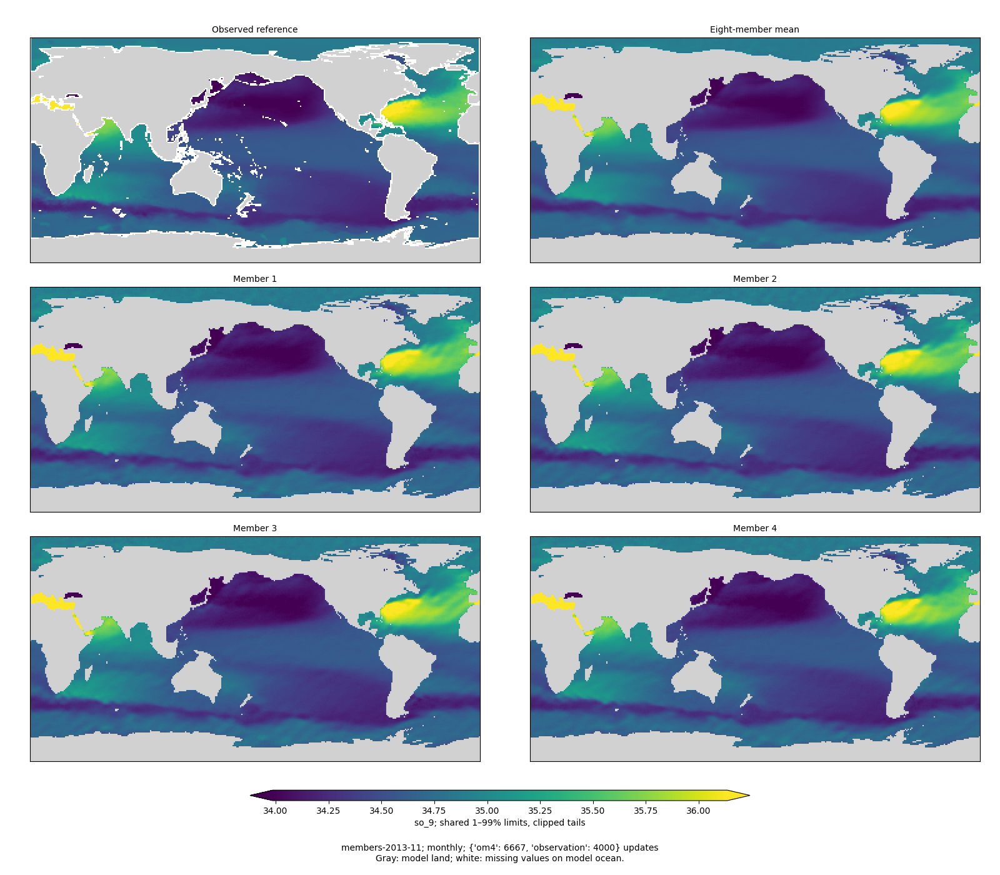
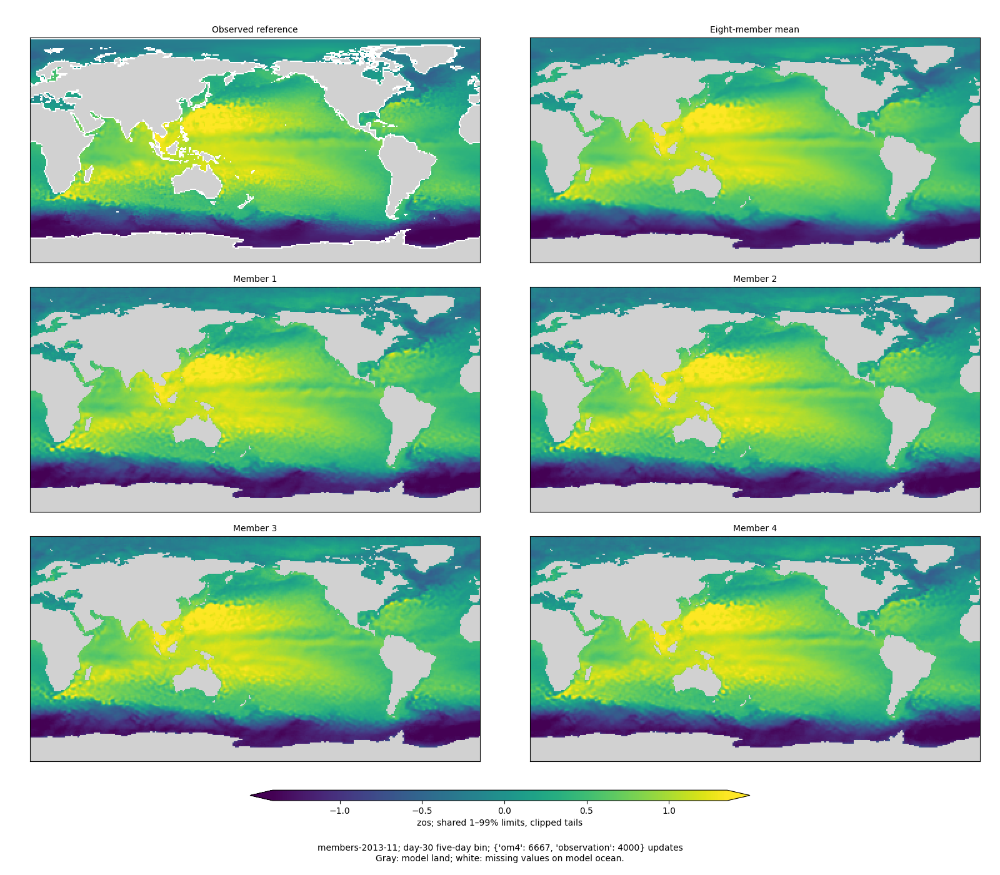
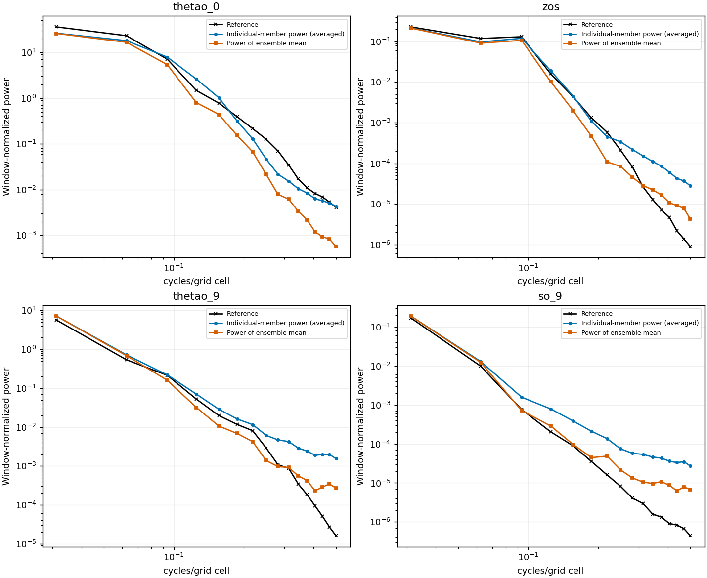
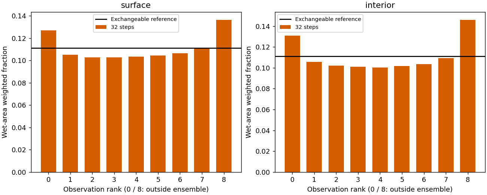

<!-- SPDX-FileCopyrightText: 2026 Samudra Authors -->
<!-- SPDX-License-Identifier: CC-BY-4.0 -->

# Global diffusion: 4,000 observation updates

Continued training improves accuracy, member texture and surface calibration.
The validation composite falls **38.6%, from 1.2458 to 0.7644**, but remains
**27.4% above the matched deterministic control, 0.5998**. Lower is better.
Grain is much weaker in the inspected maps, although individual SSH and interior
members still have excess small-scale power relative to the observational products.
Both surface and interior ensembles are now somewhat underdispersed.

**These results precede the LR cooldown.** This checkpoint is global step 10,667:
6,667 OM4 and 4,000 observation updates, at constant LR `1e-4`. The approved
[cooldown](global-cooldown.md) starts after step 14,000 and ends at the existing
16,000-update limit. It adds no training updates. No sampler or loss change was
introduced for this milestone.

## Accuracy and the deterministic comparison

| Observation / OM4 updates | Diffusion composite | Matched deterministic composite | Day-30 SST RMSE |
|---|---:|---:|---:|
| 1,000 / 3,389 | 1.4751 | 0.6674 | 0.964°C |
| 2,000 / 4,949 | 1.2458 | 0.6268 | 1.057°C |
| 4,000 / 6,667 | **0.7644** | **0.5998** | **0.636°C** |

All diffusion rows use eight-member means and 32 Heun steps, nine validation
origins, global finite wet support and the same frozen seasonal-climatology scoring
reference. These are fixed-exposure checkpoints, not validation-selected endpoints.
The composite evaluates the ensemble mean, including its spectra; member realism
and uncertainty require the separate diagnostics below. The deterministic comparison
matches data protocol and task exposure, not model size, objective or compute.

The mean integrated-error ratio to climatology improves from **1.217 to 0.924**.
Four of five integrated components now beat that reference; deep OHC remains worse.

| Integrated error / frozen climatology error | 2k | 4k |
|---|---:|---:|
| SST | 1.159 | 0.720 |
| Geostrophic velocity | 1.021 | 0.922 |
| EKE | 0.998 | 0.942 |
| OHC, 0–700 m | 1.485 | 0.932 |
| OHC, 700–2,000 m | 1.423 | 1.105 |

The mean regional spectral error falls from **1.274 to 0.604 dex**. By field,
SST improves from 0.265 to 0.189, SSH from 0.403 to 0.123, and EKE from 3.155 to
1.501 dex. EKE is still the largest spectral weakness: its geometric mean
predicted/reference power ratio rises from 0.00071 to **0.03185**, still very low.
This EKE is derived from ensemble-mean SSH geostrophy and anomalies across the
nine origins. It is not directly decoded interior velocity, member EKE, or a
measurement of coherent long trajectories.
[Full component breakdown](global-early-assets/obs4000/score-breakdown.json).

## Individual members and remaining grain

The following comparison uses the same entirely observed 32×32 Pacific patches
and nine dates, averaging individual-member power over the highest four frequency
bins. Reference patches are verified identical between checkpoints. It describes
power, not spectral error or correctly located fine structure.

| Field | Reduction in member high-frequency power, 2k → 4k | 4k member power / reference |
|---|---:|---:|
| SST | 92.2% | 0.87× |
| SSH | 92.2% | 18.45× |
| Monthly temperature, 550 m | 98.9% | 39.22× |
| Monthly salinity, 550 m | 99.2% | 45.94× |

The remaining excess is concentrated at short wavelengths for SSH and the
interiors. SST power is not uniformly excessive. The very smooth monthly interior
reference has little power at these frequencies, so large ratios do not by
themselves imply large physical errors. These patch results are also distinct
from the ensemble-mean regional spectra used in the composite.

Maps use exactly 2×2 image pixels per grid cell, nearest-neighbor display, and
shared physical 1–99% limits within each figure. Gray is model land; white is
missing observation on model ocean. SSH/SST targets are five-day bins ending at
day 30. Each T/S member is averaged over the calendar month before comparison;
these panels do **not** establish instantaneous interior smoothness or temporal
coherence. The asset directory includes all four fields for November, March and
July, not just the two examples shown here.

## Calibration

| Pooled diagnostic | Surface 2k | Surface 4k | Interior 2k | Interior 4k |
|---|---:|---:|---:|---:|
| Mean RMSE, standardized | 0.1667 | 0.0992 | 0.1469 | 0.0910 |
| Ensemble spread, standardized | 0.1032 | 0.0859 | 0.1641 | 0.0664 |
| Spread / RMSE | 0.619 | 0.865 | 1.118 | 0.730 |
| Fair CRPS | 0.09043 | 0.04543 | 0.06485 | 0.03470 |
| Observation outside all eight members | 44.8% | 26.3% | 11.5% | 27.7% |

Surface mean error improves faster than spread contracts, substantially improving
its calibration. Interior spread contracts more sharply and now undershoots error.
Both rank histograms are mildly U-shaped. For eight exchangeable members, **22.2%**
of observations fall outside the full member range; this is the relevant reference
for that row. Raw finite-member quantile coverage is retained in the numerical
assets but is not treated as nominal 80% or 90% coverage.

Statistics pool finite wet-area weighted sums in observation-standardized units.
Surface diagnostics include available forecast bins; interiors use monthly means.
They do not use the training task's group weights. Pooled ranks can hide regional
or channel-specific errors. Improved CRPS and RMSE support a substantive gain,
but smoother fields and nearly flat pooled ranks do not prove a correct joint
spatial or temporal distribution.

## Execution, provenance and next checks

Training is running on **eight dedicated RTX GPUs on one Torch node**, about
45 seconds per observation update versus 66 seconds on four Engaging H200s.
The optimizer was transferred at global step 9,594 after a clean end-of-update
stop; full parent and continuation checkpoints passed source/destination SHA256
verification. The training producer is `e8a6312ea`; the evaluator remains the
unchanged `4ecba36a4` producer. The new trainer records the future cooldown but
keeps LR constant until step 14k, including at this evaluated checkpoint.

Evaluation **19246962** completed on one Torch H100 in **678 seconds**. The first
RTX evaluation request was canceled without allocation because the dedicated
eight-GPU quota was already occupied by training. No reservation was used.
The exported archive and all nine member arrays passed checksums. Full target,
mask and coordinate arrays match the 2k evaluation; the scoring reference and
all original scientific contract fields match. Native OM4 uses the previously
approved similar cluster-specific versions; native payload identity is not claimed.

Allocation through the October 5, 17:50 ET accounting snapshot is **370.811
GPU-hours / 900**, including preemptions, evaluations and the elapsed portion of
running job 19217720. The [ledger](global-early-assets/obs4000/allocation-ledger.json)
marks that partial allocation explicitly; subsequent time is not included.
Continuation 19218524 is queued after the current training job.

Continue the authorized run. Evaluate 6k observation updates and retain the
pre-cooldown step-14k optimizer, midpoint and final checkpoints. The important
remaining checks are whether accuracy continues to close the deterministic gap,
whether cooling further reduces grain without collapsing spread, and whether
annual/temporal and native-retention diagnostics support the apparent progress.
No test origins were used in this report; held-out and long-rollout results remain
pending. Earlier-to-later comparisons do not isolate LR from extra training.

## Assets and reproduction

- [All 4k maps, spectra, calibration, receipts and numerical diagnostics](global-early-assets/obs4000/)
- [Earlier 2k report and sampler sensitivity](global-2000-results.md)
- [Matched baseline event](global-early-assets/obs4000/matched-baseline.json)
- [Verified reference pairing](global-early-assets/obs4000/validation-pairing.json)
- [Texture comparison](global-early-assets/obs4000/texture-comparison.json)
- [Report renderer](../../../scripts/report_diffusion_global_early.py)

Run the renderer with `--root` pointing to the evaluation export, `--output` to
the asset directory, and `--reference` to the frozen selection-reference JSON.
It checks each exported array checksum and the reference fingerprint, reproduces
the composite, and writes the component breakdown. Its new breakdown path also
reproduces the already-published 2k values to numerical precision. Legends use
distinct markers for reference, members and ensemble mean.
