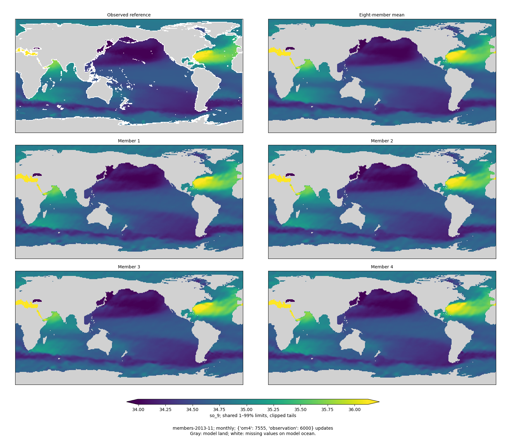
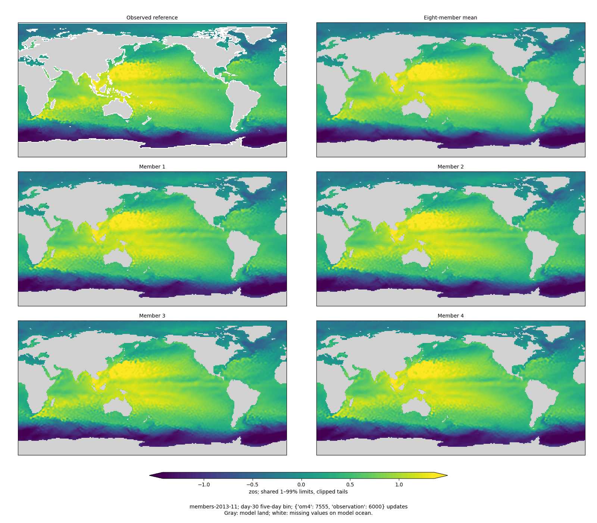
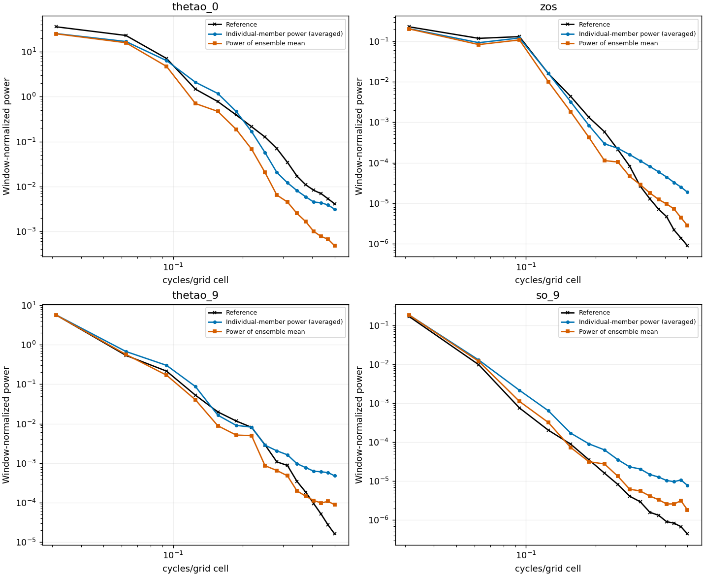
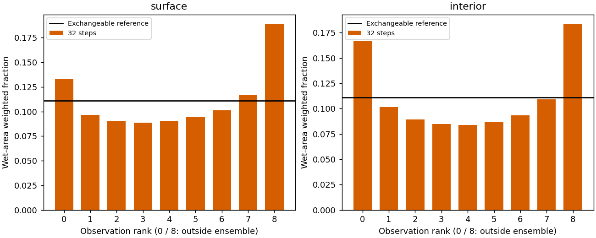

<!-- SPDX-FileCopyrightText: 2026 Samudra Authors -->
<!-- SPDX-License-Identifier: CC-BY-4.0 -->

# Global diffusion: 6,000 observation updates

Grain continues to decrease, but validation skill has stopped improving at this
checkpoint. The composite is **0.7847**, versus **0.7644 at 4k** and **0.5864 for
the matched deterministic control**. Lower is better. SST and geostrophic surface
metrics improve modestly; heat-content errors worsen. Both surface and interior
ensembles become more underdispersed, and their CRPS worsens.

This is **before the LR cooldown**: global step **13,555 = 7,555 OM4 + 6,000
observation updates**, still at LR `1e-4`. Continue the already authorized run
through the cosine tail at global steps 14k–16k. These results do not justify
claiming that more training uniformly improves quality or that smoother maps
alone mean a better probabilistic model.

## Accuracy

| Observation / OM4 updates | Diffusion composite | Matched deterministic | Day-30 SST RMSE |
|---|---:|---:|---:|
| 2,000 / 4,949 | 1.2458 | 0.6268 | 1.057°C |
| 4,000 / 6,667 | 0.7644 | 0.5998 | 0.636°C |
| 6,000 / 7,555 | **0.7847** | **0.5864** | **0.614°C** |

The composite worsens **2.7%** from 4k and is **33.8% above** the matched control.
All rows use the same nine validation origins, 32 Heun steps, eight-member means,
global finite wet support and frozen climatology reference. Comparison matches
data protocol and task exposure, not architecture, objective or compute.

| Integrated error / frozen climatology error | 4k | 6k |
|---|---:|---:|
| SST | 0.720 | 0.696 |
| Geostrophic velocity | 0.922 | 0.907 |
| EKE | 0.942 | 0.922 |
| OHC, 0–700 m | 0.932 | 1.025 |
| OHC, 700–2,000 m | 1.105 | 1.268 |

The integrated mean rises from **0.924 to 0.964**. Mean regional spectral error
is essentially unchanged, **0.604 to 0.606 dex**: SST and SSH spectra worsen,
while EKE spectra improve. EKE remains the largest spectral weakness, with a
geometric predicted/reference power ratio of **0.0371**. This EKE is derived from
ensemble-mean SSH and anomalies across origins; it is not member EKE or a temporal
coherence test. [Full breakdown](global-early-assets/obs6000/score-breakdown.json).

Pooled standardized interior RMSE improves slightly even while OHC errors grow.
These are different aggregations: OHC integrates temperature over depth before
measuring error, whereas pooled interior RMSE includes temperature and salinity
in standardized units. The divergence alone does not identify its cause.

## Member maps and spectra

| Field | Reduction in member high-frequency power, 4k → 6k | 6k member power / reference |
|---|---:|---:|
| SST | 25.9% | 0.64× |
| SSH | 28.0% | 13.28× |
| Monthly temperature, 550 m | 69.1% | 12.13× |
| Monthly salinity, 550 m | 70.6% | 13.49× |

These are the highest four frequency bins in identical 32×32 Pacific patches
across nine dates, averaging **individual-member powers**, not taking the power
of their mean. SSH and interior members retain excess power at the shortest
wavelengths; SST is already below the reference there. Smooth monthly interior
references have little high-frequency power, so ratios need physical-error
context. Reduced power does not establish correctly placed fine structure.

All twelve maps use 2×2 image pixels per grid cell and shared physical limits
within each figure. Gray is land and white is missing observation on wet cells.
Surface fields are five-day bins ending at day 30. Each interior member is
averaged over its calendar month; this does not establish instantaneous smoothness
or coherent trajectories. March and July maps accompany November in the assets.

## Calibration

| Pooled diagnostic | Surface 4k | Surface 6k | Interior 4k | Interior 6k |
|---|---:|---:|---:|---:|
| Mean RMSE, standardized | 0.0992 | 0.1020 | 0.0910 | 0.0894 |
| Ensemble spread, standardized | 0.0859 | 0.0761 | 0.0664 | 0.0579 |
| Spread / RMSE | 0.865 | 0.746 | 0.730 | 0.647 |
| Fair CRPS | 0.04543 | 0.04769 | 0.03470 | 0.03685 |
| Observation outside all eight members | 26.3% | 32.2% | 27.7% | 35.1% |

Spread contracts in both groups; errors do not fall commensurately. Both rank
histograms become more U-shaped. For eight exchangeable members the outside-range
reference is **22.2%**, not zero. The numerical assets also retain empirical CRPS
and raw finite-member quantile coverage. Statistics pool finite wet-area sums
in observation-standardized units and can hide regional differences.

## Execution and provenance

Evaluation **19307267** completed on one Torch H100 in **677 seconds**, with the
same immutable evaluator `4ecba36a4` used at 4k. The training producer remains
`e8a6312ea`. The source/export archive and all nine member-array checksums passed;
full targets, masks, coordinates and the entire training contract match 4k.
The [paired baseline event](global-early-assets/obs6000/matched-baseline.json)
has exactly the same OM4/observation counts. No held-out test origins were used.

Allocated compute through the completed 6k evaluation and training segment
19254479 is **568.753 / 900 GPU-hours**, including preemptions and failed starts.
The [ledger](global-early-assets/obs6000/allocation-ledger.json) replaces earlier
partial records with final allocations rather than double-counting them.

At October 6, 18:50 ET, training had cleanly saved global step 13,578 and
continuation **19280686** was queued on the dedicated RTX partition. Its scheduler
estimate was 22:43 ET; this is an estimate, not a guaranteed start. The GPUs on
the previous node had been assigned to other jobs after the checkpoint handoff.
The delay consumes no GPU-hours. Exact 8k/8k totals and the approved cooldown are
unchanged; completion ETA moves with the queue.

Next compare pre-cooldown, midpoint and final checkpoints on accuracy, member
spectra and calibration. Preserve the full optimizer at global step 14k. Complete
the final held-out and annual diagnostics before claiming long-rollout improvement.
Earlier-to-later comparisons combine LR changes with more training and are not a
matched constant-LR ablation.

## Assets

- [All 6k maps, spectra, calibration and receipts](global-early-assets/obs6000/)
- [Texture comparison](global-early-assets/obs6000/texture-comparison.json)
- [Verified target and contract pairing](global-early-assets/obs6000/validation-pairing.json)
- [4k report](global-4000-results.md)
- [Training and cooldown protocol](global-cooldown.md)
- [Report renderer](../../../scripts/report_diffusion_global_early.py)
