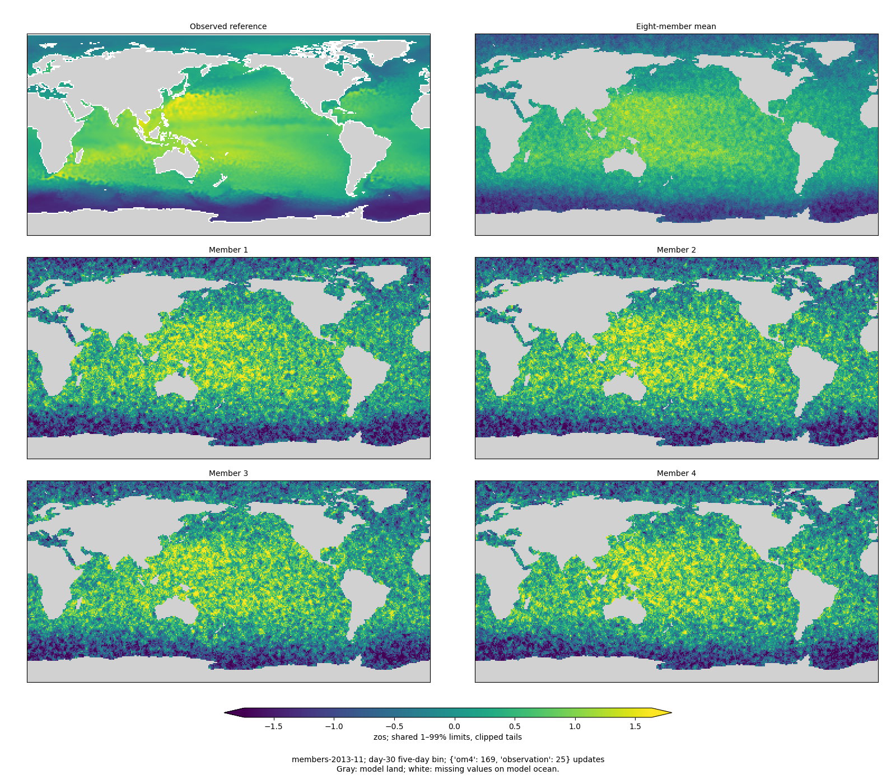
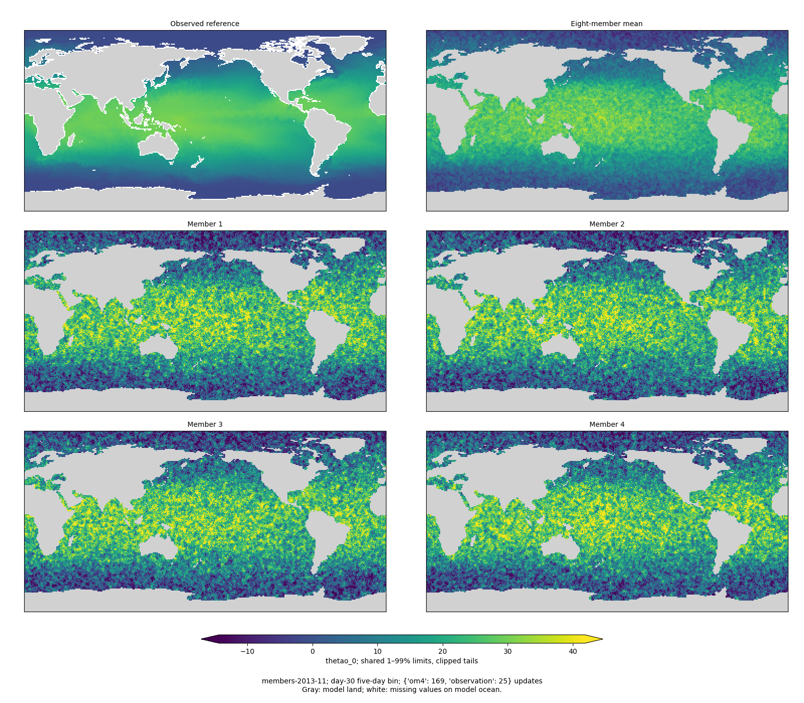
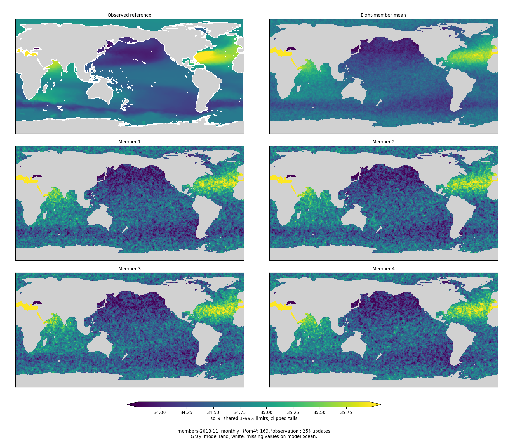
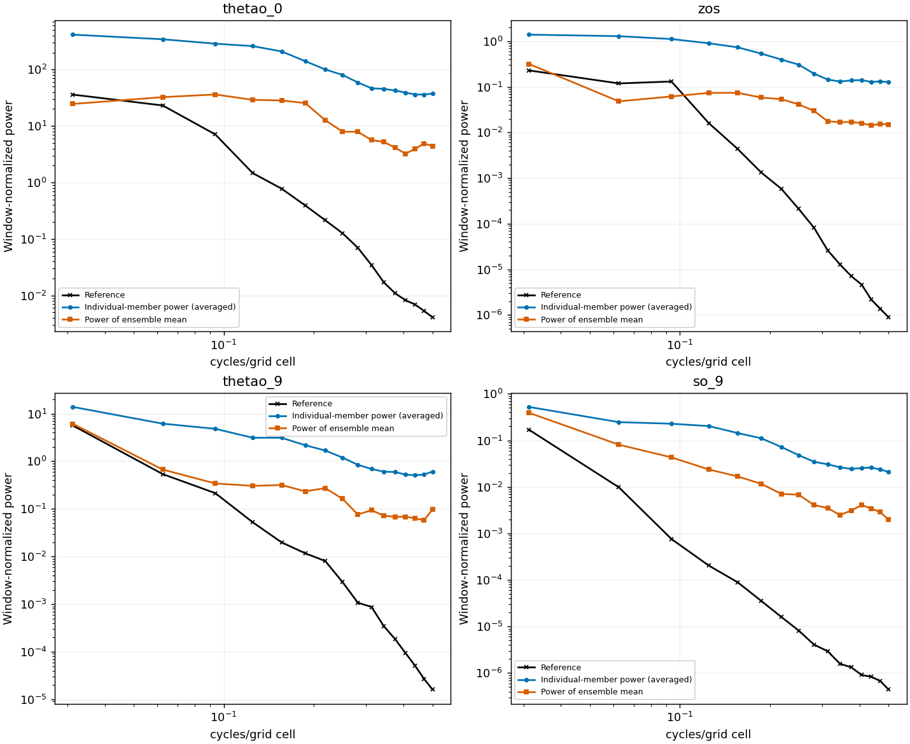

<!-- SPDX-FileCopyrightText: 2026 Samudra Authors -->
<!-- SPDX-License-Identifier: CC-BY-4.0 -->

# Global diffusion: first checkpoint

The first checkpoint is numerically healthy but **has not solved the grain**.
After **169 OM4 + 25 observation updates**, its global validation composite is
**2.6122**, versus **1.8567** for the deterministic mixed control at exactly the
same exposure. Lower is better: this is 40.7% worse. Both use effective batch eight,
the same nine validation dates and the same frozen global scoring reference.
This comparison is about early learning, not converged performance; the new
model has completed only 194 of 16,000 total updates. Architecture and objectives
differ, as specified in the [execution plan](global-matched-run.md).

The score is the integrated-error-plus-spectral **validation** composite. It is
not the differently normalized held-out reporting score around 0.59. The
deterministic mixed endpoint's validation score is 0.5652 at full exposure.
No held-out test cases were used in this early check.

## What the members show

The mean captures broad geographical structure, but SSH and SST individual
members remain very grainy. Averaging eight members suppresses some texture;
it does not make the sampled fields realistic. Monthly T/S averaging suppresses
additional independent readout noise, so its visually smoother fields and more
reasonable pooled spread do not demonstrate realistic instantaneous interiors.

Each map cell occupies exactly 2×2 image pixels, with nearest-neighbor rendering.
Panels share physical 1–99% color limits; tails clip. Gray is model land/depth
mask; white is missing observations on model ocean. Surface panels compare the
same five-day interval ending at day 30; interiors compare calendar-weighted
monthly means. There is no instantaneous interior reference implied here.

## Spectra and calibration

These diagnostic spectra use an entirely observed 32×32 Pacific patch, selected
by the same geographic rule for every date/field, and a Hann window. Curves average
all nine dates; the blue curve averages power measured separately in each member.
The orange curve measures power after averaging the fields. They are distinct
operations. High-frequency power is excessive even in the ensemble mean. These
patch diagnostics are separate from the established regional spectral metrics
used in the composite score; they are not global ocean spectra.

| Pooled observation-standardized diagnostic | Surface, all forecast bins | Monthly interior |
|---|---:|---:|
| Ensemble-mean RMSE | 0.5426 | 0.3754 |
| Ensemble spread, unbiased sample standard deviation | 1.0100 | 0.4109 |
| Spread / RMSE | 1.86 | 1.09 |
| Fair CRPS | 0.2988 | 0.1789 |
| Empirical CRPS | 0.3701 | 0.2079 |
| Empirical central 80% coverage | 90.3% | 78.5% |
| Empirical central 90% coverage | 94.2% | 84.3% |

Additive numerators and finite cosine-weighted support are pooled across dates,
leads and channels before division. RMSE and spread are square roots of the pooled
variances, not averages of standard deviations. These summaries do not use the
training task weights. Surface spread is clearly excessive; the interior's pooled
spread/RMSE near one does not imply calibrated tails or correct spatial structure.
Quantile coverage uses only eight members and is a finite-ensemble diagnostic.
Day-30 SST ensemble-mean RMSE in the established metric is **3.654°C**.

## Other dates and fields

| Validation origin | SST, day 30 | SSH, day 30 | T at 550 m, monthly | S at 550 m, monthly |
|---|---|---|---|---|
| November 2013 | [maps](global-early-assets/members-2013-11-thetao_0.png) | [maps](global-early-assets/members-2013-11-zos.png) | [maps](global-early-assets/members-2013-11-thetao_9.png) | [maps](global-early-assets/members-2013-11-so_9.png) |
| March 2014 | [maps](global-early-assets/members-2014-03-thetao_0.png) | [maps](global-early-assets/members-2014-03-zos.png) | [maps](global-early-assets/members-2014-03-thetao_9.png) | [maps](global-early-assets/members-2014-03-so_9.png) |
| July 2014 | [maps](global-early-assets/members-2014-07-thetao_0.png) | [maps](global-early-assets/members-2014-07-zos.png) | [maps](global-early-assets/members-2014-07-thetao_9.png) | [maps](global-early-assets/members-2014-07-so_9.png) |

## Execution and next checkpoints

Engaging prefix **24598325** completed successfully in 7,894 seconds on one H200,
accumulating eight samples per optimizer update. Evaluation **24598449** completed
in 637 seconds on one H200. Including qualification and failed qualification
attempts, this new run has used **2.6306 GPU-hours** before the continuation.

The planned eight-H200 continuation **24597458** was canceled before allocation:
Engaging's partition QOS `mit_preemptable` has `MaxTRESPU=gres/gpu=4`. Slurm accepted
the eight-GPU submission but could not schedule it. Four-H200 replacement
**24611683** is queued and resumes the same checkpoint and optimizer; effective
batch remains eight. The earlier four-day projection assumed eight GPUs and is
not yet established. An additional reservation already assigned to this account permits eight H200s
on `node3400` from October 2 at 10 a.m. Eastern through October 7. Reserved
continuation **24614650** is now queued with an explicit October 2 10:01 a.m.
earliest start and a dependency on **24611683**, using the reservation-specific
account/QOS. Its six-hour segment resumes the same optimizer. This avoids moving
the run to Torch. A full-run ETA will use actual multi-GPU throughput, not ideal
scaling; the reserved job has not started yet.

Continue the authorized run without changing its scientific configuration. The
next useful matched checks are at 50, 100 and 250 observation updates, tracking
the composite, member spectra, spread and CRPS together. An early reduction in
training loss alone will not be treated as evidence that grain is resolved.

## Reproduction and numerical records

Producer/evaluator: `4ecba36a40b7b581edeaa2292c90d1953fca7aa0`.
Checkpoint: Engaging `diffusion-global-v1/train/step-00194.pt`.
Full nine-origin member arrays remain in
`/orcd/scratch/orcd/014/jrusak/diffusion-global-v1/evaluation/obs25-steps32`;
every array passed the completion manifest's SHA256 check after retrieval.

- [Complete metrics, checkpoint identity and input contract](global-early-assets/COMPLETE.json.gz)
- [Per-origin additive calibration and decoded-field gradient diagnostics](global-early-assets/calibration.json.gz)
- [Matched deterministic validation event and source fingerprint](global-early-assets/matched-baseline.json)
- [Pooled summary](global-early-assets/summary.json) and [per-member spectral values](global-early-assets/spectra.json)
- [Renderer](../../../scripts/report_diffusion_global_early.py)

The report renderer verified every exported array hash. Native-pixel panel bounds
are asserted during rendering, and repository lint/type/license checks cover the
new code. The nine-origin evaluation exited successfully; missing-observation
variance warnings were limited to cells without reference support.
