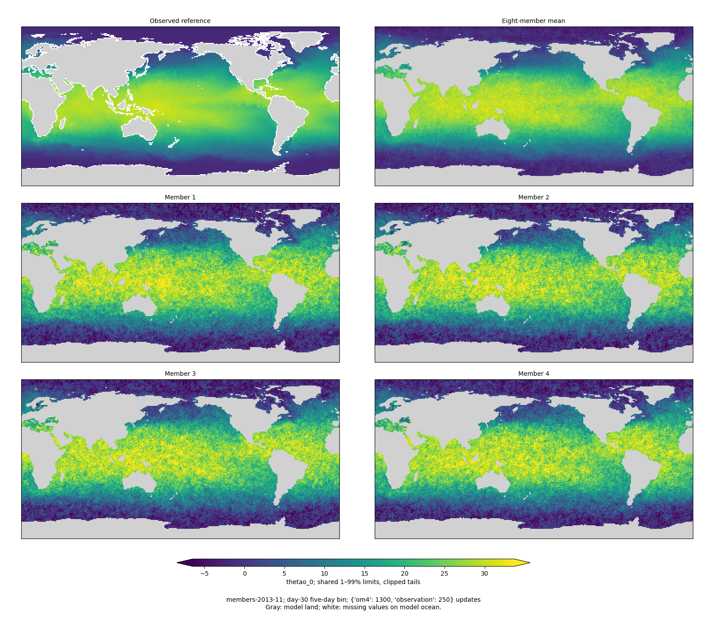
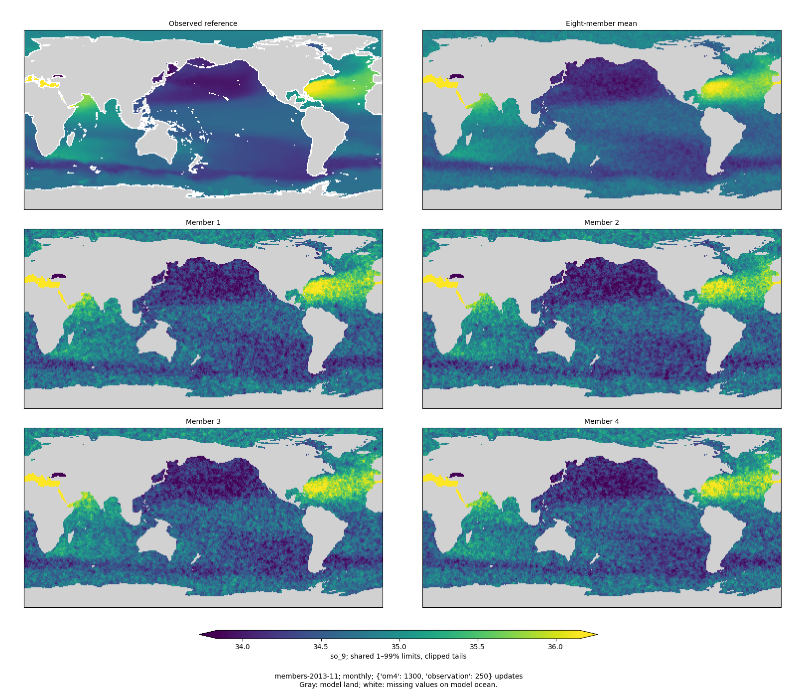
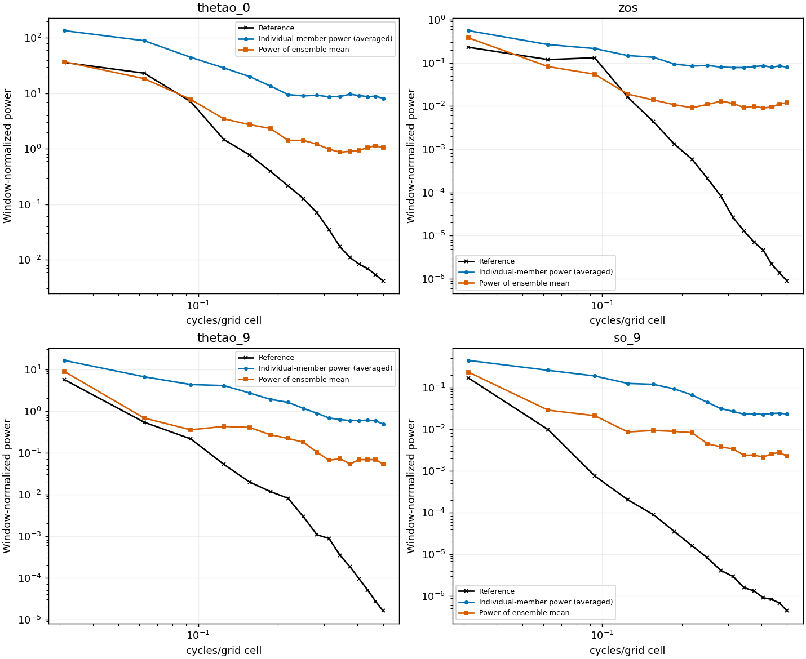
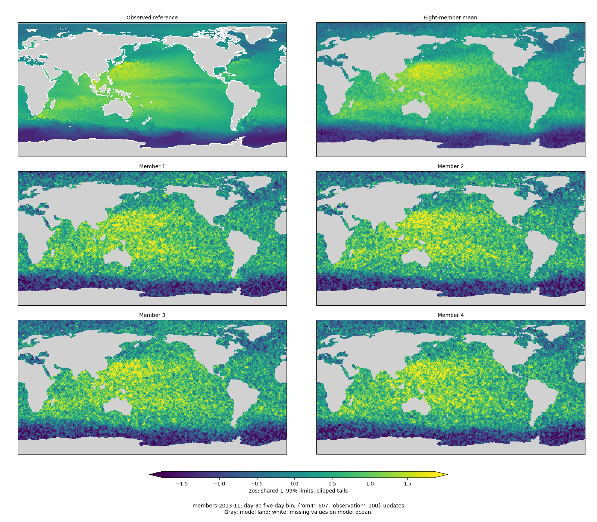
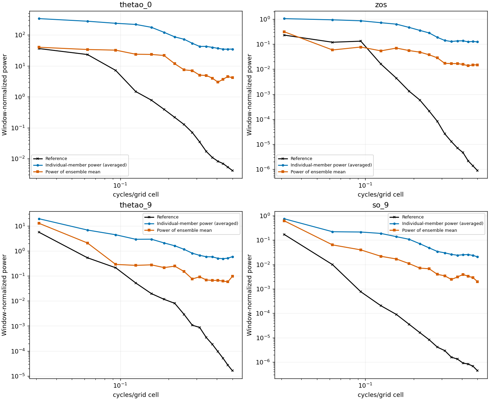
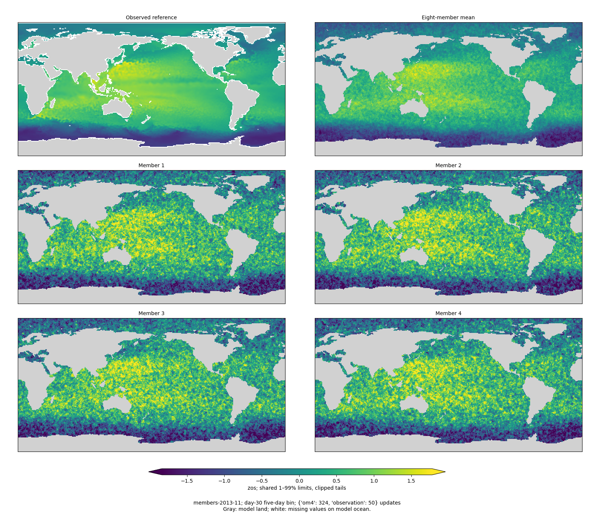
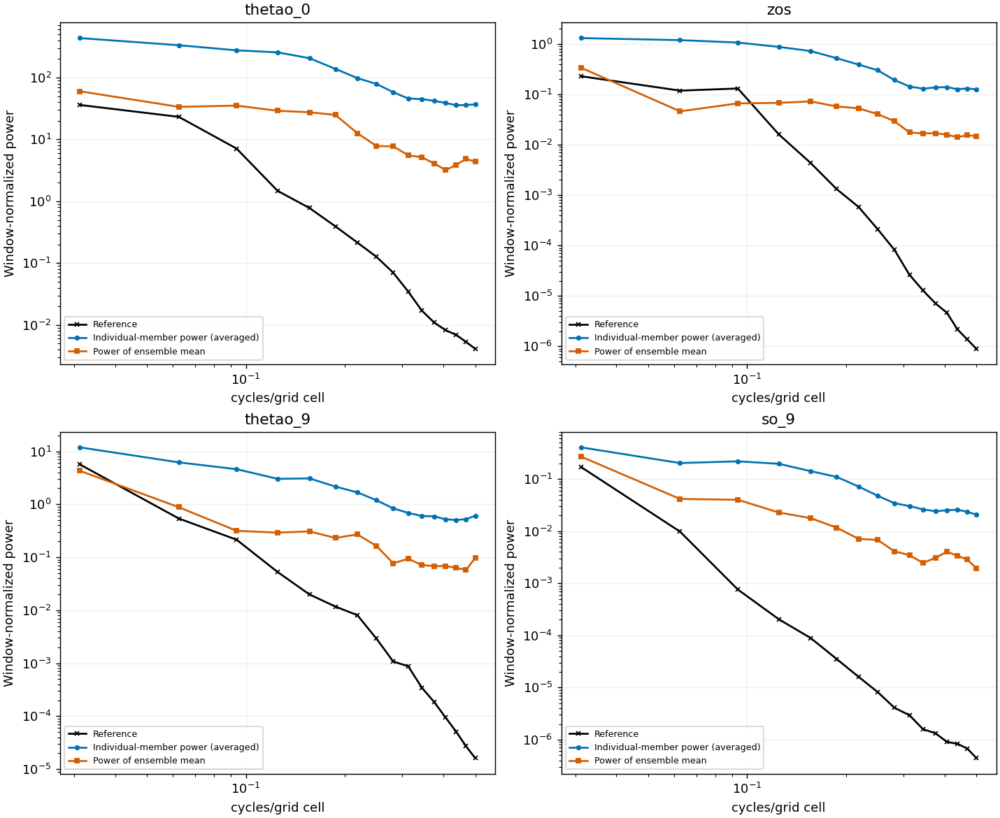

<!-- SPDX-FileCopyrightText: 2026 Samudra Authors -->
<!-- SPDX-License-Identifier: CC-BY-4.0 -->

# Global diffusion: early checkpoints

**Compute update:** Training is running on eight Torch RTX GPUs. The colleague's
seed-fund reservation is excluded. B200 qualified faster, but current B200/H200
queue estimates are later than continuing on RTX. See
[hardware measurements and migration provenance](global-matched-run.md#alternative-compute-torch).
Historical reservation plans below are superseded.

## October 2 update: 250 observation updates

**Surface grain is now decreasing, but remains excessive; interior grain has
barely changed.** The validation composite improves 29.0% from 100 updates,
reaching **1.4025**, while the matched deterministic control scores **0.9495**.
Day-30 SST RMSE falls from 3.196°C to **1.645°C**. This checkpoint has completed
3.125% of the planned observation exposure, so it is still an early comparison.
The optimizer and scientific configuration continued unchanged across the
Engaging-to-Torch migration; native OM4 uses each cluster's existing version,
while observation payloads and the validation reference are identical.

| Observation / OM4 updates | Diffusion validation composite | Matched deterministic composite | Day-30 diffusion SST RMSE |
|---|---:|---:|---:|
| 25 / 169 | 2.6122 | 1.8567 | 3.654°C |
| 50 / 324 | 2.2069 | 1.4791 | 3.608°C |
| 100 / 607 | 1.9749 | 1.1472 | 3.196°C |
| 250 / 1,300 | 1.4025 | 0.9495 | 1.645°C |

Relative to 25 updates, individual-member power in the highest four Pacific
patch spectral bins falls **76.6% for SST and 37.5% for SSH**. Monthly T550
power increases 4.2%; monthly S550 decreases only 2.1%. These are changes in
sampled-field power, not spectral error reductions. All four fields still have
excessive small-scale power relative to their observational references. The
maps remain visibly grainy, including the ensemble mean. Monthly T/S maps
already average independent readouts, so they do not establish instantaneous
interior realism or temporal coherence.

| Calibration at 250 updates | Surface, all forecast bins | Monthly interior |
|---|---:|---:|
| Ensemble-mean RMSE, standardized | 0.2429 | 0.2253 |
| Ensemble spread, standardized | 0.4948 | 0.3941 |
| Spread / RMSE | 2.04 | 1.75 |
| Fair CRPS | 0.1345 | 0.1143 |
| Empirical CRPS | 0.1685 | 0.1421 |
| Empirical central 80% coverage | 92.2% | 91.9% |
| Empirical central 90% coverage | 95.3% | 95.0% |

Surface spread has almost halved since 100 updates (0.9416 → 0.4948), reducing
its spread/error ratio from 2.38 to 2.04. Interior spread changes little while
mean error improves, increasing its ratio from 1.50 to 1.75. Both remain
pooled-overdispersed. These finite-eight-member summaries use the same weighting
and coverage conventions described below.

The forecast pixel fair-CRPS term is 0.11786 and the spatial term 0.11336.
Decoded-field gradient norms remain comparable: **1.13e-4 pixel / 1.24e-4
spatial**. This confirms active supervision at the outputs, not which term
caused the improvement.

[All 12 maps and numerical assets at 250 updates](global-early-assets/obs250/) ·
[Metrics and checkpoint manifest](global-early-assets/obs250/COMPLETE.json.gz) ·
[Calibration and field-gradient records](global-early-assets/obs250/calibration.json.gz) ·
[Matched deterministic event](global-early-assets/obs250/matched-baseline.json) ·
[Pooled summary](global-early-assets/obs250/summary.json).

Eight-RTX job **19028464** completed at global step 1,550 in 6,365 seconds.
Evaluation **19028475** completed all nine validation origins in 563 seconds on
one RTX GPU. The checkpoint and transferred array hashes were independently
verified. Allocation through this checkpoint/evaluation is **30.70 GPU-hours**,
including earlier qualifications, failures and preemption. Continuation
**19032747** is running on eight RTX GPUs toward global step 2,667 (2,167 OM4 /
500 observation); evaluation **19032748** is queued behind it. No held-out test
cases have been used for these early checks.

## Morning update: 100 observation updates

The new model is learning, but **mean prediction is improving much faster than
member texture or calibration**. At 100 observation updates, the global composite
is **1.9749**, compared with **1.1472** for the deterministic control at identical
data exposure. Day-30 SST RMSE is **3.196°C**. Member grain persists in the maps.
These are still early checkpoints: 100 is only 1.25% of the planned observation
updates. No scientific configuration has changed between these checkpoints.

| Observation / OM4 updates | Diffusion validation composite | Matched deterministic composite | Day-30 diffusion SST RMSE |
|---|---:|---:|---:|
| 25 / 169 | 2.6122 | 1.8567 | 3.654°C |
| 50 / 324 | 2.2069 | 1.4791 | 3.608°C |
| 100 / 607 | 1.9749 | 1.1472 | 3.196°C |

Compared with 25 updates, high-frequency member power in the same Pacific patch
diagnostic falls **5.8% SST, 3.4% SSH, 2.2% monthly T550 and 1.9% monthly S550**.
This remains far above the reference power at small scales. Forecast pixel fair
CRPS falls to 0.15388 while its spatial component is 0.13694; decoded-field gradient
norms remain comparable, **1.15e-4 pixel / 1.23e-4 spatial**.

| Calibration at 100 updates | Surface, all forecast bins | Monthly interior |
|---|---:|---:|
| Ensemble-mean RMSE, standardized | 0.3957 | 0.2692 |
| Ensemble spread, standardized | 0.9416 | 0.4042 |
| Spread / RMSE | 2.38 | 1.50 |
| Fair CRPS | 0.2389 | 0.1331 |
| Empirical CRPS | 0.3053 | 0.1616 |
| Empirical central 80% coverage | 95.4% | 87.7% |
| Empirical central 90% coverage | 97.5% | 92.0% |

[All 12 maps and numerical assets at 100 updates](global-early-assets/obs100/) ·
[Metrics and checkpoint manifest](global-early-assets/obs100/COMPLETE.json.gz) ·
[Calibration and field-gradient records](global-early-assets/obs100/calibration.json.gz) ·
[Matched deterministic event](global-early-assets/obs100/matched-baseline.json) ·
[Pooled summary](global-early-assets/obs100/summary.json).

Four-H200 job **24628644** recovered automatically after preemption. It used
454 seconds before preemption and 4,058 seconds after requeue, finishing at global
step 713 (612 OM4 + 101 observation updates). The immutable **step-00707** snapshot
has exactly 607/100 updates and is the one evaluated here. Evaluation **24628822**
completed in 630 seconds on one H200. Total new-run allocation through this check
is **11.2875 GPU-hours**, including failed qualifications and the preempted segment.
Reserved **eight-H200 job 24614650** is waiting only for its **October 2, 10:01 a.m.
Eastern** earliest start. It resumes the latest optimizer at step 713. The next
planned validation is the 250-observation-update snapshot.

## Update: 50 observation updates

The validation composite improves **15.5%**, from 2.6122 to **2.2069**, but remains
worse than the deterministic control at matched exposure. Member grain barely
changes: average power in the highest four Pacific diagnostic spectral bins falls
only **0.7–1.2%** across the four displayed fields. Better mean prediction is not
yet accompanied by substantially more realistic sampled texture.

| Observation / OM4 updates | Diffusion validation composite | Matched deterministic composite | Day-30 diffusion SST RMSE |
|---|---:|---:|---:|
| 25 / 169 | 2.6122 | 1.8567 | 3.654°C |
| 50 / 324 | 2.2069 | 1.4791 | 3.608°C |

All entries use the same frozen validation reference and nine origins; lower is
better. These are fixed-exposure checkpoints, not validation-selected endpoints.

| Calibration at 50 updates | Surface, all forecast bins | Monthly interior |
|---|---:|---:|
| Ensemble-mean RMSE, standardized | 0.4726 | 0.3176 |
| Ensemble spread, standardized | 0.9974 | 0.4085 |
| Spread / RMSE | 2.11 | 1.29 |
| Fair CRPS | 0.2711 | 0.1552 |
| Empirical CRPS | 0.3415 | 0.1840 |
| Empirical central 80% coverage | 93.2% | 82.6% |
| Empirical central 90% coverage | 96.1% | 87.9% |

Mean errors improve while spread barely shrinks, increasing overdispersion relative
to mean error. The forecast pixel fair-CRPS component falls from 0.20295 to 0.17803;
the weighted spatial component changes only from 0.14006 to 0.13906. At 50 updates,
their average decoded-field gradient norms are **1.19e-4 pixel / 1.23e-4 spatial**.
The spatial term is active and not negligible at the physical output, although
these are not parameter-gradient norms and do not establish its optimization effect.

[All 12 maps and numerical assets at 50 updates](global-early-assets/obs50/) ·
[Metrics and checkpoint manifest](global-early-assets/obs50/COMPLETE.json.gz) ·
[Calibration and field-gradient records](global-early-assets/obs50/calibration.json.gz) ·
[Matched deterministic event](global-early-assets/obs50/matched-baseline.json) ·
[Pooled summary](global-early-assets/obs50/summary.json).

Four-H200 segment **24621174** completed 180 additional updates in 2,948 seconds;
evaluation **24626161** completed in 695 seconds on one H200. The new-run allocation
through this evaluation is **6.0992 GPU-hours**, including failed qualifications.
The unused long four-GPU request **24611683** was canceled before allocation.
Bounded four-H200 continuation **24628644** targets the 100-observation-update
checkpoint while waiting for reserved eight-H200 job **24614650**, which now
depends on it. The reserved job cannot start before October 2 at 10:01 a.m. Eastern.
The remaining sections preserve the first-checkpoint analysis.

## Initial checkpoint: 25 observation updates

The first checkpoint is numerically healthy but **has not solved the grain**.
After **169 OM4 + 25 observation updates**, its global validation composite is
**2.6122**, versus **1.8567** for the deterministic mixed control at exactly the
same exposure. Lower is better: this is 40.7% worse. Both use effective batch eight,
the same nine validation dates and the same frozen global scoring reference.
This comparison is about early learning, not converged performance; the new
model has completed only 194 of 16,000 total updates. Architecture and objectives
differ, as specified in the [execution plan](global-matched-run.md).

The score is the integrated-error-plus-spectral **validation** composite. It is
not the differently normalized held-out reporting score around 0.59. The
deterministic mixed endpoint's validation score is 0.5652 at full exposure.
No held-out test cases were used in this early check.

## What the members show

The mean captures broad geographical structure, but SSH and SST individual
members remain very grainy. Averaging eight members suppresses some texture;
it does not make the sampled fields realistic. Monthly T/S averaging suppresses
additional independent readout noise, so its visually smoother fields and more
reasonable pooled spread do not demonstrate realistic instantaneous interiors.

Each map cell occupies exactly 2×2 image pixels, with nearest-neighbor rendering.
Panels share physical 1–99% color limits; tails clip. Gray is model land/depth
mask; white is missing observations on model ocean. Surface panels compare the
same five-day interval ending at day 30; interiors compare calendar-weighted
monthly means. There is no instantaneous interior reference implied here.

## Spectra and calibration

These diagnostic spectra use an entirely observed 32×32 Pacific patch, selected
by the same geographic rule for every date/field, and a Hann window. Curves average
all nine dates; the blue curve averages power measured separately in each member.
The orange curve measures power after averaging the fields. They are distinct
operations. High-frequency power is excessive even in the ensemble mean. These
patch diagnostics are separate from the established regional spectral metrics
used in the composite score; they are not global ocean spectra.

| Pooled observation-standardized diagnostic | Surface, all forecast bins | Monthly interior |
|---|---:|---:|
| Ensemble-mean RMSE | 0.5426 | 0.3754 |
| Ensemble spread, unbiased sample standard deviation | 1.0100 | 0.4109 |
| Spread / RMSE | 1.86 | 1.09 |
| Fair CRPS | 0.2988 | 0.1789 |
| Empirical CRPS | 0.3701 | 0.2079 |
| Empirical central 80% coverage | 90.3% | 78.5% |
| Empirical central 90% coverage | 94.2% | 84.3% |

Additive numerators and finite cosine-weighted support are pooled across dates,
leads and channels before division. RMSE and spread are square roots of the pooled
variances, not averages of standard deviations. These summaries do not use the
training task weights. Surface spread is clearly excessive; the interior's pooled
spread/RMSE near one does not imply calibrated tails or correct spatial structure.
Quantile coverage uses only eight members and is a finite-ensemble diagnostic.
Day-30 SST ensemble-mean RMSE in the established metric is **3.654°C**.

## Other dates and fields

| Validation origin | SST, day 30 | SSH, day 30 | T at 550 m, monthly | S at 550 m, monthly |
|---|---|---|---|---|
| November 2013 | [maps](global-early-assets/members-2013-11-thetao_0.png) | [maps](global-early-assets/members-2013-11-zos.png) | [maps](global-early-assets/members-2013-11-thetao_9.png) | [maps](global-early-assets/members-2013-11-so_9.png) |
| March 2014 | [maps](global-early-assets/members-2014-03-thetao_0.png) | [maps](global-early-assets/members-2014-03-zos.png) | [maps](global-early-assets/members-2014-03-thetao_9.png) | [maps](global-early-assets/members-2014-03-so_9.png) |
| July 2014 | [maps](global-early-assets/members-2014-07-thetao_0.png) | [maps](global-early-assets/members-2014-07-zos.png) | [maps](global-early-assets/members-2014-07-thetao_9.png) | [maps](global-early-assets/members-2014-07-so_9.png) |

## Execution and next checkpoints

Engaging prefix **24598325** completed successfully in 7,894 seconds on one H200,
accumulating eight samples per optimizer update. Evaluation **24598449** completed
in 637 seconds on one H200. Including qualification and failed qualification
attempts, this new run has used **2.6306 GPU-hours** before the continuation.

The planned eight-H200 continuation **24597458** was canceled before allocation:
Engaging's partition QOS `mit_preemptable` has `MaxTRESPU=gres/gpu=4`. Slurm accepted
the eight-GPU submission but could not schedule it. Four-H200 replacement
**24611683** is queued and resumes the same checkpoint and optimizer; effective
batch remains eight. The earlier four-day projection assumed eight GPUs and is
not yet established. An additional reservation already assigned to this account permits eight H200s
on `node3400` from October 2 at 10 a.m. Eastern through October 7. Reserved
continuation **24614650** is now queued with an explicit October 2 10:01 a.m.
earliest start and a dependency on **24611683**, using the reservation-specific
account/QOS. Its six-hour segment resumes the same optimizer. This avoids moving
the run to Torch. A full-run ETA will use actual multi-GPU throughput, not ideal
scaling; the reserved job has not started yet.

Continue the authorized run without changing its scientific configuration. The
next useful matched checks are at 50, 100 and 250 observation updates, tracking
the composite, member spectra, spread and CRPS together. An early reduction in
training loss alone will not be treated as evidence that grain is resolved.

## Reproduction and numerical records

Producer/evaluator: `4ecba36a40b7b581edeaa2292c90d1953fca7aa0`.
Checkpoint: Engaging `diffusion-global-v1/train/step-00194.pt`.
Full nine-origin member arrays remain in
`/orcd/scratch/orcd/014/jrusak/diffusion-global-v1/evaluation/obs25-steps32`;
every array passed the completion manifest's SHA256 check after retrieval.

- [Complete metrics, checkpoint identity and input contract](global-early-assets/COMPLETE.json.gz)
- [Per-origin additive calibration and decoded-field gradient diagnostics](global-early-assets/calibration.json.gz)
- [Matched deterministic validation event and source fingerprint](global-early-assets/matched-baseline.json)
- [Pooled summary](global-early-assets/summary.json) and [per-member spectral values](global-early-assets/spectra.json)
- [Renderer](../../../scripts/report_diffusion_global_early.py)

The report renderer verified every exported array hash. Native-pixel panel bounds
are asserted during rendering, and repository lint/type/license checks cover the
new code. The nine-origin evaluation exited successfully; missing-observation
variance warnings were limited to cells without reference support.
