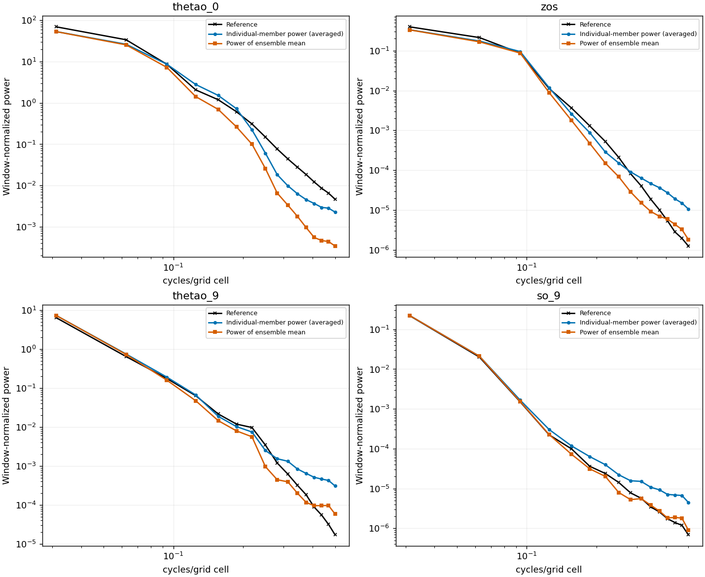
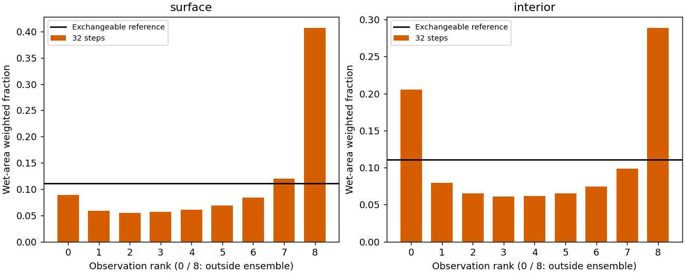
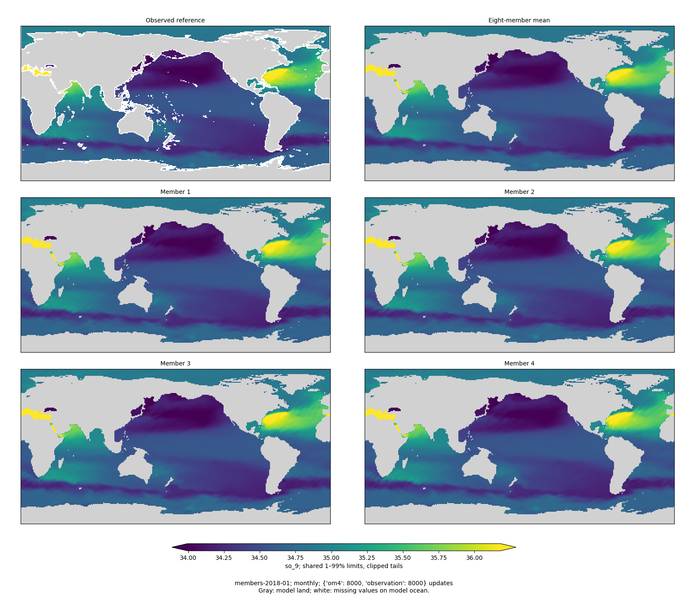
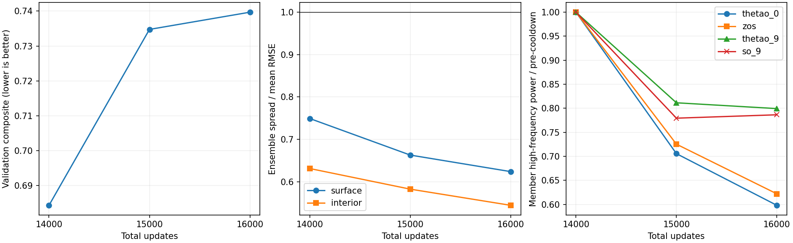
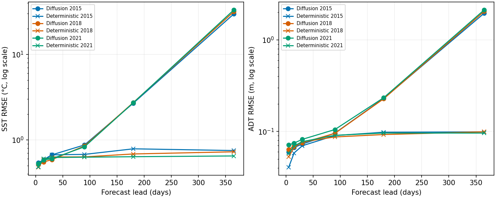
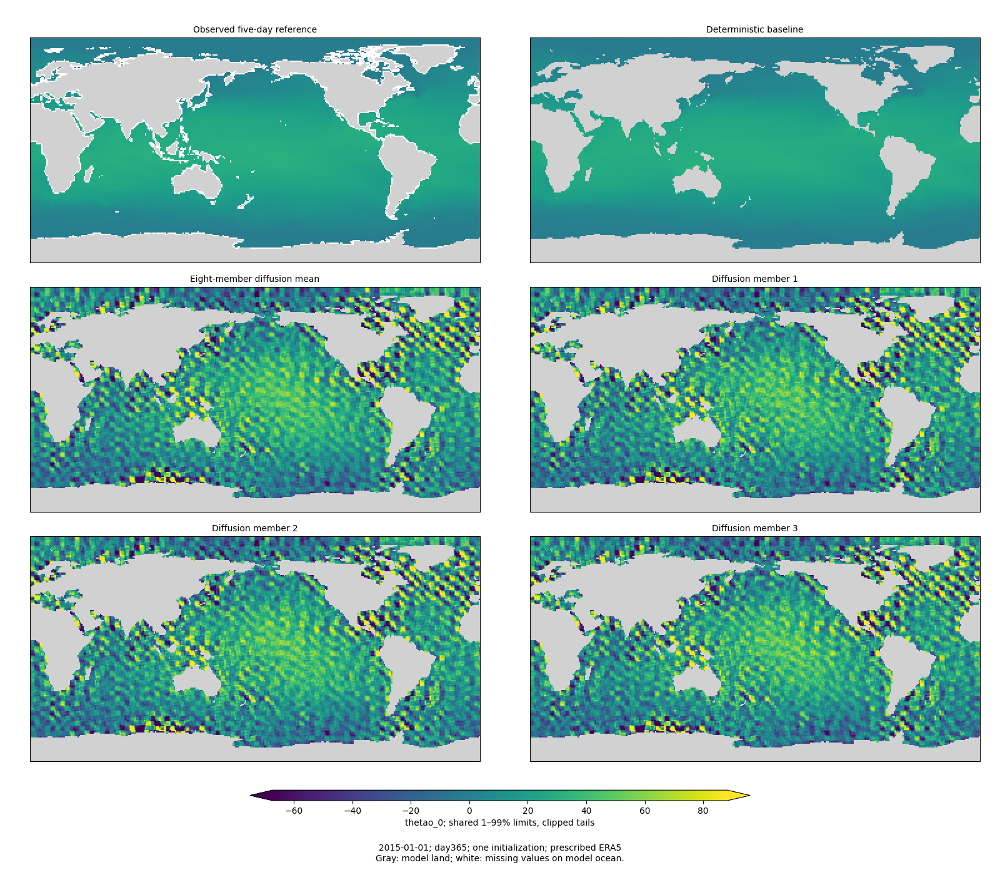
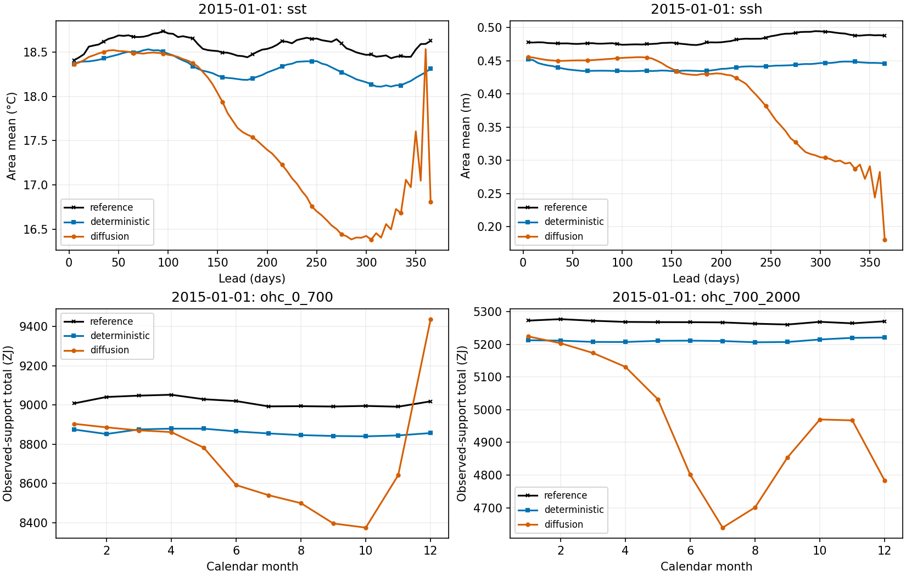
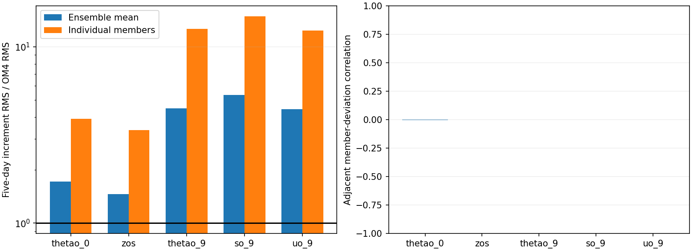
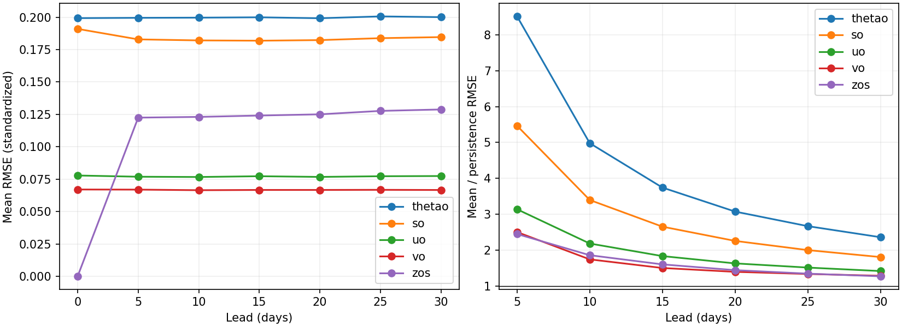
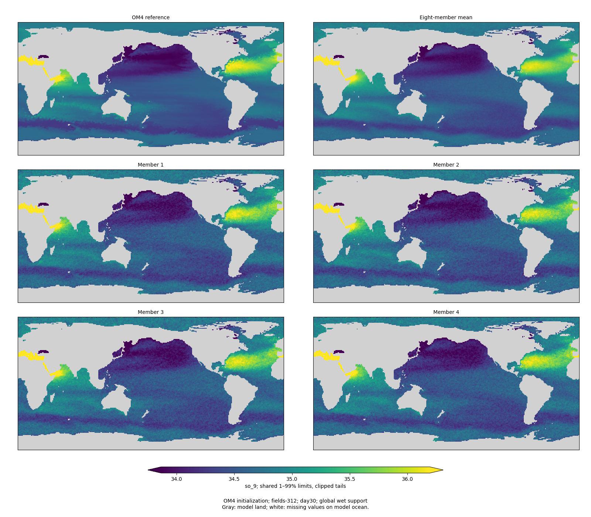

<!-- SPDX-FileCopyrightText: 2026 Samudra Authors -->
<!-- SPDX-License-Identifier: CC-BY-4.0 -->

# Global latent diffusion: final 16k results

**Training is complete: 8,000 OM4 + 8,000 observation updates, effective batch
8, with the planned cosine LR cooldown inside the last 2,000 updates.** This
recipe improves held-out marginal probabilistic scores, but loses the overall
point/spectral comparison and does not deliver a stable long forecast. All three annual cases fail:
day-365 SST RMSE is **29.6–33.0°C**, versus **0.65–0.75°C** for the matched
deterministic control. The native OM4 endpoint also loses to persistence at day
30. Reduced grain alone is not evidence of improved forecasting.

The cooldown comparison is mixed: individual-member high-frequency power falls
20–40%, but validation composite worsens from **0.6843 to 0.7397**, and ensembles
become more underdispersed. This compares different update counts and cannot
isolate the causal effect of LR.

## Held-out month-scale skill

The fixed endpoint was evaluated on **all 96 monthly origins, January 2015 through
December 2022**, using eight members and 32 sampling steps. No held-out score was
used to select the endpoint or sampling setting.

| Held-out diagnostic, lower is better | Diffusion | Matched deterministic |
|---|---:|---:|
| Integrated/spectral composite | **0.7161** | **0.5927** |
| Day-30 SST RMSE | **0.607°C** | 0.642°C |
| Geostrophic surface velocity RMSE, mean of scored leads | 0.1338 m/s | **0.1048 m/s** |
| EKE RMSE | 0.02661 m²/s² | **0.02338 m²/s²** |
| Monthly OHC RMSE, 0–700 m | **0.683 GJ/m²** | 0.740 GJ/m² |
| Monthly OHC RMSE, 700–2000 m | **0.402 GJ/m²** | 0.422 GJ/m² |
| Mean regional spectral error | 0.554 dex | **0.344 dex** |

SST at day 30 improves **5.5%**, and the two OHC errors improve **7.6% / 4.8%**.
Surface geostrophic diagnostics and spectra worsen enough that the composite is
**20.8% higher**. Its EKE is derived from ensemble-mean SSH, not the directly
predicted interior velocities. Geometric EKE predicted/reference spectral power
is just **0.0456×** across the scored bins. OHC measures depth-integrated
monthly temperature; it is not the same quantity as pooled T/S error below.

The composite uses the **training seasonal climatology's errors evaluated on this
same held-out cohort**, matching the published deterministic **0.5927**. It is
half the mean of five normalized integrated errors plus half the mean spectral
error over 27 validation-qualified keys. With the original frozen *validation*
denominators instead, the test scores are **0.7691 versus 0.6425**. Both versions
are retained; neither should be mixed with a differently normalized baseline.

| Pooled standardized diagnostic | Surface diffusion | Surface deterministic | Interior diffusion | Interior deterministic |
|---|---:|---:|---:|---:|
| Mean RMSE | 0.1178 | **0.1112** | 0.0935 | **0.0923** |
| Fair CRPS / point-mass CRPS | **0.06069** | 0.08126 | **0.03979** | 0.05428 |
| Empirical eight-member CRPS / point-mass CRPS | **0.06430** | 0.08126 | **0.04197** | 0.05428 |
| Spread / mean RMSE | 0.545 | — | 0.470 | — |
| Observation outside all eight members | 49.6% | — | 49.4% | — |

The fair-CRPS improvements are **25.3% surface / 26.7% interior**; empirical CRPS
also improves **20.9% / 22.7%**. The deterministic comparison is its **MAE**, which
is exactly CRPS for a point mass, not its training MSE. All per-origin/channel/lead
weights and finite-cell counts were verified identical. Surface scores include
all six/seven monthly forecast bins; interior scores use each member's monthly
average before scoring. This is a valid distribution-versus-point comparison,
but does not show that diffusion beats a calibrated probabilistic version of the
deterministic model. The ensembles still fail to cover their errors reliably.

The [test assets](global-final-assets/test/) include SST, SSH, temperature and
salinity maps for January 2015/2018/2021, individual-member spectra over all
96 origins, calibration and receipts. The [matched numerical comparison](global-final-assets/comparison/heldout-comparison.json)
retains both score normalizations and deterministic lineage.

| Held-out origin | Day-30 SST | Day-30 SSH | Monthly T, 550 m | Monthly S, 550 m |
|---|---|---|---|---|
| 2015-01 | [Map](global-final-assets/test/members-2015-01-thetao_0.png) | [Map](global-final-assets/test/members-2015-01-zos.png) | [Map](global-final-assets/test/members-2015-01-thetao_9.png) | [Map](global-final-assets/test/members-2015-01-so_9.png) |
| 2018-01 | [Map](global-final-assets/test/members-2018-01-thetao_0.png) | [Map](global-final-assets/test/members-2018-01-zos.png) | [Map](global-final-assets/test/members-2018-01-thetao_9.png) | [Map](global-final-assets/test/members-2018-01-so_9.png) |
| 2021-01 | [Map](global-final-assets/test/members-2021-01-thetao_0.png) | [Map](global-final-assets/test/members-2021-01-zos.png) | [Map](global-final-assets/test/members-2021-01-thetao_9.png) | [Map](global-final-assets/test/members-2021-01-so_9.png) |

## What was compared

This is the globally matched replacement for the earlier ±60° runs, not a
continuation of their weights. The observation protocol matches the deterministic
control: 243 training / nine validation / 96 held-out monthly origins; global
finite wet support; cosine latitude weights; observation normalization; zero
normalized placeholders with validity; observed-only anchoring and structured
hiding. Both endpoints have 8k updates of each task at effective batch eight.
Training observation targets end before 2014; held-out origins span 2015–2022.

The surface targets are **five-day SSH/SST bins**, and interiors are **monthly
IAP temperature/salinity**, not daily fields or individual Argo profiles. Forcing
is prescribed ERA5 on observation tasks and native OM4 forcing on OM4 tasks;
future ocean observations are not inputs. Torch and Engaging use identical staged
observation payloads. Their compatible native OM4 versions differ, as explicitly
approved. This is data/task-exposure matching, not matched architecture, objective,
parameter count, or FLOPs.

This is one diffusion seed against the existing mixed deterministic endpoint.
It does not isolate the value of adding OM4, higher-resolution targets, the noise
kernel or the LR schedule. The observation-only controls in the broader data
study answer a different comparison; this report does not rerun them.

The 121.7M-parameter model has a surface-history initializer, width-128 persistent
latent state, four processor blocks and a width-192 diffusion decoder. **The latent
trajectory is deterministic; diffusion decodes physical fields.** All components
train jointly from scratch. Independent readout noise at different leads does not
produce coherent uncertain trajectories. Training uses two members; reporting
uses eight and 32 Heun steps (63 denoiser calls). The noise is an equal-variance
mixture of white and spatially correlated Gaussian noise. Spatial losses are
present: pixel plus 0.5 times each directional difference loss, using clean-field
MSE on OM4 and fair CRPS on observations. Each interior member is monthly-averaged
before the observational loss. See the [full recipe](global-matched-run.md) and
[cooldown contract](global-cooldown.md).

## Cooldown: smoother, narrower, no composite gain

All rows use the same nine validation origins, 32 sampling steps and eight
members. Full target arrays, masks, coordinates and training contracts were
verified identical. The 14k/15k evaluations ran on H100; 16k ran on RTX. No
cross-hardware bitwise identity is assumed.

| Total updates | OM4 / observation | Validation composite | Surface spread / RMSE | Interior spread / RMSE |
|---|---:|---:|---:|---:|
| 14,000, before taper | 7,657 / 6,343 | **0.6843** | 0.749 | 0.631 |
| 15,000 | 7,852 / 7,148 | 0.7347 | 0.663 | 0.582 |
| 16,000 | 8,000 / 8,000 | 0.7397 | 0.624 | 0.544 |

| Validation diagnostic | Before taper | Final |
|---|---:|---:|
| Surface mean RMSE, standardized | 0.1040 | 0.1029 |
| Interior mean RMSE, standardized | 0.0879 | 0.0796 |
| Surface fair CRPS | 0.04960 | 0.04971 |
| Interior fair CRPS | 0.03657 | 0.03392 |
| Surface observation outside all eight members | 35.7% | 42.2% |
| Interior observation outside all eight members | 38.2% | 45.0% |

Interior RMSE and fair CRPS improve, but the ensemble contracts faster than its
error falls. The outside-range reference for eight exchangeable members is 22.2%.
Pooled standardized statistics are not the integrated/spectral composite and can
move differently. The final validation spectral error is 0.579 dex; ensemble-mean
SSH-derived EKE power remains only about 0.041 times the reference geometrically
across scored bins. Smoother members do not repair that mean-field deficiency.

| Field | Member high-frequency power reduction, 14k → 16k | Final / reference power |
|---|---:|---:|
| SST | 40.2% | 0.46× |
| SSH | 37.8% | 7.53× |
| Monthly temperature, 550 m | 20.1% | 8.80× |
| Monthly salinity, 550 m | 21.4% | 8.72× |

These average **individual-member powers**, not spectra of the mean, in the
highest four bins of identical 32×32 Pacific patches over nine dates. SST already
has deficient power there; SSH and monthly interiors retain excess power. Monthly
interior references are smooth and have very little power at short wavelengths,
so the ratios do not by themselves establish large physical errors or misplaced
eddies. [Numerical comparison](global-final-assets/comparison/cooldown-comparison.json).

## Annual rollout: drift dominates the ensemble mean too

Each case starts once from surface observations on January 1 and takes 73
five-day steps with prescribed ERA5. No later surface observation is assimilated.
The annual targets, including the complete surface/velocity arrays and monthly
OHC arrays, match the deterministic control exactly.

| Lead | Diffusion SST RMSE | Deterministic SST RMSE | Diffusion SSH RMSE | Deterministic SSH RMSE |
|---|---:|---:|---:|---:|
| 30 days | 0.618°C | 0.640°C | 0.077 m | 0.075 m |
| 90 days | 0.849°C | 0.644°C | 0.099 m | 0.089 m |
| 180 days | 2.713°C | 0.701°C | 0.230 m | 0.096 m |
| 365 days | **31.404°C** | **0.707°C** | **2.044 m** | **0.098 m** |

These are means of the three per-origin RMSEs, not a pooled global RMSE or the
96-month test cohort. January 2015, 2018 and 2021 all fail. Day-30 SST can look
competitive while the longer trajectory diverges.

The large pattern persists in the ensemble mean and individual members. It is not
just uncorrelated sampling grain that averaging can remove. A common latent
trajectory and its decoder can both contribute; these outputs do not isolate
which component creates the drift. The model was trained through approximately
one month, whereas this diagnostic runs for a year.

The day-365 ensemble spread is itself unphysical: about **6.5°C for SST** and
**0.40 m for SSH**. Nevertheless spread/RMSE is only **0.19–0.22**, and **71–76%**
of observations lie outside all eight members. Large uncertainty therefore does
not cover the much larger shared error. These are marginal lead-specific
diagnostics; they do not turn the independently sampled outputs into trajectories.

All [annual SSH/SST maps](global-final-assets/annual/) include day 30 and day 365
for each of the three dates. Each grid cell occupies exactly 2×2 image pixels.
Color limits are shared within a figure, not across dates/leads. Day-365 limits
expand dramatically because predictions are physically extreme; gray denotes
model land and white missing reference values on wet cells.

| Annual initialization | Day-30 SST | Day-30 SSH | Day-365 SST | Day-365 SSH |
|---|---|---|---|---|
| 2015-01-01 | [Map](global-final-assets/annual/annual-2015-01-01-day30-thetao_0.png) | [Map](global-final-assets/annual/annual-2015-01-01-day30-zos.png) | [Map](global-final-assets/annual/annual-2015-01-01-day365-thetao_0.png) | [Map](global-final-assets/annual/annual-2015-01-01-day365-zos.png) |
| 2018-01-01 | [Map](global-final-assets/annual/annual-2018-01-01-day30-thetao_0.png) | [Map](global-final-assets/annual/annual-2018-01-01-day30-zos.png) | [Map](global-final-assets/annual/annual-2018-01-01-day365-thetao_0.png) | [Map](global-final-assets/annual/annual-2018-01-01-day365-zos.png) |
| 2021-01-01 | [Map](global-final-assets/annual/annual-2021-01-01-day30-thetao_0.png) | [Map](global-final-assets/annual/annual-2021-01-01-day30-zos.png) | [Map](global-final-assets/annual/annual-2021-01-01-day365-thetao_0.png) | [Map](global-final-assets/annual/annual-2021-01-01-day365-zos.png) |

Annual-mean SST bias is only −0.89 to −0.99°C despite enormous late spatial
RMSE: positive and negative regional errors cancel. A global mean alone would
hide much of the failure. Annual-mean OHC bias is −262 to −283 ZJ in 0–700 m
and −304 to −314 ZJ in 700–2000 m; the deterministic ranges are −142 to −159
and −56 to −57 ZJ respectively. These are biases averaged over the twelve
monthly absolute totals, not year-to-year heat-content trends.

Absolute series use fixed common finite support throughout each year, with no
extrapolation into missing ocean. SST/SSH means use cosine latitude weights;
OHC sums column J/m² times spherical cell area, divided by 10²¹, with a 0°C
temperature reference. Retained OHC areas are 3.086×10¹⁴ and 2.875×10¹⁴ m².
The binary wet grid has no fractional coastal-area correction. All three years'
curves and support counts are in the annual assets.

## Temporal uncertainty: members are not trajectories

On the annual cases through day 30, adjacent member-deviation correlations are
approximately zero: 0.002 for SST/SSH, −0.003 for temperature at 550 m and −0.001
for salinity there. These measure deviations from the ensemble mean, not the
correlation of the full seasonal fields.

Five-day SST increment RMS is 0.548°C per member, 0.277°C for the mean and 0.397°C
in the reference. For SSH the corresponding values are 0.0578, 0.0233 and 0.0268 m.
These are averages of the three area/time-pooled case statistics. Member labels
have no persistent uncertainty semantics across leads. Monthly averaging can
suppress this noise even when instantaneous fields are inconsistent.

The native OM4 test gives a direct interior reference and confirms the issue:
at 550 m, individual-member increment RMS is about 12.6 times OM4 for temperature
and 14.9 times OM4 for salinity. Even eight-member means remain about 4.5 and 5.3
times OM4. This is a separate failure from annual drift and cannot be diagnosed by
monthly CRPS alone.

## OM4 interior and velocity retention

The native test initializes from model-world surface history, then predicts all
77 channels through day 30 for 24 held-out origins in 2015–2022. It uses global wet
support and includes velocity supervision during training. It is not an
observational velocity validation and is not an annual native rollout.

| Variable | Day-30 ensemble-mean RMSE / persistence RMSE |
|---|---:|
| Temperature | 2.36× |
| Salinity | 1.81× |
| Zonal velocity | 1.42× |
| Meridional velocity | 1.29× |
| SSH | 1.27× |

Ratios use equal-channel mean normalized MSE within each variable, then take the
square root. They compare predictions with persistence from the known native
interior, a useful diagnostic with more initialization information than the
surface-only model receives.

Direct velocity has pooled day-30 mean RMSE **0.0722 m/s**, versus **0.0675 m/s**
for zero velocity. Fair CRPS is **0.03418 m/s**, worse than zero-velocity point-mass
CRPS **0.03136 m/s**. Velocity spread/RMSE is **1.67**, so this native ensemble is
overdispersed while observation-conditioned monthly ensembles are underdispersed.
The rank histogram is centrally peaked. Continuing to emit velocities and mixing
OM4 batches did not establish useful retained velocity skill at this endpoint.

The [native assets](global-final-assets/native/) also contain temperature and zonal
velocity maps at three fixed origins, per-channel errors, velocity depth profiles,
rank counts and temporal statistics. Only selected fields have full member-array
exports; numerical error diagnostics cover all 77 channels.

## Interpretation and proposed next experiments

The useful finding is that lower member grain is achievable within this recipe.
It is insufficient: annual stability, mean-field spectral fidelity, native skill
and uncertainty calibration remain separate problems. This experiment does not
show that diffusion is intrinsically unsuitable, or that lack of denoising steps
is the sole remaining issue.

Before another full-budget wave, prioritize these questions:

1. **Does the latent trajectory leave its training distribution?** Track latent
   norms and native/observation decoded errors versus lead, including earlier
   checkpoints. Compare a stable deterministic processor with a diffusion
   readout, then unfreeze it with a longer-rollout objective. This separates
   conditional decoding quality from the observed annual instability.
2. **Can the mean and uncertainty improve together?** First test a cheap
   probabilistic control around the deterministic model, fitting residual scales
   on training/validation data only. Then compare an explicit
   deterministic mean plus diffusion residual with the current joint decoder,
   using the same data/exposure. Monitor per-field spectra, fair/empirical CRPS
   and spread/error, not texture alone. A strong mean path is a hypothesis to
   test, not a demonstrated fix.
3. **Can uncertainty persist over time?** Train a joint space-time decoder or
   persistent stochastic latent trajectory and score five-day increment spectra
   and correlations against native truth. Merely reusing noise at inference
   changes a coupling; it does not establish a learned trajectory distribution.
4. **Does a longer-horizon objective preserve native dynamics?** Add periodic
   native long-rollout checks and explicit stability/mean-state constraints;
   compare native performance before and after late observation-heavy updates.
   The current endpoint alone cannot separate weak initial learning from
   catastrophic forgetting.

Review these results before submitting another training wave. No additional
training has been started.

## Reproduction and completion

The endpoint is `train-cooldown/step-16000.pt` under
`/scratch/jr7309/diffusion-global-v1` on Torch. Its SHA256 and the exact training
contract are retained in the evaluation receipts. `state.json` reports complete,
with exactly 8,000 updates of each task; the final LR is `1e-6` and recorded
module gradients are finite. The pre-cooldown full optimizer is retained as
`train-cooldown/cooldown-start-optimizer.pt` alongside immutable 14k/15k weights.

The unchanged training producer is `e8a6312ea`. Monthly evaluation uses
`4ecba36a4`; annual evaluation uses `db9e994d4`; native evaluation uses
`09f77165b`. The deterministic point comparison runs its own model producer
`4c058b3e` with evaluator `60acc76e7`: all 96 historical day-5..30 surface
predictions reproduced **bit-for-bit**. A first 20-second attempt failed because
it compared a seven-bin calendar-month forecast against a six-bin historical
export; the corrected comparison slices the historical six bins while keeping
all bins for the probability-score comparison. Both attempts are charged.

Raw arrays and manifests remain under the run root's `evaluation/` directory.
Archives transferred through Torch's DTN passed complete local/remote SHA256
read-back; member exports passed their per-file receipts. The report retains
machine-readable source receipts, cohort pairing, metrics and plotting code.

Final training job **19333127** completed on eight dedicated RTX GPUs. Final
validation **19397156**, held-out **19397157**, annual **19397158**, native
**19397160** and corrected deterministic comparison **19399224** all completed;
no campaign training/evaluation jobs remain running. The held-out evaluation used
5,834 seconds on one RTX GPU. Total allocation is **773.476 / 900 GPU-hours**,
including qualification, preemptions, failed starts and evaluations. The
[allocation ledger](global-final-assets/allocation-ledger.json) records each
completed attempt. This hardware-mixed total is accounting, not a FLOP-normalized
comparison with the deterministic model.

Checks include the annual member/unit/RNG export test, global annual-input tests,
known-noise temporal tests, exact target/support pairing, full export checksums,
Mypy and repository pre-commit checks. Figures were inspected at their saved
resolution. Secret scanning stays enabled; only verified checksum/Git-fingerprint
false positives receive specific baseline entries. No model training was changed
by the report scripts.

- [Monthly member-map, spectrum and calibration renderer](../../../scripts/report_diffusion_global_early.py)
- [Annual paired maps and temporal diagnostics](../../../scripts/report_diffusion_global_annual.py)
- [Native errors, members and temporal diagnostics](../../../scripts/report_diffusion_global_native.py)
- [Cooldown and matched held-out aggregation](../../../scripts/report_diffusion_global_final.py)
- [Deterministic point-mass CRPS evaluator](../../../scripts/evaluate_diffusion_deterministic_reference.py)
- [Final assets and receipts](global-final-assets/)
- [Earlier 6k report](global-6000-results.md)
