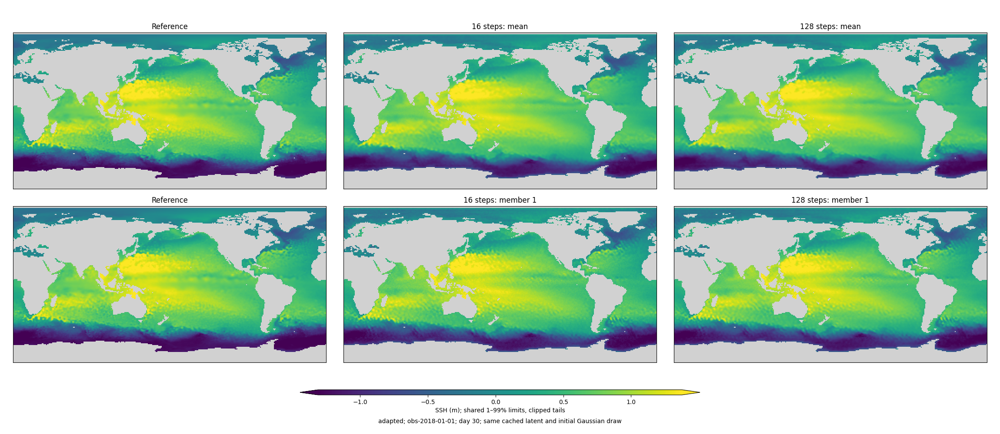
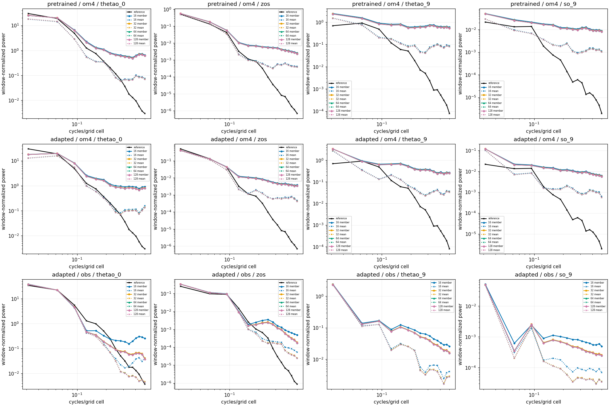
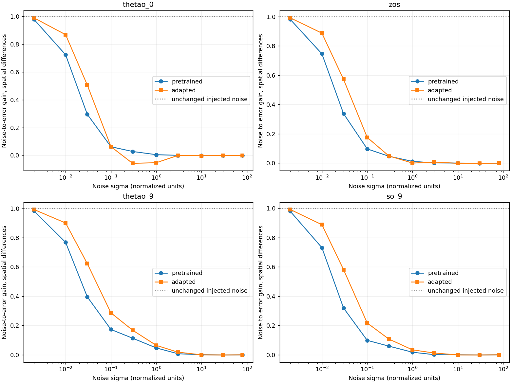

<!-- SPDX-FileCopyrightText: 2026 Samudra Authors -->
<!-- SPDX-License-Identifier: CC-BY-4.0 -->

# Grain diagnostics and a globally supervised next run

**Completed October 1. There are two contributions to the grain: learned
spatial structure/denoising, and a substantial 16-step sampling error specifically
for observation-initialized day-30 forecasts.** More steps alone is not a full fix:
it narrows ensembles and can worsen CRPS. The new-run proposal below therefore
uses 32 training steps, explicit spatial-distribution losses and sustained OM4
supervision on the global data contract.

Array **24582219**, evaluator `72a9c05ee`, completed both single-L40S evaluations
successfully. These diagnostics used **0.6808 GPU-hours**, with no training updates.
Campaign allocation is now **226.1406 / 576 GPU-hours**.

## Findings

On the observation-initialized day-30 task, averaged across January 2015/2018/2021:

| Quantity | SST: 16 → 128 steps | SSH: 16 → 128 steps |
|---|---:|---:|
| Ensemble-mean RMSE | 1.2418 → 1.2406 °C | 0.08700 → 0.08677 m |
| Fair CRPS (lower is better) | 0.4943 → 0.5261 °C | 0.03909 → 0.04036 m |
| Ensemble spread | 0.5537 → 0.3576 °C | 0.05207 → 0.04465 m |
| Member neighboring-cell roughness | −25.1% | −10.0% |
| Finest four radial spectral bins, Pacific patch | −79.9% power | −53.0% power |
| Member-gradient correlation with initial Gaussian noise | 0.633 → 0.129 | 0.370 → 0.099 |

The means hardly move, while instantaneous samples become much less noisy. But
CRPS **worsens 6.4% for SST and 3.3% for SSH**, and the already narrow spread
shrinks further. This is why smoothness alone cannot select the new configuration.
The spectral percentages describe the fixed 32×32 Pacific patch, not global
variance; RMSE, CRPS, spread and roughness use global observed wet support.

**32 steps captures most of the solver improvement:** compared with 128, its
spread is 2.7–2.8% higher and highest-bin power 6.2–6.6% higher. At 64 steps those
gaps are below 0.5% and 1%, respectively. Choose 32 for the new training compromise,
64 for an evaluation convergence check. Training through 16 steps and changing
only inference is not an equivalent probabilistic model.

[Matching SST](grain-assets/adapted-obs-2018-01-01-day30-thetao_0.png).
These observation maps show common observed support; absent observations do not
become zeros or verifying ocean fields. All maps preserve 2×2 pixels per native cell.

The **OM4-initialized result is different**. At day 30, 16→128 steps reduces mean
RMSE only 0.9–2.5% before adaptation and 0.5–1.6% afterward. Member roughness falls
4.0–4.7% and 4.5–6.3%, respectively. Substantial grain remains after convergence.
At day 365, refinement does not repair the large rollout error; the adapted
model's RMSE improves only about 2.2–2.4%.

[Day-365 spectra](grain-assets/sampler-spectra-day365.png).
Solid member-power curves use circles/squares/triangles/diamonds for step count;
dotted mean-power curves use x markers. Curves average powers across dates, not the underlying fields. Observation-initialized
T/S panels deliberately have no instantaneous reference curve: the available
interior observations are monthly averages.

**Known-field denoising shows an ability to cancel noise, but degraded performance
after adaptation.** At sigma 0.03, the fraction of injected spatial-difference
noise retained rises as follows (three-date averages):

| Field | OM4-pretrained | After observation adaptation |
|---|---:|---:|
| SST | 0.296 | 0.507 |
| SSH | 0.337 | 0.571 |
| T at 550 m | 0.396 | 0.623 |
| S at 550 m | 0.319 | 0.581 |

At sigma 0.1 the pretrained model retains only 6–17% of the injected difference
noise; it clearly can suppress most of it. After adaptation, SSH/T/S retain
17–29% (SST remains about 6%). Near sigma 0.002 both models retain 98–99%, but
that corresponds to very small absolute error: approximately 0.017°C SST and
1 mm SSH. That near-identity behavior alone does not explain the much larger
sample grain.

[Pretrained salinity clean/corrupted/denoised](grain-assets/denoise-pretrained-so_9.png)
· [Adapted salinity](grain-assets/denoise-adapted-so_9.png)
· [Pretrained SST](grain-assets/denoise-pretrained-thetao_0.png)
· [Adapted SST](grain-assets/denoise-adapted-thetao_0.png).

A separate initial-noise replay check required no model inference: it regenerated
the exact GPU Gaussian draws. At native day 30, member-gradient correlations
with those draws are 0.36–0.41 before adaptation and 0.63–0.67 afterward, and
remain similar with 128 steps. Correlation with a generative model's random input
is not itself a failure; its combination with excessive fine-scale power is the
relevant evidence. At the failed annual states the correlation is approximately
0.99, consistent with severely degraded generated distributions there.

**Conclusion:** noise survival is real, but the results do not establish an
inherent U-Net inability to cancel it. They show imperfect learned denoising,
weaker spatial behavior after adaptation, and a meaningful sampler error on the
actual observation-initialized task. They do not isolate internal skips from the
explicit EDM bypass, or changed conditioning from changed decoder weights. A
better solver plus stronger spatial supervision is the proposed next experiment.

## Tests

Use seed-1729 long-trained OM4 weights before observation adaptation and the
stopped, validation-selected weights after adaptation. These are the checkpoints
used in the endpoint report, not the fresh 2k noise pilot. Each checkpoint keeps
its original normalization, forcing and inference mask.

1. Cache the deterministic latent states at day 30 and day 365. Decode eight
   members at 16, 32, 64 and 128 Heun steps with exactly the same initial Gaussian
   draws and unchanged noise endpoints. Compare means, individual fields, spectra,
   RMSE, fair CRPS and spread. Repeat on OM4-initialized January 2015/2018/2021
   cases before and after adaptation, and observation-initialized cases after
   adaptation. Latents match across step counts within a checkpoint; different
   checkpoints have their own learned latents. This evaluates the full learned
   system, not an isolated decoder-weight swap.
2. For the same native day-30 latent, corrupt the actual two clean OM4 target
   fields at sigma 0.002, 0.01, 0.03, 0.1, 0.3, 1, 3, 10, 30 and 80. Predict the
   clean fields in one denoiser call. Use four independent paired noise draws at
   every sigma and checkpoint. Targets enter only the corrupted denoiser input;
   the initializer and processor never see the verifying interior.

Report SST, SSH and T/S at 550 m. For the second test, subtract each cell's mean
error across noise draws before measuring noise response. Noise-to-error gain
is `cov(error, injected noise) / var(injected noise)`; normalize by sigma to
express the fraction of injected noise retained. Also compute this for neighboring
spatial differences, using wet–wet pairs and no latitude wrapping. An identity
predictor has gain and correlation 1; a predictor insensitive to injected noise
has gain 0. This diagnostic is not itself a proper skill score: removing all
noise dependence could also erase legitimate stochastic variability.

Near-zero-sigma gain near 1 alone is not evidence of a broken denoiser. The
absolute corruption is tiny, and the trained posterior mean can legitimately
trust nearly clean inputs. Interpret gain together with sigma, physical error,
sampled member roughness and solver convergence. Denoising known corrupted
fields tests an on-distribution corruption path; generated intermediate states
may lie elsewhere. Neither test uniquely identifies a U-Net architectural limit.

Use global finite wet support for primary metrics, plus the previous ±60° domain
as a labeled sensitivity. Spectra use the same fully wet Pacific patch, averaging
powers across dates rather than fields. Maps use shared limits and 2×2 pixels per
native cell. This three-date, one-seed diagnostic is not the 96-origin benchmark.

## Data contract for the next run

The comparator is the [global physical-only report](https://github.com/m2lines/Samudra/blob/codex/d-observation-pilot/docs/experiments/observation-d/global-physical-day30-2026-09-30.md),
training producer `79025a163817a577ab81af95b401f5cb0563cd12`. Its mixed endpoint
has 8k OM4 and 8k observation updates; scratch endpoints have 8k/16k observation
updates. Architecture and parameter counts need not match, but the observation
data and operators must.

- Use the exact prepared observation samples, grid, masks, train/validation/test
  origins, existing normalization and calendar weights from that report: 243
  training (May 1993–July 2013), nine validation (November 2013–July 2014),
  and 96 test months (January 2015–December 2022). Preserve the intervening
  context gaps. Verify source manifest, grid,
  statistics and sample hashes against the comparator before launching; matching
  counts or product names alone is insufficient.
- Match OISST SST, DUACS SSH, IAP interior T/S, ERA5 forcing, depth representation,
  19-bin surface/forcing history, five-day forecast targets and calendar-weighted
  monthly interior targets. Do not invent instantaneous IAP targets or daily
  losses from these five-day samples.
- Remove the ±60° cutoff from observation forecast, reconstruction, completion,
  validation selection and evaluation weights. Retain cosine-latitude weighting,
  model wet masks and finite observation support. Global does not mean filling
  missing polar observations with targets. OM4 denoising already uses global wet
  support; existing normalization constants remain unchanged.
- Match the newer zero **normalized** placeholders plus explicit validity flags
  for missing surface inputs, with observed-only surface anchoring and learned
  missing-cell completion. The current diffusion loader instead fills input gaps
  with training climatology. Change both training and annual inference paths.
- Match source/task conditioning and target support, and preserve OM4 physical
  velocity supervision during mixed training. ERA5 contains no supplied future
  ocean SST/SSH. Keep native OM4 forcing as used in the comparator; no forcing
  or higher-resolution data change belongs in this wave.
- Score ensemble means with the comparator's global integrated-plus-spectral
  metrics and its frozen reference, and report CRPS/spread/member spectra
  separately. A CRPS training loss is not numerically comparable with its MSE
  training loss. Include inferred persistence and training climatology.
- Retain the full 96 monthly test origins, January 2015/2018/2021 annual cases,
  monthly OHC, global SST/SSH means, learned-interior initializer diagnostics,
  and independent-member temporal diagnostics. Diffusion readouts are still
  independently sampled along a deterministic latent trajectory.

Engaging currently has the 350-file observation bundle (21,888,642,966 bytes)
with those split counts. Its manifest/grid/statistics hashes are recorded in the
staged data receipt. A live read-only Torch check confirmed that its `SHA256SUMS`, `grid.npz` and
`statistics.npz` hashes exactly match the Engaging receipt. Full sample payload
revalidation remains a launch qualification; no new observation preparation or
transfer is needed. A second live check matched all 600 files in the OM4
mean/std stores and 27 simulation chunks (nine state/forcing fields at three
times) between Torch and Engaging. OM4 consolidated metadata also matches. This
is strong release-equivalence evidence, not a full 98-GB payload checksum audit.
The native OM4 time-split configuration is unchanged from the comparator.

## Implementation and validation

[GPU diagnostic](../../../src/samudra/experiments/diffusion_grain_diagnostics.py),
[Slurm job](../../../scripts/slurm_diffusion_grain.sbatch),
[analysis and figures](../../../scripts/report_diffusion_grain.py).
A CPU test verifies identical initial noise and final RNG state for all four
solver step counts. A synthetic identity-response fixture verifies gain and
correlation equal 1. These fixtures are not published scientific results.

## Proposed next run — superseded by full-run authorization

**October 1 update:** the user authorized the full 8k/8k run with early checkpoints.
See the [execution plan](global-matched-run.md); the initial stop-for-approval and
160-GPU-hour prefix proposal below are historical.

Propose one fresh latent-initializer/diffusion-decoder run, seed 1729, retaining the
current width-192 decoder and latent processor. Begin with the comparator's retained **4,949 OM4 + 2,000
observation update milestone**, effective batch eight. The eventual comparator
target is 8k/8k, but that full exposure match is not promised within the remaining
budget. Use the comparator's per-task sampling policy and mixed scheduling logic;
record exact realized task counts at every milestone. Use the
same per-task sample stream, source conditioning, normalization, global support,
missing-data conventions and observation operators. Retain fixed-budget endpoints
and keep validation-selected weights separate. This is the exact 6,949-update prefix of its quadratic 8k/8k mixed schedule,
not a new 2k/2k schedule. Compare against its retained 2k-observation checkpoint
for equal exposure, and label comparisons with the 8k/8k endpoint as unequal-budget.

The candidate grain treatment is:

- Use the tested half-white/half-correlated Gaussian covariance consistently in
  both denoising corruption and sampling. It reduced grain modestly in the small
  pilot; do not describe it as a complete solution.
- Add a clean-target spatial-difference term to OM4 denoising:
  `L = w(sigma) [MSE(e) + 0.5 (MSE(dx e) + MSE(dy e))]`, where
  `e = predicted_clean - actual_clean` in the existing normalized channels.
  Use wet–wet neighbors, periodic longitude, no latitude wrap, cosine weights
  and per-channel reduction. Keep ordinary clean-field MSE, which already penalizes erroneous grain. The
  spatial term increases the relative pressure on that error. This penalizes
  incorrect spatial detail against actual targets, rather than smoothing outputs
  or training targets. It is a proposed treatment that still requires a fitting
  check, not a result of the present diagnostics.
- Add the matching **spatial-increment fair CRPS** to observation supervision:
  score each member's neighboring SST/SSH differences against the observed
  differences, and each member's calendar-averaged T/S differences against the
  monthly observed differences. Use the same `0.5*(x+y)` coefficient, channel
  scales, wet/finite neighbor support and global weighting as above. Compute
  differences on individual members before CRPS, not on the ensemble mean.
  This adds spatial-distribution supervision from the same observations with
  negligible additional decoder cost. Record actual loss and gradient magnitudes
  so the nominal coefficient is not mistaken for a demonstrated influence.
- Keep OM4 denoising active at full weight throughout mixed training. The old
  adaptation recipe used a 0.1-weight replay loss only every fourth observation
  update. The mixed schedule provides substantially stronger retention pressure
  on fine structure and on velocity/deep channels that lack observation targets.
- Use observation forecast and calendar-weighted initializer reconstruction CRPS,
  preserving the comparator's actual target support and task/group weights.
  Include its missing-surface completion task; do not score copied observations
  as successful learned reconstructions. This changes the probabilistic loss
  form relative to the deterministic reference, not the observation data.

This also addresses a limitation of the old observation objective: pixelwise
CRPS constrains marginal distributions but does not determine their spatial
correlations. Good pointwise uncertainty can coexist with implausibly independent
neighboring noise. CRPS on increments adds constraints on those joint statistics;
it does not identify the entire joint distribution or guarantee temporal coherence.
Its target remains observed differences, not zero gradients. It uses no extra data.
This proposal applies the transformation-and-aggregation result for proper scores
([Pic et al., 2025, Proposition 1](https://ascmo.copernicus.org/articles/11/23/2025/index.html));
it is not a claim that this particular loss has already improved our ocean models.

The additional quadratic spatial term retains the same ideal conditional-mean
clean denoiser: at fixed noisy input, conditioning and sigma, it uses a fixed
positive-definite quadratic metric on the prediction error. Its purpose is to
change finite-capacity optimization pressure. It does not guarantee calibrated
samples or prove that internal skips or the external EDM bypass caused the grain.
Keep those architectural choices fixed in this run.

Use a compiled decoder on H200 and **32 sampling steps during observation
fitting**, with 64-step evaluation sensitivity. This changes the sampled
training distribution to address the observed 16-step numerical grain. Keep
both uncertainty scores and member spectra in validation; do not tune only mean
RMSE or reward smoother but less calibrated forecasts.

**Qualification and stop point:** first verify global-mask coverage, exact data
hashes, missing-input equivalence, resume behavior and actual gradient flow for
all active losses. Profile the complete new objective, including reconstruction
and completion. Save and review the 4,949-OM4/2,000-observation milestone before proceeding
to 8k/8k. Require reduced excess member power/roughness on validation without
material degradation in integrated mean skill, fair CRPS or calibration. Smoother
samples alone do not pass. Select any settings on validation, not these three
test dates. If the treatment does not reduce grain, reconsider decoder/noise
parameterization rather than silently extending the budget.

The previous H200 benchmark was 8.54 seconds per **one-month, 16-step**
forecast-CRPS update. Changing to 32 steps roughly doubles denoiser calls
(31→63), so effective batch eight and 2,000 observation updates projects about
77 GPU-hours for the forecast component alone. Matched reconstruction/completion,
OM4 and validation are additional. Propose an initial **160-GPU-hour cap through
that matched-prefix review**, contingent on a real profile of the new objective before a
production allocation. Full 8k/8k at this width, batch and sampling schedule would
likely exceed the remaining campaign allowance; extending it needs a revised
budget or a cheaper model, not an unreported reduction in data exposure. No new
training allocation has been submitted.

## Artifacts and checks

All **99 transferred files (690,571,475 bytes)** matched remote SHA-256 and byte
counts. The source receipts retain the immutable checkpoint hashes, cached-latent
hashes and evaluation configuration. Latent caches remain on Engaging; the
analyzed NPZ exports were transferred and verified. Both GPU jobs exited 0.
The initial-noise generator ran inside the existing allocation and added no
separate GPU allocation. Twenty-four focused model/noise tests pass; the report
also passed its synthetic identity-response fixture.

- [All per-date sampler metrics, global and ±60°](grain-assets/sampler.csv)
- [All known-field denoising metrics](grain-assets/denoising.csv)
- [Full member/mean/reference spectra](grain-assets/spectra.json.gz)
- [Evaluation protocols and completion receipts](grain-assets/protocols.json.gz)
- [Remote/local transfer verification](grain-assets/remote-files.json.gz)
- [Slurm accounting](grain-assets/accounting.txt.gz)
- [Observation data comparison](grain-assets/comparator-data.json.gz)
- [Torch OM4 fingerprints](grain-assets/torch-om4.json.gz) / [Engaging fingerprints](grain-assets/engaging-om4.json.gz)
- [Staged data audit](grain-assets/data-ready.json.gz)
- [Figure and metric checksums](grain-assets/asset-manifest.json.gz)

Remote arrays and latent caches:
`/orcd/pool/008/jrusak/diffusion-interior-engaging/reports/grain-diagnostics-v1`.
Noise replay producer: `0ce08a978`. Analysis command:
`uv run python scripts/report_diffusion_grain.py --root outputs/grain-diagnostics/runs --output outputs/grain-diagnostics/assets`.
