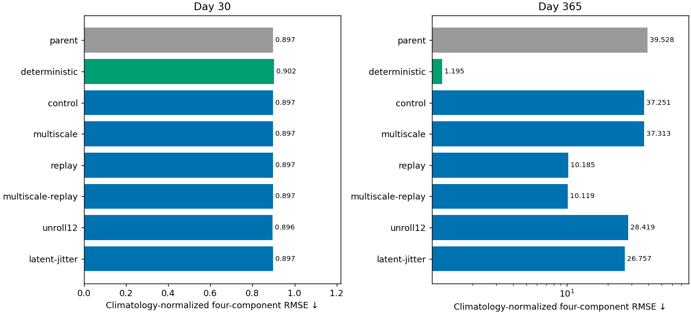
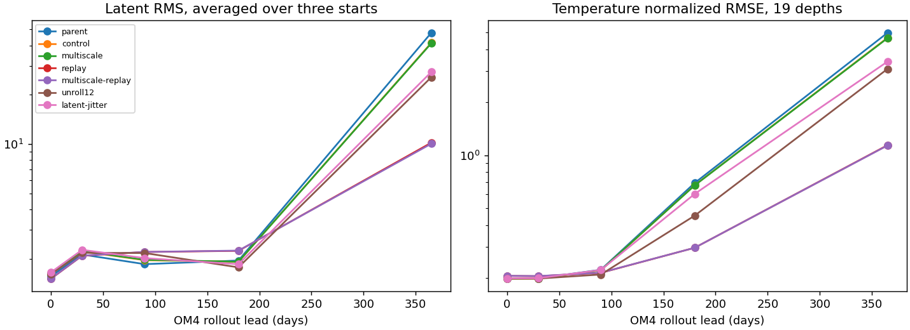
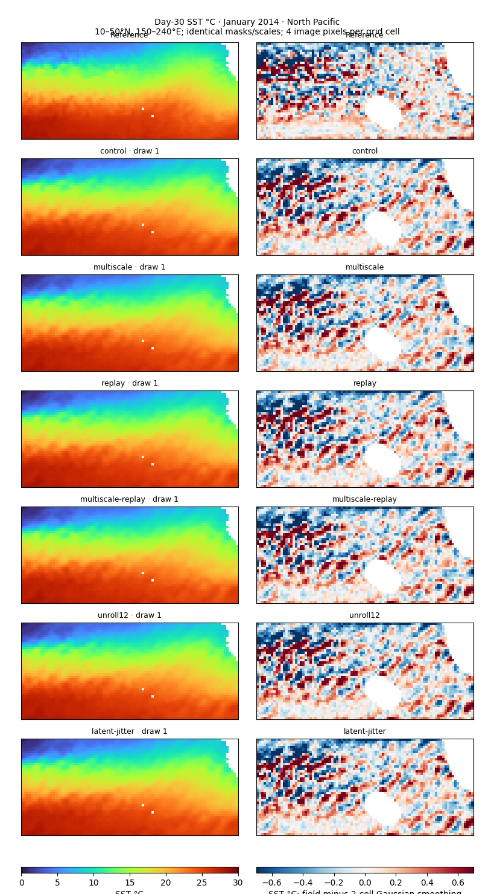

<!-- SPDX-FileCopyrightText: 2026 Samudra Authors -->
<!-- SPDX-License-Identifier: CC-BY-4.0 -->

# Short continuations: spatial gradients and latent replay

This pilot tests whether small changes to the final diffusion model can reduce
its diagonal texture and annual instability. The two issues respond differently:
OM4 latent replay substantially reduces annual error, while the added multiscale
gradient objective produces only small changes in spatial error and leaves the
visible diagonal structure. Annual errors remain far above the deterministic
baseline. These are one-seed, short-continuation results, not a stable ocean model.

## Fixed-budget comparison

Every arm starts from the same cooled **8,000 observation + 8,000 OM4** checkpoint,
then takes **128 additional updates: 64 observation and 64 OM4**, effective batch
eight. All use fresh AdamW moments, the same paired seed and samples where the
task allows, and cosine LR 1e-5 → 1e-6. The continuation control shares these
choices. Checkpoints at 32/64/128 are retained; results below use the prespecified
final 128-update snapshot, without selection on annual test performance.

The all-latitude loss mask, observation data/normalization, forcing, architecture,
0.5-correlated noise, two training draws and 32 sampling steps remain fixed.
Evaluation uses eight draws. The [protocol](interventions-v1.md) describes the
interventions and the related work, including Weidong's longer-unroll discussion.

| Arm | Change from continuation control |
|---|---|
| control | Original objectives and 30-day OM4 rollout |
| multiscale | Add target-gradient matching in four directions at lags 1/2/4/8 cells |
| replay | Half of OM4 microbatches start from detached model-generated latent states at longer leads |
| multiscale-replay | Both changes |
| unroll12 | Half of OM4 microbatches backpropagate through 60 days, scoring the last six leads |
| latent-jitter | Half of OM4 microbatches perturb the encoded latent by 5% per-channel RMS |

Replay uses four online latent chains with initial burn-ins of 30/90/180/300 days,
then six differentiable five-day steps per use. A chain is reset after four uses
or at 360 days. All origins/targets remain inside the original OM4 training split.
Reused latents are two optimizer updates old. Replay also omits initial
reconstruction/completion on those microbatches, so this pilot does not isolate
lead exposure from that objective change. The twelve-step arm retains the
initial objective and scores six forecast readouts to limit its extra cost.

## Annual stability

| Model | Day 30 | Day 365 | Annual SST RMSE (°C) |
|---|---:|---:|---:|
| parent | 0.8968 | 39.5279 | 31.435 |
| deterministic | 0.9024 | 1.1954 | 0.708 |
| control | 0.8972 | 37.2515 | 28.394 |
| multiscale | 0.8971 | 37.3127 | 28.774 |
| replay | 0.8975 | 10.1852 | 8.170 |
| multiscale-replay | 0.8970 | 10.1187 | 8.137 |
| unroll12 | 0.8960 | 28.4187 | 21.355 |
| latent-jitter | 0.8972 | 26.7566 | 18.778 |

The blended RMSE is the mean of four ratios to the same-lead training seasonal
climatology: SST, SSH-derived geostrophic velocity, OHC 0–700 m, and OHC 700–2000 m.
It contains **no spectral term**. Origin MSEs are pooled before taking square
roots. Surface scores use the day-30/day-365 bins; OHC uses January/December
monthly means. All rows use the same three January starts: 2015, 2018, 2021.
Annual input manifests match the earlier presentation exactly.



Replay reduces the annual blended error from **37.25 to 10.19**, about **73%**
relative to the continuation control. Adding multiscale gradients to replay
changes it only slightly, to **10.12**. Day-30 scores remain essentially unchanged.
Annual SST RMSE falls from **28.4°C to 8.2°C** with replay, still much worse than
the deterministic baseline's **0.71°C**. The untouched diffusion parent's annual
score is 39.53: simply continuing it already changes the outcome, which is why
the continuation control matters.

The longer differentiable unroll reduces the annual score to **28.42**, and
latent perturbations reduce it to **26.76** (24% and 28% below control). Both
are weaker than replay in this pilot, and neither resolves the annual failure.

The native OM4 probes also show reduced latent growth and interior error. This
supports an effect on the processor's recurrent instability, beyond changing
decoder appearance. It does not establish bounded long-term dynamics. The model
evolves a deterministic latent; independently sampled physical readouts do not
feed back into it and do not form coherent ensemble trajectories.



## Spatial artifacts and probabilistic skill

| Arm | SST mean | SST member | SSH mean | SSH member |
|---|---:|---:|---:|---:|
| control | 0.23285 | 0.28938 | 0.03688 | 0.04438 |
| multiscale | 0.23262 | 0.28788 | 0.03687 | 0.04433 |
| replay | 0.23384 | 0.29194 | 0.03682 | 0.04440 |
| multiscale-replay | 0.23352 | 0.29013 | 0.03684 | 0.04436 |
| unroll12 | 0.23283 | 0.28947 | 0.03687 | 0.04444 |
| latent-jitter | 0.23265 | 0.28871 | 0.03682 | 0.04446 |

Units: °C per grid cell for SST; m per grid cell for SSH.

The spatial diagnostic pools day-30 target-increment squared errors over all nine
validation months, four directions and lags 1/2/4/8. Every traversed cell must be
valid. Longitude wraps and latitude does not; weights are cos(latitude).
Differences are divided by distance in grid cells, not kilometers. Member error
averages squared errors over eight draws before taking the square root. These
are **target-gradient errors, not a unique measure of diagonal artifacts**.

Adding multiscale gradients reduces member SST increment RMSE by approximately
**0.5%**, and SSH by approximately **0.1%**, versus control. The matched North
Pacific maps still show diagonal structure. This small-budget test provides no
convincing artifact fix; it does not rule out stronger weights, different scales,
or a longer decoder-focused intervention. The original nearest-neighbor loss
remains in every arm, so this is an added constraint rather than an equal-strength
replacement.

The right column below subtracts a two-grid-cell Gaussian-smoothed field, using
the same valid support in every panel. It contains real fronts/eddies as well as
artifacts. The exact same first draw is compared across arms; maps use fixed
color limits, nearest-neighbor rendering, and four image pixels per source cell.



[SSH matched member maps](interventions-v1-assets/day30-ssh-members.png)

[Scored day-30 spectra: member versus mean](interventions-v1-assets/day30-spectra.png)
show similar curves across interventions. The first SST draw has substantially
more power than the ensemble mean at the smaller retained scales. Saved-map
mean spectra reproduce the scorer within 0.02% relative tolerance. These are
the scorer's regional, detrended radial bins with its four-cell cutoff; they
do not isolate diagonal orientation or the finest grid-scale grain.
[All six arms' spectral values](interventions-v1-assets/spectra.csv) are included.

| Arm | SST spread/RMSE | SST coverage | SSH spread/RMSE | SSH coverage |
|---|---:|---:|---:|---:|
| control | 0.618 | 55.2% | 0.624 | 48.8% |
| multiscale | 0.609 | 54.6% | 0.622 | 48.5% |
| replay | 0.627 | 56.2% | 0.629 | 49.3% |
| multiscale-replay | 0.617 | 55.4% | 0.625 | 48.8% |
| unroll12 | 0.619 | 55.3% | 0.627 | 48.9% |
| latent-jitter | 0.614 | 55.0% | 0.628 | 48.8% |

These calibration statistics pool weighted sums over the nine validation months.
Surface statistics include all six five-day leads; interior statistics score
monthly averages across the 14 supervised depths of each variable. Spread uses
the unbiased sample variance. Coverage is the raw 5th–95th percentile interval
of only eight draws, so it has finite-ensemble limitations. Nevertheless, the
roughly 48–56% coverage and spread/RMSE well below one show substantial
underdispersion. The replay gain is not accompanied by further spread collapse;
the gradient addition slightly narrows the ensemble.

## Native OM4 member and mean maps

The following figures show the same held-out 2015 OM4 origin, reference, mean of
eight, and first draw. The untouched parent is re-evaluated on the same Beta OM4
store as the six continuations. References match exactly across all seven models.
Each field uses fixed color limits; out-of-range values clip, so the numerical
errors above remain essential when interpreting the unstable year-long fields.
Whole-grid maps use one image pixel per source cell.

| Lead | SSH | SST | Temperature at 550 m | Salinity at 550 m |
|---|---|---|---|---|
| 30 days | [Map](interventions-v1-assets/native-day30-ssh.png) | [Map](interventions-v1-assets/native-day30-sst.png) | [Map](interventions-v1-assets/native-day30-t550.png) | [Map](interventions-v1-assets/native-day30-s550.png) |
| 365 days | [Map](interventions-v1-assets/native-day365-ssh.png) | [Map](interventions-v1-assets/native-day365-sst.png) | [Map](interventions-v1-assets/native-day365-t550.png) | [Map](interventions-v1-assets/native-day365-s550.png) |

## What to try next, subject to a new wave approval

1. Extend the replay/control pair with an explicitly matched budget and more than
   one seed. Keep annual observations diagnostic-only. Check whether the gain
   continues, saturates, or merely delays instability past one year.
2. Separate replay's long-lead exposure from dropping initial losses: retain
   reconstruction/completion in a matched arm, and compare against long-lead
   pushforward samples with no reused buffer. This tests which part mattered.
3. Treat artifact reduction as a separate decoder experiment. Freeze the
   processor and compare original versus stronger derivative supervision on
   paired native OM4 fields, measuring directional structure, member spectra,
   target-gradient error and calibration together. A visually smoother ensemble
   that merely loses spread is not sufficient.

No further training wave was launched. This pilot uses a single seed and nine
validation months, with only three annual starts. The final deterministic
reference has a different architecture and no extra 64/64 continuation; it is a
performance reference, not the causal control. OM4 data on Beta may differ from
the historical Torch version, as permitted for this campaign; all six arms and
the new parent native probes share the Beta store. Observation manifests are
identical to the earlier comparison.

## Reproduction and evidence

All six arms and their validation/native/annual evaluations completed in Beta
job **211734**, on four B200 GPUs, in **11 h 23 min 39 s**. Total allocated cost,
including the successful smoke test and both failed loader bring-ups, was
**47.15 GPU-hours**, below the 68 GPU-hour ceiling. This includes allocated GPU
idle time while the final two arms ran. No training or evaluation failures
occurred in the production job.

[Execution provenance](interventions-v1-assets/execution.json) records the exact
source archive, parent/checkpoint provenance, job states and six W&B runs. The
immutable runtime source is `interventions-19a3ea7900ea`, retained on Beta under
`/projects/ny/lz1955/multiscale/jrusak/runs/diffusion-interventions-v1/code/`.
The published training source additionally includes type annotations and a
non-null replay-state assertion; the runtime archive preserves exact execution.
The report checks checkpoint counts/fingerprints across evaluation products,
matching annual input manifests, 54 validation exports, and seven native exports.

Validation: 34 focused experiment tests and 101 Rust loader tests passed during
bring-up; targeted tests were rerun after the final invariant/type changes.
Formatting, lint, type, license and secret checks passed before publication.
The secret baseline adds 50 exact verified provenance-fingerprint entries for
the two new JSON exports; scanner rules are unchanged.

- [Complete numerical results and input fingerprints](interventions-v1-assets/results.json)
- [Annual components and per-origin errors](interventions-v1-assets/annual.csv)
- [Validation point metrics](interventions-v1-assets/validation.csv)
- [CRPS, spread and coverage](interventions-v1-assets/calibration.csv)
- [Spatial increment errors](interventions-v1-assets/spatial.csv)
- [Native OM4 errors and latent magnitudes](interventions-v1-assets/native.csv)
- [Annual comparison PDF](interventions-v1-assets/annual-rmse.pdf)
- [Training implementation](../../../src/samudra/experiments/diffusion_interventions.py)
- [Report script](../../../scripts/report_diffusion_interventions.py)

```bash
PYTHONPATH=src MPLCONFIGDIR=/tmp/diffusion-mpl \
  .venv/bin/python scripts/report_diffusion_interventions.py \
  --root outputs/diffusion-interventions-v1/evaluation \
  --baseline outputs/global-matched-v1 \
  --presentation outputs/global-matched-v1/checkpoint-annual/presentation-results.json.gz \
  --output docs/experiments/diffusion-interior-beta/interventions-v1-assets
```
