<!-- SPDX-FileCopyrightText: 2026 Samudra Authors -->
<!-- SPDX-License-Identifier: CC-BY-4.0 -->

# Stopped latent-diffusion continuation

**Longer fitting improved monthly prediction but seriously worsened annual stability.**
The stopped checkpoints score 0.743/0.757 on the frozen monthly composite, versus
1.019/0.961 for the short runs and 0.591 for the historical deterministic control.
Interior fair CRPS improves 21–24% over that control, but monthly ensembles become
underdispersed and day-365 SST RMSE rises to 43–68°C. These are not usable annual
forecasts. All evaluations are complete; training remains stopped for review.

[The endpoint-map follow-up](endpoint-maps.md) shows day-30/day-365 SSH/SST
members and means, plus OM4-initialized SSH/SST/interior T/S before and after
observation adaptation. These are endpoint fields, distinct from this report's
annual time-average maps.

Training stopped on October 1, 2026, for a protocol correction before the next
comparison. The observation loss and validation selection in these runs cover
60°S–60°N; newer deterministic controls use global observation support. OM4
pretraining and replay already use global wet-cell cosine weights. The results
here retain the original scoring domain and compare with the historical
same-domain deterministic baseline. They do not establish a matched comparison
with the newer global controls.

Additional observation fitting improved both seeds, but neither reached the
provisional plateau criterion. These are selected checkpoints from interrupted
training, not completed fitting budgets or evidence of convergence. No further
scientific training is running or authorized before review.

## What was trained

The model jointly learns a surface-history initializer, deterministic latent
processor, and conditional diffusion decoder from scratch on OM4. Nineteen
five-day history frames initialize two 128-channel latent slots on a 45×90 grid.
Four residual processor blocks advance them with forcing and geographic/seasonal
context. The width-192 decoder samples 77 physical fields on the 180×360 grid
with 16 Heun steps. Diffusion decodes the physical fields; it does not diffuse
or sample the recurrent latent state.

OM4 pretraining ran for 24,000 updates per seed. Observation adaptation updates
the model and ERA5 adapter with two-member fair CRPS, weighted 0.8 interior,
0.1 SST, and 0.1 SSH. Native OM4 replay occurs every four updates at weight 0.1.
Future OISST/DUACS targets are not forcings. The continuation preserves weights,
optimizer and random states, objective, learning rate, replay, data, splits,
normalization and checkpoint selection. Only the fitting ceilings increased.

A deterministic latent trajectory conditions all eight evaluation members.
Readouts are sampled independently at each lead, and decoded physical fields
never enter recurrence. Consequently a member index followed through time is
not a coherent sampled trajectory. The physical readout at initialization is
also not an input to the processor or to the observation forecast loss;
initializer maps diagnose the decoder applied to the initial latent state.
The encoder itself is trained through the future observation losses.

The older physical-state diffusion system evolves sampled physical
initializations through frozen pretrained dynamics. The deterministic reference
was selected in an earlier campaign. These are system comparisons with different
optimization histories, not controlled decoder-only or latent-storage ablations.

## Checkpoint selection and stopping

| Seed | Short selected update | Short validation | Stopped selected update | Stopped validation | Latest scheduled validation at 6,500 |
| --- | ---: | ---: | ---: | ---: | ---: |
| 1729 | 2,026 | 1.01125 | 6,000 | 0.69651 | 0.72099 |
| 1730 | 2,000 | 0.95980 | 5,500 | 0.71374 | 0.74102 |

Smaller validation composite is better. This is the frozen integrated/spectral
score on an eight-member mean, not the training denoising loss or fair CRPS.
The most recent checks worsened, but the latest three scheduled checks still
improved their preceding best by 6.46% and 2.51%, respectively. Neither triggers
the provisional less-than-1% plateau rule. Seed 1729 last logged update 6,825;
seed 1730 last logged 6,815. Evaluation uses the selected checkpoints above,
not those last logged states.

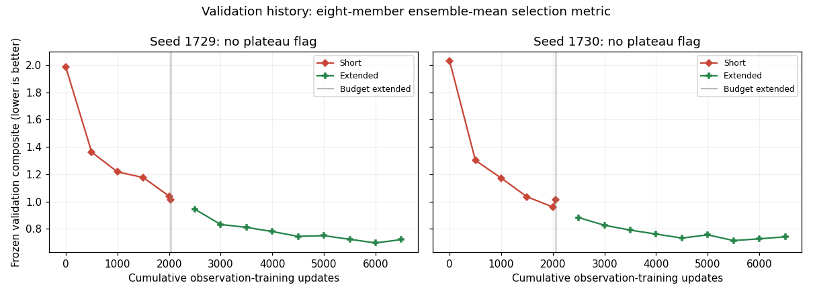

[Validation exports](latent-extension-assets/validation-history.csv) and
[plateau assessment](latent-extension-assets/plateau-assessment.json.gz).

The original training array was 24284649. Seed 1730 was preempted and resumed
from its saved optimizer state. The queued continuation and obsolete dependent
evaluations were cancelled. Explicit stopped-run receipts preserve selected and
latest checkpoint hashes without pretending that the training budget finished.
Evaluation-only jobs 24534142 and 24534143 use those preserved selections.

## Evaluation scope

The primary comparison uses 96 reinitialized monthly origins in 2015–2022,
monthly IAP interior targets, and five-day SST/SSH targets on the historical
±60° support. The frozen composite balances integrated and spectral components.
Interior RMSE pools normalized supported-channel squared errors over wet area
and origins, then averages the 27 supported channels. Fair ensemble CRPS and
rank/spread diagnostics complement the mean score.

This is a reused development cohort. It is not an untouched final test, a
continuous eight-year rollout, an Argo-profile evaluation, or daily verification.
The three annual rollouts are separate initializations with prescribed future
ERA5 forcing. Full-domain maps, annual means, and broad regional spectra below
are descriptive diagnostics, not a retroactive change of the selection metric.

Raw eight-member 5–95% sample-quantile coverage does not have nominal 90%
coverage. Monthly averaging can suppress independent readout noise; good monthly
scores alone do not establish instantaneous or trajectory calibration.

## Held-out monthly results

| System | Composite ↓ | Interior normalized RMSE ↓ | Interior fair CRPS ↓ | Raw 5–95% coverage | Spread / mean RMSE |
| --- | ---: | ---: | ---: | ---: | ---: |
| Historical deterministic | 0.59134 | 0.08057 | 0.05130 | — | — |
| Physical diffusion 1729 | 0.82843 | 0.08887 | 0.03890 | 0.716 | 0.785 |
| Physical diffusion 1730 | 0.85519 | 0.08910 | 0.03949 | 0.697 | 0.752 |
| Short latent 1729 | 1.01931 | 0.10015 | 0.04574 | 0.751 | 0.903 |
| Short latent 1730 | 0.96056 | 0.10266 | 0.04739 | 0.744 | 0.855 |
| Stopped latent 1729 | **0.74312** | **0.08408** | **0.03873** | **0.598** | **0.639** |
| Stopped latent 1730 | **0.75663** | **0.08672** | **0.04063** | **0.570** | **0.600** |

The stopped composites improve 27.1% and 21.2% over their short selections,
but remain 25.7% and 28.0% worse than the historical deterministic reference.
Interior mean RMSE gets closer to the reference. Fair CRPS improves 24.5% and
20.8% relative to the deterministic point mass, putting it near the preceding
physical-diffusion systems rather than establishing a clear probabilistic win
against them. The seed-mean improvement over deterministic is 22.65%, with a
paired year-block 95% percentile interval of 21.00–24.07%. This conditions on the
fitted seeds and fixed draws, excludes training and Monte Carlo uncertainty,
and uses the reused development cohort.

The spread contraction is not simply better calibration. Monthly rank
histograms become U-shaped; the two extreme rank bins together contain 34.4%
and 37.2% of observations, versus 22.2% under a uniform nine-bin rank histogram.
Together with spread/error ratios and raw coverage, that indicates
underdispersion and/or systematic errors in the monthly predictive distributions.
This can coexist with excessive instantaneous member power: averaging independent
readouts reduces monthly spread without making instantaneous fields realistic.

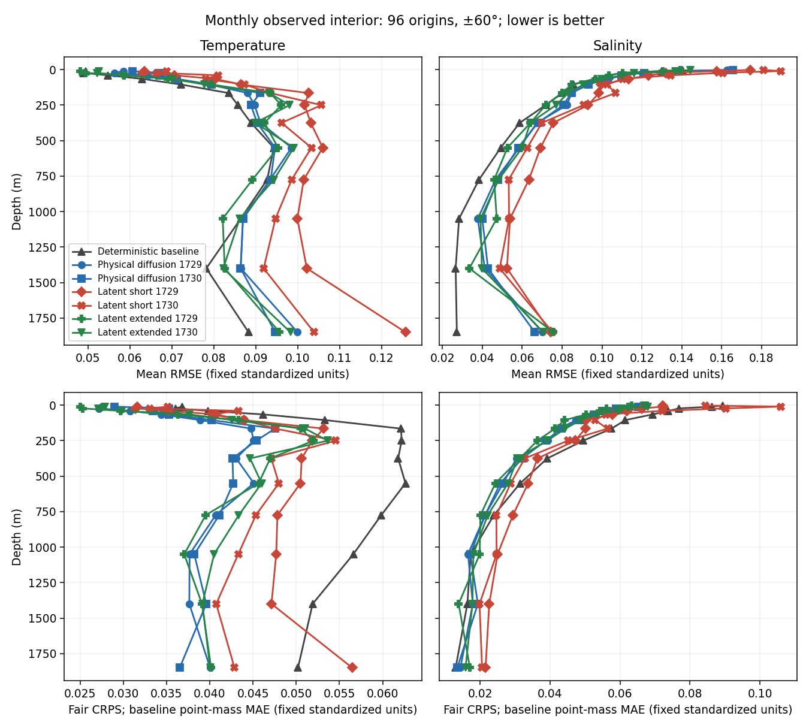

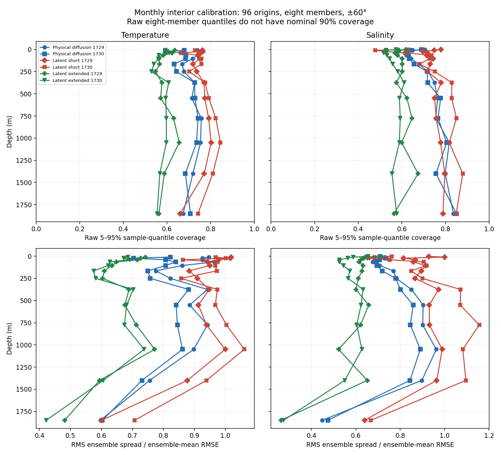

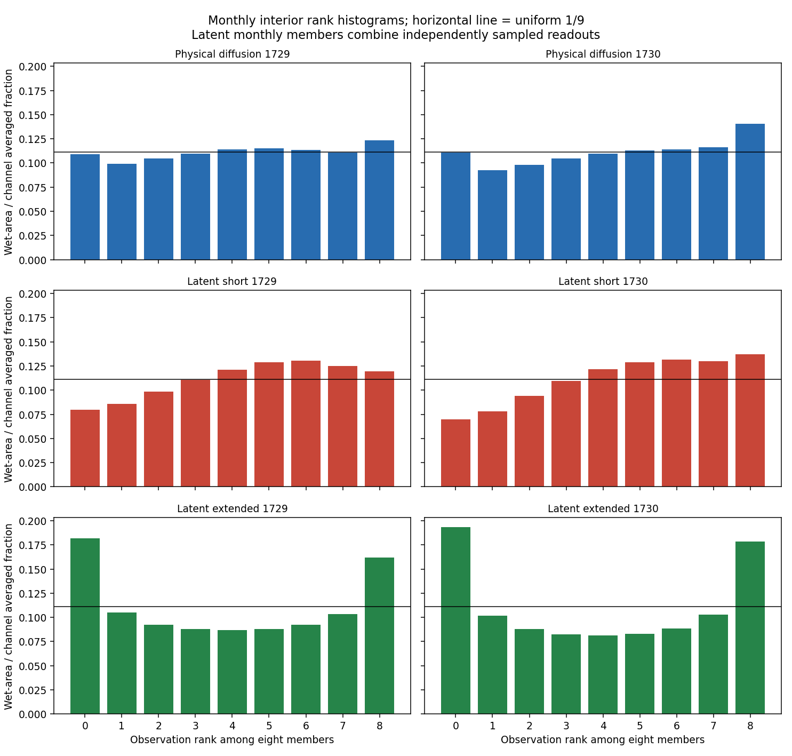

[Seven-system summary and bootstrap](latent-extension-assets/summary.json.gz).

## Interpretation of initializer and annual plots

Initializer panels compare pretraining, short adaptation, and stopped selected
checkpoints with the preceding December IAP field and training December
climatology. The preceding monthly observation is context, not instantaneous
truth at the initialization timestamp. Temperature comparisons omit the copied
surface channel. All panels retain the native grid, with two pixels per cell,
shared physical color limits, gray land, and white missing observations.

Annual SST/SSH curves are undetrended area means. Heat-content curves are totals
in ZJ on fixed common finite wet support for each comparison, with native IAP
and training-climatology context. They are not extrapolated whole-ocean totals.
Native and model vertical representations differ; their offsets cannot be
attributed entirely to model drift. Maps accompany scalar curves because
compensating regional errors can conceal failure in a global mean.

## Initial interior readouts

The initial physical readouts do not improve uniformly with the forecast score.
Across the three saved January initializations, 550 m temperature context RMSE
rises from 0.547–0.563°C to 0.599–0.609°C for seed 1729 and from 0.492–0.498°C
to 0.633–0.635°C for seed 1730. At the same depth, salinity improves for seed
1729 (0.0716–0.0725 to 0.0634–0.0660) but slightly worsens for seed 1730
(0.0644–0.0655 to 0.0670–0.0678). Training December climatology is much closer
to this monthly context: 0.195–0.221°C and 0.0181–0.0222 salinity units.

These values use globally distributed common finite wet support without the
observation-loss latitude cut. They compare an initial five-day readout with
preceding-month context, and are not a matched instantaneous initialization
benchmark. Nevertheless, they show that better future ensemble-mean scores need
not make the unused initial physical readout more observationally plausible.

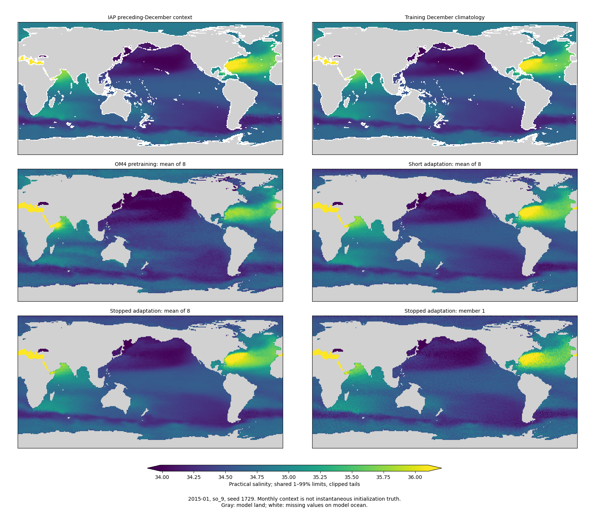

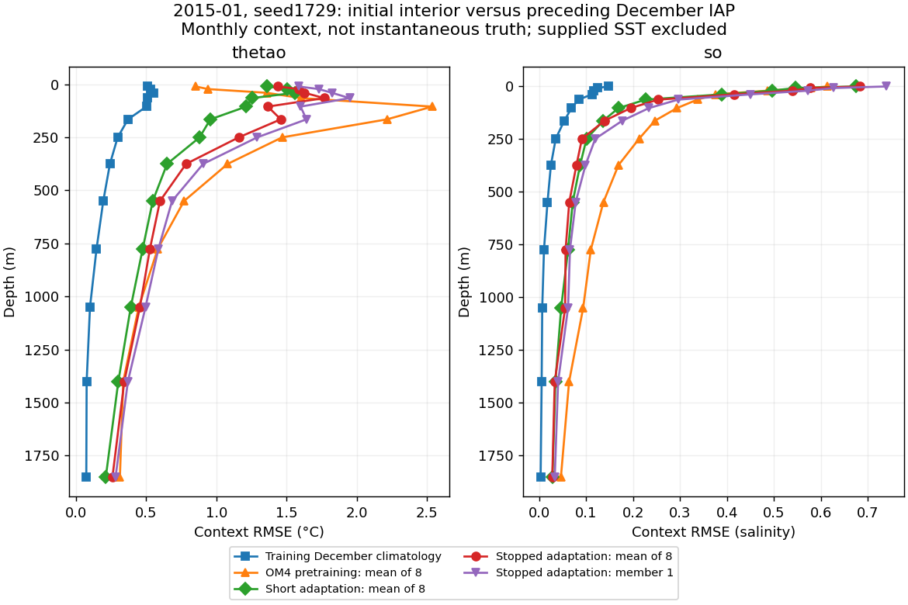

[Context metrics for all six seed/date pairs](latent-extension-assets/initializer-context.json.gz)
include temperature and salinity depth profiles, source hashes, and the exact
comparison scope. The maps show broad model/context differences as well as
readout noise; replacing all of those differences with a claim about diffusion
blurring would not be supported.

## Day-30 spatial spectra: members versus means

The broad regional comparison uses day 30 throughout. The twelve-origin 2015
plot averages powers across origins; it does not take a spectrum of a time-mean
field. Native observations retain their own finer grids. Common geographic
support is projected onto those grids, but resolution, averaging and remaining
finite-support differences still affect the native-versus-coarse curves.

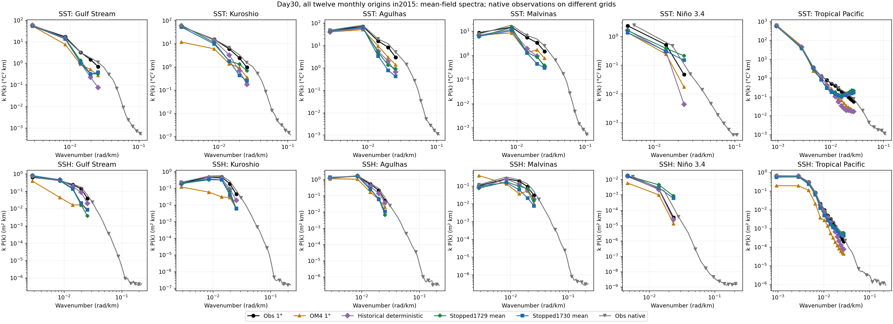

Individual readouts, mean member power and the spectrum of the ensemble mean
are separated in the January 2015 snapshot below. Extra member power can help
in regions where the mean is too smooth, but it can also be excessive. In the
tropical Pacific's finest resolved coarse-grid bin (0.02728 rad/km), seed 1729
has mean member power 24.75× the 1° SST observations and 23.18× the SSH
observations; its ensemble-mean powers are 3.17× and 3.69×. Seed 1730 gives
17.18×/17.05× for member power versus 2.53×/2.53× for the mean. These are one-date,
one-bin diagnostics, not aggregate scores or evidence that every region has
excess power. They show why a plausible-looking mean spectrum cannot establish
realistic individual readouts.

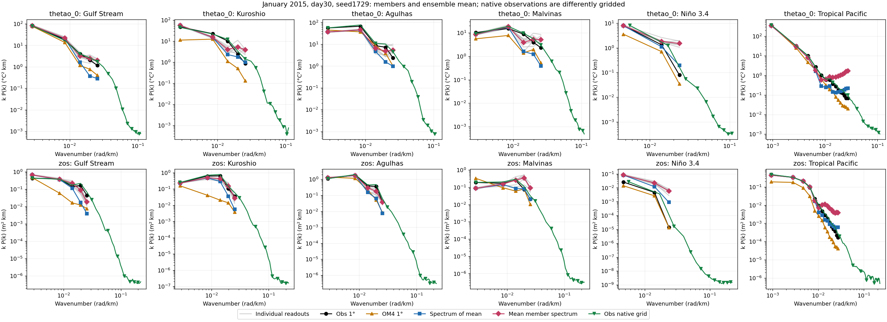

[Seed 1730](latent-extension-assets/day30-broad-spectra-1730.png) and
[all numerical curves](latent-extension-assets/day30-broad-spectra.json.gz).
These regional spectra use plane detrending and a window on finite common
support; they are not global spherical spectra. Spectral agreement also does
not measure spatial phase alignment or temporal coherence.

## Diagonal artifacts and temporal coherence

The original strong diagonal salinity artifact is not apparent in the inspected
stopped initial readouts. In the same published tropical crop, diagonal
correlations of initial member deviations range from −0.067 to +0.042 across
both seeds and all three saved dates. Initial scored-domain salinity member
RMS deviation is 0.0479–0.0481 for seed 1729 and 0.0542–0.0544 for seed 1730,
lower than the short-run values. This is evidence about six examples, not a
claim that the model has no artifacts anywhere.

Temporal variability remains excessive. In the native OM4 control, stopped
member RMS five-day increments relative to truth are about 5.5–5.9× for SST,
5.4–5.7× for SSH, 13–14× for 550 m temperature, 18–19× for 550 m salinity,
and 18–19× for 550 m zonal velocity. Ensemble means reduce those ratios but
remain too variable. Adjacent member-anomaly correlations are approximately
zero, as expected from independently sampled physical readouts. Additional
training has not produced coherent sampled trajectories.

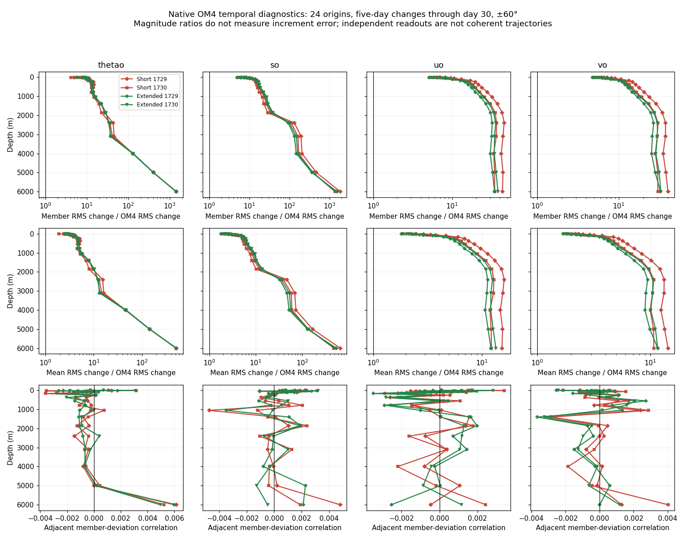

[Temporal table](latent-extension-assets/temporal-variability.csv) and
[seed 1729 saved-map diagnostics](latent-extension-assets/diagnostics-1729.json.gz),
[seed 1730](latent-extension-assets/diagnostics-1730.json.gz).
The native temporal reference is OM4, not observed ocean velocity. These
trajectory-sensitive diagnostics answer a different question from monthly
fair CRPS or a mean-field spectral score.

## Native velocity retention

The 24-origin native OM4 evaluation compares velocity outputs against model-world
references, not gold velocity observations. Day-30 pooled ensemble-mean RMSE
falls from 0.13595 to 0.09727 m/s for seed 1729 and from 0.13659 to 0.10402 m/s
for seed 1730 after the continuation. Both remain worse than zero velocity
(0.07016 m/s), and than their own OM4-pretrained checkpoints (0.06653 and
0.06202 m/s). Initialization shows the same ordering. Longer observation fitting
partially repairs the short-run degradation, but this replay schedule does not
retain the original native velocity skill. Stopped day-30 spreads remain large,
0.16053 and 0.17109 m/s, respectively.

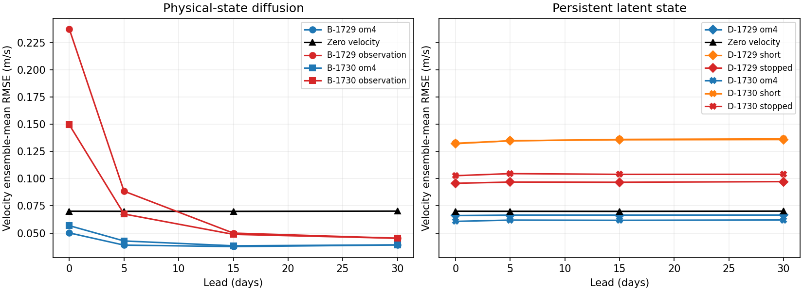

The orange curves are the preserved short-run selections; red curves are the
stopped selections. Different marker shapes distinguish seeds. The underlying
[velocity table](latent-extension-assets/native-velocity.csv) includes mean RMSE,
spread, fair CRPS and the zero reference at each evaluated lead.

## Annual stability

The continuation substantially worsens the already unstable long rollouts.
Across the three annual initializations, day-365 SST RMSE rises from
8.70–8.85°C to 66.22–67.92°C for seed 1729, and from 5.33–5.45°C to
42.74–43.80°C for seed 1730. Stopped SSH RMSE reaches 5.57–5.64 m and
2.94–3.04 m, respectively. These are finite numerical outputs but physically
unacceptable forecasts. Better month-scale selection did not constrain the
73-step latent recurrence sufficiently for annual use.

The annual evaluation uses the same selected checkpoint hashes, reference
manifests, forcing setup and initialization contract as the short comparison.
Thus the result is not a switch to a different checkpoint or observational
cohort. It identifies an extrapolation failure beyond the training horizon;
it does not by itself isolate whether the dominant mechanism is latent dynamics,
decoder conditioning outside its training distribution, or their interaction.

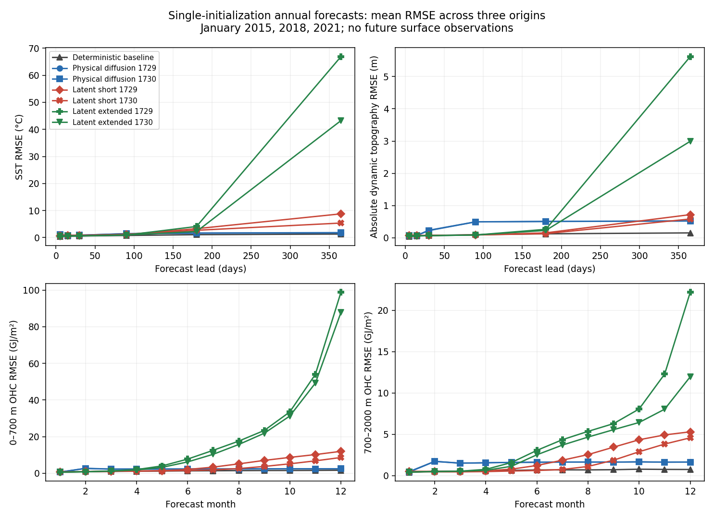

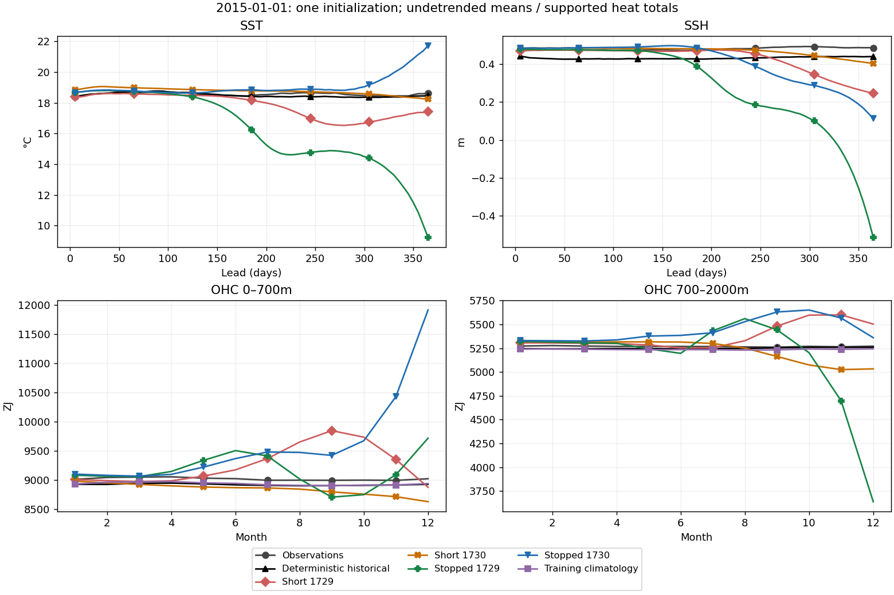

[2018 curves](latent-extension-assets/annual-means-2018.png),
[2021 curves](latent-extension-assets/annual-means-2021.png), and
[annual error table](latent-extension-assets/annual-forecasts.csv).
The annual mean maps develop severe spatial noise and patterned errors; the
absence of the earlier initial-readout diagonal artifact does not imply stable
long-term fields. The undetrended means retain the large drift rather than removing it through
anomalies or detrending. Fixed-support heat totals are in ZJ; maps show where
scalar means conceal regional compensation.

## Faster next runs

The completed [performance comparison](training-performance.md) found a roughly
4.1× speedup for a matched observation training step when moving from the
original L40S path to an H200 with a compiled decoder and unused initial readout
removed. Compiling on the L40S alone nearly doubled throughput. These are
measured step timings, not an end-to-end campaign guarantee; data loading,
replay, checkpointing and validation still contribute. Compilation changes
floating-point results slightly, so future controls should use the same
execution settings and pass the existing real-grid qualification first.

Before any new training, review a common global observation mask, objective,
initialization supervision, data mixture and compute allocation for deterministic
and diffusion controls. The latitude correction alone does not make all those
choices equivalent. Temporal coherence also needs an explicit decision: keeping
independent physical readouts preserves the present uncertainty model and its
known trajectory limitation. No updated campaign is submitted by this report.

## Provenance, cost and reproduction

Evaluation array **24534142** completed successfully for both seeds, including
96 monthly origins and annual starts 2015, 2018 and 2021. Native array
**24534143** completed all 24 origins per seed. The final collection verified
**478 files / 5,403,542,851 bytes** against remote SHA256 and byte counts.
The preserved 36-file context/reference bundle was separately verified against
its remote copy. Cohort, checkpoint, reference-contract and budget-only
continuation-lineage checks pass in the combined summary.

| Seed | Selected update | Selected checkpoint SHA256 |
| --- | ---: | --- |
| 1729 | 6,000 | `c3555f9346795f6c729d4b64563a831fdb1412422d42c50596d257b1800cb89d` |
| 1730 | 5,500 | `b2f34fbd0af1ba1406f62fcea13d342ddfc0c484cc447602cbe786c730ba8521` |

Training implementation: `8291df4dc7600401da4dcd76172eb18a5c7cc6b3`.
Stopped-run evaluator: `190a84d10`. Both jobs ran on single L40S GPUs; no new
training or speed experiments followed the user's stop/acceptance instructions.
Performance tests ran separately and did not modify these scientific checkpoints.

Campaign allocation totals **222.4431 GPU-hours**, below the 576-hour cap:
121.5853 through the short report, 93.0489 for continuation training including
both preempted/resumed attempts, 6.4283 for final evaluations, and 1.3806 for
performance tests including failed/cancelled attempts. Pending cancellations
used zero allocated GPU-hours. This is Slurm allocated time, not active-kernel time.

[Allocation ledger](latent-extension-assets/accounting-final.json.gz),
[remote file verification](latent-extension-assets/verified-report-manifest.json.gz),
[reference provenance](latent-extension-assets/reference-manifest.json.gz),
[continuation/stopping/evaluation contracts](latent-extension-assets/run-contracts.json.gz).
Raw arrays remain under
`/orcd/pool/008/jrusak/diffusion-interior-engaging/runs/latent-d192-extended-v1`
on Engaging. Context arrays are preserved under
`/orcd/pool/008/jrusak/diffusion-interior-engaging/reports/stopped-latent-2026-10-01/references`.

The read-only [reproduction script](../../../scripts/render_latent_stopped_report.sh)
accepts the short and stopped run roots, preserved references, historical
baseline report, physical-diffusion reports/native controls, and output directory.
It performs no training or GPU submission. Numerical exports and figure assets
are linked below; the earlier [short-run report](latent-wave.md) is preserved.

## Figure and numerical index

All maps retain two display pixels per model grid cell with nearest-neighbor
rendering. Shared 1–99% limits clip labeled tails; annual maps are temporal
means, not endpoint fields. Some common comparison legends call the stopped
continuation “extended.” Gray marks model land; white marks missing observation
values in the new context/annual maps.

| January origin / seed | T at 550 m | Surface salinity | S at 550 m | Interior context profiles | Monthly S at 550 m |
| --- | --- | --- | --- | --- | --- |
| 2015 / 1729 | [View](latent-extension-assets/initializer-thetao_9-1729-2015-01.png) | [View](latent-extension-assets/initializer-so_0-1729-2015-01.png) | [View](latent-extension-assets/initializer-so_9-1729-2015-01.png) | [View](latent-extension-assets/initializer-profiles-1729-2015-01.png) | [View](latent-extension-assets/monthly-so9-1729-2015-01.png) |
| 2015 / 1730 | [View](latent-extension-assets/initializer-thetao_9-1730-2015-01.png) | [View](latent-extension-assets/initializer-so_0-1730-2015-01.png) | [View](latent-extension-assets/initializer-so_9-1730-2015-01.png) | [View](latent-extension-assets/initializer-profiles-1730-2015-01.png) | [View](latent-extension-assets/monthly-so9-1730-2015-01.png) |
| 2018 / 1729 | [View](latent-extension-assets/initializer-thetao_9-1729-2018-01.png) | [View](latent-extension-assets/initializer-so_0-1729-2018-01.png) | [View](latent-extension-assets/initializer-so_9-1729-2018-01.png) | [View](latent-extension-assets/initializer-profiles-1729-2018-01.png) | [View](latent-extension-assets/monthly-so9-1729-2018-01.png) |
| 2018 / 1730 | [View](latent-extension-assets/initializer-thetao_9-1730-2018-01.png) | [View](latent-extension-assets/initializer-so_0-1730-2018-01.png) | [View](latent-extension-assets/initializer-so_9-1730-2018-01.png) | [View](latent-extension-assets/initializer-profiles-1730-2018-01.png) | [View](latent-extension-assets/monthly-so9-1730-2018-01.png) |
| 2021 / 1729 | [View](latent-extension-assets/initializer-thetao_9-1729-2021-01.png) | [View](latent-extension-assets/initializer-so_0-1729-2021-01.png) | [View](latent-extension-assets/initializer-so_9-1729-2021-01.png) | [View](latent-extension-assets/initializer-profiles-1729-2021-01.png) | [View](latent-extension-assets/monthly-so9-1729-2021-01.png) |
| 2021 / 1730 | [View](latent-extension-assets/initializer-thetao_9-1730-2021-01.png) | [View](latent-extension-assets/initializer-so_0-1730-2021-01.png) | [View](latent-extension-assets/initializer-so_9-1730-2021-01.png) | [View](latent-extension-assets/initializer-profiles-1730-2021-01.png) | [View](latent-extension-assets/monthly-so9-1730-2021-01.png) |

| Annual start | Undetrended curves | SST mean map | SSH mean map | Upper OHC map | Deep OHC map |
| --- | --- | --- | --- | --- | --- |
| 2015 | [View](latent-extension-assets/annual-means-2015.png) | [View](latent-extension-assets/annual-map-0-2015.png) | [View](latent-extension-assets/annual-map-1-2015.png) | [View](latent-extension-assets/annual-map-2-2015.png) | [View](latent-extension-assets/annual-map-3-2015.png) |
| 2018 | [View](latent-extension-assets/annual-means-2018.png) | [View](latent-extension-assets/annual-map-0-2018.png) | [View](latent-extension-assets/annual-map-1-2018.png) | [View](latent-extension-assets/annual-map-2-2018.png) | [View](latent-extension-assets/annual-map-3-2018.png) |
| 2021 | [View](latent-extension-assets/annual-means-2021.png) | [View](latent-extension-assets/annual-map-0-2021.png) | [View](latent-extension-assets/annual-map-1-2021.png) | [View](latent-extension-assets/annual-map-2-2021.png) | [View](latent-extension-assets/annual-map-3-2021.png) |

[Annual means, support areas and source hashes](latent-extension-assets/annual-means.json.gz),
[twelve-origin day-30 spectral curves](latent-extension-assets/day30-broad-spectra-2015.json.gz),
[three-date member spectra 1729](latent-extension-assets/member-spectra-1729.png),
[1730](latent-extension-assets/member-spectra-1730.png), and their
[numerical export 1729](latent-extension-assets/member-spectra-1729.json.gz) /
[1730](latent-extension-assets/member-spectra-1730.json.gz).

[Complete generated asset directory](https://github.com/m2lines/Samudra/tree/codex/diffusion-interior-beta/docs/experiments/diffusion-interior-beta/latent-extension-assets) also includes
pretraining-versus-stopped initial velocity maps and machine-readable diagnostics.
