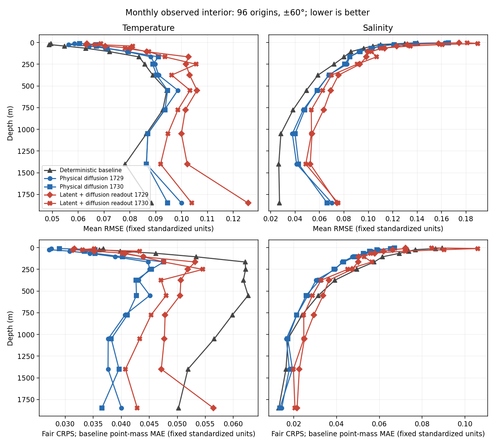
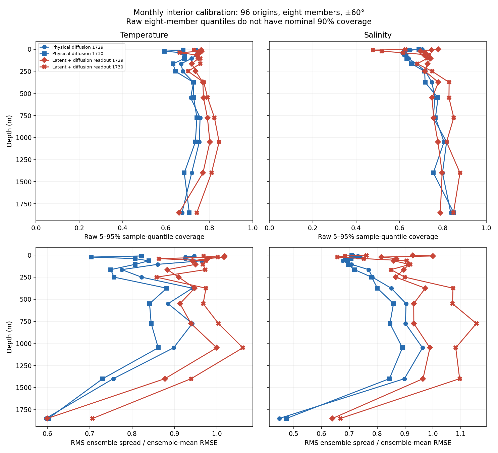
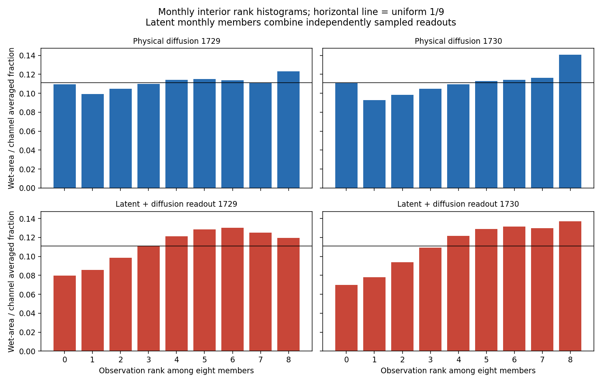
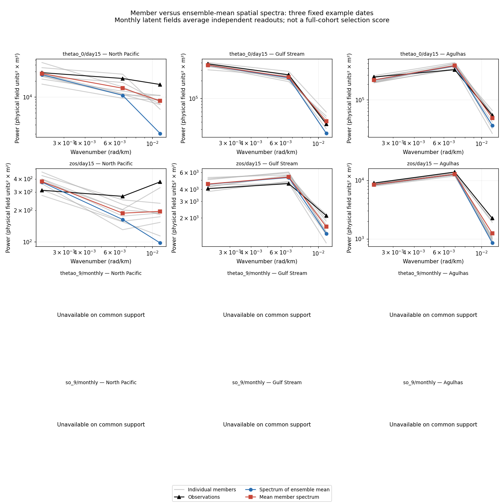
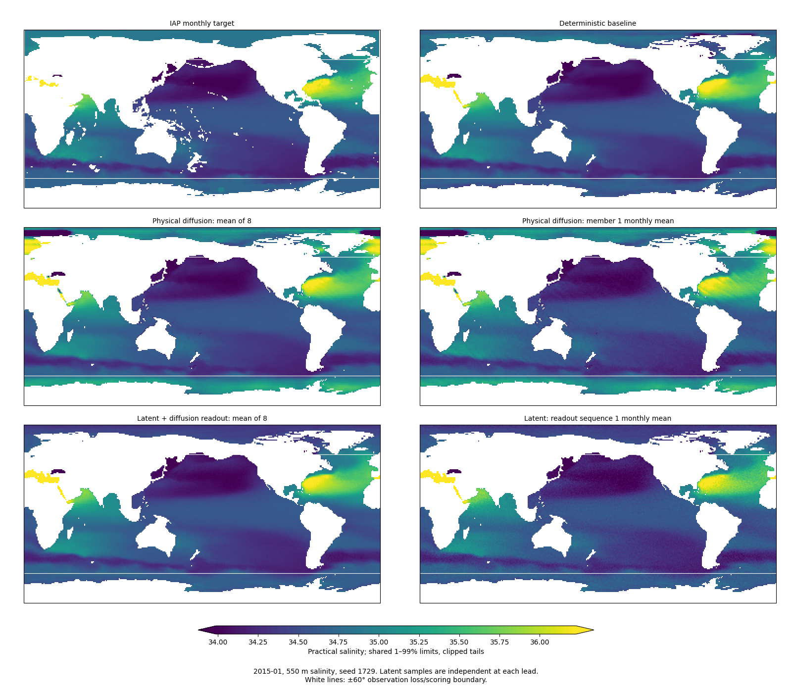
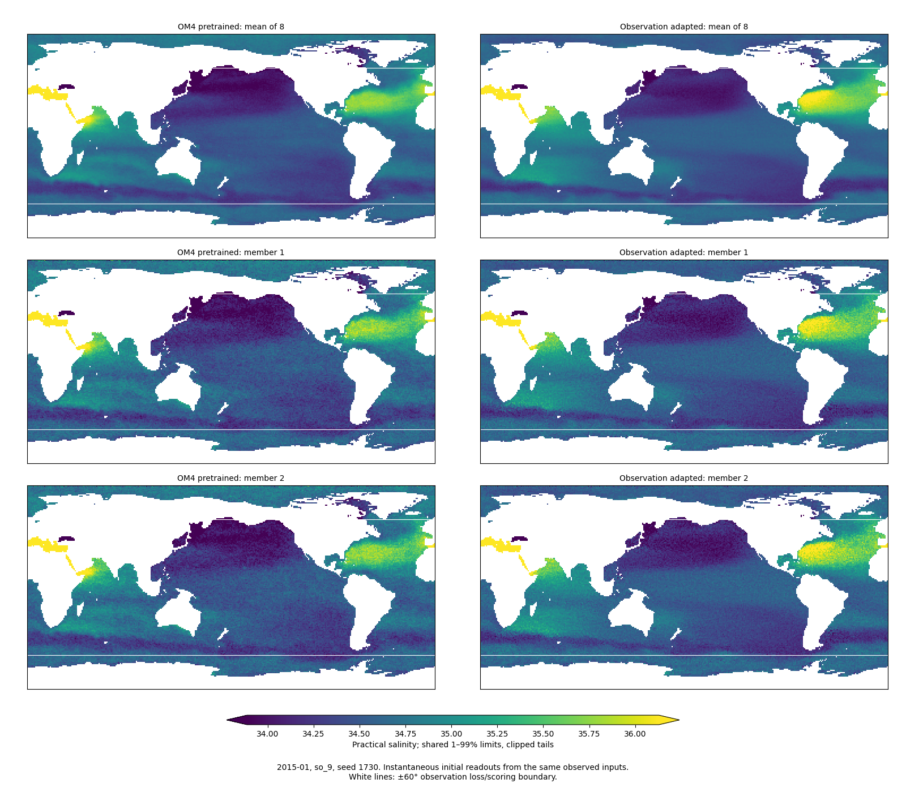
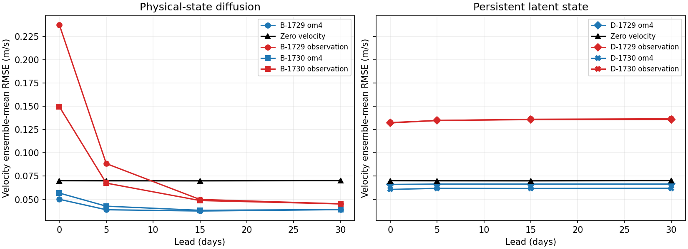
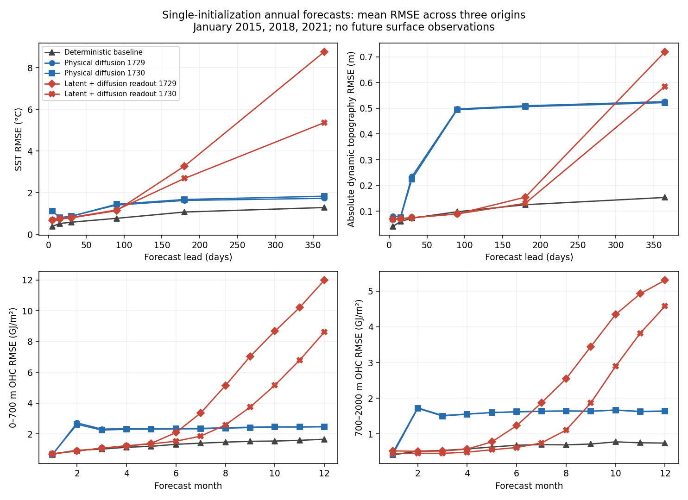

<!-- SPDX-FileCopyrightText: 2026 Samudra Authors -->
<!-- SPDX-License-Identifier: CC-BY-4.0 -->

# Persistent latent state with diffusion readouts

**September 29 follow-up:** [An authorized two-day continuation is running](latent-extension.md).
The results below remain the completed short-budget comparison.

This two-seed wave learns the initializer, recurrent latent dynamics and physical
diffusion decoder jointly from scratch on OM4, then adapts them to observations.
The latent representation substantially reduces the previously observed diagonal
salinity artifact in the saved examples. It does **not** improve the established
forecast score over either the selected deterministic baseline or the preceding
physical-state diffusion system. Native velocity skill deteriorates during
observation fitting despite replay, and annual forecasts drift substantially.

The observation stage reached its 20-hour fitting cap at approximately 2,000
updates per seed, rather than its 6,000-update ceiling. This is a completed
budget-limited experiment, not a convergence result or a demonstrated ceiling on
latent modeling. A subsequent same-objective continuation is tracked separately above.

## Model and comparison

The deterministic encoder uses 19 five-day surface-history frames and past
forcing to initialize two 128-channel latent slots on a 45×90 grid. Four residual
processor blocks advance those slots using three forcing channels and five
geographic/seasonal context planes. A width-192 conditional diffusion decoder
reads 77 physical fields on the existing 180×360 grid using 16 Heun steps.
Physical predictions, targets and diffusion noise never enter the recurrence.

**Diffusion decodes physical fields; it does not sample the latent state.** The
same deterministic latent trajectory conditions all eight members. A fresh
readout is sampled at each lead. Monthly members therefore average independent
readouts, unlike the preceding physical-state model, which evolves sampled
initial physical states. These are different temporal covariance assumptions.

OM4 initial and six future paired-state denoising losses jointly train encoder,
processor and decoder from random initialization. Observation adaptation trains
all three plus the existing ERA5 adapter, using two-member fair CRPS with weights
0.8 interior, 0.1 SST and 0.1 SSH, and native replay every four updates at weight
0.1. Existing splits, normalization, forcing inputs and resolutions are retained.
No OISST or DUACS future targets are supplied as forcings.

The unchanged deterministic baseline was selected by validation in the upstream
campaign. The previous physical-state diffusion system used frozen pretrained
physical dynamics. The new latent system also changes dynamics training and
optimization budget, so this is a **system comparison**, not an isolated test of
latent versus physical storage or of a decoder alone.

## Held-out observational results

All systems use 96 monthly origins in 2015–2022, the same observation/reference
contracts and ±60° support. Interior scores cover 27 supported normalized T/S
channels against monthly IAP. Surface targets are five-day bins. The frozen
composite combines normalized surface SST/velocity/EKE/OHC errors and spectral
errors with equal total weight. It is calculated on the eight-member mean for
diffusion systems; smaller is better.

| Model | Test composite ↓ | Interior RMSE ↓ | Interior fair CRPS ↓ | Raw 90% coverage |
| --- | ---: | ---: | ---: | ---: |
| Deterministic | 0.59134 | 0.08057 | 0.05130 | — |
| B-1729 | 0.82843 | 0.08887 | 0.03890 | 0.716 |
| B-1730 | 0.85519 | 0.08910 | 0.03949 | 0.697 |
| D-1729 | 1.01931 | 0.10015 | 0.04574 | 0.751 |
| D-1730 | 0.96056 | 0.10266 | 0.04739 | 0.744 |

Latent interior fair CRPS improves 10.8% and 7.6% over the deterministic
reference, less than the physical-state model’s 24.2% and 23.0%. The
seed-averaged latent improvement is 9.2%, with a paired year-block 95%
percentile interval of 7.6–10.7%. This interval is conditional on these fitted
seeds and fixed evaluation draws, excludes training and Monte Carlo uncertainty,
and uses a development cohort reused across waves. It is not an untouched final
test-set guarantee.

Normalized RMSE is the square root of the equally weighted supported-channel
MSE after pooling wet-area statistics over origins. Deterministic CRPS reduces
to absolute error. Fair ensemble CRPS removes the finite-member self-pair bias;
it is not interchangeable with ensemble-mean RMSE. Year-block bootstrap results
and all component scores are in [the summary](latent-assets/summary.json.gz).

Raw eight-member 5–95% sample-quantile coverage does not have nominal 90%
coverage. Assess it with rank histograms, bias, and spread/error ratios rather
than labeling a model calibrated from that interval alone. These monthly
statistics do not establish instantaneous or trajectory calibration.

## Member spectra and physical maps

Averaging fields removes power that is present in individual members. We now
report the spectrum of the mean, each member's spectrum, mean member power, and
both kinds of spectral error separately. For seed 1729's day-15 North Pacific
SST across the three saved dates, mean-field spectral error is 0.565 dex,
mean member error is 0.246 dex, and error of mean member power is 0.208 dex.
Thus mean-field spectra alone substantially understate member power here.
The ordering is not universal: seed 1730's Gulf Stream SST mean-field error is
0.093 dex versus 0.101 dex averaged over members.

[Seed 1730](latent-assets/observation-spectra-1730.png),
[physical diffusion 1729](latent-assets/physical-spectra-1729.png),
[physical diffusion 1730](latent-assets/physical-spectra-1730.png), and
[all spectral errors](latent-assets/member-spectra.csv).
These are descriptive three-date diagnostics, not the 96-origin composite.
Only three broad wavenumber bins are resolved in these regional plots. Monthly
interior spectra are unavailable on common observed support for these regions;
we have not filled missing observations to manufacture spectral comparisons.
Spectral agreement alone does not establish spatial alignment or calibrated
uncertainty.

The following comparisons preserve exactly two image pixels per native grid
cell in each axis, use nearest-neighbor display, and share physical color limits
within each figure. White lines mark the ±60° observation boundary. Limits clip
the pooled 1–99% tails and are labeled; regions outside the boundary have no
observational scoring claim.

- Seed 1729: [2015](latent-assets/monthly-so9-1729-2015-01.png), [2018](latent-assets/monthly-so9-1729-2018-01.png), [2021](latent-assets/monthly-so9-1729-2021-01.png)
- Seed 1730: [2015](latent-assets/monthly-so9-1730-2015-01.png), [2018](latent-assets/monthly-so9-1730-2018-01.png), [2021](latent-assets/monthly-so9-1730-2021-01.png)

## Diagonal artifact and temporal consistency

The fixed tropical crop diagnostic uses member deviations from their mean,
with the same crop as the earlier artifact investigation. Post-adaptation latent
salinity diagonal correlations are approximately −0.05 to −0.03 across both
seeds and all three dates. Seed 1730's physical-state diffusion correlations
were approximately 0.49 and 0.85 along the two diagonals. The conspicuous
previous global diagonal pattern is absent in the inspected latent examples.
This is evidence on those examples, not proof that every artifact is absent.

Scored-domain initialization salinity member-deviation RMS is about 0.079–0.085
for the adapted latent models, versus about 2.2 for the physical model's seed
1730. The latent pretrained models already lack the strong diagonal pattern;
observation fitting does not recreate it in these examples. Both representation
and optimization changed, so the mechanism is not uniquely identified.

Adjacent latent member anomalies have correlations near zero, consistent with
independently sampled readouts. Following the same member index across leads
therefore does not give a coherent sample trajectory. Monthly averaging can
suppress that noise. A quieter monthly map is not evidence of realistic
instantaneous currents or temporally consistent uncertainty. The exported
[diagnostics](latent-assets/observation-diagnostics-1730.json) contain member and
mean temporal increments as well as the crop correlations.

## Native OM4 controls and annual forecasts

Across 24 native held-out origins, pooled initialization velocity RMSE increases
from 0.0661 to 0.1321 m/s for seed 1729 and from 0.0607 to 0.1325 m/s for seed
1730 after observation adaptation. Both adapted models are worse than the
zero-velocity reference, 0.0701 m/s. Their ensemble spread is also large
(0.2013 and 0.1665 m/s). Retaining velocity channels and this replay schedule did
not retain native velocity skill. OM4 supplies model-world references here;
these are not velocity-observation measurements.

Native temperature/salinity initialization error also worsens after adaptation.
For seed 1730, equally weighted all-depth normalized RMSE changes from
0.1651 to 0.2597 for temperature and from 0.1377 to 0.2337 for salinity.
These native all-depth numbers are not the observational interior metric above.
They indicate that the pretrained representation already has reconstruction
error and that observation fitting increases the model-world mismatch.

[Native scores by seed, phase and lead](latent-assets/native-velocity.csv).
The latent errors remain high over the 30-day native rollout, whereas the
frozen physical dynamics can damp some of their large initialization errors.
Neither native skill nor damping by itself establishes observation-world skill.

D-1729: day-365 SST RMSE 8.70–8.85 °C; SSH RMSE 0.716–0.724 m.

D-1730: day-365 SST RMSE 5.33–5.45 °C; SSH RMSE 0.584–0.585 m.

The outputs remain finite but accumulate large errors. Removing physical readouts
from recurrence does not by itself stabilize the learned latent dynamics.

The three annual forecasts start in January 2015, 2018 and 2021 and run 73
five-day steps without reinitialization. These do not constitute a continuous
eight-year or 100-year forecast, nor independent Argo-profile or daily skill.

## Execution, provenance and reproduction

Both seeds completed 24,000 OM4 updates. Seed 1729 completed 2,026 observation
updates and selected its final checkpoint; seed 1730 completed 2,059 and selected
update 2,000. Best validation composites were 1.01125 and 0.95980, respectively,
versus the deterministic baseline's 0.53419 at update 6,400. Equal update counts
would still not establish equal compute, but this optimization mismatch matters.

Production used single-L40S jobs with four CPUs and 96 GiB host memory. A
float32 host-resident cache preserved the prepared samples and reduced steady
native updates to approximately 0.7–0.8 seconds; observation updates took
approximately 33–37 seconds. Full-grid qualification verified exact cache
samples, finite nonzero gradients through all three components, actual optimizer
resume and fixed-noise reload parity before production.

The first H200 attempts were superseded after preemption and slow random reads.
The production seed-1729 observation job was preempted and automatically resumed
from update 1,900. Saved fitting time persisted; lost work and repeat cache
warm-up count toward allocated GPU time. The transient login outage caused no
duplicate training submissions.

Training producer: `8291df4dc7600401da4dcd76172eb18a5c7cc6b3`.
Evaluation producer: `bd6044a2b305252a300f4e10b6c8ade9cf5c4973`.
Training arrays: `24147018` and `24147020`; native/map evaluations:
`24147533`, `24147534`, `24147537`; full reports: `24147538`.

Final allocation accounting, including duplicate/preempted attempts and all
evaluations: **59.4211 GPU-hours for this wave**,
**121.5853 GPU-hours cumulatively** against the
576 GPU-hour ceiling. All wave jobs are terminal; no training jobs remain active.

Each report's monthly and annual files were copied and SHA256-readback-verified.
The annual evaluator omitted source-manifest hashes from its completion record,
although it verified payloads on read. A separately labeled retrospective audit
compares source manifests with the baseline and training-bound data audit, and
checks exact equality (including NaNs) of exported annual observations, OHC,
months and leads. Original completion records remain unchanged. The correction
is a provenance supplement, not a rerun or alteration of predictions.

[Machine-readable summary](latent-assets/summary.json.gz),
[run/checkpoint and transfer provenance](latent-assets/provenance.json.gz),
[native velocity table](latent-assets/native-velocity.csv), and
[member spectral table](latent-assets/member-spectra.csv).
Full member arrays and checkpoints remain under the campaign run directory on
Engaging; their paths and hashes are recorded in the provenance artifact.

Reproduce from the verified report directories using
`samudra.experiments.diffusion_latent_annual_audit`,
`diffusion_latent_summary`, `diffusion_latent_figures`, `diffusion_latent_maps`,
`diffusion_latent_native_figures`, `diffusion_latent_diagnostics`, and
`diffusion_member_spectra`. CLI `--help` lists required paths. The analysis
operates on saved outputs and requires no new training allocations.

## Recommended next wave

1. Retain this checkpoint pair as the short-budget latent reference and extend
   observation optimization with the same held-out selection rule. Track whether
   the mean score improves before treating this as an architectural ceiling.
2. Strengthen preservation of native dynamics and velocities during adaptation:
   compare an explicitly increased native future-state/replay objective against
   the current setting, measuring native and observational tradeoffs together.
3. If coherent ensemble forecasts are the objective, sample uncertainty in a
   persistent latent initialization or transition, then evaluate member temporal
   increments and calibration. Independent decoder noise alone cannot supply it.
4. Keep the half-degree-target experiment a separate controlled wave: only
   diffusion targets change, with latent grid, inputs, forcings and observation
   evaluation fixed. The current results do not justify attributing a prospective
   resolution benefit to this model yet.

These are proposals, not submitted jobs. The immediate scientific conclusion is
that the latent route is feasible and weakens the visible stripe failure, while
forecast skill, velocity retention and coherent uncertainty remain unresolved.
