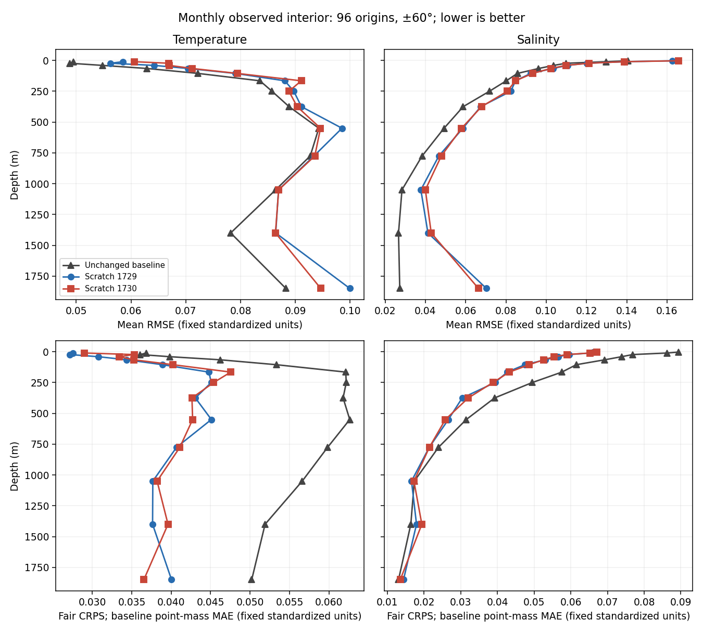
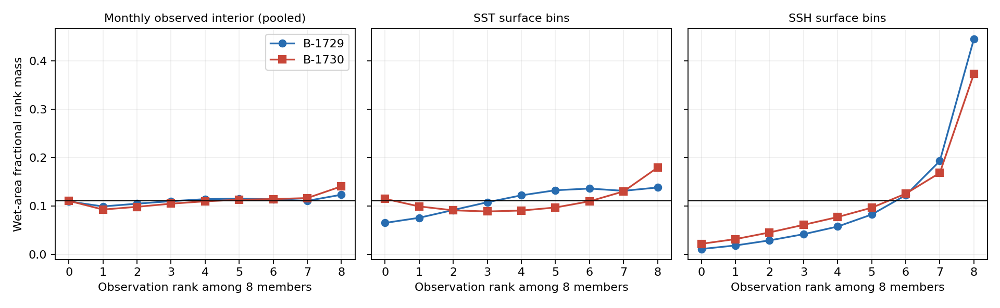
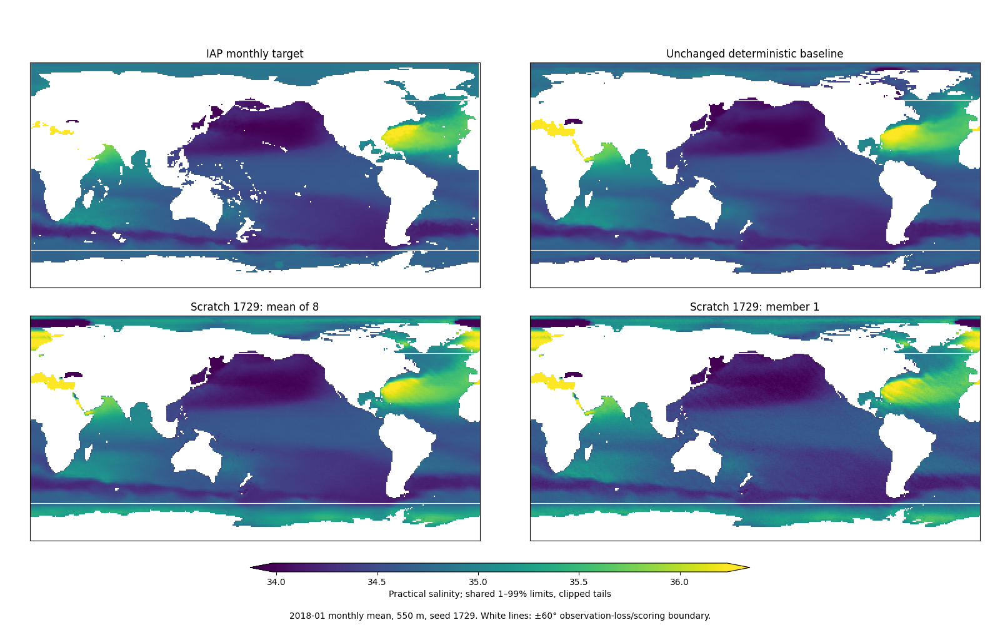
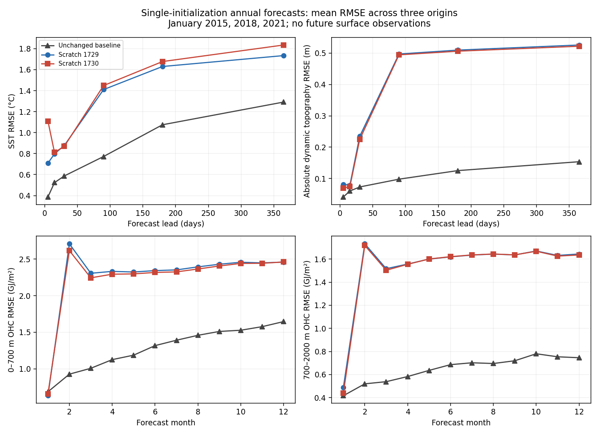
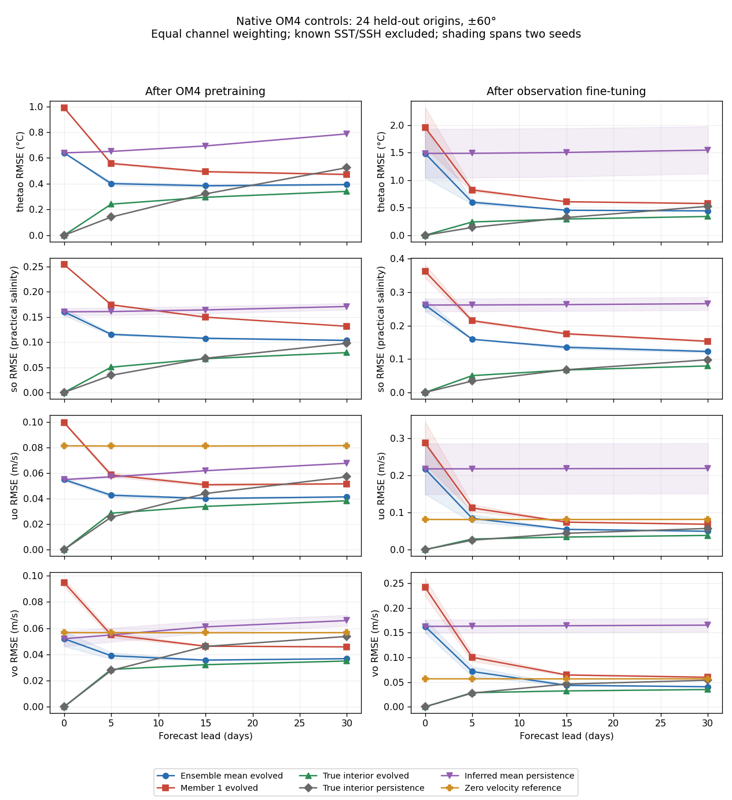
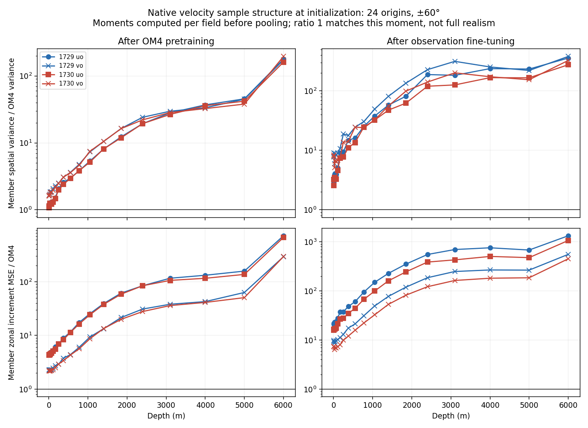

<!-- SPDX-FileCopyrightText: 2026 Samudra Authors -->
<!-- SPDX-License-Identifier: CC-BY-4.0 -->

# From-scratch interior diffusion: completed wave

**Diffusion improves probabilistic interior prediction, but does not improve the
selected baseline's mean forecasts.** Both seeds improve monthly interior fair
CRPS by 23–24%. Mean interior RMSE, surface forecast metrics and annual heat-content
errors are worse. Observation fine-tuning also substantially damages native OM4
velocity skill despite replay. This wave supports further work on the conditional
interior distribution; it does not establish a better ocean forecast model or
plausible unobserved velocities.

Both seeds completed 24,000 OM4 updates and 6,000 observation updates. All evaluations
completed on September 27, within the three-day window. This wave used **40.44
allocated GPU-hours**; the full campaign, including earlier work and all preempted
attempts, totals **61.86 of 576 GPU-hours**. No subsequent wave has been launched.

## What was trained and compared

A randomly initialized wide surface-history encoder conditions a randomly initialized
width-192 diffusion decoder. Nineteen five-day history frames feed the encoder.
The decoder jointly generates two 77-channel historical ocean states; available
historical SST/SSH are anchored. The conditioning representation has no prescribed
physical-state target. OM4 denoising supervision trains encoder and decoder jointly,
including interior velocities. **No pretrained deterministic initializer weights
are inherited.** Only the pre-observation OM4 physical dynamics are inherited and
frozen. Forecasts evolve each sampled physical state independently before averaging;
this wave does not evolve a persistent latent state or diffuse at every forecast step.

Observation fitting trains the initializer and atmospheric adapter through the frozen
dynamics, using two generated members per training example and OM4 replay every
four updates at weight 0.1. Both stages use batch size 1 and AdamW at 1e-4. The
qualified sampler uses 16 Heun steps; final reports use eight members. Checkpoints
are selected by validation only. Seeds are 1729 and 1730; the selected observation
validation scores are 0.7792 and 0.8095. Completing the update budget does not establish
convergence.

The reference is the **unchanged selected deterministic model from PR #892**, with
no new decoder inserted. Its monthly score reproduces the published result within
0.013%. Its dynamics were observation-fine-tuned; scratch diffusion's dynamics are
frozen. Training budgets and batch sizes also differ. This is a comparison of the
resulting systems, **not an isolated estimate of the causal effect of diffusion**.
The earlier width-64 A/B experiment remains historical; its A arm is not this baseline.

Existing temporal splits, normalization stores, forcing inputs and cohorts are
unchanged. OM4 uses the approved Engaging one-degree store and native flux forcings;
observation forecasts use the existing ERA5 adapter, with no future DUACS/OISST
surface observations supplied. No half-degree targets are used in this wave.

Evaluation comprises 96 independently initialized monthly origins in 2015–2022 and
three continuous annual rollouts initialized in January 2015, 2018 and 2021. These
are **not a continuous eight-year or 100-year rollout**. Observation scoring uses
monthly IAP interiors and five-day surface bins within ±60°, on the existing wet
support. It does not measure daily-output skill or Argo-profile skill. The interior
aggregate covers 27 supported T/S channels; the excluded surface-temperature channel
is not silently treated as zero error. This is a reused development cohort, not a
new blind test set.

## Observational results

Lower is better. Interior scores use fixed observation-standardized units, pooling
wet-area sums over origins before averaging supported channels. Point-mass CRPS
for a deterministic forecast is MAE.

| Metric | Unchanged baseline | Scratch 1729 | Scratch 1730 |
| --- | ---: | ---: | ---: |
| Existing monthly composite | 0.5913 | 0.8284 | 0.8552 |
| Interior mean RMSE, standardized | 0.08057 | 0.08887 | 0.08910 |
| Interior fair CRPS / baseline MAE | 0.05130 | 0.03890 | 0.03949 |
| Interior empirical eight-member CRPS | — | 0.04320 | 0.04363 |
| SST RMSE, °C | 0.5092 | 0.8069 | 0.9250 |
| SSH-derived surface velocity RMSE, m/s | 0.1090 | 0.1561 | 0.1527 |
| 0–700 m OHC RMSE, GJ/m² | 0.7090 | 0.6636 | 0.7211 |
| 700–2000 m OHC RMSE, GJ/m² | 0.4008 | 0.4263 | 0.4093 |

Mean interior RMSE is about 10–11% worse. Fair CRPS improves 24.18% and 23.02%; the
seed-average improvement is **23.60%**, with a paired calendar-year bootstrap interval
of **22.22–24.78%**. That interval conditions on these two fitted seeds and the fixed
sampling draws; it excludes training and Monte Carlo uncertainty. Empirical CRPS
also improves, so the result is not solely the finite-ensemble fair-score correction.
Temperature accounts for much of the improvement; deep salinity does not improve
consistently. The one-seed upper-ocean OHC gain is not replicated in the other seed.

### Calibration

Interior spread/RMSE is 0.785 and 0.752. For comparison, an exchangeable unbiased
eight-member ensemble has an aggregate variance-to-mean-error reference of
sqrt(8/9), approximately 0.943. Bias and spatial heterogeneity also contribute to
this ratio, so it is not a pure estimate of missing stochastic variance.

Interior outer-rank mass is 23.25% and 25.12%, versus 22.22% for uniform ranks.
The SSH forecast rank distribution has a stronger directional error. Raw empirical
90% quantile coverage is 71.65% and 69.65% for the interiors, but **eight-member
interpolated quantiles do not have nominal 90% coverage even under exchangeability**.
Those raw numbers must not be interpreted as a 20-point calibration deficit.
Ranks, spread and per-channel records should be considered together.

### Spatial fields

These are fixed examples, not selected for visual quality: January 2015, 2018 and
2021 at 550 m. Panels use shared limits and exactly 2×2 display pixels per native
lat–lon cell, without image interpolation. White lines mark ±60°; fields outside
that band are not covered by the observation-loss/scoring claim. The IAP target is
itself a smoothed analysis, so extra texture is not evidence of recovered observed
fine structure. Monthly averages also conceal instantaneous sample variability.

Other fixed maps: [1729: 2015](scratch-assets/monthly-so9-1729-2015-01.png),
[1729: 2021](scratch-assets/monthly-so9-1729-2021-01.png),
[1730: 2015](scratch-assets/monthly-so9-1730-2015-01.png),
[1730: 2018](scratch-assets/monthly-so9-1730-2018-01.png),
[1730: 2021](scratch-assets/monthly-so9-1730-2021-01.png).
Spatial moments and adjacent-cell differences for individual members, their means
and observations are included in the machine-readable summary.

## Annual forecasts and the SSH error

These rollouts initialize once, evolve all eight members independently for 73
five-day steps, and score their mean. Annual calibration was not evaluated.
The figure averages each origin's RMSE; it is not a pooled space-time RMSE.

At day 365, mean SST RMSE is 1.291°C for the baseline versus 1.734/1.835°C for
scratch diffusion. ADT/SSH RMSE is 0.154 m versus 0.526/0.522 m. December OHC errors
are about 1.65 versus 2.46 GJ/m² in the upper layer and 0.746 versus 1.64 GJ/m² in
the deeper layer.

The SSH result has an identifiable component: domain-mean bias is −0.056 m for the
baseline and −0.508/−0.504 m for scratch diffusion. Bias accounts for about 93% of
the scratch models' day-365 SSH MSE. Centered SSH RMSE is 0.143 versus 0.137/0.137 m.
This decomposition reproduces the original surface RMSE on the exact same support;
it does **not** replace or improve the reported score. It explains how a gradient-based
surface velocity proxy can improve while absolute SSH is much worse. That proxy is
not the predicted interior u/v field and is not evidence of interior velocity skill.

## Native OM4 controls and velocity retention

Twenty-four fixed held-out OM4 origins are evaluated at days 0, 5, 15 and 30, using
native forcings and the same frozen dynamics. Controls include true interior evolved,
true interior persisted, inferred mean persisted, a generated member evolved and
zero physical velocity. Known SST/SSH are excluded from the interior aggregate.
These compare against model truth, not observed velocities.

Before observation fitting, combined u/v mean RMSE is 0.0501/0.0568 m/s; velocity
fair CRPS is 0.0252/0.0282 m/s, better than zero-velocity MAE 0.0325 m/s. After fitting,
mean RMSE rises to **0.2374/0.1495 m/s**, and fair CRPS to **0.1243/0.0741 m/s**.
Both are worse than zero. Replay at the tested frequency and weight **does not
preserve native velocity skill**.

Individual velocity samples already have roughly 2.2× OM4's spatial variance and
5.5–5.8× its zonal adjacent-cell difference energy after pretraining. After observation
fitting, these become roughly **8.4–10.4×** and **18.6–25.7×**. These are ratios of
channel-averaged within-field moments, not variance pooled across time. The
profiles below retain the depth dependence. Relative excess is much larger at deep
levels, where OM4 velocity variability is small; interpret those ratios alongside
the absolute errors rather than as absolute velocity magnitudes.

The frozen dynamics strongly reduces the post-fine-tuning initialization errors:
day-30 u RMSE is about 0.0494 m/s and v about 0.0405–0.0407 m/s, versus true-interior
controls of 0.0382 and 0.0349. Temperature and salinity errors also shrink, while
inferred persistence remains poor. Thus a reasonable-looking evolved state can mask
a substantially degraded initializer. This is consistent with adaptation to the
observation task and loss of model-world constraints; it does not isolate the cause
or establish what real unobserved velocities should be.

## Sampling and execution checks

On the nine fixed validation origins, interior fair CRPS for 8/16/32 steps is
0.03808/0.03385/0.03421 for seed 1729 and 0.04340/0.03408/0.03408 for seed 1730.
The chosen 16 steps are close to 32 on this diagnostic; 32 is not exact truth.
No held-out checkpoint or sampler selection was performed using these scores.

Real-grid qualification passed finite losses/forecasts, nonzero encoder/adapter/
decoder gradients, frozen dynamics, strict checkpoint reload and data integrity.
The observation forward/backward qualification used 8.08 GiB GPU; production peaked
near 12.5 GiB GPU and 26.7 GiB host within the 48 GiB host allocation. Training and
evaluation ran as independent single-GPU L40S jobs. Preemptions resumed from strict
checkpoints, with optimizer/RNG/elapsed-budget state preserved; the completed
allocation ledger includes the preempted work. W&B remained offline.

Each copied observation report contains 207 files, approximately 2.16 GB, verified
against source SHA256 values after transfer. The unchanged baseline's 207-file
report was also fully verified. Selected checkpoint hashes, native-control CSVs,
24-origin velocity records, sampling reports and common evaluation contracts were
checked. No running campaign jobs remain.

## Interpretation and next decision

The straightforward from-scratch change produced a reproducible **probabilistic
interior gain**, but not overall forecast lift. Three limitations now have direct
evidence: worse mean-state prediction, loss of native velocity behavior during
fine-tuning, and a large annual SSH mean drift. The baseline's trainable dynamics
and different training budget prevent assigning those differences to diffusion alone.

For the next proposal, prioritize an end-to-end observation-fine-tuned system with
explicit preservation of model-world velocity behavior, and compare it with the
same unchanged baseline under a declared budget. A validation-calibrated uncertainty
model around the deterministic baseline would also establish how much of the CRPS
gain requires a diffusion model. Diagnose SSH mean balance explicitly rather than
concealing its error by recentering scores. Stronger replay or other retention
constraints should be judged on both observational skill and model-world retention.
The half-degree-target-only follow-up remains a separate, unlaunched experiment;
its forcing inputs and latent grid must remain unchanged. **Approval is required
before any later wave.**

## Artifacts and reproduction

- [Complete metric/structure summary](scratch-assets/summary.json.gz)
- [Native velocity calibration and structure](scratch-assets/native-velocity-index.json)
- [Native control curves](scratch-assets/native-controls.csv)
- [Annual forecast curves](scratch-assets/annual-forecasts.csv) and [surface error decomposition](scratch-assets/annual-surface-bias.csv)
- [Sampling sensitivity](scratch-assets/sampling-summary.json)
- [Validation curves](scratch-assets/validation-curves.csv)
- [Run/checkpoint identifiers and allocation ledger](scratch-assets/run-provenance.json)

Training producer: `04205aae3333`; primary evaluator: `0faefd0a0529`;
unchanged-baseline evaluator: `70a8883ffd69`; velocity evaluator: `f1f2be70fa4b`.
Immutable code snapshots and full verification proofs remain with the campaign
outputs. Engaging run root is
`/orcd/pool/008/jrusak/diffusion-interior-engaging/runs/scratch-b192-v2/B-{1729,1730}`;
selected weights are in `om4/best.pt` and `observation/best.pt`. Reports are in
`report-eight-members-v1`, `final-sampling-v1`, `native-controls-v2` and
`native-velocity-v1`. Local read-back copies and proofs are under
`outputs/diffusion-beta/engaging-transfer/`.

The implementation and launchers are linked from the PR diff. Relevant entry points:
[initialization](https://github.com/m2lines/Samudra/blob/codex/diffusion-interior-beta/src/samudra/experiments/diffusion_initialization.py),
[training](https://github.com/m2lines/Samudra/blob/codex/diffusion-interior-beta/src/samudra/experiments/diffusion_train.py),
[summary](https://github.com/m2lines/Samudra/blob/codex/diffusion-interior-beta/src/samudra/experiments/diffusion_scratch_summary.py),
[native diagnostics](https://github.com/m2lines/Samudra/blob/codex/diffusion-interior-beta/src/samudra/experiments/diffusion_native_controls.py),
[native aggregation](https://github.com/m2lines/Samudra/blob/codex/diffusion-interior-beta/src/samudra/experiments/diffusion_native_summary.py),
[figures](https://github.com/m2lines/Samudra/blob/codex/diffusion-interior-beta/src/samudra/experiments/diffusion_scratch_figures.py), and
[artifact export](https://github.com/m2lines/Samudra/blob/codex/diffusion-interior-beta/src/samudra/experiments/diffusion_scratch_export.py).

Reproduce the summary with `python -m samudra.experiments.diffusion_scratch_summary`
using the baseline and two completed report directories. The figure and export
modules expose their exact input-directory arguments through `--help`. Summary
aggregation verifies common observation/annual cohorts; native aggregation checks
completion and file hashes. The figure generator verifies its annual surface-error
decomposition against the existing metrics rather than changing the evaluation.
