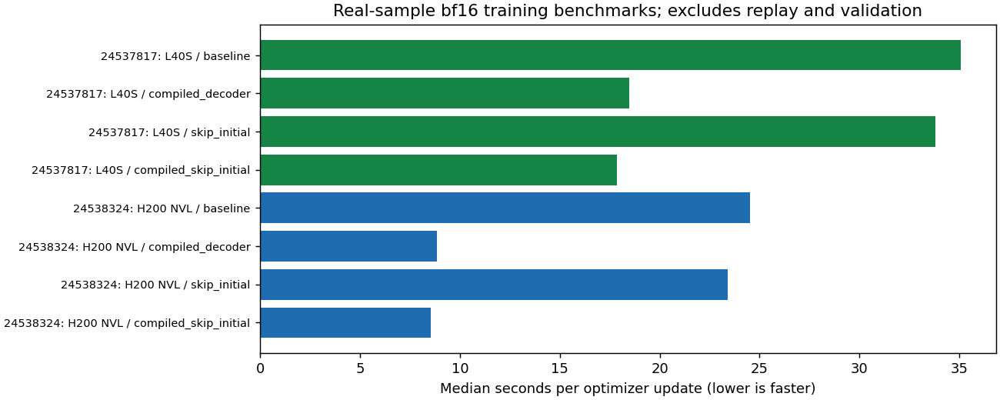

<!-- SPDX-FileCopyrightText: 2026 Samudra Authors -->
<!-- SPDX-License-Identifier: CC-BY-4.0 -->

# Faster latent-diffusion training

**The measured combination is 4.1× faster than the original L40S update:** use an
H200 NVL, compile the decoder, and omit unused initial readouts during observation
training. Keeping L40S and making the two code changes gives **1.96×**. These are
short, real-data timing tests, not new scientific training or a convergence claim.
Scientific training remains stopped pending review of the loss domain and controls.

## Measured update time

| Device | Original | Compile decoder | Compile + omit unused initial readouts | Within-device speedup, combined |
| --- | ---: | ---: | ---: | ---: |
| L40S | 35.072 s | 18.492 s | 17.878 s | 1.96× |
| H200 NVL | 24.526 s | 8.844 s | 8.543 s | 2.87× |

Jobs **24537817** and **24538324**, producer `35f29d2d0`, completed successfully.
Each number is the median of three updates after two warmups. The combined H200
result takes 24.4% of the original L40S update time. This is an update-throughput
comparison, not a promise of 4.1× shorter queue-to-report wall time.

An earlier H200 placement measured 22.270 → 7.826 seconds with compilation alone;
we retain that result rather than treating GPU placement as perfectly repeatable.
The first matched hardware/layout pair measured 35.073 versus 24.269 seconds:
hardware alone was **1.45×** faster. Channels-last was **10.5% slower** on both GPUs
(38.763 and 26.826 seconds), so it is not recommended for this model.

The measured update is the existing width-192 decoder and 128-channel latent
processor, initialized from the stopped seed-1729 selected checkpoint. It uses
one fixed real observation-training month (May 1993), seven forecast leads, two members,
16 Heun steps, bf16, the unchanged fair-CRPS objective, backward propagation,
gradient clipping and AdamW. Each variant starts with the same weights, fresh
optimizer and explicit per-update random seeds. These five-update trajectories
are timing probes; their loss evolution does not assess fine-tuning quality.

All timing jobs use **one GPU on one node**; no DDP speedup is included.
Data are preloaded. OM4 replay, validation, checkpoint saves, loader startup and
queueing are excluded. Actual stopped-run logs support the relevance of this
measurement: ordinary update intervals had medians **35.30 / 35.38 seconds** over
4,750 / 1,697 intervals; the calculation excludes checkpoint/validation boundaries
and discontinuities. It includes routine loading and replay work.

## Why these changes help

A separate baseline H200 profile attributes **47.4% of self GPU time to
`aten::native_group_norm`**, versus about 10% each for convolution forward and
backward. Kernel rows overlap operator rows and must not be added. Compiling the
whole decoder substantially reduces its execution cost; this does not isolate
how much of the gain comes from GroupNorm versus other fusion and overhead.

The observation loss differentiates through the sampler. Sixteen Heun steps
require 31 denoiser calls per readout. Two members × eight readouts (initial plus
seven future states) therefore make **496 denoiser calls before backward**.
Activation checkpointing adds recomputation. OM4 denoising pretraining has a
much cheaper objective, so the observed speedup must not be extrapolated to it.

Initial physical readouts do not enter the latent recurrence or observation
forecast loss. Omitting them removes 62 unused forward calls. The implementation
still consumes their noise draws to preserve subsequent sampling. Alone, this
saves about 4–5%; after compilation, it provides another 3–4%. Combined peak
allocated memory falls from **24.27 to 20.85 GiB** on L40S and **24.31 to 20.89 GiB**
on H200. These are allocated-tensor peaks, not total board memory requirements.

## Numerical checks

Compilation is not bitwise equivalent. At identical initial weights and noise,
first bf16 loss differences are tiny, but the sampled parameter gradients differ
by about **3.1% relative L2**, with cosine similarity about **0.9996**. The sample
contains the first 64 entries of each parameter gradient, 14,627 entries total;
it is not a full-gradient comparison. Disabling autocast on H200 reduces this to
**0.181% relative L2**, cosine **0.9999984**, and a first-loss difference of
**3.7×10⁻⁹**. This is consistent with numerical sensitivity, not proof of identical
long training trajectories.

A fixed-checkpoint, complete nine-origin validation comparison on H200 gives:

| Execution | Frozen validation composite | Full validation time |
| --- | ---: | ---: |
| Original | 0.693759 | 405.2 s |
| Compiled decoder | 0.693009 | 101.0 s |

Job **24538211**, producer `defada117`, completed. Times include loading, metric
computation and first-use compilation. The score changes by **−0.000750 (−0.108%)**;
this is a numerical comparison, not evidence of a better model. On scored wet
observation support, compiled-versus-original ensemble means differ by **0.0085°C
SST RMS** and **0.55 mm SSH RMS**. Local maxima are larger: 0.132°C and 9.49 mm.
The original H200 score also differs from the saved L40S selection score
(0.696514), so hardware/backend must be recorded and held fixed for close rankings.

The L40S replication (**24539006**) reproduced the saved original score exactly
(0.696514) and measured **0.695968** when compiled, a −0.078% change. Its full
validation time fell from **479.0 to 198.7 seconds (2.41×)**. No scientific weights
were updated by either validation comparison.

Eight focused model tests pass, including small-model forecast, full-gradient
and RNG equivalence for omitted readouts, and strict portable checkpoint reload
after the module compilation wrapper. The latter uses the CPU eager backend;
actual Inductor numerical differences are measured by the GPU tests above.

## Ready for the next reviewed run

The training CLI now has opt-in flags:

```text
--compile-decoder --skip-initial-training-readout
```

They are recorded in the qualification/training contract. Existing defaults and
scientific runs are unchanged. Future checkpoints record compilation, and their
report loader restores the same compiled-decoder setting. Run the existing
real-grid qualification with these flags before a new campaign: it exercises
OM4 and observation gradients, optimizer updates, resume and strict reload.
The benchmark’s 48 GiB host allocation is not a replacement for the full trainer’s
96 GiB allocation: the latter also holds the native replay cache.
Freeze hardware, image and execution settings across the deterministic/diffusion
comparisons, and match the requested global loss domain separately.

Do not prioritize channels-last or standalone GroupNorm compilation. The latter
hit PyTorch specialization limits twice; completed decoder timings were retained,
but failed allocations count toward cost. One redundant L40S retry was cancelled
while stalled in container import and replaced with the corrected benchmark.

Reducing denoising steps, changing the objective, or training a faster sampler
could save more, but would change the scientific method and need a quality
comparison. They are not required to obtain the measured implementation speedup.

The complete investigation used **1.3806 allocated GPU-hours**, including all
failed and cancelled attempts. All eleven benchmark/validation jobs are terminal.

## Research and reproduction

PyTorch documents [channels-last layouts](https://docs.pytorch.org/tutorials/intermediate/memory_format_tutorial.html),
[compilation for diffusion](https://pytorch.org/blog/torch-compile-and-diffusers-a-hands-on-guide-to-peak-performance/),
and [activation checkpointing's memory/recomputation tradeoff](https://pytorch.org/blog/activation-checkpointing-techniques/).
These informed hypotheses; the actual measurements determine the recommendation.

Reproducible tools: `samudra.experiments.diffusion_benchmark`,
`scripts/slurm_diffusion_benchmark.sbatch`, and
`scripts/summarize_diffusion_performance.py`. Benchmark data and operator profiles
are retained on Engaging under
`/orcd/pool/008/jrusak/diffusion-interior-engaging/runs/latent-performance-v1/job-JOBID`.
Use `COMPILE_TEST=1` for paired variants, `BENCHMARK_PRECISION=float32` for the
precision check, or `VALIDATION_COMPARISON=1` for fixed-weight validation.
Always supply an immutable `CODE_COMMIT` and a fresh output directory.


[Timing summary](performance-assets/performance-summary.json.gz) ·
[Raw per-update records](performance-assets/raw-timings.json.gz) ·
[Fixed-weight validation comparisons](performance-assets/validation-comparisons.json.gz) ·
[Allocation ledger](performance-assets/allocation-ledger.json.gz) ·
[Observed training intervals](performance-assets/training-step-timings.json.gz) ·
[Operator profiles](performance-assets/operator-profiles.json.gz) ·
[Source readback checksums](performance-assets/source-readback.json.gz).


