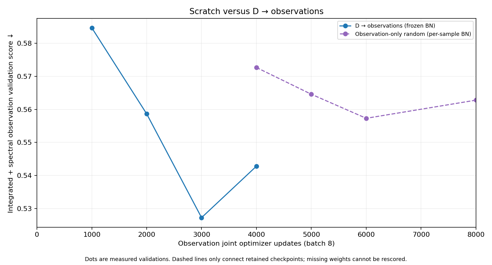
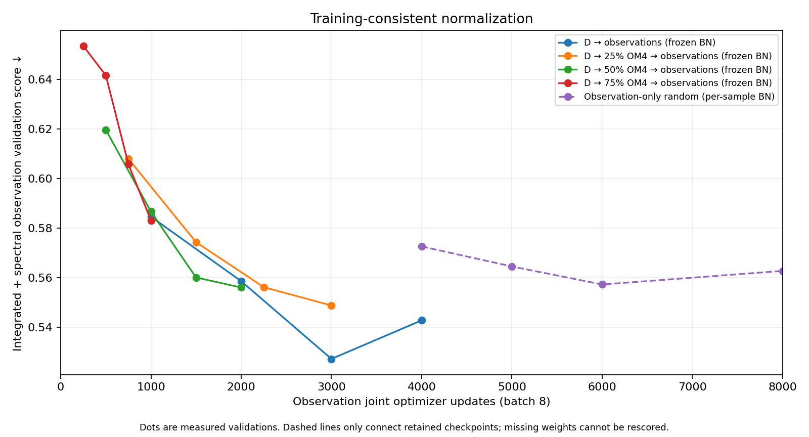
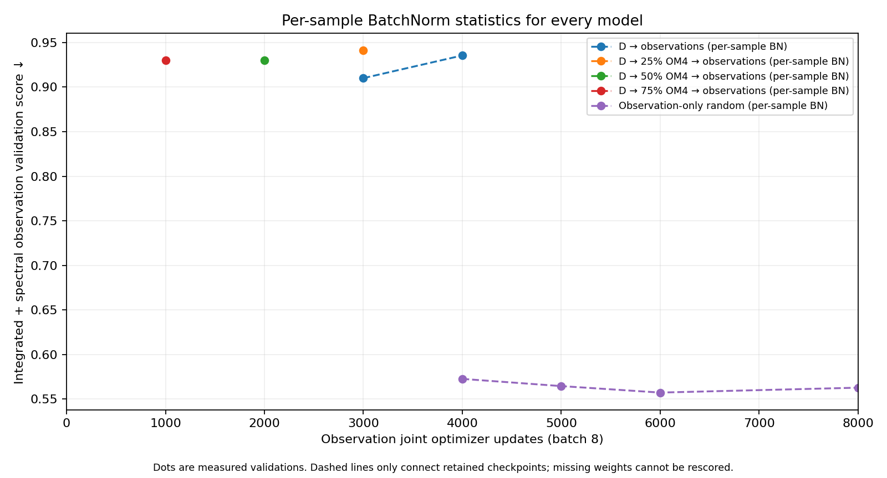

<!-- SPDX-FileCopyrightText: 2026 Samudra Authors -->
<!-- SPDX-License-Identifier: CC-BY-4.0 -->

# Validation versus updates with batch-statistics diagnostics

Snapshot: 25 September 2026, 00:25 ET. Lower is better. These are the integrated-plus-spectral observation validation scores on the same nine validation origins, with 5/15/30-day forecasts; they are not training RMSE or eight-year continuous rollouts.

## Primary comparison: scratch versus D → observations

The scratch score continues to improve: **0.57264 → 0.56456 → 0.55730** at 4k/5k/6k joint updates. Its 6k score is 5.7% above D’s selected 3k score, versus a much larger apparent gap under the original scratch inference policy. This is not equal total compute: D inherits substantial OM4 training. At 8k the score is 0.56278, slightly worse than 6k; see the [completed plateau report](scratch-plateau-2026-09-25.md).

## Comparison using each model's training normalization

D was trained with frozen BatchNorm statistics, so its original validation trajectories remain appropriate here. Observation-only random trained with batch statistics; its retained checkpoints are rescored using each sample's current activation statistics throughout initializer and evolution. Evaluation uses one sample at a time, consistent with training's gradient accumulation over eight samples. No weights are updated.

Scratch improves from **0.57264 at 4,000 updates to 0.56456 at 5,000** (1.4%). D's selected 3,000-update score is **0.52729**, and its terminal 4,000-update score is **0.54283**. This substantially narrows the apparent gap. It remains a comparison of different calibrated recipes, not an isolated estimate of pretraining's causal benefit.

## Requested common batch-statistics policy for every model

All retained checkpoints were also evaluated with per-sample BatchNorm statistics, including every transfer arm. This policy worsens D, which was trained with frozen statistics. Thus this second graph is a normalization sensitivity diagnostic, not the preferred ranking of the trained recipes.

| Model | Observation joint update | Per-sample BN validation score |
| --- | ---: | ---: |
| D → observations | 3,000 | 0.91008 |
| D → observations | 4,000 | 0.93555 |
| D → 25% OM4 → observations | 3,000 | 0.94147 |
| D → 50% OM4 → observations | 2,000 | 0.92982 |
| D → 75% OM4 → observations | 1,000 | 0.92987 |
| Observation-only random | 4,000 | 0.57264 |
| Observation-only random | 5,000 | 0.56456 |
| Observation-only random | 6,000 | 0.55730 |
| Observation-only random | 8,000 | 0.56278 |

## Model names and retained history

**D → observations** starts from the original OM4-pretrained initializer and evolution model, followed by 1,000 observation reconstruction updates and 4,000 observation joint updates. **D → 25% OM4 → observations**, **D → 50% OM4 → observations**, and **D → 75% OM4 → observations** additionally allocate 1,000/2,000/3,000 updates to shared OM4 continuation and the remaining 3,000/2,000/1,000 to observation joint training. Each receives the same reconstruction phase. **Observation-only random** starts both networks randomly and trains exclusively on observations; its joint extension completed at 8k. All use the same approximately 153.3M-parameter architecture. Full optimizer and model details are in the [main report](compute-allocation-2026-09-24.md#model-and-training-definitions).

Fourteen retained checkpoints were rescored: nine joint checkpoints shown above and five post-reconstruction checkpoints included in the [CSV](artifacts/2026-09-24-budget/batch-stat-curves/rescored-points.csv). The plots show only joint training, matching the original chart. Earlier overwritten weights cannot be rescored; single dots and dashed segments reflect that limitation rather than fabricated trajectories. Original transfer curves use their recorded validation events. The immutable 6k and 8k milestones are included.

These are retrospective diagnostics. Original checkpoint selections and held-out results have not been replaced. No new training or seed was introduced. Batch statistics use model activations, not validation labels, and do not pool different validation origins. See the [gap diagnostic](scratch-gap-diagnostics.md) for localization and anomaly results.

Read-only Slurm job **18469640** completed all 12 points in 108 allocated GPU-seconds on RTX. The [compressed evidence](artifacts/2026-09-24-budget/batch-stat-curves/evidence.json.gz) includes checkpoint hashes, point manifest, completion marker, full metrics, original validation events, and the scoring/plotting scripts. Training producer remains `79e8e6fde70e27317cfe89f308d0ab1212bcb6c4`.

The 6k follow-up job **18473594** completed in 35 allocated GPU-seconds, reusing the existing scored points and adding the immutable 6k terminal checkpoint.
