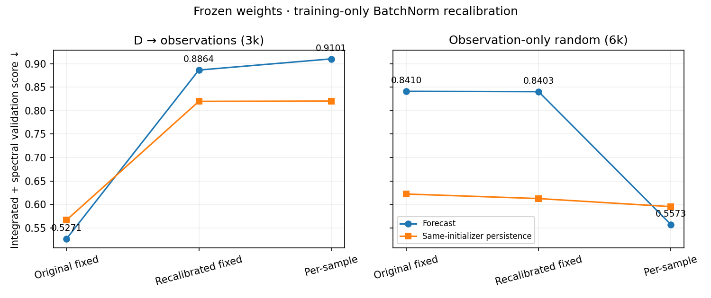

<!-- SPDX-FileCopyrightText: 2026 Samudra Authors -->
<!-- SPDX-License-Identifier: CC-BY-4.0 -->

# Frozen-weight BatchNorm recalibration

**25 September 2026.** A full training-input calibration pass did not recover scratch's per-sample inference performance. It also substantially worsened D. This inexpensive diagnostic therefore does not resolve the normalization confound or isolate a pretrained-weight benefit.

| Model | Inference statistics | Forecast score ↓ | Same-initializer persistence ↓ |
| --- | --- | ---: | ---: |
| D → observations (3k) | Original fixed | **0.52708** | 0.56698 |
| D → observations (3k) | Recalibrated fixed | 0.88636 | 0.81965 |
| D → observations (3k) | Per-sample | 0.91008 | 0.82026 |
| Observation-only random (6k) | Original fixed | 0.84104 | 0.62226 |
| Observation-only random (6k) | Recalibrated fixed | 0.84029 | 0.61259 |
| Observation-only random (6k) | Per-sample | **0.55730** | 0.59541 |

**D → observations (3k)** is the OM4-pretrained D initializer/evolution model after 1,000 observation reconstruction and 3,000 joint observation updates, selected from its 4k run. **Observation-only random (6k)** has randomly initialized networks trained only on observations, after the common 1,000 reconstruction and 6,000 joint updates. Each has approximately 153.3M parameters. The models retain their original input/output normalization constants and learned weights. Full training details are in the [final report](scratch-plateau-2026-09-25.md) and [original D history](d-training-history.md).

The score uses exactly the existing integrated-plus-spectral definition, frozen reference denominators and nine validation origins. Forecast diagnostics are at 5/15/30 days. Persistence holds the same inferred initial state fixed, so it changes when initializer normalization changes. These are validation diagnostics, not new held-out evaluations or checkpoint selections.

## Calibration protocol and checks

For each fixed checkpoint, reset every BatchNorm running mean, running variance and counter. Keep affine parameters and all other model parameters frozen. Run one deterministic shuffled pass over **all 243 training months**, seed 1729, one sample at a time. Set only BatchNorm modules to training mode, with `momentum=None`, while the remaining model stays in evaluation mode. Use the normal initializer followed by the full six/seven-step forecast path with prescribed forcing. No reconstruction calls, gradients, optimizer steps, or label-based fitting are used during calibration. Loading a sample exposes labels to the data container, but the calibration computation consumes only surface/forcing/context/mask inputs.

This collects **243 initializer calls and 1,600 evolution calls** per BatchNorm layer in the corresponding network. PyTorch accumulates the equally weighted average of call means and within-call unbiased variances. This is standard cumulative BatchNorm recalibration; it is not a pooled total-variance estimator including between-sample mean variation, a separate fit per forecast lead, or a layer-by-layer fixed-statistics calibration. During collection downstream activations are generated with batch statistics; during evaluation every layer uses the newly frozen buffers. That remaining difference can itself matter.

After calibration, switch all modules to evaluation mode before validation. Validate original fixed, recalibrated fixed and per-sample policies on the same checkpoint and hardware. The code verifies exact parameter hashes before/after, unchanged source-checkpoint hashes, finite calibration predictions/buffers, full training/validation coverage with disjoint paths, and no buffer mutation during fixed-statistics validation. Only running-statistic buffers/counters changed (108 buffers per model). Calibrated buffers are saved separately; original checkpoints, optimizer state and official selections are untouched.

## Interpretation

Scratch's recalibrated fixed score improves by only **0.09%** over its original fixed score and remains about **50.8% worse** than its per-sample score. Replacing D's original frozen statistics worsens its score by **68.2%**. Neither model benefits from this recalibration enough to justify a full held-out evaluation under the new policy.

This rejects the narrow hypothesis that **one standard training-only forecast-path recalibration is sufficient** to close the normalization gap. It does not show that fixed statistics are inherently superior to per-sample statistics, nor that no other calibration method could work. D was optimized with its frozen statistics; scratch was optimized with per-sample statistics. Their learned weights and statistics are coupled. Under a common newly recalibrated policy, scratch even scores better than D, but both are badly degraded relative to their training-consistent inference behavior; that ranking is not a fair replacement for the main comparison.

The remaining 0.527 versus 0.557 training-consistent gap is still not a weights-only estimate of pretraining benefit. A cleaner follow-up would train both recipes with the same batch-independent normalization architecture, input/output scales and observation protocol. No such training was launched here.

## Provenance

RTX job **18512340** completed in **331 allocated GPU-seconds** (5m31s), including both models, calibration, forecast/persistence validation and integrity checks. Cumulative campaign-plus-diagnostic use is **43.1172 GPU-hours**. Core producer remains `79e8e6fde70e27317cfe89f308d0ab1212bcb6c4`. The [evidence archive](artifacts/2026-09-25-bn-recalibration/evidence.json.gz) contains full metrics, parameter/checkpoint/buffer hashes, exact training order, call counts and executable diagnostic/plot scripts. [Scores CSV](artifacts/2026-09-25-bn-recalibration/scores.csv) accompanies the figure. Remote calibrated buffers are under `/scratch/jr7309/runs/2026-09-23-observation-budget-rtx-cache/bn-recalibration/{obs0,random}/calibrated-buffers.pt`.
