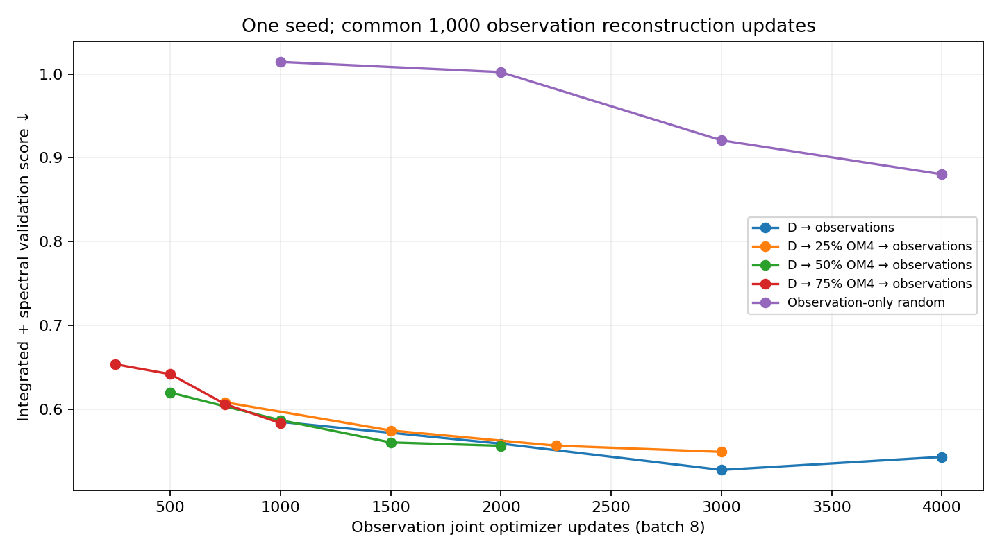
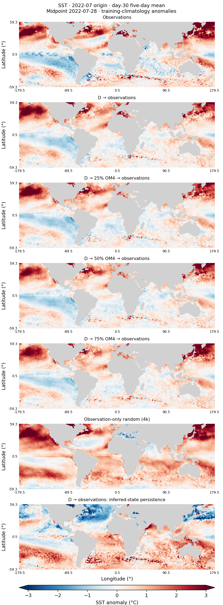
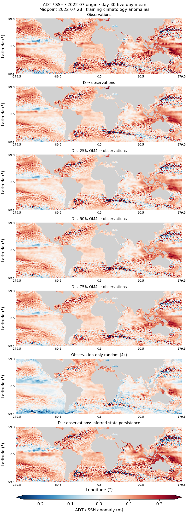

<!--
SPDX-FileCopyrightText: 2026 Samudra Authors

SPDX-License-Identifier: CC-BY-4.0
-->

# Observation compute allocation: matched-budget results

**24 September 2026, 16:12 ET.** All five matched-budget pathways and their held-out evaluations are complete. The observation-only extension is still training toward 8,000 joint updates; this report freezes its separate 4,000-update result.

**Starting from D, allocating all 4,000 additional joint updates to observations gives the best selected score in this one-seed comparison.** It scores 0.5861 on held-out observations versus 0.9343 for random initialization: a 37.3% reduction in the agreed composite. The advantage over allocating 25% to further OM4 training is much smaller, 1.0%. These are conditional, update-matched results; observation updates cost substantially more than OM4 updates.

## Diagnostic update: the scratch gap is strongly affected by BatchNorm

**18:44 ET:** a read-only test of the same frozen 4k scratch checkpoint improves
its observation validation score from **0.8801 to 0.5726** when inference uses
per-sample BatchNorm statistics instead of stored running statistics. The normal
D → observations score is **0.5271** in this diagnostic. About **87% of that
validation gap disappears without changing any weights or adding training**.

The original held-out table below remains the result of the original protocol,
but its 37.3% gap should not be interpreted as mostly the benefit of OM4 data.
This exposes a major normalization-recipe confound. The alternative mode is a
post-hoc validation diagnostic, not a newly selected model or a replacement
held-out result. Follow-up localizes most of the effect to evolution BatchNorm;
scratch then reaches day-30 SST anomaly correlation 0.711 versus D’s 0.712,
although its amplitude and ADT/interior skill remain weaker. See the [scratch-gap diagnostic report](scratch-gap-diagnostics.md).

## Completed comparison

Each row has 1,000 observation reconstruction updates plus the indicated joint allocation. Selection uses integrated-plus-spectral **validation** metrics only; the historical test set is never used to choose weights or learning rates. Lower scores are better.

| Model | OM4 / obs joint updates | Selected obs update | Validation score | Held-out score | Spectral error (dex) |
|---|---:|---:|---:|---:|---:|
| D → observations | 0 / 4,000 | 3,000 | 0.5273 | 0.5861 | 0.3052 |
| D → 25% OM4 → observations | 1,000 / 3,000 | 3,000 | 0.5488 | 0.5921 | 0.3078 |
| D → 50% OM4 → observations | 2,000 / 2,000 | 2,000 | 0.5561 | 0.6078 | 0.3332 |
| D → 75% OM4 → observations | 3,000 / 1,000 | 1,000 | 0.5832 | 0.6267 | 0.3791 |
| Observation-only random (4k) | 0 / 4,000 | 4,000 | 0.8803 | 0.9343 | 0.5891 |

Scores pool **96 separately initialized monthly forecasts in January 2015–December 2022**, each forecasting roughly one month. Surface errors combine day-5/15/30 five-day means; OHC compares next-calendar-month means. These are eight years of forecast cases, not a continuous eight-year rollout. [Complete physical-unit component table](artifacts/2026-09-24-budget/matched/heldout-table.md), [CSV](artifacts/2026-09-24-budget/matched/heldout-metrics.csv), and [audited evidence](artifacts/2026-09-24-budget/matched/evidence.json.gz).

The composite is half the mean of five integrated errors divided by fixed validation-climatology errors, plus half the mean of 27 spatial spectral errors. **Dex** is a base-10 logarithmic unit: a uniform factor-of-two power error is 0.301 dex. Spectral agreement measures power, not phase.

The all-observation allocation beats the 25% allocation in seven of eight annual rescoring checks, and the 50%, 75%, and random allocations in all eight. These dependent calendar-year summaries are descriptive robustness checks, not independent seeds or confidence intervals. The zero-versus-25% difference remains too small for a strong general ranking from one seed.

## What the forecasts add beyond initialization

| Model | Forecast score | Same-initializer persistence score | Annual checks where forecast wins |
|---|---:|---:|---:|
| D → observations | 0.5861 | 0.6137 | 8/8 |
| D → 25% OM4 → observations | 0.5921 | 0.6169 | 8/8 |
| D → 50% OM4 → observations | 0.6078 | 0.6182 | 8/8 |
| D → 75% OM4 → observations | 0.6267 | 0.6153 | 0/8 |
| Observation-only random (4k) | 0.9343 | 0.7098 | 0/8 |

Unlike the original short pilot, the first three transfer allocations now beat persistence from their own selected initializer on the agreed score. For **D → observations**, day-30 SST anomaly correlation is 0.734 versus 0.114 for persistence, with anomaly RMS amplitude 0.821 of observed and RMSE 0.575 versus 1.215 °C. Random at 4k reaches correlation 0.348 and RMSE 1.161 °C, and still loses the composite to its own persistence control.

Deep interior skill remains limited: D → observations has deep-OHC anomaly correlation 0.130 and RMSE 0.405 GJ/m², worse than seasonal climatology at 0.373 GJ/m². The earlier coarse-grid ADT gradient/missing-boundary problem still qualifies velocity/EKE scores; this wave deliberately preserves that operator for comparability. See the [original operator audit and methods](snapshot-2026-09-23-methods.md).

## Model and training definitions

All learned forecasts use the same deterministic, non-diffusion D architecture: a **121.7M-parameter history initializer**, a **31.6M-parameter five-day autoregressive evolution network**, and a **387-parameter 8 → 32 → 3 ERA5 adapter**, about **153.3M parameters total**. The initializer uses 19 five-day surface-history frames to infer two full ocean states. The adapter supplies atmospheric conditioning.

- **D → observations:** start from the original OM4-pretrained D checkpoint, then observation reconstruction and 4,000 observation joint updates. No further OM4 continuation.
- **D → 25% OM4 → observations**, **D → 50% OM4 → observations**, and **D → 75% OM4 → observations:** use the exact terminal 1,000/2,000/3,000-update snapshots of one shared OM4 joint continuation from that same D checkpoint, then separately reconstruct on observations and run 3,000/2,000/1,000 observation joint updates. Percentages refer only to the 4,000 joint-update pool.
- **Observation-only random (4k):** random initializer and evolution weights, trained exclusively on observations, with the best checkpoint through joint update 4,000 frozen independently of the ongoing extension.
- **Same-initializer persistence:** use each row’s selected initializer but bypass evolution. In maps, **D → observations: inferred-state persistence** means that control for D → observations. The additional source, seasonal-climatology and anomaly-persistence control names are defined below the complete component table.

Reconstruction trains the initializer and adapter with monthly interior T/S supervision while freezing evolution. Joint training updates all networks with forecast loss plus 0.1 × reconstruction loss. Each update accumulates eight samples. AdamW, weight decay 0.01, clipping 1, 50-update warm-up then constant LR; fresh optimizers when switching phase/domain. Calibration selected core LR 3e-5 for OM4 and transfer, and 1e-4 for scratch; joint adapter LR is 1e-4. Transfer retains OM4 normalization and frozen BatchNorm; scratch uses training-observation normalization and updating BatchNorm. Consequently this compares the calibrated transfer and scratch recipes, not pretrained weights as the sole changing factor.

Every arm completed its full prescribed budget. D → observations selected update 3,000 (0.5273); its terminal 4,000-update score worsened to 0.5428. The other transfer arms selected their endpoints. All transfer arms get four joint-selection checks; random also gets four through 4k. The observation-only validation sequence is 1.0146, 1.0023, 0.9209, 0.8803 at 1k/2k/3k/4k: **no plateau is established yet**.

Earlier D checkpoints and logged OM4 errors are now documented in the
[backward training-history report](d-training-history.md), including the same
observation score for a retained 12,501-update short pilot.

## Compute interpretation

This is a comparison of **additional optimizer updates after an already substantially pretrained D**. It does not charge D’s original initializer/dynamics training and does not establish end-to-end compute efficiency versus scratch. Architecture and protocol stayed fixed; no new seed or additional experiment arm was introduced.

The update unit is materially unequal: each OM4 example uses one initializer forward and six evolution steps; each observation joint example uses one forecast initializer plus six/seven monthly reconstruction initializer forwards, and six/seven evolution steps. At 4,000 observation joint updates this is 32,000 sample presentations, **242,771 initializer** and **210,771 evolution** forwards. Common reconstruction adds **52,684 initializer forwards** per arm. These counts exclude backward recomputation, validation, calibration and preemption replay; [reproducible work counts](artifacts/2026-09-24-budget/matched/work-counts.json) retain the exact monthly lengths and deterministic sampling convention. Equal updates are therefore not FLOP matching.

Observation joint phase timers average 5.36/5.12/5.43 seconds per update on H200 for the 0%/25%/50% arms; the 75% arm averaged 4.31 on RTX. These include phase validation and are not controlled hardware benchmarks. The shared 3,000-update OM4 stage used 1.016 allocated GPU-hours including its validation and restart. A conclusion about where to spend an equal number of GPU-hours would require a time-matched follow-up; this wave supports the narrower update-allocation conclusion.

Completed transfer train/evaluation allocations, including requeues, cost 7.827/5.746/4.580/2.138 GPU-hours for the 0%/25%/50%/75% observation stages, plus the shared OM4 stage. For standalone pathway cost, charge the relevant OM4 prefix to each pathway rather than counting the shared prefix as free. At 16:12 ET the whole wave had used **36.553 allocated GPU-hours** including calibration, failed attempts, evaluation, and the still-running scratch extension, within the approved 100-hour ceiling. Hardware differs across arms; GPU-hours are operational cost, not interchangeable FLOPs.

## Day-30 structure

January and July 2022 were fixed as illustrative cases before inspecting outputs. All rows use the same valid observational support and color limits; anomalies subtract the training seasonal climatology. These figures illustrate structure, while the full-cohort metrics above determine comparisons.

| July SST anomalies | July ADT anomalies |
|---|---|
|  |  |

Additional views: January [SST](artifacts/2026-09-24-budget/matched/maps/day30-2022-01-anomalies-sst.png) / [ADT](artifacts/2026-09-24-budget/matched/maps/day30-2022-01-anomalies-adt.png), and July absolute [SST](artifacts/2026-09-24-budget/matched/maps/day30-2022-07-fields-sst.png) / [ADT](artifacts/2026-09-24-budget/matched/maps/day30-2022-07-fields-adt.png).

## Provenance and remaining work

Training/evaluation producer: `79e8e6fde70e27317cfe89f308d0ab1212bcb6c4`; seed 1729. Shared OM4 job 18409909; observation jobs 18409910/18409921/18409922/18438483; random 18409920. Separate frozen-4k evaluation 18455079 completed successfully after a 13-second launcher-only failure in 18453534. The fix reused the previously tested torchrun argument separator; no model/evaluator code or checkpoint changed. CPU diagnostics and fixed-case extraction also completed successfully. Full checkpoint hashes, all accounting attempts, stage manifests, annual diagnostics and evaluation signatures are retained in the linked evidence and [summary](artifacts/2026-09-24-budget/matched/summary.json).

The remaining authorized work is the continuous random extension to 6k/8k, its frozen milestone validation comparison, final held-out evaluation and plateau report. No convergence claim or new wave is warranted before those results arrive.
