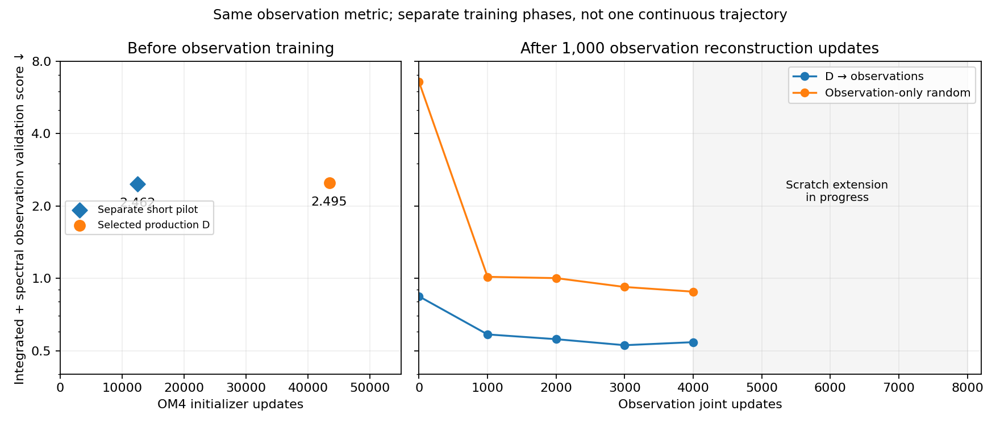
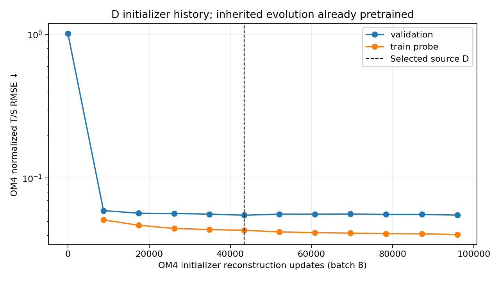

<!--
SPDX-FileCopyrightText: 2026 Samudra Authors

SPDX-License-Identifier: CC-BY-4.0
-->

# Looking backward into D’s OM4 training

**24 September 2026.** Earlier logged OM4 errors are recoverable, and one retained
short-pilot checkpoint provides an earlier observation-score reference. A dense
backward curve on the observational metric cannot be recovered from the existing
production checkpoints: that run retained only its selected best and final weights.

## Original D training recipe

The source is **the primary wave-3 D reconstruction initializer plus the wave-1 AR pretrained evolution checkpoint**. It is not the separately jointly adapted wave-3 D model. The two networks were trained in separate stages:

| Detail | Initializer | Inherited evolution |
| --- | --- | --- |
| Architecture | Wider ConvNeXt U-Net, widths 256/384/512/768, approximately 121.7M parameters | ConvNeXt U-Net, widths 128/192/256/384, approximately 31.6M parameters |
| Inputs / task | 19 five-day SST/SSH and historical forcing frames (90-day span), masks and geographic/seasonal features → two 77-channel states; known surface values copied | Two true OM4 states and prescribed forcing → autoregressive five-day full-state forecasts |
| Training target | Equal-variable normalized interior T/S/U/V reconstruction | Balanced normalized full-variable forecast loss, autoregressive 1/3/6-step curriculum |
| Optimizer | AdamW, constant LR 3e-4, weight decay 0.01, clipping 1, BF16 | AdamW, LR 3e-4, weight decay 0.01; BF16 |
| Sampling / seed | Global batch 8: two samples per GPU × two GPUs × two accumulation steps; seed 1729 | Two samples per GPU; global batch depends on the historical allocation; seed 1729 |
| Selection | Equal subsurface-T/S reconstruction MSE on 11 validation origins | Forecast validation loss from true OM4 initialization |
| Selected / final updates | 43,439 / 95,919 | 1,260,598 / 1,302,968 pretraining updates |

Both use the one-degree `om4_onedeg_v3` dataset (180 × 360) and its existing mean/std stores. Training dates are **1975-01-03 through 2013-10-04**; validation targets lie in **2013-10-05 through 2014-10-05**. Longer history for D is read-only context; it does not add validation targets to training. Existing normalization stores were reused without restricting their time range, as specified in the original protocol.

D's initializer LR was chosen by short 1e-4/3e-4 pilots, then production restarted from fresh seed-1729 weights. It ran on two RTX PRO 6000 Blackwell GPUs, validating every 20 minutes and checkpointing every three minutes. The maximum was eight training hours, with stopping after six non-improving validations after at least two hours; it actually stopped at about **3.669 accumulated training hours**. The earlier evolution run used a time-based 1/3/6-step curriculum: one step for the first 20% of its phase budget, three through 50%, then six. These updates are therefore not equivalent units of training work.

The source checkpoint predates observational reconstruction, the ERA5 adapter and observation joint training. Those stages have separate learning rates and normalization policies in the [observation methods](compute-allocation-2026-09-24.md#model-and-training-definitions). Original protocols and complete records: [wave 1](../surface-wave1.md), [wave-3 plan](../surface-wave3-plan.md), and [wave-3 results and lineage](../surface-wave3-results/index.md). The historical audit in this report's artifact folder preserves source manifests and logged events; initializer producer is `96aea56c92d82aa18255942b3443b87ed510a589`.

## Does the best allocation likely precede D?

**Earlier OM4 checkpoints are a sensible next region to test, but the current allocation experiment does not locate that optimum.** It starts at an already heavily pretrained D and exchanges additional OM4 updates for observation updates. Worse downstream scores can therefore reflect the opportunity cost of less observation adaptation, diminishing returns on OM4, or domain specialization. This is additional training on the existing OM4 dataset, not an experiment adding new independent OM4 data.

D was deliberately selected by OM4 validation, not stopped at an arbitrary moment. Between selected update 43,439 and final update 95,919, initializer training-probe RMSE fell from **0.04339 to 0.04048**, while validation RMSE changed from **0.05519 to 0.05528**. That is consistent with saturation and mild late overfitting; it does not establish severe overfitting of the selected checkpoint. An OM4-optimal checkpoint need not be optimal for later observation adaptation or for total compute efficiency.

The retained 12.5k initializer pilot is an available earlier reference, but still inherits the same roughly 1.26M-update evolution model. Comparing it with D after matched observation adaptation would test initializer pretraining duration only. Establishing the overall OM4/observation balance also requires earlier evolution checkpoints and accounting for both training stages. These are proposed follow-ups, not newly launched experiments. The normalization diagnostic further limits causal interpretation of the original scratch gap.

## Same observational metric, earlier retained model

Both points below use the same nine validation origins, frozen normalization and
integrated-plus-spectral definition as the current fine-tuning graph. Neither has
received observation training; both use the zero-output ERA5 adapter. The entire
historically pretrained evolution network is retained in both cases.

| Model | OM4 initializer updates | Observation validation score |
|---|---:|---:|
| D short pilot, LR 3e-4 | 12,501 | 2.46237 |
| Selected production D | 43,439 | 2.49504 |

**D short pilot, LR 3e-4** is the separate 30-minute learning-rate pilot with the
same architecture, seed 1729, batch eight, training data and chosen core learning
rate as production. It is not an archived early production checkpoint, so the two
points are not connected as a single optimization trajectory. **Selected production
D** is the exact source used by the observational experiments. Its newly recomputed
score differs from the recorded source baseline by 0.0022%, consistent with the
changed GPU execution; the checkpoint and input hashes were verified.

The two panels share a logarithmic observation-error axis but have different update
axes and a reconstruction phase between them. The right panel’s zero is **after
1,000 observation reconstruction updates**, not random initialization or unadapted
D. Scratch continues toward 8k; its final forward extension will appear in the
plateau report. The small 1.3% advantage of the short pilot before adaptation does
not establish that less pretraining produces better fine-tuned models. Testing that
would require the same observation adaptation applied to both starting checkpoints.

## Original production learning curve

The logged production scores below are **OM4 normalized T/S reconstruction RMSE**
on 11 validation origins. They are not observation scores and cannot be spliced
into the same y-axis as the graph above.

| Initializer updates | OM4 validation RMSE |
|---:|---:|
| 0 | 1.01903 |
| 8,776 | 0.05939 |
| 17,482 | 0.05702 |
| 26,186 | 0.05673 |
| 34,812 | 0.05616 |
| 43,439 — selected source | 0.05519 |
| 95,919 — final | 0.05528 |

[All logged points and train probes](artifacts/2026-09-24-budget/d-history/om4-initializer-history.csv)
come from the original checked-in wave-3 learning curve and were cross-checked
against live training logs. Production continued well past the selected checkpoint.

These counters describe initializer reconstruction only. D’s inherited evolution
checkpoint was selected at approximately **1,260,598 earlier OM4 optimizer updates**,
with a changing forecast curriculum. Therefore 12.5k versus 43.4k is not the total
OM4-training budget, and neither checkpoint is a lightly pretrained full model.
The evolution run also retained only best/final checkpoints at the audited paths.

## What a fuller backward curve would require

Existing retained weights support the two reference points above, not a dense
observation-score curve over original pretraining. More original-production points
would require finding an external checkpoint archive or rerunning training with
explicit immutable milestones. To answer how *less pretraining affects eventual
fine-tuning*, those starting points would each also need the same observation
adaptation budget. No such new training has been launched.

Diagnostic job **18460911** completed on RTX in 37 seconds. It reused observation
producer `79e8e6fde70e27317cfe89f308d0ab1212bcb6c4`, strict core loading, and the frozen
validation reference. Checkpoint hashes, full metrics and the read-only checkpoint
inventory are retained in [the artifact folder](artifacts/2026-09-24-budget/d-history/).
No held-out data selected either historical checkpoint or these diagnostic points.
