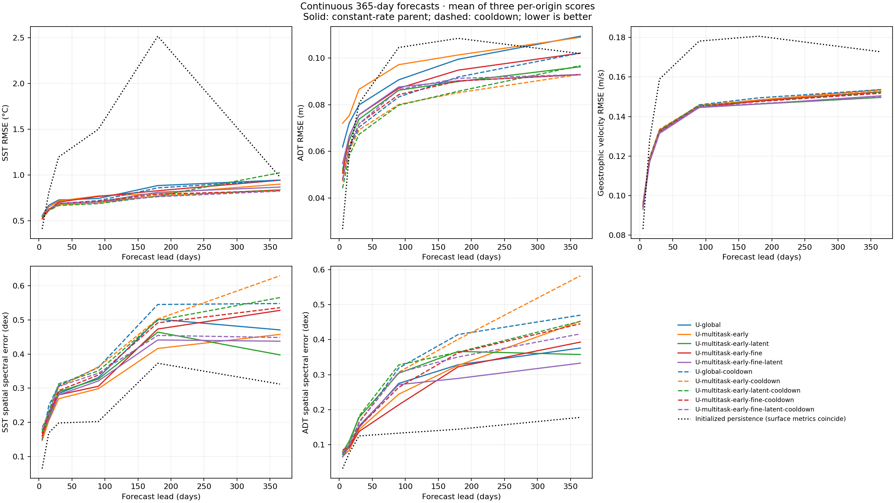

<!-- SPDX-FileCopyrightText: 2026 Samudra Authors -->
<!-- SPDX-License-Identifier: CC-BY-4.0 -->

# Continuous 365-day evaluation of early/fine models

**All ten selected models completed all three year-long rollouts with finite
states.** Nine beat initialized persistence on day-365 SST RMSE and all ten beat
it on velocity RMSE, but **every model has worse SST and SSH spatial spectral
error than persistence**. All ten improve monthly heat-content RMSE over their
own initialized persistence. The short-horizon ordering changes at a year;
there is no single winner across the annual components.

This evaluates the five [constant-rate models](early-fine-wave-2026-10-07.md)
and their five [cooldown counterparts](early-fine-cooldown-2026-10-08.md), using
already selected weights. No annual outcomes select checkpoints or train models.
These are **three continuous one-year cases**, not continuous eight-year
forecasts or 96 annual starts. Finite one-year rollouts do not establish
century-scale stability.

Contents: [Day-365 results](#day-365-results) · [Lead curves](#lead-curves) ·
[Heat content and EKE](#heat-content-and-eke) · [Day-365 maps](#day-365-maps) ·
[Models and protocol](#models-and-protocol) · [Verification](#verification).

## Day-365 results

Arithmetic means of the three per-origin scores; lower is better. The final
state here means the **five-day mean covering days 360–365**, not an instantaneous
snapshot. Velocity is derived geostrophically from predicted SSH and compared
to the observed velocity product; it does not directly test prognostic U/V.
SST and ADT spectral errors each average three regions. **Dex** is the RMS
log10-power difference over a spectrum: 0.3 dex is approximately a factor-two
power mismatch when that mismatch is uniform, without indicating its direction.

| Model | SST RMSE (°C) | ADT RMSE (m) | Velocity RMSE (m/s) | SST spectrum (dex) | ADT spectrum (dex) |
|---|---:|---:|---:|---:|---:|
| U-global | 0.944 | 0.1093 | 0.1536 | 0.471 | 0.376 |
| U-multitask-early | 0.900 | 0.1088 | 0.1535 | 0.458 | 0.453 |
| U-multitask-early-latent | 0.839 | 0.0962 | 0.1496 | 0.398 | 0.358 |
| U-multitask-early-fine | 0.943 | 0.1020 | 0.1524 | 0.528 | 0.393 |
| U-multitask-early-fine-latent | 0.868 | 0.0928 | 0.1504 | 0.438 | 0.333 |
| U-global-cooldown | 0.943 | 0.1021 | 0.1536 | 0.548 | 0.470 |
| U-multitask-early-cooldown | 0.837 | 0.0929 | 0.1531 | 0.630 | 0.583 |
| U-multitask-early-latent-cooldown | 1.024 | 0.0967 | 0.1522 | 0.566 | 0.452 |
| U-multitask-early-fine-cooldown | 0.829 | 0.0929 | 0.1517 | 0.536 | 0.445 |
| U-multitask-early-fine-latent-cooldown | 0.824 | 0.0929 | 0.1499 | 0.449 | 0.417 |
| Initialized persistence (shared surface control) | 0.976 | 0.1018 | 0.1727 | 0.312 | 0.178 |

The shared surface-control row is justified by exact agreement of **every
per-origin surface metric and spectrum** across the ten persistence runs.
Their inferred interiors differ, so heat-content controls remain model-specific.

The fine-plus-latent cooldown has the lowest day-365 SST RMSE; its constant-rate
parent has the lowest ADT RMSE. The constant-rate coarse-plus-latent model has
the lowest velocity RMSE and SST spectral error. Its cooldown is the only model
whose mean day-365 SST error exceeds persistence. Six of ten improve ADT RMSE
over persistence. These are descriptive rankings on three cases, not evidence
of a statistically established winner or a pure resolution effect.

## Lead curves

Solid lines are constant-rate parents; dashed lines are their cooldowns.
Each mean is taken **after** computing the score per origin, not by pooling
squared errors across origins. The saved CSV includes every origin/control/lead.

Individual cases: [2015-01-01](artifacts/early-fine-annual-2026-10-08/final/summary/lead-curves-2015-01-01.png) · [2018-01-01](artifacts/early-fine-annual-2026-10-08/final/summary/lead-curves-2018-01-01.png) · [2021-01-01](artifacts/early-fine-annual-2026-10-08/final/summary/lead-curves-2021-01-01.png).

Spatial power at day 365: [SST](artifacts/early-fine-annual-2026-10-08/final/summary/sst-spectra.png) · [ADT](artifacts/early-fine-annual-2026-10-08/final/summary/adt-spectra.png).
Persistence SST error rises to about 2.52°C at day 180, then falls back to
0.98°C near the same season a year later. The U-global rollout is about 0.88°C
at day 180. Thus a day-365 comparison alone understates the benefit of following
the seasonal cycle; it does not by itself demonstrate correct eddy dynamics.

The spectral figures average power across cases; table entries instead average
the per-case spectral errors, so they are not the error of the plotted mean.

## Heat content and EKE

OHC entries average **36 origin-month RMSEs** (12 calendar months × three cases),
in units of 10⁸ J/m². Each cell is **evolved / own initialized persistence**.
The monthly curves retain the progression through the year.

| Model | OHC 0–700 m | OHC 700–2000 m | Annual EKE RMSE (m²/s²) | Annual EKE spectrum (dex) |
|---|---:|---:|---:|---:|
| U-global | 9.008 / 10.461 | 5.410 / 5.829 | 0.02569 | 2.213 |
| U-multitask-early | 8.610 / 9.763 | 4.416 / 5.722 | 0.02567 | 2.268 |
| U-multitask-early-latent | 8.674 / 10.982 | 4.499 / 5.989 | 0.02558 | 2.285 |
| U-multitask-early-fine | 9.313 / 11.078 | 5.015 / 6.193 | 0.02568 | 2.223 |
| U-multitask-early-fine-latent | 8.340 / 10.769 | 4.603 / 5.774 | 0.02554 | 2.121 |
| U-global-cooldown | 8.918 / 9.938 | 4.478 / 5.742 | 0.02592 | 2.310 |
| U-multitask-early-cooldown | 7.616 / 9.461 | 4.230 / 5.626 | 0.02580 | 2.376 |
| U-multitask-early-latent-cooldown | 7.739 / 9.606 | 4.349 / 5.719 | 0.02565 | 2.277 |
| U-multitask-early-fine-cooldown | 8.683 / 9.677 | 4.694 / 5.647 | 0.02581 | 2.288 |
| U-multitask-early-fine-latent-cooldown | 8.597 / 10.033 | 4.566 / 5.723 | 0.02555 | 2.250 |

U-multitask-early-cooldown has the lowest mean OHC errors in both depth ranges.
Annual EKE uses each sequence's **own within-year velocity mean** to define
anomalies; RMSE compares the resulting time-dependent EKE fields. It is not
the fixed-lead EKE across independently initialized monthly forecasts in the
short-horizon report. Persistence has zero temporal-anomaly EKE apart from
roundoff, with EKE RMSE **0.02637 m²/s²**. The evolved models improve that RMSE
by only **1.7–3.1%**, and their EKE spectra remain far too weak. That small RMSE
gain should not be interpreted as successful recovery of observed variability.

[Monthly 0–700 m curves](artifacts/early-fine-annual-2026-10-08/final/summary/monthly-ohc-0_700.png) · [Monthly 700–2000 m curves](artifacts/early-fine-annual-2026-10-08/final/summary/monthly-ohc-700_2000.png) · [Annual EKE spectra](artifacts/early-fine-annual-2026-10-08/final/summary/annual-eke-spectra.png).

The EKE power plot omits the persistence roundoff residual from its logarithmic
axis and labels its mathematical zero explicitly. No metric values are altered.

## Day-365 maps

Each figure compares **observations, constant-rate parent, cooldown, and the
cooldown's initialized persistence** on identical observation-valid support and
shared color limits. Surface persistence is shared by the pair. Anomalies
subtract the same observation-training December climatology from every row;
absolute maps are also supplied for the 2021 origin. Each retained grid cell
occupies exactly **2×2 pixels** at native image size.

| Parent/cooldown pair | 2015 origin SST / SSH anomalies | 2018 origin SST / SSH anomalies | 2021 origin SST / SSH anomalies | 2021 absolute SST / SSH |
|---|---|---|---|---|
| U-global | [SST](artifacts/early-fine-annual-2026-10-08/final/summary/maps/U-global/day365-2015-01-01-anomalies-sst.png) / [SSH](artifacts/early-fine-annual-2026-10-08/final/summary/maps/U-global/day365-2015-01-01-anomalies-adt.png) | [SST](artifacts/early-fine-annual-2026-10-08/final/summary/maps/U-global/day365-2018-01-01-anomalies-sst.png) / [SSH](artifacts/early-fine-annual-2026-10-08/final/summary/maps/U-global/day365-2018-01-01-anomalies-adt.png) | [SST](artifacts/early-fine-annual-2026-10-08/final/summary/maps/U-global/day365-2021-01-01-anomalies-sst.png) / [SSH](artifacts/early-fine-annual-2026-10-08/final/summary/maps/U-global/day365-2021-01-01-anomalies-adt.png) | [SST](artifacts/early-fine-annual-2026-10-08/final/summary/maps/U-global/day365-2021-01-01-fields-sst.png) / [SSH](artifacts/early-fine-annual-2026-10-08/final/summary/maps/U-global/day365-2021-01-01-fields-adt.png) |
| U-multitask-early | [SST](artifacts/early-fine-annual-2026-10-08/final/summary/maps/U-multitask-early/day365-2015-01-01-anomalies-sst.png) / [SSH](artifacts/early-fine-annual-2026-10-08/final/summary/maps/U-multitask-early/day365-2015-01-01-anomalies-adt.png) | [SST](artifacts/early-fine-annual-2026-10-08/final/summary/maps/U-multitask-early/day365-2018-01-01-anomalies-sst.png) / [SSH](artifacts/early-fine-annual-2026-10-08/final/summary/maps/U-multitask-early/day365-2018-01-01-anomalies-adt.png) | [SST](artifacts/early-fine-annual-2026-10-08/final/summary/maps/U-multitask-early/day365-2021-01-01-anomalies-sst.png) / [SSH](artifacts/early-fine-annual-2026-10-08/final/summary/maps/U-multitask-early/day365-2021-01-01-anomalies-adt.png) | [SST](artifacts/early-fine-annual-2026-10-08/final/summary/maps/U-multitask-early/day365-2021-01-01-fields-sst.png) / [SSH](artifacts/early-fine-annual-2026-10-08/final/summary/maps/U-multitask-early/day365-2021-01-01-fields-adt.png) |
| U-multitask-early-latent | [SST](artifacts/early-fine-annual-2026-10-08/final/summary/maps/U-multitask-early-latent/day365-2015-01-01-anomalies-sst.png) / [SSH](artifacts/early-fine-annual-2026-10-08/final/summary/maps/U-multitask-early-latent/day365-2015-01-01-anomalies-adt.png) | [SST](artifacts/early-fine-annual-2026-10-08/final/summary/maps/U-multitask-early-latent/day365-2018-01-01-anomalies-sst.png) / [SSH](artifacts/early-fine-annual-2026-10-08/final/summary/maps/U-multitask-early-latent/day365-2018-01-01-anomalies-adt.png) | [SST](artifacts/early-fine-annual-2026-10-08/final/summary/maps/U-multitask-early-latent/day365-2021-01-01-anomalies-sst.png) / [SSH](artifacts/early-fine-annual-2026-10-08/final/summary/maps/U-multitask-early-latent/day365-2021-01-01-anomalies-adt.png) | [SST](artifacts/early-fine-annual-2026-10-08/final/summary/maps/U-multitask-early-latent/day365-2021-01-01-fields-sst.png) / [SSH](artifacts/early-fine-annual-2026-10-08/final/summary/maps/U-multitask-early-latent/day365-2021-01-01-fields-adt.png) |
| U-multitask-early-fine | [SST](artifacts/early-fine-annual-2026-10-08/final/summary/maps/U-multitask-early-fine/day365-2015-01-01-anomalies-sst.png) / [SSH](artifacts/early-fine-annual-2026-10-08/final/summary/maps/U-multitask-early-fine/day365-2015-01-01-anomalies-adt.png) | [SST](artifacts/early-fine-annual-2026-10-08/final/summary/maps/U-multitask-early-fine/day365-2018-01-01-anomalies-sst.png) / [SSH](artifacts/early-fine-annual-2026-10-08/final/summary/maps/U-multitask-early-fine/day365-2018-01-01-anomalies-adt.png) | [SST](artifacts/early-fine-annual-2026-10-08/final/summary/maps/U-multitask-early-fine/day365-2021-01-01-anomalies-sst.png) / [SSH](artifacts/early-fine-annual-2026-10-08/final/summary/maps/U-multitask-early-fine/day365-2021-01-01-anomalies-adt.png) | [SST](artifacts/early-fine-annual-2026-10-08/final/summary/maps/U-multitask-early-fine/day365-2021-01-01-fields-sst.png) / [SSH](artifacts/early-fine-annual-2026-10-08/final/summary/maps/U-multitask-early-fine/day365-2021-01-01-fields-adt.png) |
| U-multitask-early-fine-latent | [SST](artifacts/early-fine-annual-2026-10-08/final/summary/maps/U-multitask-early-fine-latent/day365-2015-01-01-anomalies-sst.png) / [SSH](artifacts/early-fine-annual-2026-10-08/final/summary/maps/U-multitask-early-fine-latent/day365-2015-01-01-anomalies-adt.png) | [SST](artifacts/early-fine-annual-2026-10-08/final/summary/maps/U-multitask-early-fine-latent/day365-2018-01-01-anomalies-sst.png) / [SSH](artifacts/early-fine-annual-2026-10-08/final/summary/maps/U-multitask-early-fine-latent/day365-2018-01-01-anomalies-adt.png) | [SST](artifacts/early-fine-annual-2026-10-08/final/summary/maps/U-multitask-early-fine-latent/day365-2021-01-01-anomalies-sst.png) / [SSH](artifacts/early-fine-annual-2026-10-08/final/summary/maps/U-multitask-early-fine-latent/day365-2021-01-01-anomalies-adt.png) | [SST](artifacts/early-fine-annual-2026-10-08/final/summary/maps/U-multitask-early-fine-latent/day365-2021-01-01-fields-sst.png) / [SSH](artifacts/early-fine-annual-2026-10-08/final/summary/maps/U-multitask-early-fine-latent/day365-2021-01-01-fields-adt.png) |

## Models and protocol

All processors evolve global 180×360 states. Training differences below refer
to the original mixed tasks; **annual inference is on the same 1° observation
task**, with fine-specific I/O modules inactive. Counts include initializer,
processor and task modules. Every literal result-table model is defined here:

| Constant-rate model | Cooldown model | Parameters | Meaning |
|---|---|---:|---|
| U-global | U-global-cooldown | 63.0M | Recent 1° OM4 plus observations |
| U-multitask-early | U-multitask-early-cooldown | 63.0M | Half the OM4 updates replaced by earlier (1958–1974) global 1° examples |
| U-multitask-early-latent | U-multitask-early-latent-cooldown | 63.4M | Earlier coarse examples plus 10 initialized and autoregressed latent channels on every task |
| U-multitask-early-fine | U-multitask-early-fine-cooldown | 63.1M | Earlier examples supplied globally at 720×1440 (¼°), through a fine-specific 4× downsampling encoder and fine-output decoder around the coarse processor |
| U-multitask-early-fine-latent | U-multitask-early-fine-latent-cooldown | 63.6M | Fine input/output plus the same 10 recurrent latent channels |

The constant-rate runs use AdamW at 1e-4 for 4,000 mixed updates; all finish
with 2,000 observation updates. U-global has 2,000 recent-OM4 updates; the four
early arms instead have 1,000 recent and 1,000 earlier-OM4 updates. Observation
exposure increases through training; the last block is 78.2% observational.
Fine tasks have native-output and coarse-state supervision; full architecture,
normalization and loss definitions are in the [parent methods](early-fine-wave-2026-10-07.md#fine-task-architecture-and-loss).

Each `-cooldown` run resumes its parent at total update 2,667, preserves the
sampling schedule and optimizer, replays at 1e-4 through 3,000, then linearly
decays to 1e-6 at 4,000. **The cooldown trajectories already diverged before
decay**, and U-global also changed runtime/hardware at the fork. These comparisons
therefore describe selected restarted continuations, not a clean causal effect
of learning-rate decay; see the [prefix audit](early-fine-cooldown-2026-10-08.md#results).

Annual origins are **January 1, 2015, 2018 and 2021**. Initialize once from
19 five-day history bins, then evolve 73 steps with prescribed future ERA5
forcing and no future surface corrections. This measures ocean evolution under
known forcing, not an operational weather forecast. SST/ADT use the common
wet observation grid; geostrophic diagnostics exclude the equatorial band
(|latitude| < 5°) and require valid reference velocities. OHC targets and
calendar overlap weights retain the established monthly convention.

**Initialized persistence** holds each selected model's final inferred initial
physical state fixed, without the processor. Surface copying in the initializer
makes the surface controls identical; inferred subsurface temperatures and
therefore persistence OHC differ. No new persistence model is fitted.

Weights remain those selected by integrated-plus-spectral **short-horizon
observation validation**. There is no new annual composite or annual selection.
The three-case cohort is deliberately small, one seed is used, and the earlier
coarse/fine data are different preprocessing releases. None of these results
isolates resolution alone or establishes long-term physical fidelity.

## Verification

All ten jobs in evaluation array **19446317** completed with exit code 0 after
CPU audit **19446316**. All 30 model-origin outputs contain 73 finite forecast
steps and the expected selected-checkpoint hashes. The data audit checks all
annual payload hashes/timestamps, finite forcings, exact agreement of the first
30 days with monthly samples, and all calendar-month OHC targets. Source
checkpoints are read-only; all ten annual evaluations use the same pinned
Torch runtime. Evaluation used **0.1781 allocated GPU-hours**, including all
GPU attempts (no GPU rerun was needed).

An audit filename error was corrected before inference. The original output
checksum list was accidentally empty because of a file-suffix comparison bug;
a separate read-back checksum audit preserves the original records, and report
collection rechecks every required output against that audit. The regression
check now requires all declared result files and fails on a missing payload.
No predictions, weights, normalization or scoring definitions changed.
Fourteen targeted tests pass, and all 40 map figures pass exact 2×2 pixel checks.

[Component CSVs and figures](artifacts/early-fine-annual-2026-10-08/final/summary) · [Verified result data](artifacts/early-fine-annual-2026-10-08/final/results.json) · [Accounting and audits](artifacts/early-fine-annual-2026-10-08/final/verification.json) · [Exact checkpoint/data paths](artifacts/early-fine-annual-2026-10-08/paths.json).
