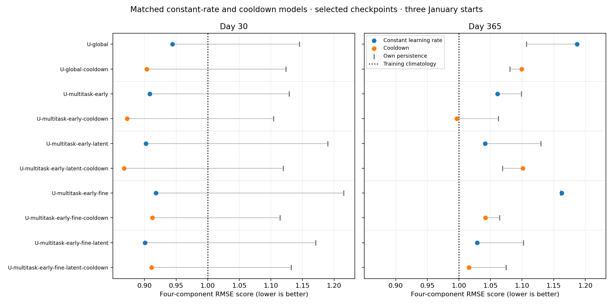
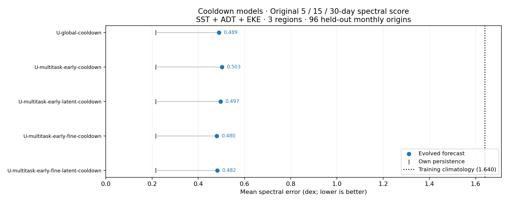
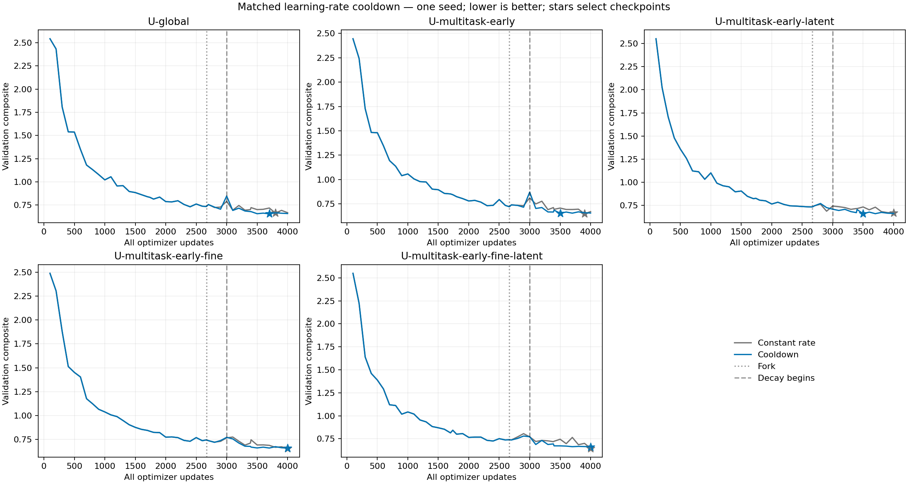
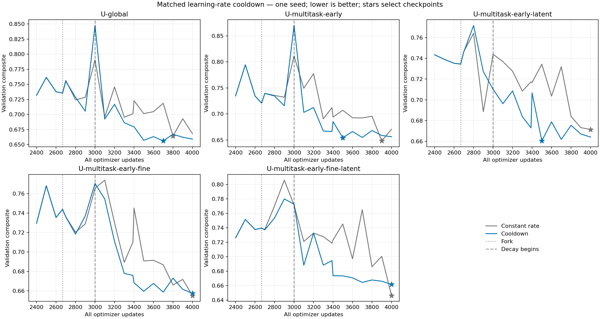

<!-- SPDX-FileCopyrightText: 2026 Samudra Authors -->
<!-- SPDX-License-Identifier: CC-BY-4.0 -->

# Matched learning-rate cooldown

**Cooldown did not consistently improve the observation composite.** The restarted
earlier-coarse-OM4 model with recurrent latent channels scored **2.6% lower**,
U-global was approximately unchanged, and the other three models scored
**1.2–2.8% higher**. All five evolved models still lose to their own initialized
persistence. The constant-rate fine-plus-latent model remains the lowest-error
validation-selected model across these two schedules.

All five runs completed 4,000 updates and their 96-origin held-out evaluations
on **October 8, 2026, by 13:30 ET**. This follow-up used **7.242 GPU-hours**,
including qualification; the original wave used 25.325 separately.

Contents: [Results](#results) · [Components and persistence](#components-and-persistence) ·
[Presentation comparison charts](#presentation-comparison-charts) ·
[Validation curves](#validation-curves) · [30-day maps](#30-day-maps) ·
[Protocol](#protocol) · [Verification](#verification).

The completed [continuous 365-day comparison](early-fine-annual-2026-10-08.md)
includes all ten checkpoints, three annual cases, lead curves and matched
day-365 maps. It is a separate fixed-checkpoint diagnostic covering both schedules.

## Results

Each row compares a validation-selected cooldown checkpoint with its own
constant-rate parent from the [original report](early-fine-wave-2026-10-07.md).
Lower is better. The test set never selects checkpoints. Every run ends with
2,000 observation updates; a selected checkpoint can precede that endpoint.

| Model | Selected total (obs) update | Validation | Parent test | Cooldown test | Change vs parent |
|---|---:|---:|---:|---:|---:|
| U-global-cooldown | 3700 (1745) | 0.6561 | 0.6784 | 0.6790 | +0.1% |
| U-multitask-early-cooldown | 3500 (1585) | 0.6544 | 0.6660 | 0.6742 | +1.2% |
| U-multitask-early-latent-cooldown | 3500 (1585) | 0.6604 | 0.6848 | 0.6670 | -2.6% |
| U-multitask-early-fine-cooldown | 4000 (2000) | 0.6575 | 0.6714 | 0.6802 | +1.3% |
| U-multitask-early-fine-latent-cooldown | 4000 (2000) | 0.6616 | 0.6609 | 0.6796 | +2.8% |

Within the cooldown wave, **U-multitask-early-cooldown wins on validation**;
U-multitask-early-latent-cooldown has the lowest test error. That test ordering
is descriptive, not a basis to change selection. The earlier coarse model with
latent channels improves mostly through lower integrated errors; its spectral
error changes little. Cooldown does not strengthen the evidence for fine
supervision: both fine arms worsen relative to their own parents, including
**0.6609 → 0.6796** for the previously strongest fine-plus-latent model.

**This is not a clean estimate of the learning-rate change alone.** The resumed
runs already differ from their parents at update 3,000, before decay starts:
validation differences are +0.0571 (U-global), +0.0585 (early), −0.0337
(early latent), +0.0050 (fine), and +0.0013 (fine latent). All four Torch arms
reproduce their fork validation score and first replayed loss exactly, but
first-step gradient norms differ by roughly 1e-7–2e-6. Their saved state,
task counters, learning rates and sampling rules pass the resume audits.
This is consistent with numerical divergence from nondeterministic production
CUDA operations; deterministic reference replay passed, but production was not
made deterministic. U-global also changes runtime/hardware at the fork.
[Prefix comparison evidence](artifacts/early-fine-cooldown-2026-10-08/final/replay-prefix.json).

The tables therefore describe **one restarted continuation per schedule**, not
an isolated causal effect of cooldown. There is one seed and one cooldown shape,
with checkpoint selection along each trajectory. A stronger causal follow-up
would pair restarted constant-rate and cooldown branches under a reproducible
production setup; no additional runs are included here.

## Components and persistence

The test composite is **½ mean integrated error ratio + ½ mean spectral error**.
The five integrated RMSEs are normalized by the same seasonal-climatology
errors; spectral error averages 27 region/lead/variable scores. Spectral **dex**
is the RMS difference in log10 power within a curve, not a signed power ratio.
Surface scores average day 5/15/30; OHC uses calendar-month means. These are
**96 independently initialized monthly forecasts in 2015–2022**, not a
continuous eight-year rollout. All evaluation uses the 1° observation grid.

| Model | Integrated ratio, parent → cooldown | Spectral dex, parent → cooldown | Cooldown composite | Own persistence composite |
|---|---:|---:|---:|---:|
| U-global-cooldown | 0.8871 → 0.8690 | 0.4696 → 0.4890 | 0.6790 | 0.5684 |
| U-multitask-early-cooldown | 0.8668 → 0.8455 | 0.4653 → 0.5029 | 0.6742 | 0.5606 |
| U-multitask-early-latent-cooldown | 0.8705 → 0.8370 | 0.4991 → 0.4970 | 0.6670 | 0.5650 |
| U-multitask-early-fine-cooldown | 0.8840 → 0.8800 | 0.4589 → 0.4803 | 0.6802 | 0.5658 |
| U-multitask-early-fine-latent-cooldown | 0.8673 → 0.8774 | 0.4545 → 0.4819 | 0.6796 | 0.5685 |

Integrated errors improve in four arms, but spectral errors worsen in four.
That tradeoff largely cancels the improvement for U-global and reverses it
for earlier coarse OM4 without latent channels. The fine-plus-latent arm
worsens both components.

Initialized persistence holds **each selected model's inferred initial ocean
state fixed**. Its composite improves versus its own constant-rate parent in
all five arms, through OHC, but evolution still gives a worse composite.
For example, U-multitask-early-cooldown evolves from a persistence integrated
ratio of **0.9057 to 0.8455**, while worsening spectral error from **0.2155 to
0.5029 dex**. This cooldown does not resolve the spatial-spectrum deficit.

| Model | SST RMSE (°C) | Geostrophic velocity RMSE (m/s) | EKE RMSE (m²/s²) | OHC 0–700 m RMSE (10⁸ J/m²) | OHC 700–2000 m RMSE (10⁸ J/m²) |
|---|---:|---:|---:|---:|---:|
| U-global-cooldown | 0.6318 | 0.11604 | 0.02546 | 7.203 | 4.037 |
| U-multitask-early-cooldown | 0.6085 | 0.11711 | 0.02565 | 6.435 | 3.998 |
| U-multitask-early-latent-cooldown | 0.6012 | 0.11660 | 0.02561 | 6.496 | 3.859 |
| U-multitask-early-fine-cooldown | 0.6340 | 0.11618 | 0.02549 | 7.369 | 4.150 |
| U-multitask-early-fine-latent-cooldown | 0.6429 | 0.11558 | 0.02545 | 7.381 | 4.079 |

Velocity and EKE are geostrophic diagnostics derived from SSH, not direct
verification of prognostic U/V. The spectral breakdown remains dominated by EKE:

| Model | SST spectral error (dex) | ADT spectral error (dex) | EKE spectral error (dex) |
|---|---:|---:|---:|
| U-global-cooldown | 0.2310 | 0.0788 | 1.1571 |
| U-multitask-early-cooldown | 0.2203 | 0.0892 | 1.1992 |
| U-multitask-early-latent-cooldown | 0.2329 | 0.0781 | 1.1799 |
| U-multitask-early-fine-cooldown | 0.2162 | 0.0802 | 1.1446 |
| U-multitask-early-fine-latent-cooldown | 0.2253 | 0.0726 | 1.1477 |

[All parent/cooldown metrics and both persistence controls](artifacts/early-fine-cooldown-2026-10-08/final/summary/scores.csv) ·
[Full lead/region/depth metrics and checkpoint provenance](artifacts/early-fine-cooldown-2026-10-08/final/source-results.json).

## Presentation comparison charts

The RMSE chart pairs **the five cooldown models with their five matching
constant-rate parents**; the spectral chart contains only the five cooldown
models. The cooldown checkpoints match across both diagrams. They use the definitions and controls in the
[17-model presentation comparison](presentation-annual-2026-10-08.md), whose
original charts contain only constant-rate runs. No models were retrained,
forecasts rerun, or checkpoints reselected for these figures.

Blue points show constant-rate models; orange points show their cooldown
counterparts on the next row. Each row retains that checkpoint's own initialized
persistence. Only the five matching parents are included, not the other models
from the broader presentation screen.

The RMSE score equally averages SST, SSH-derived geostrophic velocity, and
OHC at 0–700/700–2000 m, normalized by the same training-climatology errors
used in the original chart. Across the three January starts (2015/2018/2021),
MSE is pooled before taking each square root. OHC uses January/December monthly
means at the two plotted leads. Climatology is therefore exactly 1 by definition.

The spectral chart retains the original **27-term SST/ADT/EKE score at days
5/15/30 over 96 monthly origins**, not annual spectral errors. Power is averaged
over origins before computing RMS log10-power mismatch per curve; all 27 errors
are equally weighted. All five evolved cooldown models still lose to their own
initialized persistence on this score. The spectral climatology value is measured,
not normalized to 1.

[RMSE PDF](artifacts/presentation-cooldown-2026-10-08/rmse-comparison.pdf) ·
[Spectral PDF](artifacts/presentation-cooldown-2026-10-08/spectral-comparison.pdf) ·
[RMSE components and individual origins](artifacts/presentation-cooldown-2026-10-08/rmse-scores.csv) ·
[Spectral components](artifacts/presentation-cooldown-2026-10-08/spectral-scores.csv) ·
[Verified source/checkpoint hashes](artifacts/presentation-cooldown-2026-10-08/provenance.json).
Reproduce with `python -m scripts.plot_cooldown_comparisons --output OUTPUT`.
The restart/numerical-divergence caveat above still applies to comparisons with
constant-rate parents; these are not isolated causal estimates of LR decay.

## Validation curves

Each panel pairs the same model and seed under the two learning-rate schedules.
Dotted lines mark the update-2,667 fork; dashed lines mark the start of decay
at update 3,000. Stars indicate validation-selected checkpoints. The inherited
pre-fork history is shared. Selection remains on integrated-plus-spectral error.

Three cooled models select before update 4,000; both fine arms select the
endpoint. These curves do not establish general convergence or a universal
optimal stopping point. All five selected cooldown scores beat their recorded
pre-fork minima, including those whose update-2,400 weights were not retained;
missing old weights therefore do not change the selected result.

## 30-day maps

The fixed January/July 2022 cases match the original report. Each map shows
observations, the constant-rate parent, its cooldown version, and the cooled
model's own initialized persistence, with common valid-data support and color
scales. Anomalies subtract the training seasonal climatology; gray is unavailable
data. In the July fine-plus-latent SSH example, both evolving models damp the
observed spatial structure relative to persistence. The aggregate tables,
rather than these two examples, determine the reported comparison.

| Parent/cooldown pair | January anomalies | July anomalies | July absolute fields |
|---|---|---|---|
| U-global | [SST](artifacts/early-fine-cooldown-2026-10-08/final/maps/U-global/day30-2022-01-anomalies-sst.png) / [SSH](artifacts/early-fine-cooldown-2026-10-08/final/maps/U-global/day30-2022-01-anomalies-adt.png) | [SST](artifacts/early-fine-cooldown-2026-10-08/final/maps/U-global/day30-2022-07-anomalies-sst.png) / [SSH](artifacts/early-fine-cooldown-2026-10-08/final/maps/U-global/day30-2022-07-anomalies-adt.png) | [SST](artifacts/early-fine-cooldown-2026-10-08/final/maps/U-global/day30-2022-07-fields-sst.png) / [SSH](artifacts/early-fine-cooldown-2026-10-08/final/maps/U-global/day30-2022-07-fields-adt.png) |
| U-multitask-early | [SST](artifacts/early-fine-cooldown-2026-10-08/final/maps/U-multitask-early/day30-2022-01-anomalies-sst.png) / [SSH](artifacts/early-fine-cooldown-2026-10-08/final/maps/U-multitask-early/day30-2022-01-anomalies-adt.png) | [SST](artifacts/early-fine-cooldown-2026-10-08/final/maps/U-multitask-early/day30-2022-07-anomalies-sst.png) / [SSH](artifacts/early-fine-cooldown-2026-10-08/final/maps/U-multitask-early/day30-2022-07-anomalies-adt.png) | [SST](artifacts/early-fine-cooldown-2026-10-08/final/maps/U-multitask-early/day30-2022-07-fields-sst.png) / [SSH](artifacts/early-fine-cooldown-2026-10-08/final/maps/U-multitask-early/day30-2022-07-fields-adt.png) |
| U-multitask-early-latent | [SST](artifacts/early-fine-cooldown-2026-10-08/final/maps/U-multitask-early-latent/day30-2022-01-anomalies-sst.png) / [SSH](artifacts/early-fine-cooldown-2026-10-08/final/maps/U-multitask-early-latent/day30-2022-01-anomalies-adt.png) | [SST](artifacts/early-fine-cooldown-2026-10-08/final/maps/U-multitask-early-latent/day30-2022-07-anomalies-sst.png) / [SSH](artifacts/early-fine-cooldown-2026-10-08/final/maps/U-multitask-early-latent/day30-2022-07-anomalies-adt.png) | [SST](artifacts/early-fine-cooldown-2026-10-08/final/maps/U-multitask-early-latent/day30-2022-07-fields-sst.png) / [SSH](artifacts/early-fine-cooldown-2026-10-08/final/maps/U-multitask-early-latent/day30-2022-07-fields-adt.png) |
| U-multitask-early-fine | [SST](artifacts/early-fine-cooldown-2026-10-08/final/maps/U-multitask-early-fine/day30-2022-01-anomalies-sst.png) / [SSH](artifacts/early-fine-cooldown-2026-10-08/final/maps/U-multitask-early-fine/day30-2022-01-anomalies-adt.png) | [SST](artifacts/early-fine-cooldown-2026-10-08/final/maps/U-multitask-early-fine/day30-2022-07-anomalies-sst.png) / [SSH](artifacts/early-fine-cooldown-2026-10-08/final/maps/U-multitask-early-fine/day30-2022-07-anomalies-adt.png) | [SST](artifacts/early-fine-cooldown-2026-10-08/final/maps/U-multitask-early-fine/day30-2022-07-fields-sst.png) / [SSH](artifacts/early-fine-cooldown-2026-10-08/final/maps/U-multitask-early-fine/day30-2022-07-fields-adt.png) |
| U-multitask-early-fine-latent | [SST](artifacts/early-fine-cooldown-2026-10-08/final/maps/U-multitask-early-fine-latent/day30-2022-01-anomalies-sst.png) / [SSH](artifacts/early-fine-cooldown-2026-10-08/final/maps/U-multitask-early-fine-latent/day30-2022-01-anomalies-adt.png) | [SST](artifacts/early-fine-cooldown-2026-10-08/final/maps/U-multitask-early-fine-latent/day30-2022-07-anomalies-sst.png) / [SSH](artifacts/early-fine-cooldown-2026-10-08/final/maps/U-multitask-early-fine-latent/day30-2022-07-anomalies-adt.png) | [SST](artifacts/early-fine-cooldown-2026-10-08/final/maps/U-multitask-early-fine-latent/day30-2022-07-fields-sst.png) / [SSH](artifacts/early-fine-cooldown-2026-10-08/final/maps/U-multitask-early-fine-latent/day30-2022-07-fields-adt.png) |

## Protocol

- Fork each retained `joint-01000.pt`: **2,667 total updates**, including 1,000
  observation and 1,667 OM4 updates. Filenames count observation updates.
- Continue at `1e-4` through update 3,000. There is no retained checkpoint exactly
  at 3,000, so these 333 updates are replayed using the original task/sample schedule.
- For updates 3,001–4,000, linearly decrease **both task learning rates** from
  `1e-4` to `1e-6`. At update 3,500 the rate is `5.05e-5`.
- Preserve optimizer moments, CPU/CUDA/NumPy RNG state, counters and the existing
  task/sample sequence. The original checkpoints and reports stay intact.
- End at the same **4,000 updates: 2,000 OM4 and 2,000 observations**. The last
  1,000 updates contain 782 observation and 218 OM4 updates; this is not an
  observation-only finetune.
- Select on the same frozen integrated-plus-spectral observation validation
  composite. Reevaluate the fork checkpoint and select along its continuation;
  never import a later selected checkpoint from the original constant-rate run.
- Evaluate the selected models and their own initialized persistence on the same
  96 monthly origins in 2015–2022, with day-5/15/30 surface and monthly OHC metrics.

| Report model name | Original model/checkpoint | OM4 training | Recurrent extra channels |
|---|---|---|---:|
| U-global-cooldown | U-global at update 2,667 | 2,000 recent 1° updates | 0 |
| U-multitask-early-cooldown | U-multitask-early at update 2,667 | 1,000 recent + 1,000 earlier 1° | 0 |
| U-multitask-early-latent-cooldown | U-multitask-early-latent at update 2,667 | 1,000 recent + 1,000 earlier 1° | 10 |
| U-multitask-early-fine-cooldown | U-multitask-early-fine at update 2,667 | 1,000 recent 1° + 1,000 earlier ¼° | 0 |
| U-multitask-early-fine-latent-cooldown | U-multitask-early-fine-latent at update 2,667 | 1,000 recent 1° + 1,000 earlier ¼° | 10 |

Architecture, input fields, losses, normalization and parameter counts are
unchanged; see the original report's methods. Each directory retains its original
model name inside the separate cooldown root; result tables add `-cooldown`.
Compare each cooldown against its own constant-rate parent before interpreting
differences between data/architecture arms. One seed cannot establish significance.

U-global moves from Beta to Torch at the fork. Its model/optimizer state and
observation data fingerprints are checked exactly, but cross-hardware numerical
variation remains a caveat when attributing its difference entirely to cooldown.
The four other arms stay on the same Torch runtime. Production CUDA numerical
flags are unchanged; deterministic flags are confined to qualification replay.

## Verification

Training producer: `4a1cd7a9bfb60d53b990b331fa0232c91aab5bb8`.
Root: `torch:/scratch/jr7309/runs/2026-10-08-early-fine-cooldown`.
All five qualifications (**19437767**) passed fit, exact prepared-data/coverage,
bitwise deterministic reference replay and throughput gates. CPU migration
**19437769** exactly preserved all non-manifest checkpoint state. Production
array **19437770** completed at 4,000 total / 2,000 observation updates in every
arm, using only migrated source weights. **48 targeted training tests passed**.

The result collector verifies every training/evaluation completion marker,
selected checkpoint hash, 96-origin cohort, full update history, finite training
losses/gradients, task exposures, and every executed post-fork learning rate.
The final rate is `1e-6` for all arms. Cross-runtime seasonal-control roundoff
uses the original explicit relative tolerance `1e-6`; raw metrics are unchanged.
The five integrated normalization values agree exactly across all ten models.
Map references, grids and climatology agree exactly across saved bundles.

The follow-up's **7.242 GPU-hours** comprise **0.789 qualification + 6.453
production/evaluation**, with no failed GPU attempts. Including the original
wave's 25.325 yields **32.567 GPU-hours**; the older external U-global training
is not included in that sum. CPU report extraction and callback helpers use no
GPUs; failed CPU attempts remain recorded in the accounting artifact.
The HTTPS callback helpers failed on Torch's blocked egress, but both saved
events were delivered by the SSH relay. No training recovery was needed.

[Accounting](artifacts/early-fine-cooldown-2026-10-08/final/accounting.json) ·
[Source checkpoint hashes](artifacts/early-fine-cooldown-2026-10-08/cooldown-sources.json) ·
[Exact qualification/migration audits](artifacts/early-fine-cooldown-2026-10-08/qualified-migrated.json).

Reproduction: [verified collector](../../../scripts/collect_early_fine_results.py),
[metric summary](../../../scripts/summarize_extent_results.py),
[matched curves/maps](../../../scripts/plot_early_fine_cooldown.py).
