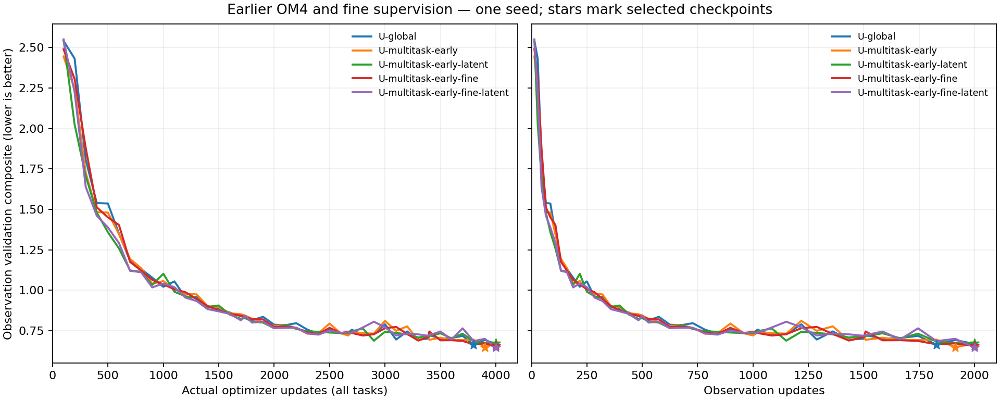
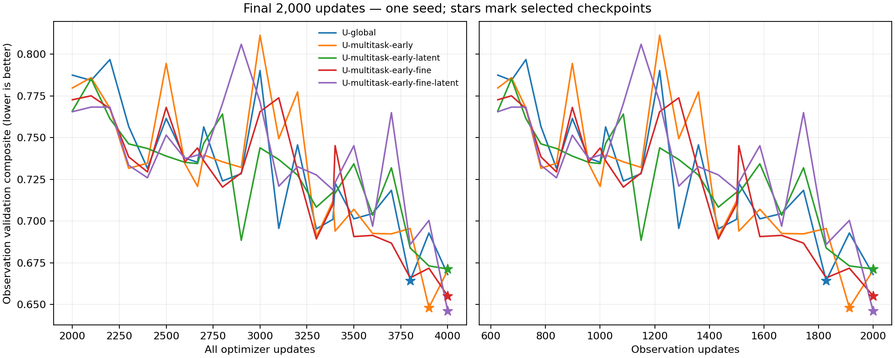

<!-- SPDX-FileCopyrightText: 2026 Samudra Authors -->
<!-- SPDX-License-Identifier: CC-BY-4.0 -->

# Earlier OM4, fine encoder/decoder, and recurrent memory

This four-arm wave tests whether
broader temporal coverage helps observation forecasts, whether learning from
fine-resolution examples improves transfer, and whether fine supervision makes
recurrent latent state more useful. No LLC data enter this wave.

**Completed October 8, 2026:** all four models trained for 4,000 updates and
completed the same 96-origin held-out evaluation. The last allocation finished
at **09:18 ET**. Total allocated GPU time, including every failed attempt and
qualification/profile run, was **25.325 GPU-hours**. No further runs are queued
for this wave. The [matched cooldown follow-up](early-fine-cooldown-2026-10-08.md)
is complete: results are mixed, with measurable pre-decay replay divergence;
see that report for the matched curves, maps and limitations.

Contents: [Results](#results) · [Metric components](#metric-components) ·
[Validation curves](#validation-curves) · [30-day maps](#30-day-maps) ·
[Runs and schedule](#runs-and-matched-exposure) ·
[Architecture and loss](#fine-task-architecture-and-loss) ·
[Selection](#selection-and-diagnostics) ·
[Verification and reproduction](#verification-and-reproduction).

## Results

**Broader historical coverage gives a small gain; this wave does not establish
that fine supervision is better than coarse supervision.** Replacing half of
U-global's recent-OM4 updates with earlier 1° examples improves the test
composite by **1.8%**, without adding optimizer updates. Fine supervision with
10 recurrent latent channels has the lowest validation and test error in this
wave, **2.6% below U-global**, but only **0.8% below earlier coarse OM4 alone**.

Lower is better throughout. Each row uses its own validation-selected checkpoint,
not necessarily the final checkpoint. Test metrics did not select checkpoints.

| Model | Selected update (obs updates) | Validation | Test composite | Change vs U-global | Integrated ratio | Spectral dex | Own persistence composite |
|---|---:|---:|---:|---:|---:|---:|---:|
| U-global | 3800 (1828) | 0.6643 | 0.6784 | +0.0% | 0.8871 | 0.4696 | 0.5886 |
| U-multitask-early | 3900 (1913) | 0.6482 | 0.6660 | -1.8% | 0.8668 | 0.4653 | 0.5753 |
| U-multitask-early-latent | 4000 (2000) | 0.6713 | 0.6848 | +1.0% | 0.8705 | 0.4991 | 0.5896 |
| U-multitask-early-fine | 4000 (2000) | 0.6552 | 0.6714 | -1.0% | 0.8840 | 0.4589 | 0.6018 |
| U-multitask-early-fine-latent | 4000 (2000) | 0.6461 | 0.6609 | -2.6% | 0.8673 | 0.4545 | 0.5816 |

Within the four-arm comparison, using fine instead of coarse earlier examples
**worsens error by 0.8% without latent channels**, but **improves it by 3.5% with
latent channels**. Adding latent channels hurts the coarse arm by 2.8% and helps
the fine arm by 1.6%. This interaction is consistent with fine supervision making
extra recurrent state useful, but does not show what those channels encode or
prove a repeatable benefit. There is only one seed, and three selected checkpoints
are at the 4,000-update limit. The curves do not establish convergence.

**Every evolved model still loses to its own initialized persistence.** Evolution
improves the mean integrated error ratio, while worsening the spatial spectra.
For example, U-multitask-early-fine-latent changes integrated error from **0.9478
to 0.8673**, but spectral error from **0.2155 to 0.4545 dex**. The resulting
composite worsens from **0.5816 to 0.6609**. The added fine task has not solved the
existing loss of spatial variability.

This is a comparison at a fixed number of mixed-task updates, not a FLOP-matched
comparison or a measurement of pretraining value from D. All four models start
fresh. U-global is the prior external control on Beta; the four new arms share
the Torch runtime. Cross-host numerical/runtime differences and differences
between the 1° and ¼° preprocessing releases remain caveats. No claim of
statistical significance or century-scale stability follows from these results.

## Metric components

The composite is half the mean of five integrated error ratios relative to
seasonal climatology and half the mean of 27 spectral errors. The integrated
components below average surface errors over day 5/15/30; OHC uses calendar-month
means. These are **96 separately initialized monthly forecasts in 2015–2022**,
not an eight-year continuous rollout. All evaluated forecasts use the 1°
observation grid, including models trained with a fine decoder.

| Model | SST RMSE (°C) | Geostrophic velocity RMSE (m/s) | EKE RMSE (m²/s²) | OHC 0–700 m RMSE (10⁸ J/m²) | OHC 700–2000 m RMSE (10⁸ J/m²) |
|---|---:|---:|---:|---:|---:|
| U-global | 0.6252 | 0.11558 | 0.02535 | 7.002 | 4.522 |
| U-multitask-early | 0.6410 | 0.11630 | 0.02546 | 6.964 | 4.061 |
| U-multitask-early-latent | 0.6311 | 0.11537 | 0.02553 | 7.411 | 3.981 |
| U-multitask-early-fine | 0.6312 | 0.11555 | 0.02537 | 7.439 | 4.236 |
| U-multitask-early-fine-latent | 0.6324 | 0.11474 | 0.02530 | 7.093 | 4.108 |

The gain over U-global is largely in **700–2000 m heat content**, with smaller
spectral improvements; none of the new arms improves SST RMSE. Earlier coarse
OM4 reduces deep OHC error by about 10.2%; fine plus latent reduces it by 9.2%.
The latter's velocity and EKE RMSE improvements are only about 0.7% and 0.2%.
Observational velocity and EKE are derived from SSH, not direct validation of
the model's prognostic U/V channels.

| Model | SST spectral error (dex) | ADT spectral error (dex) | EKE spectral error (dex) |
|---|---:|---:|---:|
| U-global | 0.2130 | 0.0746 | 1.1211 |
| U-multitask-early | 0.1920 | 0.0744 | 1.1294 |
| U-multitask-early-latent | 0.2145 | 0.0892 | 1.1936 |
| U-multitask-early-fine | 0.2054 | 0.0801 | 1.0911 |
| U-multitask-early-fine-latent | 0.2099 | 0.0610 | 1.0926 |

Spectral error is the root-mean-square log10 power mismatch within each
region/lead, averaged across those cases: **dex** is a base-10
logarithmic unit, so a 1-dex mismatch means a factor of ten in power at a scored
bin. These averages span three regions and three leads; they are not a single
signed power ratio. EKE spectra remain the largest mismatch.

[All forecast and persistence components, including anomaly persistence](artifacts/early-fine-2026-10-07/final/summary/scores.csv) ·
[Full lead/region/depth metrics and selected checkpoint hashes](artifacts/early-fine-2026-10-07/final/source-results.json).

## Validation curves

The main comparison uses the same frozen integrated-plus-spectral validation
criterion throughout. The second axis shows observation exposure directly: all
arms end with 2,000 observation updates, although their selected checkpoints
can have fewer. Fine runs are not being compared at fewer downstream updates.

The later view shows how small the separation is relative to checkpoint-to-
checkpoint variation. U-multitask-early selects update 3,900; the other three new
arms select update 4,000. These endpoint selections leave the effect of longer
training unresolved.

## 30-day maps

These use the same fixed January/July 2022 cases as the earlier reports, at the
last five-day bin of a 30-day forecast. All rows share observations, valid-data
support and color scales. Anomalies subtract training seasonal climatology.
The maps compare all five evolved models plus initialized persistence for
U-global and U-multitask-early-fine-latent. The latter two controls hold their
own inferred initial state fixed; missing initial surface observations can make
their surface fields differ as well as their interiors. Gray means land or
unavailable observations.

The evolved fields look broadly similar; these examples do not demonstrate a
clear recovery of the observed fine structure. They illustrate the forecasts,
while the aggregate metric tables above determine the reported comparison.

| Case | SST | ADT / SSH |
|---|---|---|
| January 2022 anomalies | [Map](artifacts/early-fine-2026-10-07/final/maps/day30-2022-01-anomalies-sst.png) | [Map](artifacts/early-fine-2026-10-07/final/maps/day30-2022-01-anomalies-adt.png) |
| July 2022 anomalies | [Map](artifacts/early-fine-2026-10-07/final/maps/day30-2022-07-anomalies-sst.png) | [Map](artifacts/early-fine-2026-10-07/final/maps/day30-2022-07-anomalies-adt.png) |
| July 2022 absolute fields | [Map](artifacts/early-fine-2026-10-07/final/maps/day30-2022-07-fields-sst.png) | [Map](artifacts/early-fine-2026-10-07/final/maps/day30-2022-07-fields-adt.png) |

## Runs and matched exposure

| Literal model name | Recent OM4 1° updates | Earlier OM4 updates | Observation updates | Extra recurrent channels |
|---|---:|---|---:|---:|
| U-multitask-early | 1,000 | 1,000 at 1° | 2,000 | 0 |
| U-multitask-early-latent | 1,000 | 1,000 at 1° | 2,000 | 10 |
| U-multitask-early-fine | 1,000 | 1,000 at ¼° | 2,000 | 0 |
| U-multitask-early-fine-latent | 1,000 | 1,000 at ¼° | 2,000 | 10 |

The external control is [U-global](extent-review-2026-10-05.md), which uses 2,000
recent OM4 updates and 2,000 observation updates. All new arms retain its U-Net
widths 128/192/256/384, seed 1729, AdamW LR 1e-4, weight decay 0.01, clipping 1,
eight accumulated examples, InstanceNorm, input task adapters, and no warmup.
They start fresh; fitting/probe weights are never loaded into production.
The same progressive mixed schedule gives 218/407/593/782 observation updates
in successive 1,000-slot blocks. The last 1,000 updates are therefore 78.2%
observational; there is no separate observation-only final phase. Alternating
OM4 slots select recent then early examples. Their dates are paired across the four new arms by deterministic seed.
This matches updates, not FLOPs. The prior U-global ran on Beta; hardware/runtime
are not exactly matched, as recorded above.

Recent training remains 1975-01-03 through 2013-10-04. Earlier windows draw from
1,241 five-day frames in 1958–1974: 1,217 possible starts with all 25 frames
strictly before 1975. Each example has 19 history frames and six forecast steps.
No documented scientific reason for the inherited 1975 cutoff has yet been
established; early-period spin-up/distribution differences remain an interpretation
caveat. One-degree and quarter-degree stores are different preprocessing releases,
although complete time vectors match. We do not attribute effects solely to
resolution without acknowledging this difference.

## Fine-task architecture and loss

| Literal model name | Initializer + processor + task modules, parameters | Meaning |
|---|---:|---|
| U-global | 62,967,680 (~63.0M) | Prior fresh U-Net control: recent global 1° OM4 and observations |
| U-multitask-early | 62,967,680 (~63.0M) | Replace half the OM4 updates with earlier global 1° data |
| U-multitask-early-latent | 63,364,930 (~63.4M) | Earlier coarse model with 10 extra initialized and recurrent state channels on every task |
| U-multitask-early-fine | 63,149,162 (~63.1M) | Earlier ¼° input/output with a fine-specific encoder and decoder around the shared coarse processor |
| U-multitask-early-fine-latent | 63,552,832 (~63.6M) | Fine input/output plus the 10 recurrent channels on every task |

“Own persistence” and a model name followed by “initialized persistence” mean
holding that selected model's inferred initial state fixed for all leads,
without the evolution processor. “Initialized anomaly persistence” holds its
initial anomaly relative to training seasonal climatology, then adds the target
season's climatology. These are controls, not separately fitted networks.

The processor always operates globally on 180×360 cells. Fine examples supply
720×1440 histories of SST, SSH, forcing and validity. Their original 77 state
channels are U/V/T/S at 19 depths plus SSH. The optional 10 channels are unscaled
learned state, initialized and autoregressed on **every** task.

The fine-specific encoder consists of two stride-2, 3×3 convolutions with 32
features and GELU, followed by a pointwise projection to two coarse states. It
predicts a correction to the shared initializer's coarse-history estimate;
available coarse SST/SSH copying remains intact. No true full-depth states enter
initialization. All shared weights start identically between fine and coarse
arms with the same latent count; extra modules use isolated RNG state.

After each shared processor step, the fine decoder reads all predicted state
channels plus geography/season. A 3×3 convolution to 64 features, GELU and
pointwise projection to 77×16 channels followed by pixel shuffle produce a
fourfold upsampled residual over bilinearly interpolated coarse physical fields.
Longitude convolution and reference interpolation are periodic; latitude convolution padding is zero. Decoded fields
are masked at native depths. The recurrent path carries the **coarse predicted
state, including latent channels**; it never re-encodes true future fields.
Fine I/O modules are inactive on recent-OM4 and observation tasks.

Fine-task forecast loss is 0.5 × group-balanced native-field MSE plus
0.5 × group-balanced coarse-physical-state MSE, averaged over six leads. Coarse
targets are exact wet-area overlap means of the native fields using actual
spherical cell bounds, not assumed 4×4 nesting. The equal split retains the
physical interpretation of the shared state while supervising native outputs.
Initializer reconstruction uses the same 50/50 fine/coarse split, coefficient
0.1, excluding copied surface channels. Hidden-surface completion has coefficient
0.1 and is scored on decoded native initial surfaces. The encoder sees only
surface/forcing histories; full states are targets only.

Coarse early examples use the unchanged OM4 forecast/reconstruction/completion
objective. Physical normalization remains observation-training-derived; OM4
forcing normalization remains the existing 1° statistics. There is no new
per-cell physical normalization or spectral training loss.

## Selection and diagnostics

Selection remains the frozen U-global integrated-plus-spatial-spectral observation
validation metric, every 100 total updates plus observation milestones. The
reference SHA256 is `c94c0601e168858e4ba41423aed74d8604eaa1efbc68dd76370b32b8eeacd26c`.
The results above include the selected forecast, its own initialized
persistence, all component metrics, and validation curves versus total and
observation updates. Held-out evaluation uses the same 96 monthly origins in
2015–2022, not one continuous eight-year rollout.

## Verification and reproduction

Production array **19426012_[0-3]** completed with exit code 0 in every arm.
All 4,000 logged optimizer steps per arm are present exactly once with finite
losses and gradient norms. Completion counts are 1,000 recent OM4, 1,000 earlier
OM4 and 2,000 observation updates. Actual selected-checkpoint SHA256 hashes
agree with training completion, selection, evaluation-input and evaluation
completion records. Every evaluation contains all 96 held-out origins.

All new arms and U-global use observation-manifest SHA256
`d6e6672ca11aec3491a4fc896d9e99d528075a889cc0e6187b580ef8a52500f3` and the same
frozen validation reference. Held-out integrated climatology denominators are
**exactly identical**. Full climatology payloads differ slightly across Beta and
Torch (FFT roundoff and unscored thermohaline diagnostics); the maximum relative
numeric difference is 8.66×10⁻⁸. Reporting allows 10⁻⁶ relative tolerance for
that cross-runtime control check, retains both raw payloads, and uses the original
U-global denominators for every row. This reporting tolerance does not change
training, validation selection, checkpoint qualification or resume tests.
The fixed map observations, climatology, grid and mask agree bitwise with the
previous report. [Control difference audit](artifacts/early-fine-2026-10-07/final/control-roundoff.json).

The final training producer is
`8c9a7403edbcd3a37fe09c3af687cbb99a62be85`; its exact-state copy audit resumed
updates 1,800 / 1,836 / 758 / 746 from the original production checkpoints.
No diagnostic weights were promoted. The [recovery records](artifacts/early-fine-2026-10-07/) retain
previous producers, failures and qualification evidence. CPU-only report
job **19431987** verified hashes and extracted existing saved maps; it performed
no new model inference or training.

| Model | Final production allocation | Elapsed | Outcome |
|---|---|---:|---|
| U-multitask-early | 19426012_0 | 1h 50m 46s | 4k updates + held-out evaluation complete |
| U-multitask-early-latent | 19426012_1 | 1h 51m 20s | 4k updates + held-out evaluation complete |
| U-multitask-early-fine | 19426012_2 | 3h 17m 49s | 4k updates + held-out evaluation complete |
| U-multitask-early-fine-latent | 19426012_3 | 3h 21m 36s | 4k updates + held-out evaluation complete |

These are resumed allocation times, not from-scratch training runtimes. This
production used **10.3586 GPU-hours**; prior production, qualifications and
recovery diagnostics used **14.9664**, for **25.325 total**. Canceled jobs that
never started and CPU-only jobs add zero GPU-hours.
[Full attempt accounting and handled callback](artifacts/early-fine-2026-10-07/final/accounting.json) ·
[Logged model sizes](artifacts/early-fine-2026-10-07/final/model-details.json) ·
[Summary inputs and hashes](artifacts/early-fine-2026-10-07/final/summary/summary-provenance.json).

Data on Torch were `/scratch/jr7309/data/om4_onedeg_v3`,
`/scratch/jr7309/data/om4_quarterdeg_v2`, and the verified observation view under
`/scratch/jr7309/runs/2026-10-08-early-fine-rtx/recovery-grid-bounds/observations`.
The paths and manifests in the [raw bundle](artifacts/early-fine-2026-10-07/final/source-results.json) are the
executed sources; LLC was not used. The fine dataset here is the Torch
quarter-degree v2 store, not an assumption that it is the same release as the
prior Beta regional-patch experiments.

Reproduction uses [the checkpoint/exposure collector](../../../scripts/collect_early_fine_results.py),
[the shared summary script](../../../scripts/summarize_extent_results.py) with
`--control-rtol 1e-6`, and [the map/late-curve script](../../../scripts/plot_early_fine_report.py).
Raw result bundles, score/curve CSVs, merged fixed-case fields and figure
provenance are included beside this report. This update changes reporting code
only; the training producer remains pinned above.
