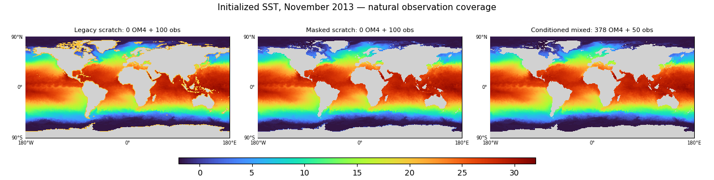
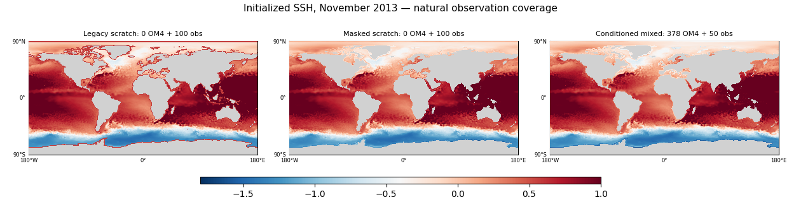
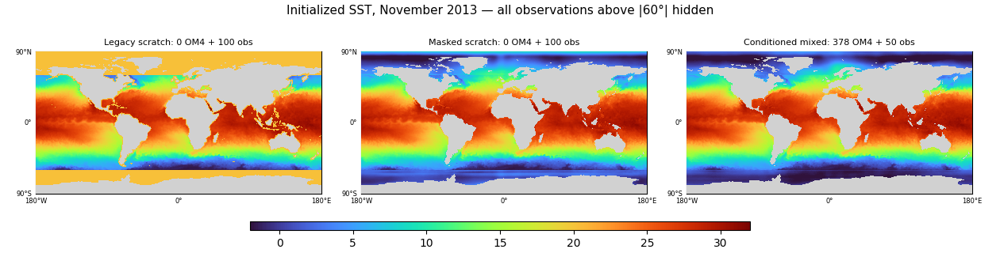
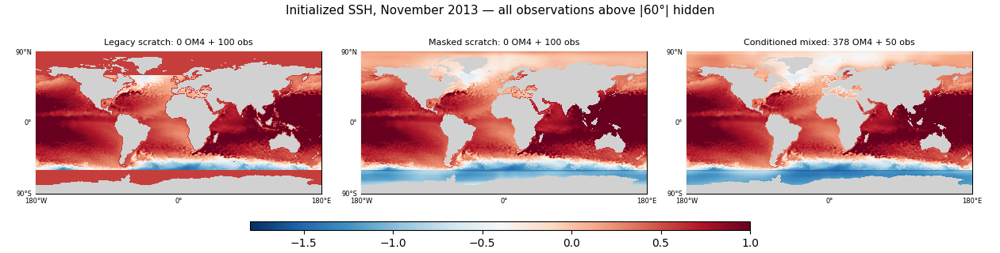
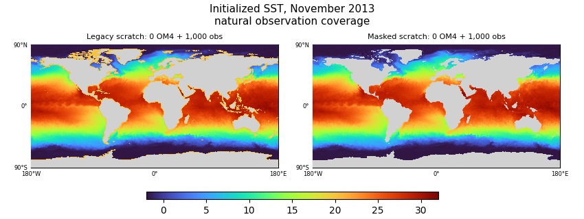
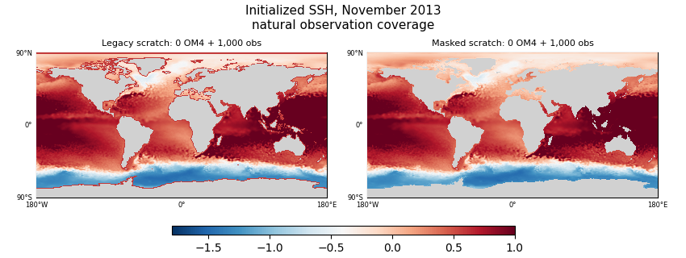
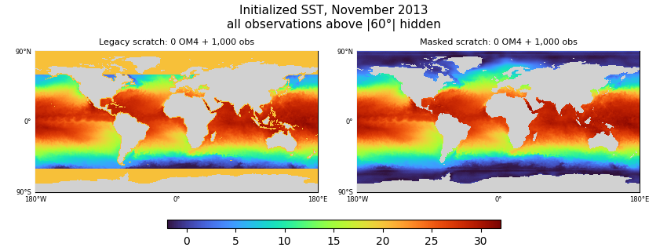
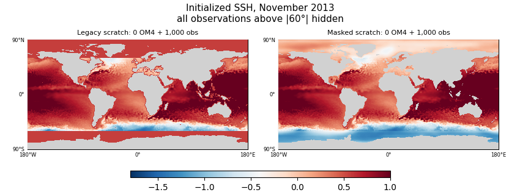

<!-- SPDX-FileCopyrightText: 2026 Samudra Authors -->
<!-- SPDX-License-Identifier: CC-BY-4.0 -->

# Early missingness-learning diagnostics

The corrected initializer learns to fill artificially hidden observations within
100 observation updates. Its initial SST map no longer has the legacy warm polar
speckles. This is an early initialization result, **not a forecast comparison or
proof of accuracy where observations are naturally missing**. Monthly observation
climatology still outperforms all these early checkpoints on held-out known cells.

## Methods and model names

All models use the smaller D processor, InstanceNorm, seed 1729, and the training
protocol in [the wave plan](missingness-wave-2026-09-28.md). These diagnostics do
not select checkpoints or change the ongoing training protocol.

- **Legacy scratch:** random initialization, observation training, and the old
  unconditional surface copy, which copies the filler into missing locations.
- **Masked scratch:** random initialization, observation training, invalid inputs
  zeroed with explicit validity channels, copying only genuinely observed cells,
  and the masked surface-completion auxiliary loss.
- **Conditioned mixed:** the `conditioned-mixed-finish` arm at early checkpoints,
  before its observation-only finish. It uses the corrected missingness handling
  and separate OM4/observation input adapters, with shared initializer/processor
  backbones. Its additional OM4 exposure is explicitly reported below.
- **Monthly climatology:** the prepared observation-training spatial climatology
  for the calendar month of each target frame. It uses no validation target data.
- **Normalized zero:** the training normalization mean of each surface channel.

For each of nine validation origins, hide structured blocks or all surface
observations poleward of 60° throughout the 19-frame input history. Initialize
from the remaining inputs and score the last two initialized frames only where a
real observation was artificially hidden. SST is °C and SSH is meters. Pool squared
errors across origins and frames using latitude-area weights, then take the square
root. Naturally missing locations have no invented reference and are not scored.
Observed surface values remain exactly unchanged. Natural-coverage maps below are
from November 2013; they are illustrative, not another metric aggregation.

## Early scores

| Model | OM4 / obs updates | Block SST RMSE | Block SSH RMSE | Hidden polar SST RMSE | Hidden polar SSH RMSE |
| --- | ---: | ---: | ---: | ---: | ---: |
| Legacy scratch | 0 / 100 | 9.531 | 0.649 | 20.580 | 1.408 |
| Masked scratch | 0 / 50 | 1.797 | 0.131 | 3.108 | 0.253 |
| Masked scratch | 0 / 100 | 1.259 | 0.115 | 3.186 | 0.194 |
| Conditioned mixed | 82 / 10 | 1.620 | 0.169 | 2.221 | 0.240 |
| Conditioned mixed | 378 / 50 | 1.437 | 0.108 | 1.783 | 0.122 |
| Monthly climatology | — | 0.821 | 0.076 | 0.545 | 0.039 |
| Normalized zero | — | 9.531 | 0.649 | 20.580 | 1.408 |

Legacy scratch equals the zero-fill control by construction in this artificial
hiding test. The improvement demonstrates that the corrected model can learn
completion; it does not isolate the effect of validity channels from the copy
rule, corruption training, and auxiliary loss. The mixed arm has more total
updates than scratch, so these rows do not establish compute-matched transfer
benefit or a conditioning benefit. Polar SST is not monotonically improving yet.

## Initial surface maps

Next checks are completion accuracy and map structure at later immutable
checkpoints, followed by the already scheduled integrated-plus-spectral forecast
comparison. Good-looking filled surfaces alone are insufficient.

## Update: 250–1,000 observation steps

The same audit at later immutable checkpoints shows further learned completion.
These are matched observation counts, both with zero OM4 exposure. Model names,
validation origins, hiding patterns, pooled errors and units are unchanged.

| Model | Obs updates | Block SST RMSE | Block SSH RMSE | Hidden polar SST RMSE | Hidden polar SSH RMSE |
| --- | ---: | ---: | ---: | ---: | ---: |
| Legacy scratch | 250, 500 or 1,000 | 9.531 | 0.649 | 20.580 | 1.408 |
| Masked scratch | 250 | 1.001 | 0.099 | 1.942 | 0.133 |
| Masked scratch | 500 | 0.725 | 0.094 | 1.327 | 0.112 |
| Masked scratch | 1,000 | 0.718 | 0.080 | 1.271 | 0.113 |
| Monthly climatology | — | 0.821 | 0.076 | 0.545 | 0.039 |

By 500 updates, block-hidden SST improves over climatology. SSH and the more
severe entirely hidden polar caps still favor climatology. This is evidence
against an inability to learn missingness/completion, but does not establish
accurate extrapolation to naturally unobserved regions or improved forecasts.

The warm SST speckles and constant-fill SSH boundaries disappear, but **cold
overshoot remains**. In this November case, the 3,598 naturally missing wet SST
cells range from −3.981°C to 30.914°C in masked scratch; 302 fall below the map's
−2°C lower color limit. Their 1st percentile is −3.189°C. These cells have no
observational target in this audit. The legacy filler is 20.113°C at every one of
these cells. No output clipping or physical constraint was applied. Cleaner map
structure therefore is not a complete physical-sanity result.

Validation-only jobs 18743672/18743674 completed with matching audit signatures.
Their transferred bundle matched SHA256
`a4c5ce265b9803dc12475d6cea8394f4f9222ad3f61f68e5eacc792faf9e4766`.
The adjacent `mid-completion-summary.json.gz` records pooled scores and input
hashes. Training continues to the original update budgets; no new selection rule
or scientific arm was introduced.

## Provenance

Validation-only jobs 18731002, 18731003, and 18731004 completed successfully with
matching input/completion signatures. Training producer is
`053e34947932fdb56c6baf2c717a23f2df3cc733`; evaluation producer is
`9999caf5937a8d0983dc0b6b6883011dc6a1a450`. Each audit records the checkpoint SHA
and exact OM4/observation update counts. The compact copied bundle matched its
remote SHA256 `e7886eea12baa5eed5ae17f0e90c7ff8821044081f8335c5b32e836d5e027e2c`.
The renderer is `scripts/plot_observation_completion.py`; machine-readable pooled
scores and input hashes are in the adjacent `early-completion-summary.json.gz`.
