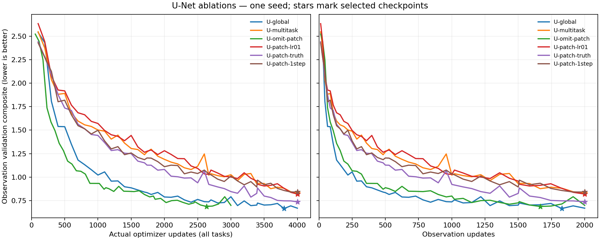
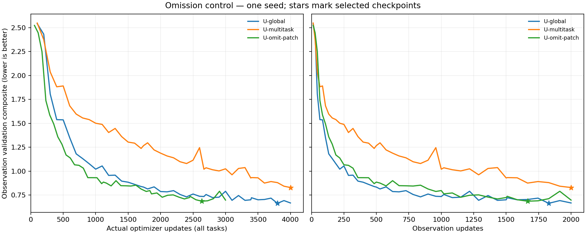

<!-- SPDX-FileCopyrightText: 2026 Samudra Authors -->
<!-- SPDX-License-Identifier: CC-BY-4.0 -->

# Native-patch transfer: cause-isolation follow-up

**Completed October 4 at 1:49 a.m. ET.** All four arms finished their planned
budgets and all 96 held-out monthly forecasts. The native task hurt relative to
omitting it. Giving native evolution true initial physical states removed much
of that penalty, but did not beat omission or additional global OM4 training.
A tenfold smaller patch learning rate and a one-step patch horizon did not
produce a material improvement over the original multitask model.

Authorized October 3, with autonomous iteration through Monday October 5 around
9 a.m. ET. One seed and one four-GPU beta production allocation for this wave.
It follows the [completed screen](extent-wave-2026-10-02.md). The
[accessory/capacity wave](extent-representation-2026-10-03.md) has now started.

## Completed comparison

Every checkpoint is selected using the unchanged integrated-plus-spectral
observation validation composite. Test reporting uses common test-climatology
denominators, verified identical across all arms. These are 96 independent
monthly 30-day forecasts, not an eight-year continuous rollout.

| Model | Actual training updates | Selected actual update | Validation | Test composite ↓ | Integrated ratio | Spectral dex | Own initialized persistence |
|---|---:|---:|---:|---:|---:|---:|---:|
| U-global, original | 4,000 | 3,800 | 0.6643 | 0.6784 | 0.8871 | 0.4696 | 0.5886 |
| U-omit-patch | 3,000 | 2,633 | 0.6866 | 0.7074 | 0.9146 | 0.5003 | 0.5842 |
| U-patch-truth | 4,000 | 4,000 | 0.7356 | 0.7278 | 0.9039 | 0.5517 | 0.5757 |
| U-patch-lr01 | 4,000 | 4,000 | 0.8188 | 0.8115 | 0.9243 | 0.6987 | 0.6176 |
| U-multitask, original | 4,000 | 4,000 | 0.8293 | 0.8130 | 0.9167 | 0.7093 | 0.6026 |
| U-patch-1step | 4,000 | 4,000 | 0.8404 | 0.8244 | 0.9513 | 0.6975 | 0.6137 |

The literal model names are defined below; U-global and U-multitask are the
original global-only and native-multitask U-Net controls defined in the first
report. All learned observation forecasts still lose to their own initialized
persistence on the composite. Checkpoint selection at the final update in the
three patch variants also means this screen does not establish convergence.

Omission improves the test composite by **13.0%** over original multitasking.
The true-state patch arm improves it by **10.5%**, but remains **2.9% worse than
omission** and **7.3% worse than global-only training**. This implicates the
regional initialization problem or its gradients as an important part of the
negative transfer. It does not separate better regional initial states from
removing native-task gradients and reconstruction/completion losses from the
shared initializer. The smaller-LR change is only 0.2% better on test, while the
one-step change is 1.4% worse; neither establishes a useful gain with one seed.
The smaller LR still lets the full native gradient affect shared Adam moments.

[All scores](artifacts/extent-ablations-2026-10-03/summary/scores.csv),
[validation curves](artifacts/extent-ablations-2026-10-03/summary/validation-curves.csv),
and [raw metrics and verified lineage](artifacts/extent-ablations-2026-10-03/source-results.json).
The plots separately show actual optimizer work and observation exposure; neither
axis is FLOP matching. Omitted slots do not count as optimizer updates.

## Completed execution

Training producer stayed `c9a33e0dba63b6da0d11b7d20c1db7e42d78e0e5`.
Job **209574** completed with exit 0 after 26,750 seconds on four GPUs:
**29.72 allocated GPU-hours**, or **30.85** including fitting, resume probes and
the gradient diagnostic. There were no production retries or protocol changes.
Every selected checkpoint hash was checked against the physical checkpoint,
training marker, selection metadata and completed evaluation fingerprint.

| Arm | Training completed, ET | Selected checkpoint SHA-256 |
|---|---|---|
| U-omit-patch | October 3, 11:12:34 p.m. | `a3dac2c96aadd72d16dead0d2dc204f7e3b5401ab610d8a2b6e8c9172f99b05b` |
| U-patch-lr01 | October 4, 1:46:19 a.m. | `ba0dc6540a5c63810f9eb49523bfeb863ac39fd32673d7faab331bbe12ec55af` |
| U-patch-truth | October 4, 1:46:20 a.m. | `246f278137af98977f494a3c67a41ff11e7b4c3595b54b21725c03f0d348de02` |
| U-patch-1step | October 4, 1:46:19 a.m. | `198101849c4141fc8baee1360acc74eedfa46ab3c532a2004c3d22e39bfd7472` |

The following plan and progress entries preserve the sequence of decisions and
intermediate evidence. Their running/pending statements describe those times.

## Fixed setup and precise interventions

All runs start from the same random seed 1729 and U-Net weights as the original
U arms. Data, normalization, geometry inputs, architecture, batch accumulation,
observation losses, checkpoint-selection metric and held-out cohort stay fixed.
The original mixed schedule has 4,000 slots: 1,000 global OM4, 1,000 auxiliary
native-patch OM4 and 2,000 global observation slots. Global data are 180×360;
native quarter-degree patches are 128×128 with a central 64×64 scored core.
Global tasks always retain six five-day forecast steps. All task samples use
the original count-derived seeds, including the retained original global slots.

| Literal name | Auxiliary patch-slot behavior | Actual optimizer updates | Question |
|---|---|---:|---|
| U-omit-patch | Skip the slot completely: no forward/backward, Adam moments, weight decay, LR change or RNG draw | 3,000 | Does the original native task hurt compared with omitting it, or merely fail to replace the value of additional global OM4? |
| U-patch-lr01 | Original shared initializer and six-step native task, with patch LR 1e-5 instead of 1e-4 | 4,000 | Do weaker patch parameter updates reduce interference? |
| U-patch-truth | Supply the two true native interior states; six-step evolution loss only, no patch initializer or reconstruction/completion losses | 4,000 | Does removing the patch reconstruction problem improve transfer through the shared processor? |
| U-patch-1step | Original shared initializer, but score/predict only the first five-day native step; retain original reconstruction/completion losses | 4,000 | Is short-horizon supervision more useful than the six-step regional task? |

Global OM4 and observation learning rates remain 1e-4 in all four arms. The
smaller-patch-LR arm retains shared Adam moments; it is not a separate optimizer
or a simple loss-weight experiment. The true-state arm changes both the quality
of regional initial conditions and which parameters receive regional training;
it is a bundled diagnostic of the initializer burden, not a clean proof of
initializer gradient interference alone. No true future ocean states or boundary
conditions are supplied to any rollout. Observation inference always uses the
learned initializer, including for U-patch-truth.

The omission arm preserves 4,000 **schedule slots**, not 4,000 optimizer updates.
Its 1,000 skipped patch slots are explicitly recorded as `joint_skip` events and
in `EXPOSURE.json`; the inherited OM4 counters in training markers count scheduled
slots. It has only 1,000 actual global OM4 updates plus 2,000 observation updates.
This is intentionally a removal control, not a compute-matched challenger.

Interpret against both original controls: U-global uses 2,000 global OM4 updates
and 2,000 observation updates; U-multitask uses 1,000 global, 1,000 native patch,
and 2,000 observation updates. If U-multitask loses to U-omit-patch, that supports
harm from the auxiliary task in this setup. If it beats omission but loses to
U-global, the evidence favors a less useful allocation of updates. These are
single-seed comparisons, not population-level causal estimates.

## Diagnostics and evaluation

A separate small GPU diagnostic uses four deterministic training examples per
task at the original U-global and U-multitask validation-selected checkpoints.
It reports observation/global-OM4/native-patch losses, shared initializer and
processor gradient norms, and pairwise gradient cosines before clipping. It
excludes task-specific input adapters from the shared-parameter comparison.
There are no optimizer steps and no validation/test examples in this diagnostic.
Four examples are a mechanism probe, not a representative global survey.

The same frozen nine-month observation validation selects checkpoints by
integrated-plus-spectral composite, never RMSE alone. Every finished arm gets
96 independently initialized monthly held-out forecasts (2015–2022), the same
27 spectral keys, and initialized-state persistence/anomaly/climatology controls.
Report held-out composites using the same common held-out climatology denominators
as the first screen; distinguish those from validation-selection denominators.
The held-out cohort has been seen in earlier experiments, so these follow-ups
are exploratory comparisons rather than a fresh untouched-test claim.

Keep all completed original runs unchanged. No new seeds or LLC experiments are included in this wave. On October 3 the
user subsequently authorized continued iteration through Monday October 5 around
9 a.m. ET, including further waves without renewed approval. Keep each wave's
protocol and comparisons explicit; the four runs listed here remain unchanged. Queue waits
are expected; do not cancel/resubmit to chase capacity. Target less than one day
per run, with a 20-hour per-run training cap and 24-hour four-GPU allocation cap.
A progress snapshot is useful if queue delays prevent completion before review.

## Qualification and execution

A fresh fitting qualification is required for the pinned producer, then a
separate ten-slot joint/resume qualification for each intervention. Production
depends on all four probes succeeding. CPU tests verify true omission of optimizer
and RNG effects, task-local learning-rate changes, actual one/six-step forecast
calls, and absence of initializer gradients under true-state patch inputs.
The runtime, native cache and observation reference remain the verified ones from
the original screen. Job IDs, producer hashes and live outcomes follow here.

Submitted **October 3 at 6:03 p.m. ET** under producer
`c9a33e0dba63b6da0d11b7d20c1db7e42d78e0e5`. Source archive SHA256:
`39a362d55b1833cd85ad05c4bf32fa7601917ff14d69c8195556ab13140d4a4b`.
Run root:
`/projects/ny/lz1955/multiscale/jrusak/runs/2026-10-03-extent-ablations`.
The copied runtime retains the original verified wheel and extension hashes.
The new producer requires fresh qualification rather than relabeling old probes.

| Job | Role | Dependencies | Verified state at submission |
|---|---|---|---|
| 209568 | Shared U-Net fitting qualification | None | Pending resources |
| 209569 | U-omit-patch joint/resume probe | 209568 | Pending dependency |
| 209570 | U-patch-lr01 joint/resume probe | 209568 | Pending dependency |
| 209571 | U-patch-truth joint/resume probe | 209568 | Pending dependency |
| 209572 | U-patch-1step joint/resume probe | 209568 | Pending dependency |
| 209574 | Four independent production/evaluation arms, one four-GPU node | All four probes, afterok | Pending dependency |
| 209575 | Training-only checkpoint loss/gradient diagnostic | 209570 | Pending dependency |

The fitting, probe and diagnostic jobs request one GPU each on `beta_test/test`;
production requests 144 CPUs, four GPUs and full-node memory on `beta/standard`.
A successful scheduler dry run does not establish a production start time while
qualification dependencies remain unfulfilled. No training is claimed yet.
Local verification: **18 targeted tests passed**, Ruff, mypy on all five affected
Python files, shell syntax and diff whitespace checks passed. Monitoring continues
through sleeps; there is no periodic conversation timer.

At **6:27 p.m. ET**, fitting and all four joint/resume probes had completed
successfully. Fitting loss fell from 1.703 to 0.286 and reached all required
components. Every probe recorded exact checkpoint serialization/restoration and
replay within measured native GPU variation. The omission probe recorded ten
schedule slots but seven optimizer updates (3 global / 0 patch / 4 observation,
3 omitted); the other probes recorded 3 global / 3 patch / 4 observation updates.
Their measured training-time projections were below the 18-hour qualification
gate. These ten-slot checks establish execution contracts, not scientific skill.

Production **209574 started at 6:23:32 p.m. ET** on
`b2-14-s1-dgx-02-c04`, after all required dependencies succeeded. Diagnostic
209575 also started. Neither production completion nor diagnostic results are
claimed yet. No failed attempts or queue resubmissions occurred in this wave.

## Training-only diagnostic: preliminary mechanism evidence

Diagnostic 209575 completed successfully in 7:24, with zero optimizer updates.
It inspected the exact previously selected checkpoint hashes from the first
screen. The following numbers average four fixed training examples per task;
gradient norms are before clipping and exclude domain-specific input adapters.

| Frozen checkpoint | Task | Mean training loss | Shared initializer gradient norm | Shared processor gradient norm |
|---|---|---:|---:|---:|
| U-global | Observation | 0.00973 | 0.0712 | 0.0880 |
| U-global | Global OM4 | 0.00983 | 0.0484 | 0.1232 |
| U-global | Native patch | 0.75274 | 42.3365 | 8.7331 |
| U-multitask | Observation | 0.01450 | 0.0357 | 0.0776 |
| U-multitask | Global OM4 | 0.02538 | 0.0650 | 0.2394 |
| U-multitask | Native patch | 0.04089 | 0.2054 | 0.5515 |

| Frozen checkpoint | Task pair | Initializer gradient cosine | Processor gradient cosine |
|---|---|---:|---:|
| U-global | Observation / global OM4 | +0.496 | +0.572 |
| U-global | Observation / native patch | +0.002 | −0.034 |
| U-global | Global OM4 / native patch | −0.016 | −0.002 |
| U-multitask | Observation / global OM4 | +0.223 | +0.252 |
| U-multitask | Observation / native patch | +0.084 | −0.309 |
| U-multitask | Global OM4 / native patch | +0.161 | −0.287 |

The native task is substantially harder for the global-only checkpoint, with a
particularly large initializer gradient. After multitask training, native loss
is much smaller, but its shared-processor gradient opposes both global tasks on
these examples. A negative cosine means opposing local gradient directions; it
does not quantify the effect of the actual clipped, Adam-preconditioned update.
This supports testing interference and regional-initialization difficulty, but
four examples cannot establish their prevalence across geography, training time
or seeds. The task losses also differ in their components and spatial support;
this table is not a comparison of identical physical RMSEs.

The [raw diagnostic](artifacts/extent-ablations-2026-10-03/gradient-diagnostic.json)
contains sample provenance and additional true-state forecast losses. Those
additional losses omit reconstruction/completion terms and use initial states
outside the shared-initializer training path, so their ratio to the shared loss
is not a clean estimate of initializer error.

At **6:37 p.m. ET**, all four production arms had finite training events. The
smaller-LR arm reported exactly 1e-5 on patch slots; omission events separately
recorded skipped slots and actual updates. All four initial validation composites
were exactly 6.011031320118986, matching the original U-multitask starting score.

## User-suggested follow-ups, after this wave

On October 3 the user added two directions for consideration once these results
are available. They are not part of the currently running four-arm wave.

**Global evolution with a fine-scale accessory loss.** Keep the processor input
and output at global 1° throughout. Add a small head on its intermediate features
to predict a quantity derived from quarter-degree data at the matching future
time and geographic support. A first candidate is horizontal velocity variance
within each coarse cell, `0.5 * (mean(u² + v²) - mean(u)² - mean(v)²)`, using
area-weighted native samples. This is spatial subcell variance of five-day-mean
fields, not total unresolved kinetic energy and not the report's SSH-derived EKE
metric. Native patches may supply sparse target support; they do not become
processor inputs or autonomous regional rollouts. Verify time alignment and
conservative geographic aggregation onto the actual 1° grid rather than assuming
four-by-four index groups. Use training-period-only target normalization and
retain global observation validation for selection. This tests a fine-scale
representation constraint without the current regional/global task switch.

**Capacity and attention.** Consider a wider U-Net and a U-Net with axial
attention, each paired with its own global-only control. Width alone tests
capacity; adding attention at fixed widths tests a different mixing mechanism,
although parameter/compute increases must still be reported. Axial attention
would attend along rows and columns of the supplied field, with explicit
geographic/task information and the existing global-versus-regional boundary
semantics. It does not automatically establish transfer across extents. This
checkout's current U-Net backbone has no existing axial-attention option, so that
variant needs implementation and qualification rather than a config-only launch.

Prioritize the accessory-loss mechanism after reviewing this wave. Select any
further concrete runs against the remaining review window; do not silently fold
these architecture changes into the four active controls.

The user's latest instruction authorizes autonomous follow-up waves through
**Monday October 5 around 9 a.m. ET**. Prepare the accessory-loss targets while
the current runs finish, then use validation and training-only diagnostics to
choose the next fixed comparison. Keep held-out results descriptive and record
each new arm before launching it. Preserve time for a report snapshot at the
review deadline; a queued or unfinished run is not a completed scientific result.

At **7:30 p.m. ET**, production 209574 remained running. U-omit-patch had made
733 actual optimizer updates at schedule slot 1,186; each other arm had reached
480 updates. Latest completed validation was 1.0670 at slot 1,100 for omission,
and at slot 400: 1.9277 (smaller patch LR), 1.8777 (true-state patch input), and
1.8030 (one-step patch). These are unequal exposure budgets and preliminary
scores, not a comparison of completed interventions. Slurm accounting through
this check totals **5.56 allocated GPU-hours**, including all ablation fitting,
resume probes and the gradient diagnostic. No failures or retries were recorded.
The [next representation wave](extent-representation-2026-10-03.md) has fixed
run definitions and queued qualifications; its production is not yet submitted.

At **8:30 p.m. ET**, all four arms were still running without a recorded
failure. Omission reached 1,407 actual updates at slot 2,125; the other arms
reached about 1,010 updates. Their latest slot-1,000 validation composites were
1.5710 (smaller patch LR), 1.4436 (true-state patch), and 1.4991 (one-step patch).
Omission's latest score was 0.8488 at slot 2,100. Completed-budget comparisons
remain pending. The representation wave has now passed every qualification and
its production job 209608 is queued behind successful completion of 209574.

## Intermediate matched-exposure diagnostic, 9:30 p.m. ET

Every patch arm has reached schedule slot 1,600. At that fixed checkpoint,
all have seen **580 global OM4 and 440 observation updates**. The original and
modified patch arms additionally consumed 580 native updates; omission did not.
These are the checkpoint scores at that slot, not each arm's best-so-far score.

| Model | Actual optimizer updates | Validation composite at slot 1,600 |
|---|---:|---:|
| U-multitask, original control | 1,600 | 1.2932 |
| U-omit-patch | 1,020 | 0.9318 |
| U-patch-lr01 | 1,600 | 1.3217 |
| U-patch-truth | 1,600 | 1.1698 |
| U-patch-1step | 1,600 | 1.2086 |

At this intermediate exposure, removing the native task performs better despite
fewer optimizer updates. That supports a harmful contribution from the native
task in the current setup, beyond simply replacing useful global examples.
The true-state and shorter-horizon modifications partly reduce the gap; the
smaller per-task LR does not at this point. It changes step size but retains
the native task's contribution to shared Adam moments, as specified above.
Full-budget results and another seed could change the ranking; this is not a
claim about asymptotic convergence or universal negative transfer.

For context, U-global scores 0.8623 at update 1,600, but uses **1,160 global OM4
updates**, twice the global exposure of the rows above. It is not the
same-exposure removal control. By this live check, omission has advanced to
slot 2,900 with 2,025 actual updates and score 0.7279. The patch arms are around
1,600 updates. Job 209574 remains running; 209608 remains dependency-pending.

## Completed omission control, October 3 at 11:15 p.m. ET

U-omit-patch finished training at **11:12:34 p.m. ET**, with exactly 1,000 global
OM4 and 2,000 observation optimizer updates, plus 1,000 recorded skipped patch
slots. All 96 test forecasts and controls then completed. The selected checkpoint
is at schedule slot 3,600, corresponding to **2,633 actual updates** (968 global
OM4 and 1,665 observation); its SHA-256 is
`a3dac2c96aadd72d16dead0d2dc204f7e3b5401ab610d8a2b6e8c9172f99b05b`.
The physical checkpoint hash matches training, selection and evaluation records.

| Model | Completed global OM4 / native / observation updates | Validation-selected score | Test composite | Integrated ratio | Spectral dex | Own initialized persistence |
|---|---|---:|---:|---:|---:|---:|
| U-global | 2,000 / 0 / 2,000 | 0.6643 | 0.6784 | 0.8871 | 0.4696 | 0.5886 |
| U-omit-patch | 1,000 / 0 / 2,000 | 0.6866 | 0.7074 | 0.9146 | 0.5003 | 0.5842 |
| U-multitask | 1,000 / 1,000 / 2,000 | 0.8293 | 0.8130 | 0.9167 | 0.7093 | 0.6026 |

Scores retain the original integrated-plus-spectral metric. Checkpoints were
selected on the same frozen validation reference; test reporting uses the same
common test-climatology denominators. The collector verified the climatology
metrics are identical to the original screen before this comparison.

Omission is **13.0% better than U-multitask** on the test composite, while
remaining **4.3% worse than U-global**. This separates two effects in this
single-seed setup: the native task hurts relative to doing no update in its slot,
and more global OM4 training is useful. Most of the omission-versus-multitask
composite difference is spectral; their mean integrated error ratios are close.
Omission still loses to its own initialized persistence on the composite, despite
improving the mean integrated ratio, so this result does not establish useful
forecast dynamics or a satisfactory final model.

The left panel counts real optimizer updates, excluding omitted slots. The
right compares the same observation exposure; U-global still receives twice
as many global OM4 updates. Omission and global-only training track much more
closely on that axis than either tracks the native multitask arm. These axes
separate total work from downstream exposure; neither is a FLOP measurement.
[Scores](artifacts/extent-ablations-2026-10-03/omission-summary/scores.csv) and
[curve values](artifacts/extent-ablations-2026-10-03/omission-summary/validation-curves.csv)
retain the exact quantities. The reporting script reproduced the original four
arms' scores to an absolute tolerance of 1e-12 before adding this comparison.

[Raw omission metrics, exposure, validation curve and lineage](artifacts/extent-ablations-2026-10-03/omission-results.json).
At this check the three modified patch arms were at roughly 2,600 updates;
209574 remains running and 209608 remains pending on its successful completion.
