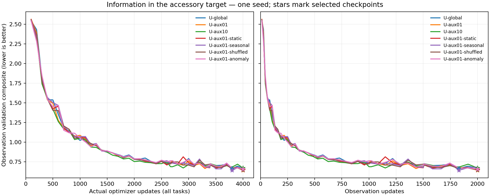

<!-- SPDX-FileCopyrightText: 2026 Samudra Authors -->
<!-- SPDX-License-Identifier: CC-BY-4.0 -->

# What information makes the fine-scale accessory target useful?

**Completed October 4 at 4:30:37 p.m. ET.** All four target controls finished
4,000 updates and all 96 held-out monthly forecasts. Production target arrays
match their qualification hashes and statistics. No training remains running.

## Completed comparison

Every checkpoint is selected by the same integrated-plus-spectral observation
validation score. Test composites use common test-climatology denominators.
These are independent monthly forecasts over 2015–2022, scored through 30 days,
not a continuous eight-year rollout.

| Model | Selected update | Validation | Test composite ↓ | Integrated ratio | Spectral dex | Own initialized persistence |
|---|---:|---:|---:|---:|---:|---:|
| U-global | 3800 | 0.6643 | 0.6784 | 0.8871 | 0.4696 | 0.5886 |
| U-aux01 | 4000 | 0.6421 | 0.6674 | 0.8691 | 0.4657 | 0.5896 |
| U-aux10 | 4000 | 0.6698 | 0.6955 | 0.8930 | 0.4980 | 0.5898 |
| U-aux01-static | 4000 | 0.6520 | 0.6815 | 0.8893 | 0.4737 | 0.5906 |
| U-aux01-seasonal | 3800 | 0.6407 | 0.6567 | 0.8668 | 0.4465 | 0.5725 |
| U-aux01-shuffled | 4000 | 0.6455 | 0.6769 | 0.8821 | 0.4718 | 0.5981 |
| U-aux01-anomaly | 4000 | 0.6565 | 0.6787 | 0.8704 | 0.4870 | 0.5882 |

The literal model names and target transforms are defined below. The seasonal
control essentially matches the aligned target on validation (0.6407 versus
0.6421) and improves test composite by **3.2%** relative to global-only training.
The aligned target improves it by 1.6%. Static, shuffled and anomaly targets
change test composite by approximately +0.5%, −0.2% and +0.1% respectively,
small differences around the global-only reference. The larger aligned loss
coefficient is 2.5% worse. All evolved forecasts still lose to persistence.

The pilot's best validation score does **not require year-specific fine-scale
anomaly information**. A seasonal spatial pattern is sufficient to match the
observed benefit. This is compatible with seasonal/spatial regularization and
does not demonstrate learning feedback from evolving fine-scale anomalies.
The seasonal-versus-aligned validation difference itself is tiny, and one seed
cannot establish a reliable ranking among these small gains. Static and shuffled
controls also have limitations described below; this is not a proof that temporal
fine-scale information is useless.

The seasonal target improves SST RMSE from 0.6252 to **0.6065 °C** and deep OHC
RMSE from 0.4522 to **0.4228 GJ/m²** relative to U-global. Shallow OHC is nearly
unchanged, 0.7002 versus 0.7030 GJ/m²; geostrophic velocity and EKE integrated
errors change little. Its mean spectral error is 0.4465 versus 0.4696 dex.
The accessory gain is not a uniform improvement of every physical quantity.

[All component scores](artifacts/extent-review-2026-10-05/summary/scores.csv),
[validation curves](artifacts/extent-review-2026-10-05/summary/validation-curves.csv),
and [raw results, target hashes and checkpoint lineage](artifacts/extent-accessory-controls-2026-10-04/source-results.json).

## Day-30 maps

These fixed January/July 2022 cases compare U-global, both aligned accessory
weights, the four target controls, and U-global initialized persistence.
All panels use the same observation support and color limits. Anomalies subtract
the same training climatology. These examples illustrate structure; the aggregate
scores above determine the comparisons.

| Case | SST | SSH |
|---|---|---|
| January anomalies | [Map](artifacts/extent-accessory-controls-2026-10-04/maps/day30-2022-01-anomalies-sst.png) | [Map](artifacts/extent-accessory-controls-2026-10-04/maps/day30-2022-01-anomalies-adt.png) |
| July anomalies | [Map](artifacts/extent-accessory-controls-2026-10-04/maps/day30-2022-07-anomalies-sst.png) | [Map](artifacts/extent-accessory-controls-2026-10-04/maps/day30-2022-07-anomalies-adt.png) |
| July absolute fields | [Map](artifacts/extent-accessory-controls-2026-10-04/maps/day30-2022-07-fields-sst.png) | [Map](artifacts/extent-accessory-controls-2026-10-04/maps/day30-2022-07-fields-adt.png) |

[Checkpoint/date provenance](artifacts/extent-accessory-controls-2026-10-04/maps/provenance.json).

## Training diagnostic and final execution

| Target | Mean accessory MSE during the final 1,000 schedule slots |
|---|---:|
| Aligned, coefficient 0.01 | 0.3096 |
| Aligned, coefficient 0.1 | 0.2117 |
| Static | 0.0444 |
| Seasonal | 0.0611 |
| Shuffled | 0.3661 |
| Seasonal anomaly | 0.2745 |

These average the same 218 global-OM4 updates, with eight examples per update,
while weights are still changing. They are training diagnostics, not frozen
held-out errors. Targets have different variances, so raw losses cannot rank
fine-scale predictive skill across modes. The larger aligned coefficient fits
the target better but produces worse observation metrics, illustrating why
accessory accuracy alone is insufficient.

Production **209722** completed with exit 0 after 23,442 seconds on four GPUs:
**26.05 allocated GPU-hours**, or **26.77** including all qualifications.
Producer stayed `558d45cac2294f691d1d73a47db1783df1850c80`. There were no failed
attempts, retries or changes to the predeclared target transforms. Selected
checkpoint hashes match their physical files, training markers and completed
evaluation fingerprints. All actual target transforms exactly match the records
made during qualification.

The following methods and execution entries retain the predeclared plan and
historical snapshots; earlier running/queued statements describe those times.

Predeclared October 4 around 8:50 a.m. ET, within the authorized iteration
window ending Monday around 9 a.m. ET. Completed validation, before collecting
the accessory arms' held-out scores, motivates this follow-up: U-aux01 reached
0.642149 versus U-global's 0.664336, a 3.3% improvement. U-aux10 reached 0.669779
and did not improve. All use the fixed integrated-plus-spectral observation
selection metric; the single-seed difference needs careful interpretation.

A training-only target decomposition found that static spatial means explain
67.8% of standardized target variance and per-cell calendar-month means explain
72.0%. These controls ask whether aligned fine-scale variability matters, or
whether the accessory head mainly supplies a geographic/seasonal regularizer.

## Fixed setup and literal model names

Every arm uses the exact U-aux01 architecture (62,967,809 parameters), coefficient
0.01, seed 1729, fresh initialization, optimizer and progressive schedule:
2,000 global 1° OM4 updates plus 2,000 global observation updates. There is no
regional evolution task. Native quarter-degree five-day-mean velocities supply
only the existing surface subcell-variance target. Data splits, physical input
normalization, forcing, masks, geometry, six-step OM4 horizon, observation
calendar alignment and validation/test metrics stay unchanged.

Let z(t, y, x) be the existing globally standardized log1p variance target.
All climatologies use only the same 2,829 training frames. They change the
accessory target, not physical input normalization or observation labels.

| Literal name | Target replacing z at every predicted OM4 lead | Question |
|---|---|---|
| U-aux01-static | Training time mean of z at each cell | Is a fixed spatial target sufficient? |
| U-aux01-seasonal | Training calendar-month mean of z at each cell | Is geography plus the annual cycle sufficient? |
| U-aux01-shuffled | z from a fixed permutation of training dates, seed 271828 | Does correctly aligned timing matter when the target's marginal distribution is preserved? |
| U-aux01-anomaly | z minus its training calendar-month mean at each cell | Can supervision focused on departures from the seasonal spatial pattern help? |

U-aux01, defined in the [representation report](extent-representation-2026-10-03.md),
uses the actual aligned z. U-global is the same original U-Net without an
accessory head or loss, defined in the [first screen](extent-wave-2026-10-02.md).
Every result table must use these literal names.

The shuffled target preserves full spatial maps and their marginal distribution,
but destroys the relation between model date and target date and disrupts target
sequence correlations. It tests alignment against potentially conflicting
supervision; failure alone would not prove a physical mechanism. Static,
seasonal and anomaly targets have different residual variance, so a common
coefficient does not imply matched accessory gradient magnitudes. Record target
moments and training losses to make that limitation visible. No target is
rescaled per cell or per mode.

## Qualification and execution plan

Pin a new producer without changing active runs. Test the temporal transforms,
qualify fitting and serialization/resume for every target mode on beta_test, and
require each probe to extrapolate below 12 training hours. Use one four-GPU beta
allocation with a 16-hour cap and 14-hour training safety cap, after the running
initializer follow-up releases its node. Allow overlap with the attention wave,
for at most eight production GPUs. Wait through normal queue delays.

Collect all 96 held-out monthly forecasts only for the validation-selected
checkpoint of each completed arm. Report test scores as exploratory, with the
same test-climatology denominators and persistence controls. These forecasts
cover 2015–2022 as independent monthly 30-day cases, not continuous eight-year
rollouts. Any unfinished arm at Monday review will be labeled unfinished.

## Qualification submitted at 8:49 a.m. ET

Producer `558d45cac2294f691d1d73a47db1783df1850c80`, archive SHA-256
`e79ee680969a14ff21bdda5de08e5d285cca1bf2b7ec775a2b41dd7a91b952e6`.
Local validation passed 22 targeted tests, Ruff, mypy for the four touched
Python implementation files, shell syntax and diff checks. The tests check
seasonal/anomaly decomposition, invalid-cell support, preserved shuffled maps,
unchanged global RNG, future-label alignment and gradient routing. No active
producer was replaced and no checkpoint crosses the new qualification contract.

| Stage | Arm | Job |
|---|---|---:|
| Fit | Shared accessory architecture | 209715 |
| Joint/resume probe | U-aux01-static | 209716 |
| Joint/resume probe | U-aux01-seasonal | 209717 |
| Joint/resume probe | U-aux01-shuffled | 209718 |
| Joint/resume probe | U-aux01-anomaly | 209719 |

All four probes depend on the fitting job succeeding. Each qualification uses
one GPU, 16 CPUs, 128 GiB and at most two hours on beta_test/test. Production
has not been submitted. Root:
`/projects/ny/lz1955/multiscale/jrusak/runs/2026-10-04-extent-accessory-controls`.
[Exact receipts](artifacts/extent-accessory-controls-2026-10-04/qualification-jobs.json).

## Qualification results and production admission, 9:04 a.m. ET

All five jobs completed with exit 0. Fit loss fell from 1.703 to 0.288 with all
required component gradients. Every target mode passed exact checkpoint
serialization/restoration and the unchanged replay test. Each qualification
contract binds the target mode, coefficient, target-cache receipt, source and
runtime; each transformed target also has its own recorded SHA-256. Peak GPU
memory was 71.68 GiB. Qualifications used **0.726 allocated GPU-hours**.

| Target mode | Probe seconds/update | Extrapolated training hours for 4,000 updates | Area-weighted target mean square |
|---|---:|---:|---:|
| Static | 8.57 | 9.53 | 0.67798 |
| Seasonal | 8.50 | 9.44 | 0.72009 |
| Shuffled | 8.32 | 9.24 | 1.00000 |
| Anomaly | 8.68 | 9.64 | 0.27991 |

All pass the 12-hour training gate; startup, validation and held-out evaluation
are additional. Target means are approximately zero. The seasonal/anomaly
second moments sum to one, and the shuffled control preserves the aligned
target's second moment. The resulting differences in accessory loss scale are
explicit, not silently renormalized.

Production requests one four-GPU beta/standard node, 144 CPUs, full node memory
and 16 hours. It retains successful `afterok` dependencies on all four probes
and running initializer wave 209686. The training safety cap is 14 hours per
arm. The dry-run ID 209721 was not an allocated job; the actual submission is
**209722**. No qualifications failed and no retries occurred.

[Full qualification evidence](artifacts/extent-accessory-controls-2026-10-04/qualification-results.json)
and [production receipt](artifacts/extent-accessory-controls-2026-10-04/production-jobs.json).
