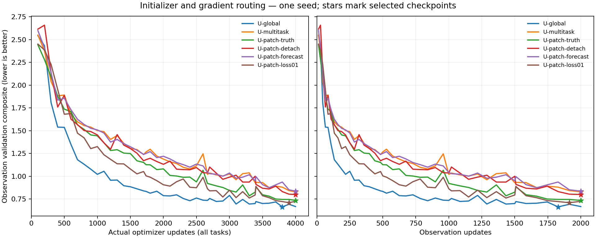
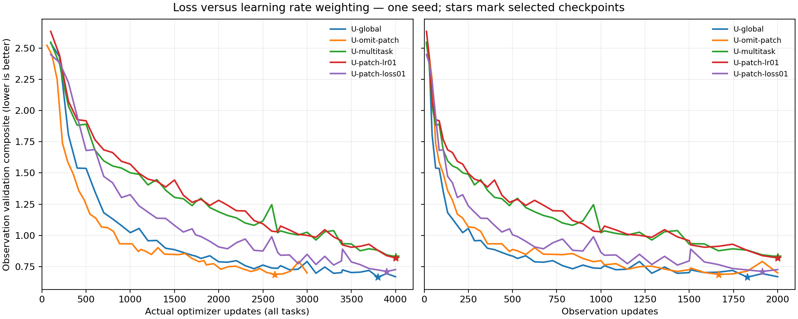
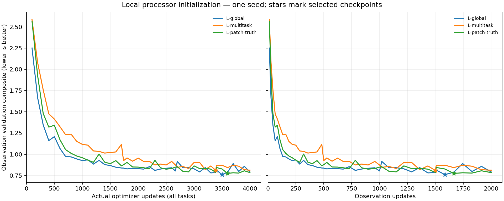

<!-- SPDX-FileCopyrightText: 2026 Samudra Authors -->
<!-- SPDX-License-Identifier: CC-BY-4.0 -->

# Separating regional initialization quality from gradient interference

**Completed October 4 at 9:59 a.m. ET.** All four arms finished exactly 4,000
updates and all 96 held-out monthly forecasts. Native loss weighting helped
substantially; removing initializer losses or gradients alone did much less.
No native-patch variant beat the original global-only control.

## Completed comparison

Checkpoint selection uses the unchanged integrated-plus-spectral observation
validation score. Test composites use the common test-climatology denominators,
verified identical across arms. These are independent monthly forecasts over
2015–2022, with surface scores at 5, 15 and 30 days and calendar-month OHC—not
a continuous eight-year rollout. All named forecasts use the learned initializer
on observations, including models whose **native training task** uses truth.

| Model | Selected update | Validation | Test composite ↓ | Integrated ratio | Spectral dex | Own initialized persistence |
|---|---:|---:|---:|---:|---:|---:|
| U-global | 3,800 | 0.6643 | 0.6784 | 0.8871 | 0.4696 | 0.5886 |
| U-omit-patch | 2,633 actual / 3,600 scheduled | 0.6866 | 0.7074 | 0.9146 | 0.5003 | 0.5842 |
| U-patch-loss01 | 3,900 | 0.7101 | 0.7104 | 0.9032 | 0.5176 | 0.5893 |
| U-patch-truth | 4,000 | 0.7356 | 0.7278 | 0.9039 | 0.5517 | 0.5757 |
| U-patch-detach | 4,000 | 0.8002 | 0.7964 | 0.9009 | 0.6919 | 0.5829 |
| U-patch-lr01 | 4,000 | 0.8188 | 0.8115 | 0.9243 | 0.6987 | 0.6176 |
| U-multitask | 4,000 | 0.8293 | 0.8130 | 0.9167 | 0.7093 | 0.6026 |
| U-patch-forecast | 4,000 | 0.8370 | 0.8155 | 0.9245 | 0.7065 | 0.5827 |
| L-global | 3,500 | 0.7603 | 0.7546 | 0.8673 | 0.6419 | 0.5538 |
| L-patch-truth | 3,600 | 0.7754 | 0.7670 | 0.8751 | 0.6589 | 0.5636 |
| L-multitask | 3,389 | 0.8097 | 0.7856 | 0.9642 | 0.6070 | 0.5890 |

All models still lose to their own initialized persistence on the composite.
U-omit-patch finishes 3,000 actual updates because its 1,000 native slots are
true no-ops; other models finish 4,000. The methods below define every model.

The loss-weighted model improves test composite by **12.6%** over U-multitask
and **12.5%** over the smaller-LR model. It remains **4.7% worse than U-global**
and approximately equal to omission (0.4% worse). This recovers most of the
negative-transfer penalty; it does not demonstrate positive native-patch benefit.

Truth versus detached learned initialization uses the same native forecast-only
objective and gradient routing. Truth improves test score by **8.6%** relative
to the detached variant, supporting initial-state quality as part of the problem.
Detaching the initializer improves only 2.0% over original multitasking. Removing
native reconstruction/completion losses while retaining forecast gradients
(U-patch-forecast) gives essentially the original result, 0.3% worse. Thus the
auxiliary initializer losses alone do not explain the observed penalty.
For the local processor, true states improve on ordinary multitasking by 2.4%
but remain 1.6% worse than its global-only control. All are single-seed findings.

[All scores](artifacts/extent-initializer-2026-10-04/summary/scores.csv),
[validation curves](artifacts/extent-initializer-2026-10-04/summary/validation-curves.csv),
and [raw results with verified lineage](artifacts/extent-initializer-2026-10-04/source-results.json).

## Recorded gradients and clipping

These summaries use every production optimizer update's recorded total-model
norm after accumulation and loss weighting, before clipping at 1.0. They use no
new model execution and do not measure Adam moments or parameter displacement.

| Model | Median native gradient norm | Native updates clipped | Median observation gradient norm |
|---|---:|---:|---:|
| U-multitask | 1.7106 | 81.5% | 0.2622 |
| U-patch-lr01 | 2.0221 | 88.3% | 0.2730 |
| U-patch-loss01 | 0.1879 | 7.0% | 0.2001 |
| U-patch-truth | 1.0976 | 54.7% | 0.2353 |
| U-patch-detach | 1.8813 | 85.3% | 0.2555 |
| U-patch-forecast | 1.5795 | 77.5% | 0.2637 |

Loss weighting changes the gradient entering both clipping and shared Adam
moments. A smaller task learning rate scales the resulting parameter step but
leaves that task's gradient contribution to moments intact. The measurements
are consistent with excessive native-task influence on joint optimization.
They do not identify Adam interference as the sole cause: the learned states
and gradients also diverge across runs. Clipping can erase some of the intended
loss-scale reduction on large-gradient updates. The diagnostic separately
records early and late schedule windows and all global/observation tasks.

[Read-only diagnostic and event hashes](artifacts/extent-initializer-2026-10-04/optimizer-diagnostic.json).

## Completed execution and provenance

Job **209686** completed with exit 0 after 27,721 seconds on four GPUs:
**30.80 allocated GPU-hours**, or **31.66** including all qualifications.
Producer stayed `b8092783bf1e47b6ac670251feba5fbd2902a5bd`. There were no failed
attempts, retries or scientific protocol changes. Physical checkpoint SHA-256,
training completion, selection metadata and evaluation fingerprints agree for
all four arms. Their exact hashes and completion times are in the linked raw
results. Target-control job 209722 started after this job released its node.

The following methods and progress entries retain the predeclared plan and
historical snapshots; running or queued statements below describe those times.

Predeclared October 4 after completion of the [first mechanism ablations](extent-ablations-2026-10-03.md),
within the user's autonomous iteration window ending Monday around 9 a.m. ET.
The strongest patch variant on validation was true-state initialization
(0.7356 versus 0.8293 for the original native task), but omission remained better
(0.6866). That evidence motivates separating input quality, initializer gradient
routing, auxiliary initializer losses, and task weighting. The test cohort is
used descriptively; it does not choose these interventions or checkpoints.

This is one further four-arm, one-seed comparison, alongside the already
qualified [accessory/capacity wave](extent-representation-2026-10-03.md). It may
overlap that wave on a second four-GPU node, for at most eight production GPUs.
No existing run or source pin changes.

## Exact tasks and controls

The original controls U-global and L-global use only global OM4 and observation
updates, with the U-Net and bounded local processors respectively. U-multitask
and L-multitask replace half their OM4 updates with the original native-patch
task. U-omit-patch removes those native slots entirely. U-patch-lr01 retains the
original native loss but reduces its learning rate tenfold. U-patch-truth uses
two true full native states and native forecast loss only. Their exact methods
are in the [screen](extent-wave-2026-10-02.md) and
[first ablations](extent-ablations-2026-10-03.md). New literal names are defined
in the table below.

All four arms use seed 1729 and exactly 4,000 optimizer updates: 1,000 global
OM4, 1,000 native quarter-degree OM4 patches and 2,000 global observation updates.
Reuse the verified 1° OM4 v3 global store, v2026-09 quarter-degree five-day-mean
patch cache and fixed observation samples. Global fields are 180×360; native
patches are 128×128 with 64×64 scored interiors. The model evolves 77 physical
channels through six nominal five-day steps on OM4 tasks. Observation tasks
retain six or seven forecast bins according to calendar-month overlap for OHC,
with surface metrics at 5, 15 and 30 days. No future state boundary conditions
or fine-resolution fields enter observation inference.

| Literal name | Initial state on native patch tasks | Native objective and gradient routing | Primary comparison |
|---|---|---|---|
| U-patch-detach | Same learned initializer and masked surface inputs as U-multitask | Six-step forecast loss only; initializer evaluated without gradients; processor gradients retained | Against U-patch-truth: same gradient routing/objective, learned rather than true initial states |
| U-patch-forecast | Same learned initializer and masked surface inputs as U-multitask | Six-step forecast loss backpropagates through both initializer and processor; omit native reconstruction/completion losses | Against U-patch-detach: whether forecast gradients through the initializer help or hurt; against U-multitask: remove only native auxiliary initializer losses |
| U-patch-loss01 | Original learned initialization and native task | Multiply the entire native loss by 0.1 before backward/clipping; keep LR 1e-4 | Against U-patch-lr01: reducing gradient contribution versus reducing parameter step size |
| L-patch-truth | Two true full native physical states | Six-step forecast loss only, no native initializer gradients | Against L-multitask and L-global: does true-state patch training also help the bounded local processor? |

The three U arms have 62,967,680 parameters; L-patch-truth has 35,681,936.
All retain the same 31.28M-parameter U-Net initializer. The local processor's
four-cell one-step receptive radius conditions on supplied states and geometry;
its shared initializer remains nonlocal. The global and observation tasks,
including learned initialization and their reconstruction/completion losses,
remain unchanged in every arm. No artificial visibility mask is removed from
the learned-initializer patch variants.

Reference definitions: **U-multitask** and **L-multitask** are the original
shared-initializer native-patch arms; **U-global** and **L-global** replace native
updates with additional global OM4 updates. **U-patch-truth** is the completed
U-Net true-initial-state ablation; **U-patch-lr01** is the completed native LR
1e-5 ablation, which retains unscaled native gradients in Adam's moments.

The loss-weight arm also changes the interaction with clipping: when both the
original and scaled gradient norms exceed the threshold, normalization can
erase much of the scale difference. Log both scaled and unscaled native losses
and the pre-clip gradient norm. This is a controlled training intervention,
not an assertion that loss weight and task frequency or LR are equivalent.

## Fixed training, selection and qualification

Keep the progressive mixed schedule, per-task sample seeds, accumulation of
eight examples, AdamW LR 1e-4, weight decay 0.01, clipping at 1, and no warmup.
Checkpoints use the same frozen integrated-plus-spectral global observation
validation composite. Report the same 96 monthly test forecasts and initialized
persistence with common test-climatology normalization. One seed limits the
strength of causal/generalization claims; repeated test reporting is exploratory.

Use a new immutable producer, fresh fitting qualifications for U and L, and a
real joint/resume probe for each arm. The new qualification contract binds
initialization mode and native loss scale. Probes must verify initializer
gradients are absent for detached/true-state native tasks and present for the
forecast-only/shared variants. Unit tests check actual gradient routing and
forecast-only values, including exclusion of auxiliary losses.

Production requests one beta node, four GPUs, 144 CPUs, all node memory and a
16-hour cap. Admit only if each short probe extrapolates below 12 training hours;
the per-arm training loop stops safely at 14 hours, preserving a checkpoint if
needed. This leaves startup/evaluation allowance and aims to finish comfortably
before Monday review. No queue-chasing resubmission or additional seed is planned.

Results and exact job/source provenance will be appended after qualification.

## Submission, October 4 at 1:56 a.m. ET

Producer `b8092783bf1e47b6ac670251feba5fbd2902a5bd`; source archive SHA-256
`fc9d5196a9dc9fa262453499e69724a2b400eb3ab33d6ab0e7113f6d8f3ee778`.
Local checks passed 24 targeted tests, Ruff, mypy for four touched Python files,
shell syntax and diff checks. All existing production uses its earlier immutable
producer. Fresh qualifications are required under the extended contract.

| Stage | Arm/family | Job |
|---|---|---:|
| Fit | Shared U-Net family | 209674 |
| Fit | Local family | 209675 |
| Joint/resume probe | U-patch-detach | 209676 |
| Joint/resume probe | U-patch-forecast | 209677 |
| Joint/resume probe | U-patch-loss01 | 209678 |
| Joint/resume probe | L-patch-truth | 209679 |

Both fitting allocations were running at this snapshot; the four probes were
pending on their corresponding fitting job. Each qualification requests one GPU,
16 CPUs, 128 GiB and up to two hours on `beta_test`/`test`. Production has not
been submitted. Root:
`/projects/ny/lz1955/multiscale/jrusak/runs/2026-10-04-extent-initializer`.
[Exact receipts](artifacts/extent-initializer-2026-10-04/qualification-jobs.json).

## Qualifications passed; production queued at 2:17 a.m. ET

All six qualification jobs completed with exit 0. Fitting loss decreased from
1.703 to 0.283 for U and 1.556 to 0.952 for L, with all required component and
completion gradients present. Each joint probe verified exact serialization
and restoration, and replay within the unchanged native-nondeterminism test.
The contracts explicitly record `detach`, `forecast`, `shared` with loss scale
0.1, or `truth`, as appropriate. Peak GPU memory was 71.6–71.7 GiB, including
the global-data cache.

| Arm | Probe seconds/update | Extrapolated hours for 4,000 updates |
|---|---:|---:|
| U-patch-detach | 9.89 | 10.98 |
| U-patch-forecast | 9.62 | 10.69 |
| U-patch-loss01 | 9.82 | 10.91 |
| L-patch-truth | 6.14 | 6.82 |

Every arm passes the predeclared 12-hour training extrapolation gate. Startup,
validation and evaluation are additional; per-arm training caps remain 14 hours
within the 16-hour allocation. Qualifications used **0.860 allocated GPU-hours**.

Production **209686** is pending beta priority with successful `afterok`
dependencies on all four joint probes. It requests the declared four GPUs,
144 CPUs and full node memory. A dry-run start estimate was **October 4 around
3:46 a.m. ET**, not a confirmed start. This allocation may overlap the already
running representation wave 209608. There are no failed attempts or retries.

[Qualification evidence](artifacts/extent-initializer-2026-10-04/qualification-results.json)
and [exact production receipt](artifacts/extent-initializer-2026-10-04/production-jobs.json).

## First production validation, October 4 at 2:40 a.m. ET

The job started earlier than the tentative queue estimate, without resubmission.
U-patch-detach reached 147 updates, U-patch-forecast and U-patch-loss01 reached
146, and L-patch-truth reached 164. Their observation validation composites at
100 updates were respectively 2.6141, 2.5989, 2.4499 and 2.5664. These early
values establish functioning training and evaluation, not a result at the
planned 4,000-update budget. Production overlaps the representation wave as
declared, with eight GPUs allocated in total. No recovery or protocol change
was required.

## Mid-run check, October 4 at 5:42 a.m. ET

All four arms continue without a failure or restart. L-patch-truth has reached
2,305 updates; the three U-Net variants are at approximately 1,844. Best
validation scores are 0.8291 for L-patch-truth, 1.1701 for U-patch-detach,
1.2404 for U-patch-forecast and 0.9901 for U-patch-loss01. Loss weighting is
showing a stronger early improvement than the earlier learning-rate intervention,
but comparisons will use each completed budget's validation-selected checkpoint.
The remaining training is expected to finish roughly 8–11 a.m. ET, based on
observed progress; this remains an estimate. The job has accumulated 13.65
allocated GPU-hours, plus 0.86 for qualification, at this check.
