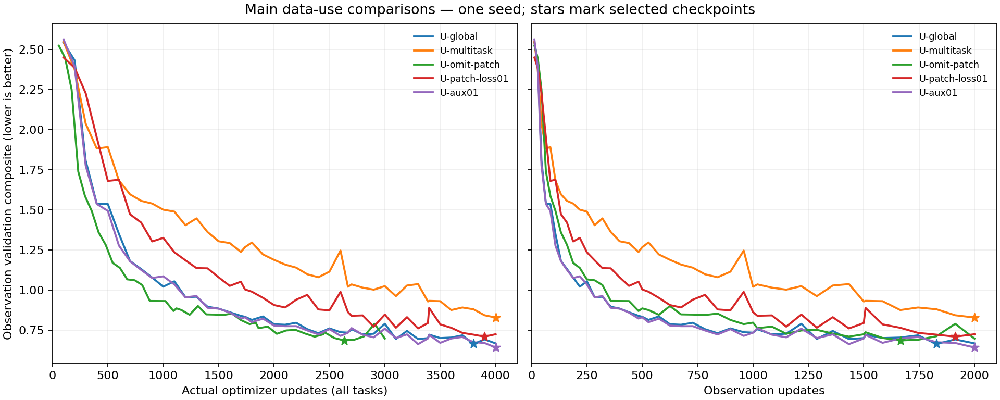
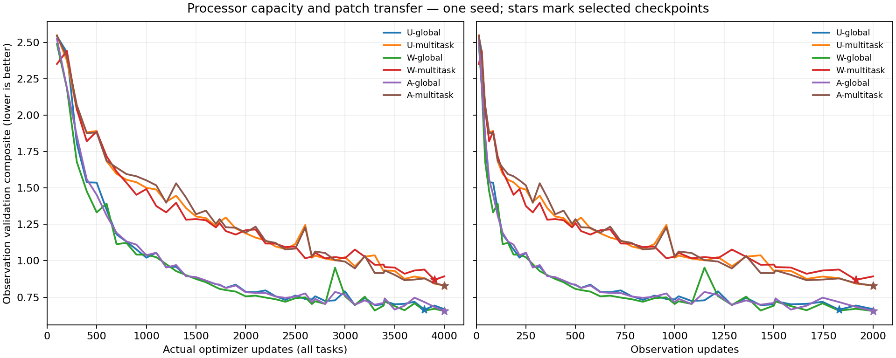

<!-- SPDX-FileCopyrightText: 2026 Samudra Authors -->
<!-- SPDX-License-Identifier: CC-BY-4.0 -->

# Global and native-patch transfer: Monday review

**Ready ahead of the October 5, 9 a.m. ET review.** All 22 models completed
their planned training and all 96 held-out monthly forecasts by **October 4,
4:30:37 p.m. ET**. No training jobs in this campaign remain running. This report consolidates the
five experiment waves on branch `codex/patch-global-om4`.

The main finding is **negative transfer from the native-patch evolution task
at this budget**. Reducing its loss contribution removes most of the penalty,
but does not beat coarse global training. Fine-scale accessory supervision
gives a small gain, which a **seasonal-climatology target can match without
year-specific fine-scale anomalies**. Width and bottleneck axial attention do
not solve the patch-transfer problem. These are exploratory, one-seed results.

## Contents

- [What the experiment measures](#what-the-experiment-measures)
- [Findings](#findings)
- [All results](#all-results)
- [Data, training and model definitions](#data-training-and-model-definitions)
- [Rollout maps and detailed reports](#rollout-maps-and-detailed-reports)
- [Execution and limits](#execution-and-limits)
- [What to discuss next](#what-to-discuss-next)

## What the experiment measures

The question is whether native quarter-degree information helps **global 1°
observational forecasts** when the processor either evolves regional fields or
receives an accessory training loss. Every model starts from random weights,
uses seed 1729 and the same observation samples and metrics. These are physical
state models with no additional evolved latent channels or diffusion. The
existing [global observation report](global-domain-results-2026-09-30.md) is an
external reference: this fresh 2,000-OM4 + 2,000-observation screen does not
reproduce D's weights or the longer 8k+8k training budget.

Evaluation covers **96 independently initialized monthly forecasts from January
2015 through December 2022**, not a continuous eight-year rollout. Surface
errors average leads 5, 15 and 30 days; heat-content errors use calendar-month
means. Selection uses the fixed nine-month observation validation set.

The composite equally weights (1) the mean of five integrated error ratios
relative to seasonal climatology—SST, geostrophic velocity, EKE and OHC at
0–700/700–2000 m—and (2) 27 spatial spectral errors across SST/ADT/EKE, three
regions and three leads. Spectral errors use log10 power ratios (**dex**).
Validation selection uses frozen validation denominators; test reporting uses
common test denominators. Their numerical gap is not a train/generalization-gap
estimate. Prognostic U/V are not directly scored by the observational velocity
metric; that diagnostic derives geostrophically from predicted SSH.

Initialized persistence holds each selected model's initialized full state fixed,
without invoking its evolution processor. Its interior is model-dependent.
**Every evolved model loses to its own persistence on the composite**, generally
because of the spatial spectral deficit. Some integrated errors still improve.
Nothing here establishes century-scale stability or fine-scale closure skill.

## Findings

1. **Ordinary native-patch evolution hurts.** Replacing 1,000 of the 2,000
   coarse-global OM4 updates with native patches increases test composite error
   by 19.9% for the U-Net and 4.1% for the bounded local processor. Omitting those
   patch updates is better than using them, despite doing less optimizer work.
2. **Task weighting matters more than the tested learning-rate change.** A
   tenfold native loss reduction improves the U-Net multitask result by 12.6%,
   to 0.7104, close to omission's 0.7074. It still trails U-global's 0.6784.
   Tenfold smaller patch LR barely helps. Native gradients are clipped on 81.5%
   of original multitask updates versus 7.0% with loss weighting. This supports
   an optimization-interference explanation without identifying a sole cause.
3. **Regional initial-state quality also matters.** True native initial states
   improve test error by 8.6% relative to detached learned initial states under
   the same native forecast-only objective and gradient routing. Detaching the
   initializer helps only modestly; removing its native auxiliary losses alone
   does not help. True-state patch training still does not beat global-only
   training, including with the local processor.
4. **The accessory gain does not require aligned fine-scale anomalies.**
   U-aux01 improves test composite by 1.6%. A target containing only the training
   seasonal climatology of the normalized log-variance target improves it by 3.2%, with
   nearly the same validation score as the aligned target. Static, shuffled and
   anomaly targets are approximately equal to U-global on test. This points to
   a useful seasonal/spatial regularizer; it does not demonstrate learning the
   feedback of evolving fine-scale anomalies onto coarse dynamics.
5. **The tested capacity changes do not rescue multitasking.** Width improves
   global-only test score by 0.7% but worsens the multitask score by 4.7% relative
   to its original U-Net counterpart. Axial attention changes those scores by
   about +0.5% and +0.1% respectively (higher is worse). Larger or attention-based
   models with separate tuning and longer budgets remain untested.

The 0–3% differences among global-only alternatives are small, single-seed
findings. All checkpoints use validation selection; the shared test cohort is
reported repeatedly across exploratory waves, so this is not an untouched
confirmatory benchmark or a demonstration of statistical significance.

Curves show actual optimizer updates and observation exposure separately.
Neither axis is FLOP matching. Stars mark the validation-selected checkpoint;
many arms select the endpoint, so this is not a convergence comparison.

## All results

Lower is better. Most models finish 4,000 actual updates; U-omit-patch finishes
3,000, with 1,000 scheduled no-ops. The selected update can be earlier. Every
literal name is defined in the methods below.

| Model | Selected actual update | Validation | Test composite ↓ | Integrated ratio | Spectral dex | Own persistence |
|---|---:|---:|---:|---:|---:|---:|
| U-global | 3800 | 0.6643 | 0.6784 | 0.8871 | 0.4696 | 0.5886 |
| U-multitask | 4000 | 0.8293 | 0.8130 | 0.9167 | 0.7093 | 0.6026 |
| L-global | 3500 | 0.7603 | 0.7546 | 0.8673 | 0.6419 | 0.5538 |
| L-multitask | 3389 | 0.8097 | 0.7856 | 0.9642 | 0.6070 | 0.5890 |
| U-omit-patch | 2633 | 0.6866 | 0.7074 | 0.9146 | 0.5003 | 0.5842 |
| U-patch-lr01 | 4000 | 0.8188 | 0.8115 | 0.9243 | 0.6987 | 0.6176 |
| U-patch-truth | 4000 | 0.7356 | 0.7278 | 0.9039 | 0.5517 | 0.5757 |
| U-patch-1step | 4000 | 0.8404 | 0.8244 | 0.9513 | 0.6975 | 0.6137 |
| U-patch-detach | 4000 | 0.8002 | 0.7964 | 0.9009 | 0.6919 | 0.5829 |
| U-patch-forecast | 4000 | 0.8370 | 0.8155 | 0.9245 | 0.7065 | 0.5827 |
| U-patch-loss01 | 3900 | 0.7101 | 0.7104 | 0.9032 | 0.5176 | 0.5893 |
| L-patch-truth | 3600 | 0.7754 | 0.7670 | 0.8751 | 0.6589 | 0.5636 |
| W-global | 4000 | 0.6548 | 0.6735 | 0.8920 | 0.4549 | 0.5897 |
| W-multitask | 3900 | 0.8696 | 0.8513 | 0.9699 | 0.7327 | 0.6137 |
| A-global | 4000 | 0.6556 | 0.6817 | 0.8931 | 0.4704 | 0.5948 |
| A-multitask | 4000 | 0.8298 | 0.8137 | 0.9733 | 0.6540 | 0.6018 |
| U-aux01 | 4000 | 0.6421 | 0.6674 | 0.8691 | 0.4657 | 0.5896 |
| U-aux10 | 4000 | 0.6698 | 0.6955 | 0.8930 | 0.4980 | 0.5898 |
| U-aux01-static | 4000 | 0.6520 | 0.6815 | 0.8893 | 0.4737 | 0.5906 |
| U-aux01-seasonal | 3800 | 0.6407 | 0.6567 | 0.8668 | 0.4465 | 0.5725 |
| U-aux01-shuffled | 4000 | 0.6455 | 0.6769 | 0.8821 | 0.4718 | 0.5981 |
| U-aux01-anomaly | 4000 | 0.6565 | 0.6787 | 0.8704 | 0.4870 | 0.5882 |

[Machine-readable scores](artifacts/extent-review-2026-10-05/summary/scores.csv)
include all five component errors and anomaly-persistence controls.
[Validation curves](artifacts/extent-review-2026-10-05/summary/validation-curves.csv)
and [source bundle hashes](artifacts/extent-review-2026-10-05/summary/summary-provenance.json)
retain the complete comparison.

## Data, training and model definitions

| Source/task | Supplied field | Supervision and role |
|---|---|---|
| Global OM4 1° v3 | 180×360, 77 physical channels | Global evolution through six nominal five-day steps; native OM4 wind stress and heat flux |
| OM4 quarter-degree v2026-09 five-day averages | 720×1440 source; 128×128 regional input with 32-cell halo | Evolve the whole supplied patch; score its central 64×64 cells; no true future ocean boundaries |
| Observations | 180×360; 243 training, 9 validation, 96 test months | 19-frame surface/forcing histories, ERA5 adapter, surface and calendar-month OHC supervision |
| Fine-scale accessory target | Native quarter-degree surface U/V aggregated onto the 1° grid | Spatial subcell velocity variance from five-day means; exact spherical grid-cell overlap and wet-area support |

The quarter-degree source is
`s3://m2lines-pubs/Samudra/v2026-09/om4_quarterdeg/`. All 385,269 objects
(1,594,021,374,932 bytes) were read-back verified. Training uses a verified
native-resolution cache; it does not replace the quarter-degree patch with a
coarsened 1° patch. Global 1° data and quarter-degree data are different
preprocessing releases, so release, resolution and extent are not separately
isolated. LLC is excluded pending the upstream missing-data investigation.
Exact prepared paths, dates, masks and hashes are in the
[first-screen methods](extent-wave-2026-10-02.md#fields-and-tasks).

State channels are T/S/U/V at 19 depths plus SSH. The common initializer uses
19 surface/forcing frames to infer two full states. Observed surface values
are copied where valid; synthetic hiding supplies completion supervision.
Physical channel scaling is common across resolutions and derived from the
observation training data—there is no per-cell physical input normalization.
The U-Net uses spatial InstanceNorm. Geometry identifies location, spacing and
extent; global longitude is periodic and regional edges are not.

All runs use AdamW, LR 1e-4 unless explicitly changed below, weight decay 0.01,
gradient clipping at 1.0, accumulation of eight examples and no warmup. The
progressive mixed schedule totals 2,000 OM4 and 2,000 observation slots.
Global-only arms use all OM4 slots globally. Multitask arms split them into
1,000 global and 1,000 native-patch slots. Observation forecasting retains six
or seven five-day bins for calendar-month integration. Every model uses the
learned initializer at observational evaluation, even if native training uses
true full states.

### Task mixture over training

These runs start from random weights and interleave tasks from the beginning;
they do not start from D's checkpoint. The mixture becomes increasingly
observation-heavy, but there is no separate observation-only finishing phase.
Each scheduled update uses one task with eight accumulated examples. The exact
counts in successive blocks are:

| Scheduled updates | OM4 updates (all resolutions) | Observation updates | Observation share |
|---|---:|---:|---:|
| 1–1,000 | 782 | 218 | 21.8% |
| 1,001–2,000 | 593 | 407 | 40.7% |
| 2,001–3,000 | 407 | 593 | 59.3% |
| 3,001–4,000 | 218 | 782 | 78.2% |
| Total | 2,000 | 2,000 | 50.0% |

For global-only arms, every OM4 update uses the global 1° task. Multitask arms
alternate global 1° and native quarter-degree patch tasks within the OM4 slots,
giving 1,000 global + 1,000 patch + 2,000 observation updates overall. Their
final 1,000 slots contain 109 global + 109 patch + 782 observation updates.
Accessory arms retain the global-only schedule and add the fine-resolution
target loss on global OM4 updates; they do not evolve native patches.
`U-omit-patch` skips the 1,000 patch slots without optimizer updates, leaving
3,000 actual updates, of which 2,000 are observational.

These are update fractions, not GPU-time or FLOP fractions. Reported results
use the checkpoint selected by observation validation, which can precede the
end of the schedule. The implementation is
[`TaskSchedule`](../../../src/samudra/experiments/task_schedule.py), with the
2,000/2,000 mixed schedule set in
[`run_extent_wave.py`](../../../scripts/run_extent_wave.py).

| Family | Processor | Total parameters, including common initializer and forcing adapter |
|---|---|---:|
| U | ConvNeXt U-Net, widths 128/192/256/384 | 62,967,680 |
| L | Four bounded local blocks, width 512; radius four cells per step | 35,681,936 |
| W | Wider U-Net, widths 192/288/384/576 | 100,659,264 |
| A | Original U-Net plus row/column bottleneck attention, 8 heads | 64,151,938 |
| U with accessory head | U plus a 128→1 pointwise training head | 62,967,809 |

The common initializer has 31,281,670 parameters; the ERA5 adapter has 387.
Architecture families are not parameter matched. Within each family, the
global and multitask pair use the same initialization. Adding the accessory
head preserves the core and subsequent adapter initialization through an
isolated RNG context. Accessory predictions do not enter observational inference.

| Literal model name(s) | Meaning |
|---|---|
| U-global, L-global, W-global, A-global | Respective processor family, global OM4 plus global observations |
| U-multitask, L-multitask, W-multitask, A-multitask | Same respective processor shared between global and native-patch evolution; original learned regional initialization and auxiliary losses |
| U-omit-patch | U-multitask schedule with native slots removed completely, including optimizer/momentum/weight-decay effects |
| U-patch-lr01 | Original native task, LR 1e-5 on its updates, full gradients entering shared Adam moments |
| U-patch-loss01 | Original native task, its entire loss multiplied by 0.1 before backward/clipping, LR unchanged |
| U-patch-truth, L-patch-truth | Two true native full states; six-step native forecast loss only; no native initializer gradients |
| U-patch-1step | Original learned native initialization and auxiliary losses, but only one native forecast step |
| U-patch-detach | Learned native initial states with gradients detached; six-step native forecast loss only |
| U-patch-forecast | Learned native initialization; six-step forecast gradients through initializer and processor, without native reconstruction/completion losses |
| U-aux01, U-aux10 | Global-only U with aligned fine-scale accessory target, coefficients 0.01 and 0.1 |
| U-aux01-static | Coefficient 0.01, target replaced by its training per-cell time mean |
| U-aux01-seasonal | Coefficient 0.01, target replaced by its training per-cell calendar-month mean |
| U-aux01-shuffled | Coefficient 0.01, full target maps permuted across training dates using fixed seed 271828 |
| U-aux01-anomaly | Coefficient 0.01, aligned target minus its training per-cell calendar-month mean |

Accessory transformations operate on the existing globally standardized log1p
subcell-variance target. They do not change physical input normalization. This
variance is not all unresolved EKE and is not the observation metric's
SSH-derived EKE. Static/seasonal/anomaly transforms change target variance;
keeping one coefficient does not match their gradient magnitudes. The shuffled
control preserves map marginals but breaks timing and sequence correlations.

## Rollout maps and detailed reports

Maps use the same January/July 2022 cases, day-30 five-day means, shared color
limits and observation-valid support. Anomalies subtract the same training
climatology. Selected weights and exact dates are checked against saved export
metadata. Individual cases illustrate structure, not aggregate ranking.

- [Original U-Net and local comparisons, including maps](extent-wave-2026-10-02.md#rollout-maps-and-spectral-diagnosis).
- [Omission, learning-rate, true-state and horizon ablations](extent-ablations-2026-10-03.md).
- [Initializer/gradient controls, curves and maps](extent-initializer-followup-2026-10-04.md).
- [Width and axial attention, including architecture maps](extent-representation-2026-10-03.md).
- [Accessory-target controls and maps](extent-accessory-controls-2026-10-04.md).

## Execution and limits

All five production waves completed successfully on EAI Beta. The original
screen required a runtime-extension repair after two short qualification
failures; their records and costs are retained. Subsequent qualifications and
production had no failed attempts or retries. Checkpoints, source pins and
failed-attempt provenance were preserved. No job was repeatedly cancelled and
resubmitted to chase queue capacity.

| Wave | Production job | Allocated GPU-hours including qualification/diagnostics |
|---|---:|---:|
| Original screen | 209239 | 30.56 |
| Mechanism ablations | 209574 | 30.85 |
| Accessory and capacity | 209608 | 59.73 |
| Initializer and gradient routing | 209686 | 31.66 |
| Accessory target controls | 209722 | 26.77 |
| **Total** | | **179.58** |

These are actual allocated GPU-hours, including retries and idle GPUs after
faster arms finished, not estimated FLOPs. Preparation/map extraction used CPU
jobs. [Exact accounting](artifacts/extent-review-2026-10-05/accounting.json)
includes cancelled unstarted jobs at zero GPU-hours. Every selected checkpoint
hash matches its physical file, training marker and completed evaluation.
Target-control arrays also match their qualification hashes and statistics.

The limits are consequential: one seed, a short fixed-update budget, repeated
exploratory use of the same test cohort, differing processor parameter counts,
and differing source preprocessing/extent/resolution. Native cores supply fewer
scored cells per update than global fields. The U-Net/attention processors can
mix the whole supplied field, and spatial InstanceNorm statistics change with
its extent. Geometry inputs do not eliminate that context difference. The local
processor's halo protects its scored core over six steps given matching initial
states; its shared U-Net initializer can still depend on the supplied extent.
This is not a proof of whole-model equivalence between a cropped and global run.
Forecasts are 30-day independent
cases, not multi-year autonomous integrations. The observation SSH-gradient
operator also does not commute with independently coarsening supplied DUACS
velocities; that caveat is shared by every model and is not an irreducible-error
claim. All models' persistence deficit remains unresolved.

## What to discuss next

The cheapest promising candidate is **global evolution plus a small seasonal
fine-scale accessory loss**, with global-only training as the reference. Its
advantage is modest and should be checked with an independent seed before
expanding the claim. The current evidence favors this simpler route over full
native-patch multitasking at equal update counts.

For a future multitask attempt, retain explicit task-loss balancing and test
initial-state quality; neither width nor this bottleneck attention change was a
substitute. Before claiming useful learned fine-scale feedback, require held-out
fine-target diagnostics and a coarse-rollout gain beyond seasonal regularization.
Longer-rollout stability and the persistence/spectral deficit need their own
checks. No further training wave is launched by this report.
