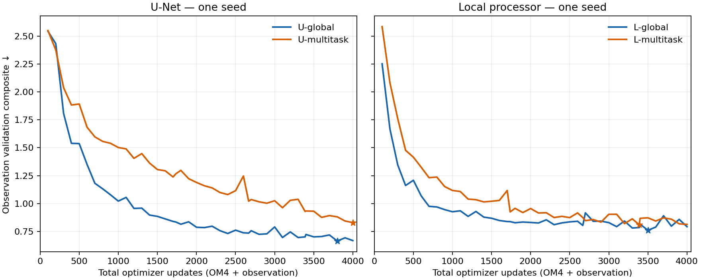

<!-- SPDX-FileCopyrightText: 2026 Samudra Authors -->
<!-- SPDX-License-Identifier: CC-BY-4.0 -->

# Global and native-quarter-degree patch transfer screen

**Completed October 3 at 9:41:55 a.m. ET.** All four arms completed 4,000 updates
and 96-origin held-out evaluations. Production job **209239** exited successfully
after 7:23:10 on `b1-11-s1-dgx-01-c01`. The sleep-loop monitoring is complete.
**This screen found no aggregate observation benefit from replacing half the
coarse-global OM4 updates with native quarter-degree patch updates:** held-out
composite error increased 19.9% within the U-Net family and 4.1% within the local
family. This is one seed and a short budget, not evidence that patch transfer
cannot work.
The active run root is
`/projects/ny/lz1955/multiscale/jrusak/runs/2026-10-02-extent-om4/runtime-v2`.
Earlier failed attempts and their recovery are retained below. Monitoring is
completed through the user-requested sleep loop, without queue resubmissions.

Approved October 2, 2026. One seed (1729), physical state first, no LLC,
no additional latent channels and no diffusion. Branch `codex/patch-global-om4`
starts from observation-report commit `4f1aaa8281b9c49f3e388f8734ab9e2ec067ab32`.
This screen asks whether replacing some coarse global model-data updates with
fine regional updates improves **global observational** forecasting.

| Literal run name | Processor | Global OM4 updates | Native quarter-degree patch updates | Global observation updates |
|---|---|---:|---:|---:|
| U-global | Geometry-conditioned D-style U-Net | 2,000 | 0 | 2,000 |
| L-global | Geometry-conditioned bounded local processor | 2,000 | 0 | 2,000 |
| L-multitask | Same local processor, shared across all tasks | 1,000 | 1,000 | 2,000 |
| U-multitask | Same U-Net, shared across the whole supplied global or regional field | 1,000 | 1,000 | 2,000 |

The primary comparisons are U-multitask versus U-global and L-multitask versus
L-global. The two processor families are **not parameter matched**. All arms
start from random weights. Within each family, global and multitask arms have
identical initialization. The existing report is an external reference; this
2k+2k screen is not an endpoint-budget reproduction of its 8k+8k model.

## Completed comparison

These are **96 independently initialized monthly forecasts, January 2015 through
December 2022**, not a continuous eight-year rollout. Surface integrated errors
average leads 5, 15 and 30 days; heat-content errors use calendar-month means.
Every model below uses global observation support. The four literal model names
are defined in the task table above and architecture section below.

| Model | Selected total update | Validation composite | Held-out composite ↓ | Integrated error ratio ↓ | Spectral error, dex ↓ | Initialized-state persistence ↓ |
|---|---:|---:|---:|---:|---:|---:|
| U-global | 3,800 | 0.6643 | 0.6784 | 0.8871 | 0.4696 | 0.5886 |
| U-multitask | 4,000 | 0.8293 | 0.8130 | 0.9167 | 0.7093 | 0.6026 |
| L-global | 3,500 | 0.7603 | 0.7546 | 0.8673 | 0.6419 | 0.5538 |
| L-multitask | 3,389 | 0.8097 | 0.7856 | 0.9642 | 0.6070 | 0.5890 |

All runs consumed the same 4,000-update total budget; checkpoint selection can
choose an earlier update. **Selection** uses the immutable validation seasonal
climatology denominators and 27 qualified spectral keys. **Held-out reporting**
uses the identical test-seasonal-climatology denominators shared by all four
arms, matching the [existing observation report](global-domain-results-2026-09-30.md).
Test metrics never choose a checkpoint. Validation and test composites therefore
use different cohorts and denominators and should not be read as a direct
train/generalization-gap estimate.

The composite is half the mean of five normalized integrated errors plus half
the mean of 27 spatial spectral errors across SST/ADT/EKE, three regions and
three leads. The integrated ratio divides each error by that of the common
seasonal-climatology control. Spectral error is measured in log10 power-ratio
units (dex), not percent. It is not a temporal-spectrum or century-rollout score.

“Initialized-state persistence” uses the selected model's initializer and holds
its inferred latest full state fixed through the forecast. It is model-dependent
because its subsurface state is learned; it does not invoke the evolution
processor. All four evolved forecasts lose to their own persistence on the
composite, largely because evolution worsens the spatial spectra. Three arms
improve the mean normalized integrated error relative to persistence;
L-multitask is nearly equal but slightly worse (0.9642 versus 0.9626). The
aggregate failure should not be read as every component worsening.
The common seasonal-climatology control scores **1.3201**. Anomaly persistence
also appears in the downloadable scores; it shifts the inferred interior T/S
by the training-climatology change into the target month, while preserving the
same surface persistence control.

| Model | SST RMSE °C | Geostrophic velocity RMSE m/s | EKE RMSE m²/s² | OHC 0–700 m RMSE GJ/m² | OHC 700–2000 m RMSE GJ/m² |
|---|---:|---:|---:|---:|---:|
| U-global | 0.6252 | 0.1156 | 0.02535 | 0.7002 | 0.4522 |
| U-multitask | 0.6217 | 0.1285 | 0.02715 | 0.7684 | 0.4216 |
| L-global | 0.6138 | 0.1246 | 0.02612 | 0.6499 | 0.4100 |
| L-multitask | 0.6704 | 0.1299 | 0.02643 | 0.7809 | 0.4897 |

Velocity and EKE here derive geostrophically from SSH; they do not directly score
the prognostic U/V channels. U-multitask slightly improves SST and deep OHC but
worsens velocity, shallow OHC and spectra. L-multitask slightly improves spectra
but worsens all five integrated errors. There is no consistent fine-to-coarse
transfer benefit in this configuration.

The curves use the same nine validation months at every checkpoint. Stars mark
the validation-selected weights. U-multitask is still improving at its last
checkpoint; the screen does not establish its converged performance. Local
multitasking largely catches up on validation, but its selected held-out score
is still worse. No extension or task change was made within this screen.
The user subsequently authorized the [mechanism ablations](extent-ablations-2026-10-03.md)
and [representation/capacity follow-ups](extent-representation-2026-10-03.md),
with autonomous iteration through Monday October 5 around 9 a.m. ET.

The defensible conclusion is limited to this fixed-update screen. It changes
resolution, field extent, and preprocessing release together; the patch core
also supplies far fewer scored cells per update. It does not isolate the reason
for negative transfer, match FLOPs, test native-quarter global evolution, or
evaluate LLC. The U/L families differ in parameter count and mixing, so their
cross-family ranking is not a controlled architecture attribution.

Machine-readable evidence: [all scores](artifacts/extent-wave-2026-10-03/scores.csv),
[validation curves](artifacts/extent-wave-2026-10-03/validation-curves.csv), and
[source metrics, hashes and completion records](artifacts/extent-wave-2026-10-03/source-results.json).

## Rollout maps and spectral diagnosis

These maps show day-30 five-day means for January and July 2022, the two fixed
illustrative origins inherited from the observation report. Each comparison
includes observations, both models in that family, and each model's initialized
persistence. Anomalies subtract the same training seasonal climatology. Gray
denotes land or missing observations; all candidates share the reference-valid
support and color limits. These examples are not an aggregate-skill estimate.

| Family | January SST anomalies | January SSH anomalies | July SST anomalies | July SSH anomalies | July absolute SST | July absolute SSH |
|---|---|---|---|---|---|---|
| U-Net | [Map](artifacts/extent-wave-2026-10-03/U-maps/day30-2022-01-anomalies-sst.png) | [Map](artifacts/extent-wave-2026-10-03/U-maps/day30-2022-01-anomalies-adt.png) | [Map](artifacts/extent-wave-2026-10-03/U-maps/day30-2022-07-anomalies-sst.png) | [Map](artifacts/extent-wave-2026-10-03/U-maps/day30-2022-07-anomalies-adt.png) | [Map](artifacts/extent-wave-2026-10-03/U-maps/day30-2022-07-fields-sst.png) | [Map](artifacts/extent-wave-2026-10-03/U-maps/day30-2022-07-fields-adt.png) |
| Local | [Map](artifacts/extent-wave-2026-10-03/L-maps/day30-2022-01-anomalies-sst.png) | [Map](artifacts/extent-wave-2026-10-03/L-maps/day30-2022-01-anomalies-adt.png) | [Map](artifacts/extent-wave-2026-10-03/L-maps/day30-2022-07-anomalies-sst.png) | [Map](artifacts/extent-wave-2026-10-03/L-maps/day30-2022-07-anomalies-adt.png) | [Map](artifacts/extent-wave-2026-10-03/L-maps/day30-2022-07-fields-sst.png) | [Map](artifacts/extent-wave-2026-10-03/L-maps/day30-2022-07-fields-adt.png) |

The July U-Net maps show weakened SSH anomalies after evolution, relative to
both observations and initialized persistence. Native multitasking does not
restore the lost structure. The local forecasts retain more visible surface
structure in this example, but still have weak EKE spectra across the cohort.

| Model | SST spectral error, dex | ADT spectral error, dex | EKE spectral error, dex |
|---|---:|---:|---:|
| U-global | 0.2130 | 0.0746 | 1.1211 |
| U-multitask | 0.2684 | 0.1669 | 1.6926 |
| L-global | 0.2701 | 0.1798 | 1.4759 |
| L-multitask | 0.1920 | 0.1785 | 1.4504 |

Each column averages its nine region/lead scores. The largest spectral deficit
is EKE. For example, day-30 Gulf Stream EKE **spectral power** is 0.67–2.10% of
the supplied reference across the three retained bins for U-global, versus
0.11–0.24% for U-multitask. These are power ratios, not EKE-amplitude ratios.

Part of the absolute EKE discrepancy comes from the established observation
operator convention: predictions differentiate coarse SSH, whereas references
use separately coarsened DUACS U/V. These operations do not commute. The
[earlier operator audit](snapshot-2026-09-23-methods.md) quantified that effect;
it is not an irreducible error floor or evidence of forecast error by itself.
Here, initialized persistence has mean EKE spectral error 0.6320 dex for all
four models, versus 1.12–1.69 after evolution, so evolution adds a substantial
deficit under the same reporting convention. The primary metric remains fixed.

Grace job **116881** extracted these cases from completed exports in 32 seconds,
without training or inference. Map extraction verified selected-weight hashes
against the training, selection and evaluation records. Detailed source and
render provenance: [U-Net](artifacts/extent-wave-2026-10-03/U-maps/provenance.json),
[local](artifacts/extent-wave-2026-10-03/L-maps/provenance.json).

## Final execution provenance

Training producer remained `ba22420144ef7576c324c40f74bae614ab77c1d4` throughout
production. Every final event confirms 2,000 OM4 plus 2,000 observation updates;
both multitask arms confirm exactly 1,000 global and 1,000 native patch updates.
Every evaluation marker confirms 96 test origins and the matching selected
checkpoint hash. No production retry or protocol change was needed.

| Model | Training completed, October 3 ET | Training-loop hours including validation | Selected checkpoint SHA256 |
|---|---|---:|---|
| U-global | 8:04 a.m. | 5.62 | `76058c08c74a92942612aedd75ee961a1c53125076dd449c77007710c05ea4eb` |
| U-multitask | 9:39 a.m. | 7.20 | `ec8d5969db37ae195aa50d9d3c79e1828765e619cbe2eb9736606d4f5247ed1d` |
| L-global | 6:24 a.m. | 3.95 | `8fb9e6950093dc1d5de8e50eb5272747380ee1e68cb19f9fe60a78e92d3c95f5` |
| L-multitask | 8:16 a.m. | 5.82 | `3934584f8d1c6d4593156cb39f08d1fc532f1dceaebb7d0953a8574da66cb36f` |

Slurm reports production `COMPLETED`, exit 0, **26,590 seconds on four GPUs**:
29.54 allocated GPU-hours. Including all original and replacement GPU
qualification jobs, including failed attempts, the wave used **30.56 allocated
GPU-hours**. This includes idle capacity after the faster arms finished and is
not a FLOP estimate. CPU transfer/cache work is separate. Each run met the
requested less-than-one-day runtime target. No monitor timer was created;
the requested sleep loop ends after these checks and this report.

## Fields and tasks

Global OM4 uses the existing, unfiltered five-day-mean `om4_onedeg_v3` store at
`/mnt/home/jrusak/data/diffusion-interior-beta/data/om4_onedeg_v3`: 180×360.
Regional OM4 uses the **native values**, without resizing or averaging, from
`s3://m2lines-pubs/Samudra/v2026-09/om4_quarterdeg/OM4.zarr`: 720×1440.
Its verified transfer destination is
`/projects/ny/lz1955/multiscale/jrusak/data/om4/v2026-09/om4_quarterdeg`.
These are different preprocessing releases of OM4; the screen does not isolate
release effects from the resolution/extent intervention.

Each regional example supplies a 128×128 native-resolution crop (approximately
32°×32°), predicts six five-day steps, and scores the central 64×64 cells
(approximately 16°×16°). The 32-cell halo is supplied context. Regional edges
use zero padding, not periodic wrap. Crops may cross the geographic dateline,
but that does not connect opposite edges of the regional computational domain.
There is no future ocean-state boundary forcing or teacher forcing.

Origins are deterministic functions of the sample seed; spatial origins are
sampled across the entire native source. Reject cores with under 20% surface wet
support. Latitude crops stay in bounds; longitude extraction wraps. All 25
frames of each training trajectory lie on or before 2013-10-04, matching the
global OM4 training cutoff. No observation test data enter these tasks.

All models retain 77 physical channels: T/S/U/V at 19 depths and SSH. The
initializer consumes 19 historical five-day SST/SSH and forcing frames (95 days)
and their validity, plus spherical geography and season. It produces two full
states. The processor consumes those two states, current forcing and geometry,
and predicts the next full state. Observed surface values overwrite initializer
outputs where valid; artificially hidden values supply a completion loss.

The OM4 tasks use native `tauuo`, `tauvo`, `hfds`; observations use the existing
8→32→3 ERA5 adapter. State scaling uses the same observation-training physical
channel constants on both resolutions. Forcing uses the existing global OM4
constants on both resolutions. There is no per-cell physical normalization.
Regional completion uses synthetic hiding over native wet support; global OM4
also emulates the existing observation coverage. This distinction is recorded,
not treated as a controlled missingness experiment.

The existing observation samples are unchanged at
`/mnt/home/jrusak/data/obs_full_range/d-observation-pilot/samples`: 180×360,
243 training months, nine validation months, 96 test months. They retain the
existing 19-frame histories, six/seven forecast bins, monthly interior targets,
strict five-day surface support and calendar-month integration.

## Architecture

The common initializer is the current report's small, affine-InstanceNorm
ConvNeXt U-Net (widths 128/192/256/384), not original D's larger initializer.
Global calls use periodic longitude and zero latitude padding; patch calls use
zero padding in both directions. Its weights and OM4 input adapter are shared
between coarse global and native fine regional calls.

The U processor uses the corresponding D-style U-Net and affine InstanceNorm.
Its operations and spatial normalization can mix over the entire supplied
field. This is the intended full multitask hypothesis, not an assertion that
U-Net crop and global outputs are equal.

The L processor has a 512-channel pointwise input projection, four residual
blocks, and a pointwise output. Each block has one depthwise 3×3 convolution,
512→1024→512 pointwise mixing, GELU, and learned residual scale initialized to
0.1. There is no spatial pooling or input-dependent normalization. Single-step
radius is four cells; six-step radius is 24 cells. Crop equivalence therefore
holds in the scored core **conditional on equal supplied states and geometry**.
It does not hold end to end through the common nonlocal initializer.

Both processors receive the same geometry interface: supplied spherical xyz
coordinates and season, local zonal/meridional spacing, supplied field extent,
regional flag, wet surface and fraction of wet physical slots. Spacing is
computed from coordinates, never inferred as 360 divided by tensor width.
A zero-initialized learned pointwise projection injects these additional
geometry planes. Source-specific OM4/observation input adapters are retained;
native patches share the OM4 adapter.

| Family | Initializer parameters | Processor including adapters/geometry | ERA5 adapter | Total |
|---|---:|---:|---:|---:|
| U | 31,281,670 | 31,685,623 | 387 | 62,967,680 |
| L | 31,281,670 | 4,399,879 | 387 | 35,681,936 |

## Training and evaluation

Use the existing one-optimizer mixed schedule, increasing observation frequency
through training. Multitask arms alternate global/patch on successive OM4
updates. AdamW, learning rate 1e-4 for both sources, weight decay 0.01, gradient
clip 1, effective batch eight by accumulation, no warmup. OM4 optimizes the
existing variable-balanced full-state six-step forecast loss plus 0.1 initial
interior reconstruction and 0.1 surface completion, scoring only the regional
core on patch tasks. Observation losses remain unchanged.

Selection uses the exact full-global reference from the current report:
0.5 × mean normalized integrated errors + 0.5 × mean 27 spectral errors in dex.
Validation runs every 100 total updates and at observation milestones
500/1000/1500/2000. Report held-out test metrics and inferred-state persistence
using the existing evaluator only after training and validation selection finish.
Training MSE is diagnostic, not the selection criterion. Physical-size or
supervised-cell equivalence is not claimed from equal update counts.

## Qualification and execution

Reuse the pinned ARM64 PhysicsNeMo image
`sha256:d7cf627257df3e1fda74202435e00f55c15ebe2d2be9648f47daf31905f51bad`.
Fit each architecture for ten updates on one training observation example.
Each arm then runs the existing six-OM4/four-observation joint probe, including
gradient routing, strict state serialization/restoration and measured native
versus serialized next-update replay. Multitask probes exercise native patches.
Production requires matching producer/data/model qualification contracts.

Before training, rehash all 350 observation NPZ files. The native patch cache
packs float32 fields into 128×128 spatial chunks and keeps separate SST/SSH
history arrays; it changes storage layout only. Every physical frame is read
back and compared exactly (including land NaNs); wet values must be finite.
Cache creation waits for the full quarter-degree transfer/readback job 114235.

Beta_test qualifications use one GPU each. Production uses one full beta node
with four independent one-GPU arms, with Slurm afterok dependencies on all four
arm probes. Fit and patch probes stay held until their data are verified. A
bounded CPU-light readiness bridge on the beta login host releases only those
recorded held jobs; it uses no GPU allocation and creates no conversation timer.
Ordinary long beta queue waits are expected; do not cancel/resubmit to chase
capacity. Production has a 24-hour allocation and a 20-hour training cap per
arm. Probe timing must predict at most 18 hours for the 4,000 training updates;
otherwise production fails before training rather than silently changing budgets.

Entry points: `scripts/run_extent_wave.py`, `scripts/slurm_extent_beta.sbatch`,
`scripts/prepare_om4_patch_cache.py`, and
`src/samudra/experiments/{extent_models,extent_data,extent_training}.py`.
The launch root records frozen paths, producer hash, selection reference,
scheduler IDs, readiness releases and logs. Production completion requires
actual `TRAIN_COMPLETE.json` and held-out evaluation `COMPLETE.json` outputs.

## Submission snapshot, October 2 at approximately 10:45 a.m. ET

Pinned producer: `ec9ecf916ebbff21306f8c3aa94553c8165f3a23`.
Source archive SHA256:
`29b28bb5aa05e22c051a6ca60a9fcb8a7fd1f258c8673f405b69a8f9be5a21fc`.
Exact existing full-global selection-reference SHA256:
`c94c0601e168858e4ba41423aed74d8604eaa1efbc68dd76370b32b8eeacd26c`.
Launch root:
`/projects/ny/lz1955/multiscale/jrusak/runs/2026-10-02-extent-om4`.
The complete submission commands and dependency IDs are in `jobs.json` there.

| Scheduler | Job | Purpose | Observed status |
|---|---:|---|---|
| Alpha/Grace | 114309 | Rehash all observation inputs | Verification output confirms all 350 files match; finished |
| Alpha/Grace | 114235 | Quarter-degree transfer and full readback | Running |
| Alpha/Grace | 114311 | Lossless native patch cache and readback | Pending transfer success |
| Beta | 209206 | U architecture fitting | Released after observation verification; pending resources |
| Beta | 209208 | L architecture fitting | Released after observation verification; pending priority |
| Beta | 209210 | U-global resume/gradient/throughput probe | Pending successful U fitting |
| Beta | 209212 | L-global resume/gradient/throughput probe | Pending successful L fitting |
| Beta | 209214 | L-multitask probe | Held for verified cache; also requires successful L fitting |
| Beta | 209216 | U-multitask probe | Held for verified cache; also requires successful U fitting |
| Beta | 209218 | Four-arm production and held-out evaluation | Pending successful completion of all four probes |

The readiness bridge on beta is PID 4007051; its receipt is
`gate-process.json`, its releases are in `released.json`, and its log is
`logs/readiness-gate.log`. It has released only 209206 and 209208 so far.
No GPU training or scientific result is claimed in this snapshot.

Local validation passed: 23 tests covering extent geometry, six-step crop
equivalence conditional on supplied states, boundary restoration, checkpointed
geometry gradients, native sample timing/repeatability, exact task counts,
existing joint resume/gradient routing, global observation support, completion,
latent-state compatibility, and task scheduling. Mypy passed for all eight new
Python files/tests and the five modified Python modules. Ruff and shell syntax
checks passed.

## Monitoring recovery, October 2 late morning

The user requested an in-conversation sleep loop, with longer sleeps during
ordinary queue waits. No conversation timer was created.

The first two fitting jobs completed successfully. Global joint probes 209210
and 209212 failed before training because the container lacked the optional
Rust loader. Their logs and the successful fitting outputs remain in the original
root. The unstarted patch probes 209214/209216 and blocked production 209218 were
cancelled for this concrete runtime repair, not to chase cluster availability.

Training recovery root: `<launch-root>/runtime-v2`.
Training producer: `ba22420144ef7576c324c40f74bae614ab77c1d4`.
The loader was built from the pinned Rust source, passed 90 loader/extent/joint
CPU tests (four CUDA/manual tests deselected), and constructed successfully on
beta. The wheel SHA256 is
`13b05ce0e69b9e1e54fda416e0d34cb6886108f2713749018fea58ce4a592c6b`;
the extension binary SHA256 is
`b6c47dc2ea183b482b9d1faf3d704ad5068bfee975f133f930b276936a75969c`.
Launches check the binary hash and actually construct the loader before starting
a fitting or training process. Qualification and resume contracts bind the
runtime package hash as well as the code producer. Fresh fitting was rerun;
old certificates were not relabeled.

| Replacement beta job | Purpose | Observed status |
|---:|---|---|
| 209227 | U fitting | Passed; training-example loss 1.70294 → 0.28793 |
| 209229 | L fitting | Passed; training-example loss 1.55556 → 0.95169 |
| 209231 | U-global joint probe | Running; native OM4 cache warmup reached |
| 209233 | L-global joint probe | Running; native OM4 cache warmup reached |
| 209235 | L-multitask joint probe | Held until the native cache is verified |
| 209237 | U-multitask joint probe | Held until the native cache is verified |
| 209239 | Four-arm production/evaluation | Pending all four replacement probes |

Both fresh fitting checks reached the initializer, evolution, ERA5 adapter and
completion head. These one-example fitting numbers are not scientific skill
results. The original login-host readiness bridge is superseded; the authorized
monitoring loop will release only the replacement patch jobs after checking the
cache marker and hashes.

Transfer job 114235 completed at **11:30 a.m. ET** with all 385,269 files /
1,594,021,374,932 bytes verified. CPU cache attempt 114311 failed immediately
because its environment lacked cftime. An isolated cftime 1.6.4.post1 ARM runtime
was staged without modifying shared environments. Attempt 114399 then exposed
an overly strict exact-five-day assertion in the new cache builder.

Live metadata checks established that quarter-degree and global OM4 timestamps
are **identical**, including Julian calendar/units and 16 six-day gaps across the
full 1958–2022 series. The existing global task already uses nominal five-day
stepping over this series. Cache producer
`909a6d60cebcc24f7a4dd86ce4b8cde2ee5e9c9e` now requires exact timestamp agreement
with that baseline and records the five/six-day gap counts. It does not resample
or change the training timestep convention. A regression test rejects shifted
timestamps, differing calendars and unexpected gaps. All 19 quarter-degree depth
coordinates also match the shared state depths exactly, and the builder checks
that match. The cache-only correction does not alter training producer ba2242014.

Grace cache job **114412** is running with the corrected guard and isolated CPU
dependency. Native physical values, wet-finite checks and full cache readback
verification remain required before releasing patch probes.

At approximately **11:45 a.m. ET**, both replacement global probes completed
their six OM4 / four observation updates and wrote `JOINT_QUALIFIED.json` with
`resume_verified: true`. U-global measured 6.77 seconds/update and L-global
5.35 seconds/update, implying roughly **7.53 and 5.95 training hours** respectively
for 4,000 updates before validation/data-startup overhead. Peak allocated GPU
memory was 71.68 / 71.57 GiB, including the 54.63 GiB resident global training
cache. These measurements satisfy the screen's throughput gate. Production
still waits for the two native-patch probes; their cache is actively building
and has begun reporting exact-readback-verified frames.

At **1:16 p.m. ET**, cache job 114412 was confirmed `COMPLETED`, exit 0,
after 1:32:11. All **2,903** frames passed exact readback and wet-finite checks.
The monitor independently checked the completion flags and final manifest/grid
hashes, then released patch probes **209235 and 209237**. Their release receipt is
`runtime-v2/patch-release.json`. Cache manifest SHA256:
`3e77922069af5ef7dc188043b8a6b65f30fa5a91f65ee986b951d9197e51e3d5`;
grid SHA256:
`5ffa767dd688880029ee23141edcfbf0d3004e61c314e4a8df212d3006c126aa`.
Production 209239 remains dependent on both patch probes passing.

By approximately **2:15 p.m. ET**, both native patch probes completed successfully:
209235 in 9:30 and 209237 in 9:49. Their structured events confirm three global
OM4 updates, three native-quarter patch updates and four observation updates;
both wrote `resume_verified: true`. L-multitask measured 7.97 seconds/update
(8.86 hours for 4,000 updates) and U-multitask 8.72 seconds/update (9.69 hours),
excluding validation/startup overhead. Both meet the throughput gate.

All four qualification dependencies are now satisfied. Production **209239**
is pending beta priority. Slurm's point-in-time estimate was **2:30 a.m. ET on
October 3** (06:30 UTC); this is not a guaranteed start. No resource requests
were changed in response to the ordinary queue wait. Monitoring continues with
longer sleep intervals during this wait. No production scientific result is
claimed yet.

At **2:25 a.m. ET October 3**, production 209239 was confirmed `RUNNING`
(start 06:18:45 UTC). All four child processes reached their 2,829-frame global
OM4 cache warmup, each allocating 54.63 GiB for that cache. The pinned container
reported PyTorch 2.9.0a0, CUDA 13.0 and NVIDIA GB200. No traceback was present in
the startup logs. The overnight queue wait required no resubmission or resource
changes. First production updates and scientific validation remain to be checked.

At **2:31 a.m. ET**, structured events confirmed first production updates in
every arm: U-global 42 (37 OM4 / 5 observation), L-global 67 (59 / 8), and each
multitask arm 28 (13 global OM4 / 12 native patch / 3 observation). Reported
losses and gradient norms were finite. The first scheduled 100-update validation
has not yet been reached by every arm; these training losses are not the primary
comparison metric.

At **2:46 a.m. ET**, production remained healthy with no traceback in any arm's
log. Latest available observation validation scores were 2.432 at update 200
(U-global), 1.161 at update 400 (L-global), 2.584 at update 100 (L-multitask),
and 2.549 at update 100 (U-multitask). These are the frozen integrated-plus-spectral
composite, lower is better. Counts differ because the processors and native-data
tasks have different throughput; these early values must not be interpreted as
matched-budget evidence for or against patch transfer. Training and monitoring
continue without changing the approved protocol.

At **5:19 a.m. ET**, production had run three hours with no failed arm.
L-global had reached 3,110 updates, U-global 2,267, L-multitask 1,936 and
U-multitask 1,674. Best observation validation scores so far were respectively
0.793, 0.784, 0.919 and 1.293, at unequal budgets; the held-out comparisons
remain pending. Based on observed progress and the increasing observation-task
fraction, L-global is expected to enter evaluation around 6:30 a.m. ET and the
other arms roughly 8–10 a.m. ET. These are runtime estimates, not guaranteed
completion times. No scientific or execution protocol changes were needed.

At **6:30 a.m. ET**, L-global had completed at 6:23:57 a.m. ET, exactly
2,000 global OM4 plus 2,000 observation updates. Both `TRAIN_COMPLETE.json` and
`test-selected/COMPLETE.json` were present. The latter confirms all 96 held-out
monthly origins and the selected checkpoint SHA256
`8fb9e6950093dc1d5de8e50eb5272747380ee1e68cb19f9fe60a78e92d3c95f5`, matching the
training marker. Its best validation composite was 0.760346 at total update
3,500 (1,915 OM4 / 1,585 observation), selected using validation only. U-global,
L-multitask and U-multitask continued without errors at 3,051, 2,753 and 2,291
updates respectively. Final transfer conclusions await those completed runs.
