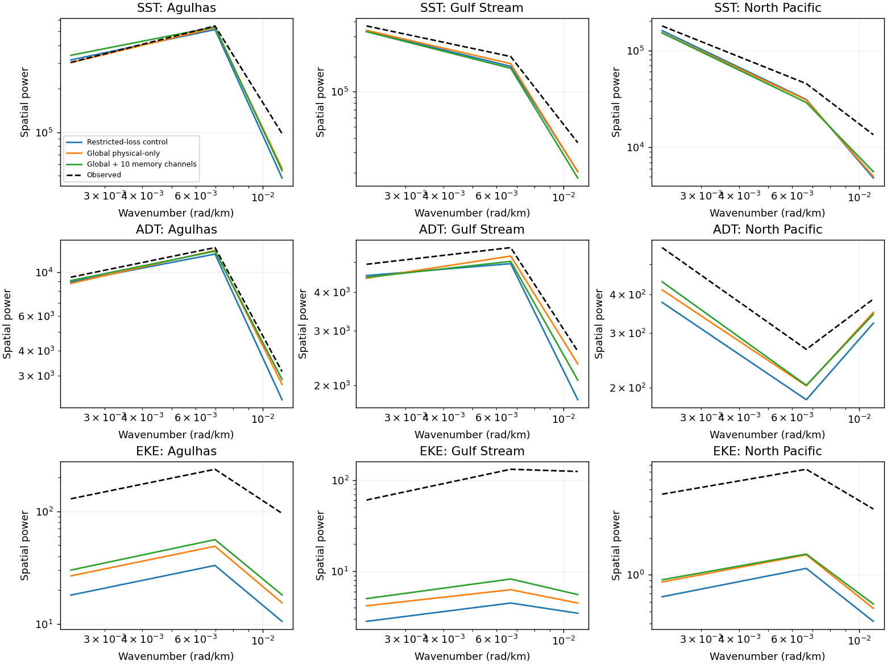
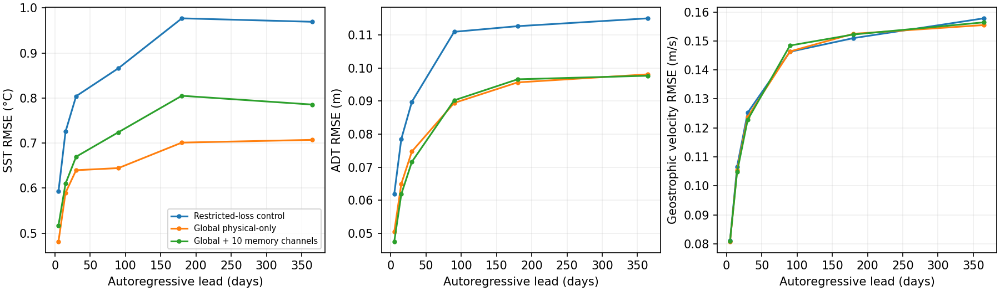
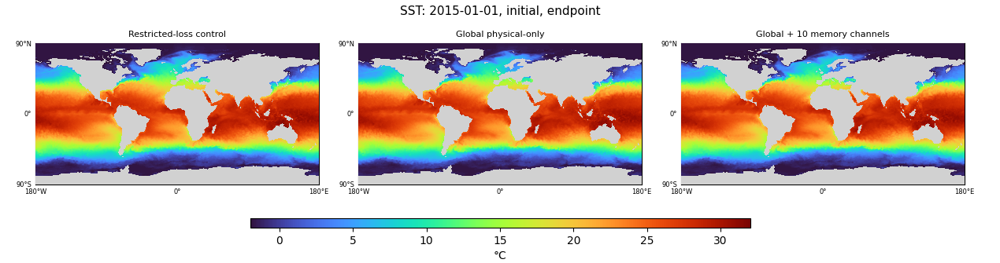
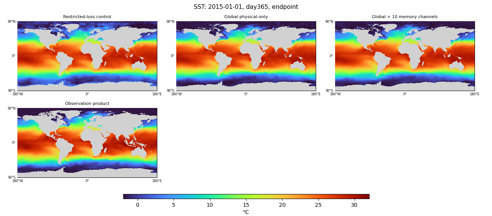
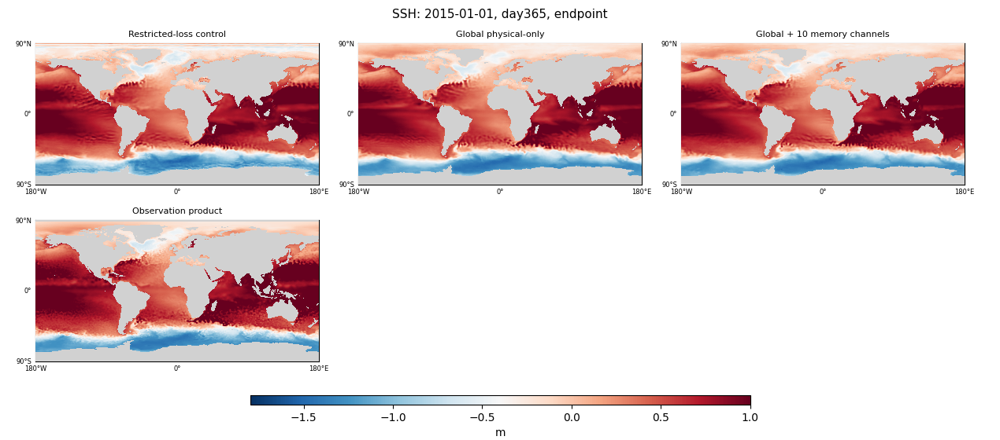
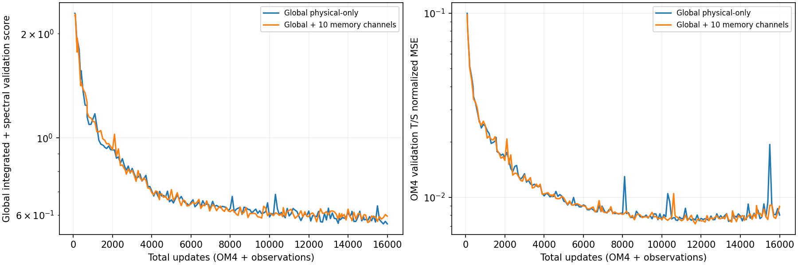

<!-- SPDX-FileCopyrightText: 2026 Samudra Authors -->
<!-- SPDX-License-Identifier: CC-BY-4.0 -->

# Global observation supervision and explicit memory: matched comparison

All three models are evaluated globally on common finite observation/model wet support. The primary comparison uses the same **8,000 OM4 + 8,000 observation updates**. Lower errors are better. The control was trained with observation losses limited to ±60°; both new runs remove that restriction.

**Removing the cutoff helps substantially; extra memory does not show a consistent benefit.** Global physical-only reduces the endpoint composite by 29.3% (0.8388 → 0.5927), mostly through SST and heat-content improvements. Mean day-365 SST error falls 27.1% (0.969 → 0.707°C). Northern polar SST error falls 64.7%, southern polar SST error 73.8%; midlatitude SST improves only 5.4%. The available polar observations therefore provided useful supervision that the previous losses discarded.

The memory model is slightly worse at the matched endpoint (0.6064 versus 0.5927), including 11.1% worse annual SST. Its selected checkpoint narrowly wins the monthly composite (0.5913 versus 0.5993), but annual SST is still worse (0.859 versus 0.723°C). Memory marginally improves spectra, northern polar errors and endpoint annual SSH; those mixed results do not justify declaring it the better model. The simpler global physical-only model is the stronger default from this one-seed comparison.

This does **not** eliminate all gross errors. Annual maps retain ripples in SSH, subsurface temperature and internal velocities, and excessively cold SST cells. Geostrophic velocity improves little. The forecast composite also remains worse than persistence of each model’s initialized state. Keep global supervision for follow-ups; defer a stronger claim about useful learned memory until a targeted intervention or replicated comparison.

## Matched-budget monthly results

These are 96 independently initialized calendar-month forecasts in 2015–2022, not one continuous eight-year rollout. The integrated components average leads 5, 15 and 30 days, except OHC, which compares calendar-month means. Every table here uses global support. For orientation, the identical selected control previously scored 0.5932 on ±60° support and scores 0.8330 after global rescoring; the change in that number is entirely evaluation, without retraining.

| Model | Composite | Initialized-state persistence | SST °C | Geostrophic velocity m/s | EKE m²/s² | OHC 0–700 GJ/m² | OHC 700–2000 GJ/m² | Spectral dex |
|---|---:|---:|---:|---:|---:|---:|---:|---:|
| Restricted-loss control | 0.8388 | 0.7184 | 0.708 | 0.1059 | 0.02362 | 1.065 | 1.071 | 0.376 |
| Global physical-only | 0.5927 | 0.5682 | 0.577 | 0.1048 | 0.02338 | 0.740 | 0.422 | 0.344 |
| Global + 10 memory channels | 0.6064 | 0.5827 | 0.623 | 0.1047 | 0.02329 | 0.808 | 0.435 | 0.338 |

The composite is half the mean of five integrated errors divided by the same global held-out seasonal-climatology errors, plus half the mean of the 27 validation-qualified regional spectral log10 errors. “Dex” measures log10 power-ratio error; it is not a percentage. Training-only climatology is a scoring reference and an explicit baseline, not an initializer fallback. Geostrophic velocity/EKE derive from SSH, not the model’s internal U/V channels. Persistence holds that model’s inferred initial ocean state fixed, including its learned interior; it is therefore model-dependent, not a shared raw-observation-only baseline. Every endpoint forecast loses to its own persistence on this composite, despite useful surface forecast skill. Anomaly persistence and all underlying components are retained in the comparison artifact.

## Continuous annual forecasts

One initialization followed by 73 five-day autoregressive steps, with prescribed ERA5 forcing and no future surface-state corrections. Values below average the day-365 errors over January 2015, 2018 and 2021 starts; these are final-lead errors, not annual averages.

| Model | Day-365 SST °C | Day-365 ADT m | Day-365 geostrophic velocity m/s |
|---|---:|---:|---:|
| Restricted-loss control | 0.969 | 0.1150 | 0.1578 |
| Global physical-only | 0.707 | 0.0981 | 0.1555 |
| Global + 10 memory channels | 0.785 | 0.0977 | 0.1564 |

Global area averages can hide polar changes. The following band-specific SST/ADT errors use finite targets in each band, with cosine-latitude weights within the band, and average the same three day-365 cases. Available analyzed-product values under ice are not equivalent to direct sensor coverage. Naturally missing cells still have no truth-based score.

| Model | North of 60N SST °C | North ADT m | South of 60S SST °C | South ADT m | ±60° SST °C | ±60° ADT m |
|---|---:|---:|---:|---:|---:|---:|
| Restricted-loss control | 2.0950 | 0.2202 | 2.0027 | 0.1106 | 0.7563 | 0.1077 |
| Global physical-only | 0.7385 | 0.0790 | 0.5249 | 0.0434 | 0.7155 | 0.1012 |
| Global + 10 memory channels | 0.7043 | 0.0747 | 0.5610 | 0.0441 | 0.8009 | 0.1009 |

## Full-grid maps

Each model tile uses one image pixel per grid location, common color limits and full polar coverage. Gray is model land; missing reference values are also gray. Color clipping counts and full numeric ranges are retained in the comparison artifact. Internal T/S/U/V plots are diagnostics rather than observation-validated full ocean reconstructions.

The maps use fixed, shared scales; they do not establish physical plausibility by themselves. For the 2015 day-365 case, SST minima are **−7.01°C (control), −4.24°C (global physical-only), and −3.45°C (memory)**, versus −1.80°C in the reference. These cold extremes saturate the −2°C lower color limit. Global supervision reduces the error, but does not enforce a freezing constraint or remove the visible wave-like structures in internal U/V and SSH.

| Field | Initial 2015 | Day 30, 2015 | Day 365, 2015 | Day 365, 2018 | Day 365, 2021 |
|---|---|---|---|---|---|
| SST | [map](artifacts/2026-09-30-global-domain/endpoint-2015-01-01-initial-channel0.png) | [map](artifacts/2026-09-30-global-domain/endpoint-2015-01-01-day30-channel0.png) | [map](artifacts/2026-09-30-global-domain/endpoint-2015-01-01-day365-channel0.png) | [map](artifacts/2026-09-30-global-domain/endpoint-2018-01-01-day365-channel0.png) | [map](artifacts/2026-09-30-global-domain/endpoint-2021-01-01-day365-channel0.png) |
| Temperature at 550 m | [map](artifacts/2026-09-30-global-domain/endpoint-2015-01-01-initial-channel1.png) | [map](artifacts/2026-09-30-global-domain/endpoint-2015-01-01-day30-channel1.png) | [map](artifacts/2026-09-30-global-domain/endpoint-2015-01-01-day365-channel1.png) | [map](artifacts/2026-09-30-global-domain/endpoint-2018-01-01-day365-channel1.png) | [map](artifacts/2026-09-30-global-domain/endpoint-2021-01-01-day365-channel1.png) |
| Surface salinity | [map](artifacts/2026-09-30-global-domain/endpoint-2015-01-01-initial-channel2.png) | [map](artifacts/2026-09-30-global-domain/endpoint-2015-01-01-day30-channel2.png) | [map](artifacts/2026-09-30-global-domain/endpoint-2015-01-01-day365-channel2.png) | [map](artifacts/2026-09-30-global-domain/endpoint-2018-01-01-day365-channel2.png) | [map](artifacts/2026-09-30-global-domain/endpoint-2021-01-01-day365-channel2.png) |
| Surface zonal velocity | [map](artifacts/2026-09-30-global-domain/endpoint-2015-01-01-initial-channel4.png) | [map](artifacts/2026-09-30-global-domain/endpoint-2015-01-01-day30-channel4.png) | [map](artifacts/2026-09-30-global-domain/endpoint-2015-01-01-day365-channel4.png) | [map](artifacts/2026-09-30-global-domain/endpoint-2018-01-01-day365-channel4.png) | [map](artifacts/2026-09-30-global-domain/endpoint-2021-01-01-day365-channel4.png) |
| Surface meridional velocity | [map](artifacts/2026-09-30-global-domain/endpoint-2015-01-01-initial-channel5.png) | [map](artifacts/2026-09-30-global-domain/endpoint-2015-01-01-day30-channel5.png) | [map](artifacts/2026-09-30-global-domain/endpoint-2015-01-01-day365-channel5.png) | [map](artifacts/2026-09-30-global-domain/endpoint-2018-01-01-day365-channel5.png) | [map](artifacts/2026-09-30-global-domain/endpoint-2021-01-01-day365-channel5.png) |
| SSH | [map](artifacts/2026-09-30-global-domain/endpoint-2015-01-01-initial-channel6.png) | [map](artifacts/2026-09-30-global-domain/endpoint-2015-01-01-day30-channel6.png) | [map](artifacts/2026-09-30-global-domain/endpoint-2015-01-01-day365-channel6.png) | [map](artifacts/2026-09-30-global-domain/endpoint-2018-01-01-day365-channel6.png) | [map](artifacts/2026-09-30-global-domain/endpoint-2021-01-01-day365-channel6.png) |

## Selection and source-task retention

Both new models use global integrated-plus-spectral validation (protocol v4), with exactly the same frozen reference and nine November 2013–July 2014 origins. The historical control was selected with the restricted protocol v3. Consequently selected-checkpoint comparisons below combine selection-domain and training changes; the matched endpoints above are the primary comparison. Curves show only the two comparable global objectives.

| Model | Selected OM4 / observation updates | Selected global test composite | Endpoint OM4 validation T/S MSE |
|---|---:|---:|---:|
| Restricted-loss control | 7,798 / 6,902 | 0.8330 | 0.01070 |
| Global physical-only | 7,975 / 7,825 | 0.5993 | 0.00801 |
| Global + 10 memory channels | 7,852 / 7,148 | 0.5913 | 0.00893 |

[Selected-checkpoint SST at day 365, 2015](artifacts/2026-09-30-global-domain/selected-2015-01-01-day365-channel0.png) and [selected regional spectra](artifacts/2026-09-30-global-domain/selected-regional-spectra-day30.png). All selected and endpoint metrics, persistence controls and three annual cases remain in the numerical artifact.

## Model and training details

| Literal result-table name | Meaning | Parameters | Persistent channels per state |
|---|---|---:|---:|
| Restricted-loss control | Previously completed Small conditioned mixed; observation forecast/interior reconstruction losses limited to ±60°. Inputs and surface completion already global. Rescored here globally. | 62,966,546 | 77 |
| Global physical-only | Fresh matched rerun, removing the polar cutoff from observation forecast/interior reconstruction losses and validation/evaluation. | 62,966,546 | 77 |
| Global + 10 memory channels | Same global rerun with ten additional initialized and autoregressed state slots; no direct latent targets, physical scaling or added latent penalty. | 63,363,656 | 87 |

All models use the small D ConvNeXt U-Net, InstanceNorm, widths 128/192/256/384, one block per level, dilations 1/2/4/8, periodic longitude padding and zero latitude padding. They share initializer and processor backbones across tasks, with source-specific identity-initialized 1×1 input adapters. The initializer consumes 19 five-day frames (95 days), surface validity, forcing, spherical geographic coordinates and annual sine/cosine; it predicts two states. The processor autoregresses from the two previous states. The physical slots are T/S/U/V at 19 depths plus SSH. The added memory slots use ocean wet support and retain gradients across the training rollout; fitting qualification confirms gradients reach their initializer and processor outputs. Annual memory amplitudes are retained in the numerical artifact, but no memory-intervention ablation was performed here.

One seed (1729); AdamW, learning rate 1e-4, weight decay 0.01, gradient clipping 1, effective batch 8, no warmup. Each fresh run starts from random weights and follows the same mixed schedule of 8,000 OM4 plus 8,000 observation updates, with increasing observation frequency and no exclusive-observation finish. This is matched by updates, not exact FLOPs; the memory model has 0.63% more parameters. There is no separate reconstruction-only phase.

OM4 uses its original forcings and full-state forecast/reconstruction supervision. Observations use ERA5 through the learned adapter: 0.8 monthly T/S loss + 0.1 SST + 0.1 SSH, plus 0.1 interior reconstruction and 0.1 artificial-gap surface completion. Coefficients are not percentages of gradient contribution. The observation reconstruction term initializes from contemporaneous histories throughout the month; those later observations do not enter the forecast trajectory. Forecast training spans six OM4 steps or six/seven observation steps covering a calendar month; annual forecasts are evaluation-only.

Inputs have no polar latitude cutoff in any arm. Global treatment losses and scores retain all finite wet support, while land and missing targets remain masked. Geostrophic diagnostics retain their equatorial validity exclusion; SST/SSH/T/S do not exclude the equator. Normalization constants are held fixed across arms, including their original fitting domain; applying an affine normalization does not mask polar inputs or targets. The grid remains the 180×360 OM4 Gaussian grid, with conservative observation remapping and the same data/split manifests.

## Verification and limits

Actual endpoint and selected checkpoint hashes, full task budgets, training producers, global evaluation flags and exact monthly/annual cohorts were checked. Both new arms passed independent fitting and mixed-task resume-equivalence probes; the memory probe additionally checks latent-head gradient reach. Array hashes and native-grid map pixels were verified; the separate polar reductions reproduce the evaluator’s global SST/ADT errors before splitting into latitude bands.

Fresh-wave allocated GPU use, including qualification and control rescoring: **24.619 GPU-hours**. Historical control training belongs to the prior wave and is not charged again. CPU export jobs are included in the accounting with zero GPUs.

The memory comparison also changes interface parameter count; there is no parameter-count-matched control. All three models use OM4, so this wave does not re-estimate the OM4-versus-scratch benefit. One seed, three annual cases, prescribed future forcing and uncertain ice-region product interpretation limit generalization. Polar maps without finite reference values are qualitative only. Neither a better composite nor a plausible map establishes physically interpretable latent slots or a calibrated predictive distribution.

[Verified metrics and accounting](artifacts/2026-09-30-global-domain/evidence.json.gz), [derived tables and map audit](artifacts/2026-09-30-global-domain/comparison.json.gz), [array-transfer receipts](artifacts/2026-09-30-global-domain/array-manifests.json.gz), and [protocol / job provenance](global-domain-rerun-2026-09-29.md).

Training producers: physical-only `79025a163817a577ab81af95b401f5cb0563cd12`; memory `b95179b963d372b72333c7f0e7e521a67b51ff6e`; historical control `053e34947932fdb56c6baf2c717a23f2df3cc733`. The annual evaluator’s legacy human-readable selection label still says v3; actual selection is established from each training manifest/reference (v4 for both new arms), and global scoring is separately verified by its explicit input flag.
