<!-- SPDX-FileCopyrightText: 2026 Samudra Authors -->
<!-- SPDX-License-Identifier: CC-BY-4.0 -->

# Global physical-only: initialization, day-30 structure and annual heat content

**OM4 mixing helps at equal observation exposure, but twice as many observation updates closes the monthly score gap.** At day 30, mixed training reaches SST/SSH RMSE of 0.640°C/0.0792 m; obs-only reaches 0.694°C/0.0886 m at 8k and 0.572°C/0.0826 m at 16k. Mixed retains better day-30 SSH spectra and visibly less pronounced annual SST ripples. Learned initializer T/S fields are very similar at the endpoints. These results suggest a benefit to forecast structure, rather than a large unique advantage in recovering the initial interior state.

This report compares the **final global physical-only mixed model** with a **matched observation-only run at 8k and 16k**. The day-30 spectra and surface-error diagnostics remain separate from the added **day-365-only spectra** below; no spectral curve blends rollout leads. The established combined benchmark is separately labeled because it also includes other leads and monthly OHC. Annual global means, OHC totals in ZJ and maps remain diagnostic. None of the three endpoints beats its own inferred-initial-state persistence on that combined benchmark.

## Which checkpoints are being compared?

| Literal model label | Total optimizer updates | OM4 updates | Observation updates | Meaning |
|---|---:|---:|---:|---|
| Final: 8,000 obs | 16,000 | 8,000 | 8,000 | Mixed trajectory, fixed endpoint |
| Obs-only: 8,000 obs | 8,000 | 0 | 8,000 | Fresh observation-only trajectory; equal observation exposure |
| Obs-only: 16,000 obs | 16,000 | 0 | 16,000 | Same observation-only trajectory; equal total optimizer updates |

This is the **62,966,546-parameter Small conditioned mixed global** model on the 180×360 OM4 Gaussian grid: 77 physical state slots, affine InstanceNorm, an initializer and processor shared across tasks with source-specific, identity-initialized 1×1 input adapters, and no additional memory channels. Training starts from random weights and mixes OM4 with observations throughout; observation frequency increases with training. The mixed endpoint includes both sources throughout training, rather than a pure OM4 pretraining phase followed by fine tuning. There is no observation-only finish. The final checkpoint is the 8k/8k endpoint, not the validation-selected checkpoint.

## Completed matched observation-only comparison

**Small conditioned scratch global** uses exactly the mixed model's architecture, seed, observation-derived normalization, input adapters, missingness handling, global observation losses and optimizer settings. It starts from fresh random weights and performs zero OM4 / 16,000 observation updates. It never loads OM4 weights or qualification weights; its OM4 input adapter stays inactive. There is no separate reconstruction-only phase: initializer reconstruction/completion remains part of the joint observation objective, as in the mixed control. The observation sampling stream is the same at equal observation exposure. Both models use all available latitudes for inputs, losses, validation and scoring.

The 8k checkpoint matches observation exposure; the 16k checkpoint matches total optimizer updates. Mixed spends half of its 16k updates on OM4. These are rough update-budget comparisons, **not exact FLOP or GPU-time matches**. All three report checkpoints are immutable fixed milestones, not the validation minimum. [Run design and completion](global-scratch-2026-09-30.md).

### Existing combined benchmark and its components

The table reproduces the existing global benchmark on 96 monthly test origins, 2015–2022. SST, geostrophic velocity and EKE errors combine leads 5/15/30; OHC errors compare calendar-month means. Spectral dex averages 27 validation-qualified SST/SSH/scalar-EKE comparisons at those leads. **This table is not the wider day-30-only spatial-spectrum calculation below.** Lower values are better.

| Model | Composite | SST °C | Geo. velocity m/s | EKE m²/s² | OHC 0–700 GJ/m² | OHC 700–2000 GJ/m² | Spectral dex |
|---|---:|---:|---:|---:|---:|---:|---:|
| Final: 8,000 obs | 0.5927 | 0.577 | 0.1048 | 0.02338 | 0.740 | 0.422 | 0.344 |
| Obs-only: 8,000 obs | 0.6255 | 0.612 | 0.1073 | 0.02384 | 0.809 | 0.443 | 0.367 |
| Obs-only: 16,000 obs | 0.5862 | 0.509 | 0.1071 | 0.02357 | 0.723 | 0.418 | 0.348 |

Reporting composite = 0.5 × mean of five integrated-error ratios to the **same held-out training-climatology errors** + 0.5 × mean spectral dex. Training selection retains its original **frozen validation** climatology denominators. The qualification, mixed and scratch reference hashes are identical. Reporting uses the same normalization as the preceding global comparison and reproduces its mixed endpoint exactly; test values never select checkpoints or tune the protocol. Dex is an absolute log10 power discrepancy: 0.3 is approximately a factor of two and 1.0 a factor of ten.

At equal observation exposure, the mixed composite is **5.2% lower**. At equal total updates, obs-only 16k is **1.1% lower** than mixed: SST and OHC compensate for worse velocity/EKE and slightly worse aggregate spectra. Extending obs-only from 8k to 16k improves this fixed-checkpoint benchmark by **6.3%**. One seed and a narrow difference do not establish a general winner.

| Model | Forecast composite | Persistence of that model's inferred initial state |
|---|---:|---:|
| Final: 8,000 obs | 0.5927 | 0.5682 |
| Obs-only: 8,000 obs | 0.6255 | 0.5984 |
| Obs-only: 16,000 obs | 0.5862 | 0.5821 |

Each persistence baseline holds that checkpoint's full initialized state fixed. Surface observations are copied identically, but learned interior states differ, so its composite is model-dependent. All three forecasts remain worse than their own persistence on the combined metric despite improving SST. A between-model gain therefore does not establish aggregate skill above this baseline.

Mixed finishes at validation composite 0.565245, compared with 0.626532/0.593291 for obs-only 8k/16k. Mixed therefore remains ahead on validation; scratch's narrow held-out endpoint advantage is not a stable across-cohort ranking. All report values use the fixed checkpoints listed above.

### Validation score during training

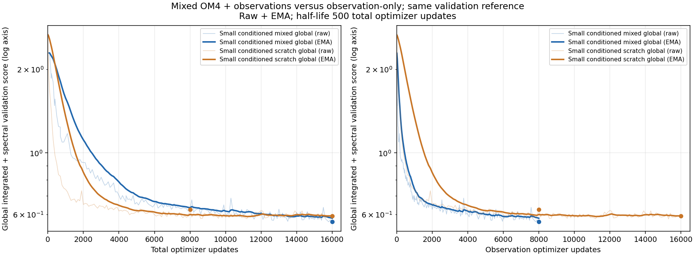

Thin traces show all 173 mixed and 164 obs-only validation scores; bold traces show an exponential moving average (EMA) with a **500-total-update half-life**. The EMA starts at the first raw score and updates in linear score space using `decay = 2^(-Δtotal_updates / 500)`. The same EMA values appear on both axes; the right panel changes only the horizontal coordinate to observation updates. This accounts for irregular validation intervals, including extra milestone checks. Filled circles mark the raw scores at the three report checkpoints. The two obs-only checkpoints belong to the same training trajectory.

Both curves use the identical frozen validation-climatology reference and the established integrated-plus-spectral score. Smoothing is for display; it does not change checkpoint selection or the reported endpoint numbers. [Raw points, EMA values and definition](artifacts/2026-10-01-global-validation-ema/validation-curve-results.json.gz) · [Source hashes and checks](artifacts/2026-10-01-global-validation-ema/provenance.json.gz).

## Learned initializer fields and observation context

SST and SSH reference panels show the **same final five-day history interval** used by the initializer: the five days immediately before the forecast origin. Available surface values are copied into the initialized state by construction; agreement there verifies the supplied state, rather than learned reconstruction skill. **These panels do not test whether the network learns an identity function: an explicit overwrite supplies observed SST/SSH after the network runs.** Their learned surface behavior is confined to missing ocean cells. The [pinned initializer code](https://github.com/m2lines/Samudra/blob/79025a163817a577ab81af95b401f5cb0563cd12/src/samudra/experiments/initializer_models.py#L240) implements this overwrite. **Gray marks fixed model land (or the field’s depth mask); white marks missing observations within model ocean cells.** In missing ocean cells the initializer learns a completion from history, geography, season and forcing.

[Initialized SST: copied input plus completion](artifacts/2026-10-01-global-physical-endpoints/2015-01-01-initial-channel0.png) · [Initialized SSH: copied input plus completion](artifacts/2026-10-01-global-physical-endpoints/2015-01-01-initial-channel6.png)

Interior reference panels use the **preceding December IAP monthly analysis**, explicitly labeled as context. A monthly average is not instantaneous initializer truth. U/V reference panels use the contemporaneous DUACS geostrophic surface-velocity proxy; these are not direct observations of the model’s full velocity state and are not its observation-task training targets. Those distinctions apply to every map link below.

**Why the mixed model’s observation-initialized velocities differ from OM4:** the [supplemental task-path analysis](velocity-task-supplement-2026-10-01.md) compares the same frozen checkpoint on OM4 and observation inputs and swaps only its task adapter. Its normal OM4 path recovers recognizable currents (mean U spatial correlation 0.791), while the observation path differs substantially (0.312). The supplement includes paired maps, separate U/V errors and the actual evaluated loss contributions.

The initializer U/V panels also include **physical OM4 surface velocities** (`uo_0`/`vo_0`) as model-data context. For the January 2015 and 2018 examples, OM4 covers December 27–31 of the preceding year, matching the last five-day input interval. For January 2021, the available OM4 bin is **December 26–30, 2020**, overlapping four of the five December 27–31 initialization days. The stored midpoint ±2.5-day windows leave December 31 uncovered; the panel explicitly says **4/5 days overlap**, and no gap filling was applied. OM4 physical currents and DUACS geostrophic currents represent different quantities; neither panel turns the observation-trained internal U/V slots into supervised current predictions. [Dates, coverage and source audit](artifacts/2026-10-01-global-physical-initial-om4/provenance.json.gz).

The featured diagnostics use **learned temperature below the copied surface level and learned salinity**, rather than surface copying or coastal infilling. The depth profiles compare the three report checkpoints with the preceding December IAP analysis and **Training December climatology**: per-location, per-depth averages of the twenty December analyses in the training set, 1993–2012. This baseline is a diagnostic reference; it does not provide the model's missing inputs or initialized fields.

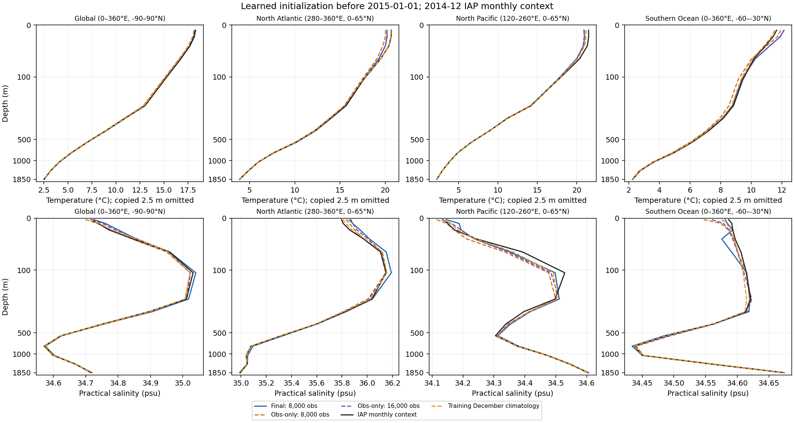

Profiles cover global observed support and the displayed North Atlantic, North Pacific and Southern Ocean boxes. Each depth uses the same finite analysis/climatology/model wet support and spherical cell areas for every curve. Temperature at 2.5 m is omitted because it is copied; the displayed temperature depths are 10–1850 m, while all salinity depths from 2.5–1850 m require prediction.

### Whole-December initializer reconstruction

The featured latitude–depth comparison now uses **whole-December model means from independent initializations**, matching the monthly quantity in the observation reconstruction objective. It calls the original `reconstruct_month` operator: initialize separately from each rolling 95-day surface/forcing history, take its latest T/S state, and average the seven December bins with calendar weights **5/31 six times and 1/31 once**. The processor never runs. Model means and IAP December means both subtract the **same per-location/depth training December climatology, 1993–2012**, with unchanged common finite support and color scales.

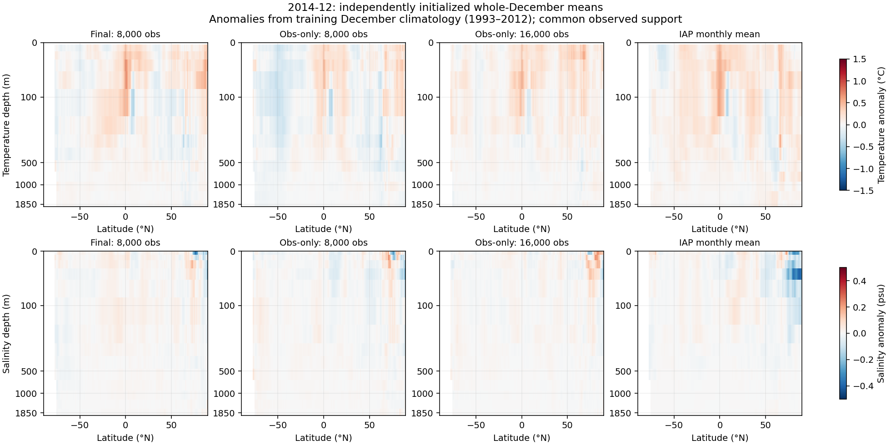

[December 2017](artifacts/2026-10-01-initializer-monthly/2017-12-initializer-zonal-anomalies.png) · [December 2020](artifacts/2026-10-01-initializer-monthly/2020-12-initializer-zonal-anomalies.png) · [Original late-December-state panel](artifacts/2026-10-01-global-physical-endpoints/initializer/2015-01-01-initializer-zonal-anomalies.png).

**This is retrospective monthly reconstruction, not a forecast.** Each initialization sees surface observations through its current five-day bin. As in training, the final bin spans December 31–January 4, with only December 31's 1/31 weight in the monthly mean. These few following-month observations are part of the existing boundary-bin convention; no IAP interior values are initializer inputs. December 2014 was assembled as an additional held-out diagnostic from the existing prepared daily products; training splits and benchmark cohorts are unchanged.

Much of the formerly shared cold anomaly was caused by comparing a late-December state with a whole-month reference. In December 2014, the mixed model's area-weighted temperature anomaly at 30–60°N and modeled depths 10–105 m changes from **−0.540°C** in the original panel to **+0.006°C** for the monthly mean, versus **+0.136°C** in IAP. Obs-only 16k changes from **−0.440°C to +0.131°C**. All three models shift warmer by approximately 0.55°C in this band; the corresponding shifts are similar in December 2017 and 2020. This removes much of the apparent common error without changing the checkpoints. Remaining anomaly differences, particularly salinity, are still visible.

The separate 550 m map below still shows the **last pre-January initialized state**, with December IAP as descriptive context; it is not the monthly mean above.

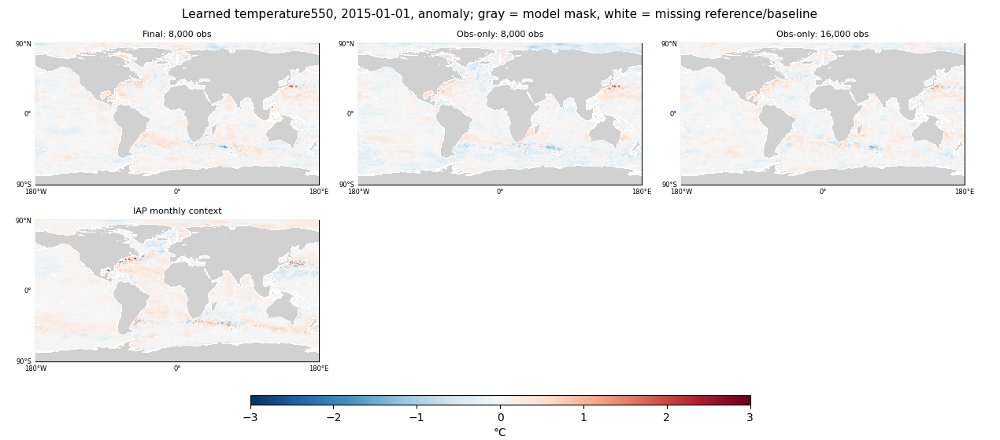

For the monthly reconstruction comparison below, each depth's global spatial RMSE is averaged equally across the learned levels and then across **December 2014, 2017 and 2020**. Temperature at the copied 2.5 m level remains excluded. These are errors of independently initialized monthly means against IAP, with no forecast or checkpoint selection implied.

| Model/reference | Monthly reconstruction T RMSE, 10–1850 m °C | Monthly reconstruction S RMSE, 2.5–1850 m psu |
|---|---:|---:|
| Final: 8,000 obs | 0.310 | 0.0787 |
| Obs-only: 8,000 obs | 0.330 | 0.0794 |
| Obs-only: 16,000 obs | 0.306 | 0.0785 |
| Training December climatology | 0.332 | 0.0668 |

**Mixed and obs-only 16k beat temperature climatology in each of the three monthly examples; none beats salinity climatology.** Mixed improves temperature reconstruction versus scratch at equal observation exposure, while scratch16k is slightly better at equal total updates. Salinity reconstruction remains very similar across the three models. This corrects the interpretation of the earlier last-five-day/context comparison, where all three were worse than climatology for both quantities. The older profiles, context-error curves and single-state maps are retained and labeled as descriptive context; they do not represent this monthly reconstruction statistic. Plausible absolute maps alone remain insufficient evidence of recovered variability, and these diagnostics do not establish whether forecasts use the learned interior state causally. [Monthly values, sources and checks](artifacts/2026-10-01-initializer-monthly/provenance.json.gz).

| Diagnostic | 2015 | 2018 | 2021 |
|---|---|---|---|
| Learned T/S depth profiles | [profiles](artifacts/2026-10-01-global-physical-endpoints/initializer/2015-01-01-initializer-profiles.png) | [profiles](artifacts/2026-10-01-global-physical-endpoints/initializer/2018-01-01-initializer-profiles.png) | [profiles](artifacts/2026-10-01-global-physical-endpoints/initializer/2021-01-01-initializer-profiles.png) |
| Context agreement by depth | [errors](artifacts/2026-10-01-global-physical-endpoints/initializer/2015-01-01-initializer-context-errors.png) | [errors](artifacts/2026-10-01-global-physical-endpoints/initializer/2018-01-01-initializer-context-errors.png) | [errors](artifacts/2026-10-01-global-physical-endpoints/initializer/2021-01-01-initializer-context-errors.png) |
| Whole-December latitude–depth anomalies | [December 2014](artifacts/2026-10-01-initializer-monthly/2014-12-initializer-zonal-anomalies.png) | [December 2017](artifacts/2026-10-01-initializer-monthly/2017-12-initializer-zonal-anomalies.png) | [December 2020](artifacts/2026-10-01-initializer-monthly/2020-12-initializer-zonal-anomalies.png) |
| Learned temperature at 550 m | [absolute](artifacts/2026-10-01-global-physical-endpoints/initializer/2015-01-01-initializer-temperature550-absolute.png), [anomaly](artifacts/2026-10-01-global-physical-endpoints/initializer/2015-01-01-initializer-temperature550-anomaly.png) | [absolute](artifacts/2026-10-01-global-physical-endpoints/initializer/2018-01-01-initializer-temperature550-absolute.png), [anomaly](artifacts/2026-10-01-global-physical-endpoints/initializer/2018-01-01-initializer-temperature550-anomaly.png) | [absolute](artifacts/2026-10-01-global-physical-endpoints/initializer/2021-01-01-initializer-temperature550-absolute.png), [anomaly](artifacts/2026-10-01-global-physical-endpoints/initializer/2021-01-01-initializer-temperature550-anomaly.png) |
| Learned surface salinity | [absolute](artifacts/2026-10-01-global-physical-endpoints/initializer/2015-01-01-initializer-salinity0-absolute.png), [anomaly](artifacts/2026-10-01-global-physical-endpoints/initializer/2015-01-01-initializer-salinity0-anomaly.png) | [absolute](artifacts/2026-10-01-global-physical-endpoints/initializer/2018-01-01-initializer-salinity0-absolute.png), [anomaly](artifacts/2026-10-01-global-physical-endpoints/initializer/2018-01-01-initializer-salinity0-anomaly.png) | [absolute](artifacts/2026-10-01-global-physical-endpoints/initializer/2021-01-01-initializer-salinity0-absolute.png), [anomaly](artifacts/2026-10-01-global-physical-endpoints/initializer/2021-01-01-initializer-salinity0-anomaly.png) |
| Supplied/copied SST | [maps](artifacts/2026-10-01-global-physical-endpoints/2015-01-01-initial-channel0.png) | [maps](artifacts/2026-10-01-global-physical-endpoints/2018-01-01-initial-channel0.png) | [maps](artifacts/2026-10-01-global-physical-endpoints/2021-01-01-initial-channel0.png) |
| Supplied/copied SSH | [maps](artifacts/2026-10-01-global-physical-endpoints/2015-01-01-initial-channel6.png) | [maps](artifacts/2026-10-01-global-physical-endpoints/2018-01-01-initial-channel6.png) | [maps](artifacts/2026-10-01-global-physical-endpoints/2021-01-01-initial-channel6.png) |
| Surface zonal velocity proxy comparison | [maps](artifacts/2026-10-01-global-physical-endpoints/2015-01-01-initial-channel4.png) | [maps](artifacts/2026-10-01-global-physical-endpoints/2018-01-01-initial-channel4.png) | [maps](artifacts/2026-10-01-global-physical-endpoints/2021-01-01-initial-channel4.png) |
| Surface meridional velocity proxy comparison | [maps](artifacts/2026-10-01-global-physical-endpoints/2015-01-01-initial-channel5.png) | [maps](artifacts/2026-10-01-global-physical-endpoints/2018-01-01-initial-channel5.png) | [maps](artifacts/2026-10-01-global-physical-endpoints/2021-01-01-initial-channel5.png) |

[Learned initializer numbers](artifacts/2026-10-01-global-physical-endpoints/initializer-results.json.gz) · [Saved-state export and source provenance](artifacts/2026-10-01-global-physical-comparison/provenance.json.gz). The learned-field extraction reuses saved initialized states: 12 CPU seconds for mixed and nine for scratch, with no additional GPU inference beyond the endpoint evaluations.

**Why observation coastlines look different:** every panel uses the same fixed OM4 wet-cell mask. The observation panel additionally lacks values in coarse cells rejected during remapping: valid source area must cover at least 90% of the *full* target cell, which excludes many coastal/island cells. In the 2021 day-30 SST example, 3,598 of 44,892 model ocean cells lack an observation (7.0% of cosine-weighted wet area). Those cells were previously the same gray as land; they are now white. The model predicts in those ocean cells, but they have no observation error score. This is coverage, not a learned coastline.

## Day-30 errors and spatial structure

The error table averages each origin’s area-weighted RMSE over 96 independently initialized monthly test forecasts in 2015–2022, taking only the sixth five-day output (the interval from days 25 to 30). It does not average leads 5, 15 and 30. Persistence holds each checkpoint’s inferred initial state fixed; climatology is the same training-only monthly surface climatology.

| Model | SST RMSE °C | SST persistence °C | SSH RMSE m | SSH persistence m |
|---|---:|---:|---:|---:|
| Final: 8,000 obs | 0.640 | 1.168 | 0.0792 | 0.0800 |
| Obs-only: 8,000 obs | 0.694 | 1.168 | 0.0886 | 0.0800 |
| Obs-only: 16,000 obs | 0.572 | 1.168 | 0.0826 | 0.0800 |

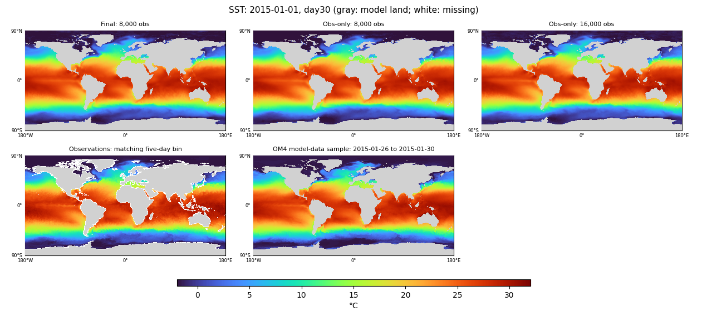

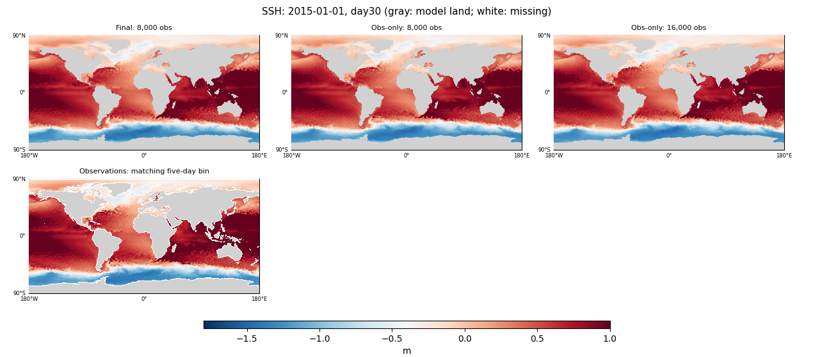

At day 30, mixed SST RMSE is **45.2% lower than persistence** and its SSH advantage over persistence is **1.1%**. Obs-only 16k improves day-30 SST by **10.7%** versus mixed, while SSH is **4.3% worse** and remains worse than surface persistence. These per-origin-mean RMSEs differ slightly from the benchmark's pooled RMSEs; estimators are kept separate throughout.

The mixed endpoint retains a mean day-30 SST bias of **−0.273°C** and SSH bias of **−0.0489 m** over the 96 origins. In the January 2015 day-30 example, the coldest predicted wet SST is −3.98°C, still colder than the reference minimum of −1.80°C. Obs-only 8k has SST/SSH biases of −0.375°C/−0.0623 m; at 16k they improve to −0.202°C/−0.0522 m. SSH ripples and conspicuous internal-velocity bands remain. The internal U/V maps are useful diagnostics of what is carried forward, but their comparison with geostrophic proxies is not a full-current skill assessment.

**Date-matched OM4 context:** the day-30 and day-365 temperature-at-550-m and surface-salinity maps now include an **OM4 model-data sample** for the same five-day forecast interval. Physical U/V maps include that OM4 comparison alongside the existing DUACS geostrophic proxy. Panel labels print the inclusive dates: January 26–30 at day 30, December 27–31 at day 365, for each of 2015/2018/2021. OM4 uses the same Gaussian grid, field/depth masks, physical units and color scales; source averages are overlap-weighted when needed. These samples provide structural model-data context, **not observational ground truth or an observation-initialized forecast baseline**. Unconstrained physical slots can carry learned information, so their departure from OM4 does not by itself establish an observation forecast error. [Reference dates and field provenance](artifacts/2026-10-01-global-physical-om4-maps/provenance.json.gz).

| Field | Initialization, 2015 | Day 30, 2015 | Day 30, 2018 | Day 30, 2021 |
|---|---|---|---|---|
| SST | [maps](artifacts/2026-10-01-global-physical-endpoints/2015-01-01-initial-channel0.png) | [maps](artifacts/2026-10-01-global-physical-endpoints/2015-01-01-day30-channel0.png) | [maps](artifacts/2026-10-01-global-physical-endpoints/2018-01-01-day30-channel0.png) | [maps](artifacts/2026-10-01-global-physical-endpoints/2021-01-01-day30-channel0.png) |
| SSH | [maps](artifacts/2026-10-01-global-physical-endpoints/2015-01-01-initial-channel6.png) | [maps](artifacts/2026-10-01-global-physical-endpoints/2015-01-01-day30-channel6.png) | [maps](artifacts/2026-10-01-global-physical-endpoints/2018-01-01-day30-channel6.png) | [maps](artifacts/2026-10-01-global-physical-endpoints/2021-01-01-day30-channel6.png) |
| Temperature at 550 m | [maps](artifacts/2026-10-01-global-physical-endpoints/2015-01-01-initial-channel1.png) | [maps](artifacts/2026-10-01-global-physical-endpoints/2015-01-01-day30-channel1.png) | [maps](artifacts/2026-10-01-global-physical-endpoints/2018-01-01-day30-channel1.png) | [maps](artifacts/2026-10-01-global-physical-endpoints/2021-01-01-day30-channel1.png) |
| Surface salinity | [maps](artifacts/2026-10-01-global-physical-endpoints/2015-01-01-initial-channel2.png) | [maps](artifacts/2026-10-01-global-physical-endpoints/2015-01-01-day30-channel2.png) | [maps](artifacts/2026-10-01-global-physical-endpoints/2018-01-01-day30-channel2.png) | [maps](artifacts/2026-10-01-global-physical-endpoints/2021-01-01-day30-channel2.png) |
| Surface zonal velocity | [maps](artifacts/2026-10-01-global-physical-endpoints/2015-01-01-initial-channel4.png) | [maps](artifacts/2026-10-01-global-physical-endpoints/2015-01-01-day30-channel4.png) | [maps](artifacts/2026-10-01-global-physical-endpoints/2018-01-01-day30-channel4.png) | [maps](artifacts/2026-10-01-global-physical-endpoints/2021-01-01-day30-channel4.png) |
| Surface meridional velocity | [maps](artifacts/2026-10-01-global-physical-endpoints/2015-01-01-initial-channel5.png) | [maps](artifacts/2026-10-01-global-physical-endpoints/2015-01-01-day30-channel5.png) | [maps](artifacts/2026-10-01-global-physical-endpoints/2018-01-01-day30-channel5.png) | [maps](artifacts/2026-10-01-global-physical-endpoints/2021-01-01-day30-channel5.png) |

All model tiles retain one image pixel per model grid location, common scales and full polar coverage. The [numerical artifact](artifacts/2026-10-01-global-physical-endpoints/map-results.json.gz) records ranges and color-limit clipping, so saturated cold/warm values are not hidden by interpretation of the maps.

## Wider spatial spectra, all at day 30

The six regions follow [Samudra 2, Figure 9 and Appendix A.5](https://arxiv.org/abs/2606.02610v2): Gulf Stream, Kuroshio, Agulhas, Malvinas, Niño 3.4 and Tropical Pacific. The last box spans 130–290°E and 30°S–30°N. Curves average **power spectra of twelve day-30 forecasts**, one from each month of 2015. No curve blends forecast leads or uses annual forecast states.

Each final comparison panel includes the mixed 8k endpoint and obs-only 8k/16k endpoints on the nominal 1° OM4 grid, together with OM4 on that grid, observations on that grid and native observations. Native OISST is 0.25°; native prepared DUACS ADT is 0.125°. “Native” means the existing prepared product grid before the 1° remap. All use the same calendar five-day intervals. OM4 averages are combined by exact time-interval overlap when their native five-day phase differs from the observation bins; those weights are saved. OM4 is a model-data reference, not the verifying ocean state for an observation-initialized forecast.

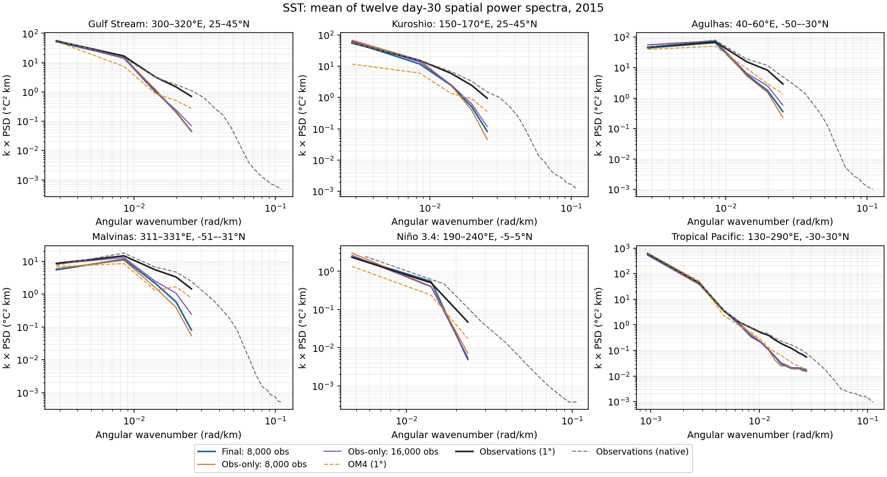

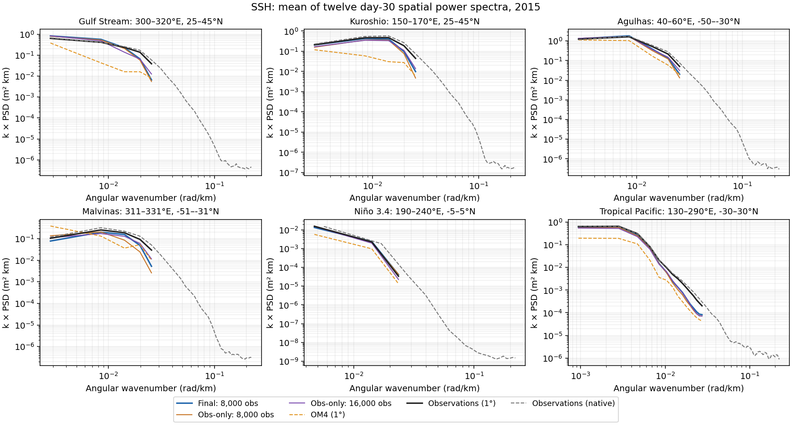

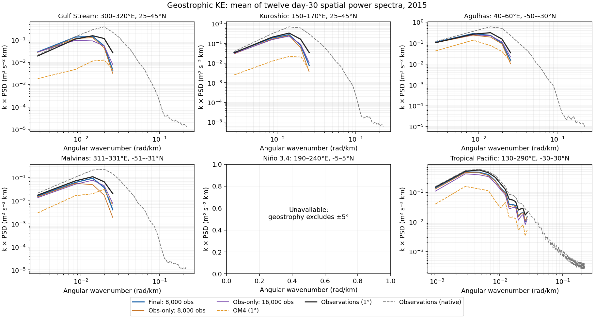

The mixed endpoint is closer to coarse observations than OM4 in **SSH and its derived geostrophic velocity** at resolved wavelengths. It still lacks power at shorter resolved wavelengths relative to **observations already coarsened to 1°**. The native curves additionally reveal variability beyond the model grid's representable range.

At 16k, obs-only matches coarse SST spectra more closely than mixed, but additional observation training does not close the mixed model's SSH/geostrophic-KE spectral advantage. This is consistent with the day-30 field errors and suggests a field-dependent source benefit.

To quantify the endpoint differences, the table gives mean absolute differences in log10 spectral power. It averages bins at wavelengths of at least four grid spacings in each of the four boundary-current boxes, then weights those boxes equally. Lower is closer; a difference of 0.3 corresponds to a factor of about two in power, and 1.0 to a factor of ten. This is a descriptive diagnostic, not the training selection metric.

| Model | SST vs obs 1° | SST vs OM4 1° | SSH vs obs 1° | SSH vs OM4 1° | Geo. KE vs obs 1° | Geo. KE vs OM4 1° |
|---|---:|---:|---:|---:|---:|---:|
| Final: 8,000 obs | 0.189 | 0.208 | 0.075 | 0.583 | 0.065 | 0.863 |
| Obs-only: 8,000 obs | 0.199 | 0.225 | 0.120 | 0.507 | 0.111 | 0.795 |
| Obs-only: 16,000 obs | 0.165 | 0.228 | 0.113 | 0.510 | 0.114 | 0.791 |

The plotted KE curve is **½(Su + Sv)** from geostrophic velocities derived from each SSH field, with its own spatial mean/plane removed. This follows the component-spectrum construction in the paper, but is a spatial velocity-fluctuation diagnostic, not temporally defined EKE or the spectrum of the scalar EKE field used in prior selection. Deriving velocities from every SSH grid makes their construction explicit; it also changes the reference from the supplied DUACS U/V used by the training metrics. Geostrophy excludes ±5°, so the Niño 3.4 velocity panel is unavailable rather than filled or extrapolated.

**Land and scale treatment:** these are masked regional pseudo-spectra. Coarse curves share finite reference/OM4 wet support, fixed across all twelve dates. Native curves use that geographical support plus their native missing-value mask. A plane is fitted on finite cells; unsupported residuals contribute zero to the Fourier transform. A periodic 2D Hann window and its wet-support variance correction are applied. The mask’s spectral coupling is not deconvolved, so coastal/island features can affect especially short wavelengths. The 2D PSD is normalized per angular-wavenumber area, with k × PSD on the vertical axis. Angular wavenumbers are shown only below each grid’s lower Nyquist. Gaussian-grid latitude spacing is approximated by regional median spacing, and longitude by the cosine of regional mean latitude; the very broad Tropical Pacific panel has greater geometric approximation than the smaller boxes.

The figures retain absolute snapshot fluctuations after spatial plane removal; they are not a seasonal-anomaly or continuous eight-year spectrum reproduction of the paper. Powers are averaged after transforming individual snapshots. These wider diagnostics do not replace or alter the validated checkpoint-selection metrics. Native-to-coarse daily remapping and five-day aggregation are numerically checked against the actual coarse targets.

## Annual SST/SSH means, OHC totals and maps

One initialization, 73 five-day autoregressive steps, prescribed future ERA5, no future surface-state corrections. The plots show **undetrended SST/SSH means and total OHC in ZJ**, for all three endpoints, with observations, each model's initialized-state persistence and training-only monthly climatology. SST and SSH use five-day intervals; OHC uses calendar-month averages, separately for 0–700 and 700–2000 m. OHC is the sum of column heat content times spherical cell area, divided by 10²¹ J/ZJ. It is integrated over fixed, common observed support, with no extrapolation into unobserved ocean. Its temperature reference remains 0°C.

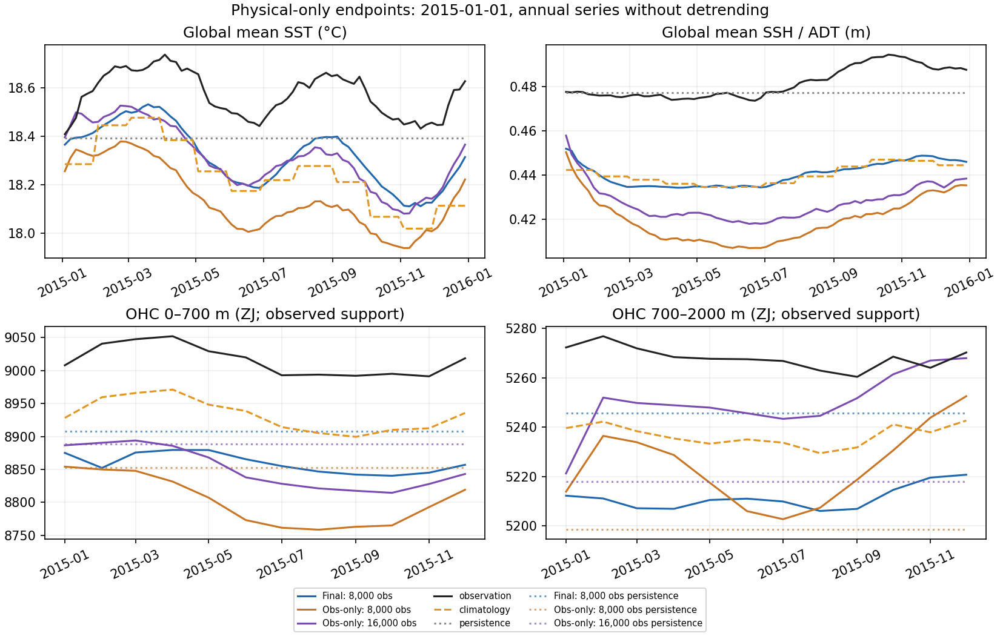

[2018 global means](artifacts/2026-10-01-global-physical-comparison/2018-01-01-annual-global-means.png) · [2021 global means](artifacts/2026-10-01-global-physical-comparison/2021-01-01-annual-global-means.png)

The mixed endpoint broadly follows the seasonal SST cycle but remains cold; SSH settles near the older training climatology. Obs-only 8k is colder and has lower SSH. At 16k, obs-only approaches mixed in SST and upper-OHC global means and has **smaller deep-OHC mean offsets** in all three years. Its SSH mean remains lower. These global averages do not make the obs-only annual spatial behavior preferable: **both scratch checkpoints have much stronger equatorial SST ripples in all three displayed annual maps**. Smaller scalar bias can coexist with worse spatial structure.

For the mixed endpoint, both OHC bands have persistent negative offsets exceeding the native-IAP climatology baseline's absolute offset in all three cases. Its initialized-state persistence is already low, and evolution lowers OHC further. The obs-only 16k deep-OHC mean moves closer to observations during evolution, but this alone cannot validate unconstrained interior physics; the vertical-representation contribution below also affects the absolute offsets.

The mean forecast-minus-observation offsets are shown below. SST/SSH average the 73 five-day points; OHC averages the twelve monthly points equally:

| Model | Origin | SST °C | SSH m | OHC 0–700 ZJ | OHC 700–2000 ZJ |
|---|---|---:|---:|---:|---:|
| Final: 8,000 obs | 2015-01-01 | -0.254 | -0.0413 | -155.7 | -56.7 |
| Final: 8,000 obs | 2018-01-01 | -0.202 | -0.0478 | -158.8 | -56.2 |
| Final: 8,000 obs | 2021-01-01 | -0.210 | -0.0441 | -141.6 | -55.7 |
| Obs-only: 8,000 obs | 2015-01-01 | -0.433 | -0.0619 | -213.2 | -43.8 |
| Obs-only: 8,000 obs | 2018-01-01 | -0.371 | -0.0657 | -207.4 | -47.1 |
| Obs-only: 8,000 obs | 2021-01-01 | -0.388 | -0.0685 | -200.4 | -56.0 |
| Obs-only: 16,000 obs | 2015-01-01 | -0.261 | -0.0541 | -163.9 | -18.0 |
| Obs-only: 16,000 obs | 2018-01-01 | -0.190 | -0.0562 | -154.5 | -20.5 |
| Obs-only: 16,000 obs | 2021-01-01 | -0.214 | -0.0589 | -144.9 | -26.6 |

These are temporal mean offsets of the plotted series: area means for SST/SSH, supported area totals for OHC. They are not spatial RMSEs. The annual maps still show nonphysical structure, so matching seasonality or a global mean cannot establish spatial realism.

**OHC representation check:** the observed OHC integrates native IAP layers, whereas forecast OHC integrates the model's layers. Taking the *same* preceding-December analysis, sampling it at the model depths and applying the forecast integration already gives the following offsets relative to its native-layer integral:

| IAP context month | Model-layer minus native OHC 0–700 ZJ | Model-layer minus native OHC 700–2000 ZJ |
|---|---:|---:|
| 2014-12 | -64.7 | -17.2 |
| 2017-12 | -63.8 | -16.9 |
| 2020-12 | -63.8 | -17.0 |

This demonstrates a material representation contribution before model error. It is a three-month context check, not a correction to the annual curves or a precise decomposition of their biases. The context check has slightly smaller upper-band support (3.073×10¹⁴ m²) because the preceding-December analysis has additional missing columns. The additional drop from initialized-state persistence to the forecast is independent evidence of evolution changing the mean heat content.

SST/SSH means use cosine-latitude weights on the model grid. OHC totals use spherical areas from the same midpoint latitude/longitude cell bounds as observation remapping (R=6371 km, polar edges at ±90°). Each binary wet cell contributes its full grid-cell area; no fractional wet-area correction is available. The two retained OHC areas are 3.086×10¹⁴ m² (0–700 m) and 2.875×10¹⁴ m² (700–2000 m). Every curve in a given annual panel uses the same fixed support: model wet cells with finite observations and baseline values throughout that year. This removes changes in missing-data coverage as a source of apparent time-series drift. “Global” therefore means globally distributed observed support, not an estimate of unobserved ocean cells. The retained fraction of the model’s surface wet area is:

| Origin | SST | SSH | OHC 0–700 | OHC 700–2000 |
|---|---:|---:|---:|---:|
| 2015-01-01 | 93.0% | 93.0% | 81.8% | 76.2% |
| 2018-01-01 | 93.0% | 93.0% | 81.8% | 76.2% |
| 2021-01-01 | 93.0% | 93.0% | 81.8% | 76.2% |

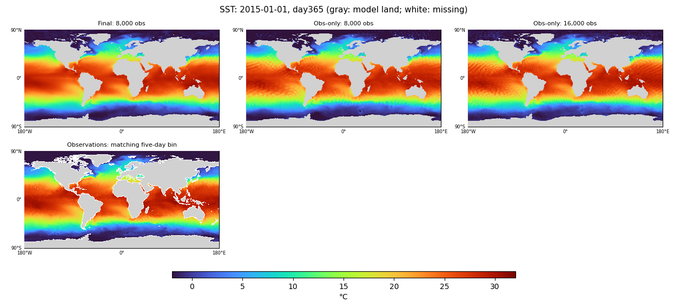

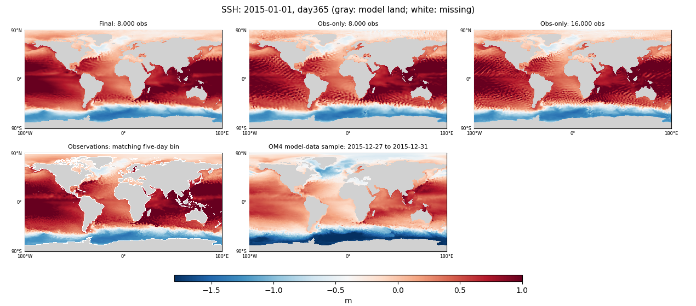

| Field | Annual, 2015 | Annual, 2018 | Annual, 2021 |
|---|---|---|---|
| SST | [maps](artifacts/2026-10-01-global-physical-endpoints/2015-01-01-day365-channel0.png) | [maps](artifacts/2026-10-01-global-physical-endpoints/2018-01-01-day365-channel0.png) | [maps](artifacts/2026-10-01-global-physical-endpoints/2021-01-01-day365-channel0.png) |
| SSH | [maps](artifacts/2026-10-01-global-physical-endpoints/2015-01-01-day365-channel6.png) | [maps](artifacts/2026-10-01-global-physical-endpoints/2018-01-01-day365-channel6.png) | [maps](artifacts/2026-10-01-global-physical-endpoints/2021-01-01-day365-channel6.png) |
| Temperature at 550 m | [maps](artifacts/2026-10-01-global-physical-endpoints/2015-01-01-day365-channel1.png) | [maps](artifacts/2026-10-01-global-physical-endpoints/2018-01-01-day365-channel1.png) | [maps](artifacts/2026-10-01-global-physical-endpoints/2021-01-01-day365-channel1.png) |
| Surface salinity | [maps](artifacts/2026-10-01-global-physical-endpoints/2015-01-01-day365-channel2.png) | [maps](artifacts/2026-10-01-global-physical-endpoints/2018-01-01-day365-channel2.png) | [maps](artifacts/2026-10-01-global-physical-endpoints/2021-01-01-day365-channel2.png) |
| Surface zonal velocity | [maps](artifacts/2026-10-01-global-physical-endpoints/2015-01-01-day365-channel4.png) | [maps](artifacts/2026-10-01-global-physical-endpoints/2018-01-01-day365-channel4.png) | [maps](artifacts/2026-10-01-global-physical-endpoints/2021-01-01-day365-channel4.png) |
| Surface meridional velocity | [maps](artifacts/2026-10-01-global-physical-endpoints/2015-01-01-day365-channel5.png) | [maps](artifacts/2026-10-01-global-physical-endpoints/2018-01-01-day365-channel5.png) | [maps](artifacts/2026-10-01-global-physical-endpoints/2021-01-01-day365-channel5.png) |

### Day-365 spatial spectra

These use the same six regions, transform, model labels and reference products as the day-30 plots: mixed 8k, obs-only 8k/16k, OM4 1°, observations 1° and observations on their native prepared grids. Each model curve averages **three individual day-365 power spectra**, from the January 2015/2018/2021 annual rollouts. Only the 73rd output is used: **days 360–365**, December 27–31 of the corresponding year (half-open interval ending January 1). OM4 and both observation grids match that exact interval. This is a spatial endpoint spectrum, not a spectrum averaged over the year or over forecast leads.

**The cohorts differ:** the day-30 panels average twelve monthly starts in 2015; these day-365 panels use three January starts in different years. Reference-power changes between the two sections can reflect season/year sampling as well as forecast behavior. The annual panels verify their references against the actual saved forecast targets; native-to-coarse masks/values and final map-versus-surface arrays agree.

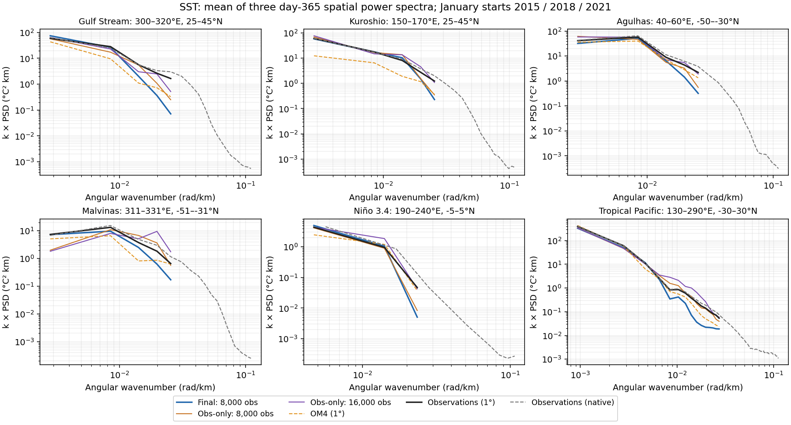

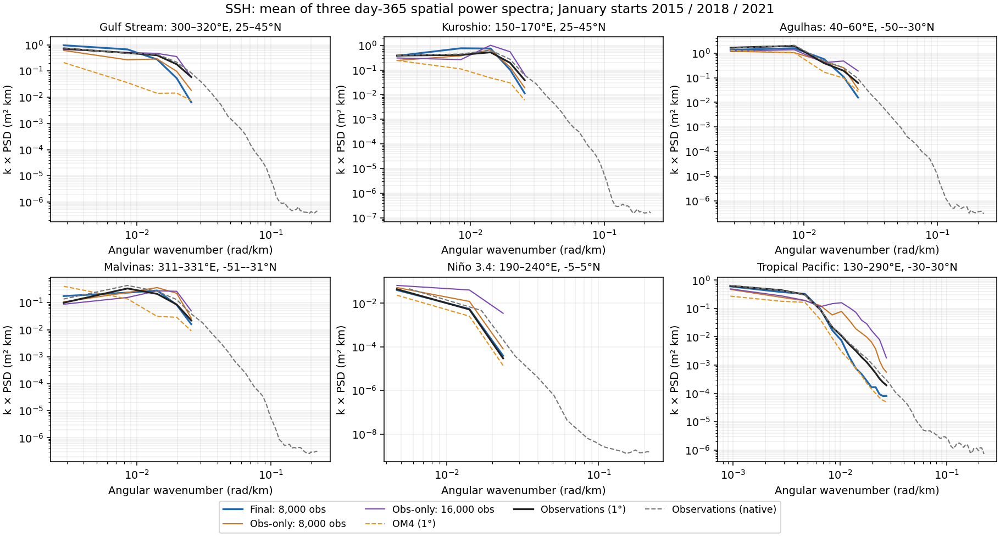

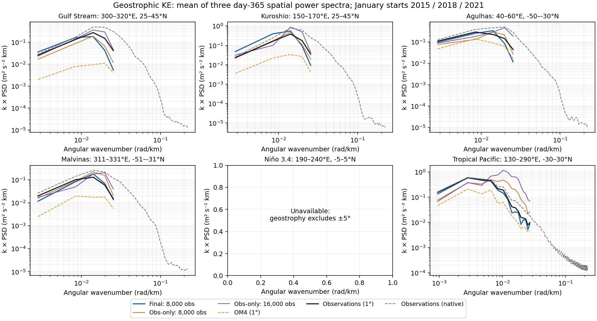

The Tropical Pacific panels show a pronounced excess-power bump in obs-only 16k SSH and its derived geostrophic velocity. Obs-only 8k also has excess power there. Mixed avoids that bump but has too little SST power at the shortest represented wavelengths in the boundary-current regions. These are regional, field-dependent differences: plausible integrated power in other regions does not establish spatial realism, and a power spectrum cannot show whether fronts or eddies are in the right locations.

For context, the same descriptive log10-power distance used above, restricted to wavelengths of at least four grid spacings and equally weighting the four boundary-current boxes, gives:

| Model | SST vs obs 1° | SSH vs obs 1° | Geo. KE vs obs 1° |
|---|---:|---:|---:|
| Final: 8,000 obs | 0.110 | 0.144 | 0.168 |
| Obs-only: 8,000 obs | 0.161 | 0.143 | 0.141 |
| Obs-only: 16,000 obs | 0.168 | 0.126 | 0.152 |

Mixed is closer in this SST summary; SSH/geostrophic-KE distances do **not** uniformly favor mixed at day 365. This four-region summary excludes the Tropical Pacific bump, which is why the full regional panels remain essential. As at day 30, geostrophy excludes ±5°, making the Niño 3.4 KE panel unavailable. All distances are diagnostic, with checkpoint selection unchanged.

[Day-365 spectral numbers and masks](artifacts/2026-10-01-global-physical-day365/results.json.gz) · [Exact reference intervals, source hashes and CPU accounting](artifacts/2026-10-01-global-physical-day365/provenance.json.gz). The addition reused all saved forecasts, required two successful CPU-only extractions (7/11 seconds elapsed), and added **zero GPU-hours**. Sharing the spectrum code reproduces every previous day-30 curve exactly; the day-30 figures and forecast scores are unchanged.

## Methods and limits

Both model families use the Small D ConvNeXt U-Net: widths 128/192/256/384, one block per level, dilations 1/2/4/8, periodic longitude padding and zero latitude padding. The initializer takes 19 five-day history frames (95 days), finite-input indicators, forcings, spherical geographic coordinates and annual sine/cosine. It emits two states containing T/S/U/V at 19 depths plus SSH; the processor uses the previous two states. No physical freezing or velocity constraint is imposed.

Seed 1729; AdamW at 1e-4, weight decay 0.01, clipping 1, effective batch 8, no warmup. OM4 uses original forcings and full-state forecast/reconstruction losses. Observation forcings use the learned ERA5 adapter; observations supervise monthly T/S, SST/SSH forecast, interior reconstruction and artificial-gap surface completion. Forecast training covers six OM4 steps or six/seven observation steps spanning a month. The observation objective is 0.8 monthly T/S + 0.1 SST + 0.1 SSH + 0.1 interior reconstruction + 0.1 artificial-gap surface completion. These coefficients are not fractions of gradient contribution. Reconstruction trains the initializer from histories throughout the month; those later surface observations do not enter the forecast trajectory. The [preceding methods report](global-domain-results-2026-09-30.md#model-and-training-details) describes the shared experiment setup.

OHC integrates temperature relative to 0°C, using ρ=1035 kg/m³ and cp=3850 J/(kg K), with each product’s layer overlap against the depth band and complete column support. Forecasts use OM4 model layers; observations use native IAP layers before horizontal remapping. Observation OHC climatology is the per-location, per-calendar-month mean of training-only native IAP OHC integrals; surface climatology is the existing training-only monthly spatial climatology. These baselines do not supply the initializer’s missing values.

All checkpoint lineage hashes and counts, exact cohorts, global evaluation flags, prepared/native reference hashes and archive members are retained in the [evidence and provenance](artifacts/2026-10-01-global-physical-comparison/provenance.json.gz). The ZJ conversion passed full-sphere area and constant-field integration checks, plus missing-support/no-extrapolation checks. The new regional transform passed amplitude/plane-invariance, resolved-wavelength, Nyquist, empty-support and geostrophic-sign/equator checks. Map pixels and native/coarse equivalence were checked. Failed launch attempts are included in allocation accounting.

One seed per trajectory, twelve day-30 spectral snapshots and three day-365 snapshots support descriptive conclusions. The scratch run provides controlled equal-observation-exposure and equal-total-update endpoint comparisons against mixed training. No state intervention or source-specific supervision ablation is included, so these results do not causally explain the remaining structural advantage. Internal fields lacking observation supervision remain diagnostic states, and finite analyzed products do not establish direct measurement coverage under ice. Annual means can look good while spatial patterns are poor, which is why the maps remain alongside them.

The matched scratch run used **14.6258 training + 0.1683 evaluation = 14.7942 actual allocated GPU-hours**, with no GPU retries; training 18890321 and all four monthly/annual evaluations completed 0:0. Final collection 18892522 took 237 CPU seconds; learned scratch-state extraction 18895376 took nine CPU seconds. Previously recorded diagnostics and accounting remain in the provenance archive.

[Machine-readable map results](artifacts/2026-10-01-global-physical-endpoints/map-results.json.gz) · [execution plan](global-physical-focus-plan-2026-09-30.md) · [previous global model comparison](global-domain-results-2026-09-30.md)

The ZJ/coverage update reused the existing forecasts and added one 36-second CPU extraction of initialization OHC and training climatology; it used no GPU time. Its output checksum and sources are retained in the [heat-context evidence](artifacts/2026-09-30-global-physical-focus/heat-context-provenance.json.gz).

The matched comparison is complete as of October 1. [Completion, allocation and checkpoint receipts](artifacts/2026-10-01-global-physical-comparison/completion.json.gz) · [Benchmark components and baseline comparisons](artifacts/2026-10-01-global-physical-comparison/primary-comparison.json.gz) · [Validation curves and immutable milestones](artifacts/2026-10-01-global-physical-comparison/validation-curve-results.json.gz). The reported endpoint numbers, spectra and annual totals reproduce the original completed comparison.

The date-matched OM4 references came from one successful CPU extraction (18956440, seven seconds elapsed) and **zero new GPU-hours**. The same reference intervals and samples are retained in the endpoint maps. [Reference extraction audit](artifacts/2026-10-01-global-physical-om4-maps/map-audit.json.gz). Forecast scores, spectra, OHC series and checkpoint selection are unchanged.

The displayed model comparisons now contain only the mixed 8k/8k endpoint and obs-only 8k/16k. Maps, initializer profiles and sections were rendered from existing arrays; retained model/reference tiles, numbers, color scales and 1:1 pixels are unchanged. No new training, inference or GPU time was required. [Endpoint figure audit and sources](artifacts/2026-10-01-global-physical-endpoints/provenance.json.gz).

The initializer-velocity OM4 addition uses a separate successful CPU extraction, with zero new GPU-hours. Two short failed attempts are retained in the audit: the strict coverage check exposed the uncovered December 31, 2020 before the explicitly labeled partial reference was produced. All six updated figures retain their original model/DUACS tiles and color scales; all 48 other field maps are byte-identical. [Initializer reference and figure audit](artifacts/2026-10-01-global-physical-initial-om4/map-audit.json.gz).

The whole-December initializer diagnostic adds **0.0158 actual GPU-hours**, including the short duplicate request stopped by the output-preservation guard. All nine model/month cases passed seven-initializer/zero-processor checks and exact independent weighted-sum verification. Archive/member readback, prior climatology/reference equality and pinned runtime/checkpoint lineage checks passed. The [diagnostic provenance](artifacts/2026-10-01-initializer-monthly/provenance.json.gz) preserves both attempt logs, Alpha preparation inputs and executed helper source. No new training or rollout was performed.
