<!-- SPDX-FileCopyrightText: 2026 Samudra Authors -->
<!-- SPDX-License-Identifier: CC-BY-4.0 -->

# Global physical-only: initialization, day-30 structure and annual means

**The model becomes substantially more observation-like during training, especially in SSH and geostrophic velocity spectra, but important errors remain.** Day-30 SST RMSE falls from 1.486 to 0.640°C; final SSH RMSE is 0.0792 m, only slightly better than persistence (0.0800 m). The annual means expose persistent cold and low-SSH offsets, while spatial ripples remain visible. Observation-like spectra alone therefore do not establish a faithful ocean forecast.

This report follows one global physical-only model through four saved training stages. It adds observation references to initialization maps, evaluates only **day 30** for the spatial spectra and surface errors, and retains a separate annual section.

## Which checkpoints are being compared?

| Literal model label | Total optimizer updates | OM4 updates | Observation updates | Meaning |
|---|---:|---:|---:|---|
| Early: 50 obs | 374 | 324 | 50 | Same weights trajectory, fixed milestone; no new training |
| Developing: 500 obs | 2,667 | 2,167 | 500 | Same weights trajectory, fixed milestone; no new training |
| Middle: 2,000 obs | 6,949 | 4,949 | 2,000 | Same weights trajectory, fixed milestone; no new training |
| Final: 8,000 obs | 16,000 | 8,000 | 8,000 | Same weights trajectory, fixed milestone; no new training |

This is the **62,966,546-parameter Small conditioned mixed global** model on the 180×360 OM4 Gaussian grid: 77 physical state slots, affine InstanceNorm, a shared initializer/processor with source-specific, identity-initialized 1×1 input adapters, and no additional memory channels. Training starts from random weights and mixes OM4 with observations throughout; observation frequency increases with training. These stages therefore describe increasing observation exposure alongside increasing OM4 exposure, rather than a pure OM4 pretraining phase followed by fine tuning. There is no observation-only finish. The final checkpoint is the 8k/8k endpoint, not the validation-selected checkpoint.

## Initializer examples with observation references

SST and SSH reference panels show the **same final five-day history interval** used by the initializer: the five days immediately before the forecast origin. Available surface values are copied into the initialized state by construction; agreement there verifies the supplied state, rather than learned reconstruction skill. Gray reference cells have no available observation. In those cells the initializer learns a completion from history, geography, season and forcing.

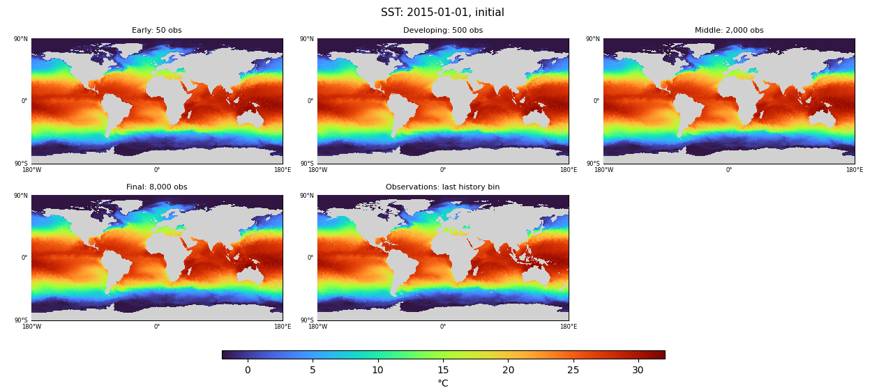

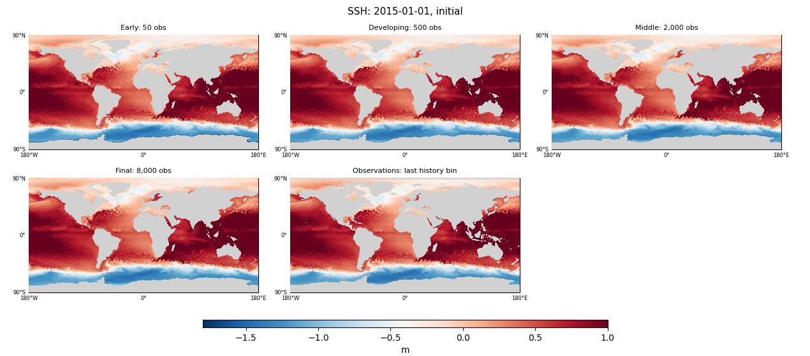

Interior reference panels use the **preceding December IAP monthly analysis**, explicitly labeled as context. A monthly average is not instantaneous initializer truth. U/V reference panels use the contemporaneous DUACS geostrophic surface-velocity proxy; these are not direct observations of the model’s full velocity state and are not its observation-task training targets. Those distinctions apply to every map link below.

| Field | Initialization, 2015 | Initialization, 2018 | Initialization, 2021 |
|---|---|---|---|
| SST | [maps](artifacts/2026-09-30-global-physical-focus/2015-01-01-initial-channel0.png) | [maps](artifacts/2026-09-30-global-physical-focus/2018-01-01-initial-channel0.png) | [maps](artifacts/2026-09-30-global-physical-focus/2021-01-01-initial-channel0.png) |
| SSH | [maps](artifacts/2026-09-30-global-physical-focus/2015-01-01-initial-channel6.png) | [maps](artifacts/2026-09-30-global-physical-focus/2018-01-01-initial-channel6.png) | [maps](artifacts/2026-09-30-global-physical-focus/2021-01-01-initial-channel6.png) |
| Temperature at 550 m | [maps](artifacts/2026-09-30-global-physical-focus/2015-01-01-initial-channel1.png) | [maps](artifacts/2026-09-30-global-physical-focus/2018-01-01-initial-channel1.png) | [maps](artifacts/2026-09-30-global-physical-focus/2021-01-01-initial-channel1.png) |
| Surface salinity | [maps](artifacts/2026-09-30-global-physical-focus/2015-01-01-initial-channel2.png) | [maps](artifacts/2026-09-30-global-physical-focus/2018-01-01-initial-channel2.png) | [maps](artifacts/2026-09-30-global-physical-focus/2021-01-01-initial-channel2.png) |
| Surface zonal velocity | [maps](artifacts/2026-09-30-global-physical-focus/2015-01-01-initial-channel4.png) | [maps](artifacts/2026-09-30-global-physical-focus/2018-01-01-initial-channel4.png) | [maps](artifacts/2026-09-30-global-physical-focus/2021-01-01-initial-channel4.png) |
| Surface meridional velocity | [maps](artifacts/2026-09-30-global-physical-focus/2015-01-01-initial-channel5.png) | [maps](artifacts/2026-09-30-global-physical-focus/2018-01-01-initial-channel5.png) | [maps](artifacts/2026-09-30-global-physical-focus/2021-01-01-initial-channel5.png) |

## Day-30 errors and spatial structure

The error table averages each origin’s area-weighted RMSE over 96 independently initialized monthly test forecasts in 2015–2022, taking only the sixth five-day output (the interval from days 25 to 30). It does not average leads 5, 15 and 30. Persistence holds each checkpoint’s inferred initial state fixed; climatology is the same training-only monthly surface climatology.

| Model | SST RMSE °C | SST persistence °C | SSH RMSE m | SSH persistence m |
|---|---:|---:|---:|---:|
| Early: 50 obs | 1.486 | 1.168 | 0.1072 | 0.0800 |
| Developing: 500 obs | 0.815 | 1.168 | 0.0864 | 0.0800 |
| Middle: 2,000 obs | 0.685 | 1.168 | 0.0771 | 0.0800 |
| Final: 8,000 obs | 0.640 | 1.168 | 0.0792 | 0.0800 |

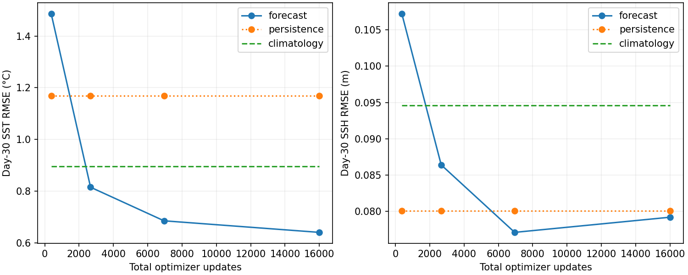

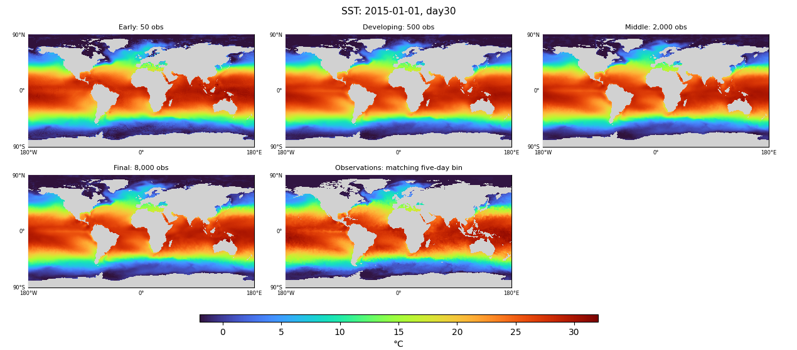

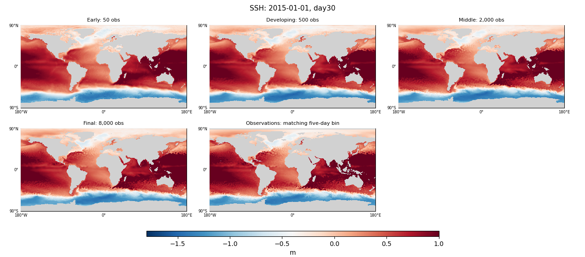

At day 30, final SST RMSE is **45.2% lower than persistence** and 56.9% lower than at the first saved stage. SSH improves by 26.2% from the early stage, but its final advantage over persistence is only **1.1%**; the middle checkpoint has lower SSH RMSE than the endpoint. Increasing observation exposure does not improve every quantity monotonically.

The maps show broad interior T/S structure already present at the early checkpoint, with smaller changes in those initialized fields than in the evolved surface fields. This is consistent with interior structure forming early, but the first stage already includes both sources, so it cannot isolate OM4's contribution. Surface values in observed initializer cells are identical across stages because they are copied from the input.

The final model retains a mean day-30 SST bias of **−0.273°C** and SSH bias of **−0.0489 m** over the 96 origins. In the January 2015 day-30 example, the coldest wet SST improves from −9.79°C to −3.98°C, still colder than the reference minimum of −1.80°C. SSH ripples and conspicuous internal-velocity bands remain. The internal U/V maps are useful diagnostics of what is carried forward, but their comparison with geostrophic proxies is not a full-current skill assessment.

| Field | Initialization, 2015 | Day 30, 2015 | Day 30, 2018 | Day 30, 2021 |
|---|---|---|---|---|
| SST | [maps](artifacts/2026-09-30-global-physical-focus/2015-01-01-initial-channel0.png) | [maps](artifacts/2026-09-30-global-physical-focus/2015-01-01-day30-channel0.png) | [maps](artifacts/2026-09-30-global-physical-focus/2018-01-01-day30-channel0.png) | [maps](artifacts/2026-09-30-global-physical-focus/2021-01-01-day30-channel0.png) |
| SSH | [maps](artifacts/2026-09-30-global-physical-focus/2015-01-01-initial-channel6.png) | [maps](artifacts/2026-09-30-global-physical-focus/2015-01-01-day30-channel6.png) | [maps](artifacts/2026-09-30-global-physical-focus/2018-01-01-day30-channel6.png) | [maps](artifacts/2026-09-30-global-physical-focus/2021-01-01-day30-channel6.png) |
| Temperature at 550 m | [maps](artifacts/2026-09-30-global-physical-focus/2015-01-01-initial-channel1.png) | [maps](artifacts/2026-09-30-global-physical-focus/2015-01-01-day30-channel1.png) | [maps](artifacts/2026-09-30-global-physical-focus/2018-01-01-day30-channel1.png) | [maps](artifacts/2026-09-30-global-physical-focus/2021-01-01-day30-channel1.png) |
| Surface salinity | [maps](artifacts/2026-09-30-global-physical-focus/2015-01-01-initial-channel2.png) | [maps](artifacts/2026-09-30-global-physical-focus/2015-01-01-day30-channel2.png) | [maps](artifacts/2026-09-30-global-physical-focus/2018-01-01-day30-channel2.png) | [maps](artifacts/2026-09-30-global-physical-focus/2021-01-01-day30-channel2.png) |
| Surface zonal velocity | [maps](artifacts/2026-09-30-global-physical-focus/2015-01-01-initial-channel4.png) | [maps](artifacts/2026-09-30-global-physical-focus/2015-01-01-day30-channel4.png) | [maps](artifacts/2026-09-30-global-physical-focus/2018-01-01-day30-channel4.png) | [maps](artifacts/2026-09-30-global-physical-focus/2021-01-01-day30-channel4.png) |
| Surface meridional velocity | [maps](artifacts/2026-09-30-global-physical-focus/2015-01-01-initial-channel5.png) | [maps](artifacts/2026-09-30-global-physical-focus/2015-01-01-day30-channel5.png) | [maps](artifacts/2026-09-30-global-physical-focus/2018-01-01-day30-channel5.png) | [maps](artifacts/2026-09-30-global-physical-focus/2021-01-01-day30-channel5.png) |

All model tiles retain one image pixel per model grid location, common scales and full polar coverage. The [numerical artifact](artifacts/2026-09-30-global-physical-focus/results.json.gz) records ranges and color-limit clipping, so saturated cold/warm values are not hidden by interpretation of the maps.

## Wider spatial spectra, all at day 30

The six regions follow [Samudra 2, Figure 9 and Appendix A.5](https://arxiv.org/abs/2606.02610v2): Gulf Stream, Kuroshio, Agulhas, Malvinas, Niño 3.4 and Tropical Pacific. The last box spans 130–290°E and 30°S–30°N. Curves average **power spectra of twelve day-30 forecasts**, one from each month of 2015. No curve blends forecast leads or uses annual forecast states.

Each final-model panel has four references: model (nominal 1° OM4 grid), OM4 (same grid), observations on that grid, and native observations. Native OISST is 0.25°; native prepared DUACS ADT is 0.125°. “Native” means the existing prepared product grid before the 1° remap. All use the same calendar five-day intervals. OM4 averages are combined by exact time-interval overlap when their native five-day phase differs from the observation bins; those weights are saved. OM4 is a model-data reference, not the verifying ocean state for an observation-initialized forecast.

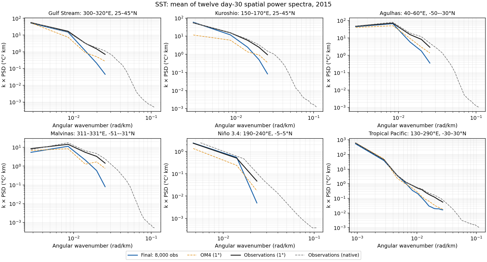

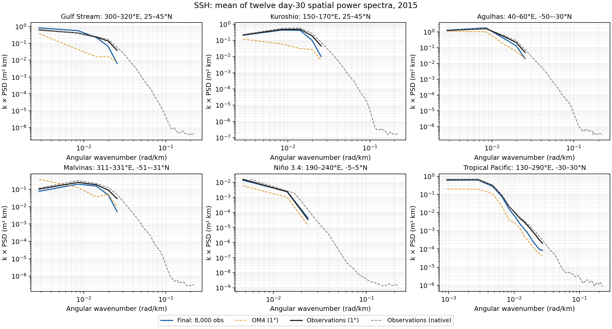

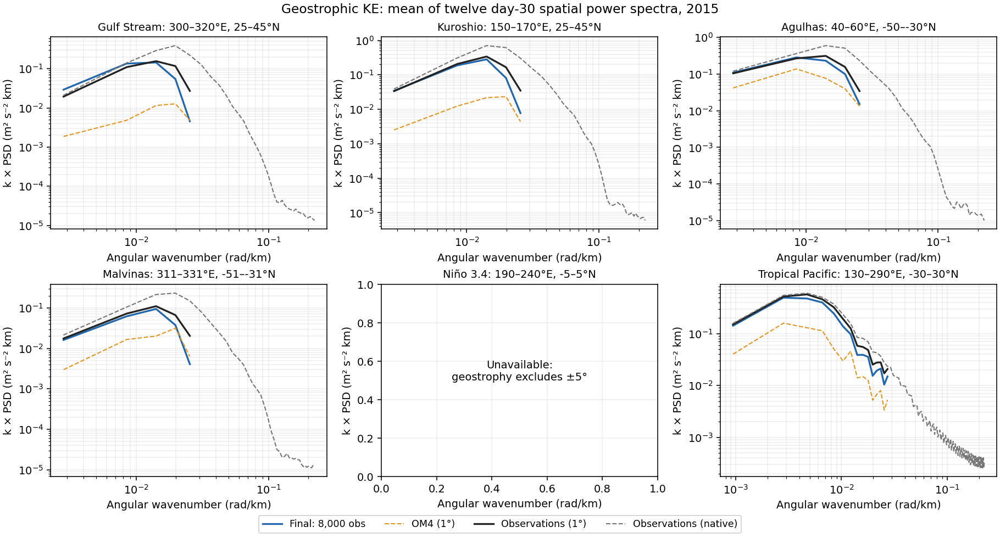

The strongest distributional shift is in **SSH and its derived geostrophic velocity**: the early checkpoint is closer to OM4, whereas later checkpoints closely approach coarse observations at resolved wavelengths and become farther from OM4. SST approaches both references; its source transition is less distinct. Even the final model lacks power at shorter resolved wavelengths relative to **observations already coarsened to 1°**. The native curves additionally reveal variability beyond the model grid's representable range.

To quantify the visible shift, the table gives mean absolute differences in log10 spectral power. It averages bins at wavelengths of at least four grid spacings in each of the four boundary-current boxes, then weights those boxes equally. Lower is closer; a difference of 0.3 corresponds to a factor of about two in power, and 1.0 to a factor of ten. This is a descriptive diagnostic, not the training selection metric.

| Model | SST vs obs 1° | SST vs OM4 1° | SSH vs obs 1° | SSH vs OM4 1° | Geo. KE vs obs 1° | Geo. KE vs OM4 1° |
|---|---:|---:|---:|---:|---:|---:|
| Early: 50 obs | 0.559 | 0.409 | 0.688 | 0.448 | 0.869 | 0.575 |
| Developing: 500 obs | 0.324 | 0.243 | 0.266 | 0.389 | 0.327 | 0.609 |
| Middle: 2,000 obs | 0.220 | 0.218 | 0.161 | 0.452 | 0.194 | 0.705 |
| Final: 8,000 obs | 0.189 | 0.208 | 0.075 | 0.583 | 0.065 | 0.863 |

This shows adaptation of the predicted spatial distribution toward observations even while OM4 exposure continues to grow. It does not show that OM4 is being forgotten in every state channel, nor identify which source caused the forecast improvement.

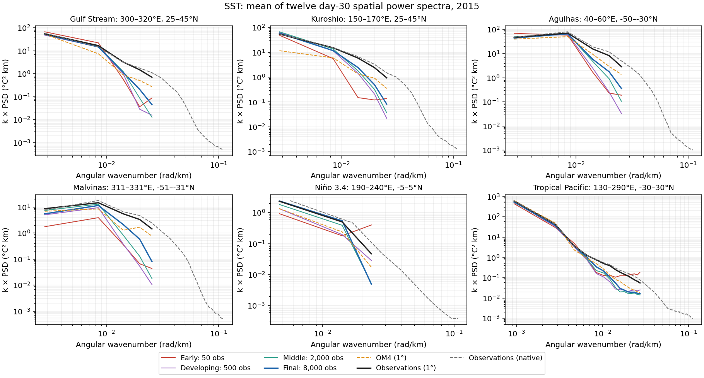

[SSH spectra through training](artifacts/2026-09-30-global-physical-focus/training-ssh-spectra.png) and [geostrophic KE spectra through training](artifacts/2026-09-30-global-physical-focus/training-geostrophic-ke-spectra.png).

The plotted KE curve is **½(Su + Sv)** from geostrophic velocities derived from each SSH field, with its own spatial mean/plane removed. This follows the component-spectrum construction in the paper, but is a spatial velocity-fluctuation diagnostic, not temporally defined EKE or the spectrum of the scalar EKE field used in prior selection. Deriving velocities from every SSH grid makes their construction explicit; it also changes the reference from the supplied DUACS U/V used by the training metrics. Geostrophy excludes ±5°, so the Niño 3.4 velocity panel is unavailable rather than filled or extrapolated.

**Land and scale treatment:** these are masked regional pseudo-spectra. Coarse curves share finite reference/OM4 wet support, fixed across all twelve dates. Native curves use that geographical support plus their native missing-value mask. A plane is fitted on finite cells; unsupported residuals contribute zero to the Fourier transform. A periodic 2D Hann window and its wet-support variance correction are applied. The mask’s spectral coupling is not deconvolved, so coastal/island features can affect especially short wavelengths. The 2D PSD is normalized per angular-wavenumber area, with k × PSD on the vertical axis. Angular wavenumbers are shown only below each grid’s lower Nyquist. Gaussian-grid latitude spacing is approximated by regional median spacing, and longitude by the cosine of regional mean latitude; the very broad Tropical Pacific panel has greater geometric approximation than the smaller boxes.

The figures retain absolute snapshot fluctuations after spatial plane removal; they are not a seasonal-anomaly or continuous eight-year spectrum reproduction of the paper. Powers are averaged after transforming individual snapshots. These wider diagnostics do not replace or alter the validated checkpoint-selection metrics. Native-to-coarse daily remapping and five-day aggregation are numerically checked against the actual coarse targets.

## Annual global means and maps

One initialization, 73 five-day autoregressive steps, prescribed future ERA5, no future surface-state corrections. The plots show **undetrended absolute global means**, with observations, initialized-state persistence and training-only monthly climatology. SST and SSH use five-day intervals; OHC uses calendar-month averages, separately for 0–700 and 700–2000 m. OHC is an area-mean column integral in GJ/m², not a global heat-content total in ZJ.

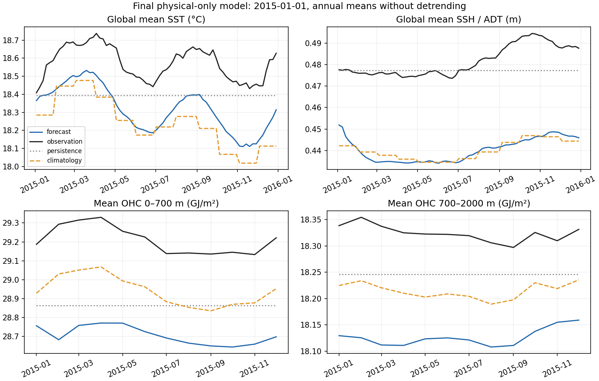

[2018 global means](artifacts/2026-09-30-global-physical-focus/2018-01-01-annual-global-means.png) · [2021 global means](artifacts/2026-09-30-global-physical-focus/2021-01-01-annual-global-means.png)

The final model broadly follows the seasonal SST cycle, but remains cold. Its SSH global mean settles close to the older training climatology rather than tracking the later observed level. Both OHC bands have persistent negative offsets; in all three cases the forecast's absolute mean OHC offset is larger than the native-IAP climatology baseline's. The initialized-state persistence lines are already low relative to the observed monthly means, and evolution lowers OHC further. SST/SSH suggest anchoring to the training distribution; OHC additionally contains a vertical-representation mismatch, quantified below.

The mean forecast-minus-observation offsets are shown below. SST/SSH average the 73 five-day points; OHC averages the twelve monthly points equally:

| Origin | SST °C | SSH m | OHC 0–700 GJ/m² | OHC 700–2000 GJ/m² |
|---|---:|---:|---:|---:|
| 2015-01-01 | −0.254 | −0.0413 | −0.504 | −0.197 |
| 2018-01-01 | −0.202 | −0.0478 | −0.514 | −0.196 |
| 2021-01-01 | −0.210 | −0.0441 | −0.459 | −0.194 |

These are offsets of the plotted area-mean series, not spatial RMSEs. The annual maps still show nonphysical structure, so matching seasonality or a global mean cannot establish spatial realism.

**OHC representation check:** the observed OHC integrates native IAP layers, whereas forecast OHC integrates the model's layers. Taking the *same* preceding-December analysis, sampling it at the model depths and applying the forecast integration already gives the following offsets relative to its native-layer integral:

| IAP context month | Model-layer minus native OHC 0–700 GJ/m² | Model-layer minus native OHC 700–2000 GJ/m² |
|---|---:|---:|
| 2014-12 | −0.211 | −0.060 |
| 2017-12 | −0.208 | −0.059 |
| 2020-12 | −0.208 | −0.059 |

This demonstrates a material representation contribution before model error. It is a three-month context check, not a correction to the annual curves or a precise decomposition of their biases. The additional drop from initialized-state persistence to the forecast is independent evidence of evolution changing the mean heat content.

Global means use cosine-latitude weights on the model grid. Every curve in a given annual panel uses the same fixed support: model wet cells with finite observations and baseline values throughout that year. This removes changes in missing-data coverage as a source of apparent time-series drift. “Global” therefore means globally distributed observed support, not an estimate of unobserved ocean cells. The retained fraction of the model’s surface wet area is:

| Origin | SST | SSH | OHC 0–700 | OHC 700–2000 |
|---|---:|---:|---:|---:|
| 2015-01-01 | 93.0% | 93.0% | 81.8% | 76.2% |
| 2018-01-01 | 93.0% | 93.0% | 81.8% | 76.2% |
| 2021-01-01 | 93.0% | 93.0% | 81.8% | 76.2% |

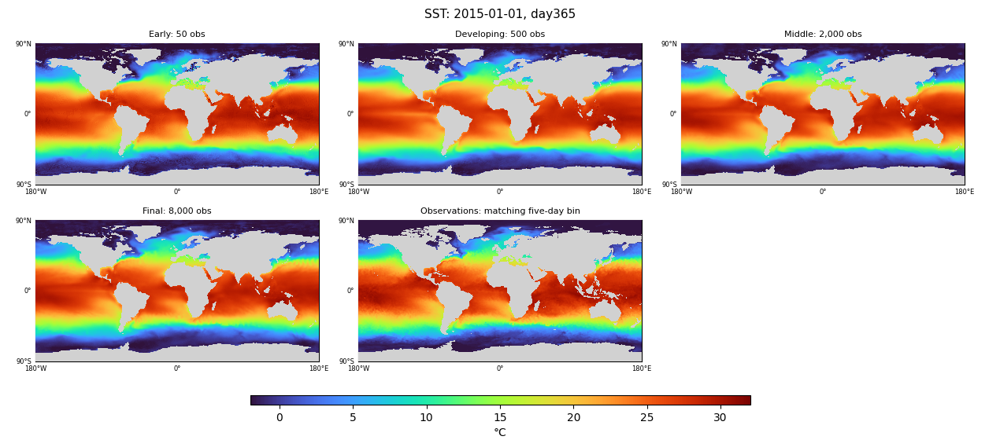

| Field | Annual, 2015 | Annual, 2018 | Annual, 2021 |
|---|---|---|---|
| SST | [maps](artifacts/2026-09-30-global-physical-focus/2015-01-01-day365-channel0.png) | [maps](artifacts/2026-09-30-global-physical-focus/2018-01-01-day365-channel0.png) | [maps](artifacts/2026-09-30-global-physical-focus/2021-01-01-day365-channel0.png) |
| SSH | [maps](artifacts/2026-09-30-global-physical-focus/2015-01-01-day365-channel6.png) | [maps](artifacts/2026-09-30-global-physical-focus/2018-01-01-day365-channel6.png) | [maps](artifacts/2026-09-30-global-physical-focus/2021-01-01-day365-channel6.png) |
| Temperature at 550 m | [maps](artifacts/2026-09-30-global-physical-focus/2015-01-01-day365-channel1.png) | [maps](artifacts/2026-09-30-global-physical-focus/2018-01-01-day365-channel1.png) | [maps](artifacts/2026-09-30-global-physical-focus/2021-01-01-day365-channel1.png) |
| Surface salinity | [maps](artifacts/2026-09-30-global-physical-focus/2015-01-01-day365-channel2.png) | [maps](artifacts/2026-09-30-global-physical-focus/2018-01-01-day365-channel2.png) | [maps](artifacts/2026-09-30-global-physical-focus/2021-01-01-day365-channel2.png) |
| Surface zonal velocity | [maps](artifacts/2026-09-30-global-physical-focus/2015-01-01-day365-channel4.png) | [maps](artifacts/2026-09-30-global-physical-focus/2018-01-01-day365-channel4.png) | [maps](artifacts/2026-09-30-global-physical-focus/2021-01-01-day365-channel4.png) |
| Surface meridional velocity | [maps](artifacts/2026-09-30-global-physical-focus/2015-01-01-day365-channel5.png) | [maps](artifacts/2026-09-30-global-physical-focus/2018-01-01-day365-channel5.png) | [maps](artifacts/2026-09-30-global-physical-focus/2021-01-01-day365-channel5.png) |

## Methods and limits

Small D ConvNeXt U-Net: widths 128/192/256/384, one block per level, dilations 1/2/4/8, periodic longitude padding and zero latitude padding. The initializer takes 19 five-day history frames (95 days), finite-input indicators, forcings, spherical geographic coordinates and annual sine/cosine. It emits two states containing T/S/U/V at 19 depths plus SSH; the processor uses the previous two states. No physical freezing or velocity constraint is imposed.

Seed 1729; AdamW at 1e-4, weight decay 0.01, clipping 1, effective batch 8, no warmup. OM4 uses original forcings and full-state forecast/reconstruction losses. Observation forcings use the learned ERA5 adapter; observations supervise monthly T/S, SST/SSH forecast, interior reconstruction and artificial-gap surface completion. Forecast training covers six OM4 steps or six/seven observation steps spanning a month. The observation objective is 0.8 monthly T/S + 0.1 SST + 0.1 SSH + 0.1 interior reconstruction + 0.1 artificial-gap surface completion. These coefficients are not fractions of gradient contribution. Reconstruction trains the initializer from histories throughout the month; those later surface observations do not enter the forecast trajectory. The [preceding methods report](global-domain-results-2026-09-30.md#model-and-training-details) describes the shared experiment setup.

OHC integrates temperature relative to 0°C, using ρ=1035 kg/m³ and cp=3850 J/(kg K), with each product’s layer overlap against the depth band and complete column support. Forecasts use OM4 model layers; observations use native IAP layers before horizontal remapping. Observation OHC climatology is the per-location, per-calendar-month mean of training-only native IAP OHC integrals; surface climatology is the existing training-only monthly spatial climatology. These baselines do not supply the initializer’s missing values.

All checkpoint lineage hashes and counts, exact cohorts, global evaluation flags, prepared/native reference hashes and archive members are retained in the [evidence and provenance](artifacts/2026-09-30-global-physical-focus/provenance.json.gz). The new regional transform passed amplitude/plane-invariance, resolved-wavelength, Nyquist, empty-support and geostrophic-sign/equator checks. Map pixels and native/coarse equivalence were checked. Failed launch attempts are included in allocation accounting.

One trajectory and twelve spectral snapshots support descriptive conclusions about this model, not a causal decomposition of the value of each data source. Both source exposures and observation frequency change together. Internal fields lacking observation supervision remain diagnostic states, and finite analyzed products do not establish direct measurement coverage under ice. Annual means can look good while spatial patterns are poor, which is why the maps remain alongside them.

The additional checkpoint inference used **0.245 allocated GPU-hours**, including all six failed launch attempts and their successful replacements. The first CPU collector was canceled after repeated NPZ decompression was diagnosed; its replacement completed successfully. Original records and outputs are preserved. This report required no retraining; the existing final-checkpoint evaluations were reused.

[Machine-readable results](artifacts/2026-09-30-global-physical-focus/results.json.gz) · [execution plan](global-physical-focus-plan-2026-09-30.md) · [previous global model comparison](global-domain-results-2026-09-30.md)
