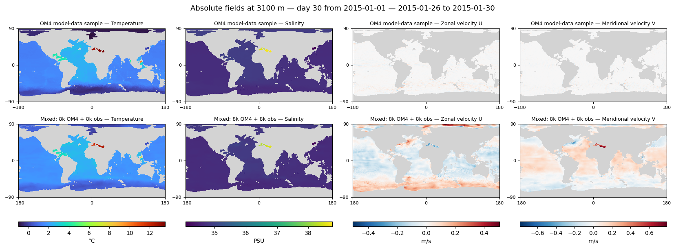
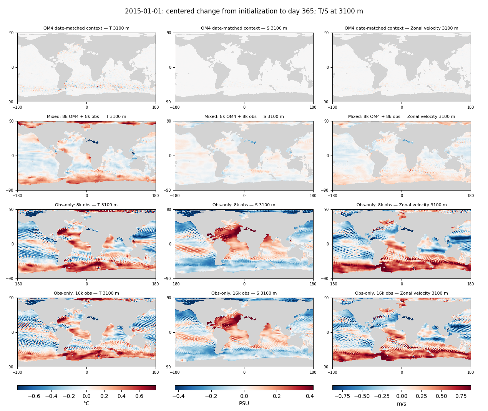
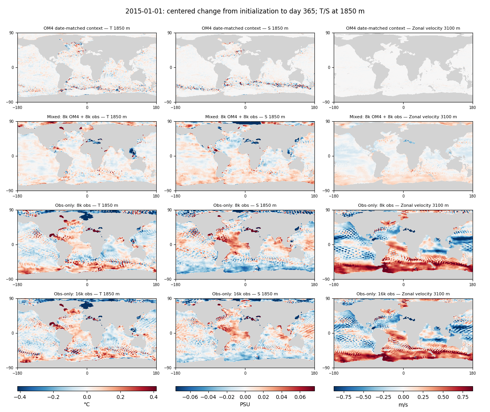

<!-- SPDX-FileCopyrightText: 2026 Samudra Authors -->
<!-- SPDX-License-Identifier: CC-BY-4.0 -->

# Quick comparison with Samudra 2: deep T/S imprinting

**We see related spatial artifacts, most clearly in the obs-only models, but have not established the same causal mechanism.** At 3100 m, obs-only T/S and the internal zonal-velocity channel develop shared bands/ripples. Mixed has substantially smaller salinity changes and weaker velocity association, but retains broad deep-temperature bands. Much of the departure is already present after the first five-day processor step, suggesting an initializer/processor adjustment as well as subsequent rollout artifacts.

## What the paper establishes, and what this check can establish

[Samudra 2, §4.2, Figure 4(e), Figures 5–6](https://arxiv.org/abs/2606.02610v2) identifies imprinting in the **original Samudra** and shows substantial suppression in Samudra 2. Its evidence combines velocity-like structure in deseasonalized temperature at 3100 m, excessive deep T/S temporal variance, and high-frequency deep global-mean fluctuations over an eight-year rollout. It relates the improvement to dynamic loss weighting that gives slow fields more influence.

Our check uses the existing report's final mixed and obs-only 8k/16k checkpoints, for the January 2015 and January 2018 initializations. Both histories and all OM4 reference intervals match exactly. We inspect saved initial states and days **5, 15, 30, 90, 180 and 365**, with quantitative reductions at 550, 1850 and 3100 m. No model was rerun. The **OM4 date-matched context** is the simulation itself, not an observation-initialized forecast or current observation truth.

The maps show **change from each source's own initial state, with that change's spatial mean removed**. This removes much of the background climatological structure and global drift so we can examine spatial patterns. It is **not** the paper's deseasonalized anomaly or eight-year variance diagnostic. Six irregularly spaced saved leads cannot establish high-frequency temporal noise; this quick comparison does not attempt that claim.

The learned models share the small D architecture and task-conditioned InstanceNorm setup described in the [main report](global-physical-day30-2026-09-30.md#methods-and-limits). **Mixed: 8k OM4 + 8k obs** has 62,966,546 parameters and 77 physical slots; **Obs-only: 8k obs** and **Obs-only: 16k obs** have the same architecture trained only on observations. None has the ten extra memory slots. Unlike the paper's full-state OM4 training, our direct observation T/S targets stop at **1850 m**, sampled from IAP extending to approximately 2000 m. Thus 3100-m T/S slots have **no direct observation targets**; mixed supervises them only on OM4-task steps. All observation-task U/V slots are also unconstrained. The displayed physical units below are the slots' nominal scaling, not a guarantee of physical meaning.

## Absolute fields at day 30: OM4 versus mixed only

These panels show **actual T/S/U/V fields at 3100 m**, for the same January 26–30 forecast intervals, with OM4 above and mixed below. There is **no initial-state subtraction, anomaly calculation or spatial-mean removal**. U/V are the physical state channels, not velocities derived from SSH. The observation-conditioned model's unconstrained deep-slot interpretation still applies.

**Obs-only is excluded from both the figures and color-range calculation.** Each field has a shared scale across OM4/mixed and the two dates, spanning all finite values; U/V ranges are symmetric around zero. No percentile clipping is applied. Maps retain one pixel per grid cell and the common depth masks.

[Same absolute-field comparison for 2018](artifacts/2026-10-05-absolute-day30/2018-01-01-day30-depth3100.png) · [Source and range audit](artifacts/2026-10-05-absolute-day30/provenance.json.gz).

The full-field view retains broad T/S structure that the change maps intentionally subtract, while the mixed model's U/V fields differ substantially from the date-matched OM4 currents. These plots reuse verified local snapshots and require no new inference. Additional matched-depth U/V extraction at 550/1850 m could not be submitted because Torch's Slurm controller was unavailable; those four-field comparisons are not included here.

## Deep spatial structure

Each column uses a common scale across all four rows; gray denotes the fixed field/depth wet mask. Colors saturate at the pooled 98th percentile of absolute centered changes for that figure/column, with clipping fractions archived. This makes OM4's much smaller deep changes visible primarily around energetic regions; it is not a claim that its changes vanish. Cells remain one pixel per model grid location. Color ranges can differ between dates and leads.

[Day30 at 3100 m, 2015](artifacts/2026-10-05-imprinting/2015-01-01-day30-depth3100.png) · [Day30 at 3100 m, 2018](artifacts/2026-10-05-imprinting/2018-01-01-day30-depth3100.png) · [Day365 at 3100 m, 2018](artifacts/2026-10-05-imprinting/2018-01-01-day365-depth3100.png).

The table averages the two dates' area-weighted RMS **spatial departures from initialization after removing each departure's global mean**. These are change amplitudes, not RMSE against OM4 or IAP and not temporal variances.

| Model | T3100 day30 °C | T3100 day365 °C | S3100 day30 PSU | S3100 day365 PSU |
|---|---:|---:|---:|---:|
| OM4 date-matched context | 0.0264 | 0.0445 | 0.0016 | 0.0029 |
| Mixed: 8k OM4 + 8k obs | 0.1663 | 0.1724 | 0.0306 | 0.0298 |
| Obs-only: 8k obs | 0.3401 | 0.3541 | 0.1760 | 0.1805 |
| Obs-only: 16k obs | 0.2987 | 0.3323 | 0.1682 | 0.1747 |

Mixed is much quieter than scratch in salinity, but still changes substantially more than OM4. At day365 its centered deep-T change is about 4× OM4's; its deep-S change about 10×. Obs-only centered deep-S changes are roughly 60× OM4's. These ratios diagnose different behavior, not forecast error, because the initial states and ocean realizations differ.

## Do those patterns actually resemble velocity?

As an exploratory check, we compare changes in T/S with changes in the **same model's internal U at 3100 m**. We remove a mask-normalized Gaussian-smoothed field (σ=3 grid cells, longitude wrapping), then calculate cosine-area-weighted centered spatial correlations on common wet support. Removing smooth structure reduces the chance that shared broad basin gradients alone explain the association. This is not the paper's published metric or a significance test.

| Model | Day365 correlation: T3100 change versus U3100 change | Day365 correlation: S3100 change versus U3100 change |
|---|---:|---:|
| OM4 date-matched context | -0.009 | 0.003 |
| Mixed: 8k OM4 + 8k obs | 0.041 | 0.101 |
| Obs-only: 8k obs | 0.218 | 0.531 |
| Obs-only: 16k obs | 0.278 | 0.547 |

The salinity/velocity association is strong and repeats on both dates for both scratch checkpoints; mixed's association is weak. Mixed temperature has obvious latitude-band structure, but its filtered correlation with deep U is only about 0.04. Therefore **the strongest specific imprinting-like evidence is scratch salinity, not a universal velocity-to-temperature copying claim**. Correlation cannot tell whether velocity drives T/S, T/S drives velocity, or shared network features generate all of them. It also does not establish that the velocity slots encode a physically fast process on the observation task.

## Shallower supervised fields and early adjustment

At 1850 m, within direct observation T/S supervision, the deep artifacts are reduced but scratch still has conspicuous ripples, particularly near the southern high latitudes. Mixed has fewer such features. Mean day365 RMS changes before removing spatial means are **0.121°C / 0.0365 PSU** for mixed, **0.149°C / 0.0492 PSU** for scratch16k, and **0.057°C / 0.0104 PSU** in OM4. These again measure changes, not errors against a common verifying ocean.

[Day30 at 1850 m, 2015](artifacts/2026-10-05-imprinting/2015-01-01-day30-depth1850.png) · [Day30 at 1850 m, 2018](artifacts/2026-10-05-imprinting/2018-01-01-day30-depth1850.png) · [Day365 at 1850 m, 2018](artifacts/2026-10-05-imprinting/2018-01-01-day365-depth1850.png). The right-hand column deliberately remains **U at 3100 m**, as labeled; it is deep-velocity context rather than a matched-depth velocity panel for 1850-m T/S.

Much of the deep departure happens immediately. Mixed T3100 RMS change is **0.258°C at day5**, versus **0.269°C at day365**; corresponding OM4 changes are **0.008°C and 0.045°C**. Scratch16k T3100 already changes **0.278°C at day5**, reaching **0.344°C at day365**. Mixed also introduces approximately −0.21°C mean deep-T shift in that first step. These amplitudes do not prove the spatial pattern is stationary, but they make initializer/processor consistency a plausible contributor that the paper's long-rollout comparison does not isolate.

## Takeaway

**Yes to related deep-field artifacts; only qualified evidence for the same imprinting mechanism.** The scratch runs show the clearest repeated cross-field patterns; OM4 training reduces them substantially, especially in salinity. Mixed still does not preserve a quiet, physically interpretable deep state on the observation path. Direct supervision ends above the most diagnostic depth, and internal channels can carry nonphysical information, making this a different setting from the paper.

The most informative follow-up would distinguish (a) an initial state adjustment from continuing temporal noise using densely saved early states, and (b) shared network patterns from directional cross-field influence by perturbing or replacing U/V and measuring T/S changes. This inspection alone does not establish that dynamic loss weighting would fix our problem, or that suppressing these unconstrained channels' structures would improve observed forecasts.

## Provenance

CPU extraction job **19230825** completed successfully in **22 seconds**, zero GPU-hours. All six model source NPZ hashes match the published report; saved checkpoint lineage is retained. OM4 uses exactly covered five-day intervals, and its initial reference matches the final input bin. No weights, scores or selection changed. [Full reductions at all saved leads/depths, plotting limits, source hashes and scripts](artifacts/2026-10-05-imprinting/provenance.json.gz).
