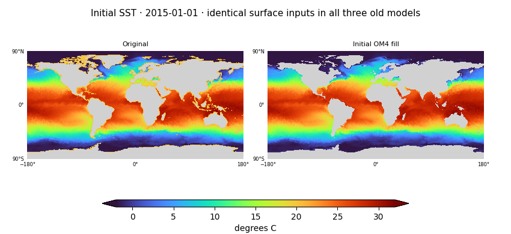
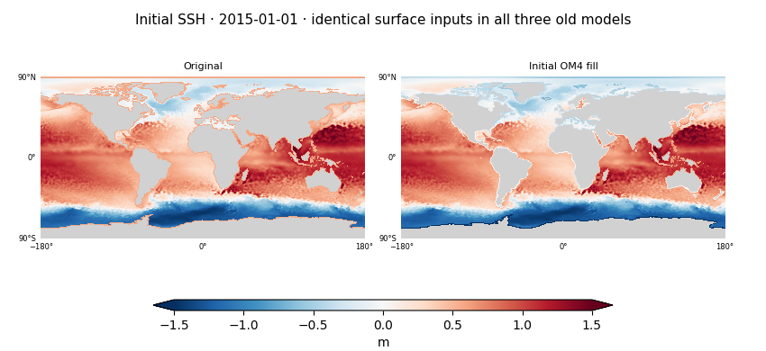
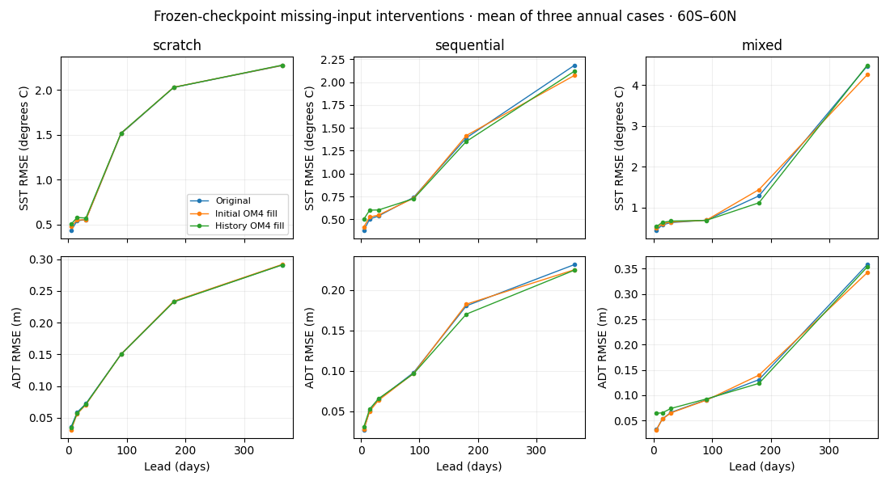
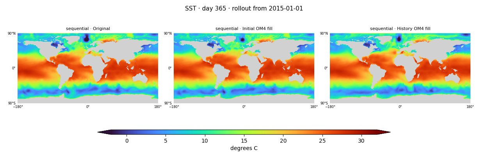

<!-- SPDX-FileCopyrightText: 2026 Samudra Authors -->
<!-- SPDX-License-Identifier: CC-BY-4.0 -->

# Initialization-gap diagnostics: frozen existing models

Replacing unrealistic values in missing initial surface cells visibly repairs
initial maps, but does not remove the large annual forecast artifacts. For the
sequential model, an OM4 climatology fill reduces mean day-365 SST RMSE by 5.1%;
for mixed, by 4.8%; scratch changes by less than 0.1%. Replacing missing values
throughout the input history worsens day-30 SST error in all three models.
These are sensitivity results from frozen models, not evidence that missingness-aware
training cannot help. Fresh training comparisons are now complete in the
[missingness results](missingness-results-2026-09-29.md).

## Models and interventions

These are the completed approximately 205.6M-parameter InstanceNorm models from the
[preceding experiment](three-day-findings-2026-09-26.md#completed-production-results),
with the 121.7M history initializer and 83.9M Samudra-2-matched processor. They are
not the new approximately 63M-parameter models. The literal plot/table names mean:

| Model label | Training and selected checkpoint |
| --- | --- |
| scratch | Samudra2 scratch: observation-only training from random weights; selected after 7,900 observation updates. |
| sequential | Samudra2 sequential: 8,000 OM4 updates, then observations; selected after 7,700 observation updates. |
| mixed | Samudra2 mixed: scheduled interleaving; selected at 7,467 OM4 and 5,733 observation updates. |

All five interventions use each model's same selected weights:

| Intervention | Meaning |
| --- | --- |
| Original / baseline | Unchanged old input filling and unconditional surface copy. |
| Initial zero / initial-zero | Replace missing SST/SSH in the two initialized state frames by normalized zero; retain all other initialized channels exactly. |
| History zero / history-zero | Replace missing surface values throughout the 19-frame input history by normalized zero, then rerun the initializer. |
| Initial OM4 fill / initial-om4 | Replace only missing SST/SSH in the two initialized state frames with location-specific OM4 monthly climatology; retain other channels exactly. |
| History OM4 fill / history-om4 | Apply that fill throughout the 19-frame input history, then rerun the initializer. |

The OM4 climatology uses only source-training dates, 1975-01-03 through 2013-07-27.
It is simulation-informed even when applied to scratch: that intervention is not
an observation-only model. Replacement requires a wet cell and a finite fill.
Available initial observations are preserved exactly. No future observations,
retraining, checkpoint selection or fitted forecast correction is involved.

## What the initialization maps reveal

For the 2015-01-01 annual case's last initial frame, 1,309 of 7,686 wet cells north
of 60N lack SST inputs, and 2,000 lack SSH inputs. Thus the Arctic is not wholly
unobserved. In the missing northern SST cells, the old fill averages **20.18°C**,
versus **−1.04°C** with OM4 climatology (unweighted cell means). These are fill
values, not measurements or validated accuracy. The old fallback is already near
the normalization mean, which helps explain why the normalized-zero intervention
has little effect. Surface initialization is identical across the three old
models because the old code overwrites these channels with supplied values.

## Forecast sensitivity

Numbers are arithmetic means of per-origin RMSE for the three existing annual
origins, 2015-01-01, 2018-01-01 and 2021-01-01. Day 30 and day 365 are lead-specific
five-day-mean outputs from continuous rollouts, not errors averaged over 30 or
365 days. Scores use the existing observation support within 60S–60N; the maps
show the full grid. These previously inspected test cases are exploratory diagnostics.
They do not establish validated accuracy in naturally unobserved polar cells.

| Model | Intervention | Day-30 SST RMSE (°C) | Day-365 SST RMSE (°C) | Day-365 ADT RMSE (m) |
| --- | --- | ---: | ---: | ---: |
| scratch | baseline | 0.5542 | 2.2711 | 0.2911 |
| scratch | initial-zero | 0.5543 | 2.2711 | 0.2911 |
| scratch | history-zero | 0.5542 | 2.2714 | 0.2913 |
| scratch | initial-om4 | 0.5526 | 2.2731 | 0.2917 |
| scratch | history-om4 | 0.5712 | 2.2761 | 0.2910 |
| sequential | baseline | 0.5364 | 2.1854 | 0.2318 |
| sequential | initial-zero | 0.5363 | 2.1863 | 0.2318 |
| sequential | history-zero | 0.5365 | 2.1897 | 0.2316 |
| sequential | initial-om4 | 0.5468 | 2.0744 | 0.2253 |
| sequential | history-om4 | 0.6022 | 2.1209 | 0.2249 |
| mixed | baseline | 0.6319 | 4.4749 | 0.3584 |
| mixed | initial-zero | 0.6319 | 4.4702 | 0.3582 |
| mixed | history-zero | 0.6318 | 4.4654 | 0.3578 |
| mixed | initial-om4 | 0.6486 | 4.2608 | 0.3423 |
| mixed | history-om4 | 0.6694 | 4.4946 | 0.3536 |

The history-wide interventions change hidden initialized channels as well as
surface values, so their differences cannot be attributed solely to the surface
state. Initial-only replacement isolates the latter. Neither should be interpreted
as a deployable optimum; we did not select a preferred intervention using these cases.

## Do the gross structures disappear?

No: the selected sequential model retains substantial spatial artifacts at one
year after repairing the initial missing surface values. This weakens the specific
hypothesis that bad initial fills alone explain the annual failure. It leaves
open whether training with correctly handled gaps changes the learned dynamics.

[Scratch day-365 SST](artifacts/2026-09-28-missingness/gap-day365-sst-part1.png) ·
[Mixed day-365 SST](artifacts/2026-09-28-missingness/gap-day365-sst-part3.png) ·
[All day-30 SST](artifacts/2026-09-28-missingness/gap-day30-sst.png)

Day-365 SSH: [scratch](artifacts/2026-09-28-missingness/gap-day365-ssh-part1.png),
[sequential](artifacts/2026-09-28-missingness/gap-day365-ssh-part2.png),
[mixed](artifacts/2026-09-28-missingness/gap-day365-ssh-part3.png).
Maps retain one image pixel per grid cell and shared color limits within each field.

## Verification and provenance

All nine unmodified model/origin forecasts reproduce the saved original surface
forecasts exactly (maximum absolute difference zero), before interpreting any
interventions. Corrected diagnostic jobs 18724936, 18724937 and 18724938 completed
successfully with producer `053e34947932fdb56c6baf2c717a23f2df3cc733`.
The earlier launcher failure and canceled queued siblings are preserved in
[progress](progress.md); they did not produce forecasts. The report bundle and
every transferred file were checked by SHA256 after transfer.

Selected checkpoint hashes:

| Model | SHA256 |
| --- | --- |
| scratch | `37191e186bddbd3ddecc25dbc707333ff0f5e6090d977b49d465ea0a0397f2dd` |
| sequential | `807b37d024113be412a67b97e16661e222ed9b91a264b3409a1ff6f5662ddcbd` |
| mixed | `e308c8bcc2749d601bcc99d0f7e88dca47834bb2d34028383d053e8e017ee264` |

[Numerical results and map-geometry audit](artifacts/2026-09-28-missingness/gap-summary.json.gz)
include all five interventions, per-origin results and transfer-bundle checksum.
The reproducible renderer is `scripts/plot_observation_gaps.py`.
