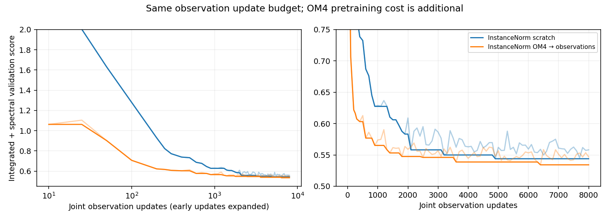
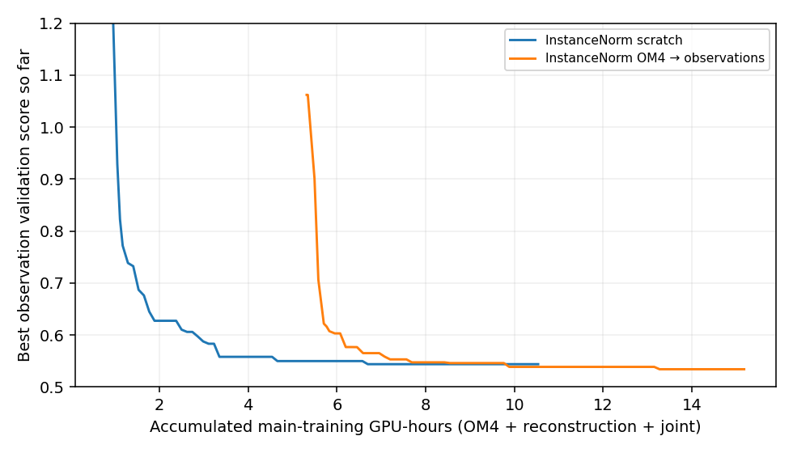
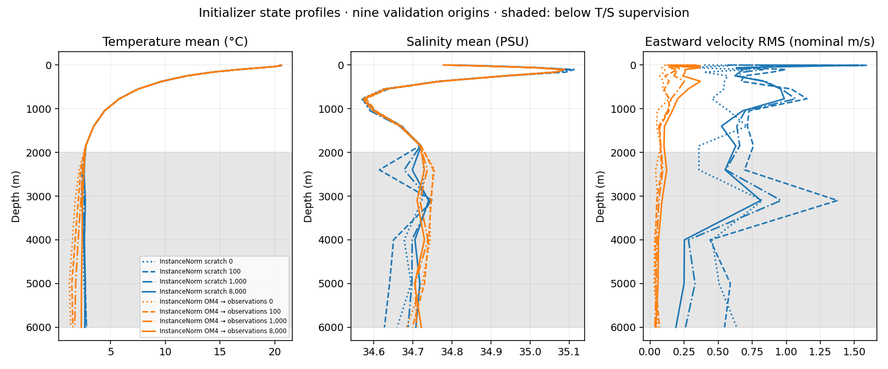

<!-- SPDX-FileCopyrightText: 2026 Samudra Authors -->
<!-- SPDX-License-Identifier: CC-BY-4.0 -->

# InstanceNorm comparison: completed one-seed results

26 September 2026. Both arms completed 1,000 observation reconstruction updates
and 8,000 joint observation updates, followed by all monthly, annual and
initializer diagnostics. **OM4 pretraining accelerates early observation learning;
the final selected short-rollout improvement is small. Its year-long temperature
and sea-level forecasts improve more substantially, while year-long geostrophic
velocity error does not.** This is one seed, with independently calibrated learning
rates, so it does not isolate a universal pretraining effect.

## Methods and model names

| Literal model name | Definition |
| --- | --- |
| InstanceNorm scratch | Random initializer and evolution, zero-output ERA5 adapter; 1,000 observation reconstruction updates followed by 8,000 joint observation updates. No OM4 training weights. |
| InstanceNorm OM4 → observations | Fresh InstanceNorm initializer/evolution jointly pretrained on OM4, then the same observation reconstruction/joint schedule and ERA5 adapter. |
| Selected-initializer persistence | Hold the selected model's inferred ocean state fixed through the forecast; recompute the same observation metrics. This is inferred-state persistence, not raw observed-surface persistence. |

Both use the D-sized non-diffusion architecture: approximately **121.7M initializer,
31.6M evolution and 387 adapter parameters** (153.3M total), with fresh affine
InstanceNorm and no running statistics. Existing BatchNorm checkpoints are not
converted warm starts. The original OM4 forcing channels and their normalization
remain in pretraining; the learned adapter supplies their counterparts from ERA5
during observation training. State scaling is shared and derived from observation
training data. The global 180×360 Gaussian grid, static masks, data splits,
seed1729 and effective batch eight are shared.

AdamW uses weight decay 0.01, gradient clipping 1 and BF16. Equal-budget rate
pilots each use 1,000 reconstruction plus 250 joint updates; production restarts
from its designated initial weights. Scratch selected core LR 3e-4; transfer
selected 1e-4, with 25-update observation warmup. OM4 selected LR 3e-4 and used
100-update warmup. Adapter LR is 1e-3 in reconstruction and 1e-4 jointly.
The observation objective retains monthly T/S reconstruction, surface SST/ADT
forecast losses and auxiliary reconstruction; velocity and deep state remain
unconstrained. The reconstruction **last** state enters joint training. An early
implementation that discarded reconstruction learning was corrected, requalified
and rerun; its attempts are included in the accounting.

Fresh OM4 joint pretraining stopped at 14,261 updates after six non-improving
validation checks, retaining its best T/S checkpoint. This is not a reproduction
of historical D's much longer, separately trained evolution and initializer.
[Full settings and qualification](instance-norm-wave.md) and
[historical D training](d-training-history.md) distinguish those protocols.

## Selection and learning curves

Selection uses nine validation months and the frozen **v3 integrated-plus-spatial-
spectral score**: half the mean of five integrated errors divided by fixed
validation-climatology errors, plus half the mean spectral error in dex. Lower
is better. A dex is a base-10 logarithmic difference: 0.3 dex is roughly a factor
of two in spectral power. SST/ADT/EKE spatial spectra enter selection; training
RMSE does not select checkpoints. Version 3 enforces observed derivative-stencil
support for geostrophic velocity; do not directly compare these scores with the
older v2 reports.

Faint curves show each validation; solid curves show the best so far. At exactly
1,000 joint updates, scratch scores 0.6290 and OM4-initialized scores 0.5739.
The following results use each arm's validation-selected checkpoint, not its final
8k weights.

| Model | Selected joint update | Validation score | Final 8k score | Main training GPU-hours |
| --- | ---: | ---: | ---: | ---: |
| InstanceNorm scratch | 4,900 | 0.5439 | 0.5581 | 10.54 |
| InstanceNorm OM4 → observations | 6,400 | 0.5342 | 0.5469 | 15.18 |

Compute includes all main pretraining, reconstruction and joint-training allocation,
including OM4 updates after its best source checkpoint. Calibration, qualification,
evaluation and discarded attempts are separately included in the full-wave total.
GPU-hours are a rough hardware-time comparison, not FLOPs; validation and I/O are
included, and observed throughput differs across hosts. The early advantage on the
observation-update axis therefore does not establish a total-compute advantage.
Scratch's best occurs at 4,900, with no later improvement through 8,000: the
conditional extension to 16,000 is not triggered.

## Held-out monthly evaluation

**96 independently initialized monthly origins, January 2015–December 2022**;
forecasts run to day 30. These are eight years of evaluation dates, not one
continuous eight-year rollout. The test composite below uses the same frozen
validation denominators and spectral keys; no test outcome affects selection.
Integrated entries average the protocol's day-5/15/30 errors where applicable.

| Model | Composite | Spectral error (dex) | SST RMSE (°C) | Geostrophic velocity RMSE (m/s) | EKE RMSE (m²/s²) | OHC 0–700 m RMSE (GJ/m²) | OHC 700–2000 m RMSE (GJ/m²) |
| --- | ---: | ---: | ---: | ---: | ---: | ---: | ---: |
| InstanceNorm scratch | 0.6035 | 0.3082 | 0.5107 | 0.1104 | 0.02428 | 0.724 | 0.404 |
| Selected-initializer persistence (InstanceNorm scratch) | 0.6045 | 0.2155 | 0.7912 | 0.1290 | 0.02388 | 0.690 | 0.433 |
| InstanceNorm OM4 → observations | 0.5914 | 0.2947 | 0.5092 | 0.1090 | 0.02393 | 0.709 | 0.401 |
| Selected-initializer persistence (InstanceNorm OM4 → observations) | 0.6004 | 0.2155 | 0.7912 | 0.1290 | 0.02388 | 0.682 | 0.422 |

The composite only narrowly beats selected-initializer persistence, especially
for scratch. Persistence has worse SST/velocity RMSE but lower spectral error;
this trade-off should be visible when interpreting the aggregate score.

## Continuous one-year evaluation

Each selected model starts once and autoregresses for **73 five-day steps** without
future surface corrections or resets. Future ERA5 forcing is prescribed, so this
is conditional ocean evolution, not an operational atmospheric forecast. The
three held-out starts are 1 January 2015, 2018 and 2021. The table averages each
origin's RMSE, rather than pooling all grid points into a new RMSE.

| Model | Lead | SST RMSE (°C) | ADT RMSE (m) | Geostrophic velocity RMSE (m/s) |
| --- | ---: | ---: | ---: | ---: |
| InstanceNorm scratch | 30 days | 0.598 | 0.0729 | 0.1333 |
| InstanceNorm scratch | 90 days | 1.238 | 0.1330 | 0.1612 |
| InstanceNorm scratch | 180 days | 2.050 | 0.1982 | 0.1727 |
| InstanceNorm scratch | 365 days | 2.110 | 0.2192 | 0.1805 |
| InstanceNorm OM4 → observations | 30 days | 0.587 | 0.0731 | 0.1309 |
| InstanceNorm OM4 → observations | 90 days | 0.772 | 0.0980 | 0.1595 |
| InstanceNorm OM4 → observations | 180 days | 1.075 | 0.1254 | 0.1729 |
| InstanceNorm OM4 → observations | 365 days | 1.291 | 0.1536 | 0.1870 |

| Model | Day-365 SST spectral error (dex) | Day-365 ADT spectral error (dex) | Annual EKE RMSE (m²/s²) | Monthly OHC 0–700 m RMSE (GJ/m²) | Monthly OHC 700–2000 m RMSE (GJ/m²) |
| --- | ---: | ---: | ---: | ---: | ---: |
| InstanceNorm scratch | 0.7484 | 0.8832 | 0.02706 | 1.836 | 0.903 |
| InstanceNorm OM4 → observations | 0.3477 | 0.2977 | 0.02605 | 1.280 | 0.648 |

Spectral errors average the three geographic regions and three annual origins;
OHC averages the 36 calendar-month RMSEs. These support the longer-horizon
SST/ADT advantage without claiming improvement in every quantity.

All annual sequences completed with finite states. Both accumulate substantial
error; lower SST/ADT error does not imply better velocity or general long-term
stability. Annual EKE uses each continuous sequence's own mean, unlike the
fixed-lead, multi-origin EKE used in checkpoint selection. Three annual origins
and one training seed do not establish statistical robustness.

## Checkpoint maps and initializer diagnostics

All panels use the same November 2013 validation origin, full global grid and
shared color limits. Scoring/supervision is limited to 60°S–60°N; polar output is
shown for diagnosis. Each grid cell occupies 2×2 pixels. Joint update zero follows
1,000 reconstruction updates; it is **not an untouched random/pretrained model**.
Maps show raw retained milestone weights, whereas the tables above use selected
weights (4,900 and 6,400). Extreme latent outputs may saturate the common color
limits and must not be interpreted as validated ocean velocities.

- Day-30 forecasts: [SST](artifacts/2026-09-26-instance/day30-channel-0.png), [550 m temperature](artifacts/2026-09-26-instance/day30-channel-1.png), [eastward velocity](artifacts/2026-09-26-instance/day30-channel-2.png), [ADT](artifacts/2026-09-26-instance/day30-channel-4.png).
- Initializer output: [SST](artifacts/2026-09-26-instance/initial-channel-0.png), [550 m temperature](artifacts/2026-09-26-instance/initial-channel-1.png), [eastward velocity](artifacts/2026-09-26-instance/initial-channel-2.png), [ADT](artifacts/2026-09-26-instance/initial-channel-4.png).
- Day-365 milestone forecasts: [SST](artifacts/2026-09-26-instance/annual-channel-0.png), [ADT](artifacts/2026-09-26-instance/annual-channel-1.png), with the observed target included.

Profiles average the same nine validation origins. Temperature and salinity are
nominal physical-unit interpretations of internal state; neither deep T/S nor
velocity was supervised by observations. To test usage, we intervene on both
initial history states and rerun the unchanged forecast. Positive score changes
mean the intervention worsened predictions.

| Model / raw checkpoint | Zero all initial U/V: score change | Reset deep T/S to training-scale mean: score change |
| --- | ---: | ---: |
| InstanceNorm scratch, joint 0 | -0.0291 | +0.0019 |
| InstanceNorm scratch, joint 100 | +0.3251 | +0.0407 |
| InstanceNorm scratch, joint 1,000 | +0.3996 | +0.0182 |
| InstanceNorm scratch, joint 4,000 | +0.4977 | +0.0056 |
| InstanceNorm scratch, joint 8,000 | +0.5470 | +0.0006 |
| InstanceNorm OM4 → observations, joint 0 | +0.1105 | +0.0102 |
| InstanceNorm OM4 → observations, joint 100 | +0.1853 | -0.0120 |
| InstanceNorm OM4 → observations, joint 1,000 | +0.0924 | +0.0028 |
| InstanceNorm OM4 → observations, joint 4,000 | +0.1132 | +0.0025 |
| InstanceNorm OM4 → observations, joint 8,000 | +0.1423 | -0.0040 |

Both networks use their velocity-like latent channels; scratch is much more
sensitive to removing them by 8k. This is not evidence that those channels contain
accurate physical velocities. Resetting deep T/S has little effect late in training
and slightly improves the transfer model at 8k. The intervention is out of the
training distribution and does not prove the channels are uniquely necessary or
physically identifiable. These interventions establish dependence on latent U/V, but do not distinguish
information about temporal anomalies from spatial climatology. Spatial climatology
can still account for a substantial fraction of reconstruction performance.

## Provenance and completion

Training producers: OM4 `3dba9696bbc07a8a533df5e39f25b501efb641ee`;
corrected observation training `d186758213bf556456de319bba9e311c604bacd2`.
Annual evaluator `8056405ac6217fbe237859904889591a3b637e23`;
state diagnostics `5ffcf10069bd25fb61eb6629f8e0cc8d12afe705`.
Main jobs: OM4 **18530880**, scratch **18540597**, transfer **18555451**.
All dependent monthly/annual/state diagnostic completion markers were verified;
no training or evaluation jobs remain queued or running. The timer remains disabled.

Total allocated GPU usage is **34.81 hours**, including calibration, qualification, discarded attempts and evaluations, below the 80-hour ceiling. No additional seed or scientific arm was run.

Machine-readable metrics, checkpoint hashes and allocation rows are in [evidence.json.gz](artifacts/2026-09-26-instance/evidence.json.gz). See [progress](progress.md) for recovery and submission history.
