<!-- SPDX-FileCopyrightText: 2026 Samudra Authors -->
<!-- SPDX-License-Identifier: CC-BY-4.0 -->

# Learned initialization gaps and mixed pretraining with an observation-only finish

Completed 29 September 2026: all six models finished their full budgets and all 32 evaluations passed completion/lineage checks. Total allocated use was **92.73 GPU-hours**, including qualification, failed/preempted attempts and evaluation. One seed was used.

## What this wave establishes

**The missingness repair works as an initialization repair, but is not a uniform forecast-score improvement.** Naturally missing northern SST no longer receives a constant 20.11°C fill. The corrected scratch model produces spatially varying values with a 1.34°C wet-area mean in those cells for November 2013, and its three-case day-365 SST error falls from 1.200 to 0.887°C. Its selected monthly composite nevertheless worsens from 0.5598 to 0.5688, and annual geostrophic velocity error also worsens. The correction bundle changes training as well as copying; this does not isolate a single cause.

**OM4 helps some outcomes, not every score.** Within corrected models, sequential pretraining improves the raw 16k-total endpoint composite from 0.5984 to 0.5713 (4.5%), but validation-selected masked scratch is slightly better than selected sequential (0.5688 versus 0.5726). Conditioned mixed training improves annual SSH/velocity and retains source-task skill, while giving worse selected monthly composites. There is no defensible claim that pretraining uniformly wins this one-seed comparison.

**Task-specific inputs help retain the source task, but an observation-only finish is not established as necessary.** Against unconditioned mixed-finish, conditioned mixed-finish reduces selected OM4 T/S MSE from 0.0602 to 0.0112 and improves annual SST/ADT, while worsening the monthly test composite. Continuing conditioned mixing is slightly worse on that selected monthly composite but better at the raw endpoint and on annual diagnostics. The two schedules do not share an identical prefix, so these are schedule-level results.

**A useful internal representation need not be a physically correct full state.** Removing initialized velocity/deep-T/S structure worsens subsequent observation validation for all pretrained arms; for corrected scratch, these interventions slightly improve it. However, legacy scratch also depends strongly on its velocity slots. Dependence alone therefore does not demonstrate an OM4-specific mechanism, and these interventions do not validate the physical meaning of the channels.

## Forecast results and stopping behavior

Every arm completed 16,000 total updates. Selection used the fixed nine-origin validation composite; the following held-out scores use all 96 monthly origins across 2015–2022. They summarize repeated one-month forecasts, not one eight-year autoregressive trajectory. Lower is better.

| Model | Selected OM4 / obs updates | Validation score | Monthly test composite | Raw 16k-total test composite | Same-initializer persistence |
| --- | --- | --- | --- | --- | --- |
| Small legacy scratch | 0 / 10,900 | 0.5370 | 0.5598 | 0.5683 | 0.5669 |
| Small masked scratch | 0 / 10,800 | 0.5757 | 0.5688 | 0.5984 | 0.5786 |
| Small masked sequential | 8,000 / 7,500 | 0.5667 | 0.5726 | 0.5713 | 0.5798 |
| Small masked mixed-finish | 8,000 / 7,900 | 0.5700 | 0.5767 | 0.5954 | 0.5781 |
| Small conditioned mixed-finish | 8,000 / 7,200 | 0.5660 | 0.5906 | 0.6008 | 0.5767 |
| Small conditioned mixed | 7,798 / 6,902 | 0.5664 | 0.5932 | 0.5961 | 0.5715 |

Persistence is a strong control: both conditioned mixed models have worse monthly composites than holding their own initialized states fixed. Raw scratch 8k endpoints score **0.5765 legacy / 0.6187 masked**; raw 16k scores are **0.5683 / 0.5984**. Both selected checkpoints occur near 10.8–10.9k, and neither improves its validation minimum through 16k. This suggests stopping or scheduling matters; it does not prove an irreducible scratch ceiling. The [machine-readable comparison](artifacts/2026-09-28-missingness/final/comparison.json.gz) also includes anomaly-persistence and every validation checkpoint.

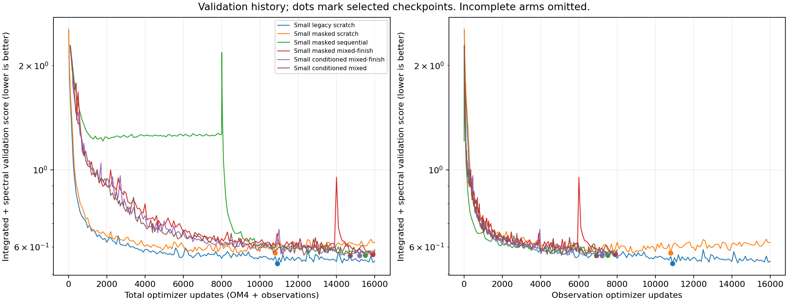

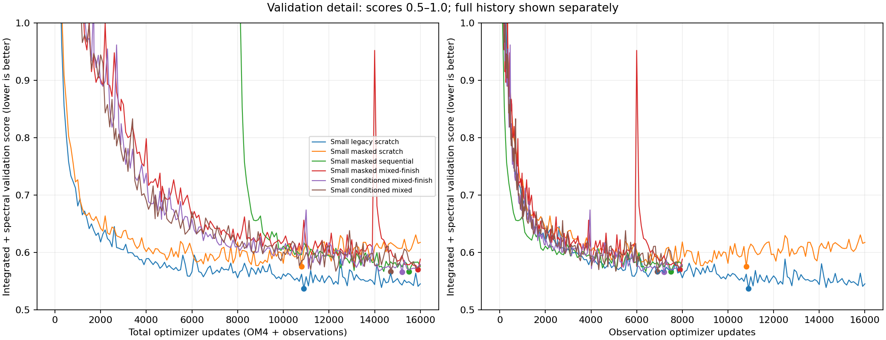

Vertical movement at zero observation updates for the sequential arm represents OM4 training. Dots mark the actual selected checkpoints. Finish arms restrict selection to their observation-only tail.

### Components of the selected monthly test score

Surface integrated errors average the day-5, day-15 and day-30 values; OHC compares calendar-month means. OHC units below are GJ/m². The spectral column averages the frozen regional/lead keys in dex. The composite uses climatology-normalized integrated components plus absolute spectral error, so climatology itself is not forced to score 1.

| Model | SST °C | Geostrophic velocity m/s | EKE m²/s² | OHC 0–700 | OHC 700–2000 | Spectral dex |
| --- | --- | --- | --- | --- | --- | --- |
| Small legacy scratch | 0.540 | 0.1115 | 0.02432 | 0.722 | 0.405 | 0.308 |
| Small masked scratch | 0.527 | 0.1116 | 0.02471 | 0.773 | 0.406 | 0.313 |
| Small masked sequential | 0.528 | 0.1100 | 0.02477 | 0.728 | 0.405 | 0.334 |
| Small masked mixed-finish | 0.558 | 0.1092 | 0.02472 | 0.742 | 0.405 | 0.333 |
| Small conditioned mixed-finish | 0.588 | 0.1099 | 0.02465 | 0.761 | 0.417 | 0.343 |
| Small conditioned mixed | 0.571 | 0.1105 | 0.02495 | 0.725 | 0.410 | 0.361 |

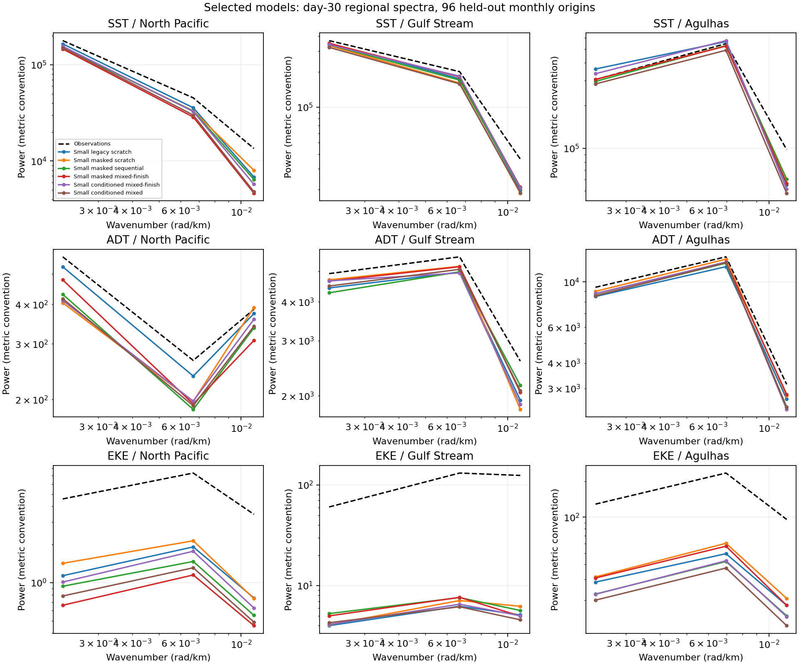

[Day-5 spectra](artifacts/2026-09-28-missingness/final/spectra-day5.png). The velocity/EKE metrics derive from SSH; they do not directly score the internal U/V state channels shown below.

## Learned completion and natural gaps

These audits hide genuinely available values across the entire history. The table pools nine validation origins and two initialized frames with wet-area weights. The legacy diagnostic unconditionally copies the zero placeholders; its large error is not a comparison against an optimized climatology filler. The separate climatology row is the informative completion baseline.

| Model/control | Blocks SST °C | Blocks SSH m | Polar SST °C | Polar SSH m |
| --- | --- | --- | --- | --- |
| Small legacy scratch | 9.531 | 0.649 | 20.580 | 1.408 |
| Small masked scratch | 0.557 | 0.063 | 0.547 | 0.041 |
| Small masked sequential | 0.559 | 0.065 | 0.540 | 0.043 |
| Small masked mixed-finish | 0.622 | 0.062 | 0.569 | 0.044 |
| Small conditioned mixed-finish | 0.594 | 0.064 | 0.516 | 0.042 |
| Small conditioned mixed | 0.573 | 0.061 | 0.527 | 0.041 |
| Observation-training monthly climatology | 0.821 | 0.076 | 0.545 | 0.039 |

Corrected models beat climatology for block completion. Polar-cap SST is close to climatology, with modest improvement for the conditioned models; polar SSH remains worse than climatology in every learned model. This supports learned gap filling, not a blanket claim that it surpasses a seasonal prior everywhere.

Support is 110,942 SST / 88,304 SSH cell-frame samples for blocks and 189,738 / 174,402 for polar caps, pooled across origins; these are repeated samples, not independent spatial cells. All arms use identical support. Bias and north/south breakdowns are retained in the comparison artifact. Naturally missing cells have no truth-based completion score.

These coverage maps show finite supplied inputs at the last five-day initialization
frame, not the forecast training/scoring domain. Available polar inputs are retained;
the ±60° cutoff applies to the observation forecast/interior losses and headline
scores, not to inputs. Green does not establish direct measurement coverage under
ice. The separately labeled polar-cap experiment artificially withholds those inputs.
The [global-domain follow-up](global-domain-rerun-2026-09-29.md) removes that loss
and scoring restriction; the [completed comparison](global-domain-results-2026-09-30.md) shows substantially lower polar errors, with no consistent additional benefit from ten memory channels.

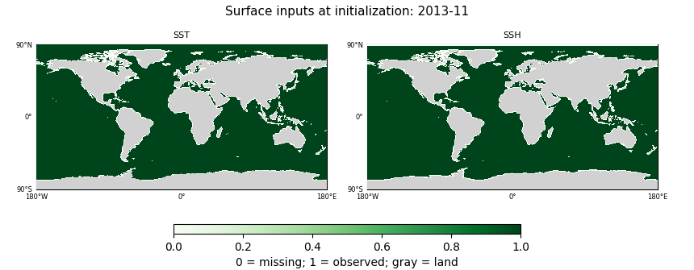

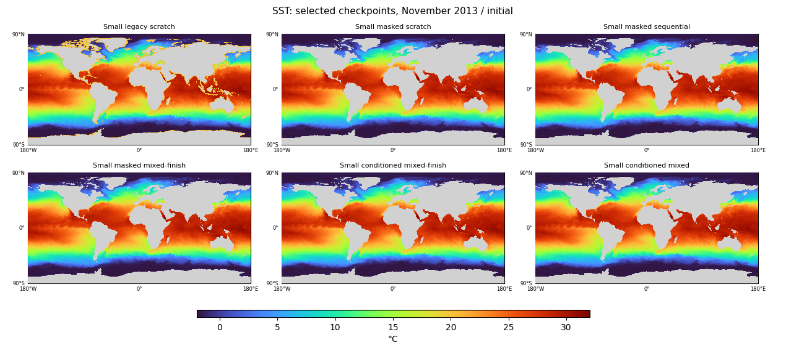

| Model | Missing northern SST mean °C | Minimum °C |
| --- | --- | --- |
| Small legacy scratch | 20.11 | 20.11 |
| Small masked scratch | 1.34 | -2.40 |
| Small masked sequential | 1.16 | -2.79 |
| Small masked mixed-finish | 1.16 | -2.40 |
| Small conditioned mixed-finish | 0.93 | -2.53 |
| Small conditioned mixed | 0.95 | -2.79 |

These are the same 1,309 missing wet cells north of 60N in November 2013. The constant warm fallback is gone, but some learned values fall below −2°C. Spatially sensible appearance does not establish valid ice-region temperature or unobserved accuracy. [July coverage](artifacts/2026-09-28-missingness/final/surface-coverage-2014-07.png) and full numerical ranges are included in the map audit.

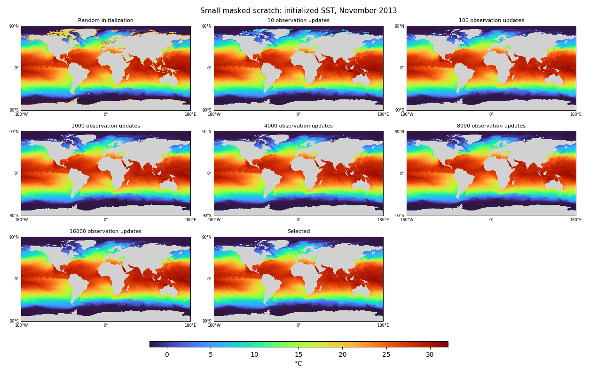

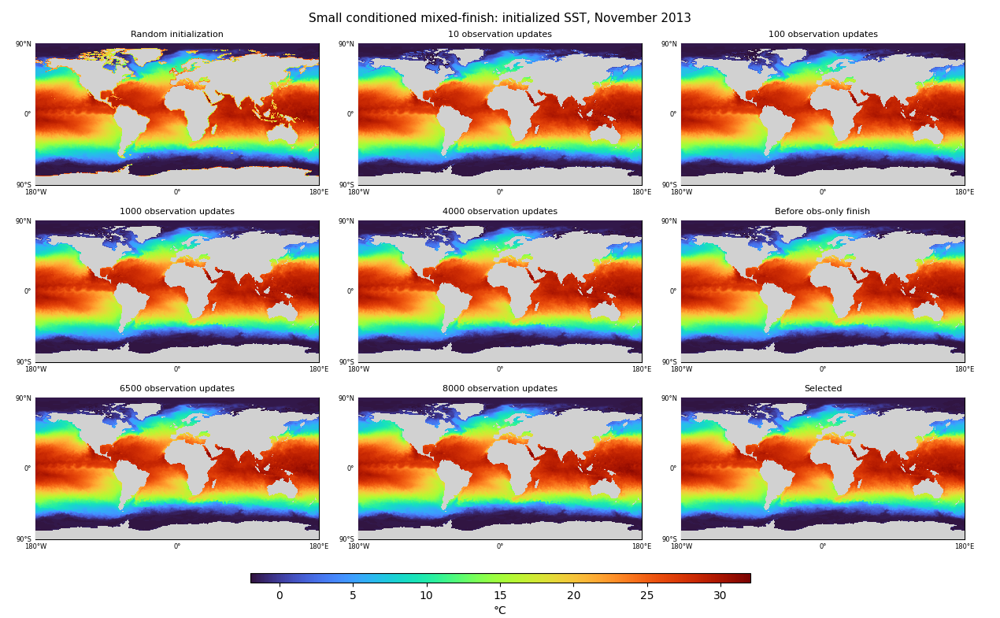

The zero-update panel is random initialization before any OM4 training. Other joint-N labels count observation updates; a pretrained model has also seen OM4 by those points. They are not matched-total-compute panels. The selected surface observations are copied at initialization, so much of each SST map is identical by construction; the missing-region changes are the important comparison.

## Internal state, source retention and forecast dependence

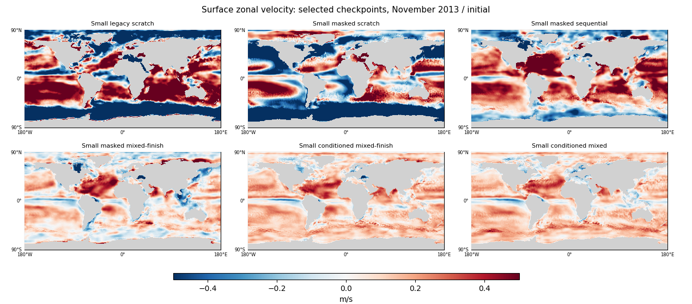

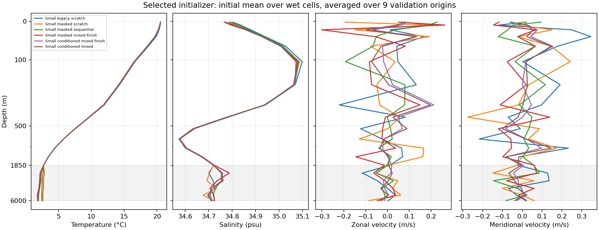

[RMS profiles](artifacts/2026-09-28-missingness/final/initial_rms-profiles.png) distinguish mean structure from field amplitude. Profiles use wet-area weights; neither the maps nor profiles verify an observed full ocean state. Sequential and scratch velocity slots can acquire large, nonphysical-looking structures; mixed models retain more source-like structure. Mean T/S profiles are similar across selected models, while U/V profiles and maps differ substantially. These spatial averages do not establish correct local reconstructions. We do not require those slots to remain physically interpretable.

| Model | Selected OM4 T/S MSE | Raw endpoint OM4 T/S MSE | Δ validation: zero U/V | Δ validation: mean deep T/S |
| --- | --- | --- | --- | --- |
| Small legacy scratch | 1.1808 | 1.1991 | +0.1330 | -0.0191 |
| Small masked scratch | 1.2924 | 1.3103 | -0.0059 | -0.0124 |
| Small masked sequential | 1.5220 | 1.5436 | +0.0203 | +0.0333 |
| Small masked mixed-finish | 0.0602 | 0.0604 | +0.1387 | +0.0423 |
| Small conditioned mixed-finish | 0.0112 | 0.0178 | +0.0366 | +0.0373 |
| Small conditioned mixed | 0.0078 | 0.0107 | +0.0584 | +0.0337 |

OM4 retention uses 11 fixed source-validation origins and shared observation normalization. Interventions are applied only to the two initialized frames, followed by an unchanged rollout; positive Δ means worse observation validation. Deep-T/S replacement affects the five unobserved deepest levels and sets them to their normalization means, not a spatial climatology. These are deliberately strong perturbations and can be out of distribution.

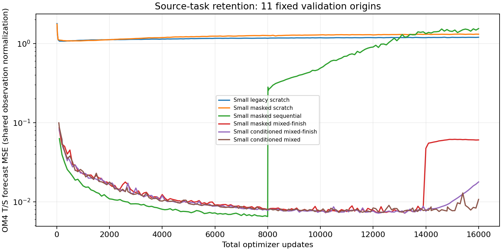

At the matched 16k-total endpoint, conditioning reduces mixed-finish OM4 T/S MSE from 0.0604 to 0.0178, so the retention difference is not solely an effect of selecting checkpoints at different times. The sequential model forgets much of the source task during observation training: OM4 T/S MSE rises from 0.00649 at the end of pretraining to 1.5436 at the final observation endpoint. Mixed training, especially with source-specific adapters, retains it. This is useful evidence for multitask pretraining, but retention alone does not prove better observation prediction: the monthly and annual tables must be considered separately.

## Annual diagnostic, not a selection objective

| Model | Day-365 SST °C | Day-365 ADT m | Day-365 geostrophic velocity m/s |
| --- | --- | --- | --- |
| Small legacy scratch | 1.200 | 0.183 | 0.227 |
| Small masked scratch | 0.887 | 0.159 | 0.240 |
| Small masked sequential | 1.089 | 0.128 | 0.171 |
| Small masked mixed-finish | 1.103 | 0.133 | 0.165 |
| Small conditioned mixed-finish | 0.811 | 0.109 | 0.170 |
| Small conditioned mixed | 0.748 | 0.107 | 0.165 |

Values are arithmetic means of per-origin RMSE for January 2015, 2018 and 2021 continuous rollouts. They describe the five-day state at day 365, not an annual average. All three cases are included in the linked map collection and numerical artifact.

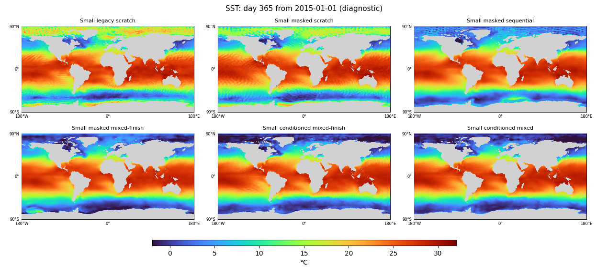

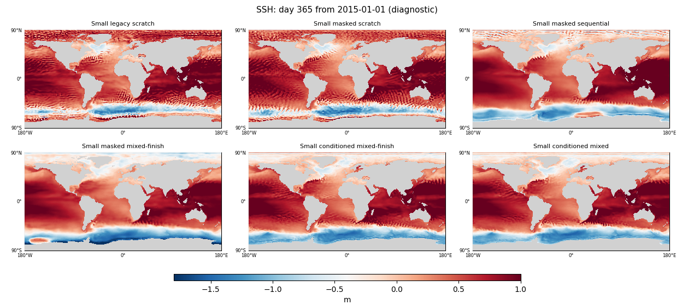

Against corrected scratch, conditioned mixed reduces mean day-365 SST error by 15.7%, ADT by 32.6%, and geostrophic velocity by 31.2%. Adding the observation-only finish does not improve these three numbers. Annual scores retain the 60S–60N observation domain. The scratch models still develop conspicuous polar warming by day 365, even after corrected initialization; fixing the initial holes therefore does not solve that long-rollout failure. Pretrained maps also retain structured artifacts, and this wave does not establish stable long-term dynamics. New long-rollout methods remain deferred to the separate workstream.

## Complete map and profile collection

All table model names are defined in Methods below. The links retain all compared models and cases rather than selecting only favorable panels.

| Field | Selected initializer | Day 30 | Day 365: 2015 | 2018 | 2021 |
| --- | --- | --- | --- | --- | --- |
| SST | [map](artifacts/2026-09-28-missingness/final/selected-initial-channel0.png) | [map](artifacts/2026-09-28-missingness/final/selected-day30-channel0.png) | [map](artifacts/2026-09-28-missingness/final/day365-2015-01-01-channel0.png) | [map](artifacts/2026-09-28-missingness/final/day365-2018-01-01-channel0.png) | [map](artifacts/2026-09-28-missingness/final/day365-2021-01-01-channel0.png) |
| Temperature at 550 m | [map](artifacts/2026-09-28-missingness/final/selected-initial-channel1.png) | [map](artifacts/2026-09-28-missingness/final/selected-day30-channel1.png) | [map](artifacts/2026-09-28-missingness/final/day365-2015-01-01-channel1.png) | [map](artifacts/2026-09-28-missingness/final/day365-2018-01-01-channel1.png) | [map](artifacts/2026-09-28-missingness/final/day365-2021-01-01-channel1.png) |
| Surface salinity | [map](artifacts/2026-09-28-missingness/final/selected-initial-channel2.png) | [map](artifacts/2026-09-28-missingness/final/selected-day30-channel2.png) | [map](artifacts/2026-09-28-missingness/final/day365-2015-01-01-channel2.png) | [map](artifacts/2026-09-28-missingness/final/day365-2018-01-01-channel2.png) | [map](artifacts/2026-09-28-missingness/final/day365-2021-01-01-channel2.png) |
| Surface zonal velocity | [map](artifacts/2026-09-28-missingness/final/selected-initial-channel4.png) | [map](artifacts/2026-09-28-missingness/final/selected-day30-channel4.png) | [map](artifacts/2026-09-28-missingness/final/day365-2015-01-01-channel4.png) | [map](artifacts/2026-09-28-missingness/final/day365-2018-01-01-channel4.png) | [map](artifacts/2026-09-28-missingness/final/day365-2021-01-01-channel4.png) |
| Surface meridional velocity | [map](artifacts/2026-09-28-missingness/final/selected-initial-channel5.png) | [map](artifacts/2026-09-28-missingness/final/selected-day30-channel5.png) | [map](artifacts/2026-09-28-missingness/final/day365-2015-01-01-channel5.png) | [map](artifacts/2026-09-28-missingness/final/day365-2018-01-01-channel5.png) | [map](artifacts/2026-09-28-missingness/final/day365-2021-01-01-channel5.png) |
| SSH | [map](artifacts/2026-09-28-missingness/final/selected-initial-channel6.png) | [map](artifacts/2026-09-28-missingness/final/selected-day30-channel6.png) | [map](artifacts/2026-09-28-missingness/final/day365-2015-01-01-channel6.png) | [map](artifacts/2026-09-28-missingness/final/day365-2018-01-01-channel6.png) | [map](artifacts/2026-09-28-missingness/final/day365-2021-01-01-channel6.png) |

| Model | SST | Temperature at 550 m | Surface salinity | Surface zonal velocity | Surface meridional velocity | SSH | Profiles |
| --- | --- | --- | --- | --- | --- | --- | --- |
| Small legacy scratch | [checkpoints](artifacts/2026-09-28-missingness/final/evolution-legacy-scratch-channel0.png) | [checkpoints](artifacts/2026-09-28-missingness/final/evolution-legacy-scratch-channel1.png) | [checkpoints](artifacts/2026-09-28-missingness/final/evolution-legacy-scratch-channel2.png) | [checkpoints](artifacts/2026-09-28-missingness/final/evolution-legacy-scratch-channel4.png) | [checkpoints](artifacts/2026-09-28-missingness/final/evolution-legacy-scratch-channel5.png) | [checkpoints](artifacts/2026-09-28-missingness/final/evolution-legacy-scratch-channel6.png) | [profiles](artifacts/2026-09-28-missingness/final/legacy-scratch-profile-evolution.png) |
| Small masked scratch | [checkpoints](artifacts/2026-09-28-missingness/final/evolution-masked-scratch-channel0.png) | [checkpoints](artifacts/2026-09-28-missingness/final/evolution-masked-scratch-channel1.png) | [checkpoints](artifacts/2026-09-28-missingness/final/evolution-masked-scratch-channel2.png) | [checkpoints](artifacts/2026-09-28-missingness/final/evolution-masked-scratch-channel4.png) | [checkpoints](artifacts/2026-09-28-missingness/final/evolution-masked-scratch-channel5.png) | [checkpoints](artifacts/2026-09-28-missingness/final/evolution-masked-scratch-channel6.png) | [profiles](artifacts/2026-09-28-missingness/final/masked-scratch-profile-evolution.png) |
| Small masked sequential | [checkpoints](artifacts/2026-09-28-missingness/final/evolution-masked-sequential-channel0.png) | [checkpoints](artifacts/2026-09-28-missingness/final/evolution-masked-sequential-channel1.png) | [checkpoints](artifacts/2026-09-28-missingness/final/evolution-masked-sequential-channel2.png) | [checkpoints](artifacts/2026-09-28-missingness/final/evolution-masked-sequential-channel4.png) | [checkpoints](artifacts/2026-09-28-missingness/final/evolution-masked-sequential-channel5.png) | [checkpoints](artifacts/2026-09-28-missingness/final/evolution-masked-sequential-channel6.png) | [profiles](artifacts/2026-09-28-missingness/final/masked-sequential-profile-evolution.png) |
| Small masked mixed-finish | [checkpoints](artifacts/2026-09-28-missingness/final/evolution-masked-mixed-finish-channel0.png) | [checkpoints](artifacts/2026-09-28-missingness/final/evolution-masked-mixed-finish-channel1.png) | [checkpoints](artifacts/2026-09-28-missingness/final/evolution-masked-mixed-finish-channel2.png) | [checkpoints](artifacts/2026-09-28-missingness/final/evolution-masked-mixed-finish-channel4.png) | [checkpoints](artifacts/2026-09-28-missingness/final/evolution-masked-mixed-finish-channel5.png) | [checkpoints](artifacts/2026-09-28-missingness/final/evolution-masked-mixed-finish-channel6.png) | [profiles](artifacts/2026-09-28-missingness/final/masked-mixed-finish-profile-evolution.png) |
| Small conditioned mixed-finish | [checkpoints](artifacts/2026-09-28-missingness/final/evolution-conditioned-mixed-finish-channel0.png) | [checkpoints](artifacts/2026-09-28-missingness/final/evolution-conditioned-mixed-finish-channel1.png) | [checkpoints](artifacts/2026-09-28-missingness/final/evolution-conditioned-mixed-finish-channel2.png) | [checkpoints](artifacts/2026-09-28-missingness/final/evolution-conditioned-mixed-finish-channel4.png) | [checkpoints](artifacts/2026-09-28-missingness/final/evolution-conditioned-mixed-finish-channel5.png) | [checkpoints](artifacts/2026-09-28-missingness/final/evolution-conditioned-mixed-finish-channel6.png) | [profiles](artifacts/2026-09-28-missingness/final/conditioned-mixed-finish-profile-evolution.png) |
| Small conditioned mixed | [checkpoints](artifacts/2026-09-28-missingness/final/evolution-conditioned-mixed-channel0.png) | [checkpoints](artifacts/2026-09-28-missingness/final/evolution-conditioned-mixed-channel1.png) | [checkpoints](artifacts/2026-09-28-missingness/final/evolution-conditioned-mixed-channel2.png) | [checkpoints](artifacts/2026-09-28-missingness/final/evolution-conditioned-mixed-channel4.png) | [checkpoints](artifacts/2026-09-28-missingness/final/evolution-conditioned-mixed-channel5.png) | [checkpoints](artifacts/2026-09-28-missingness/final/evolution-conditioned-mixed-channel6.png) | [profiles](artifacts/2026-09-28-missingness/final/conditioned-mixed-profile-evolution.png) |

## What to carry forward

Keep valid-only copying and an explicit missing-data representation: the old unconditional overwrite is demonstrably unsuitable for missing cells. Keep a climatology completion control and consider a residual-to-climatology or targeted completion-loss ablation next, because learned polar SSH has not beaten that prior and the correction bundle costs short-range score. Those would be separate authorized experiments, not changes to this completed wave.

For mixed pretraining, retain task-specific inputs as a promising way to preserve source competence, but do not hard-code an observation-only finish based on these results. Compare stopping rules and schedules on more representative validation origins before claiming an observation-performance advantage. The present six-arm, one-seed evidence favors different models for short-range score, annual behavior, and source retention; it does not identify a universal winner.

## Questions and controlled comparisons

The wave tests whether explicit missingness-aware initialization can remove
unrealistic filled surface values, whether OM4 exposure improves observation
learning relative to scratch, and whether task-specific inputs plus an
observation-only finish retain useful source-task behavior. It uses smaller
models and the existing one-degree data to make these comparisons economical.
It does not introduce new annual-rollout training, dense-versus-observable-only
OM4 supervision ablations, or a probabilistic output model.

There are three different standards of evidence. Artificially hiding available
observations gives a scored test of completion. Naturally missing regions give
maps and numerical range diagnostics, but no invented accuracy score. Observation
forecast metrics determine model selection independently of those visual audits.

## Models and training

Every result label below denotes the complete initializer, processor and forcing
adapter system, not just its processor. All models are trained anew with
InstanceNorm. Initializer and processor use four-level ConvNeXt U-Nets with widths
128/192/256/384, dilations 1/2/4/8, one block per configured level, circular
padding and a 1×1 output projection. The small history initializer has 31,243,306 parameters, the D
processor 31,631,677, and the forcing adapter 387: **62,875,370 total**. Conditioning
adds 91,176 parameters, for **62,966,546 total**. These are not conversions of the
historical BatchNorm D checkpoints and not the 205.6M-parameter models from the
preceding wave.

| Literal model name | Initialization and task ordering | Final OM4 / observation updates |
| --- | --- | --- |
| Small legacy scratch | Random weights; old climatology fill and unconditional surface overwrite; observations only. | 0 / 16,000 |
| Small masked scratch | Random weights; missingness-aware initialization and learned completion; observations only. | 0 / 16,000 |
| Small masked sequential | Missingness-aware model; 8,000 OM4 updates followed by 8,000 observation updates. | 8,000 / 8,000 |
| Small masked mixed-finish | Missingness-aware model with shared task inputs; interleaved prefix, then 2,000 observation-only updates. | 8,000 / 8,000 |
| Small conditioned mixed-finish | Same mixed-finish schedule, with task-specific initializer and processor input adapters. | 8,000 / 8,000 |
| Small conditioned mixed | Same task-specific adapters, with interleaving continuing through the final update. | 8,000 / 8,000 |

All runs use seed 1729, batch eight, AdamW at learning rate 1e-4, weight decay
0.01 and gradient norm cap one. Each arm has 16,000 optimizer updates, with
separate deterministic sample streams per task. This matches update count,
not exact FLOPs or observation exposure. Scratch's raw 8,000-observation checkpoint
also permits equal-observation-exposure comparisons against the pretrained arms.
There is no separate reconstruction-only stage in this wave: reconstruction is
an auxiliary loss within the joint updates.

Mixed-finish allocates 8,000 OM4 and 6,000 observation updates to its first 14,000
updates, followed by 2,000 observations. The continuously mixed arm has a different
prefix allocation so that its final counts still match. Consequently the
mixed-versus-mixed-finish comparison is a schedule comparison, not a fork from an
identical checkpoint that isolates only the tail. The conditioned versus
unconditioned mixed-finish comparison does use the same schedule and task streams.
Identity initialization of the adapters preserves the common backbone's initial
weights and does not consume its random initialization stream.

The initializer consumes 19 five-day surface-history frames plus forcing and
validity information, and produces two full-state frames. Five fixed context
channels encode location as spherical x/y/z and annual phase as sine/cosine.
These give explicit geography and season; they are not learned coordinate tables.
OM4 training takes six autoregressive five-day steps. Observation training takes
six or seven five-day steps to cover the calendar month, with overlap weights
for monthly T/S; reported surface lead metrics extend through day 30.
OM4 uses its original forcings; observation forecasts use the existing ERA5
forcing adapter. Available future ERA5 forcing is prescribed, so these are
forced hindcasts rather than operational forecasts with uncertain atmospheric
forcing.

The observation task uses the existing products and chronological split:
May 1993–July 2013 for training, nine fixed November 2013–July 2014 validation
origins, and 96 monthly test origins spanning 2015–2022. Observation-derived scales
are shared by all arms. Velocity channels use mean zero and unit scale; unobserved
deep T/S channels use the deepest observed T/S scale rather than simulation-derived
normalization. These slots remain unconstrained by direct observation labels.

## What changed about missingness

The legacy model already had validity channels. The correction is a bundle:
zero placeholders for unavailable normalized inputs, copying surface observations
only where valid, retaining predicted surface values elsewhere, structured
artificial gaps across the input history, and a supervised completion loss on
known values that were hidden. This is not a mask-channel-only ablation.
Land masks and missing observation masks remain distinct. Natural missing labels
are never replaced by artificial truth.

During OM4 updates, observation-training coverage masks and artificial gaps hide
inputs while real OM4 targets remain available. During observation updates,
completion targets are only genuinely available observations that were hidden.
The additional surface-completion term has weight 0.1 and covers full-grid wet
observed support, including available polar observations. The original observation forecast loss, interior reconstruction loss, and
forecast scoring domain remain 60S–60N. The completion branch can therefore learn polar
structure even though those regions do not contribute to forecast selection.

Conditioning uses separate identity-initialized 1×1 convolutional adapters for
OM4 and observations at the initializer (138 input channels) and processor
(162 input channels) entrances. An explicit source label chooses the adapter;
the expensive backbones remain shared. There are no separate output heads and
no requirement that unconstrained internal velocities become physically
interpretable during observation training.

## Losses, checkpoint selection and controls

For an observation update, the forecast loss is
`0.8 × monthly T/S + 0.1 × SST + 0.1 × SSH`, with normalized squared errors on
available labels. Monthly T/S compares a calendar-weighted aggregate of predicted
five-day states with the monthly interior observation. SST/SSH compare each
predicted five-day state with its matched five-day observation over the rollout;
they are not evaluated only at the end of the month.

An additional `0.1 × monthly T/S reconstruction` applies to the initializer's
monthly reconstruction. This auxiliary path slides the initializer through the
month using contemporaneous surface histories, then averages its reconstructed
states; those later surface observations do not enter the autoregressive forecast
path or forecast evaluation. The corrected models add `0.1 × hidden-surface
completion`. These coefficients neither sum to one across the full objective
nor specify fractions of the actual gradients. OM4 updates use balanced
full-state forecast errors plus 0.1 times initializer reconstruction and the
same completion term where enabled.

Checkpoint selection uses the frozen integrated-plus-spectral observation
validation score. Half is the mean of five climatology-normalized errors:
SST, geostrophic velocity, EKE, OHC 0–700 m, and OHC 700–2000 m. Half is the mean
spectral error over the prequalified regional/lead keys. Spectral error is in
**dex**, meaning base-10 logarithmic power-ratio error. Test tables use test
seasonal climatology denominators with the same frozen spectral keys; validation
selection continues to use the fixed validation denominators.

Finish models select their best checkpoint only within the observation-only
finish. Best-anywhere remains separately recorded. Results must include both
these validation selections and the raw matched-budget endpoints, rather than
choosing whichever test score happens to look better. Persistence holds each
selected model's own initialized state fixed; anomaly persistence also carries
its interior anomaly relative to monthly climatology. These are initializer-aware
controls, not a climatological full ocean state shared by all models.

## Diagnostics and limits of interpretation

Completion audits use the same nine validation origins and fixed artificial
blocks or hidden polar caps. RMSE and bias are pooled with wet-area weights over
known hidden labels, with separate geographic support counts. Empty support stays
null. The observation-training monthly climatology and normalized-zero fill are
explicit controls. Monthly climatology averages available training-example values
for each grid location and calendar month; it is not a day-of-year climatology.
Where the old per-location surface climatology lacks observations, its fallback
is a training channel mean, explaining the constant warm northern fill. Full-grid maps show initialized SST, SSH, subsurface temperature,
salinity and velocities as learning progresses; any values beyond plotting limits
are counted separately rather than silently treated as plausible.

Initialized profiles show wet-area means and RMS over the same nine origins,
through all 19 model depth levels. The shaded region below 1,850 m has no
direct observation T/S labels; depth uses a symmetric-log display scale. They describe what the initializer produces;
velocity profiles are not observation-validated full-state reconstructions.
The velocity maps/profiles show model U/V state channels, whereas the observation
velocity and EKE metrics are geostrophic quantities derived from SSH. They are
different diagnostics and should not be interpreted as direct comparisons.
Frozen-state interventions replace initialized velocities by zero or the five
unobserved deepest T/S levels by their normalization means. Changes in subsequent
observation errors test sensitivity to these slots, not whether they represent
correct physical velocities or uniquely explain a pretraining benefit.

Annual evaluation uses the three existing January 2015, 2018 and 2021 origins.
Day-365 numbers refer to the last five-day output at that lead, not the mean error
over a year. The cases have been inspected in earlier work and are exploratory;
they do not influence selection. Full-grid maps can reveal polar artifacts beyond
the observation scoring domain, but cannot establish polar accuracy without labels.

One seed and a fixed small-scale budget do not establish statistical significance,
the best possible scratch baseline, or a resolution-independent result. Cross-arm
rankings can differ between short-range metrics, completion and annual behavior.
Hardware changed from H200 to regular RTX during recovery; exact checkpoint and
optimizer/RNG restoration was qualified, but arithmetic across GPU families is
not claimed bitwise identical.

## Frozen-checkpoint diagnosis already completed

The [frozen-model gap report](initialization-gap-diagnostics-2026-09-28.md) uses the
three prior large InstanceNorm models. Replacing only missing initial surface
values with training-only OM4 monthly climatology reduced sequential/mixed
three-case day-365 SST error by about 5%, but did not remove annual artifacts.
Changing missing values across the entire history worsened short-range errors.
Those interventions preserve available observations and the original weights;
they establish sensitivity, not the result of retraining a missingness-aware model.

## Provenance and qualification

Training producer: `053e34947932fdb56c6baf2c717a23f2df3cc733`.
Evaluation producer: `9999caf5937a8d0983dc0b6b6883011dc6a1a450`.
The [qualification records](artifacts/2026-09-28-missingness/qualification-records.json.gz)
were read back and hash-verified. All production arms passed fitting and resume
qualification before submission;
completion-head gradients, copy invariance, target separation, schedule counts,
and finish-restricted selection have explicit checks. Local qualification had
54 targeted tests, with two additional evaluator scoring tests. The frozen
baseline reproduced all nine model/origin exports exactly before interventions.

Remote experiment root:
`/scratch/jr7309/runs/2026-09-28-observation-missingness`.
PRODUCTION_DAG.json and EVALUATION_DAG.json identify current jobs; original records
and failed/preempted attempts remain preserved. Final collection checks actual
checkpoint hashes, exact task counts, no partial-completion markers, evaluation
signatures and all required origin lists. GPU-hours include retries and allocated
evaluation time, not requested wall limits. The [progress log](progress.md) records recovery and scheduling history.
[Execution audit](artifacts/2026-09-28-missingness/final/execution-audit.json.gz),
[allocated-time accounting](artifacts/2026-09-28-missingness/final/accounting.json.gz),
[complete numerical evidence](artifacts/2026-09-28-missingness/final/evidence.json.gz),
[map audit](artifacts/2026-09-28-missingness/final/map-audit.json.gz), and
[artifact provenance](artifacts/2026-09-28-missingness/final/provenance.json.gz) retain
checkpoint, data, source and transfer hashes. All 38 current training/evaluation
jobs are COMPLETED with exit code 0:0. No partial-budget result is presented as
complete. The old timer remains disabled; no further training is scheduled by
this report.
