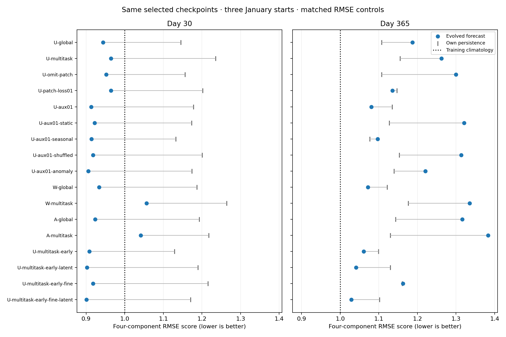
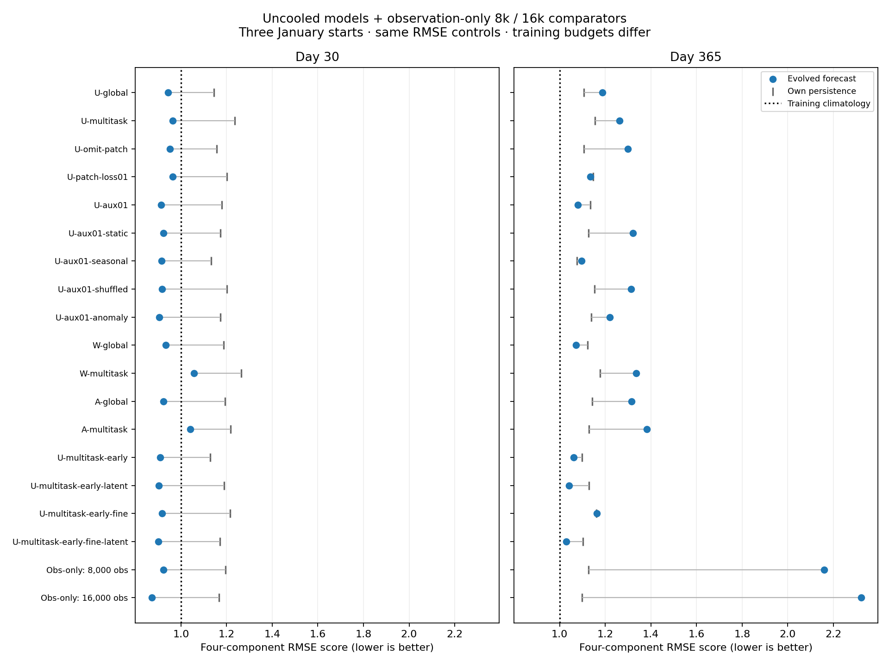
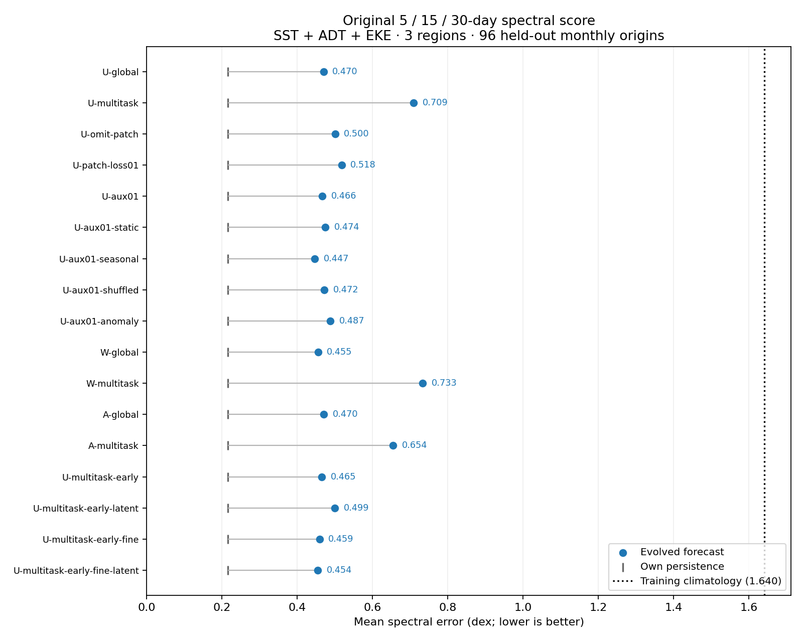

<!-- SPDX-FileCopyrightText: 2026 Samudra Authors -->
<!-- SPDX-License-Identifier: CC-BY-4.0 -->

# Presentation models: matched 30- and 365-day RMSE

**Yes: continuous year-long rollouts expose substantially more separation.**
U-multitask-early-fine-latent improves the RMSE-only score over U-global by
**4.6% at day 30 and 13.3% at day 365**. U-aux01 improves it by **3.3% and 9.0%**;
W-global by **1.1% and 9.7%**. These are the presentation's original selected
checkpoints, with no retraining or annual checkpoint reselection.

**None beats training seasonal climatology on the pooled day-365 four-component
score.** The best model scores 1.0289 versus climatology's 1.0000. The result is
better relative model discrimination, with limited absolute annual skill on
this diagnostic—not evidence of validated climate rollouts.

Contents: [Matched scores](#matched-scores) · [What changes](#what-changes) ·
[Observation-only comparators](#observation-only-comparators) ·
[Components and origins](#components-and-origins) · [Maps and lead curves](#maps-and-lead-curves) ·
[Original spectral score](#original-51530-day-spectral-score) ·
[Model definitions](#models) · [Protocol](#fixed-evaluation-protocol) · [Verification](#verification).

## Matched scores

Lower is better. Each score averages four RMSE ratios to a common training-only
seasonal-climatology control: SST, geostrophic velocity, and two OHC layers.
The denominator is evaluated separately at each lead; scores compare model
skill relative to climatology, not physical error growth across leads.
The same three January starts contribute to both columns. Negative changes
mean lower error than U-global.

| Model | Day 30 | Day 365 | Day-365 change vs U-global | Own persistence, day 365 |
|---|---:|---:|---:|---:|
| U-global | 0.9443 | 1.1869 | +0.0% | 1.1070 |
| U-multitask | 0.9644 | 1.2618 | +6.3% | 1.1547 |
| U-omit-patch | 0.9524 | 1.2999 | +9.5% | 1.1071 |
| U-patch-loss01 | 0.9645 | 1.1352 | -4.4% | 1.1471 |
| U-aux01 | 0.9130 | 1.0806 | -9.0% | 1.1344 |
| U-aux01-static | 0.9223 | 1.3211 | +11.3% | 1.1271 |
| U-aux01-seasonal | 0.9142 | 1.0967 | -7.6% | 1.0764 |
| U-aux01-shuffled | 0.9181 | 1.3132 | +10.6% | 1.1531 |
| U-aux01-anomaly | 0.9055 | 1.2206 | +2.8% | 1.1395 |
| W-global | 0.9336 | 1.0718 | -9.7% | 1.1219 |
| W-multitask | 1.0563 | 1.3354 | +12.5% | 1.1765 |
| A-global | 0.9235 | 1.3163 | +10.9% | 1.1435 |
| A-multitask | 1.0414 | 1.3833 | +16.5% | 1.1295 |
| U-multitask-early | 0.9081 | 1.0611 | -10.6% | 1.0988 |
| U-multitask-early-latent | 0.9021 | 1.0413 | -12.3% | 1.1297 |
| U-multitask-early-fine | 0.9180 | 1.1626 | -2.0% | 1.1606 |
| U-multitask-early-fine-latent | 0.9007 | 1.0289 | -13.3% | 1.1019 |
| Training seasonal climatology | 1.0000 | 1.0000 | −15.7% | — |

All 17 models beat their own initialized persistence at day 30. At day 365,
only six do: U-patch-loss01, U-aux01, W-global, and the early coarse,
early-coarse-latent and early-fine-latent models. U-global is **7.2% worse** than
its own persistence; fine-plus-latent is **6.6% better**. Persistence holds each
model's inferred initial state fixed, so it differs across checkpoints. January
starts also mean the annual endpoint returns to almost the initial season;
persistence is a substantially harder control there than at midyear.

## Observation-only comparators

The expanded chart adds **Obs-only: 8,000 obs** and **Obs-only: 16,000 obs** to
the original 17 uncooled models. These are fixed checkpoints of one randomly
initialized, observation-only trajectory with zero OM4 updates and no cooldown.
They use the 62,966,546-parameter Small conditioned global architecture described
in the [global physical-only report](global-physical-day30-2026-09-30.md).
They are external comparators: their budgets and checkpoint policy differ from
the validation-selected 4,000-update screen, and their related architecture
lacks the screen's added geometry/task interface. This is not a matched test of
removing OM4 from U-global.

| Model | Day 30 | Day 365 | Own persistence, day 30 | Own persistence, day 365 |
|---|---:|---:|---:|---:|
| Obs-only: 8,000 obs | 0.9227 | 2.1606 | 1.1948 | 1.1262 |
| Obs-only: 16,000 obs | 0.8726 | 2.3227 | 1.1661 | 1.0991 |

**The observation-only checkpoints are competitive at day 30 but substantially
worse at day 365.** Extending observation-only training improves this day-30
score by 5.4%, while worsening the annual score by 7.5%. At day 365 their SST
RMSEs remain relatively good (0.849/0.785°C); the large composite errors come
mainly from OHC (upper layer 26.69/30.98 × 10⁸ J/m²; deep layer 12.35/12.08 ×
10⁸ J/m²), with worse geostrophic velocity too (0.209/0.253 m/s). Both annual
forecasts lose to their own initialized persistence. This result suggests
long-rollout interior drift despite improving short-range fit, but the unmatched
training setups do not isolate a causal effect of OM4 supervision.

All values use the **same three January starts and original climatology
denominators** as the main chart. Surface and monthly OHC targets match exactly;
recomputing U-global from saved arrays reproduces every scored component exactly.
Original 17-model scores are unchanged. Only saved outputs were rescored: no
new inference, training, or checkpoint selection. The annual comparison remains
limited to three examples. [Full scores and physical components](artifacts/presentation-obs-comparators-2026-10-08/rmse-scores.csv) ·
[Source hashes and verification](artifacts/presentation-obs-comparators-2026-10-08/provenance.json) ·
[PDF](artifacts/presentation-obs-comparators-2026-10-08/rmse-comparison.pdf) ·
[Reproduction script](../../../scripts/plot_presentation_obs_comparators.py).

## What changes

- **Earlier coarse data already explains most of the early/fine advantage.**
  Earlier coarse OM4 scores 1.0611, coarse plus latent 1.0413, and fine plus
  latent 1.0289. Fine plus latent beats its matched coarse-plus-latent control
  by only **1.2%**, with mixed ordering across individual years. Fine resolution
  without latent channels is **9.6% worse** than earlier coarse data alone.
  The 13.3% gain over U-global cannot be attributed entirely to fine resolution.
- **Accessory targets matter more over a year.** U-aux01 and its seasonal control
  score 1.0806 and 1.0967, while static and shuffled controls score 1.3211 and
  1.3132. Their small day-30 differences widen substantially. The seasonal
  target nearly matches the real target (a 1.5% gap), so this does not isolate
  learning of time-specific fine-scale dynamics. The anomaly target, despite
  a strong day-30 result, worsens to 1.2206.
- **Extra capacity helps selectively.** W-global improves over U-global by 9.7%
  annually. A-global and both larger multitask models worsen. The original
  U-multitask is also worse than U-global; reducing its patch-loss weight
  reverses that ordering at day 365 (1.1352 versus 1.1869).
- **The gains are mainly SST and OHC, not recovered eddy variability.** Fine plus
  latent lowers SST, upper OHC, and deep OHC RMSE versus U-global by about
  **9%, 14%, and 23%**, but velocity RMSE by only **2%**. Every model has worse
  annual-end velocity and both OHC RMSEs than seasonal climatology. Several
  models beat climatology for SST, but that is insufficient for the composite.

These are descriptive results from one training seed and three January starts.
They provide hypotheses about longer-horizon behavior, not replicated causal
estimates of a data source, auxiliary target, or architecture effect.

## Components and origins

Day-365 physical RMSEs below use the final five-day surface bin and full December
OHC means. Velocity is diagnosed from SSH, not the network's prognostic U/V.

| Model | SST (°C) | Geostrophic velocity (m/s) | OHC 0–700 m (10⁸ J/m²) | OHC 700–2000 m (10⁸ J/m²) |
|---|---:|---:|---:|---:|
| U-global | 0.9545 | 0.15360 | 10.485 | 5.755 |
| U-aux01 | 0.8743 | 0.15274 | 9.536 | 4.899 |
| W-global | 0.9233 | 0.14974 | 9.882 | 4.518 |
| U-multitask-early | 0.9043 | 0.15352 | 9.630 | 4.440 |
| U-multitask-early-latent | 0.8400 | 0.14965 | 9.374 | 4.590 |
| U-multitask-early-fine | 0.9558 | 0.15244 | 10.791 | 5.292 |
| U-multitask-early-fine-latent | 0.8680 | 0.15046 | 9.016 | 4.433 |
| Training seasonal climatology | 1.0022 | 0.14626 | 8.814 | 3.700 |

[Every physical component at both leads, every origin, and every own-persistence
control](artifacts/presentation-annual-2026-10-08/final/rmse-scores.csv). OHC in that CSV is in J/m²; the table rescales it
by 10⁸. ADT RMSE is included in the CSV but excluded from the four-component score.

Individual day-365 scores use the same pooled climatology denominators as the
main table. Consequently an individual climatology row need not equal one.

| Model | 2015 start | 2018 start | 2021 start |
|---|---:|---:|---:|
| U-global | 1.3123 | 1.1593 | 1.0699 |
| U-aux01 | 1.1532 | 1.0450 | 1.0367 |
| W-global | 1.1617 | 1.0249 | 1.0185 |
| U-multitask-early | 1.1143 | 1.0431 | 1.0207 |
| U-multitask-early-latent | 1.0680 | 1.0494 | 1.0022 |
| U-multitask-early-fine | 1.3668 | 1.0372 | 1.0437 |
| U-multitask-early-fine-latent | 1.0307 | 1.0293 | 1.0260 |
| Training seasonal climatology | 1.0477 | 0.9358 | 1.0098 |

U-aux01, W-global, and all three early coarse/coarse-latent/fine-latent models
beat U-global in each of the three cases. The fine-plus-latent advantage over
coarse-plus-latent occurs in 2015 and 2018; coarse-plus-latent wins in 2021.
The pooled ranking should not hide that variation.

Annual temporal-anomaly EKE stays separate: pooled RMSE spans **0.02552–0.02619 m²/s²**
across models, versus **0.02570** for U-global and **0.02561** for seasonal
climatology. Fine plus latent gives **0.02555**, only about 0.6% lower than U-global.
This uses within-year temporal anomalies and differs from the monthly EKE metric
in the original report. [All annual EKE values](artifacts/presentation-annual-2026-10-08/final/annual-eke.csv).

## Maps and lead curves

These links pair the **same 2021 origin** at both leads, with observation and
U-global initialized-persistence rows, common masks/scales, and two pixels per
grid location. Anomalies subtract training monthly climatology. The
[map index](artifacts/presentation-annual-2026-10-08/final/maps.md) also includes the 2015/2018 cases and absolute fields;
no maps were selected by their result. The fine-resolution models are evaluated
on the same global 1° task here.

| Model group | Day-30 surface maps | Day-365 surface maps | Lead curves |
|---|---|---|---|
| Patch tasks | [SST](artifacts/presentation-annual-2026-10-08/final/figures/maps/patch-day30/day30-2021-01-01-anomalies-sst.png) · [ADT](artifacts/presentation-annual-2026-10-08/final/figures/maps/patch-day30/day30-2021-01-01-anomalies-adt.png) | [SST](artifacts/presentation-annual-2026-10-08/final/figures/maps/patch-day365/day365-2021-01-01-anomalies-sst.png) · [ADT](artifacts/presentation-annual-2026-10-08/final/figures/maps/patch-day365/day365-2021-01-01-anomalies-adt.png) | [Surface](artifacts/presentation-annual-2026-10-08/final/figures/lead-curves-patch.png) · [OHC](artifacts/presentation-annual-2026-10-08/final/figures/ohc-curves-patch.png) |
| Accessory targets | [SST](artifacts/presentation-annual-2026-10-08/final/figures/maps/accessory-day30/day30-2021-01-01-anomalies-sst.png) · [ADT](artifacts/presentation-annual-2026-10-08/final/figures/maps/accessory-day30/day30-2021-01-01-anomalies-adt.png) | [SST](artifacts/presentation-annual-2026-10-08/final/figures/maps/accessory-day365/day365-2021-01-01-anomalies-sst.png) · [ADT](artifacts/presentation-annual-2026-10-08/final/figures/maps/accessory-day365/day365-2021-01-01-anomalies-adt.png) | [Surface](artifacts/presentation-annual-2026-10-08/final/figures/lead-curves-accessory.png) · [OHC](artifacts/presentation-annual-2026-10-08/final/figures/ohc-curves-accessory.png) |
| Wider / attention | [SST](artifacts/presentation-annual-2026-10-08/final/figures/maps/capacity-day30/day30-2021-01-01-anomalies-sst.png) · [ADT](artifacts/presentation-annual-2026-10-08/final/figures/maps/capacity-day30/day30-2021-01-01-anomalies-adt.png) | [SST](artifacts/presentation-annual-2026-10-08/final/figures/maps/capacity-day365/day365-2021-01-01-anomalies-sst.png) · [ADT](artifacts/presentation-annual-2026-10-08/final/figures/maps/capacity-day365/day365-2021-01-01-anomalies-adt.png) | [Surface](artifacts/presentation-annual-2026-10-08/final/figures/lead-curves-capacity.png) · [OHC](artifacts/presentation-annual-2026-10-08/final/figures/ohc-curves-capacity.png) |
| Earlier OM4 / fine / latent | [SST](artifacts/presentation-annual-2026-10-08/final/figures/maps/early-fine-day30/day30-2021-01-01-anomalies-sst.png) · [ADT](artifacts/presentation-annual-2026-10-08/final/figures/maps/early-fine-day30/day30-2021-01-01-anomalies-adt.png) | [SST](artifacts/presentation-annual-2026-10-08/final/figures/maps/early-fine-day365/day365-2021-01-01-anomalies-sst.png) · [ADT](artifacts/presentation-annual-2026-10-08/final/figures/maps/early-fine-day365/day365-2021-01-01-anomalies-adt.png) | [Surface](artifacts/presentation-annual-2026-10-08/final/figures/lead-curves-early-fine.png) · [OHC](artifacts/presentation-annual-2026-10-08/final/figures/ohc-curves-early-fine.png) |

## Original 5/15/30-day spectral score

This requested companion uses the **same spectral component used during
validation**, evaluated on the original **96 held-out monthly origins** from
2015–2022. It is separate from the three continuous annual forecasts above.
The selected checkpoints and model order are identical to the annual chart.

Each point averages **27** regional spatial-spectrum errors: SST, ADT and
geostrophic EKE × North Pacific, Gulf Stream and Agulhas × days 5, 15 and 30.
For each term, spatial power is averaged over forecast origins first; the
error is then the RMS difference between predicted and observed log₁₀ power.
The 27 errors receive equal weight. There is no integrated-RMSE term or
climatology normalization; zero means matching spectra. EKE uses velocity
anomalies across origins at each fixed lead, preserving the original metric.

All evolved models lose to initialized persistence on this spectral component.
Persistence is approximately **0.215 dex** for every model, since its surface
fields share the observed initialization; EKE is derived from those surface
fields. Seasonal climatology measures **1.640 dex**. The three per-quantity
components are available in the [score CSV](artifacts/presentation-spectral-2026-10-08/spectral-scores.csv).

The plot verifies source hashes, selected-checkpoint identities, common cohorts
and reference spectra, reconstructs all 945 constituent curve errors, and
matches the original published score tables. [Provenance](artifacts/presentation-spectral-2026-10-08/spectral-provenance.json) ·
[PDF](artifacts/presentation-spectral-2026-10-08/spectral-comparison.pdf).

## Models

| Model names | Meaning | Original methods/results |
|---|---|---|
| U-global | Global-only U-Net control | [Initial comparison](extent-wave-2026-10-02.md) |
| U-multitask | Replace half the coarse OM4 tasks with regional ¼° tasks | [Initial comparison](extent-wave-2026-10-02.md) |
| U-omit-patch | Omit those regional tasks | [Omission control](extent-ablations-2026-10-03.md) |
| U-patch-loss01 | Multiply the regional objective by 0.1 | [Loss control](extent-initializer-followup-2026-10-04.md) |
| U-aux01 | Global evolution with a 0.01-weight fine-scale variance accessory loss | [Accessory and capacity methods](extent-representation-2026-10-03.md) |
| U-aux01-static, U-aux01-seasonal, U-aux01-shuffled, U-aux01-anomaly | Respectively time-mean spatial maps, seasonal, shuffled, and anomaly accessory targets | [Target controls](extent-accessory-controls-2026-10-04.md) |
| W-global, W-multitask | Wider processor, respectively global-only and regional multitask | [Capacity methods](extent-representation-2026-10-03.md) |
| A-global, A-multitask | Axial-attention processor, respectively global-only and regional multitask | [Capacity methods](extent-representation-2026-10-03.md) |
| U-multitask-early | Replace half the OM4 updates with earlier global 1° data | [Early/fine methods](early-fine-wave-2026-10-07.md) |
| U-multitask-early-latent | Same coarse data, with ten recurrent latent channels | [Early/fine methods](early-fine-wave-2026-10-07.md) |
| U-multitask-early-fine | Earlier OM4 at ¼° through an encoder and decoder around the coarse processor | [Early/fine methods](early-fine-wave-2026-10-07.md) |
| U-multitask-early-fine-latent | Same fine-resolution task with ten recurrent latent channels | [Early/fine methods](early-fine-wave-2026-10-07.md) |
| Obs-only: 8,000 obs; Obs-only: 16,000 obs | Fixed 8k/16k endpoints of one observation-only trajectory; external, longer-trained comparators in the expanded chart | [Scratch methods](global-scratch-2026-09-30.md) |
| Training seasonal climatology | Training-only monthly surface and interior mean fields, mapped to the scored quantities | [Score collector](../../../scripts/collect_presentation_annual.py) |

There are 17 models. The existing [early/fine annual evaluation](early-fine-annual-2026-10-08.md)
already covers U-global and the four early/fine arms. Those five outputs are reused;
only the twelve missing presentation comparisons required new inference. The five cooldown evaluations
in that separate job remain a supplemental comparison, outside this 17-model table.

[Matched-parent RMSE and cooldown spectral comparison charts](early-fine-cooldown-2026-10-08.md#presentation-comparison-charts)
are available with unchanged score definitions. The RMSE chart pairs the five
cooldown models with their five constant-rate parents; the spectral chart shows
the five cooldown models.

## Fixed evaluation protocol

- Three established January 1 starts: **2015, 2018 and 2021**. Each forecast
  initializes once from 19 five-day surface/forcing history bins, then evolves
  for 73 five-day steps. Future surface observations are targets only.
- Use the same prescribed ERA5 forcing and global 1° grid for all models.
  This tests ocean evolution with known forcing, not operational atmospheric forecasting.
- Compare the **same three forecasts at days 30 and 365**. Surface quantities
  describe five-day bins ending at those leads. OHC uses full January and
  December forecast means, respectively, matching monthly IAP targets.
- Headline RMSE-only score: equal-weight mean of four errors divided by common
  seasonal-climatology errors: SST, SSH-derived geostrophic velocity, OHC
  0–700 m, and OHC 700–2000 m. The control uses training-only monthly surface
  and interior climatology. Both leads use these same four quantities.
- Pool spatial MSE equally across origins before taking its square root;
  show individual origins and physical-unit components as well as the score.
  Per-origin normalized rows use the same pooled climatology denominator.
- Include each checkpoint's own initialized persistence. Report ADT RMSE,
  intermediate leads, and annual EKE separately. Annual EKE uses anomalies
  around a sequence's own annual mean; it is not the monthly fixed-lead EKE
  term and is excluded from both headline scores.
- Preserve the original integrated-plus-spectral validation selection. No
  checkpoint reselection or hyperparameter tuning uses these annual outcomes.
- Include matched day-30/day-365 maps with common support and scales at two
  pixels per grid cell.

Three January starts provide a limited diagnostic. Differences are descriptive;
they do not establish general climate skill, seasonal robustness, or seed uncertainty.
The 30-day values here also differ in cohort and aggregation from the previous
96-origin monthly table. All new comparisons use the same Torch evaluator/runtime.
Training comparisons retain their original caveats: U-global trained on Beta,
the early/fine arms trained on Torch, and the 1°/¼° OM4 stores are different
preprocessing releases. The early/fine arms replace recent-data updates with
1958–1974 examples; they do not add training updates. These are matched by update
count, not training FLOPs.

## Verification

All 17 fixed-checkpoint evaluations and the final collection completed on
**October 8, 2026**. Each model has three annual origins and eleven required,
hash-verified output files; the collector checks that all models share exactly
the same observations. All eleven downloaded collection artifacts also passed
SHA256 read-back. The renderer verifies every saved map cell occupies exactly
2×2 pixels. Ten targeted annual-evaluation tests pass.

Evaluation producer: `25cc663fd4163ccfc0f056edc343732a484aa6e7`; model and numerical
annual-evaluation code are byte-identical to the earlier `5f61785a` producer.
Collection/map-export producer: `1c1c6efee919198e88e03455f62d79b4ac0efa71`.
[Exact checkpoint/data paths](artifacts/presentation-annual-2026-10-08/paths.json) ·
[Full metrics and provenance, compressed JSON](artifacts/presentation-annual-2026-10-08/final/results.json.gz) ·
[Collection hashes](artifacts/presentation-annual-2026-10-08/final/COLLECTION_COMPLETE.json).

Twelve additional models ran in **19447970**; U-global and the four original
early/fine models reuse **19446317**. CPU audit **19447968** and collection
**19448382** passed. Additional inference used **0.2156 GPU-hours**;
including all ten prior early/fine evaluations (five reused controls plus five
supplemental cooldown models), the annual arrays used **0.3936 GPU-hours**.
Training costs are separate; the cooldown extras are outside this 17-model table.

Two verification issues were repaired without changing forecasts: a launcher
module-load failure before the new GPU array started, and an old suffix check
that left output-hash lists empty. Original files and failed-attempt records
remain preserved; the repaired legacy audit explicitly hashes all required
files. No failed GPU retry consumed time.
[Recovery](artifacts/presentation-annual-2026-10-08/recovery-submission.json) ·
[Execution accounting](artifacts/presentation-annual-2026-10-08/completion-snapshot.json) ·
[Collection](artifacts/presentation-annual-2026-10-08/collection-submission.json).
