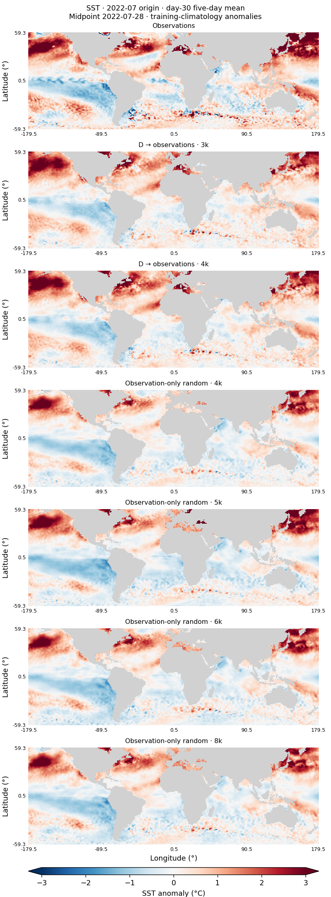
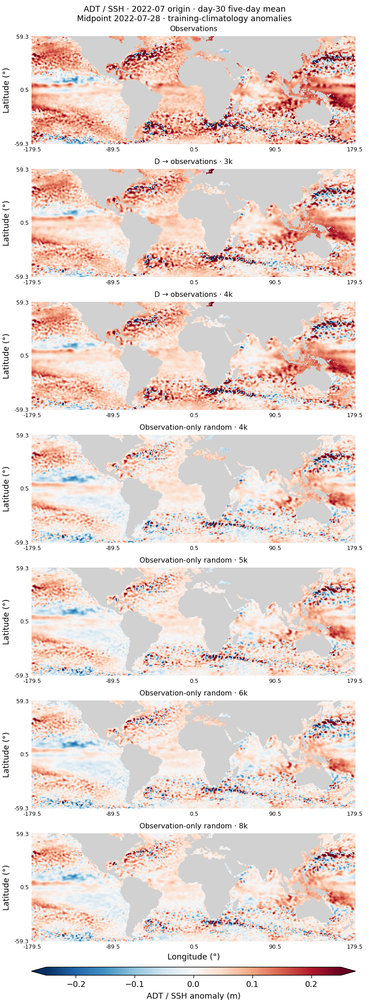
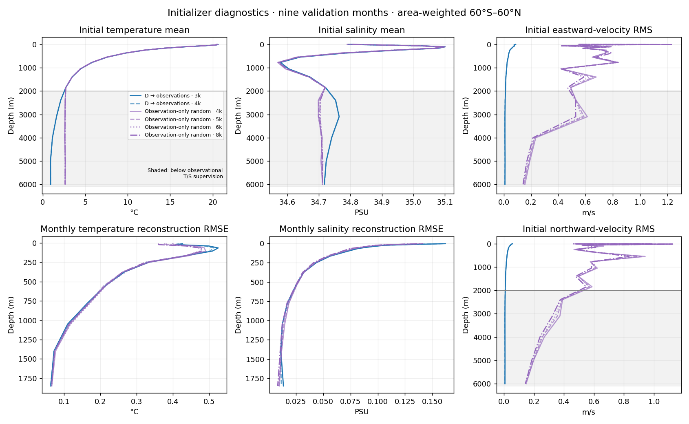
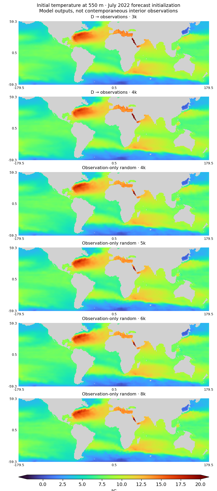
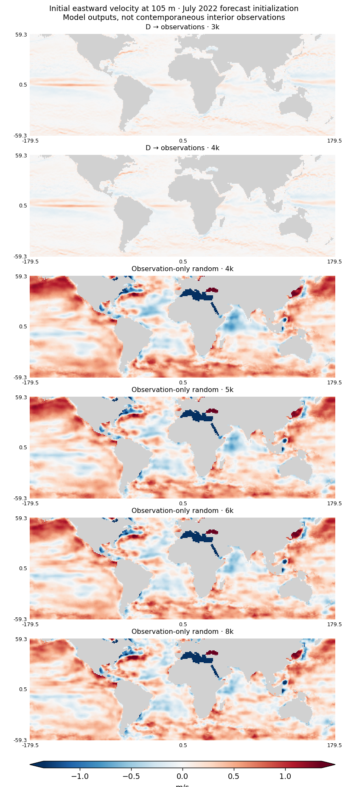

<!-- SPDX-FileCopyrightText: 2026 Samudra Authors -->
<!-- SPDX-License-Identifier: CC-BY-4.0 -->

# Scratch versus D: completed 8k extension

**25 September 2026, 00:25 ET.** The observation-only run completed 8,000 joint updates and its original-policy held-out evaluation. Both inference policies stopped improving after 6k. The conditional 16k extension was **not launched**: continued improvement at 8k was the user's condition, and it was not observed. This is an operational plateau decision from one seed and sparse checkpoints, not proof that longer training could never help.

## Main comparison

| Model | Observation joint updates | BatchNorm inference policy | Integrated + spectral validation score ↓ |
| --- | ---: | --- | ---: |
| D → observations | 3,000, selected | Frozen training statistics | 0.52729 |
| D → observations | 4,000, terminal | Frozen training statistics | 0.54283 |
| Observation-only random | 4,000 | Per-sample statistics | 0.57264 |
| Observation-only random | 5,000 | Per-sample statistics | 0.56456 |
| Observation-only random | 6,000 | Per-sample statistics | **0.55730** |
| Observation-only random | 8,000 | Per-sample statistics | 0.56278 |

**D → observations** uses the original OM4-pretrained initializer and evolution network, then 1,000 observation reconstruction updates and 4,000 observation joint updates, without additional OM4 continuation. **Observation-only random** starts both networks randomly and uses only observations: the same 1,000-update reconstruction phase, followed by 8,000 joint updates. Both have approximately 153.3M parameters and effective batch eight; full recipes and the original D training are in the [main methods](compute-allocation-2026-09-24.md#model-and-training-definitions) and [D history](d-training-history.md#original-d-training-recipe).

Scratch improves 2.7% from 4k to 6k, then worsens 1.0% at 8k. Its best measured per-sample score is **5.7% above D's selected score**. This is substantially closer than the original stored-statistics comparison suggested. It does not isolate the value of pretraining: learning rates, normalization and BatchNorm training recipes differ, and D inherits a substantial earlier OM4 budget. Nor does the gap establish significance across training seeds.

The graph follows each model's training normalization: D was trained with frozen statistics, scratch with sample statistics. Validation uses the same nine origins and integrated-plus-spectral objective at 5/15/30-day leads. Only retained scratch weights can be rescored; the 7k checkpoint was not retained and is not interpolated as a measurement. The [all-model batch-statistics diagnostic](batch-stat-curves.md) includes the sensitivity of D to changing its inference policy.

## Original selection and held-out results retained

The original stored-statistics scratch validation sequence at 6k/7k/8k is **0.84104 / 0.84252 / 0.86768**. Its official best checkpoint remains 6k. The diagnostic also has its best measured score at 6k, but no original selection or held-out output has been silently replaced.

| Model / selection scope | Selected update | Original-policy held-out composite ↓ | Spectral error (dex) ↓ | SST RMSE (°C) ↓ |
| --- | ---: | ---: | ---: | ---: |
| D → observations, through 4k | 3,000 | 0.58605 | 0.30521 | 0.49664 |
| Observation-only random, frozen through 4k | 4,000 | 0.93434 | 0.58911 | 1.05021 |
| Observation-only random, through 8k | 6,000 | 0.91254 | 0.51078 | 1.15008 |

These are 96 independent monthly initializations across 2015–2022, each forecasting about one month, not an eight-year continuous rollout. The scratch rows use the original problematic running-statistics inference policy. **They must not be read as corrected-policy held-out evidence for a large pretraining advantage.** Full 96-origin held-out rescoring under per-sample statistics has not been performed; the corrected comparison above is validation-only and posthoc. Under the original policy, the composite improves 2.3% from the frozen 4k selection, while SST RMSE worsens—another reason to report components rather than RMSE alone.

## Checkpoint rollout maps

These maps use the **same six retained checkpoints as the main comparison**: D → observations at 3k and 4k, and Observation-only random at 4k, 5k, 6k and 8k. Earlier logged D points have no retained weights and cannot be mapped. The requested unadapted-D point is omitted. D uses frozen BatchNorm and scratch uses per-sample statistics, matching the updated graph.

July 2022, day-30 SST and ADT anomalies relative to training seasonal climatology:

| SST | ADT / SSH |
| --- | --- |
|  |  |

Also available: January anomalies for [SST](artifacts/2026-09-25-checkpoint-maps/rollout/day30-2022-01-anomalies-sst.png) and [ADT](artifacts/2026-09-25-checkpoint-maps/rollout/day30-2022-01-anomalies-adt.png), and July absolute fields for [SST](artifacts/2026-09-25-checkpoint-maps/rollout/day30-2022-07-fields-sst.png) and [ADT](artifacts/2026-09-25-checkpoint-maps/rollout/day30-2022-07-fields-adt.png). The observations are the same in every panel; color scales and target-valid wet support are shared. These are the previously chosen January/July examples, not newly selected favorable cases. The endpoint is the five-day mean whose midpoint is 30 days after the last history midpoint.

## What the initializer is learning

The clearest distinction is **similar temperature/salinity reconstruction but very different velocity structure**. On nine validation months, monthly temperature reconstruction RMSE at 550 m is about 0.21–0.22°C for every checkpoint. Yet initial eastward velocity at 105 m has RMS about 0.069 m/s for D versus 0.76–0.79 m/s for scratch. Matching the observed thermohaline fields does not make every channel a physically identified ocean variable.

| Checkpoint | Monthly T RMSE at 550 m (°C) | Monthly S RMSE at 550 m (PSU) | Initial U RMS at 105 m (m/s) | Initial V RMS at 105 m (m/s) |
| --- | ---: | ---: | ---: | ---: |
| D → observations · 3k | 0.21535 | 0.02473 | 0.06954 | 0.03806 |
| D → observations · 4k | 0.21319 | 0.02492 | 0.06854 | 0.03753 |
| Observation-only random · 4k | 0.21578 | 0.02548 | 0.78941 | 0.66494 |
| Observation-only random · 5k | 0.21082 | 0.02510 | 0.78069 | 0.63022 |
| Observation-only random · 6k | 0.21677 | 0.02532 | 0.78589 | 0.60529 |
| Observation-only random · 8k | 0.21406 | 0.02449 | 0.76092 | 0.57177 |

The depth profiles pool area-weighted squared errors/moments over the same nine validation months, then take the square root. Each month receives equal weight. Initial-state means and RMS use each channel's fixed wet mask within 60°S–60°N. Temperature and salinity RMSE use finite observed support at each depth. Supplied surface temperature is omitted from the reconstruction RMSE plot because it is copied into the initializer output.

**The reconstruction diagnostic is not a forecast:** it applies the initializer at each observed surface-history endpoint throughout the target month, combines outputs using the original monthly weights, and compares the resulting monthly T/S fields with the matching monthly gridded observations. It therefore measures the initializer's supervised reconstruction task without comparing an instantaneous inferred state against an unmatched monthly target. Initial velocity RMS is an output-amplitude diagnostic, not a velocity error.

July initialization maps illustrate the distinction:

| Temperature at 550 m | Eastward velocity at 105 m |
| --- | --- |
|  |  |

Additional maps: [salinity at 550 m](artifacts/2026-09-25-checkpoint-maps/initializer-july-channel-66.png) and [northward velocity at 105 m](artifacts/2026-09-25-checkpoint-maps/initializer-july-channel-24.png). Each shows the latest of the initializer's two output states, before evolution; there is no instantaneous interior-observation reference panel. Velocity color limits are common across all six checkpoints, using the pooled 99th percentile of absolute values; saturation fractions are recorded in the artifact summary (at most 1.8%). T/S use common fixed physical limits. Every map retains exactly 2×2 pixels per grid location.

What this says about learning and forgetting:

- **Observed T/S:** the similar profiles and small late changes suggest that much of the supervised reconstruction task was already learned by scratch at 4k. The 4k→8k extension does not show a broad reduction in reconstruction error, consistent with the eventual forecast-score plateau.
- **Unobserved velocities:** scratch's nominal velocity channels have order-of-magnitude larger amplitudes and broad spatial patterns compared with D. They may be serving as internal features for the jointly trained evolution network. Neither loss directly supervises interior velocity; reported observation velocity/EKE metrics are derived from SSH, so those scores do not validate these U/V channels. Different normalization scales also matter: scratch uses unit velocity scale, whereas D inherits OM4 velocity scales. This is evidence of a physically unconstrained representation, not a controlled estimate of the effect of OM4 weights alone.
- **Deep structure:** below the observed roughly 2,000 m range, scratch's temperature mean is nearly depth-independent, while D retains a depth-varying profile. Scratch's deep normalization reuses the deepest observed T/S scale, and these levels have no direct T/S labels. Their apparent structure is therefore not validated by the plotted reconstruction errors. Shading marks this region in the initial-state profiles.
- **Late drift versus forgetting:** over the two fixed map origins, D 3k→4k changes initial 550 m temperature by 0.063°C RMS and 105 m U by 0.0046 m/s RMS. Scratch 4k→8k changes them by 0.165°C and 0.185 m/s. These are changes between predictions, not truth errors; the intervals also differ in length. The late D checkpoints look stable, but without a before-adaptation interior reference this does not establish how much original OM4 structure was retained or forgotten during earlier fine-tuning.

Read-only job **18511276** completed these maps and profiles in **132 allocated GPU-seconds**. No weights or selections changed. The added cost brings wave-plus-diagnostic accounting to **43.0253 GPU-hours**. [Evidence](artifacts/2026-09-25-checkpoint-maps/evidence.json.gz) contains per-origin profiles, completion hashes and inference/rendering scripts; [summary](artifacts/2026-09-25-checkpoint-maps/initializer-summary.json) contains map scales and physical moments. Full arrays remain in the recorded Torch `checkpoint-maps` directory as `day30-checkpoints.npz` and `initializer-checkpoints.npz`. Saved map pixels were checked against the corresponding source-grid colors.

## Completion and reproducibility

Training job **18409920** completed the full 8k budget and the 96-origin evaluation. Read-only 8k validation job **18488061** completed in 34 GPU-seconds; final CPU anomaly/year audit **18488644** completed in 117 seconds. Hash/cohort checks passed for all six evaluation directories, including the separately frozen random-4k comparison. Total allocated use, including calibration, retries, preemptions and diagnostics, is **42.9886 GPU-hours**, below the 100-hour ceiling. The queue is empty and the monitoring timer remains disabled. Original 4k/6k/8k checkpoints and evaluations remain intact; no checkpoint was deleted or overwritten by rescoring.

[Final original-policy component table](artifacts/2026-09-24-budget/plateau-8k/heldout-table.md), [validation records](artifacts/2026-09-24-budget/plateau-8k/validation-curves.csv), and [batch-statistics records](artifacts/2026-09-24-budget/batch-stat-curves/rescored-points.csv) accompany the figures. The plateau artifact directory also contains compressed selection/accounting summaries, annual diagnostics and full input evidence. Reconstruct the latter by concatenating `evidence.json.gz.part000` then `part001`, then decompressing; run `scripts/summarize_observation_budget.py` on that JSON snapshot to reproduce the original-policy tables. Batch-statistics evidence includes its separate scoring and plotting scripts.

The central result is the much narrower scratch-versus-D gap after correcting scratch inference normalization, followed by no further measured gain from 6k to 8k. Additional-OM4 arms remain supporting evidence that continuation after D was not useful under the tested allocation; they are not the focus or a proof of the globally optimal pretraining duration.
