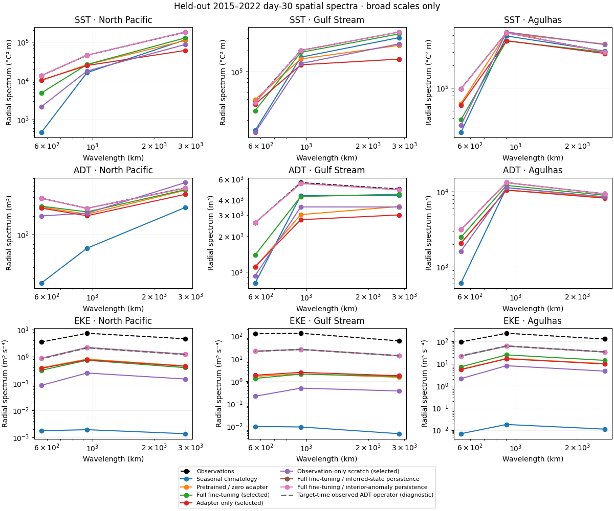

<!--
SPDX-FileCopyrightText: 2026 Samudra Authors

SPDX-License-Identifier: CC-BY-4.0
-->

# Observational D pilot: completed morning snapshot

**23 September 2026, 06:10 ET (10:10 UTC)** — delivered before the 10 a.m. ET deadline.
All three training runs, their 96-origin held-out comparisons, and anomaly/year
reports completed successfully. No run was stopped for the snapshot.

**D can be reused without repeating OM4 pretraining. Full fine-tuning is the best
learned forecast in this bounded pilot, but persisting its inferred initial state
wins the agreed integrated-plus-spectral score.** The data-only audit also exposes
a missing-ADT-boundary effect in the velocity metric that needs scientific review.

## Held-out results

January 2015–December 2022; checkpoints chosen on validation only. Lower is better.
Surface errors average day-5/15/30 bin scores; OHC compares next-calendar-month means.
`Combined score = 0.5 × mean(integrated error / fixed validation-climatology error) + 0.5 × mean(27 spatial spectral errors in dex)`.
Training RMSE does not select checkpoints.

| Method | Combined score | Spectral error (dex) | SST (°C) | Velocity (m/s) | EKE (m²/s²) | OHC 0–700 (GJ/m²) | OHC 700–2000 (GJ/m²) |
|---|---:|---:|---:|---:|---:|---:|---:|
| Full model: inferred-state persistence | 0.6223 | 0.2155 | 0.7912 | 0.1933 | 0.02472 | 0.7241 | 0.4299 |
| Full model: interior-anomaly persistence | 0.6334 | 0.2155 | 0.7912 | 0.1933 | 0.02472 | 0.7381 | 0.4632 |
| **Full fine-tuning forecast** | 0.6578 | 0.4246 | 0.5049 | 0.1409 | 0.02596 | 0.6503 | 0.4155 |
| Scratch: inferred-state persistence | 0.7170 | 0.2155 | 0.7912 | 0.1933 | 0.02472 | 0.9146 | 0.6789 |
| Observation-only scratch forecast | 0.9827 | 0.6242 | 1.2228 | 0.1372 | 0.02785 | 1.0765 | 0.6913 |
| Training seasonal climatology | 1.3781 | 1.6403 | 0.9039 | 0.2002 | 0.03093 | 0.8382 | 0.3729 |
| Atmospheric adapter only | 2.4573 | 0.4378 | 1.1556 | 0.1456 | 0.02634 | 6.3624 | 3.7753 |
| Source D with zero adapter | 2.5800 | 0.4229 | 1.0243 | 0.1475 | 0.02651 | 6.3358 | 4.3127 |

All seven methods for every arm, including source-initializer controls, are in the
[complete component table](artifacts/2026-09-23/heldout-table.md) and
[CSV](artifacts/2026-09-23/heldout-metrics.csv). Interior-anomaly persistence advances
only the seasonal mean of interior T/S; surface fields persist unchanged.

**Interpretation:**

- Full fine-tuning improves four of five integrated errors over persistence from
  the same selected initializer (SST, velocity and both OHC layers), but worsens EKE
  and spectral error. Persistence wins the combined score in all eight annual
  rescoring checks. Much of the transfer gain is already in the inferred interior:
  upper/deep OHC errors fall from 6.351/4.283 GJ/m² for source-state persistence to
  0.724/0.430 GJ/m² for fine-tuned-state persistence.
- There is useful surface evolution despite that score tradeoff: day-30 SST anomaly
  correlation is **0.710 versus 0.114** for matched persistence, and SST RMSE is
  **0.600 versus 1.215 °C**. The learned SST anomaly RMS amplitude is 0.793 of observed;
  it tracks observed anomalies better while losing amplitude/power. The corresponding ADT
  anomaly correlations are 0.734 versus 0.488.
- Deep OHC remains weak: fine-tuned anomaly correlation is **0.090**, and deep OHC
  RMSE exceeds seasonal climatology (0.415 versus 0.373 GJ/m²). Agreement with the
  mean gridded analysis should not be mistaken for deep-anomaly prediction skill.
- The full model beats scratch under these budgets, but this is one seed and neither
  learning curve establishes convergence. Scratch also uses observation normalization,
  a different learning rate and updated BatchNorm statistics. This is not a controlled
  estimate of asymptotic pretraining benefit.

The data-only audit found that 5.38% of weighted scoring support touches missing
observed ADT and accounts for roughly 80% of squared velocity disagreement.
Observed target-time ADT gives 0.1603 m/s disagreement on full support, versus about
0.0730 m/s on complete observed gradient stencils. Its median day-30 EKE power is
only 24% of the DUACS reference. These are operator/support diagnostics, not forecasts
or error floors; the current velocity/EKE scores need this qualification.

The spectral figure uses three broad wavelength bins per region. Persistence preserves
surface power particularly well; even target-time observed ADT loses EKE power when
passed through the coarse-grid geostrophic operator (see the technical methods). Power agreement
alone does not measure the timing or phase of a forecast.

Additional plots: [lead errors](artifacts/2026-09-23/heldout/heldout-leads.png),
[monthly T/S by depth](artifacts/2026-09-23/heldout/heldout-thermohaline.png),
[integrated components](artifacts/2026-09-23/heldout/heldout-components.png), and
[validation trajectory](artifacts/2026-09-23/validation/validation-joint-trajectory.png).

Annual EKE is recomputed from that year’s cohort mean at each fixed lead. Annual
scores are not an additive decomposition of the full-cohort score, and eight dependent
years are not independent trials or a confidence interval.

## Execution and retained evidence

| Arm | Retained updates: adapter / reconstruction / joint | Selected joint update | Validation score | Allocated GPU-hours | Train / evaluation jobs |
|---|---:|---:|---:|---:|---|
| [Full fine-tuning](https://wandb.ai/ocean_emulators/observational-transfer/runs/af7af77a1573) | 200 / 700 / 1000 | 1000 | 0.6141 | 5.123 | 18295884 / 18329670 |
| [Adapter only](https://wandb.ai/ocean_emulators/observational-transfer/runs/fdca5f8e2b72) | 200 / 1000 / 1000 | 800 | 2.3344 | 5.100 | 18295885 / 18329671 |
| [Scratch](https://wandb.ai/ocean_emulators/observational-transfer/runs/e035b83d0956) | — / 600 / 1000 | 900 | 0.9128 | 4.195 | 18303301 / 18329673 |

All jobs above exited 0. CPU reports 18329674/75/76 and the qualified operator
audit 18330279 also exited 0. Total allocated training time was **14.418 GPU-hours**,
including startup and replay after preemption, excluding qualification and evaluation.
The three runs recovered from 24 preemptions without changing their approved budgets.
Two evaluation-only compatibility failures were repaired: a torchrun argument delimiter
and pandas conversion of a NumPy string. Completed method outputs were preserved with
their original producer hashes. Focused tests and repository checks passed; full GPU
execution supplies the runtime evidence. The operator audit separately corrected an
invalid assumption that the two DUACS velocity masks were identical.

Preparation used EAI Grace CPUs. Training used up to three independent one-H200
Torch jobs; no beta GPU training ran. The **20.385 GiB** prepared data moved **EAI → OSN → Torch DTN
→ scratch**, with full hash verification. The [final quota check](artifacts/2026-09-23/quota.txt) records about **3.71 of
5.00 TB** used (about 1.29 TB free). Prepared data and run outputs occupy about
21 and 29 GiB respectively, excluding shared container images. No deletion was needed.

All three selected checkpoint copies have immutable hash-bearing filenames and
verified read-back hashes. Training producer is `d8949bb15d9fa92e6c8c94702092360bbe9005ef`;
evaluation producer is `7a892320332b43e16a5c1c8babfbea660cefc9a7` (two primary methods
retain their earlier unchanged forecast producer). Code is on branch
`codex/d-observation-pilot`; it has not been merged into main.
The [evidence index](artifacts/2026-09-23/README.md) links the compressed full capture,
checkpoint identities, data/code hashes, W&B completion audit and exact metric tables.

## Decisions for the ocean-expert discussion

1. **Forecast information:** accept retrospective, analysis-initialized prediction
   with prescribed ERA5 for this stage, or require operational causality next?
   DUACS smoothing/look-ahead and future atmospheric information require a different
   availability protocol for an operational claim.
2. **Spectra versus prediction:** the frozen score exposes a real tradeoff between
   accurate evolving fields and preserved spatial power. Inspect both, especially EKE,
   and decide how to handle incomplete observed gradient stencils. The audit now
   separates boundary effects from complete-stencil disagreement. A useful next
   comparison would report both directly coarsened DUACS velocity and geostrophy
   derived from the common-grid observed ADT on a predeclared common stencil mask.
   Keep the current test results fixed; any revised objective
   needs a new validation protocol and fresh held-out confirmation.
3. **Interior evidence and fair training budget:** assess the temperature and ADT/SSH
   conventions, weak deep-OHC anomaly skill, and whether gridded-analysis agreement is
   sufficient. Independent profiles and longer continuous rollouts are separate next
   experiments. A longer, matched-compute, multiple-seed scratch comparison would be
   needed to establish a durable pretraining benefit.

No further training has been launched from these test results. This snapshot completes
its reporting goal; choosing the next experiment is left for the discussion after the
meeting. The [approved plan](plan.md) and [execution log](progress.md) retain the full
implementation and recovery history.

Preparation, physical conventions, missingness, split definitions and the full selection protocol are in the [technical methods](snapshot-2026-09-23-methods.md).
