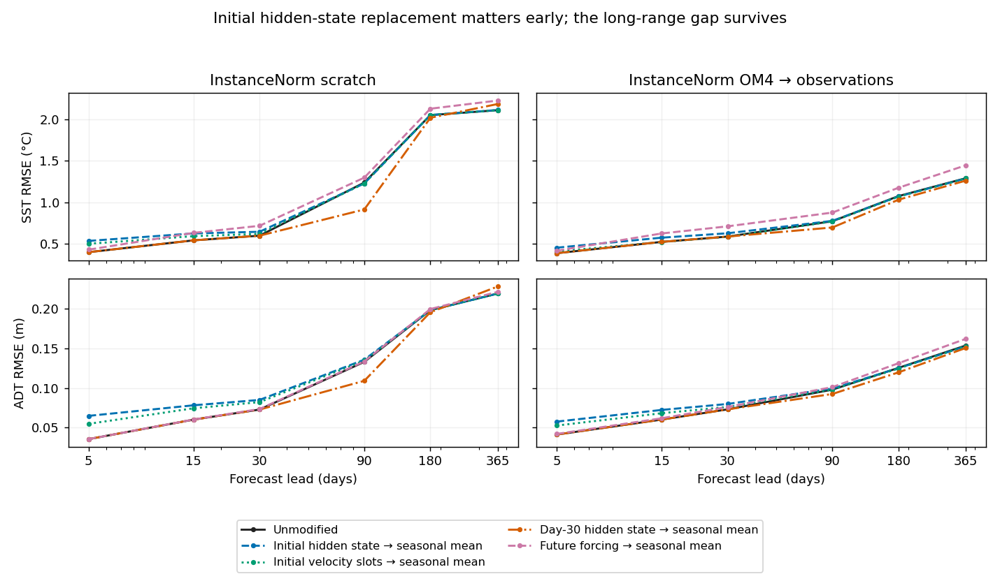

<!-- SPDX-FileCopyrightText: 2026 Samudra Authors -->
<!-- SPDX-License-Identifier: CC-BY-4.0 -->

# Three-day investigation: interim findings

Started 26 September 2026. **Final report due 29 September at 09:30 ET.**
This is an active investigation; the larger-backbone/mixed-task comparison has
not run yet. [Plan and scope](three-day-followup-2026-09-26.md).

## First result: much of the long-range advantage is reduced bias

These diagnostics reuse the completed InstanceNorm scratch and InstanceNorm
OM4 → observations models defined in the [preceding report](instance-norm-results-2026-09-26.md).
They use the same selected checkpoints and three continuous annual test origins;
there is no training, reselection or fitted test-time correction.

For each location we decompose error over the 73 forecast steps into its temporal
mean and residual temporal variation. The area/time-weighted MSE is exactly the
sum of those two components, including variable observation support. This
within-year mean is a diagnostic decomposition, not a deployable bias correction.
Values below average the three per-origin decompositions.

| Model | Field | Annual MSE | Temporal-mean bias contribution | Temporal-anomaly error contribution |
| --- | --- | ---: | ---: | ---: |
| InstanceNorm scratch | SST (°C²) | 3.087849 | 2.115475 | 0.972374 |
| InstanceNorm scratch | ADT (m²) | 0.032543 | 0.023446 | 0.009098 |
| InstanceNorm OM4 → observations | SST (°C²) | 1.016766 | 0.520636 | 0.496130 |
| InstanceNorm OM4 → observations | ADT (m²) | 0.015001 | 0.008632 | 0.006370 |

Approximately **77% of the SST MSE reduction and 84% of the ADT MSE reduction**
are in the temporal-mean bias component. The temporal-anomaly error also improves;
the advantage is not exclusively a mean offset. This does not yet identify
whether weights, initial state or forcing response causes the difference.

## Training climatology is a stronger year-end baseline than either model

The baseline is the existing training-only monthly surface climatology evaluated
at each forecast midpoint's calendar month, with the same observed support.
The correlation is the area-weighted centered spatial correlation of predicted
and reference anomalies relative to that climatology. Simply subtracting the
same climatology from prediction and truth cannot change RMSE; the separate
correlation/amplitude diagnostics answer a different question.

| Model | Field | Day-365 RMSE | Climatology RMSE | Day-365 mean bias | Centered anomaly correlation |
| --- | --- | ---: | ---: | ---: | ---: |
| InstanceNorm scratch | SST (°C) | 2.1102 | 1.0373 | -0.9670 | 0.2792 |
| InstanceNorm scratch | ADT (m) | 0.2192 | 0.0992 | -0.1282 | 0.0510 |
| InstanceNorm OM4 → observations | SST (°C) | 1.2906 | 1.0373 | -0.4106 | 0.3847 |
| InstanceNorm OM4 → observations | ADT (m) | 0.1536 | 0.0992 | -0.0564 | 0.0318 |

OM4 initialization improves year-end SST anomaly correlation, but not ADT anomaly
correlation. Both models have worse year-end SST and ADT RMSE than climatology.
The previous annual improvement therefore establishes reduced degradation
relative to scratch, not useful year-ahead predictive skill against this baseline.
One seed and three previously examined annual origins remain exploratory evidence.

## Initial hidden-state information does not explain the year-end gap

Both completed selected checkpoints were rerun on H200 with five fixed
interventions. For each model, seasonal means were estimated from its initializer
outputs on all 243 training examples. Hidden-state replacement preserves both
observed SST/ADT slots at both history times. Velocity-only replacement changes
only the 38 internal U/V slots. Those slots need not represent physically correct
velocities. No hidden states were swapped between models.

Values are mean RMSE across the three January-start annual sequences. The
unmodified path was checked against each model's native forecast, exactly, on
this execution. Paired comparisons below use these H200 baselines; small
floating-point differences from the earlier hardware's annual results are not
interpreted as changes in skill.

| Model | Condition | Day-5 SST RMSE (°C) | Day-30 SST RMSE (°C) | Day-365 SST RMSE (°C) | Day-365 ADT RMSE (m) |
| --- | --- | ---: | ---: | ---: | ---: |
| InstanceNorm scratch | Unmodified | 0.3993 | 0.5978 | 2.1101 | 0.2192 |
| InstanceNorm scratch | Initial hidden state → seasonal mean | 0.5349 | 0.6450 | 2.1126 | 0.2191 |
| InstanceNorm scratch | Future forcing → seasonal mean | 0.4296 | 0.7167 | 2.2264 | 0.2213 |
| InstanceNorm OM4 → observations | Unmodified | 0.3870 | 0.5870 | 1.2906 | 0.1536 |
| InstanceNorm OM4 → observations | Initial hidden state → seasonal mean | 0.4532 | 0.6270 | 1.2877 | 0.1527 |
| InstanceNorm OM4 → observations | Future forcing → seasonal mean | 0.4163 | 0.7105 | 1.4466 | 0.1621 |

Replacing the case-specific hidden initialization worsens short-lead error,
but the year-end SST gap is essentially unchanged: about 0.820°C before and
0.825°C after replacement. Replacing only the internal velocity slots similarly
changes year-end SST by less than 0.003°C in either model, while worsening
day-five surface-derived velocity RMSE from 0.0815 to 0.1113 m/s for scratch and
0.0815 to 0.1049 m/s for the OM4-initialized model. The hidden initialization
therefore affects early forecasts, but its case-specific departures from the
seasonal mean do not account for the long-range advantage in these cases.

Replacing future forcing with its training monthly climatology worsens SST,
including the OM4 model's year-end RMSE from 1.291 to 1.447°C. The long-range
advantage still survives. This argues against either case-specific hidden
initialization or access to actual future forcing being the sole explanation.
It is consistent with better learned rollout behavior and reduced drift after
OM4 training; it does not prove which weights or physical mechanism provide it.
The observed initial SST/ADT states are retained in all state interventions, so
this is not a test of discarding *all* initial-condition information.

A separate day-30 hidden-state seasonal reset improves day-90 SST RMSE from
1.238 to 0.914°C for scratch and 0.772 to 0.697°C for transfer. The longer effect
is mixed: scratch worsens at day 365, while transfer improves slightly. Replacing
an evolved state with an initializer-derived mean can be out of distribution;
this exploratory sensitivity result motivates studying drift, not adopting a
reset based on these held-out cases.

These results use one seed and three previously examined annual origins. They
are diagnostic evidence, not new checkpoint selection or a test-tuned correction.
[Full mechanism evidence](artifacts/2026-09-26-three-day/mechanism-evidence.json.gz)
includes all five conditions, three origins, lead errors, spectra and hashes.

## Methods and model names

| Literal model name | Meaning |
| --- | --- |
| InstanceNorm scratch | Randomly initialized 121.7M-parameter history initializer and approximately 31.6M-parameter D processor, with a 387-parameter forcing adapter. Trained only on observation labels: 1,000 reconstruction updates then 8,000 joint updates. Fixed observation validation selected joint update 4,900; core learning rate 3e-4. |
| InstanceNorm OM4 → observations | Same architecture. A fresh InstanceNorm core was trained on OM4 and selected by OM4 validation, then received 1,000 observation reconstruction and 8,000 joint updates with the adapter. Observation validation selected joint update 6,400; core learning rate 1e-4. |

Both use a 19-frame surface history at five-day cadence. OM4 joint training uses
six five-day full-state forecast targets; observation training uses calendar-month
T/S constraints and six or seven five-day surface targets. Annual forecasts are
73 autoregressive steps with prescribed ERA5 forcing; there is no year-long
backpropagation. Training-derived replacements use only training examples.
The new Samudra-2-matched processor has 83,872,357 parameters; it is a separate
comparison and has no reported production results yet.

## Execution and remaining work

The Samudra-2-matched processor has 83,872,357 parameters, versus approximately
31.6M in the previous pilot; the initializer stays approximately 121.7M. The
reference backbone/output padding and kernel are reused, retaining InstanceNorm
and fixed loss. Single-loop producer `50630959c6a8aed89fcc0152cab28b16f8c377d3`
passed 29 targeted tests and all commit checks. It preserves exact per-task
exposure/sample order, one optimizer, and checkpoint/resume state. Build 18581034
completed. H200 OM4 qualification **18581191** completed 100 updates in
191 training seconds, with finite training loss and lower four-origin OM4
validation error. Observation qualification **18581192** completed ten fixed-example
updates, reducing loss from 1.2603 to 0.2463 with gradients reaching every module;
peak GPU allocation was 6.15 GiB. These are feasibility checks, not held-out lift.

Mixed probe **18581193** failed its next-update numerical equivalence check:
identical losses but a few replayed weights differed by several millionths.
The backbone uses CUDA bilinear interpolation, whose installed PyTorch documentation
warns of nondeterministic gradients. Producer `dd3a05b07554ce0c1c9f589643d2afb764ab1440`
now verifies serialized/restored weights, optimizer moments and RNG states exactly,
then compares disk replay variation against measured in-memory replay variation.
It also records selected checkpoints' global and per-task counts. Eighteen focused
tests and all commit checks passed. New qualifications use fresh directories;
the failed producer/checkpoint is preserved. Build **18582535** submits the retry.
Production remains blocked by qualification, not assumed successful.

Mechanism jobs **18581194 / 18581195** completed all five conditions on all three
annual origins in 278 / 282 allocated GPU seconds, respectively. Their results
are analyzed above. No new production training has been submitted.

Bias/anomaly diagnostic producer `6d8a8d26b` passed two decomposition tests and
repository checks. CPU job 18580782 failed before analysis because bare container
Python lacked an installed project dependency; corrected job **18580810 completed
in 23 seconds** using the container project environment. No GPU-hours were used.
Raw [scratch diagnostics](artifacts/2026-09-26-three-day/scratch-annual-decomposition.json)
and [transfer diagnostics](artifacts/2026-09-26-three-day/transfer-annual-decomposition.json)
retain evaluation and training-statistics hashes.

Next: qualify throughput/memory and the implemented single-loop controls, freeze
matched task-exposure budgets, and evaluate initial-state
and forcing interventions. Known preprocessing limits and quarter-degree runs
are out of scope for this three-day campaign.
