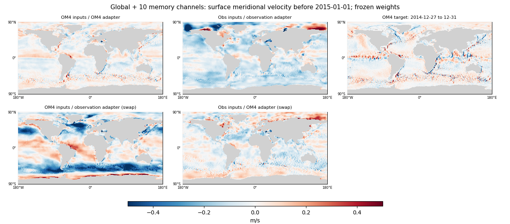

<!-- SPDX-FileCopyrightText: 2026 Samudra Authors -->
<!-- SPDX-License-Identifier: CC-BY-4.0 -->

# Supplement: do ten explicit memory channels preserve physical velocities?

**Not consistently in these examples.** The ten-channel model still learns recognizable currents on its OM4 path, but its observation-initialized velocities remain unlike the date-matched OM4 currents. Adding memory does not restore the physical interpretation of the observation U/V slots. Task-adapter sensitivity improves for one component and worsens for the other.

This repeats the [physical-only frozen-checkpoint analysis](velocity-task-supplement-2026-10-01.md) on the completed [global ten-channel comparison](global-domain-results-2026-09-30.md). No model was retrained or checkpoint reselected.

## Models and matched analysis

| Literal result-table name | Definition | Parameters |
|---|---|---:|
| Global physical-only | Global small D mixed model, 77 physical state channels | 62,966,546 |
| Global + 10 memory channels | Matched global model with 77 physical plus 10 unconstrained initialized and autoregressed channels | 63,363,656 |

Both use InstanceNorm, shared initializer/processor backbones, task-specific 1×1 input adapters, seed 1729 and fixed endpoints after **8,000 OM4 + 8,000 observation updates**, without an observation-only finish. The extra slots receive gradients through the forecast but have no direct targets or physical normalization. Observation training does not directly supervise U/V in either model. Extra capacity does not impose a rule that all nonphysical information must move into the ten added slots.

We repeat both 95-day histories ending before January 1, 2015 and 2018, comparing the initialized surface state for December 27–31. Each model is evaluated with both normal input/adapter combinations and with only its initializer adapter swapped on fixed inputs. **OM4 inputs / OM4 adapter** uses OM4 surface histories, original forcings, seasonal context and full wet visibility. **Obs inputs / observation adapter** uses observed surfaces, adapted ERA5, observation context and finite-input masks. Swap rows are off-task interventions, not normal inference modes. The processor uses its normal OM4 adapter for the six-step loss decomposition below.

All 87 channels are preserved through initialization and autoregression in the memory model; only physical channels enter physical-error calculations. The two models have exactly identical comparison grids, wet masks, OM4 targets and observation examples. The memory model's observation initialization reproduces its previously published physical fields exactly on both dates (maximum absolute difference zero over all 77 channels).

## Agreement with date-matched OM4 currents

Metrics average the two dates' cosine-area-weighted surface RMSEs and centered spatial correlations. **OM4 is a supervised source-task target, not observation-current ground truth.** Differences between the simulated and real ocean can contribute to mismatch on observation inputs. These are initialization diagnostics, not day-30 forecast scores.

| Model | Input bundle / initializer adapter | U RMSE, m/s | V RMSE, m/s | U correlation | V correlation |
|---|---|---:|---:|---:|---:|
| Global physical-only | OM4 inputs / OM4 adapter | 0.086 | 0.081 | 0.791 | 0.577 |
| Global physical-only | Obs inputs / observation adapter | 0.168 | 0.138 | 0.312 | 0.195 |
| Global physical-only | OM4 inputs / observation adapter (swap) | 0.188 | 0.163 | 0.219 | 0.214 |
| Global physical-only | Obs inputs / OM4 adapter (swap) | 0.153 | 0.111 | 0.280 | 0.161 |
| Global + 10 memory channels | OM4 inputs / OM4 adapter | 0.084 | 0.084 | 0.800 | 0.538 |
| Global + 10 memory channels | Obs inputs / observation adapter | 0.167 | 0.148 | 0.169 | 0.069 |
| Global + 10 memory channels | OM4 inputs / observation adapter (swap) | 0.143 | 0.208 | 0.476 | 0.010 |
| Global + 10 memory channels | Obs inputs / OM4 adapter (swap) | 0.148 | 0.122 | 0.253 | 0.119 |
| Zero current (same baseline for both) | U = V = 0 | 0.139 | 0.097 | — | — |

The memory model's normal OM4-path skill is broadly comparable to physical-only. Its observation-path U/V correlations are **0.169/0.069**, versus **0.312/0.195** for physical-only. U RMSE barely changes, while V RMSE increases from **0.138 to 0.148 m/s**. Both observation paths have greater mismatch than the zero-current baseline. The memory model reduces mean observation-path U bias relative to OM4 (0.067 → −0.012 m/s) and modestly reduces the magnitude of V bias (−0.085 → −0.072 m/s), but this does not translate into better spatial structure.

[2018 zonal](artifacts/2026-10-01-velocity-memory-audit/2018-01-01-zonal.png) · [2018 meridional](artifacts/2026-10-01-velocity-memory-audit/2018-01-01-meridional.png) · [Physical-only maps, same layout and scales](velocity-task-supplement-2026-10-01.md#frozen-checkpoint-comparison).

## Does it reduce the task-dependent change itself?

The next table measures RMS **differences between two outputs of the same frozen model**, without an OM4 target. It therefore separates output sensitivity from target mismatch. Values are means of each date's cosine-area-weighted RMS field differences, in m/s. Smaller means less change; it does not by itself mean a better forecast.

| Intervention | Physical-only U | +10 memory U | Physical-only V | +10 memory V |
|---|---:|---:|---:|---:|
| Normal OM4 versus normal observation paths | 0.149 | 0.140 | 0.119 | 0.118 |
| Change only adapter on OM4 inputs | 0.173 | 0.120 | 0.149 | 0.186 |
| Change only adapter on observation inputs | 0.114 | 0.123 | 0.102 | 0.109 |

The normal-path U difference is about 6% smaller with memory; V is essentially unchanged. Holding OM4 inputs fixed and changing only the adapter reduces the U difference by about 31% but **increases V by about 25%**. On fixed observation inputs, both adapter effects increase. Thus this check does not support a general reduction of task-dependent velocity behavior. The normal-path comparison changes the whole input bundle as well as the adapter; only the swap rows isolate adapter dependence.

## Same OM4 loss decomposition

The diagnostic also repeats six five-day OM4 forecast steps and the two-state initializer reconstruction. Entries below are contributions to the balanced core loss, multiplied by 1,000; reconstruction already includes its 0.1 coefficient. The forecast averages five variable groups and reconstruction four (excluding copied surface T and SSH). Artificial hiding and its completion term are omitted, as in the physical-only analysis. These are evaluated loss-value shares, not gradient shares or training averages.

| Model | Variable | Forecast ×1,000 | Reconstruction ×1,000 | Core-loss share |
|---|---|---:|---:|---:|
| Global physical-only | thetao | 1.511 | 0.369 | 29.8% |
| Global physical-only | so | 2.086 | 0.512 | 41.2% |
| Global physical-only | uo | 0.355 | 0.078 | 6.9% |
| Global physical-only | vo | 0.319 | 0.068 | 6.1% |
| Global physical-only | zos | 1.014 | 0.000 | 16.1% |
| Global + 10 memory channels | thetao | 1.662 | 0.392 | 30.0% |
| Global + 10 memory channels | so | 2.221 | 0.467 | 39.2% |
| Global + 10 memory channels | uo | 0.391 | 0.076 | 6.8% |
| Global + 10 memory channels | vo | 0.298 | 0.071 | 5.4% |
| Global + 10 memory channels | zos | 1.281 | 0.000 | 18.7% |

U/V remain supervised on OM4 steps, with the same 1 m/s state scales in both runs. This diagnostic does not test velocity rescaling, memory necessity, or whether a different objective would make the observation U/V channels physical. A memory-zeroing or state-corruption intervention would answer a separate question about which channels the observation forecast actually uses.

## Conclusion and limits

The simple hypothesis “give it explicit memory and the physical velocity slots will stay physical across tasks” is **not supported by this matched comparison**. The model can still repurpose physical slots on observation steps even when ten extra slots are available. These results do not establish that memory is unused, or that its addition caused worse generalization: there is one training seed and only two matched held-out diagnostic histories. They do show that the existing memory run does not resolve the visual discrepancy that motivated this check.

## Provenance

Memory checkpoint `88ea8c067ba4bb0ce78fd04bc68d617557c404090dc9bfa4812612ee4ddc8a4b`, original producer `b95179b963d372b72333c7f0e7e521a67b51ff6e`, run `2026-09-29-observation-global-latent10/conditioned-mixed-global-latent10`, fixed `joint-08000.pt`. Physical-only results are reused from the linked supplement, checkpoint `7ca22c101324f176983415c58c218149464fac79b4397eca6bf2c5012bc9d3c3`.

Job **18976718** completed successfully in **43 seconds on one RTX GPU (0.0119 allocated GPU-hours)**, without retries. Checkpoint/manifest/source hashes, exact time alignment, array/archive hashes, common targets, reproduction and loss recomposition passed. Maps use the same ±0.5 m/s scales and one pixel per grid cell. [Numerical results, per-date metrics, source and execution records](artifacts/2026-10-01-velocity-memory-audit/provenance.json.gz) preserve the comparison and plotting audit.
