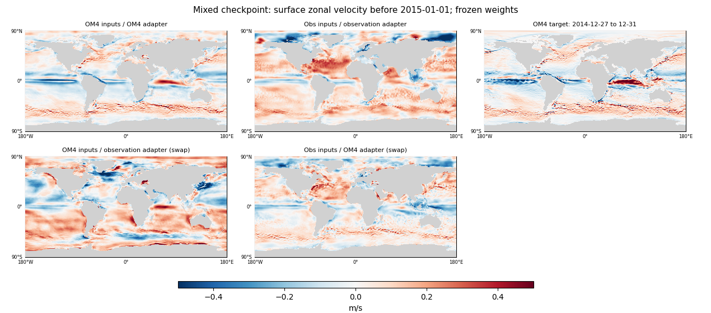

<!-- SPDX-FileCopyrightText: 2026 Samudra Authors -->
<!-- SPDX-License-Identifier: CC-BY-4.0 -->

# Supplement: mixed initializer velocities depend on the task

**The mixed checkpoint has learned recognizable OM4 currents. Its initialized velocity fields change substantially between the OM4 and observation paths.** With fixed weights, changing only the initializer's task adapter substantially changes the currents even on identical OM4 inputs. Changing the input bundle also matters: using the OM4 adapter on observation inputs does not recover the original OM4-task agreement.

This supplements the [global physical-only report](global-physical-day30-2026-09-30.md) and answers why its initialized U/V maps looked unlike the date-matched OM4 sample despite 8,000 directly supervised OM4 updates. It studies the same **Final: 8,000 obs** checkpoint: 8k OM4 + 8k observation updates, 62,966,546 parameters, affine InstanceNorm, shared initializer/processor backbones, separate learned 1×1 input adapters, 77 physical slots and no additional latent slots. There was no observation-only finish.

## Frozen-checkpoint comparison

Two held-out examples use the 95-day histories ending immediately before January 1, 2015 and 2018. All nineteen five-day bins match exactly across products; the displayed initialized state covers December 27–31 of the preceding year. Each row below is a configuration of the **same model**, rather than a separately trained model:

- **OM4 inputs / OM4 adapter:** OM4 SST/SSH, original normalized OM4 forcings, native seasonal context and complete wet-surface validity; its normal OM4 evaluation path.
- **Obs inputs / observation adapter:** observed SST/SSH, ERA5 passed through the learned forcing adapter, observation seasonal context and finite-input masks; its normal observation evaluation path. For both dates, the latest initialized state reproduces the previously published fields exactly, with maximum absolute difference zero for all 77 channels.
- **Swap rows:** hold the complete input bundle fixed and change only the initializer's learned task adapter. These off-task interventions isolate adapter dependence; they are diagnostic configurations rather than proposed inference settings.
- **Zero current:** U=V=0 on the same wet support, a simple magnitude baseline.

The initializer receives surface histories in both tasks; OM4 interior/velocity truth is used only for comparison. No state is initialized from the true full OM4 ocean.

[2015 meridional velocity](artifacts/2026-10-01-velocity-task-audit/2015-01-01-meridional.png) · [2018 zonal velocity](artifacts/2026-10-01-velocity-task-audit/2018-01-01-zonal.png) · [2018 meridional velocity](artifacts/2026-10-01-velocity-task-audit/2018-01-01-meridional.png).

The table averages each date's cosine-area-weighted surface error and centered spatial correlation over the two examples. All comparisons use the same field-specific model wet mask and date-matched OM4 target. **OM4 is the supervised source-task target; for observation inputs it is model-data context, not observed current truth.** Differences between OM4 and the real ocean can contribute to the latter mismatch.

| Input bundle / initializer adapter | U RMSE vs OM4, m/s | V RMSE vs OM4, m/s | U correlation | V correlation |
|---|---:|---:|---:|---:|
| OM4 inputs / OM4 adapter | 0.086 | 0.081 | 0.791 | 0.577 |
| Obs inputs / observation adapter | 0.168 | 0.138 | 0.312 | 0.195 |
| OM4 inputs / observation adapter (swap) | 0.188 | 0.163 | 0.219 | 0.214 |
| Obs inputs / OM4 adapter (swap) | 0.153 | 0.111 | 0.280 | 0.161 |
| Zero current | 0.139 | 0.097 | — | — |

The normal OM4 path recovers broad current structure and improves on zero current, although the maps remain smoother than OM4. For the January 2015 example alone, switching identical OM4 inputs from the OM4 to the observation adapter drops U correlation from **0.794 to 0.194** and increases U RMSE from **0.085 to 0.191 m/s**. The second date shows the same effect. This cannot be explained by different ocean realizations because the inputs and target are held fixed in that intervention.

The original observation path carries a large mean V offset: approximately −0.085 m/s relative to OM4 in both examples, compared with approximately +0.004 m/s on the normal OM4 path. Changing to the OM4 adapter reduces that offset, but does not reproduce source-task currents. The input-bundle difference includes surfaces, forcing representation, visibility and the existing seasonal-encoding conventions; this experiment does not isolate those components individually.

## What supervision and scaling actually do

OM4 directly supervises all T/S/U/V/SSH forecast slots at six five-day leads. Initializer reconstruction supervises both emitted states, excluding copied surface T and SSH, with coefficient **0.1**. Observation steps supervise T/S and surface fields; they supply no U/V targets. Shared backbone weights therefore coexist with task-specific routing and different constraints on the output slots. The observation U/V slots remain free to carry information useful for the supervised forecast.

The shared observation-derived state scales leave all U/V means at zero and scales at **1 m/s**. Recorded native OM4 surface standard deviations are **0.12694 m/s for U and 0.08732 m/s for V**. Using those native scales would multiply the same surface squared errors by approximately **62 and 131**, respectively. This is a real asymmetry relative to variance normalization, but its effect on trained behavior has not been established by a rescaling experiment.

The following decomposes the original core OM4 objective on the two held-out examples, using full wet-surface inputs: six-step forecast loss plus 0.1 × two-state reconstruction loss. Entries are the actual weighted contributions, **multiplied by 1,000 for readability**; the final column gives their fraction of that evaluated objective. Artificial hiding and its surface-completion term are omitted here. These are loss-value shares, not gradient shares or averages over training batches.

| Variable | Forecast contribution ×1,000 | Reconstruction contribution ×1,000 | Share of evaluated core loss |
|---|---:|---:|---:|
| Temperature | 1.511 | 0.369 | 29.8% |
| Salinity | 2.086 | 0.512 | 41.2% |
| U | 0.355 | 0.078 | 6.9% |
| V | 0.319 | 0.068 | 6.1% |
| SSH | 1.014 | 0.000 | 16.1% |

U/V together contribute **13.0%** here. Their penalty is smaller than T/S, but it is not absent, and the normal OM4 path demonstrably learns useful current structure. The adapter intervention provides stronger direct evidence for the displayed discrepancy than attributing it solely to weak velocity weighting. Existing OM4 retention summaries emphasized T/S and an aggregate full-state loss, so they did not expose this distinction.

## Implication and next diagnostic

The observation velocity maps do not establish that OM4 supervision failed or was forgotten. They show that physical meaning learned on the OM4 task is not automatically retained in observation-conditioned U/V slots. This is compatible with the intended allowance for unconstrained hidden information; it does limit interpreting those slots as reconstructed currents.

A useful next intervention would replace or disrupt U/V during observation forecasts and measure changes in the supervised outputs, with a corresponding OM4-task control. That would test whether these task-dependent fields carry useful information. Loss-rescaling or a constraint aligning the two tasks' states would be separate training experiments; these two cases do not establish that either would improve observation forecasts.

## Provenance and checks

Frozen checkpoint `7ca22c101324f176983415c58c218149464fac79b4397eca6bf2c5012bc9d3c3`, original runtime producer `79025a163817a577ab81af95b401f5cb0563cd12`. The canonical Rust OM4 reader supplies the original normalization and masks; model-space conversion follows the training path. The inference source is explicitly attached to that native reader. Exact time alignment, common masks, checkpoint counts/hashes, runtime-source hashes, observation-state reproduction and recomposition of the original balanced losses all passed. Maps retain ±0.5 m/s scales and one pixel per grid cell. The appendix contains every per-channel error and both dates separately.

Successful job **18974877** completed in 42 seconds on one RTX GPU. Two earlier diagnostic setup attempts failed before inference (27 and 29 seconds); records are retained. Total actual allocation, including both failures, is **0.0272 GPU-hours**. No weights, training schedules or checkpoint selection changed. [Full results, source, plotting audit and execution records](artifacts/2026-10-01-velocity-task-audit/provenance.json.gz).

## Follow-up: explicit memory channels

The [same analysis on Global + 10 memory channels](velocity-memory-supplement-2026-10-01.md) finds no consistent reduction of this task dependence: observation-path current correlations fall, and adapter sensitivity decreases for U but increases for V on fixed OM4 inputs.
