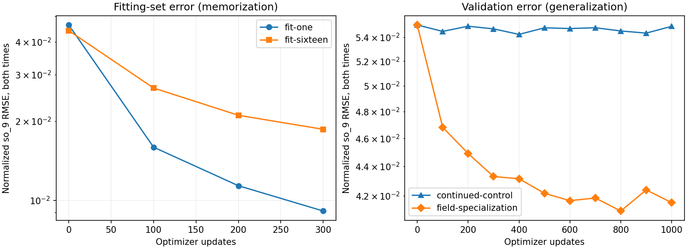
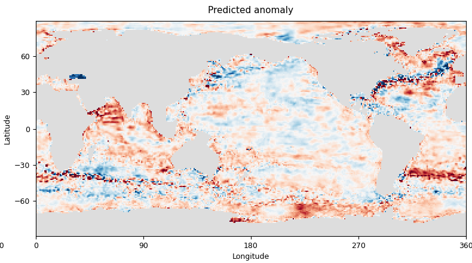
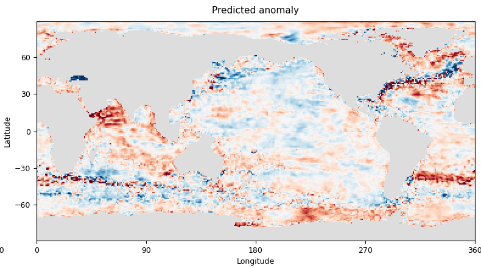
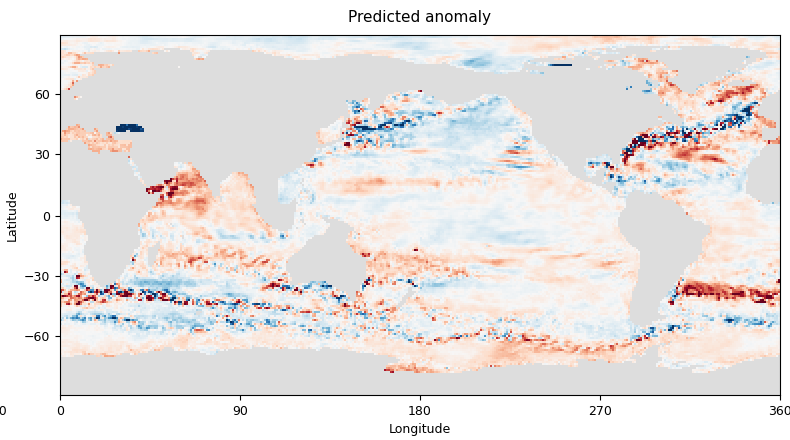

<!--
SPDX-FileCopyrightText: 2026 Samudra Authors
SPDX-License-Identifier: CC-BY-4.0
-->

# Why does D reconstruct salinity poorly?

**Numerical precision is a small contributor. D can fit much more faithful spatial patterns, and changing its objective recovers substantial held-out salinity skill—but sacrifices the other fields.** This first diagnostic wave tests the questions raised by the wave-3 550 m salinity maps. It does not establish an irreducible information limit or show that diffusion is necessary.

## Results on unseen dates

All three rows below use the same 99 origins, the same one-GPU/batch-two evaluation layout, and the original D initialization inputs. The specialist and continued-training control each receive exactly 1,000 optimizer updates with identical sampled examples, starting from the same D checkpoint. Selection uses validation salinity error, not held-out maps. The selected checkpoints are update 400 for the control and update 800 for the specialist.

| Model | 550 m salinity RMSE | Improvement over D | Mean spatial anomaly correlation | Anomaly RMS / truth | MSE skill versus monthly climatology |
| --- | ---: | ---: | ---: | ---: | ---: |
| Original D | 0.04499 | — | 0.591 | 0.731 | 0.328 |
| Continue original full-field objective | 0.04451 | 1.1% | 0.598 | 0.723 | 0.342 |
| Fine-tune on 550 m salinity alone | **0.03785** | **15.9%** | **0.727** | 0.674 | **0.524** |

Physical errors use the dataset's salinity units and refer to the current reconstructed time. Correlation is computed spatially within each date and then averaged. RMS amplitude ratios pool second moments across dates. Climatology RMSE is 0.05487. The paired year-block 95% interval for the specialist's RMSE reduction is **14.2–17.6%**; the control's interval is 0.8–1.4%. These intervals describe variation across the nine sampled calendar-year blocks, not independent training seeds or independent ocean simulations.

The specialist is **not a replacement full-state initializer**. Aggregate normalized T/S reconstruction RMSE, averaged over both reconstructed times, increases from **0.06304 to 0.09394 (49%)**. Continued full-objective training gives 0.06376. A single-field objective lets the shared model abandon its other tasks. This points toward objective weighting, shared-representation interference, or capacity allocation as recoverable contributors; it does not distinguish those mechanisms by itself.

## Precision: a small effect

Identical FP32 weights and batches were evaluated with BF16 autocast enabled and disabled; TF32 was disabled in both cases.

| Original D evaluation | BF16 RMSE | FP32 RMSE | RMSE between the two predictions |
| --- | ---: | ---: | ---: |
| 16 separated training origins | 0.03127 | 0.03123 | 0.00238 |
| 11 validation origins | 0.03909 | 0.03889 | 0.00242 |

FP32 reduces validation RMSE by **0.53%**. These tests measure inference precision, not the counterfactual of training the entire model in FP32. They reinforce the earlier target-rounding calculation: the large visible errors are not primarily an output-resolution floor imposed by BF16.

## Can the architecture fit a faithful field?

Yes, substantially more faithfully than its original predictions. Both tests fine-tune the whole initializer using only `so_9`, on training dates only, for 300 updates.

| Fitting set | Fitted-set salinity RMSE | Fitted-set anomaly correlation | Anomaly RMS / truth | Validation salinity RMSE |
| --- | ---: | ---: | ---: | ---: |
| One training origin | **0.00642** | **0.994** | 0.990 | 0.09849 |
| 16 separated training origins | **0.01320** | **0.956** | 0.969 | 0.04019 |

Relative to each fitting set's starting checkpoint, both-time field RMSE falls 80.3% and 57.8%, respectively. The one-example model generalizes very poorly; the sixteen-example model also fails to beat original D on validation. [Compare both fitted models on the exact single training example](maps.md#shared-training-example-1975-04-03), alongside original D and the target, with common color limits. These are memorization checks, not evidence of improved prediction. Neither was trained to convergence or to a numerical floor. Nonetheless, the results argue against a hard architectural inability to represent the field's spatial structure.



## Maps and spatial scales

The following panels compare **anomalies**, all with the same color limits, for the original November 14, 2018 example. Each grid cell occupies exactly 2×2 pixels in the saved images, with no interpolation; browser previews may rescale them. The panels are separate files to preserve lossless pixels within the repository's per-file size limit. The plotting command below also regenerates standalone four-up PNGs.

| True anomaly | Original D anomaly |
| --- | --- |
|  |  |

| Continued full-objective training | Salinity-only fine-tuning |
| --- | --- |
|  |  |


[The map gallery](maps.md) includes the same truth/prediction/error/climatology-error four-up for six held-out dates, covering seasons as well as years, and a memorized training example. The specialist still misses substantial broad structure in the North Pacific: the visual concern has been reduced, not eliminated.

Improvement is not simply an increase in sharpness or amplitude. Three-cell high-pass anomaly alignment (pooled uncentered correlation) increases from 0.588 to 0.729, while its amplitude ratio decreases from 0.845 to 0.797. Nine-cell low-pass alignment increases from 0.642 to 0.788. The specialist improves both broad and fine-scale pattern agreement while predicting less total anomaly amplitude. [Full scale diagnostics](artifacts/spatial-scales.csv).

## Is this distribution shift?

The original 2018 example was typical of the held-out set, but the later period is harder than the sampled training dates. Original D's RMSE is 0.03127 on the 16 training probes, 0.03909 on validation, and 0.04499 on held-out dates. The specialist gives 0.01761, 0.02909, and 0.03785.

Within the held-out period, specialist RMSE increases from 0.03452 in 2015 to 0.04217 in 2022, and climatology-relative MSE skill falls from 0.578 to 0.474. Original D also deteriorates in absolute RMSE. This is consistent with temporal generalization difficulties, but is not proof of input distribution shift: training-set fitting advantage, different anomaly amplitudes, and changing ocean regimes are still confounded. No input-distribution audit or recent-period retraining has been performed. [Yearly results](artifacts/yearly.csv).

## Suggested next wave

1. **Separate readout limitations from changing shared features.** Train only a `so_9` head or small adapter on frozen D features, copying D's other output fields unchanged. Compare against this full-network specialist. This asks whether the required information already exists in D's representation.
2. **Test a real climatology-residual parameterization with a matched direct-output control.** Start both from identical D backbone weights and identically reset field heads; the residual arm adds fixed training-period monthly climatology in FP32. The distinct initial output is the intended climatology prior. Merely subtracting climatology from both sides of the loss would leave MSE unchanged and is not the experiment.
3. **Check whether specialization gains can coexist with the other tasks.** Retain the full objective while increasing this field's weight, and report the joint salinity/T/S/velocity trade-off. A better salinity map alone is insufficient for the final ocean-state task.

Continue to defer diffusion until a subsequent wave. These results leave room for conditional-mean smoothing or missing information, but already show that a different deterministic objective recovers some of the missing structure. A generative model should eventually be judged on conditional calibration and physical plausibility as well as the skill of its ensemble mean.

## Protocol, provenance, and reproduction

See the [locked diagnostic plan](../surface-initializer-diagnostics-plan.md). This is OM4 one-degree, five-day, model-world initialization, not observational reconstruction or forecast skill. No model dynamics are trained or evaluated in this wave. The original training split, normalization, 90-day input history and D architecture are unchanged. Each training run uses one RTX PRO 6000 Blackwell, microbatch two, four accumulation steps, AdamW at 1e-4, weight decay 0.01, clipping 1.0, seed 1729, and a fresh optimizer. Tiny-set selection uses its fitting set; both generalization arms select on validation `so_9` MSE averaged over both reconstructed times.

Runtime producer: [`349f6c9ec`](https://github.com/m2lines/Samudra/commit/349f6c9ec). Original D comes from the [wave-3 training record](../surface-wave3-results/artifacts/training/primary/D/TRAIN_COMPLETE.json). Training outputs and selected weights remain under `/scratch/jr7309/runs/2026-09-22-initializer-diagnostics/` on Torch. Checkpoint weights are not included in this report bundle.

| Run | Job | Outcome |
| --- | --- | --- |
| Qualification | 18259726 | Three updates, loader-equivalence and output checks passed |
| Original D precision and held-out evaluation | 18260077 | Complete |
| One-example fitting | 18260078 | 300 updates complete |
| Sixteen-example fitting | 18260079 | 300 updates complete |
| Continued full-objective training | 18260080 | 1,000 updates complete; in-process held-out allocation failed |
| Salinity-only fine-tuning | 18260081 | 1,000 updates complete; in-process held-out allocation failed |
| Fresh evaluation of selected specialist | 18260694 | Complete, unchanged selected checkpoint |
| Fresh evaluation of selected control | 18260933 | Complete, unchanged selected checkpoint |

The two failed evaluation attempts stopped at the resident-cache memory preflight: 11.84 GiB plus a 30 GiB reserve exceeded free memory after training. Fresh processes evaluated the saved, validation-selected weights without further training. All attempts together used **0.986 allocated GPU-hours**, including qualification and the failures. [Slurm accounting](artifacts/accounting.psv).

The inherited wave-3 study manifest still describes its original T/S selection. Diagnostic-specific `selection-protocol.json` records and the locked plan supersede that description here. All 127 collected source files were verified byte-for-byte against a source checksum manifest. The publication bundle contains 63 original metric/map/protocol artifacts plus extracted selection-event CSVs and derived figures/tables. Large NPZ files use the repository's gzip-part convention; the commands read them directly. Full runner manifests/logs also remain in the local workspace and Torch output directories.

```bash
uv run python scripts/analyze_initializer_diagnostics.py \
  --raw docs/experiments/surface-initializer-diagnostics-results/artifacts/raw \
  --output /tmp/initializer-diagnostics
uv run python scripts/audit_initializer_diagnostics.py \
  --raw docs/experiments/surface-initializer-diagnostics-results/artifacts/raw \
  --output /tmp/initializer-diagnostics
uv run python scripts/plot_initializer_diagnostic_maps.py \
  --maps docs/experiments/surface-initializer-diagnostics-results/artifacts/raw/field-specialization-eval/heldout-bf16-maps.npz \
  --output /tmp/initializer-diagnostics/maps --panels
```

The audit checks all 99 dates, finite values, dry-cell masks, exact shared truth/climatology, and agreement between the saved fields and metric tables. It also regenerates the spatial-scale and paired year-block analyses. Source code, gradient-isolation/sampling tests, plots, and per-origin metric tables accompany this report.
