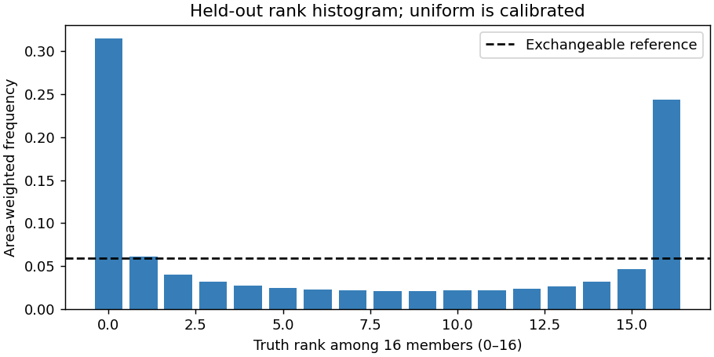
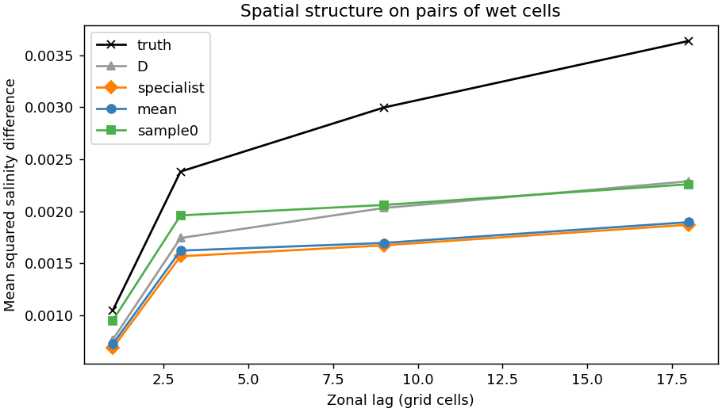
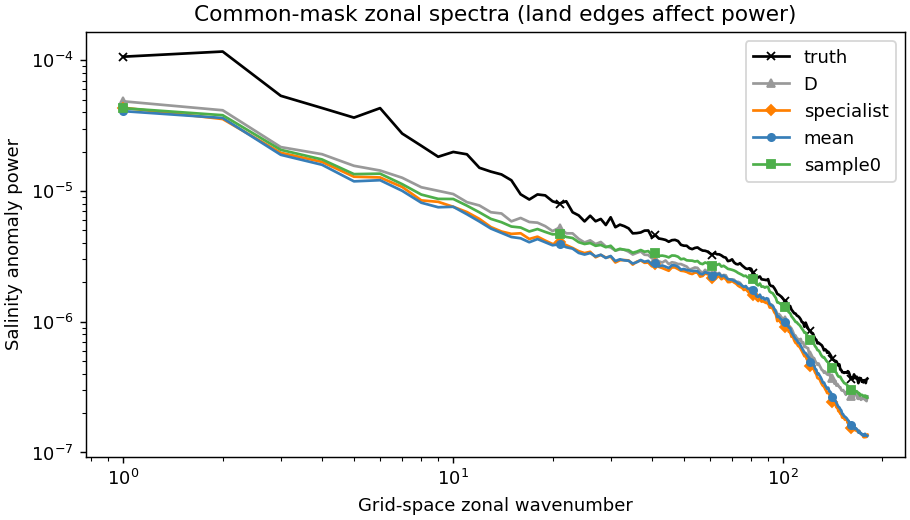
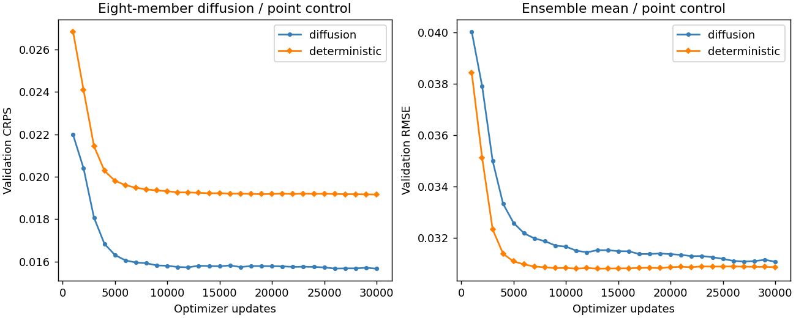

<!--
SPDX-FileCopyrightText: 2026 Samudra Authors

SPDX-License-Identifier: CC-BY-4.0
-->

# One-field diffusion initializer pilot

**Diffusion is inexpensive enough to investigate further and improves probabilistic scores, but this pilot is substantially overconfident.** Its ensemble mean improves held-out salinity RMSE by 1.5% over a matched deterministic residual network, while CRPS improves 17.7%. It does not beat the earlier salinity specialist on RMSE. Samples restore some small-scale variability, but still miss important broad anomalies.

Both training runs and both fresh-process evaluations completed without failures or restarts. Including qualification, total usage was **1.754 allocated GPU-hours**, below the 8–24 GPU-hour planning envelope. [Job accounting](artifacts/accounting.json).

These are current-time `so_9` (550 m salinity) reconstructions in OM4 one-degree, five-day data. This is not a full-state initializer, an observational evaluation, or a forecast experiment. See the [locked plan and launch record](../surface-initializer-diffusion-plan.md) and [previous initializer diagnostics](../surface-initializer-diagnostics-results/index.md).

## Held-out results

All rows use the same 99 origins from November 2014 through November 2022. Salinity errors are in the dataset's physical salinity units. Correlation is spatial anomaly correlation centered within each date, then averaged. CRPS is lower-is-better; for a point prediction it equals MAE.

| Prediction | RMSE | Anomaly correlation | CRPS |
| --- | ---: | ---: | ---: |
| Monthly climatology | 0.054875 | — | 0.035985 |
| Original D | 0.044992 | 0.591 | 0.031544 |
| Earlier salinity specialist | **0.037849** | **0.727** | 0.025243 |
| Matched deterministic residual control | 0.039007 | 0.705 | 0.025380 |
| Diffusion, 16-member ensemble | 0.038423 (ensemble mean) | 0.717 (ensemble mean) | **0.020896** |

Diffusion's mean RMSE improves 14.6% over D, but is 1.5% worse than the earlier specialist. Individual diffusion members have pooled RMSE **0.041319**: better than D, worse than the ensemble mean. The earlier specialist is a useful performance reference, not a compute- or architecture-matched ablation.

Paired calendar-year block bootstrap intervals (3,000 resamples, nine years):

| Diffusion improvement over | Mean RMSE reduction | CRPS reduction |
| --- | ---: | ---: |
| D | 14.60% [13.57%, 15.74%] | 33.76% [32.23%, 35.37%] |
| Matched deterministic control | 1.50% [0.96%, 1.99%] | 17.67% [16.94%, 18.17%] |
| Earlier specialist | −1.52% [−2.38%, −0.68%] | 17.22% [16.94%, 17.53%] |

These intervals describe variability across held-out calendar years in one simulation, not training-seed uncertainty. Both new arms use one seed. [Summary](artifacts/summary.csv), [paired comparisons](artifacts/paired.csv), [per-origin results](artifacts/per-origin.csv).

## Calibration is the main failure

Only **44.1%** of area-weighted truth values fall between the minimum and maximum of the 16 members. A calibrated ensemble of 16 independent, exchangeable, continuous members has an 88.2% reference for this interval. The interpolated empirical 5th–95th percentile interval covers only **36.4%**; it should not be compared naively with exactly 90% because of the small ensemble.

Ensemble spread divided by ensemble-mean RMSE is **0.396**, versus an idealized finite-member reference of 0.939 for the implemented population variance. The rank histogram makes the underdispersion visible. Bias and missing conditional structure can also drive extreme ranks; simply inflating spread need not solve the reconstruction problem.



Fair CRPS, correcting finite-member sampling bias under independent ensemble draws, is **0.020501**. The primary empirical CRPS result is therefore not caused by that finite-ensemble bias. Validation is also imperfect: its empirical percentile coverage is 47.6%, with mean RMSE 0.030821 versus 0.038423 held out. This is not exclusively a later-period calibration failure.

## What changed visually?

[The native-cell map gallery](maps.md) shows truth, ensemble mean, fixed members 0 and 1, deterministic control, errors and spread on six preselected dates. Each map cell occupies exactly 2 × 2 output pixels, with no interpolation and the same anomaly/error color limits as the earlier report. Members are not selected for visual quality.

The samples contain more fine-scale variation than the mean. For the first member, averaged over all 99 dates, the one-cell zonal structure function on pairs of wet cells is 0.000950, compared with 0.001047 for truth, 0.000724 for the ensemble mean, and 0.000766 for D. This is evidence of restored small-scale variance, not proof that each feature is correctly located.

Total anomaly RMS remains low: the mean has 67.1% of the truth's amplitude, and members average 72.6%, compared with 73.1% for D. In the November 2018 example, a sample has richer fine structure but still misses much of the broad North Pacific fresh anomaly. Diffusion has not resolved the original visual concern.





The spectra use the same zero-filled ocean mask and grid-space longitude transform for every field; land edges affect them. They are comparative diagnostics, not isotropic physical ocean spectra. [Spatial statistics](artifacts/spatial-covariance.csv), [per-origin spatial statistics](artifacts/spatial-covariance-per-origin.csv.gz), [spectra](artifacts/zonal-spectrum.csv).

## Training and provenance

The new 3,523,009-parameter U-Net reconstructs a single current-time field, conditioning on the same 90-day surface/forcing history as D, geographic/seasonal context, masks, D's frozen prediction and monthly climatology. The residual is divided by its exact training-only RMS: 0.0311724 in physical salinity units. The deterministic control has the same architecture, conditions, sampled examples and update budget, with a pointwise MSE residual objective. D and the dynamics remain frozen.

Both arms completed 30,000 updates, effective batch eight (about 85.6 passes' worth of sampled training windows). Both selected the final update using validation CRPS, with EMA weights; the diffusion selection used eight members and 16 Heun intervals, and final evaluation used 16 members and 32 intervals (63 denoiser calls per member). The deterministic control produces one field; generic runtime log messages retain the requested member/step settings, but its saved metric rows and arrays correctly record one member.

Both best checkpoints are at the update limit, so this pilot does not establish convergence. The learning curves show the validation path, not held-out model selection.



Runtime producer: [`3c8ac4634`](https://github.com/m2lines/Samudra/commit/3c8ac4634a16e2f605a4311d74e76e44bb4ff08d). [Diffusion protocol](artifacts/raw/diffusion/diffusion-protocol.json), [control protocol](artifacts/raw/deterministic/diffusion-protocol.json). Training jobs: 18274504 and 18274507. Evaluation jobs: 18274505 and 18274509. Qualification: 18273094. All ran on RTX PRO 6000 Blackwell GPUs, one per job, with two CPUs and 24 GiB requested host memory.

Full raw outputs and selected checkpoints remain at `/scratch/jr7309/runs/2026-09-22-initializer-diffusion/{diffusion,deterministic}`. All **248 collected artifacts (492,277,659 bytes)** were checksum-verified against the DTN source manifest. Saved fields reproduce the reported scores and share the exact targets, climatology and masks with the earlier specialist. [Audit](artifacts/audit.json).

Git contains all-origin metric tables, rank histograms, spatial summaries, selected-date map arrays and all 16 members for the six gallery dates. Large NPZ inputs are losslessly gzip-packed in 240 KiB parts; `read_bytes` reconstructs them. The published map archives are six-date subsets, and `progress.jsonl` contains only selection/scale events needed for plotting. The complete 99-origin member archives, full logs and weights remain on Torch; they are required to repeat the complete field audit.

Reproduce the complete audit from a collected full raw directory, then generate the figures:

```bash
uv run python scripts/analyze_initializer_diffusion.py \
  --raw outputs/initializer-diffusion/raw \
  --output outputs/initializer-diffusion/analysis
uv run python scripts/plot_initializer_diffusion.py \
  --raw outputs/initializer-diffusion/raw \
  --analysis outputs/initializer-diffusion/analysis \
  --output outputs/initializer-diffusion/figures
```

The figure command also accepts the published `artifacts/raw` and `artifacts` directories: its six selected dates and aggregated spatial summaries are sufficient for the gallery and plots.

## Suggested next wave — not submitted

1. Fit a simple spread calibration on validation only, then assess calibration and CRPS on future data. This distinguishes a scale error from missing spatial modes; do not mistake it for a fix to mean bias.
2. Test the residual-training mismatch: frozen D was fitted on these same training dates. Compare direct/climatology-residual conditional diffusion or a temporally cross-fitted D residual construction, with a matched deterministic control.
3. Extend training and repeat a seed before scaling to joint T/S/U/V. Both arms selected the maximum update count, and one field cannot establish cross-variable consistency or downstream forecast benefit.

The pilot supports further investigation of diffusion as a probabilistic initializer. It does not yet support replacing the full initializer or treating the generated uncertainty as calibrated.
