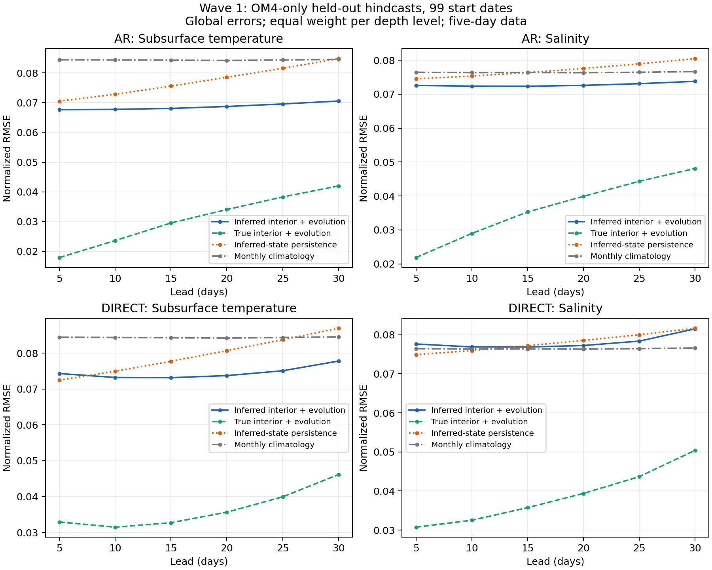
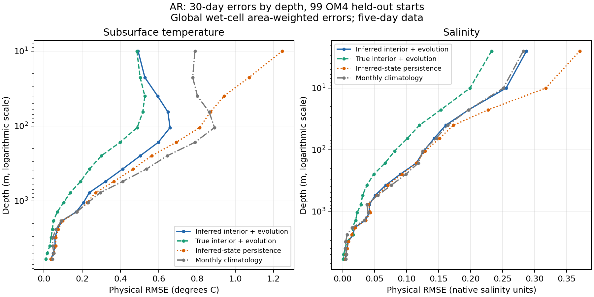

<!--
SPDX-FileCopyrightText: 2026 Samudra Authors

SPDX-License-Identifier: CC-BY-4.0
-->

# Surface-initialized ocean prediction — wave 1 results

Completed September 20, 2026. **Use AR as the working baseline for the next experiments.** In this OM4-only feasibility wave, it outperformed the direct model across the tested leads and improved on persistence and sampled seasonal climatology for both temperature and salinity. The large gap between inferred and true initial interiors suggests that initialization and adaptation deserve the next experiments. This is evidence for the two-stage approach in model data; it does not establish observational forecasting skill or a benefit from adding simulations to observational training.

Both forecast evaluations and the final CPU report completed successfully. Total allocated GPU usage was **176.086 / 576 GPU-hours**, including failed jobs, qualifications and finalizers. Peak concurrent use by this wave was **eight GPUs**. All 41 recorded jobs are terminal, the redundant CPU monitor is cancelled, and no next wave has been submitted.

## What was evaluated

Global one-degree OM4, five-day cadence, 99 approximately monthly forecast starts spanning the held-out 2014–2022 period. Each prediction uses six SSH/SST history frames spanning 25 days. A ConvNeXt U-Net initializer reconstructs two full ocean states; the evolution model predicts temperature, salinity, horizontal velocities at 19 levels, and SSH. Surface values at initialization are copied from the known input. The two options share backbone widths 128/192/256/384:

- **AR:** five-day steps, trained with a one/three/six-step curriculum, then joint initializer/evolution tuning.
- **Direct:** one call per requested 5–30-day lead, conditioned on ordered forcing through that lead, then joint tuning.

All targets in this wave, including joint training, are OM4 fields. Forcing is OM4 tauuo/tauvo/hfds, not ERA5 surface states. There is no post-initialization surface assimilation. Train windows stay in 1975-01-03–2013-10-04; validation in 2013-10-05–2014-10-05; held-out windows in 2014-10-10–2022-12-24. Existing normalization files were used as approved. The 99 starts are separate short hindcasts, not a continuous eight-year rollout.

Each final CSV has **5,544 unique finite rows**: four initialization/baseline modes × three regions × six leads × 77 channels. Target second moments and climatology metrics match exactly between the two evaluations. Errors are wet-cell cosine-latitude-weighted, averaged over origins; the normalized variable summaries below take the square root of the mean per-level normalized MSE. Temperature excludes SST; salinity includes all 19 levels. These are not volume-weighted errors.

## Main results

Global normalized RMSE; lower is better. Persistence holds each model's own inferred initial state fixed, so the interior persistence baselines differ after AR joint tuning. Seasonal climatology and evaluation targets are identical across models.

| Model / lead | Subsurface T | Salinity | T RMSE reduction vs persistence | S reduction vs persistence | T reduction vs climatology | S reduction vs climatology |
| --- | ---: | ---: | ---: | ---: | ---: | ---: |
| AR, 5 days | 0.06765 | 0.07256 | 4.1% | 2.6% | 19.9% | 5.1% |
| Direct, 5 days | 0.07431 | 0.07764 | −2.5% | −3.6% | 12.0% | −1.6% |
| AR, 15 days | 0.06807 | 0.07232 | 9.9% | 5.3% | 19.2% | 5.3% |
| Direct, 15 days | 0.07315 | 0.07686 | 5.9% | 0.4% | 13.2% | −0.7% |
| AR, 30 days | 0.07055 | 0.07377 | 16.8% | 8.3% | 16.5% | 3.7% |
| Direct, 30 days | 0.07779 | 0.08152 | 10.5% | 0.2% | 8.0% | −6.4% |

At 30 days, AR has 9.3% lower T RMSE and 9.5% lower S RMSE than Direct. Its combined equal-variable T/S MSE improvement over its own persistence is 23.7%; Direct's is 10.7%. The percentages in the table are RMSE reductions, not MSE reductions.

The AR improvement is geographically broad: its 30-day T/S RMSE reductions over persistence are 16.7%/9.3% in the tropics (within 20 degrees latitude) and 16.7%/7.7% outside them. Against climatology they are 13.9%/3.8% and 17.6%/3.8%, respectively. At individual depths, AR beats persistence at 18/18 global subsurface T levels and 17/19 S levels. It beats climatology at 14/18 T and 8/19 S levels: the aggregate salinity improvement is not uniform with depth. Direct beats persistence at 16/18 T but only 3/19 S levels. See [regional comparisons](metrics-summary.md) and [per-depth values](depth_skill.csv.gz).

## Initialization and joint adaptation

With the same final AR evolution model, replacing inferred interiors with true OM4 interiors reduces 30-day normalized T RMSE from **0.07055 to 0.04200**, and S from **0.07377 to 0.04811**: reductions of 40.5% and 34.8%. At five days the reductions are 73.5% and 69.9%. This is an intervention on initialization, not a guarantee that these gains are recoverable from surface measurements. Surface histories may not contain enough information to determine every interior feature.

The shared initializer's validation T/S RMSE was 0.06347/0.06712 versus sampled climatology's 0.07746/0.07004. Those initializer numbers are validation diagnostics, not additional held-out results. The original shared initializer starts both models; AR's selected joint checkpoint then changes its initializer, whereas Direct's selected checkpoint does not.

AR joint validation improved from **0.096533 to 0.092951** at step **4,621**, then worsened for seven consecutive checks. Direct joint tuning never beat its starting value **0.117950**. Thus the evaluated AR uses an adapted initializer/evolution pair; the evaluated Direct uses its pre-joint starting model. Joint training did not automatically solve the initialization gap.

Checkpoint selection used the implemented equal-group normalized validation MSE over T, S, u, v and SSH, averaged over six leads and 12 validation origins. It was **not a T/S-only selection metric**. The joint training loss additionally included 0.1 times interior reconstruction loss. Future observation-focused selection should explicitly prioritize interior T/S while retaining velocity diagnostics and simulation supervision.

## Surface predictions and velocities

These are five-day OM4 outputs, not the proposed daily observational metrics.

| Forecast at 30 days | SSH normalized RMSE | SST normalized RMSE | Velocity physical second-moment ratio to OM4 |
| --- | ---: | ---: | ---: |
| AR, inferred interior | 0.04615 | 0.04407 | 0.911 |
| Direct, inferred interior | 0.05662 | 0.05694 | 0.699 |
| Persistence | 0.07357 | 0.10028 | — |
| Seasonal climatology | 0.08275 | 0.06845 | — |

AR already slightly beats surface persistence at five days (SSH 0.03104 vs 0.03757; SST 0.02457 vs 0.02536). Direct does not. The velocity statistic sums the area-averaged physical u/v second moments across equal-weighted levels; the corresponding RMS amplitude ratios are 0.955 and 0.836. It includes mean flow. It is not eddy kinetic energy, a measure of balanced circulation, or evidence of correct spectra/transport. Those require field-level diagnostics. Detailed values are in [velocity_moments.csv](velocity_moments.csv).

## Compute, stopping and recovery

| Component, including phase finalizers/evaluation | Allocated GPU-hours |
| --- | ---: |
| Shared initializer production lineage | 9.194 |
| AR | 138.257 |
| Direct | 26.742 |
| Other smoke, qualification and recovery attempts | 1.893 |
| **Total** | **176.086** |

AR production pretraining ran 31h25m and joint tuning 2h58m before early stopping; Direct ran 4h23m and 2h11m. Best pretraining steps were AR 1,260,598 and Direct 133,755. Both were stopped on validation, not on held-out results. AR exercised every curriculum stage, including more than 12 hours at the full six-step horizon. Selection restored best checkpoints; finalization took one additional update from each last checkpoint before selecting best and evaluating. The last checkpoint is therefore not necessarily the evaluated model.

**This is not an equal-compute architecture comparison.** AR received about 5.2 times Direct's production GPU-hours, and the selected checkpoints occur much earlier than some stopping times. One seed was run. The 99-origin CSVs contain aggregate errors, not per-origin errors, so they cannot support a bootstrap confidence interval. Monthly climatology is fitted from sampled training origins and is a modest baseline; it is not an optimized surface-to-interior statistical estimator.

The initial loader path was GPU-starved. After an administrator cancelled the first initializer, prepared float32 frame caching was added on top of the Rust loader, with exact native-reader equivalence checks. A one-GPU/batch-four cache attempt failed with an unresolved CUDA illegal-memory-access error and supplied no accepted checkpoint. Accepted production used two GPUs for the initializer and four per evolution model, batch two per GPU. AR subsequently sustained roughly 97–98% utilization with about 73 GiB peak allocated GPU memory and 4.3–4.6 GiB host memory on rank zero. Direct's cached qualification completed with 83–94% utilization. NCCL P2P had to be disabled during qualification. All attempts are charged above.

There was a short shared-quota wait between AR pretraining and joint training. It cleared without moving to another allocation. The passive monitor job **17959017** remained cancelled. The final evaluations **18071751 (AR)** and **18013772 (Direct)** and CPU report **18071752** all exited successfully. [Accounting](accounting.csv) and the [completion audit](completion-audit.json) include the 41 terminal job records and eight-GPU concurrency check.

## Suggested next wave — approval required

I suggest a small **AR adaptation wave**, using the saved best pretraining model and original shared initializer so we do not repeat expensive evolution pretraining. Keep the same training data and evaluation definition while the new data are prepared. Run four arms with a common lower learning rate (1e-5) and the same reconstruction term where the initializer is trainable:

| Arm | Trainable component | Question |
| --- | --- | --- |
| A | Initializer only; evolution weights and batch-normalization statistics frozen | Can forecast-supervised initialization close part of the true/inferred gap without changing ocean dynamics? |
| B | Evolution only; initializer weights and batch-normalization statistics frozen | Is adaptation to initializer error sufficient? |
| C | Both | Does a lower learning rate retain the early joint gain instead of erasing it? |
| D | Both, with the same weights but a different data-order seed | Is the adaptation gain reproducible rather than one optimizer trajectory? |

The existing untuned pair and selected wave-1 AR checkpoint are fixed references. A/B/C isolate which component needs adaptation at the same learning rate; D checks adaptation sensitivity, not independent pretraining reproducibility. Make T/S validation errors the primary selection score, retain full-variable training losses and U/V monitoring, save per-origin validation/evaluation metrics, and log reconstruction and forecast errors separately. Fix the comparisons before running them; do not repeatedly tune against the already viewed 2014–2022 outcomes. Independent pretraining-seed replication and a fresh observational test remain needed for stronger claims.

A proposed ceiling is **80 GPU-hours**: four arms × four GPUs × four hours = 64, plus 16 for evaluation and recovery; at most two arms concurrently if the shared quota permits. This is a proposal, not an allocation or submission. Stop arms when validation regresses, and carry forward the best checkpoints. These few-hour runs target the early adaptation behavior observed here; they do not exhaust the broader architecture/data search.

Before the observational wave, preserve the original scientific task: initialize from real SSH/SST, force with ERA5/appropriate surface states rather than target SSH/SST, predict daily SSH/SST, and evaluate unseen interior observations such as withheld Argo profiles. Keep simulation u/v prediction during observation tuning, potentially with mixed simulation examples. ERA5-compatible model forcing, daily targets, interior observation evaluation and LLC/other prepared data are still dependencies. This wave has not tested those, higher-resolution data benefit, long continuous rollouts, or the central comparison of observational-only training against added simulation data.

## Reproducibility and artifacts

Producer commit: [`fe0f314ebb562f5b658e49fedea9c5d27062d245`](https://github.com/m2lines/Samudra/commit/fe0f314ebb562f5b658e49fedea9c5d27062d245). The experiment branch locally merged Rust loader commit `9cd36b1bdcf4921fb027494afa4157e217818ccd` before execution. The documentation tip was `15f4975a`; producer code is pinned independently of that tip.

- [Runner and checkpoint selection](https://github.com/m2lines/Samudra/blob/fe0f314ebb562f5b658e49fedea9c5d27062d245/src/samudra/experiments/surface_wave.py), [models and losses](https://github.com/m2lines/Samudra/blob/fe0f314ebb562f5b658e49fedea9c5d27062d245/src/samudra/experiments/surface_state.py), [cache implementation](https://github.com/m2lines/Samudra/blob/fe0f314ebb562f5b658e49fedea9c5d27062d245/src/samudra/experiments/frame_cache.py).
- Raw metrics: [AR](ar/heldout_metrics.csv.gz), [Direct](direct/heldout_metrics.csv.gz), [initializer validation](initializer/initializer_metrics.csv). Summaries: [grouped metrics](grouped_metrics.csv), [depth skill](depth_skill.csv.gz), [velocity moments](velocity_moments.csv).
- Each model directory contains its exact arguments, split/data configuration, producer/job ID, checkpoint SHA-256 fingerprints, and validation/event summaries. All stopping decisions and the complete job graph are included. [collection.json](collection.json) records source hashes for 26 collected files.
- From the repository root, reproduce summaries and figures with `uv run python docs/experiments/surface-wave1-results/analyze.py` and `uv run python docs/experiments/surface-wave1-results/depth_diagnostics.py`; verify source hashes, full evaluation coverage and accounting with `uv run python docs/experiments/surface-wave1-results/audit_final.py`. The helpers transparently read the compressed raw CSVs. `depth_diagnostics.py` regenerates the uncompressed `depth_skill.csv`; its checked-in `.gz` contains the same CSV bytes. These consume the collected files and submit no jobs. Ten focused model/cache tests passed for the producer; final analysis additionally checked finite coverage, matched targets/baselines, hashes and accounting.
- Torch run root: `/scratch/jr7309/runs/2026-09-18-surface-wave1`; data: `/scratch/jr7309/data/om4_onedeg_v3`; checked-in report and assets: `docs/experiments/surface-wave1-results/`. Checkpoints remain on Torch and are represented here by SHA-256 fingerprints. The larger CSVs are gzip-compressed without altering their decompressed bytes; `collection.json` records hashes of the original source bytes. No checkpoints or W&B artifacts are bundled.
- Selected checkpoints on Torch: `initializer/initializer-best.pt`, `ar/joint-best.pt`, `direct/joint-best.pt`. Keep the manifests and checkpoint hashes with any subsequent use.

The next wave is awaiting review; no further experiment jobs are scheduled by this report.
