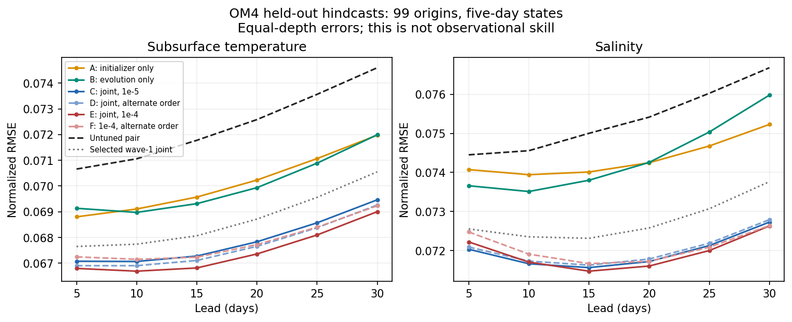
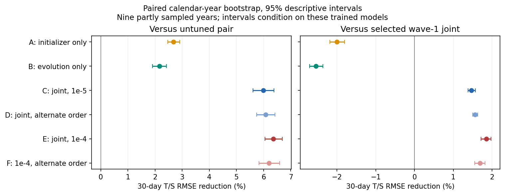
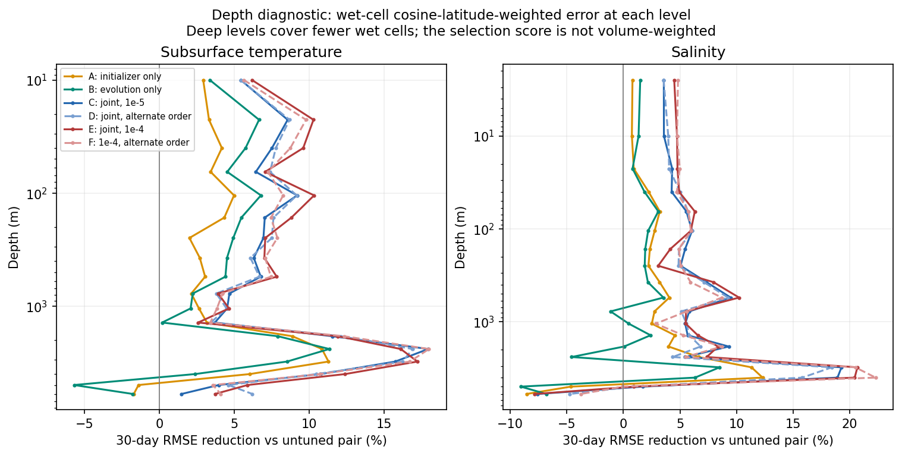
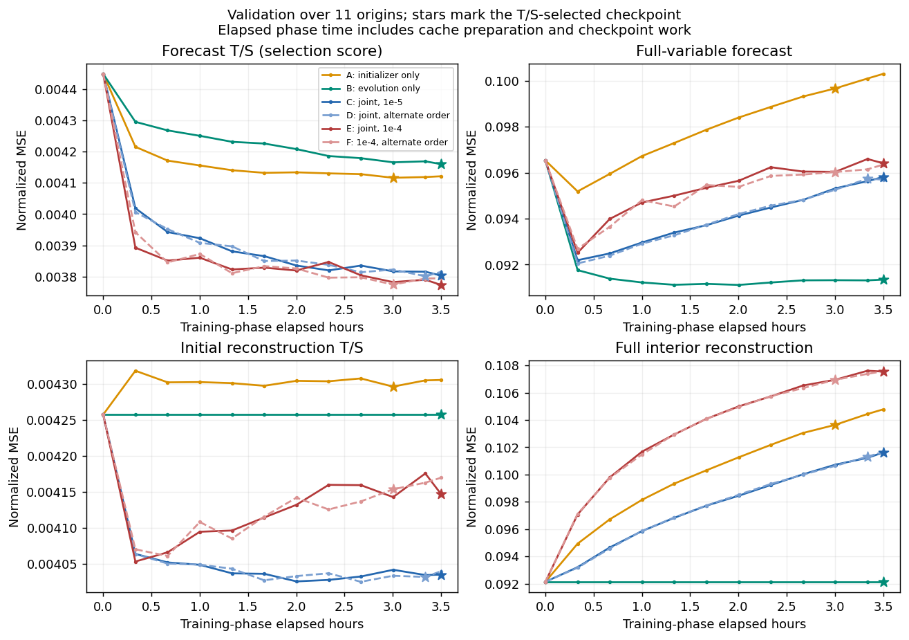

<!--
SPDX-FileCopyrightText: 2026 Samudra Authors

SPDX-License-Identifier: CC-BY-4.0
-->

# Surface-initialized ocean prediction: wave 2

Completed September 21, 2026. **Carry joint adaptation forward as the working baseline; this study does not support requiring a lower learning rate.** All six runs, their final evaluations and the CPU checkpoint audit completed. Total allocation was **86.463 GPU-hours**, including qualification and failed attempts, with a peak of **eight GPUs**. The study finished within the three-day target; no further wave has been submitted.

Joint adaptation of the initializer and evolution model improves 30-day interior prediction more than adapting either component alone. At learning rate 1e-5, two adaptation data orders reduce combined subsurface temperature/salinity RMSE by about **6% relative to the untuned pair**, and **1.5% relative to the selected wave-1 joint model**. They close about **14% of the error gap to true-interior initialization**. Most of that initialization gap remains. Matched 1e-4 controls achieve similar or slightly better day-30 error, with regional and short-lead tradeoffs.

This is an OM4 feasibility study, using the same model-world task as [wave 1](../surface-wave1-results/index.md). It does not establish improvement on real ocean observations or the benefit of adding simulation data to observational training. The [pre-registered study plan](../surface-wave2-plan.md) fixes the comparisons and protocol.

## Comparisons and answers

All arms begin with the same wave-1 AR evolution pretraining checkpoint and the original shared initializer. The frozen components in A/B retain both weights and batch-normalization buffers. Gradients pass through the frozen evolution model in A.

| Arm | Trainable components | Learning rate | Data-order seed | Purpose |
| --- | --- | --- | --- | --- |
| A | Initializer | 1e-5 | 1729 | Forecast-supervised initialization with fixed dynamics |
| B | Evolution | 1e-5 | 1729 | Adapt dynamics to imperfect inferred interiors |
| C | Both | 1e-5 | 1729 | Joint adaptation |
| D | Both | 1e-5 | 1730 | Repeat joint adaptation with another data order |
| E | Both | 1e-4 | 1729 | Matched learning-rate control for C |
| F | Both | 1e-4 | 1730 | Matched learning-rate control for D |

E/F were added to isolate learning rate from the changed checkpoint-selection rule. E was specified before any full wave-2 held-out result; F was specified before either higher-rate held-out result. Neither repeats independent evolution or initializer pretraining.

**Can forecast-supervised initialization help while dynamics stay fixed?** Yes, modestly: A lowers day-30 T/S RMSE by 2.68% relative to the untuned pair. It closes 6.1% of the fixed true-initialization gap. It does not beat the selected wave-1 joint model. A's selected initial-state reconstruction T/S validation MSE slightly worsens while forecast error improves; optimizing reconstruction and optimizing useful forecast initialization are different objectives.

**Is adaptation of the evolution model alone sufficient?** B improves on the untuned pair by 2.16%, but trails both joint arms and the selected wave-1 joint model. Adapting to initialization error helps, but does not account for the entire joint gain under this protocol.

**Does joint adaptation retain a useful gain?** C/D improve day-30 T/S RMSE by 5.99%/6.08% over the untuned pair, and 1.47%/1.56% over the selected wave-1 joint model. C beats A by 3.40% and B by 3.91%. Full-variable forecast and reconstruction scores have different trajectories, so the interior-selection improvement should not be read as uniform improvement in every output.

**Is this sensitive to data order?** C/D's final combined errors differ by 0.0945%, with closely matched gains. This is encouraging evidence across two adaptation orders conditional on the same pretrained model. It does not measure sensitivity to independently pretrained weights.

**Is the lower learning rate necessary?** No evidence here requires it: the matched 1e-4 controls E/F reduce day-30 T/S RMSE by 6.35%/6.20% over the untuned pair and 1.85%/1.69% over wave 1. Relative to the matched lower-rate runs, E improves on C by **0.387%** (95% descriptive interval [0.202%, 0.565%]); F improves on D by **0.129%** (interval [−0.029%, 0.276%]). These small differences do not establish a robust preference for the higher rate. F is worse than D at short global leads (0.52% worse at five days), and at day 30 its tropical gain of 0.86% accompanies 0.22% worse extratropical error. E/F's combined global day-30 errors differ by 0.16%.

The defensible result is that joint adaptation with interior-aware checkpoint selection works at both tested rates. Wave 1's early full-variable regression did not imply that the lower rate was necessary. We have not isolated the causal effect of changing checkpoint selection itself. E has the lowest validation score and is a reasonable representative checkpoint to carry forward; do not choose a model separately for each held-out region or lead.

## Held-out interior skill

Global day-30 normalized RMSE, lower is better. Combined T/S is the square root of the equally weighted T and S normalized MSEs. Temperature excludes the surface level; salinity includes all 19 levels. Each variable weights its levels equally. Percentages are RMSE reductions, not MSE reductions.

| Model | Subsurface T | Salinity | Combined T/S | T/S reduction vs untuned pair | Reduction vs wave-1 joint |
| --- | ---: | ---: | ---: | ---: | ---: |
| Untuned pair | 0.07460 | 0.07668 | 0.075645 | — | — |
| Selected wave-1 joint | 0.07055 | 0.07377 | 0.072176 | 4.59% | — |
| A: initializer | 0.07198 | 0.07523 | 0.073620 | 2.68% | −2.00% |
| B: evolution | 0.07199 | 0.07598 | 0.074012 | 2.16% | −2.54% |
| C: joint, seed 1729 | 0.06946 | 0.07273 | 0.071116 | 5.99% | 1.47% |
| D: joint, seed 1730 | 0.06926 | 0.07279 | 0.071049 | 6.08% | 1.56% |
| E: joint, 1e-4, seed 1729 | 0.06900 | 0.07263 | 0.070841 | 6.35% | 1.85% |
| F: joint, 1e-4, seed 1730 | 0.06923 | 0.07264 | 0.070957 | 6.20% | 1.69% |



[All regions, leads and variables](analysis/grouped_metrics.csv.gz) and [paired comparisons](analysis/paired_comparisons.csv.gz) retain the full results, including unfavorable comparisons.



The paired calendar-year bootstrap gives 95% descriptive intervals of [5.61%, 6.38%] and [5.74%, 6.42%] for C/D's reduction versus the untuned pair. Versus selected wave-1 joint, the intervals are [1.38%, 1.57%] and [1.50%, 1.63%]. These are conditional intervals over nine partly sampled calendar years, not confidence in generalization across model training seeds or future observational datasets. All comparisons share origins and targets. There is no multiple-comparison correction.

The true-interior reference with **fixed pretrained dynamics** has day-30 T/S RMSE 0.042242. Relative to the untuned pair's 0.075645, C/D close 13.56%/13.76% of that RMSE gap; E/F close 14.38%/14.04%. We use A's true-initialization evaluation to hold dynamics fixed: comparing only each adapted model's inferred and true modes could make the gap appear smaller by degrading true-initialized dynamics. True interiors are unavailable at deployment, and this intervention does not prove the missing information can be recovered from surfaces.

All four joint arms improve day-30 temperature error over the untuned pair at all 18 subsurface levels. C/D/E improve salinity at 18 of 19 levels; F improves 17 of 19. The exceptions are the deepest levels (6,000 m for C/D/E; 5,000–6,000 m for F), which cover relatively few wet cells. Aggregate skill is not uniform improvement with depth.



## Surface and velocity diagnostics

These are five-day OM4 predictions. The SST proxy is OM4 potential temperature at 2.5 m, rather than satellite SST. Physical units are read from the prepared store: SSH in metres and temperature in degrees Celsius.

| Day-30 model | SSH RMSE (m) | SST proxy RMSE (°C) | U/V normalized RMSE | Velocity second-moment ratio |
| --- | ---: | ---: | ---: | ---: |
| Untuned pair | 0.03243 | 0.5252 | 0.5446 | 0.919 |
| Selected wave-1 joint | 0.03142 | 0.5129 | 0.5287 | 0.911 |
| A | 0.03189 | 0.5134 | 0.5474 | 0.913 |
| B | 0.03104 | 0.5165 | 0.5255 | 0.906 |
| C | 0.03116 | 0.5029 | 0.5361 | 0.909 |
| D | 0.03119 | 0.5044 | 0.5359 | 0.907 |
| E | 0.03161 | 0.5007 | 0.5340 | 0.910 |
| F | 0.03115 | 0.5096 | 0.5329 | 0.901 |

Joint adaptation improves these surface errors relative to the untuned pair. Its velocity error remains worse than the selected wave-1 model. The second-moment statistic sums physical u/v second moments over equally weighted depths, prediction divided by target; it includes mean flow. Ratios near 0.91 do not establish realistic circulation, directions, spectra or transport. Velocity supervision is retained throughout this study, but its realism still needs field-level diagnostics. [Diagnostic values](analysis/diagnostics.csv) include all leads and regions.

## Training, data and selection

The global one-degree OM4 prepared store on Torch is `/scratch/jr7309/data/om4_onedeg_v3`. Six SSH/SST frames span 25 days of history. A ConvNeXt U-Net initializer reconstructs two full states, with observed surface channels copied from the input; the AR evolution model advances six five-day transitions. Both use backbone widths 128/192/256/384. Predictions include T/S/u/v at 19 levels and SSH. Inputs after initialization are OM4 tauuo/tauvo/hfds at interval starts; there is no future SSH/SST assimilation.

Training windows lie in 1975-01-03–2013-10-04, validation in 2013-10-05–2014-10-05, and held-out windows in 2014-10-10–2022-12-24. Existing normalization files are used as authorized. There are 99 approximately monthly held-out origins, evaluated independently at 5–30-day leads in global, tropical and extratropical regions. They are not one continuous eight-year rollout. Errors use wet-cell cosine-latitude weighting rather than exact cell areas or ocean volume.

Each job uses four GPUs, batch two per GPU, BF16, AdamW, weight decay 0.01 and gradient clipping 1. All six transitions are trained from the start. The objective retains full-variable forecast loss plus 0.1 reconstruction loss when the initializer is trainable; B has no reconstruction term. Each arm gets up to 3.5 training hours inside a four-hour allocation. Save/validation checks occur every 20 minutes, with six non-improving checks required for early stopping after at least one hour.

Checkpoints minimize mean normalized interior T/S MSE across six leads and **11 available forecast-validation origins (configured cap: 12)**. The starting model is eligible. Both full-variable forecast loss and reconstruction loss are logged separately. This selection rule differs from wave 1 and motivates the matched E/F controls. The few-hour cap does not establish converged optima or equal optimizer-update counts across treatments.



Every arm reached the 3.5-hour training cap; none stopped early. Selected validation T/S MSEs were A 0.0041161, B 0.0041598, C 0.0038030, D 0.0038008, E 0.0037731 and F 0.0037740, from a common 0.0044487 start. Best checkpoints are restored before final evaluation. A/D/F selected earlier checkpoints; B/C/E selected their final checkpoint. Their last training steps were 69,341 / 59,218 / 52,967 / 52,896 / 53,741 / 53,538. [Training summaries](analysis/training_summary.csv) and the raw validation logs distinguish training progress, selected scores and final evaluation.

## Execution and reproducibility

| Component | Slurm jobs | Allocated GPU-hours |
| --- | --- | ---: |
| Failed/cancelled qualification attempt 1 | 18079867, 18079868, 18079869 | 0.651 |
| Successful qualification attempt 2 | 18096965, 18096966, 18096967 | 1.062 |
| A / B / C / D | 18097624 / 18097625 / 18097626 / 18097627 | 56.502 |
| E / F | 18097633 / 18160437 | 28.248 |
| Container restoration and checkpoint audit, CPU only | 18094385, 18160463 | 0 |
| **Total** | **14 terminal jobs** | **86.463** |

[Accounting](accounting.csv), the [completion audit](completion-audit.json) and [original UTC Slurm output](raw/final-accounting.csv) include every attempt. Allocated GPU time includes initialization, validation and evaluation overhead. The initial four-arm envelope was 80 GPU-hours; the two authorized controls each added at most 16. The actual total is below the resulting 112-hour envelope. CPU-only jobs used 29 and 25 wall seconds respectively; login-node preparation is outside GPU accounting. All experiment allocations ended by September 21 08:29:35 UTC, before the September 23 16:51:29 UTC target.

The first qualification attempt failed before full evaluation. A scratch write then independently confirmed `Disk quota exceeded`; incomplete exception logs prevent attributing the exact training failures with certainty. After the user removed Apptainer caches, the SIF and code overlay were restored. A 10-GiB write/fsync passed after restoration; `myquota` showed 4.52 TB of 5 TB used, about 480 GB free. Probe files were removed. Original input checkpoint hashes still matched. Fresh qualification passed all three gradient paths before production. Persistent rank-local exception logs were added; accepted production emitted no exceptions.

F's first submission was rejected because completed dependency handles had expired from Slurm's active table. The launcher now verifies accounting, omits already-satisfied dependencies and rejects failed or missing prerequisites. That rejected submission allocated no GPUs. E/F sustained roughly 96% GPU utilization during training; the later evaluation phase lowers end-of-job utilization averages. No low-utilization cancellation occurred in this wave.

Training producer: [`b46eb446f153a967869bbfc7f9e93783de986579`](https://github.com/m2lines/Samudra/commit/b46eb446f153a967869bbfc7f9e93783de986579). The wave-1 Rust-loader merge is retained. The container and commit-named overlay are immutable for all accepted qualification and production jobs. Training uses eight native Rust readers per rank and an exact-verified prepared GPU frame cache, with eight allocated CPUs and 64 GiB RAM per four-GPU job. NCCL P2P is disabled as qualified in wave 1.

Each full evaluation contains 8,316 unique finite channel rows and 64,152 origin/variable rows across six modes: inferred, true, inferred-state persistence, climatology, fixed pretrained pair and fixed wave-1 joint pair. Audits check common starts, data and references, origin coverage, aggregate/origin agreement, validation selection and frozen state. Checkpoints stay on Torch, with fingerprints and the CPU checkpoint-loading audit in the report artifacts.

The CPU audit loaded all selected and last checkpoint files on Torch, recorded their SHA-256 values, matched selected scores to completion markers, and independently verified A/B frozen component fingerprints. The local [completion-audit script](audit_final.py) checks that recorded evidence and reconstructs compute/concurrency; it does not re-read the remote checkpoint bytes.

- Production sources: [runner](https://github.com/m2lines/Samudra/blob/b46eb446f153a967869bbfc7f9e93783de986579/src/samudra/experiments/surface_adaptation.py), [model definitions](https://github.com/m2lines/Samudra/blob/b46eb446f153a967869bbfc7f9e93783de986579/src/samudra/experiments/surface_state.py), and [GPU frame cache](https://github.com/m2lines/Samudra/blob/b46eb446f153a967869bbfc7f9e93783de986579/src/samudra/experiments/frame_cache.py).
- Per-arm manifests, initialization fingerprints, selected/last checkpoint audits, validation histories, utilization and origin-level errors are under [raw/A](raw/A/manifest.json), [B](raw/B/manifest.json), [C](raw/C/manifest.json), [D](raw/D/manifest.json), [E](raw/E/manifest.json) and [F](raw/F/manifest.json). The [analysis audit](analysis/analysis-audit.json) records exact starting states and coverage. [Collection metadata](raw/collection.json) names all remote roots and the collection boundary.
- Original result bytes are preserved in 166 files, using gzip and 240-KiB binary chunks where needed. [source.sha256](raw/source.sha256) hashes the original, decompressed files. For `.gz.part000`, `.part001`, etc., concatenate all parts before decompressing; these are pieces of one gzip stream. The analysis reader handles plain, gzip and chunked files automatically. Checkpoints and W&B artifacts are not bundled.
- Source data/normalization stores are identified by paths/configuration, but their complete contents are not archived here. Checkpoint fingerprints and exact result bytes establish the evaluated lineage; they do not independently freeze the entire source dataset.

From the repository root, reproduce and audit without submitting jobs:

```bash
uv run python scripts/pack_surface_adaptation_results.py \
  --verify-only --output docs/experiments/surface-wave2-results/raw
uv run python -m samudra.experiments.surface_adaptation_analysis \
  --input docs/experiments/surface-wave2-results/raw \
  --output /tmp/reproduced-wave2 --arms A B C D E F
uv run python scripts/plot_surface_adaptation.py \
  --raw docs/experiments/surface-wave2-results/raw \
  --analysis /tmp/reproduced-wave2 --output /tmp/reproduced-wave2-figures
uv run python docs/experiments/surface-wave2-results/audit_final.py
```

All five derived analysis files reproduced byte-for-byte from packed sources. The two larger checked-in tables have `.gz` suffixes; decompression recovers the uncompressed analysis output exactly. Twenty-six focused experiment, cache, analysis and submission tests passed. Figure SVGs accompany the PNGs for export. Final publication checks are recorded in the PR.

## Suggested next wave

The immediate scientific priority remains testing observationally initialized interior forecasts with added simulation data. This study supports joint adaptation as a working baseline; it does not answer how much OM4, higher resolution or LLC improve the real-observation task.

When the data are ready, compare observational-only training against simulation pretraining plus observational tuning under the same final evaluation. Initialize from real SSH/SST, use ERA5/appropriate surface-state forcing, evaluate future withheld interior observations such as Argo profiles, and retain daily SSH/SST evaluation. Continue predicting u/v during tuning, with mixed simulation examples if needed to retain that capability. Agree the observation sampling/masking and held-out protocol before model selection.

If observation preparation remains the bottleneck, a bounded initializer comparison against a strong surface/history-to-interior statistical baseline would clarify how much of the remaining gap reflects the learned initializer versus information available in these inputs. Keep the pretrained dynamics and final evaluation fixed, and select on validation. Field-level velocity diagnostics would also be more informative than further tuning a second-moment ratio.

Any further wave should have its own reviewed budget and task definition. This report does not submit it. Independent pretraining seeds and a fresh observational test are still needed for stronger scientific claims; the 2014–2022 OM4 outcomes have already been inspected in both waves.
