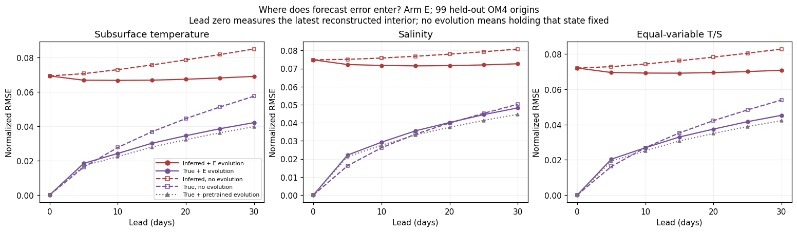
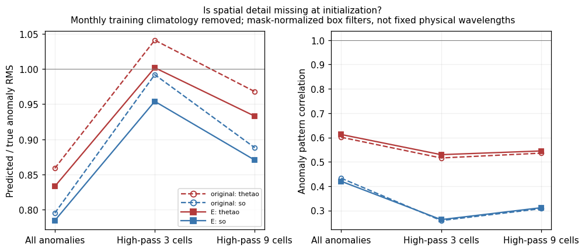
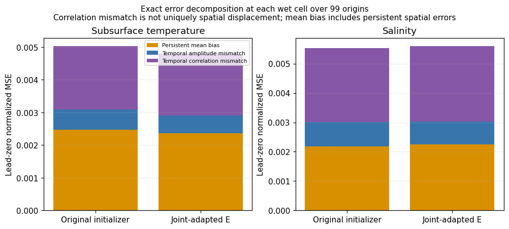
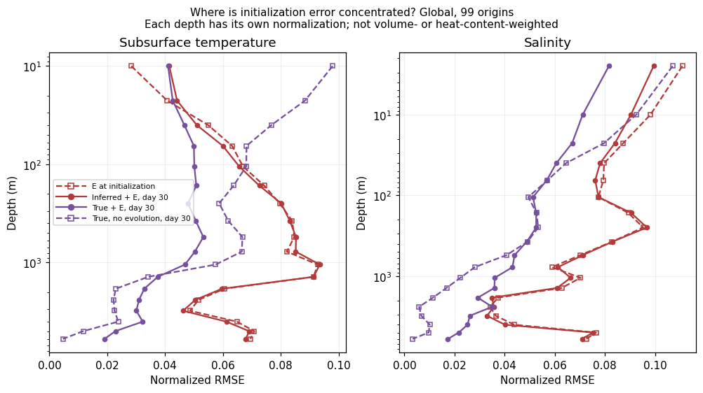
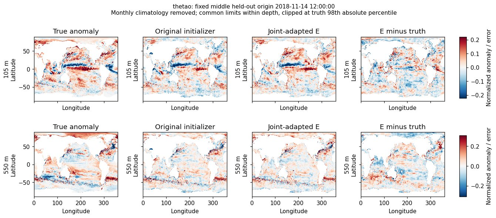
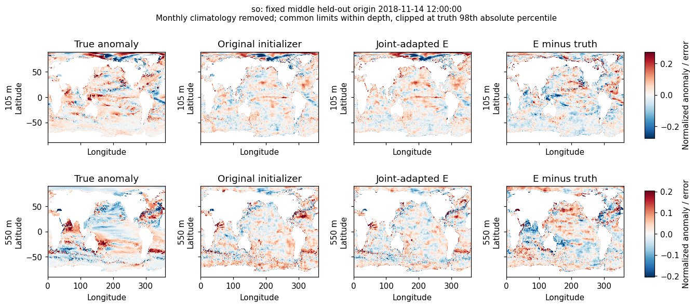

<!--
SPDX-FileCopyrightText: 2026 Samudra Authors

SPDX-License-Identifier: CC-BY-4.0
-->

# What is the initialization error?

Inference-only follow-up to the [wave-2 study](../index.md), September 21, 2026. **The evidence points to persistent bias and incorrectly reconstructed anomalies, rather than a simple shortage of small-scale variation.** Some amplitude is missing, but adding texture alone would not address these errors.

We evaluated the original shared initializer and joint-adapted arm E at the same 99 held-out origins. E was already the validation-selected representative; this analysis performs no training or new model selection. Lead zero uses the latest of the two reconstructed interior states. All results remain one-degree, five-day OM4 model-world diagnostics.

## True interiors and no evolution

Both controls matter. Holding an inferred interior fixed measures reconstruction plus subsequent ocean change. Holding a true interior fixed measures the ocean change without reconstruction error. True-initialized evolution uses both true history states and the same forcing as the inferred forecast.

Global, equal-variable subsurface T/S normalized RMSE:

| Initial state and treatment | Day 0 | Day 5 | Day 30 |
| --- | ---: | ---: | ---: |
| Inferred E, evolve with E | 0.07210 | 0.06956 | 0.07084 |
| Inferred E, hold fixed | 0.07210 | 0.07287 | 0.08289 |
| True interior, evolve with E | 0 | 0.02033 | 0.04527 |
| True interior, hold fixed | 0 | 0.01618 | 0.05397 |
| True interior, evolve with pretrained dynamics | 0 | 0.01921 | 0.04224 |



Several conclusions follow:

- **A large error is present immediately.** E's day-zero error is slightly larger than its day-30 forecast error. Its forecast curve does not describe errors gradually growing from an accurate initial interior.
- **Evolution helps imperfect initial states.** E improves on holding its inferred state fixed, and its first steps reduce error below the starting reconstruction error. This is consistent with correction/relaxation as well as time advancement; the aggregate errors do not identify the mechanism.
- **Evolution also has genuine forecast skill with true initialization at 30 days.** It reduces error by 16.1% versus true-state persistence. At five days it is 25.7% worse than true-state persistence. Dynamics error therefore matters, especially at short leads; true initialization is not a zero-error forecast oracle.
- **Adaptation trades some true-state fidelity for robustness to inferred states.** E's true-initialized day-30 error is worse than pretrained dynamics' 0.04224, while its inferred forecast is better. Compare these separately rather than interpreting a smaller true/inferred gap automatically as better initialization.

The true-initialized and inferred forecast errors are counterfactual comparisons, not additive error components. Their difference cannot be uniquely assigned to initialization independently of nonlinear evolution.

The original initializer's day-zero combined error is 0.07263; E improves that by only **0.73%**, despite a 6.35% day-30 forecast improvement over the untuned pair. Temperature reconstruction improves, while salinity reconstruction slightly worsens (0.07433 to 0.07481). The joint gain includes how the initializer and dynamics work together, not just a more accurate reconstructed state.

## Is it over-blurred?

We subtract the existing monthly training climatology, then compare predicted and true anomaly energy. For smaller spatial scales, subtract a wet-normalized 3×3 or 9×9 box average, wrapping longitude and truncating at latitude boundaries. These filters are defined in grid cells, not fixed physical wavelengths or a complete spectrum.

| Arm E at initialization | Temperature RMS ratio | Temperature pattern correlation | Salinity RMS ratio | Salinity pattern correlation |
| --- | ---: | ---: | ---: | ---: |
| All anomalies | 0.833 | 0.612 | 0.785 | 0.420 |
| High-pass, 3-cell box | 1.002 | 0.529 | 0.954 | 0.262 |
| High-pass, 9-cell box | 0.933 | 0.545 | 0.871 | 0.311 |

RMS ratios are prediction/truth. Correlation here is the normalized cross-moment of climatology-relative anomalies, using the same wet-cell weights; it is not independently demeaned Pearson correlation at each origin. Energy is averaged across normalized channels within each variable before taking ratios.



There is an overall amplitude deficit, particularly for salinity. But the finest of these diagnostics has nearly the correct amount of spatial variation and weak correspondence with truth. **Incorrect structures, offsets and possibly spurious texture are more consistent with these numbers than a pure smoothing explanation.** Equal small-scale energy does not prove correct features: blurred real structures can coexist with added noise. These two filters do not distinguish displaced features, aliased texture, missing vertical structure, or uncertainty caused by insufficient surface information.

For scale, deliberately blurring the *true full state* with a 3-cell box gives day-zero T/S RMSE 0.06020; a 9-cell box gives 0.14026, versus E's 0.07210. Those toy interventions have access to true interiors and are not deployable baselines. Their errors alone do not identify an equivalent blur kernel for the learned initializer. They also smooth the mean field, whereas the small-scale diagnostics above operate on anomalies.

## Persistent bias, amplitude and correspondence

At each wet cell and depth, compute temporal means, variances and covariance across the 99 origins. The exact population identity is

\[
\mathrm{MSE}=(\mu_p-\mu_t)^2+(\sigma_p-\sigma_t)^2+
2(\sigma_p\sigma_t-\mathrm{Cov}(p,t)).
\]

Average these components using the report's wet-cell cosine-latitude weights and equal depth weighting. For E:

| Share of initialization MSE | Temperature | Salinity |
| --- | ---: | ---: |
| Persistent mean error | 49.3% | 40.3% |
| Temporal amplitude mismatch | 11.4% | 13.8% |
| Temporal correlation mismatch | 39.4% | 45.8% |



“Persistent mean error” includes geographically structured mean errors over this held-out period, not merely a global offset. It could reflect imperfect learned climatology or a train/test distribution shift. “Correlation mismatch” includes timing and state-dependent errors; it is not uniquely spatial displacement. This decomposition includes the seasonal cycle, unlike the climatology-relative spatial diagnostic. **The amplitude percentage is not a percentage of error caused by blur.** These are descriptive held-out statistics; no correction fitted from held-out truth was applied to predictions.

## Depth and maps



Much of the inferred forecast's depth profile is already present at initialization. At depth, true-state persistence can remain very accurate while reconstruction is poor; at shallower levels, ocean evolution becomes more important. The combined score gives each normalized level equal weight, rather than weighting by ocean volume, heat content or a common physical error unit.

The following maps use the fixed middle held-out origin, **2018-11-14**, with 105 m and 550 m chosen before inspecting outcomes. They show the true anomaly, original initializer, E initializer and E error after subtracting monthly training climatology. These are illustrative maps, not representative-sample proof; the quantitative results above use all 99 origins. Limits are shared within each depth and clipped at the truth's 98th absolute percentile. Map previews are JPEG; the underlying normalized arrays are preserved losslessly in the packed NPZ artifact, including first/middle/last origins.





The displayed errors include broad basin structure as well as fine variation. Temperature error is larger outside the tropics in this aggregate (normalized initialization MSE 0.00535 versus 0.00393); salinity is similar across those regions (0.00565 versus 0.00554). Spatially resolved attribution and uncertainty remain open.

## Implications and reproducibility

A useful next initializer comparison would explicitly predict anomalies around a training-derived monthly climatology, with any bias calibration fitted outside the held-out period. Compare its reconstruction, forecast compatibility and anomaly correspondence against the present initializer. The short-lead true-state persistence result also motivates checking identity/residual behavior of the evolution model. Additional high-frequency power by itself is not the missing ingredient demonstrated here. No new training wave is submitted by this diagnostic.

- Inference producer: [commit `623264b4`](https://github.com/m2lines/Samudra/commit/623264b403b2b1e1f4a3e93caf02f8eafcdb7ad9), `scripts/diagnose_surface_initialization.py`, using the unchanged `b46eb446` model/data overlay. [Source provenance](raw/source.json), [manifest](raw/manifest.json), and [completion/checkpoint hashes](raw/COMPLETE.json) identify exact inputs. The selected checkpoint hash was verified before loading.
- [Persistence summaries](analysis/persistence_summary.csv), [temporal decomposition](analysis/temporal_summary.csv), [spatial diagnostics](analysis/spatial_summary.csv), and [analysis audit](analysis/diagnostic-audit.json). The 960,498 origin/channel/control rows cover six controls, three regions, 99 origins, seven leads including zero, and 77 channels. E's recomputed persistence RMSE matches the original wave-2 evaluation to within 8.1e-7 across checked variable/region/lead summaries.
- [Raw checksums](raw/source.sha256) cover the losslessly packed originals, including snapshots. `.gz.partNNN` files concatenate into one gzip stream. The shared artifact reader reconstructs both CSV and NPZ bytes. No model training, checkpoint selection, or data-split change occurred.
- [Slurm accounting](raw/accounting.csv): initial launcher failure **18195300**, one allocated GPU-second; successful evaluation **18195421**, 163 seconds on one GPU. Total **0.04556 GPU-hours**, separate from the six-arm study's 86.46333. The failure was a missing modules-init path; the corrected launcher reused the installed container runtime. The successful job used four CPUs/32 GiB allocated RAM, about 3.92 GiB peak host usage and 18.01 GiB peak GPU memory. W&B was explicitly disabled for this diagnostic.

Reproduce the analysis locally, without submitting jobs:

```bash
uv run python scripts/pack_surface_adaptation_results.py \
  --verify-only --output docs/experiments/surface-wave2-results/initialization/raw
uv run python scripts/report_surface_initialization.py \
  --raw docs/experiments/surface-wave2-results/initialization/raw \
  --output /tmp/reproduced-initialization
```

The four derived tables/audit reproduce byte-for-byte from packed originals. Tests verify exact bias/amplitude/covariance identities and wet-mask/longitude filtering; the existing artifact and paired-analysis tests also pass. Finite coverage, lead-zero truth equality, decomposition/reconstruction agreement and compatibility with the original persistence evaluation are checked in the analysis script.
