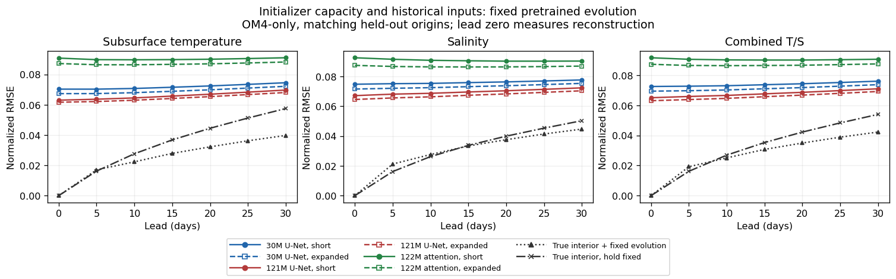
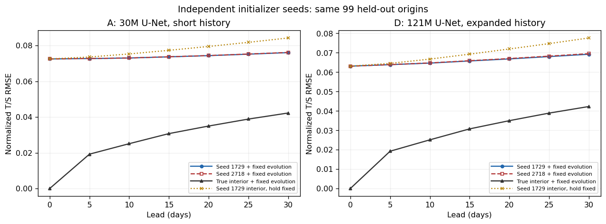
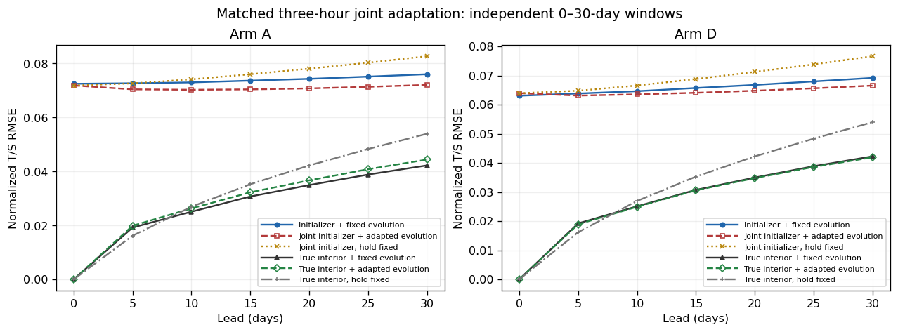
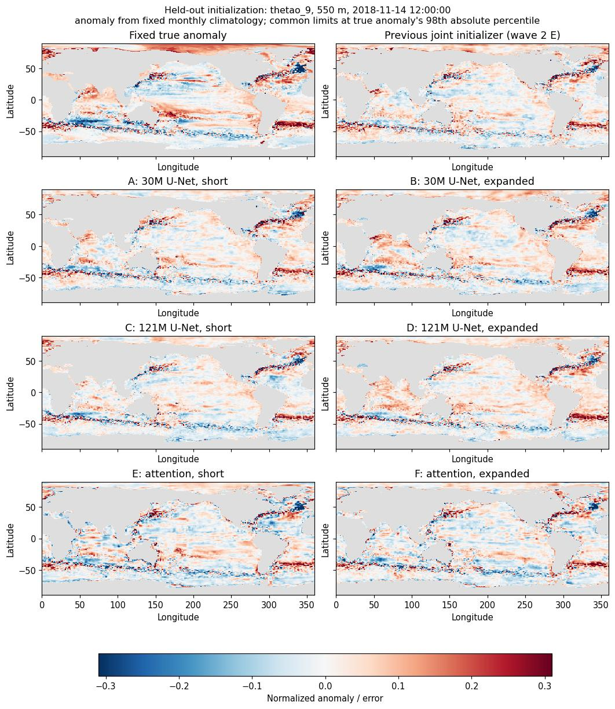
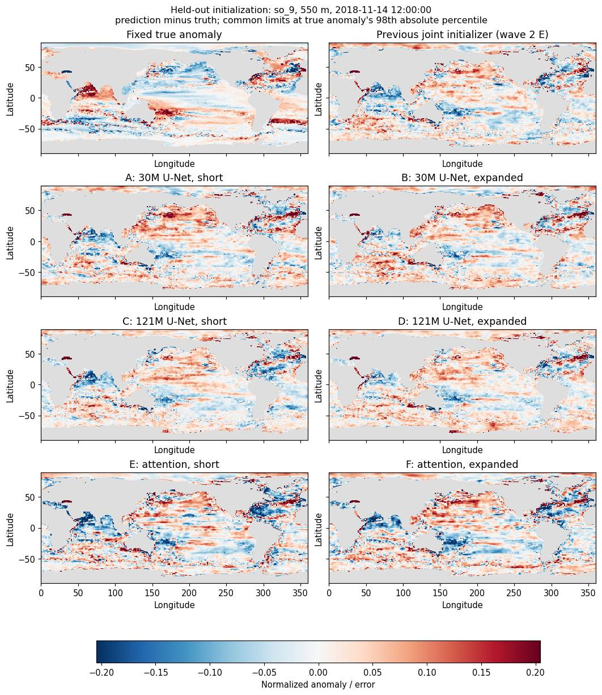
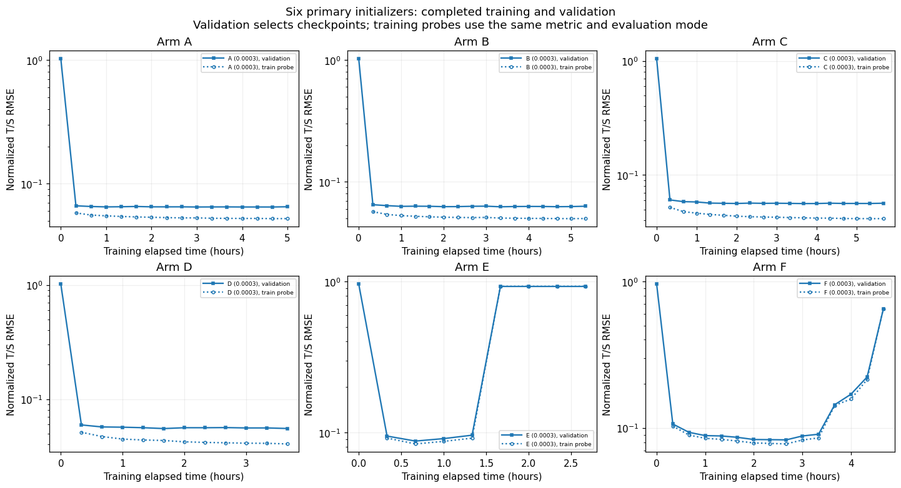

<!--
SPDX-FileCopyrightText: 2026 Samudra Authors
SPDX-License-Identifier: CC-BY-4.0
-->

# Initializer capacity and history: wave 3

**The initializer was capacity-limited, but making it larger does not remove the initialization problem.** A wider ConvNeXt U-Net with expanded surface/forcing history reduced held-out initialization T/S RMSE by **13.0%** and 30-day RMSE by **9.0%** relative to the 30M baseline, using the same pretrained dynamics. An independent seed reproduced the 30-day gain (**8.7%**). Matched joint adaptation improved the wider model further. The custom Swin-style models underperformed and became unstable; a lower constant learning rate did not rescue them.

These are **OM4 one-degree, five-day, model-world results**, not observational reconstruction skill, daily SSH/SST skill, ERA5 transfer, or a continuous long rollout. The task uses independent 30-day forecast windows with supplied OM4 forcing. The result motivates the next observational experiment; it does not answer whether a model trained on OM4 can reconstruct an observed ocean interior.

## What changed

The [locked plan](../surface-wave3-plan.md) crossed architecture with two input bundles:

| Arm | Initializer | Parameters | Available history |
| --- | --- | ---: | --- |
| A | ConvNeXt U-Net | 30.2M | Six SSH/SST frames spanning 25 days |
| B | Same U-Net | 31.2M | 19 SSH/SST and historical forcing frames spanning 90 days |
| C | Wider ConvNeXt U-Net | 120.6M | Short |
| D | Wider ConvNeXt U-Net | 121.7M | Expanded |
| E | Custom Swin-style hierarchy | 122.1M | Short |
| F | Same attention model | 122.2M | Expanded |

Expanded inputs change surface history and forcing history together, as requested. Their benefit cannot be attributed separately to either component. Historical forcings are OM4 `tauuo`, `tauvo`, and `hfds`, through initialization only. Forecast evolution receives interval-start OM4 forcing. No OISST or DUACS fields are supplied as future forcings.

Each initializer reconstructs two full ocean states: T/S/U/V at 19 depths plus SSH. Known SST/SSH are copied exactly. The wider U-Net uses widths 256/384/512/768 versus 128/192/256/384. The attention model uses patch size 2, widths 192/384/768/1024, depths 2/2/12/2, shifted 6×6 windows, global attention at the coarsest level, and a multiscale decoder with a full-resolution input skip. It has periodic longitude handling and avoids attention across the latitude wrap. This is a custom study implementation, not a pretrained standard Swin checkpoint.

All arms use the same eligible training windows and existing normalization. Training dates are 1975–2013; checkpoint selection uses 11 validation origins in 2013–2014. Evaluation uses the [same 99 origins](../surface-wave3-origins.json), November 2014–November 2022. Earlier validation/test history is read-only context. Primary checkpoints are selected by reconstruction validation; alternatives are chosen using full original-checkpoint forecast validation before held-out evaluation.

The reported T/S score is the square root of equally weighted temperature and salinity normalized MSE, averaging channels and origins after wet-cell, latitude-weighted spatial reduction. Temperature excludes the supplied surface channel; salinity includes all 19 levels. This is not volume-weighted heat/salt error. The training loss supervises all interior T/S/U/V channels; joint training uses full-variable six-step forecast loss plus 0.1 reconstruction loss.

## Held-out results

Lower is better. All rows below use the same 99 origins and fixed pretrained evolution.

| Arm | Initialization | Day 5 | Day 30 | Day-30 reduction versus A |
| --- | ---: | ---: | ---: | ---: |
| A | 0.07249 | 0.07269 | 0.07603 | — |
| B | 0.06940 | 0.06968 | 0.07371 | 3.1% |
| C | 0.06503 | 0.06586 | 0.07097 | 6.7% |
| D | **0.06305** | **0.06381** | **0.06918** | **9.0%** |
| E | 0.09158 | 0.09055 | 0.09059 | −19.1% |
| F | 0.08724 | 0.08647 | 0.08749 | −15.1% |



Capacity alone helps: C improves initialization by 10.3% and day 30 by 6.7% over A. Expanded history helps the small model by 4.3% at initialization and 3.1% at day 30; it also helps the wide model (D versus C). D combines both improvements. This comparison has a common maximum wall-time budget and stopping rule, not equal FLOPs or equal updates.

Paired calendar-year bootstrap intervals (4,000 draws) put D's initialization reduction at **12.1–14.0%** and its day-30 reduction at **8.3–9.8%**. These intervals measure variation across the observed evaluation years, not training-seed uncertainty, and are not corrected for all comparisons. There are only nine calendar-year blocks, with partial endpoint years.

The independent seed gives A/D day-30 scores of 0.07613/0.06948, an **8.7%** reduction (year-block interval 7.7–9.7%). Two seeds support reproducibility of this comparison, but do not characterize the full distribution over training runs.



## Joint adaptation and where forecast error comes from

A and D each received three hours of matched joint training at 1e-4, starting from their original selected initializer and the same pretrained dynamics. Starting checkpoints remained eligible. Qualification-updated weights were not used.

| Model | Initialization | Day 5 | Day 30 |
| --- | ---: | ---: | ---: |
| A + fixed dynamics | 0.07249 | 0.07269 | 0.07603 |
| A, joint adaptation | 0.07187 | 0.07042 | 0.07208 |
| D + fixed dynamics | 0.06305 | 0.06381 | 0.06918 |
| D, joint adaptation | 0.06392 | 0.06310 | **0.06653** |
| True interior + fixed dynamics | 0 | 0.01921 | 0.04224 |
| True interior, hold fixed | 0 | 0.01618 | 0.05397 |

D's joint score is 12.5% better than original A at day 30, **7.7% better than jointly adapted A**, and 3.8% better than D with fixed dynamics. The earlier wave-2 joint initializer E scored 0.07084 at day 30; D joint is about 6.1% lower. That historical comparison spans implementations; the numerical batch-shape check below bounds a small control difference rather than claiming bitwise equivalence.

Initialization is still a major bottleneck: the true-interior control is much better than inferred-interior forecasting. However, these errors cannot be additively partitioned into an initialization term and a dynamics term. Joint D slightly worsens reconstruction (0.06305 → 0.06392) while improving day-30 prediction. Adaptation changes the state/dynamics pair, not just reconstruction fidelity.

Holding the inferred state fixed gives day-30 error 0.07757 for D and 0.07660 for joint D; evolving those states improves both. With true initialization, persistence wins at day 5, while evolution wins at day 30. True-interior day-30 error is 0.04440 under adapted A dynamics and 0.04190 under adapted D dynamics, versus 0.04224 under the original dynamics. Adaptation does not uniformly improve the true-state dynamics control.



## Is the remaining error mostly blur?

No. D improves spatial pattern agreement despite having slightly *less* anomaly amplitude than A. For three-cell high-pass anomalies, temperature correlation increases from 0.535 to 0.624 and salinity from 0.274 to 0.407. The corresponding predicted/true anomaly RMS ratios change from 1.010 to 0.946 for temperature and 0.939 to 0.844 for salinity. Thus adding fine-scale amplitude alone would not fix the errors.

For D, persistent time-mean bias contributes about **48% of temperature MSE and 37% of salinity MSE**; temporal pattern mismatch contributes 42% and 50%; temporal amplitude mismatch contributes 10% and 13%. These are algebraic decompositions across the sampled origins, not causal attributions or irreducible-error estimates. Absolute bias and pattern-error contributions both fall relative to A.

Maps use the prespecified middle origin and an unchanged saved truth/climatology reference from wave 2. Each panel uses the same color limits and mask. The previous wave-2 E is a jointly adapted model; wave-3 A–F are pre-joint initializers.





Additional maps: [105 m temperature anomaly](figures/maps-thetao_5-anomaly.jpg), [105 m temperature error](figures/maps-thetao_5-error.jpg), [550 m temperature error](figures/maps-thetao_9-error.jpg), [105 m salinity anomaly](figures/maps-so_5-anomaly.jpg), [105 m salinity error](figures/maps-so_5-error.jpg), [550 m salinity anomaly](figures/maps-so_9-anomaly.jpg).

## Depth, region, surface and velocity diagnostics

Improvements extend across the sampled depths. Examples of global physical RMSE:

| Variable/depth | A initial | D initial | A day 30 | D day 30 |
| --- | ---: | ---: | ---: | ---: |
| Temperature, 105 m (°C) | 0.656 | 0.539 | 0.687 | 0.616 |
| Temperature, 550 m (°C) | 0.305 | 0.276 | 0.335 | 0.310 |
| Temperature, 1850 m (°C) | 0.0958 | 0.0861 | 0.1001 | 0.0916 |
| Salinity, 105 m | 0.1280 | 0.1128 | 0.1317 | 0.1201 |
| Salinity, 550 m | 0.0514 | 0.0450 | 0.0565 | 0.0516 |
| Salinity, 1850 m | 0.0178 | 0.0153 | 0.0188 | 0.0175 |

At day 30, combined T/S error falls from 0.07030 to 0.06358 in the tropics and from 0.07942 to 0.07249 outside ±20°. Joint D reaches 0.06078/0.06993 respectively. Full depth and regional tables are included in the artifacts; these selected rows are not a claim that every channel, origin or lead improves.

Day-30 SST RMSE is 0.521°C for A, 0.516°C for D and 0.497°C for joint D; SSH RMSE is 3.245, 3.217 and 3.079 cm respectively. Initial SST/SSH error is exactly zero by construction, not evidence of inference skill. These are five-day OM4 outputs, not the proposed daily observational metrics.

Initial U/V RMSE improves from 2.52/1.94 cm/s for A to 1.88/1.49 cm/s for D. D's initial velocity RMS ratios are 0.987/0.982; joint D's day-30 velocity RMSE is 3.05/2.78 cm/s, with RMS ratios 0.962/0.945. These are model-supervised velocity diagnostics. Near-unit RMS does not establish realistic current patterns, conservation, or retention under observation-only fine-tuning.

## Optimization, cost and reliability

All twelve 30-minute pilots completed. The predefined family rule selected constant 3e-4 for all architectures. Primaries used two RTX PRO 6000 Blackwell GPUs, global batch eight, AdamW weight decay 0.01, BF16 and gradient clipping at one; eight training hours maximum, validation every 20 minutes, checkpointing every three minutes, and stopping after six non-improving checks after at least two hours.

The CNNs reached stable reconstruction-validation plateaus. E and F improved initially, then both training-probe and validation error rose sharply. Their selected earlier checkpoints were preserved. Fresh lower-rate runs at 1e-4 did not improve the selected results: E/F day-30 errors were 0.09955/0.09109. Lowering the rate was an additional tuning expenditure, not part of the original equal-protocol matrix. Neither attention model qualified for a replica or joint adaptation under the prespecified competitive-alternative rule. This is an unsuccessful architecture/optimizer recipe, not evidence that attention cannot solve the task.



[Primary and lower-rate attention curves](figures/optimization/learning-time.png) and [curves against optimizer updates](figures/optimization/learning-updates.png) include the additional tuning attempts.

All attempts, including pilots, qualification, failed/cancelled work, stability runs and the numerical reference check, total **122.19 allocated GPU-hours across 68 Slurm submissions**. All jobs are terminal and the wave queue is empty. Eight RTX GPUs ran concurrently; there was no eight-GPU configuration blocker. H200 plumbing was qualified, but capacity was unavailable when useful; the final scientific comparisons all use matched two-RTX evaluations. Earlier H200 checks showed small T/S but larger individual velocity differences, so cross-hardware equality was not assumed.

The [job ledger](artifacts/job-ledger.csv) records states, allocation cost, output paths and W&B run identifiers. Some cancelled jobs never created a W&B run. Early qualification attempts failed a conservative GPU-cache capacity check; the runtime was corrected before pilots/production. One final C evaluation failed with CUDA illegal memory access before producing metrics; an unchanged fresh evaluation succeeded. The failed attempt and both job IDs are retained. No production training checkpoint was discarded or replaced because of held-out performance.

The frozen evolution control matches across all current runs. A strict comparison with the old four-GPU evaluation initially differed at two origins because their tail-batch sizes changed under two-GPU sharding. A supplemental four-GPU evaluation matched all 10,692 old per-origin control rows at the original tolerances. The [batch audit](artifacts/batch-reference-audit.json) verifies that the two-GPU discrepancies are confined to those expected origins; tolerances were not relaxed. The final comparisons remain consistently two-GPU.

## Suggested next wave

1. Use D as the working initializer for the prepared observational task, with A retained as a control. Test whether the capacity/history gains transfer to observed surface inputs and independently evaluated future interiors. Preserve the daily SSH/SST objective when daily data and forcing are ready.
2. Split the expanded-input bundle into longer surface history versus historical forcing. The present experiment intentionally varies them together and cannot identify which information matters.
3. Target persistent interior bias and pattern error, not sharpness alone. Evaluate deeper/larger receptive-field CNNs or explicit temporal encoding against D, and retain the true-interior and persistence controls.
4. Treat attention as an optimization investigation before allocating another full comparison: inspect activation/gradient behavior, use a documented stable schedule and normalization recipe, and require sustained validation improvement beyond the pilot window. Do not promote the current Swin implementation on parameter count alone.

The next wave should still distinguish model-world feasibility from observational generalization. Daily surface supervision, observational initialization/domain shift, interior velocity retention without velocity observations, finer-resolution data and long continuous stability remain unresolved.

## Artifacts and reproduction

The [source checksum manifest](artifacts/source.sha256) inventories the original bytes. Large CSV/JSONL/NPZ files are gzip-compressed and split into ≤240 KiB pieces; `read_bytes` transparently reconstructs them. It is normal for a manifest path such as `raw/A/heldout-rank0.csv` to exist as `.gz.part000`, `.gz.part001`, etc. instead of a standalone CSV.

Artifacts include all twelve full per-origin/per-channel evaluations (640,332 rows each), training/validation traces, temporal and spatial decompositions, snapshots, source manifests, checkpoint lineage, selections locked before evaluation, pilot results, job requests and accounting, and the failed C evaluation logs. The [lineage audit](artifacts/lineage-audit.json) binds each evaluated checkpoint to its training job, source path and SHA-256. Checkpoints remain at the documented Torch scratch paths; they have not been independently archived to durable storage.

The immutable training/evaluation producer was [96aea56c](https://github.com/m2lines/Samudra/commit/96aea56c92d82aa18255942b3443b87ed510a589), with the Rust loader already incorporated. Later PR commits add analysis and reporting. Data are `/scratch/jr7309/data/om4_onedeg_v3/{OM4.zarr,OM4_means.zarr,OM4_stds.zarr}`. The pretrained dynamics source is `/scratch/jr7309/runs/2026-09-18-surface-wave1/ar/pretrain-best.pt`; exact image/layer/checkpoint fingerprints are preserved in the manifests.

From the repository root, regenerate the audits, tables and figures without GPUs or Torch access:

```bash
uv run python scripts/reproduce_initializer_report.py --output /tmp/wave3-reproduced
```

The command verifies every packed source checksum, audits all 99 origins and controls, reconciles error decompositions, computes paired year-block intervals, checks the historical batch-shape reference and regenerates maps/learning/forecast figures. It also reads the already-published wave-2 reference assets. Selection and metric definitions are in the linked plan and code; the held-out data were not used to select checkpoints or follow-ups.
